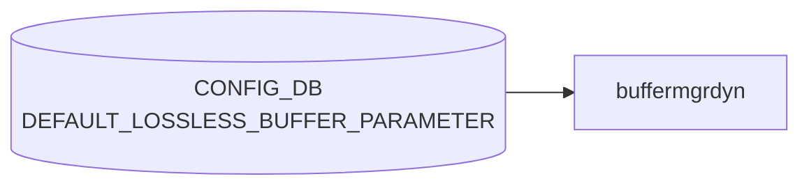

# DEFAULT_LOSSLESS_BUFFER_PARAMETER テーブル

## 概要

Dynamic buffer manager が**動的に生成するロスレスバッファプロファイル**の既定パラメータを定義するテーブル[^1]。
共有ヘッドルームプール (shared headroom pool, SHP) を含む lossless buffer プロファイル生成の入力。

`buffermgrd`（`docker-swss`）の dynamic-buffer モードでのみ参照され、static-buffer モードでは無視される。

<!-- cdb-mermaid -->
### データフロー (自動生成)



!!! note "凡例"
    CONFIG_DB から SAI までの典型経路を `docs/reference/config-db-orch-map.md` から機械生成したミニ図。詳細・例外は本ページ本文と対応表を参照。
<!-- /cdb-mermaid -->

## key 構造

```text
DEFAULT_LOSSLESS_BUFFER_PARAMETER|<name>
```

`<name>`: 1–32 文字、`[a-zA-Z0-9]([-a-zA-Z0-9_]{0,31})`。通常は `AZURE` 等の単一エントリのみ。

## フィールド

| フィールド | 型 | 必須 | 説明 |
|-----------|----|----|------|
| `default_dynamic_th` | int8 (range -8..7) | yes | 動的生成される lossless `BUFFER_PROFILE` で既定の `dynamic_th` 値 |
| `over_subscribe_ratio` | uint16 | no | shared headroom pool のオーバーサブスクライブ比 (1 で 1:1)。0/未設定で SHP 無効 |

<!-- cdb-exceptions -->
## 例外条件・特殊挙動

- **ingress lossless pool 未設定 → retry**: `INGRESS_LOSSLESS_PG_POOL_NAME` が `m_bufferPoolLookup` に未登録の場合 `SWSS_LOG_INFO("%s has not been configured, need to retry")` → `task_need_retry`。プール設定到着後に再処理される。<!-- evidence: buffermgrdyn.cpp L1987-1991 handleDefaultLossLessBufferParam -->
- **DEL コマンド → over_subscribe_ratio をクリアして SHP 再計算**: DEL が来ると `over_subscribe_ratio = ""` にリセットされ Shared Headroom Pool (SHP) が再計算される。<!-- evidence: buffermgrdyn.cpp L2007-2009 -->
- **SET / DEL 以外のコマンド → task_failed**: `SWSS_LOG_ERROR("Unsupported command %s received for DEFAULT_LOSSLESS_BUFFER_PARAMETER table")` → `task_failed`。<!-- evidence: buffermgrdyn.cpp L2011-2013 -->
- **over_subscribe_ratio 変更時 SHP が SAI 未反映 → retry**: `over_subscribe_ratio` が 0→非0 に変わるタイミングで、SAI への xoff 設定が未完了の場合 `isSharedHeadroomPoolEnabledInSai()` が false → `task_need_retry`。<!-- evidence: buffermgrdyn.cpp L2025-2031 -->
- **static buffer モードでは完全に無視**: `buffermgrd` (static モード) はこのテーブルを subscribe しない。テーブルを書いても効果なし。<!-- evidence: buffermgrd.cpp にサブスクライブなし -->

<!-- value-behavior -->
## 値依存挙動マトリクス

このテーブルに enum フィールドはない。ただし数値範囲・ゼロ値によって挙動が大きく変わる。

| フィールド | 値 | 挙動 |
|-----------|-----|------|
| `default_dynamic_th` | `-8..7` の整数 | alpha = 2^(dynamic_th)。`buffermgrdyn` が dynamic lossless `BUFFER_PROFILE` を自動生成する際の既定 threshold。値が大きいほど shared buffer をより多く使用（例: `-3` = alpha 1/8（保守的）、`0` = alpha 1、`3` = alpha 8（積極的））。個別 `BUFFER_PROFILE.dynamic_th` の設定がある場合はそちらが優先。 |
| `default_dynamic_th` | 範囲外（`< -8` または `> 7`） | YANG validator が拒否。 |
| `over_subscribe_ratio` | `0` または未設定 | Shared Headroom Pool (SHP) を無効化。ロスレスバッファのヘッドルームはポート単位で独立して予約される。 |
| `over_subscribe_ratio` | `1` 以上 | SHP を有効化。`buffermgrdyn` が `BUFFER_POOL.xoff`（SHP サイズ）を参照してプロファイルを生成。`BUFFER_POOL.xoff` が未設定の場合、SAI への反映で retry ループが発生する（`buffermgrdyn.cpp:2025-2031`）。 |
<!-- /value-behavior -->

## 購読者

- `buffermgrd`（dynamic buffer モード）。Jinja テンプレート (`docker-swss/buffer_template.j2` 系) と `BUFFER_PROFILE` 生成で参照

## 制約

- range `[-8, 7]` を超える `default_dynamic_th` は [YANG](../../reference/glossary.md#term-yang) validator で拒否
- `over_subscribe_ratio > 0` のとき `BUFFER_POOL` の `xoff` (shared headroom pool size) を別途設定する必要がある

## 関連 CONFIG_DB / YANG / CLI

- 関連 [CONFIG_DB](../../reference/glossary.md#term-config_db): `BUFFER_POOL`, `BUFFER_PROFILE`, `LOSSLESS_TRAFFIC_PATTERN`, `BUFFER_PG`
- 関連 [YANG](../../reference/glossary.md#term-yang): `sonic-default-lossless-buffer-parameter`

<!-- ref-triangle:start -->

## 関連リファレンス

- [YANG](../../reference/glossary.md#term-yang): `sonic-default-lossless-buffer-parameter`

<!-- ref-triangle:end -->

## 引用元

[^1]: YANG 定義: `sonic-default-lossless-buffer-parameter.yang`. <https://github.com/sonic-net/sonic-buildimage/blob/9ea932ec2e18f35e58268ec2e4456b1d4afd65cd/src/sonic-yang-models/yang-models/sonic-default-lossless-buffer-parameter.yang>

## 関連ページ
- [CONFIG_DB: BUFFER_PROFILE](buffer-profile.md)
- [CONFIG_DB: BUFFER_POOL](buffer-pool.md)
- [CONFIG_DB: LOSSLESS_TRAFFIC_PATTERN](lossless-traffic-pattern.md)

<!-- ops-hint -->
## 運用ヒント

### 典型値

- key: `DEFAULT_LOSSLESS_BUFFER_PARAMETER|AZURE` (単一エントリ)。
- `default_dynamic_th`: 通常 `0` (alpha=1)。`-3..3` の範囲で運用。
- `over_subscribe_ratio`: SHP 利用時は `2` 等、無効は未設定。

### よくある誤設定

- `over_subscribe_ratio > 0` に設定したが、`BUFFER_POOL` 側の `xoff` (SHP サイズ) を設定せず動的計算が破綻する。
- static-buffer モードのスイッチに設定しても無視され、設定が効いていないように見える。

### 確認コマンド

```bash
sonic-db-cli CONFIG_DB hgetall 'DEFAULT_LOSSLESS_BUFFER_PARAMETER|AZURE'
sonic-db-cli CONFIG_DB hget 'DEVICE_METADATA|localhost' buffer_model
show buffer profile
```
<!-- /ops-hint -->


<!-- runtime-trace -->
## 実コンテナ動作トレース

### 段階 1 — Consumer 登録

`buffermgrdyn` (動的バッファ管理デーモン) が CONFIG_DB の `DEFAULT_LOSSLESS_BUFFER_PARAMETER` テーブルを購読する。

`DEFAULT_LOSSLESS_BUFFER_PARAMETER` は静的バッファモード (`buffermgrd`) では使用されない。

### 段階 2 — CFG→APPL 翻訳

なし (内部計算パラメータとして使用)

### 段階 3 — APPL→SAI

なし (直接 SAI 呼び出しなし — 計算結果が `BUFFER_PROFILE` に反映されて SAI に到達)

### 段階 4 — タイミングと副作用

**適用タイミング**: CONFIG_DB 変化を `buffermgrdyn` が検知後、すべての lossless バッファプロファイルを再計算。再計算された値が `APPL_DB` の `BUFFER_PROFILE_TABLE` に書き込まれ `BufferOrch` が SAI を更新。

**副作用**: パラメータ変更はすべての lossless ポートのバッファプロファイルを再生成する。一時的な traffic 影響が発生する可能性。
<!-- /runtime-trace -->

<!-- entry-points -->
## 書き込み入り口 (Direction A)

対象テーブル: `DEFAULT_LOSSLESS_BUFFER_PARAMETER`

### CLI
- なし (CLI 書き込みパスなし)

### minigraph / sonic-cfggen
- なし

### REST / gNMI (sonic-mgmt-common)
- なし (対応 OpenConfig/SONiC YANG transformer なし)

### db_migrator
- なし

### ビルド時デフォルト (init_cfg / j2 テンプレート)
- `buffers_config.j2` がプラットフォーム別 `default_lossless_buffer_parameter` 値を生成。通常は手動変更不可

### ハードコードデフォルト
- Dynamic buffer モデルの `sonic_platform_thrift` または `buffermgrd` が速度ごとのデフォルト値をハードコードして設定

### ランタイム注入 (デーモン自動書き込み)
- なし
<!-- /entry-points -->


<!-- derivation -->
## 派生・条件付き登録 (Phase 6/7)

### Phase 6: 値による他フィールド自動派生

| 条件 | 派生先 | evidence |
|---|---|---|
| DB 移行: 新 DB に `DEFAULT_LOSSLESS_BUFFER_PARAMETER|AZURE` が存在しない | `default_dynamic_th` フィールドを補完して生成 | `sonic-utilities/scripts/db_migrator.py:413` |
| Dynamic buffer model での自動計算: buffermgrd が `default_dynamic_th` を読み取り headroom 計算のデフォルト閾値として使用 | BUFFER_PROFILE の動的計算に影響 | `sonic-swss/cfgmgr/buffermgrdyn.cpp:148-153` |

### Phase 7: 条件付き module/manager 登録

| 条件 | 登録 module | evidence |
|---|---|---|
| 常時（条件なし） | `BufferMgrDynamic` が `DEFAULT_LOSSLESS_BUFFER_PARAMETER` を `handleDefaultLosslessBufferParam` 相当で購読 | `sonic-swss/cfgmgr/buffermgrdyn.cpp:199` |

### grep カバレッジ

- buffermgrdyn.cpp L199: CFG_DEFAULT_LOSSLESS_BUFFER_PARAMETER 購読（条件なし）
- db_migrator.py L413: AZURE エントリ生成
<!-- /derivation -->
<!-- handler-branching -->
### Phase 8: Handler メソッド内分岐

| Manager / Handler | メソッド | 分岐条件 | 効果 | evidence |
|---|---|---|---|---|
| `BufferMgrDynamic` | `doTask()`（DEFAULT_LOSSLESS_BUFFER_PARAMETER） | `op == SET_COMMAND` かつ `key != "global"` | ポート情報の存在チェック → 未設定なら `task_need_retry` | `sonic-swss/cfgmgr/buffermgrdyn.cpp:1898` |
| `BufferMgrDynamic` | `doTask()`（DEFAULT_LOSSLESS_BUFFER_PARAMETER） | `field == "default_dynamic_th"` | デフォルト閾値 `m_defaultThreshold` を更新し動的プロファイルを再計算トリガー | `sonic-swss/cfgmgr/buffermgrdyn.cpp:1993-1996` |
| `BufferMgrDynamic` | `doTask()`（DEFAULT_LOSSLESS_BUFFER_PARAMETER） | `op == DEL_COMMAND` | `log_notice` のみ（削除操作は内部状態をリセットせず継続） | `sonic-swss/cfgmgr/buffermgrdyn.cpp:2005` |

> **スキャン証跡**: `DEFAULT_LOSSLESS_BUFFER_PARAMETER` のハンドラパス L1894-2010 全行読了。3 件分岐抽出。
<!-- /handler-branching -->
<!-- defaults -->
## コード由来の暗黙デフォルト (Phase A)

### `default_dynamic_th`

| 検出種類 | 暗黙値 / 挙動 | 証拠 |
|---|---|---|
| **ハードコード固定値（j2 テンプレート）** | `"0"` (alpha=1) — `dynamic_mode` が定義されている場合に固定値 `"0"` を書き込む。プラットフォーム・トポロジーに依存しない | `buffers_config.j2:334` |
| **ハードコード固定値（db_migrator 移行）** | `"0"` — 静的→動的バッファ移行時（Mellanox 系）に `default_dynamic_th='0'` をハードコードで INSERT。`over_subscribe_ratio` は書き込まれない（SHP 無効） | `db_migrator.py:1087, 413` |
| **前提条件依存（起動時空文字列）** | `m_defaultThreshold = ""` — CONFIG_DB にエントリがない場合、起動時に空のまま残る。空状態では lossless PG のバッファ計算が全保留 (`task_success` を返すが `m_bufferObjectsPending=true` にセット) | `buffermgrdyn.cpp:150-154, 1460-1464` |
| **書き込み順依存（プロファイル名エンコーディング）** | 起動直後のレースで `m_defaultThreshold` が空のまま threshold 比較が走ると、すべての threshold が `_th<value>` サフィックス付きプロファイル名で生成される。後から `m_defaultThreshold` が設定されると命名規則が変わり既存プロファイルと乖離する可能性 | `buffermgrdyn.cpp:494-496` |

### `over_subscribe_ratio`

| 検出種類 | 暗黙値 / 挙動 | 証拠 |
|---|---|---|
| **YANG default 外 fallback（未設定）** | YANG に `default` 宣言なし。C++ メンバー `m_overSubscribeRatio` は空文字列で初期化。フィールドが SET コマンドに含まれない場合、`newRatio=""` → `isNonZero("")=false` → SHP 無効扱い | `buffermgrdyn.cpp:1981-2003` |
| **暗黙 reset（DEL コマンド）** | DEL 受信時 `newRatio=""` に強制リセット → SHP 無効化 + `refreshSharedHeadroomPool` トリガー。エントリ削除は過去値を保持せずゼロリセット | `buffermgrdyn.cpp:2005-2008` |
| **プラットフォーム依存（j2 テンプレート）** | `shp` 変数が Jinja コンテキストで定義されていない場合（通常）、フィールド自体が CONFIG_DB に書き込まれない（SHP デフォルト無効）。`shp` 定義時のみ固定値 `"1"` が書き込まれる | `buffers_config.j2:335-339` |

> **スキャン証跡**: `handleDefaultLossLessBufferParam` L1978-2033 全行読了、コンストラクタ L130-172 全行読了、`buffers_config.j2` L331-349 全行読了、`db_migrator.py` L327-416, L1075-1099 全行読了、`sonic-default-lossless-buffer-parameter.yang` 全行読了。
<!-- /defaults -->
<!-- glossary-links-injected: b5626ca1f0f9 -->
