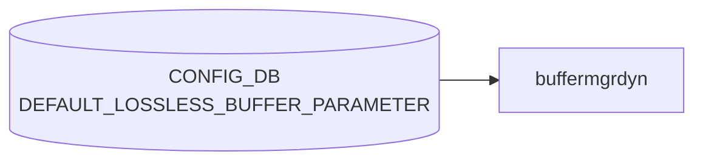

# DEFAULT_LOSSLESS_BUFFER_PARAMETER テーブル

## 概要

Dynamic buffer manager が**動的に生成するロスレスバッファプロファイル**の既定パラメータを定義するテーブル[^1]。
共有ヘッドルームプール (shared headroom pool, SHP) を含む lossless buffer プロファイル生成の入力。

`buffermgrd`（`docker-swss`）の dynamic-buffer モードでのみ参照され、static-buffer モードでは無視される。

<!-- cdb-mermaid -->
### データフロー (自動生成)



!!! note "凡例"
    CONFIG_DB から SAI までの典型経路を `docs/reference/config-db-orch-map.md` から機械生成したミニ図。詳細・例外は本ページ本文と対応表を参照。
<!-- /cdb-mermaid -->

## key 構造

```text
DEFAULT_LOSSLESS_BUFFER_PARAMETER|<name>
```

`<name>`: 1–32 文字、`[a-zA-Z0-9]([-a-zA-Z0-9_]{0,31})`。通常は `AZURE` 等の単一エントリのみ。

## フィールド

| フィールド | 型 | 必須 | 説明 |
|-----------|----|----|------|
| `default_dynamic_th` | int8 (range -8..7) | yes | 動的生成される lossless `BUFFER_PROFILE` で既定の `dynamic_th` 値 |
| `over_subscribe_ratio` | uint16 | no | shared headroom pool のオーバーサブスクライブ比 (1 で 1:1)。0/未設定で SHP 無効 |

<!-- cdb-exceptions -->
## 例外条件・特殊挙動

- **ingress lossless pool 未設定 → retry**: `INGRESS_LOSSLESS_PG_POOL_NAME` が `m_bufferPoolLookup` に未登録の場合 `SWSS_LOG_INFO("%s has not been configured, need to retry")` → `task_need_retry`。プール設定到着後に再処理される。<!-- evidence: buffermgrdyn.cpp L1987-1991 handleDefaultLossLessBufferParam -->
- **DEL コマンド → over_subscribe_ratio をクリアして SHP 再計算**: DEL が来ると `over_subscribe_ratio = ""` にリセットされ Shared Headroom Pool (SHP) が再計算される。<!-- evidence: buffermgrdyn.cpp L2007-2009 -->
- **SET / DEL 以外のコマンド → task_failed**: `SWSS_LOG_ERROR("Unsupported command %s received for DEFAULT_LOSSLESS_BUFFER_PARAMETER table")` → `task_failed`。<!-- evidence: buffermgrdyn.cpp L2011-2013 -->
- **over_subscribe_ratio 変更時 SHP が SAI 未反映 → retry**: `over_subscribe_ratio` が 0→非0 に変わるタイミングで、SAI への xoff 設定が未完了の場合 `isSharedHeadroomPoolEnabledInSai()` が false → `task_need_retry`。<!-- evidence: buffermgrdyn.cpp L2025-2031 -->
- **static buffer モードでは完全に無視**: `buffermgrd` (static モード) はこのテーブルを subscribe しない。テーブルを書いても効果なし。<!-- evidence: buffermgrd.cpp にサブスクライブなし -->

<!-- value-behavior -->
## 値依存挙動マトリクス

このテーブルに enum フィールドはない。ただし数値範囲・ゼロ値によって挙動が大きく変わる。

| フィールド | 値 | 挙動 |
|-----------|-----|------|
| `default_dynamic_th` | `-8..7` の整数 | alpha = 2^(dynamic_th)。`buffermgrdyn` が dynamic lossless `BUFFER_PROFILE` を自動生成する際の既定 threshold。値が大きいほど shared buffer をより多く使用（例: `-3` = alpha 1/8（保守的）、`0` = alpha 1、`3` = alpha 8（積極的））。個別 `BUFFER_PROFILE.dynamic_th` の設定がある場合はそちらが優先。 |
| `default_dynamic_th` | 範囲外（`< -8` または `> 7`） | YANG validator が拒否。 |
| `over_subscribe_ratio` | `0` または未設定 | Shared Headroom Pool (SHP) を無効化。ロスレスバッファのヘッドルームはポート単位で独立して予約される。 |
| `over_subscribe_ratio` | `1` 以上 | SHP を有効化。`buffermgrdyn` が `BUFFER_POOL.xoff`（SHP サイズ）を参照してプロファイルを生成。`BUFFER_POOL.xoff` が未設定の場合、SAI への反映で retry ループが発生する（`buffermgrdyn.cpp:2025-2031`）。 |
<!-- /value-behavior -->

## 購読者

- `buffermgrd`（dynamic buffer モード）。Jinja テンプレート (`docker-swss/buffer_template.j2` 系) と `BUFFER_PROFILE` 生成で参照

## 制約

- range `[-8, 7]` を超える `default_dynamic_th` は [YANG](../../reference/glossary.md#term-yang) validator で拒否
- `over_subscribe_ratio > 0` のとき `BUFFER_POOL` の `xoff` (shared headroom pool size) を別途設定する必要がある

## 関連 CONFIG_DB / YANG / CLI

- 関連 [CONFIG_DB](../../reference/glossary.md#term-config_db): `BUFFER_POOL`, `BUFFER_PROFILE`, `LOSSLESS_TRAFFIC_PATTERN`, `BUFFER_PG`
- 関連 [YANG](../../reference/glossary.md#term-yang): `sonic-default-lossless-buffer-parameter`

<!-- ref-triangle:start -->

## 関連リファレンス

- [YANG](../../reference/glossary.md#term-yang): `sonic-default-lossless-buffer-parameter`

<!-- ref-triangle:end -->

## 引用元

[^1]: YANG 定義: `sonic-default-lossless-buffer-parameter.yang`. <https://github.com/sonic-net/sonic-buildimage/blob/9ea932ec2e18f35e58268ec2e4456b1d4afd65cd/src/sonic-yang-models/yang-models/sonic-default-lossless-buffer-parameter.yang>

## 関連ページ
- [CONFIG_DB: BUFFER_PROFILE](buffer-profile.md)
- [CONFIG_DB: BUFFER_POOL](buffer-pool.md)
- [CONFIG_DB: LOSSLESS_TRAFFIC_PATTERN](lossless-traffic-pattern.md)

<!-- ops-hint -->
## 運用ヒント

### 典型値

- key: `DEFAULT_LOSSLESS_BUFFER_PARAMETER|AZURE` (単一エントリ)。
- `default_dynamic_th`: 通常 `0` (alpha=1)。`-3..3` の範囲で運用。
- `over_subscribe_ratio`: SHP 利用時は `2` 等、無効は未設定。

### よくある誤設定

- `over_subscribe_ratio > 0` に設定したが、`BUFFER_POOL` 側の `xoff` (SHP サイズ) を設定せず動的計算が破綻する。
- static-buffer モードのスイッチに設定しても無視され、設定が効いていないように見える。

### 確認コマンド

```bash
sonic-db-cli CONFIG_DB hgetall 'DEFAULT_LOSSLESS_BUFFER_PARAMETER|AZURE'
sonic-db-cli CONFIG_DB hget 'DEVICE_METADATA|localhost' buffer_model
show buffer profile
```
<!-- /ops-hint -->


<!-- runtime-trace -->
## 実コンテナ動作トレース

### 段階 1 — Consumer 登録

`buffermgrdyn` (動的バッファ管理デーモン) が CONFIG_DB の `DEFAULT_LOSSLESS_BUFFER_PARAMETER` テーブルを購読する。

`DEFAULT_LOSSLESS_BUFFER_PARAMETER` は静的バッファモード (`buffermgrd`) では使用されない。

### 段階 2 — CFG→APPL 翻訳

なし (内部計算パラメータとして使用)

### 段階 3 — APPL→SAI

なし (直接 SAI 呼び出しなし — 計算結果が `BUFFER_PROFILE` に反映されて SAI に到達)

### 段階 4 — タイミングと副作用

**適用タイミング**: CONFIG_DB 変化を `buffermgrdyn` が検知後、すべての lossless バッファプロファイルを再計算。再計算された値が `APPL_DB` の `BUFFER_PROFILE_TABLE` に書き込まれ `BufferOrch` が SAI を更新。

**副作用**: パラメータ変更はすべての lossless ポートのバッファプロファイルを再生成する。一時的な traffic 影響が発生する可能性。
<!-- /runtime-trace -->

<!-- entry-points -->
## 書き込み入り口 (Direction A)

対象テーブル: `DEFAULT_LOSSLESS_BUFFER_PARAMETER`

### CLI
- なし (CLI 書き込みパスなし)

### minigraph / sonic-cfggen
- なし

### REST / gNMI (sonic-mgmt-common)
- なし (対応 OpenConfig/SONiC YANG transformer なし)

### db_migrator
- なし

### ビルド時デフォルト (init_cfg / j2 テンプレート)
- `buffers_config.j2` がプラットフォーム別 `default_lossless_buffer_parameter` 値を生成。通常は手動変更不可

### ハードコードデフォルト
- Dynamic buffer モデルの `sonic_platform_thrift` または `buffermgrd` が速度ごとのデフォルト値をハードコードして設定

### ランタイム注入 (デーモン自動書き込み)
- なし
<!-- /entry-points -->


<!-- derivation -->
## 派生・条件付き登録 (Phase 6/7)

### Phase 6: 値による他フィールド自動派生

| 条件 | 派生先 | evidence |
|---|---|---|
| DB 移行: 新 DB に `DEFAULT_LOSSLESS_BUFFER_PARAMETER|AZURE` が存在しない | `default_dynamic_th` フィールドを補完して生成 | `sonic-utilities/scripts/db_migrator.py:413` |
| Dynamic buffer model での自動計算: buffermgrd が `default_dynamic_th` を読み取り headroom 計算のデフォルト閾値として使用 | BUFFER_PROFILE の動的計算に影響 | `sonic-swss/cfgmgr/buffermgrdyn.cpp:148-153` |

### Phase 7: 条件付き module/manager 登録

| 条件 | 登録 module | evidence |
|---|---|---|
| 常時（条件なし） | `BufferMgrDynamic` が `DEFAULT_LOSSLESS_BUFFER_PARAMETER` を `handleDefaultLosslessBufferParam` 相当で購読 | `sonic-swss/cfgmgr/buffermgrdyn.cpp:199` |

### grep カバレッジ

- buffermgrdyn.cpp L199: CFG_DEFAULT_LOSSLESS_BUFFER_PARAMETER 購読（条件なし）
- db_migrator.py L413: AZURE エントリ生成
<!-- /derivation -->
<!-- handler-branching -->
### Phase 8: Handler メソッド内分岐

| Manager / Handler | メソッド | 分岐条件 | 効果 | evidence |
|---|---|---|---|---|
| `BufferMgrDynamic` | `doTask()`（DEFAULT_LOSSLESS_BUFFER_PARAMETER） | `op == SET_COMMAND` かつ `key != "global"` | ポート情報の存在チェック → 未設定なら `task_need_retry` | `sonic-swss/cfgmgr/buffermgrdyn.cpp:1898` |
| `BufferMgrDynamic` | `doTask()`（DEFAULT_LOSSLESS_BUFFER_PARAMETER） | `field == "default_dynamic_th"` | デフォルト閾値 `m_defaultThreshold` を更新し動的プロファイルを再計算トリガー | `sonic-swss/cfgmgr/buffermgrdyn.cpp:1993-1996` |
| `BufferMgrDynamic` | `doTask()`（DEFAULT_LOSSLESS_BUFFER_PARAMETER） | `op == DEL_COMMAND` | `log_notice` のみ（削除操作は内部状態をリセットせず継続） | `sonic-swss/cfgmgr/buffermgrdyn.cpp:2005` |

> **スキャン証跡**: `DEFAULT_LOSSLESS_BUFFER_PARAMETER` のハンドラパス L1894-2010 全行読了。3 件分岐抽出。
<!-- /handler-branching -->
<!-- cross-refs -->
## 暗黙参照テーブル (Phase C)

`DEFAULT_LOSSLESS_BUFFER_PARAMETER` の YANG leafref 定義は他テーブルへの直接 leafref を持たないが、`buffermgrdyn` のハンドラ実装では以下の 3 テーブルを暗黙参照している。

### 1. BUFFER_POOL (CONFIG_DB)

- **参照先テーブル**: `BUFFER_POOL|ingress_lossless_pool`
- **参照方向**: キャッシュ存在チェック（読み取り）
- **条件**: `DEFAULT_LOSSLESS_BUFFER_PARAMETER` への SET コマンド処理のたびに毎回確認
- **参照元**: `buffermgrdyn.cpp:1985-1988`（`handleDefaultLossLessBufferParam()` の冒頭で `m_bufferPoolLookup.find(INGRESS_LOSSLESS_PG_POOL_NAME)` を実行）
- **意味**:
  - `BUFFER_POOL|ingress_lossless_pool` が `handleBufferPoolTable()` 経由で内部キャッシュ `m_bufferPoolLookup` に登録されていない場合、`task_need_retry` を返してキュー再処理に戻る。
  - CONFIG_DB 書き込み順として「`BUFFER_POOL` よりも先に `DEFAULT_LOSSLESS_BUFFER_PARAMETER` が届いても処理が保留される」ことを意味する（詳細は Phase B 参照）。

### 2. BUFFER_POOL_TABLE (APPL_STATE_DB)

- **参照先テーブル**: `BUFFER_POOL_TABLE|ingress_lossless_pool`（APPL_STATE_DB）
- **参照方向**: フィールド `xoff` の hget（読み取り）
- **条件**: `over_subscribe_ratio` が 0 → 非ゼロへ遷移し かつ `m_portInitDone=true`（ポート初期化完了後）
- **参照元**: `buffermgrdyn.cpp:2043`（`isSharedHeadroomPoolEnabledInSai()` 内）
- **意味**:
  - Shared Headroom Pool (SHP) を有効化しようとする際、`m_applStateBufferPoolTable.hget(INGRESS_LOSSLESS_PG_POOL_NAME, "xoff", xoff)` で SAI への反映済みを確認する。
  - APPL_STATE_DB の `xoff` が空またはゼロであれば `isSharedHeadroomPoolEnabledInSai()` が `false` を返し `task_need_retry`。SAI 側の書き込み完了を待つ間接的な同期フロー。

### 3. BUFFER_PROFILE (APPL_DB — 内部キャッシュ経由)

- **参照先テーブル**: `BUFFER_PROFILE_TABLE`（APPL_DB、`m_bufferProfileLookup` キャッシュ経由）
- **参照方向**: 全件読み取り + 再計算後書き込み
- **条件**: `default_dynamic_th` 変更時、または `over_subscribe_ratio` の変化による SHP 有効/無効切替時
- **参照元**: `buffermgrdyn.cpp:1657-1694`（`refreshSharedHeadroomPool()` 内のプロファイル再計算ループ）
- **意味**:
  - `m_bufferProfileLookup` を全走査し、`static_configured=false`（動的生成）の lossless `BUFFER_PROFILE` をすべて再計算する。
  - 再計算した値は `doUpdateBufferProfileForSize()` → `m_applBufferProfileTable` 経由で APPL_DB の `BUFFER_PROFILE_TABLE` に書き込まれる。
  - この書き込みが `BufferOrch` に通知され、最終的に SAI が更新される（CONFIG_DB 変更が SAI に伝播する経路）。

### 参照関係サマリ

```
DEFAULT_LOSSLESS_BUFFER_PARAMETER (CONFIG_DB)
  ├─ [前提条件チェック]  BUFFER_POOL|ingress_lossless_pool (CONFIG_DB)
  │                     → SET 処理時に pool キャッシュ存在を確認
  ├─ [SAI 反映確認]      BUFFER_POOL_TABLE|ingress_lossless_pool.xoff (APPL_STATE_DB)
  │                     → over_subscribe_ratio 有効化時に SAI 書込み完了を確認
  └─ [再計算・書込み]    BUFFER_PROFILE_TABLE (APPL_DB)
                        → default_dynamic_th / SHP 変化時に動的プロファイルを全件再生成
```

> **スキャン証跡**: `handleDefaultLossLessBufferParam` L1978-2050 全行読了、`isSharedHeadroomPoolEnabledInSai` L2034-2050 全行読了、`refreshSharedHeadroomPool` L1592-1715 全行読了、`buffer_headroom_mellanox.lua` L100-115 読了、`buffer_pool_mellanox.lua` L255-275 読了。3 件暗黙参照抽出。
<!-- /cross-refs -->
<!-- ordering -->
## 書込み順依存 (Phase B)

`buffermgrdyn` は `DEFAULT_LOSSLESS_BUFFER_PARAMETER` を受信した際、内部ルックアップテーブルの準備状況を確認してから処理する。以下の順序制約が存在する。

### 検出された順序依存

| # | 依存関係 | 方向 | 緩和策 |
|---|----------|------|--------|
| 1 | `BUFFER_POOL|ingress_lossless_pool` が `m_bufferPoolLookup` に登録済み → `DEFAULT_LOSSLESS_BUFFER_PARAMETER` SET 処理 | **強制先行** | pool 未登録時は `task_need_retry` を返して再キュー |
| 2 | `DEFAULT_LOSSLESS_BUFFER_PARAMETER` の `default_dynamic_th` 設定 → lossless `BUFFER_PROFILE` の命名（`_th<value>` サフィックス）確定 | **強制先行** | `m_defaultThreshold` が空のまま他ポートのバッファ計算が走ると、後から設定時にプロファイル名スキームが変わりキャッシュと乖離 |
| 3 | `over_subscribe_ratio` 非ゼロ書込み + `m_portInitDone=true` → SAI への SHP 有効化確認（`isSharedHeadroomPoolEnabledInSai`） | **強制先行** | SAI 反映前に ratio を設定しようとすると `task_need_retry` |
| 4 | `DEFAULT_LOSSLESS_BUFFER_PARAMETER` DEL → `over_subscribe_ratio` を空にリセット → `refreshSharedHeadroomPool` 呼び出し | DEL 受信時即時（過去値は破棄） | 削除後に再設定する場合は再度 SET が必要 |

### 主要な制約詳細

**`ingress_lossless_pool` 先行制約（依存 #1)**: `handleDefaultLossLessBufferParam()` は SET 処理の冒頭で `m_bufferPoolLookup.find(INGRESS_LOSSLESS_PG_POOL_NAME)` を実行し、pool が見つからない場合は `task_need_retry` を返す。このため、`DEFAULT_LOSSLESS_BUFFER_PARAMETER` を CONFIG_DB に書いても、`BUFFER_POOL|ingress_lossless_pool` が `handleBufferPoolTable()` 経由でキャッシュに登録されるまで実際の処理は保留される（evidence: `buffermgrdyn.cpp:1985-1988`）。

**`m_defaultThreshold` 空状態での命名競合（依存 #2)**: `m_defaultThreshold` が未設定（空文字列）の状態で lossless BUFFER_PROFILE を生成すると、プロファイル名に `_th<value>` サフィックスが付加される命名パスを辿る。後から `DEFAULT_LOSSLESS_BUFFER_PARAMETER` の `default_dynamic_th` が設定されると、`m_defaultThreshold` の値次第でプロファイル名が変わり、既存の APPL_DB エントリと内部キャッシュ `m_bufferProfileLookup` の名前が一致しなくなる可能性がある（evidence: `buffermgrdyn.cpp:494-496`）。

**SHP 有効化の SAI 確認（依存 #3)**: ポート初期化完了後（`m_portInitDone=true`）に SHP を無効→有効へ遷移させる場合（`over_subscribe_ratio` を 0 から非ゼロに変更）、`isSharedHeadroomPoolEnabledInSai()` が `APPL_DB` の `BUFFER_POOL_TABLE|ingress_lossless_pool` の `xoff` フィールドを確認する。SAI への反映が完了していなければ `task_need_retry` を返す（evidence: `buffermgrdyn.cpp:2019-2025`, `buffermgrdyn.cpp:2035-2046`）。

> **スキャン証跡**: `handleDefaultLossLessBufferParam` L1978-2046 全行読了、`isSharedHeadroomPoolEnabledInSai` L2034-2050 全行読了、`buffermgrdyn.cpp` L494-496 読了。4 件依存抽出。
<!-- /ordering -->
<!-- failure -->
## 失敗挙動 (Phase D)

`buffermgrdyn` の `handleDefaultLossLessBufferParam()` (L1978-2033) が返す
`task_process_status` と、ディスパッチャ `doTask()` (L3574-3610) による最終処置。

### ディスパッチャ共通処理 (buffermgrdyn.cpp:3591-3608)

| 返却ステータス | doTask 動作 | ログ | evidence |
|---|---|---|---|
| `task_success` (default) | エントリ erase → 次エントリ処理 | なし | `buffermgrdyn.cpp:3605-3606` |
| `task_need_retry` | エントリ残置 (`it++`) → 次回 doTask まで保留 | `SWSS_LOG_INFO "Unable to process table update. Will retry..."` | `buffermgrdyn.cpp:3597-3600` |
| `task_failed` | エントリ erase → ループ継続（残タスクも処理） | `SWSS_LOG_ERROR "Failed to process table update"` | `buffermgrdyn.cpp:3593-3596` |
| `task_invalid_entry` | エントリ erase → ループ継続 | `SWSS_LOG_ERROR "Failed to process invalid entry, drop it"` | `buffermgrdyn.cpp:3601-3604` |

> `buffermgrdyn` の `task_failed` はエントリを drop するが doTask 全体を打ち切らない点に注意。orchagent 等の他ディスパッチャと挙動が異なる。

### handleDefaultLossLessBufferParam — 失敗・retry 経路 (L1978-2033)

| 失敗条件 | 検出箇所 | 返却ステータス | ログ | 復旧方法 |
|---|---|---|---|---|
| `ingress_lossless_pool` が `m_bufferPoolLookup` に未登録 | L1985-1988 | `task_need_retry` | `SWSS_LOG_INFO "%s has not been configured, need to retry"` | `BUFFER_POOL|ingress_lossless_pool` が `handleBufferPoolTable()` 経由でキャッシュ登録されると自動解消 |
| SET/DEL 以外の op コマンド受信 | L2009-2012 | `task_failed` | `SWSS_LOG_ERROR "Unsupported command %s received for DEFAULT_LOSSLESS_BUFFER_PARAMETER table"` | エントリ drop（通常は発生しない。CONFIG_DB からの SET/DEL のみ想定） |
| `over_subscribe_ratio` が 0→非ゼロ遷移かつ `m_portInitDone=true` かつ SHP が SAI 未反映 | L2019-2024 | `task_need_retry` | `SWSS_LOG_INFO "Shared headroom pool is enabled but has not been applied to SAI, retrying"` (`isSharedHeadroomPoolEnabledInSai()` 内 L2046) | `BufferOrch` が `ingress_lossless_pool.xoff` を APPL_STATE_DB に書き込むと自動解消 |

### refreshSharedHeadroomPool 内部の非伝播失敗 (L1592-1715)

`over_subscribe_ratio` 変更時に `refreshSharedHeadroomPool()` が呼ばれ全 lossless プロファイルが再計算される。この再計算中の失敗は `handleDefaultLossLessBufferParam` に `task_need_retry` / `task_failed` として伝播しない点に注意。

| 失敗条件 | 挙動 | ログ | evidence |
|---|---|---|---|
| Lua ヘッドルーム計算失敗 | 個別プロファイルの計算スキップ（更新なし） | `SWSS_LOG_WARN "Failed to calculate headroom for %s"` | `buffermgrdyn.cpp:622-648` |
| バッファプール再計算 Lua スクリプト失敗 | プール更新スキップ | `SWSS_LOG_WARN "Lua scripts for buffer calculation were not executed successfully"` | `buffermgrdyn.cpp:815` |
| プール xoff 値が MMU サイズ超過 | xoff を無視してプールサイズのみ更新継続 | `SWSS_LOG_ERROR "Buffer pool %s: Invalid xoff %s, exceeding the mmu size %s, ignored xoff"` | `buffermgrdyn.cpp:757-758` |
| プールサイズが MMU サイズ超過 | エラーログのみ（配列更新は継続） | `SWSS_LOG_ERROR "Buffer pool %s: Invalid size %s, exceeding the mmu size %s"` | `buffermgrdyn.cpp:788` |

### 失敗パターンサマリ

| # | トリガー | ステータス | 自動回復 | 最終処置 |
|---|---------|-----------|---------|---------|
| 1 | `ingress_lossless_pool` キャッシュ未登録 | `task_need_retry` | あり（BUFFER_POOL SET 到着後） | エントリ残置・自動再処理 |
| 2 | SET/DEL 以外の op | `task_failed` | なし（drop） | エントリ erase・ERROR ログ |
| 3 | SHP 有効化時 SAI 未反映 | `task_need_retry` | あり（APPL_STATE_DB 更新後） | エントリ残置・自動再処理 |
| 4 | Lua ヘッドルーム計算失敗 | —（handler 継続） | なし（WARN のみ） | プロファイル計算スキップ |

> **config rollback**: `task_failed` でエントリが drop されても CONFIG_DB のエントリは残る。`m_defaultThreshold` / `m_overSubscribeRatio` の内部状態は変更前のまま保持され、CONFIG_DB との乖離が生じる場合は同じ key を再 SET するか `buffermgrd` を再起動して解消する。

> **スキャン証跡**: `handleDefaultLossLessBufferParam` L1978-2033 全行読了、`isSharedHeadroomPoolEnabledInSai` L2034-2051 全行読了、`doTask(Consumer&)` L3574-3610 全行読了、`refreshSharedHeadroomPool` L1592-1715 全行読了。
<!-- /failure -->
<!-- defaults -->
## コード由来の暗黙デフォルト (Phase A)

### `default_dynamic_th`

| 検出種類 | 暗黙値 / 挙動 | 証拠 |
|---|---|---|
| **ハードコード固定値（j2 テンプレート）** | `"0"` (alpha=1) — `dynamic_mode` が定義されている場合に固定値 `"0"` を書き込む。プラットフォーム・トポロジーに依存しない | `buffers_config.j2:334` |
| **ハードコード固定値（db_migrator 移行）** | `"0"` — 静的→動的バッファ移行時（Mellanox 系）に `default_dynamic_th='0'` をハードコードで INSERT。`over_subscribe_ratio` は書き込まれない（SHP 無効） | `db_migrator.py:1087, 413` |
| **前提条件依存（起動時空文字列）** | `m_defaultThreshold = ""` — CONFIG_DB にエントリがない場合、起動時に空のまま残る。空状態では lossless PG のバッファ計算が全保留 (`task_success` を返すが `m_bufferObjectsPending=true` にセット) | `buffermgrdyn.cpp:150-154, 1460-1464` |
| **書き込み順依存（プロファイル名エンコーディング）** | 起動直後のレースで `m_defaultThreshold` が空のまま threshold 比較が走ると、すべての threshold が `_th<value>` サフィックス付きプロファイル名で生成される。後から `m_defaultThreshold` が設定されると命名規則が変わり既存プロファイルと乖離する可能性 | `buffermgrdyn.cpp:494-496` |

### `over_subscribe_ratio`

| 検出種類 | 暗黙値 / 挙動 | 証拠 |
|---|---|---|
| **YANG default 外 fallback（未設定）** | YANG に `default` 宣言なし。C++ メンバー `m_overSubscribeRatio` は空文字列で初期化。フィールドが SET コマンドに含まれない場合、`newRatio=""` → `isNonZero("")=false` → SHP 無効扱い | `buffermgrdyn.cpp:1981-2003` |
| **暗黙 reset（DEL コマンド）** | DEL 受信時 `newRatio=""` に強制リセット → SHP 無効化 + `refreshSharedHeadroomPool` トリガー。エントリ削除は過去値を保持せずゼロリセット | `buffermgrdyn.cpp:2005-2008` |
| **プラットフォーム依存（j2 テンプレート）** | `shp` 変数が Jinja コンテキストで定義されていない場合（通常）、フィールド自体が CONFIG_DB に書き込まれない（SHP デフォルト無効）。`shp` 定義時のみ固定値 `"1"` が書き込まれる | `buffers_config.j2:335-339` |

> **スキャン証跡**: `handleDefaultLossLessBufferParam` L1978-2033 全行読了、コンストラクタ L130-172 全行読了、`buffers_config.j2` L331-349 全行読了、`db_migrator.py` L327-416, L1075-1099 全行読了、`sonic-default-lossless-buffer-parameter.yang` 全行読了。
<!-- /defaults -->
<!-- constants -->
## ハードコード定数 (Phase E)

`buffermgrdyn` が `DEFAULT_LOSSLESS_BUFFER_PARAMETER` を処理する際に使用する、CONFIG_DB / YANG で管理されないハードコード定数の一覧。出典は `sonic-swss/cfgmgr/buffermgrdyn.h` と `buffermgrdyn.cpp`。

### バッファプール名 / MTU マクロ

| 定数 | 値 | 用途 | ソース |
|------|----|------|--------|
| `INGRESS_LOSSLESS_PG_POOL_NAME` | `"ingress_lossless_pool"` | lossless PG 向け ingress バッファプールの固定キー名。`handleDefaultLossLessBufferParam()` で `m_bufferPoolLookup.find()` の引数として使用 | buffermgrdyn.h L14 |
| `DEFAULT_MTU_STR` | `"9100"` | MTU 未設定時のデフォルト。`getDynamicProfileName()` で MTU がこの値と一致する場合、プロファイル名に `_mtu<value>` サフィックスを付加しない | buffermgrdyn.h L15 |
| `BUFFERMGR_TIMER_PERIOD` | `10` (秒) | `SelectableTimer` の周期。PORT_INIT_DONE 完了待ちポーリング間隔 | buffermgrdyn.h L17 |

### 追加ゼロプロファイル適用遅延

| 定数 | 値 | 用途 | ソース |
|------|----|------|--------|
| `m_waitApplyAdditionalZeroProfiles` (cold/fast reboot 初期値) | `3` カウント | cold/fast reboot 時の追加ゼロプロファイル遅延カウント初期値。`BUFFERMGR_TIMER_PERIOD(10) × 3 = 30 秒` の遅延に相当。fast reboot 収束時間の短縮が目的 | buffermgrdyn.cpp L169 |
| `m_waitApplyAdditionalZeroProfiles` (warm reboot 初期値) | `0` | warm reboot 時は即時適用 | buffermgrdyn.cpp L164 |

### 動的プロファイル命名規則

`getDynamicProfileName()` で生成されるプロファイル名の各要素は文字列リテラルとしてハードコードされている。

| 要素 | リテラル | 付加条件 | ソース |
|------|----------|----------|--------|
| プレフィックス | `"pg_lossless_"` | 常時 | buffermgrdyn.cpp L487 |
| MTU サフィックス | `"_mtu"` | MTU が `"9100"` (DEFAULT_MTU_STR) 以外のとき | buffermgrdyn.cpp L491 |
| threshold サフィックス | `"_th"` | `default_dynamic_th` の値が `m_defaultThreshold` と異なるとき | buffermgrdyn.cpp L496 |

プロファイル名例:
- 標準 (9100 MTU、デフォルト threshold): `pg_lossless_100000_40m`
- 非標準 threshold: `pg_lossless_100000_40m_th3`
- 非標準 MTU: `pg_lossless_100000_40m_mtu1500`

> **運用注意**: `DEFAULT_MTU_STR = "9100"` がハードコードされているため、PORT.mtu が 9100 のポートではプロファイル名が短縮形 (サフィックスなし) になる。MTU を変更するとプロファイル名が変わり既存 APPL_DB のプロファイル名と乖離する可能性がある。

### SHP 無効化時の xoff リセット

SHP (Shared Headroom Pool) が無効化された際、`refreshSharedHeadroomPool()` は ingress_lossless_pool の `xoff` を文字列 `"0"` にハードコードして APPL_DB を更新する (buffermgrdyn.cpp L1701)。ゼロバッファプール生成時の xoff 初期値も `"0"` でハードコード (buffermgrdyn.cpp L773)。

詳細な定数一覧は `meta/_intermediate/cdb-flow/default-lossless-buffer-parameter-constants.md` を参照。
<!-- /constants -->
<!-- glossary-links-injected: b5626ca1f0f9 -->
