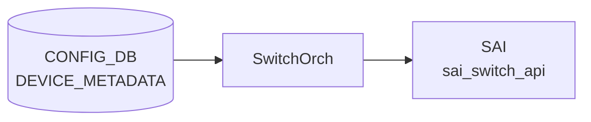

# DEVICE_METADATA テーブル

## 概要

装置全体のメタ情報を保持する [CONFIG_DB](../../reference/glossary.md#term-config_db) テーブル。hostname、ベース MAC、[BGP](../../reference/glossary.md#term-bgp) ASN、ハードウェア SKU、プラットフォーム、デバイス役割 (`type`)、サブタイプ (`DualToR` / `SmartSwitch` 等)、deployment ID、buffer model（dynamic / traditional）、synchronous mode、[YANG](../../reference/glossary.md#term-yang) 検証の有効化、syslog / [FRR](../../reference/glossary.md#term-frr) 関連スイッチなど、SONiC の起動時挙動を決める根本設定を 1 行 (`localhost`) にまとめる。`bmc` キーは BMC 接続情報を別ロウで持つ[^1]。

各 Orch / daemon は起動時に `DEVICE_METADATA|localhost` を読み出す。`bgpcfgd` は `bgp_asn` と `frr_mgmt_framework_config` を、`orchagent` は `synchronous_mode` と `async_swss_rec`、`buffer_model` を、`hostcfgd` は `hostname` と `timezone` を、それぞれ依存リソースの初期化に用いる。

<!-- cdb-mermaid -->
### データフロー (自動生成)



!!! note "凡例"
    CONFIG_DB から SAI までの典型経路を `docs/reference/config-db-orch-map.md` から機械生成したミニ図。詳細・例外は本ページ本文と対応表を参照。
<!-- /cdb-mermaid -->

## key 構造

```
DEVICE_METADATA|localhost
DEVICE_METADATA|bmc
```

key は固定文字列 `localhost`（必須）と任意の `bmc`。

## フィールド一覧 (localhost)

| フィールド | 型 | デフォルト | 説明 |
|-----------|----|-----------|------|
| `hwsku` | string (`stypes:hwsku`) | - | ハードウェア SKU 識別子。ポートレイアウトと能力を決める |
| `asic_id` | string (1..16) | - | [SAI](../../reference/glossary.md#term-sai) 初期化に使う ASIC 識別子 |
| `default_bgp_status` | enum `up` / `down` | `up` | 起動時の [BGP](../../reference/glossary.md#term-bgp) daemon 既定状態 |
| `docker_routing_config_mode` | string `separated`/`unified`/`split`/`split-unified` | `unified` | [FRR](../../reference/glossary.md#term-frr) 設定生成モード |
| `hostname` | string (`stypes:hostname`) | - | システムホスト名 |
| `platform` | string (1..255) | - | プラットフォーム識別子（vendor + model） |
| `mac` | mac-address | - | システムベース MAC |
| `default_pfcwd_status` | enum `disable`/`enable` | `disable` | 起動時の [PFC](../../reference/glossary.md#term-pfc) watchdog 既定状態 |
| `bgp_asn` | as-number | - | [BGP](../../reference/glossary.md#term-bgp) 自律システム番号 |
| `deployment_id` | uint32 | - | 同一ネットワークセグメントを括る deployment ID |
| `type` | enum (ToRRouter / LeafRouter / SpineRouter / SmartSwitchDPU / 等) | - | デバイス役割 |
| `buffer_model` | string `dynamic`/`traditional` | - | バッファ計算モード。Mellanox 等は dynamic |
| `frr_mgmt_framework_config` | boolean | `false` | true で `sonic-frr-mgmt-framework` が [FRR](../../reference/glossary.md#term-frr) 設定を担当、false で `bgpcfgd` がテンプレ展開 |
| `synchronous_mode` | enum `enable`/`disable` | `enable` | [orchagent](../../reference/glossary.md#term-orchagent) ASIC 同期モード |
| `yang_config_validation` | enum `enable`/`disable` | `disable` | `config_db.json` 直接ロード時の [YANG](../../reference/glossary.md#term-yang) 検証 |
| `cloudtype` | string | - | デプロイ先のクラウドタイプ |
| `region` | string | - | 地理的リージョン |
| `sub_role` | string | - | ASIC が FrontEnd か BackEnd かを示す |
| `downstream_subrole` | string | - | 下流接続デバイスのサブ役割 |
| `resource_type` | string | - | リソースタイプ分類 |
| `mgmt_type` | string | - | 管理タイプ |
| `cluster` | string | - | 所属クラスタ名 |
| `subtype` | string `DualToR`/`SmartSwitch`/`Supervisor`/`UpstreamLC`/`DownstreamLC` | - | 特殊トポロジ種別 |
| `peer_switch` | hostname | - | dual ToR 構成のピアホスト名 |
| `storage_device` | boolean | - | ストレージバックエンドに繋がるか |
| `asic_name` | string | - | VoQ スイッチでグローバル DB key の修飾子に使う ASIC 名 |
| `switch_id` | uint16 | - | ベンダ固有スイッチ ID |
| `switch_type` | string `chassis-packet`/`fabric`/`npu`/`voq`/`dpu`/`dummy-sup` | - | スイッチタイプ。既定は npu |
| `max_cores` | uint8 | - | VoQ シャーシの最大 core 数 |
| `dhcp_server` | admin_mode | - | 組み込み DHCP サーバを有効化するか |
| `bgp_adv_lo_prefix_as_128` | boolean | - | true で Loopback0 IPv6 /128 をそのまま広告（既定は /64 化） |
| `suppress-fib-pending` | enum `enabled`/`disabled` | `disabled` | BGP suppress-fib-pending。`enabled` には `synchronous_mode = enable` が必須 |
| `async_swss_rec` | enum `enabled`/`disabled` | `disabled` | [orchagent](../../reference/glossary.md#term-orchagent) の swss.rec 非同期記録 |
| `rack_mgmt_map` | string (0..128) | - | rack 管理マップ情報 |
| `timezone` | timezone-name (1..255) | `UTC` | TZ database name (`Europe/Stockholm` 等) |
| `create_only_config_db_buffers` | boolean | - | true で [CONFIG_DB](../../reference/glossary.md#term-config_db) のバッファ設定通り、false で [SAI](../../reference/glossary.md#term-sai) から読んだ最大バッファを生成 |
| `supporting_bulk_counter_groups` | leaf-list string | - | バルク操作対応のカウンタグループ名 |
| `bgp_router_id` | ipv4-address | - | BGP router-id |
| `chassis_hostname` | hostname | - | このリニアカード／スーパバイザが属するシャーシ名 |
| `slice_type` | string | - | デバイスのメタデータタグ |
| `location_type` | string | - | 場所タイプ |
| `nexthop_group` | enum `enabled`/`disabled` | `disabled` | Nexthop Group 機能。boot 時のみ反映 |
| `ring_thread_enabled` | boolean | `false` | OrchDaemon の gRingMode |
| `t2_group_asns` | leaf-list as-number | - | 同一グループ内の ASN |
| `anchor_route_source` | leaf-list string | - | anchor route のソース |
| `orch_northbond_dash_zmq_enabled` | boolean | `true` | [APPL_DB](../../reference/glossary.md#term-appl_db) [DASH](../../reference/glossary.md#term-dash) テーブル ZMQ |
| `orch_northbond_route_zmq_enabled` | boolean | `false` | [APPL_DB](../../reference/glossary.md#term-appl_db) ROUTE テーブル ZMQ |
| `syslog_with_osversion` | boolean | `false` | syslog に OS version を付加 |
| `syslog_counter` | boolean | `false` | syslog counter |
| `has_sonic_dhcpv4_relay` | boolean_type | `false` | DHCPv4 relay プロセスを有効化 |
| `zebra_nexthop` | enum `enabled`/`disabled` | `enabled` | next-hop group サポート。boot 時のみ反映 |

`type` の取りうる値は [YANG](../../reference/glossary.md#term-yang) の正規表現で 30 種以上が列挙されている (`ToRRouter|LeafRouter|SpineChassisFrontendRouter|...|UpperRegionalHub`)。詳細は `sonic-device_metadata.yang` を直接参照[^1]。

## フィールド一覧 (bmc)

| フィールド | 型 | 説明 |
|-----------|----|------|
| `bmc_if_name` | string (1..64) | BMC インタフェース名 |
| `bmc_if_addr` | ipv4-address | BMC インタフェース IP |
| `bmc_addr` | ipv4-address | BMC IP |
| `bmc_net_mask` | ipv4-address | BMC ネットマスク |

## 購読者

- `bgpcfgd` / `sonic-frr-mgmt-framework`: `bgp_asn`、`bgp_router_id`、`frr_mgmt_framework_config`、`docker_routing_config_mode`、`default_bgp_status`、`suppress-fib-pending`、`bgp_adv_lo_prefix_as_128`
- `orchagent`: `synchronous_mode`、`async_swss_rec`、`buffer_model`、`create_only_config_db_buffers`、`switch_type`、`asic_name`、`switch_id`、`ring_thread_enabled`、`nexthop_group`、`zebra_nexthop`
- `hostcfgd`: `hostname`、`timezone`、`syslog_*`
- `pfcwd` / `pfcwd_init`: `default_pfcwd_status`
- `dhcp_server` 系: `dhcp_server`、`has_sonic_dhcpv4_relay`

## 制約

- `suppress-fib-pending = enabled` のとき `synchronous_mode = enable` が必須（YANG `must`）
- `subtype = DualToR` のときは `peer_switch` の指定が運用上必要（[HLD](../../reference/glossary.md#term-hld) 由来、YANG では強制されない）
- `type` は enum パターンに合致する文字列のみ受理

## 関連 CONFIG_DB テーブル / YANG / CLI

- 関連 [CONFIG_DB](../../reference/glossary.md#term-config_db): `BGP_DEVICE_GLOBAL`（`bgp_asn` と独立した装置全体 BGP スイッチ）、`MGMT_PORT`（管理ポート設定）、`FEATURE`（docker on/off）
- 関連 CLI: [`config bgp`](../cli/config-bgp.md)、`config hostname`
- 関連 YANG: `sonic-device_metadata`（`hostname`、`hwsku`、`mode-status` などの typedef を当該モジュール内で定義）

<!-- ref-triangle:start -->

## 関連リファレンス

- YANG: [`sonic-device_metadata`](../yang/sonic-device_metadata.md)
- CLI: `config hostname` / [`config bgp`](../cli/config-bgp.md)

<!-- ref-triangle:end -->

## 引用元

[^1]: YANG 定義: `sonic-buildimage/src/sonic-yang-models/yang-models/sonic-device_metadata.yang` (sha `9ea932ec2e18f35e58268ec2e4456b1d4afd65cd`)。<https://github.com/sonic-net/sonic-buildimage/blob/9ea932ec2e18f35e58268ec2e4456b1d4afd65cd/src/sonic-yang-models/yang-models/sonic-device_metadata.yang>

<!-- evidence:
source: sonic-net/sonic-buildimage/src/sonic-yang-models/yang-models/sonic-device_metadata.yang#L37-L411 (sha: 9ea932ec2e18f35e58268ec2e4456b1d4afd65cd)
excerpt: |
  container DEVICE_METADATA {
      container localhost { ... 50+ leafs ... }
      container bmc { bmc_if_name, bmc_if_addr, bmc_addr, bmc_net_mask }
  }
reasoning: フィールド一覧と型・デフォルト・enum 値はこのモジュールの leaf 宣言から抽出
-->

<!-- evidence-rendered:start -->
??? note "📋 検証エビデンス: sonic-net/sonic-buildimage/src/sonic-yang-models/yang-models/sonic-device_metadata.yang#L37-L411 (sha: 9ea932ec2e18f35e58268ec2e4456b1d4afd65cd)"

    **出典**:

    `sonic-net/sonic-buildimage/src/sonic-yang-models/yang-models/sonic-device_metadata.yang#L37-L411 (sha: 9ea932ec2e18f35e58268ec2e4456b1d4afd65cd)`

    **抜粋**:

    ```text
    container DEVICE_METADATA {
        container localhost { ... 50+ leafs ... }
        container bmc { bmc_if_name, bmc_if_addr, bmc_addr, bmc_net_mask }
    }
    ```

    **判断根拠**: フィールド一覧と型・デフォルト・enum 値はこのモジュールの leaf 宣言から抽出

<!-- evidence-rendered:end -->

<!-- ops-hint -->
## 運用ヒント

### 典型値

- key 形式: `DEVICE_METADATA|localhost`。
- `hostname`、`hwsku`、`platform`、`mac`、`type` (`ToRRouter`/`LeafRouter`/`SpineRouter`)。
- `bgp_asn`、`default_bgp_status: up`、`default_pfcwd_status: enable`。

### よくある誤設定

- `hwsku` を実機と異なる値にすると [sonic-buildimage](../../reference/glossary.md#term-sonic-buildimage) 起動時に platform plugin が読み込まれず [orchagent](../../reference/glossary.md#term-orchagent) が起動しない。
- `type` を誤ると generic_config_updater のチェックや MC-[LAG](../../reference/glossary.md#term-lag) の role 判定で誤動作。

### 確認コマンド

```bash
sonic-db-cli CONFIG_DB hgetall 'DEVICE_METADATA|localhost'
show platform summary
```
<!-- /ops-hint -->

<!-- glossary-links-injected: aa8ce067a4a1 -->
