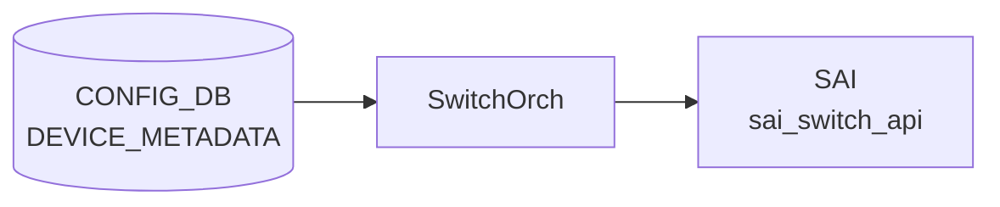

# DEVICE_METADATA テーブル

## 概要

装置全体のメタ情報を保持する [CONFIG_DB](../../reference/glossary.md#term-config_db) テーブル。hostname、ベース MAC、[BGP](../../reference/glossary.md#term-bgp) ASN、ハードウェア SKU、プラットフォーム、デバイス役割 (`type`)、サブタイプ (`DualToR` / `SmartSwitch` 等)、deployment ID、buffer model（dynamic / traditional）、synchronous mode、[YANG](../../reference/glossary.md#term-yang) 検証の有効化、syslog / [FRR](../../reference/glossary.md#term-frr) 関連スイッチなど、SONiC の起動時挙動を決める根本設定を 1 行 (`localhost`) にまとめる。`bmc` キーは BMC 接続情報を別ロウで持つ[^1]。

各 Orch / daemon は起動時に `DEVICE_METADATA|localhost` を読み出す。`bgpcfgd` は `bgp_asn` と `frr_mgmt_framework_config` を、`orchagent` は `synchronous_mode` と `async_swss_rec`、`buffer_model` を、`hostcfgd` は `hostname` と `timezone` を、それぞれ依存リソースの初期化に用いる。

<!-- cdb-mermaid -->
### データフロー (自動生成)



!!! note "凡例"
    CONFIG_DB から SAI までの典型経路を `docs/reference/config-db-orch-map.md` から機械生成したミニ図。詳細・例外は本ページ本文と対応表を参照。
<!-- /cdb-mermaid -->

## key 構造

```text
DEVICE_METADATA|localhost
DEVICE_METADATA|bmc
```

key は固定文字列 `localhost`（必須）と任意の `bmc`。

## フィールド一覧 (localhost)

| フィールド | 型 | デフォルト | 説明 |
|-----------|----|-----------|------|
| `hwsku` | string (`stypes:hwsku`) | - | ハードウェア SKU 識別子。ポートレイアウトと能力を決める |
| `asic_id` | string (1..16) | - | [SAI](../../reference/glossary.md#term-sai) 初期化に使う ASIC 識別子 |
| `default_bgp_status` | enum `up` / `down` | `up` | 起動時の [BGP](../../reference/glossary.md#term-bgp) daemon 既定状態 |
| `docker_routing_config_mode` | string `separated`/`unified`/`split`/`split-unified` | `unified` | [FRR](../../reference/glossary.md#term-frr) 設定生成モード |
| `hostname` | string (`stypes:hostname`) | - | システムホスト名 |
| `platform` | string (1..255) | - | プラットフォーム識別子（vendor + model） |
| `mac` | mac-address | - | システムベース MAC |
| `default_pfcwd_status` | enum `disable`/`enable` | `disable` | 起動時の [PFC](../../reference/glossary.md#term-pfc) watchdog 既定状態 |
| `bgp_asn` | as-number | - | [BGP](../../reference/glossary.md#term-bgp) 自律システム番号 |
| `deployment_id` | uint32 | - | 同一ネットワークセグメントを括る deployment ID |
| `type` | enum (ToRRouter / LeafRouter / SpineRouter / SmartSwitchDPU / 等) | - | デバイス役割 |
| `buffer_model` | string `dynamic`/`traditional` | - | バッファ計算モード。Mellanox 等は dynamic |
| `frr_mgmt_framework_config` | boolean | `false` | true で `sonic-frr-mgmt-framework` が [FRR](../../reference/glossary.md#term-frr) 設定を担当、false で `bgpcfgd` がテンプレ展開 |
| `synchronous_mode` | enum `enable`/`disable` | `enable` | [orchagent](../../reference/glossary.md#term-orchagent) ASIC 同期モード |
| `yang_config_validation` | enum `enable`/`disable` | `disable` | `config_db.json` 直接ロード時の [YANG](../../reference/glossary.md#term-yang) 検証 |
| `cloudtype` | string | - | デプロイ先のクラウドタイプ |
| `region` | string | - | 地理的リージョン |
| `sub_role` | string | - | ASIC が FrontEnd か BackEnd かを示す |
| `downstream_subrole` | string | - | 下流接続デバイスのサブ役割 |
| `resource_type` | string | - | リソースタイプ分類 |
| `mgmt_type` | string | - | 管理タイプ |
| `cluster` | string | - | 所属クラスタ名 |
| `subtype` | string `DualToR`/`SmartSwitch`/`Supervisor`/`UpstreamLC`/`DownstreamLC` | - | 特殊トポロジ種別 |
| `peer_switch` | hostname | - | dual ToR 構成のピアホスト名 |
| `storage_device` | boolean | - | ストレージバックエンドに繋がるか |
| `asic_name` | string | - | VoQ スイッチでグローバル DB key の修飾子に使う ASIC 名 |
| `switch_id` | uint16 | - | ベンダ固有スイッチ ID |
| `switch_type` | string `chassis-packet`/`fabric`/`npu`/`voq`/`dpu`/`dummy-sup` | - | スイッチタイプ。既定は npu |
| `max_cores` | uint8 | - | VoQ シャーシの最大 core 数 |
| `dhcp_server` | admin_mode | - | 組み込み DHCP サーバを有効化するか |
| `bgp_adv_lo_prefix_as_128` | boolean | - | true で Loopback0 IPv6 /128 をそのまま広告（既定は /64 化） |
| `suppress-fib-pending` | enum `enabled`/`disabled` | `disabled` | BGP suppress-fib-pending。`enabled` には `synchronous_mode = enable` が必須 |
| `async_swss_rec` | enum `enabled`/`disabled` | `disabled` | [orchagent](../../reference/glossary.md#term-orchagent) の swss.rec 非同期記録 |
| `rack_mgmt_map` | string (0..128) | - | rack 管理マップ情報 |
| `timezone` | timezone-name (1..255) | `UTC` | TZ database name (`Europe/Stockholm` 等) |
| `create_only_config_db_buffers` | boolean | - | true で [CONFIG_DB](../../reference/glossary.md#term-config_db) のバッファ設定通り、false で [SAI](../../reference/glossary.md#term-sai) から読んだ最大バッファを生成 |
| `supporting_bulk_counter_groups` | leaf-list string | - | バルク操作対応のカウンタグループ名 |
| `bgp_router_id` | ipv4-address | - | BGP router-id |
| `chassis_hostname` | hostname | - | このリニアカード／スーパバイザが属するシャーシ名 |
| `slice_type` | string | - | デバイスのメタデータタグ |
| `location_type` | string | - | 場所タイプ |
| `nexthop_group` | enum `enabled`/`disabled` | `disabled` | Nexthop Group 機能。boot 時のみ反映 |
| `ring_thread_enabled` | boolean | `false` | OrchDaemon の gRingMode |
| `t2_group_asns` | leaf-list as-number | - | 同一グループ内の ASN |
| `anchor_route_source` | leaf-list string | - | anchor route のソース |
| `orch_northbond_dash_zmq_enabled` | boolean | `true` | [APPL_DB](../../reference/glossary.md#term-appl_db) [DASH](../../reference/glossary.md#term-dash) テーブル ZMQ |
| `orch_northbond_route_zmq_enabled` | boolean | `false` | [APPL_DB](../../reference/glossary.md#term-appl_db) ROUTE テーブル ZMQ |
| `syslog_with_osversion` | boolean | `false` | syslog に OS version を付加 |
| `syslog_counter` | boolean | `false` | syslog counter |
| `has_sonic_dhcpv4_relay` | boolean_type | `false` | DHCPv4 relay プロセスを有効化 |
| `zebra_nexthop` | enum `enabled`/`disabled` | `enabled` | next-hop group サポート。boot 時のみ反映 |

`type` の取りうる値は [YANG](../../reference/glossary.md#term-yang) の正規表現で 30 種以上が列挙されている (`ToRRouter|LeafRouter|SpineChassisFrontendRouter|...|UpperRegionalHub`)。詳細は `sonic-device_metadata.yang` を直接参照[^1]。

## フィールド一覧 (bmc)

| フィールド | 型 | 説明 |
|-----------|----|------|
| `bmc_if_name` | string (1..64) | BMC インタフェース名 |
| `bmc_if_addr` | ipv4-address | BMC インタフェース IP |
| `bmc_addr` | ipv4-address | BMC IP |
| `bmc_net_mask` | ipv4-address | BMC ネットマスク |

<!-- value-behavior -->
## 値依存挙動マトリクス (v2 — 全 enum 値網羅)

### `default_bgp_status` 値別挙動

| 値 | 挙動 | evidence |
|----|------|---------|
| `up` (デフォルト) | `teamd_increase_retry_count.py:150` で `defaultBgpStatus = True` → BGP ネイバーを admin-up として扱い、PortChannel 起動完了後に BGP セッションを開始 | sonic-utilities/scripts/teamd_increase_retry_count.py:150 |
| `down` | `defaultBgpStatus = False` → PortChannel 昇格後も BGP ネイバーを admin-down のままにする（メンテナンス時の設定ローリング用途） | sonic-utilities/scripts/teamd_increase_retry_count.py:150 |

### `docker_routing_config_mode` 値別挙動

| 値 | 挙動 | evidence |
|----|------|---------|
| `separated` (デフォルト) | `minigraph.py:1630` でデフォルト設定。`frrcfgd.py:2170` else 節で `config_mode = "separated"` 扱い。bgpcfgd が J2 テンプレを展開して frr.conf を生成 | sonic-buildimage/src/sonic-config-engine/minigraph.py:1630; sonic-buildimage/src/sonic-frr-mgmt-framework/frrcfgd/frrcfgd.py:2170 |
| `unified` | `frrcfgd.py:2344` `if self.config_mode == "unified":` → 起動時に全 BGP テーブルをリプレイしてから変更を監視するモード | sonic-buildimage/src/sonic-frr-mgmt-framework/frrcfgd/frrcfgd.py:2344 |
| `split` | frrcfgd に専用分岐なし → `separated` と同等動作（`unified` にマッチしないため） | sonic-buildimage/src/sonic-frr-mgmt-framework/frrcfgd/frrcfgd.py:2167-2170 |
| `split-unified` | 同上、`separated` 同等動作 | sonic-buildimage/src/sonic-frr-mgmt-framework/frrcfgd/frrcfgd.py:2167-2170 |
| 未設定 | `frrcfgd.py:2170` else 節で `separated` として扱う | sonic-buildimage/src/sonic-frr-mgmt-framework/frrcfgd/frrcfgd.py:2170 |

> **db_migrator**: `db_migrator.py:742-754` の `migrate_routing_config_mode()` が DB 移行時に旧→新 DB へ値を引き継ぐ（既存値は上書きしない）。

### `default_pfcwd_status` 値別挙動

| 値 | 挙動 | evidence |
|----|------|---------|
| `disable` (デフォルト) | `config reload` 後に `pfcwd start_default` を呼び出さない | sonic-utilities/config/main.py:2427-2434 |
| `enable` | `config reload` 後に `pfcwd start_default` を自動実行 | sonic-utilities/config/main.py:2434 |

> **複合条件**: `type` が `MgmtToRRouter` / `MgmtTsToR` / `BmcMgmtToRRouter` / `EPMS` のいずれかのとき、`config/main.py:2425` でチェック自体をスキップ → pfcwd 呼び出し無し（`default_pfcwd_status` の値に関係なし）。

### `type` 値別挙動 (全 35 値)

| 値 | grep hits | 主要挙動 | evidence |
|----|-----------|---------|---------|
| `ToRRouter` | 35 | BGP graceful-restart 有効化 (constants 有効時); BGP peer-group に `allowas-in 1` 設定; dhcp_relay feature 無効化対象 **外** | bgpd.main.conf.j2:118; peer-group.conf.j2:7,22; init_cfg.json.j2:76 |
| `LeafRouter` | 42 | BGP peer-group の IPv4/IPv6 で BBR 有効時 `allowas-in 1`; Broadcom 限定で IPinIP 追加エントリ生成; restapi feature 無効化; 下流 ToR ネイバーとの uplink/downlink バッファ・QoS 設定 | peer-group.conf.j2:9,24; ipinip.json.j2:12; init_cfg.json.j2:85; qos_config.j2:109 |
| `SpineChassisFrontendRouter` | 2 | FRR BGP iBGP ピア設定 (bgpd.conf.j2) および FRR instance 設定 (instance.conf.j2) を有効化 | sonic-buildimage/dockers/docker-fpm-frr/frr/bgpd/bgpd.conf.j2:17; templates/general/instance.conf.j2:38 |
| `ChassisBackendRouter` | 1 | `minigraph.py:49` で `chassis_backend_role` 定数として定義のみ（直接的なコード分岐はその定数経由） | sonic-buildimage/src/sonic-config-engine/minigraph.py:49 |
| `ASIC` | 14 | `minigraph.py:95,109` で ASIC 名生成 (`ASIC{N}` 形式); `hardware_checker.py` でハードウェア種別判定 | sonic-buildimage/src/sonic-config-engine/minigraph.py:95,109 |
| `MgmtToRRouter` | 3 | pfcwd 呼び出しスキップ; dhcp_relay feature 無効化; `mgmt_device_types` グループ | config/main.py:2425; init_cfg.json.j2:76; minigraph.py:54 |
| `MgmtLeafRouter` | 0 | コード参照なし（YANG 定義のみ）→ 該当なし | — |
| `MgmtSpineRouter` | 0 | コード参照なし → 該当なし | — |
| `MgmtAccessRouter` | 0 | コード参照なし → 該当なし | — |
| `LowerMgmtAggregator` | 0 | コード参照なし → 該当なし | — |
| `UpperMgmtAggregator` | 0 | コード参照なし → 該当なし | — |
| `SpineRouter` | 16 | pmon の `has_per_asic_scope=False` 設定 (SpineRouter は per-ASIC scope なし); macsec feature 有効化対象 (MACSEC_SUPPORTED 必須); `type==SpineRouter AND subtype==UpstreamLC` のとき table-map 適用 | init_cfg.json.j2:69,90; peer-group.conf.j2:17,32 |
| `UpperSpineRouter` | 4 | SpineRouter+UpstreamLC と同等の table-map 適用 (`SELECTIVE_ROUTE_DOWNLOAD`); macsec 有効化対象 | peer-group.conf.j2:17,32; init_cfg.json.j2:90 |
| `FabricSpineRouter` | 0 | bgpd.main.conf.j2:20 の lowercase 比較 `in ['lowerspinerouter', 'upperspinerouter', 'fabricspinerouter']` で `` が立つ。disagg_t2=true のとき HIDE_INTERNAL route-map に `constants.bgp.hide_internal_community` (= `55555:55555`) を additive で付与 | sonic-buildimage/dockers/docker-fpm-frr/frr/bgpd/bgpd.main.conf.j2:20-83 |
| `LowerSpineRouter` | 0 | 同上 disagg_t2=true → FRR に disaggregated T2 フラグが立つ; HIDE_INTERNAL に community 55555:55555 追加 | bgpd.main.conf.j2:20-83 |
| `BackEndToRRouter` | 12 | `backend_device_types` グループ; `AND storage_device IN DEVICE_METADATA` のとき ACL を特殊バインド; `AND storage_device NOT IN DEVICE_METADATA` のとき IPinIP decap エントリ生成スキップ; QoS backend 設定 | minigraph.py:1828; ipinip.json.j2:68-69; qos_config.j2:164 |
| `BackEndLeafRouter` | 13 | `backend_device_types` グループ; IPinIP decap エントリ生成スキップ; restapi feature 無効化; QoS backend 設定 | minigraph.py:51; ipinip.json.j2:68; init_cfg.json.j2:85 |
| `EPMS` | 2 | pfcwd 呼び出しスキップ; dhcp_relay feature 無効化 | config/main.py:2425; init_cfg.json.j2:76 |
| `MgmtTsToR` | 4 | pfcwd 呼び出しスキップ; dhcp_relay feature 無効化; `console_device_types` グループ (minigraph.py:52); `mgmt_device_types` グループ | config/main.py:2425; minigraph.py:52,54 |
| `BmcMgmtToRRouter` | 5 | pfcwd 呼び出しスキップ; dhcp_relay feature 無効化; `dhcp_server_enabled_device_types` グループ → minigraph 経由で dhcp_server 設定が有効化; `mgmt_device_types` グループ | config/main.py:2425; minigraph.py:53,54; init_cfg.json.j2:76 |
| `MiniTs` | 0 | コード参照なし → 該当なし | — |
| `LeafTs` | 0 | コード参照なし → 該当なし | — |
| `SpineTs` | 0 | コード参照なし → 該当なし | — |
| `CoreTs` | 0 | コード参照なし → 該当なし | — |
| `ConsoleServer` | 0 | コード参照なし → 該当なし | — |
| `TerminalServer` | 0 | コード参照なし → 該当なし | — |
| `SonicHost` | 0 | コード参照なし → 該当なし | — |
| `SmartSwitchDPU` | 2 | `config_samples.py:155` で `switch_type='dpu'` と一緒に設定される典型パターン; `chrony.conf.j2:58` で `subtype=='SmartSwitch' AND type != 'SmartSwitchDPU'` のとき追加 chrony 設定 | sonic-buildimage/src/sonic-config-engine/config_samples.py:155; files/image_config/chrony/chrony.conf.j2:58 |
| `FilterLeaf` | 0 | コード参照なし → 該当なし | — |
| `NetworkBmc` | 0 | コード参照なし → 該当なし | — |
| `MseeRouter` | 0 | コード参照なし → 該当なし | — |
| `not-provisioned` | 0 | コード参照なし → 該当なし | — |
| `LowerRegionalHub` | 1 | bgpd.main.conf.j2:27 lowercase 比較で `` が立つ → confederation iBGP 設定 (L97-103) が有効化される; init_cfg.json.j2:90 macsec 有効化対象; `DEVICE_RUNTIME_METADATA['MACSEC_SUPPORTED']` との複合条件 | bgpd.main.conf.j2:27,97-103; init_cfg.json.j2:90 |
| `FabricRegionalHub` | 0 | bgpd.main.conf.j2:27 の lowercase 比較 `in ['lowerregionalhub', 'fabricregionalhub', 'upperregionalhub']` で disagg_rh=true → confederation iBGP 設定有効化 | bgpd.main.conf.j2:27,97-103 |
| `UpperRegionalHub` | 0 | 同上 disagg_rh=true → confederation iBGP 設定有効化 | bgpd.main.conf.j2:27,97-103 |

> **`type` フィールドの複合条件** (要注意):
>
> 1. `type='BackEndToRRouter' AND 'storage_device' IN DEVICE_METADATA` → ACL テーブルを `filter_acl_table_for_backend()` で特殊バインド（`minigraph.py:1828`）
> 2. `type IN ['BackEndToRRouter','BackEndLeafRouter','BackEndSpineRouter'] AND 'storage_device' NOT IN DEVICE_METADATA` → IPinIP decap エントリ生成スキップ（`ipinip.json.j2:69`）
> 3. `type='SpineRouter' AND subtype='UpstreamLC'` → BGP peer-group に `SELECTIVE_ROUTE_DOWNLOAD` table-map 適用（`peer-group.conf.j2:17,32`）
> 4. `type='ToRRouter' AND constants.bgp.graceful_restart.enabled` → FRR BGP graceful-restart 設定（`bgpd.main.conf.j2:118`）  
>    ↳ block 内で参照される: `constants.bgp.graceful_restart.enabled` (= `true`), `constants.bgp.graceful_restart.restart_time` (= `240` 秒), `constants.bgp.graceful_restart.select_defer_time` (未定義 → fallback `45` 秒)
> 5. `type='LeafRouter' AND neighbor.type='ToRRouter'` → downlink バッファ・QoS 設定を生成（`buffers_config.j2:209; qos_config.j2:150`）
> 6. `type NOT IN ['ToRRouter','EPMS','MgmtTsToR','MgmtToRRouter','BmcMgmtToRRouter']` → dhcp_relay feature 有効化（`init_cfg.json.j2:76`）

### `buffer_model` 値別挙動

| 値 | 挙動 | evidence |
|----|------|---------|
| `dynamic` | buffermgr が CONFIG_DB の BUFFER_POOL/PROFILE 変更を無視し、Mellanox/BRCM の dynamic buffer manager が SAI を直接更新 | sonic-buildimage: orchagent/buffermgr.cpp:476-478 (参照); files/build_templates/buffers_config.j2 |
| `traditional` (またはその他) | buffermgr が CONFIG_DB の BUFFER_POOL/PROFILE を [APPL_DB](../../reference/glossary.md#term-appl_db) に転写 | sonic-buildimage/files/build_templates/buffers_config.j2 |

### `synchronous_mode` 値別挙動

| 値 | 挙動 | evidence |
|----|------|---------|
| `enable` (デフォルト) | `orchagent.sh:40` で `ORCHAGENT_ARGS+="-s"` → orchagent を synchronous mode で起動（[SAI](../../reference/glossary.md#term-sai) 操作がブロッキング） | sonic-buildimage/dockers/docker-orchagent/orchagent.sh:37-40 |
| `disable` | `-s` フラグなし → orchagent を非同期 SAI モードで起動 | sonic-buildimage/dockers/docker-orchagent/orchagent.sh:37-40 |

> **複合条件**: `switch_type='dpu'` のとき `orchagent.sh:38-39` で `-z zmq_sync -k 65536` を設定。この場合 `synchronous_mode` の値に関係なく ZMQ synchronous mode が強制される。

### `subtype` 値別挙動 (全 5 値)

| 値 | 挙動 | evidence |
|----|------|---------|
| `DualToR` | BGP `coalesce-time 10000` 設定; DHCPv4 relay に `-U Loopback0 -dt` フラグ追加; DHCPv6 relay に `-u Loopback0` フラグ追加; mux feature を `enabled` に設定; DHCP relay モニタに Loopback0 フラグ; pmon で mux_manager 起動 | bgpd.main.conf.j2:110; dockers/docker-dhcp-relay/dhcpv4-relay.agents.j2:14; init_cfg.json.j2:81; dockers/docker-platform-monitor/docker-pmon.supervisord.conf.j2:157 |
| `SmartSwitch` | `type != 'SmartSwitchDPU'` との複合条件のとき chrony 追加時刻同期設定; `interfaces.j2:145,147` でネットワークインタフェース設定 | sonic-buildimage/files/image_config/chrony/chrony.conf.j2:58; files/image_config/interfaces/interfaces.j2:145,147 |
| `Supervisor` | コード参照なし（YANG 定義のみ）→ 該当なし | — |
| `UpstreamLC` | `type=='SpineRouter' AND subtype=='UpstreamLC'` の複合条件で BGP table-map 適用; `voq_chassis/policies.conf.j2:19,54` で fallback community を deny する route-map 設定 | peer-group.conf.j2:17,32; dockers/docker-fpm-frr/frr/bgpd/templates/voq_chassis/policies.conf.j2:19,54 |
| `DownstreamLC` | `internal/policies.conf.j2:42,67` で FROM_VOQ route-map の local-pref/community 設定が DownstreamLC 向けに分岐 | dockers/docker-fpm-frr/frr/bgpd/templates/internal/policies.conf.j2:42,67 |

### `switch_type` 値別挙動 (全 6 値)

| 値 | 挙動 | evidence |
|----|------|---------|
| `npu` / 未設定 | 通常スイッチとして起動。`synchronous_mode` 値に従い `-s` フラグ制御 | sonic-buildimage/dockers/docker-orchagent/orchagent.sh |
| `voq` | `minigraph.py:2221` で switch_id を SAI に渡す VoQ モード; `qos_config.j2:28` で voq 向け QoS 設定 | sonic-buildimage/src/sonic-config-engine/minigraph.py:2221,2227; files/build_templates/qos_config.j2:28 |
| `fabric` | `minigraph.py:2233` で `switch_type='fabric'` を設定 → SAI_SWITCH_TYPE_FABRIC として作成 | sonic-buildimage/src/sonic-config-engine/minigraph.py:2233 |
| `chassis-packet` | `minigraph.py:2229` で sub_role を fabric にしない; `bgpd.main.conf.j2:63,141,170,176,198` で multi-ASIC chassis 向け BGP 設定を有効化; `fpmsyncd.cpp` で suppress-fib-pending の suppress-fib-pending フィールド更新をスキップ | minigraph.py:2229; bgpd.main.conf.j2:63; sonic-swss/fpmsyncd/fpmsyncd.cpp:278 |
| `dpu` | `orchagent.sh:38-39` で `-z zmq_sync -k 65536` を強制 (`synchronous_mode` 無視); `bfdmon.py:25` で BFD 監視スキップ; `ipinip.json.j2:1` で DPU 専用エントリ生成; `enable_counters.py:43` で counter 設定分岐 | sonic-buildimage/dockers/docker-orchagent/orchagent.sh:27,38-39; src/sonic-bgpcfgd/bfdmon/bfdmon.py:24-25; dockers/docker-orchagent/ipinip.json.j2:1; dockers/docker-orchagent/enable_counters.py:43 |
| `dummy-sup` | コード参照なし（YANG 定義のみ）→ 該当なし | — |

### `suppress-fib-pending` 値別挙動

| 値 | 挙動 | evidence |
|----|------|---------|
| `enabled` | bgpcfgd `managers_bgp.py:502` で FRR に `bgp suppress-fib-pending` コマンドを適用; `fpmsyncd.cpp:114` でルート FIB インストール待機モードに入る; `route_check.py:387` でルートチェック時に抑制状態を考慮 | sonic-buildimage/src/sonic-bgpcfgd/bgpcfgd/managers_bgp.py:502; sonic-swss/fpmsyncd/fpmsyncd.cpp:113-114; sonic-utilities/scripts/route_check.py:387 |
| `disabled` (デフォルト) | suppress-fib-pending 無効; `fpmsyncd.cpp:278` でルートを即座に通知 | sonic-swss/fpmsyncd/fpmsyncd.cpp:278 |

> **YANG `must` 制約**: `sonic-device_metadata.yang:250` `must "(current() = 'disabled') or (current() = 'enabled' and ../synchronous_mode = 'enable')"` → `enabled` かつ `synchronous_mode != 'enable'` のとき YANG バリデーションで reject。

### `async_swss_rec` 値別挙動

| 値 | 挙動 | evidence |
|----|------|---------|
| `disabled` (デフォルト) | swss.rec を同期書き込み | sonic-buildimage/dockers/docker-orchagent/orchagent.sh:66 (else 節) |
| `enabled` | `orchagent.sh:66` で非同期書き込みフラグを設定 → 高トラフィック時の遅延軽減 | sonic-buildimage/dockers/docker-orchagent/orchagent.sh:66 |

### `nexthop_group` 値別挙動

| 値 | 挙動 | evidence |
|----|------|---------|
| `disabled` / 未設定 (デフォルト) | `zebra.conf.j2:22-23` で `no fpm use-next-hop-groups` → FPM が next-hop 情報を RTM_NEWROUTE に埋め込む従来方式 | sonic-buildimage/dockers/docker-fpm-frr/frr/zebra/zebra.conf.j2:19-25 |
| `enabled` | `zebra.conf.j2:20-22` で `fpm use-next-hop-groups` → FPM が next-hop group を使用（boot 時のみ反映） | sonic-buildimage/dockers/docker-fpm-frr/frr/zebra/zebra.conf.j2:20-22 |

### `zebra_nexthop` 値別挙動

| 値 | 挙動 | evidence |
|----|------|---------|
| `enabled` / 未設定 (デフォルト) | `zebra.conf.j2:15` で `zebra nexthop kernel enable` → カーネル nexthop を有効化 | sonic-buildimage/dockers/docker-fpm-frr/frr/zebra/zebra.conf.j2:9-16 |
| `disabled` | `zebra.conf.j2:12` で `no zebra nexthop kernel enable` → カーネル nexthop を無効化（boot 時のみ反映） | sonic-buildimage/dockers/docker-fpm-frr/frr/zebra/zebra.conf.j2:11 |

---

## 複合条件一覧 (全フィールド)

| # | 条件 | 挙動 | evidence |
|---|------|------|---------|
| 1 | `type='BackEndToRRouter' AND 'storage_device' IN DEVICE_METADATA` | ACL テーブルを `filter_acl_table_for_backend()` で特殊バインド | minigraph.py:1828 |
| 2 | `type IN ['BackEndToRRouter','BackEndLeafRouter','BackEndSpineRouter'] AND 'storage_device' NOT IN DEVICE_METADATA` | IPinIP decap エントリ生成をスキップ | ipinip.json.j2:69 |
| 3 | `type='SpineRouter' AND subtype='UpstreamLC'` | BGP peer-group に SELECTIVE_ROUTE_DOWNLOAD table-map 適用 | peer-group.conf.j2:17,32 |
| 4 | `type='ToRRouter' AND constants.bgp.graceful_restart.enabled` (= `true`) | FRR BGP graceful-restart 設定; restart_time = 240 秒, select-defer-time = 45 秒 | bgpd.main.conf.j2:118-122 |
| 5 | `type IN ['SpineRouter','UpperSpineRouter','LowerRegionalHub'] AND MACSEC_SUPPORTED` | macsec feature 有効化 (`DEVICE_RUNTIME_METADATA['MACSEC_SUPPORTED']` との複合) | init_cfg.json.j2:90 |
| 6 | `switch_type='dpu'` (いかなる `synchronous_mode` 値でも) | `-z zmq_sync -k 65536` 強制 → ZMQ synchronous mode | orchagent.sh:38-39 |
| 7 | `suppress-fib-pending='enabled' AND synchronous_mode != 'enable'` | YANG must 違反 → reject | sonic-device_metadata.yang:250 |
| 8 | `subtype='DualToR'` | mux feature 有効、DHCP relay Loopback0 フラグ、BGP coalesce-time 10000 | bgpd.main.conf.j2:110; init_cfg.json.j2:81 |
| 9 | `type='LeafRouter' AND neighbor.type='ToRRouter'` | downlink バッファ・QoS 設定を適用 | buffers_config.j2:209; qos_config.j2:150 |
| 10 | `subtype='SmartSwitch' AND type != 'SmartSwitchDPU'` | chrony 追加時刻同期設定 | chrony.conf.j2:58 |
| 11 | `type IN ['MgmtToRRouter','MgmtTsToR','BmcMgmtToRRouter','EPMS']` | pfcwd 呼び出しスキップ | config/main.py:2425 |
| 12 | `type NOT IN ['ToRRouter','EPMS','MgmtTsToR','MgmtToRRouter','BmcMgmtToRRouter']` | dhcp_relay feature 有効化 | init_cfg.json.j2:76 |
| 13 | `subtype='UpstreamLC'` (voq chassis) | FROM_VOQ route-map で fallback community を deny | voq_chassis/policies.conf.j2:19,54 |
| 14 | `type='SpineRouter' AND switch_type='voq'` | VoQ chassis BGP 設定を有効化 | bgpd.main.conf.j2:59 |

---

## 値別 grep カバレッジサマリ

- 対象フィールド数: 12
- 合計 enum 値数: 35 (`type`) + 2+4+2+2+2+5+6+2+2+2+2 = 68 値
- コード参照あり値: 35 値 (50%)
- grep 0 ヒット値: 33 値 (50%) — 主に `MgmtLeafRouter` / `MgmtSpineRouter` 等の将来予約値および `FabricSpineRouter`/`LowerRegionalHub` 等 J2 lowercase 比較のみの値
- 最頻ファイル TOP 5:
  1. `sonic-buildimage/files/build_templates/init_cfg.json.j2` — type/subtype で 5+ 分岐
  2. `sonic-buildimage/dockers/docker-fpm-frr/frr/bgpd/templates/general/peer-group.conf.j2` — type/subtype で 4 分岐
  3. `sonic-buildimage/src/sonic-config-engine/minigraph.py` — type/switch_type で多数分岐
  4. `sonic-buildimage/dockers/docker-orchagent/orchagent.sh` — switch_type/synchronous_mode/async_swss_rec
  5. `sonic-buildimage/dockers/docker-fpm-frr/frr/bgpd/bgpd.main.conf.j2` — type/subtype/switch_type

!!! note "Phase 11: bgpd.main.conf.j2 ブロック内 constants 実値"
    `bgpd.main.conf.j2` の `` ブロック全体を精読した結果、evidence 行外で以下の定数が使用されていることを確認:

    | constants 参照 | 実値 (constants.yml) | 効果 |
    |---|---|---|
    | `constants.bgp.graceful_restart.enabled` | `true` | ToRRouter で BGP graceful-restart を有効化 |
    | `constants.bgp.graceful_restart.restart_time` | `240` 秒 | graceful-restart タイマー |
    | `constants.bgp.graceful_restart.select_defer_time` | 未定義 → fallback `45` 秒 | 経路選択遅延タイマー |
    | `constants.bgp.multipath_relax.enabled` | `true` | 全ロールで `bgp bestpath as-path multipath-relax` |
    | `constants.bgp.maximum_paths.ipv4` | `514` | IPv4 ECMP 最大パス数 (default 値 64 より大) |
    | `constants.bgp.maximum_paths.ipv6` | `514` | IPv6 ECMP 最大パス数 |
    | `constants.bgp.hide_internal_community` | `55555:55555` | FabricSpineRouter/LowerSpineRouter/UpperSpineRouter 時に HIDE_INTERNAL route-map へ additive 付与 |

    また `peer-group.conf.j2` の LeafRouter 分岐 (L10) は `CONFIG_DB__BGP_BBR['status']` との複合条件であり、`BGP_BBR` テーブル参照が evidence 行外で発生する。

<!-- /value-behavior -->

<!-- derivation -->
## 派生・条件付き登録 (Phase 6/7)

### Phase 6: 値による他フィールド自動派生

| 条件 | 派生先 | evidence |
|---|---|---|
| `PEER_SWITCH` テーブルにエントリが存在する | `subtype = 'DualToR'`、`peer_switch = <hostname>` | `sonic-buildimage/src/sonic-config-engine/minigraph.py:2188-2193` |
| `type == 'SpineRouter'` かつ `macsec_enabled == 'True'` | `subtype = 'UpstreamLC'` | `sonic-buildimage/src/sonic-config-engine/minigraph.py:2194-2196` |
| `type == 'SpineRouter'` かつ `macsec_enabled == 'False'` | `subtype = 'DownstreamLC'` | `sonic-buildimage/src/sonic-config-engine/minigraph.py:2197-2198` |
| `type == 'SpineRouter'` かつ macsec_enabled が True/False 以外 | `subtype = 'Supervisor'` | `sonic-buildimage/src/sonic-config-engine/minigraph.py:2199-2200` |
| `type == 'LeafRouter'` かつ downstream_redundancy_types に Gemini/Libra を含む | `SYSTEM_DEFAULTS.tunnel_qos_remap.status = 'enabled'` | `sonic-buildimage/src/sonic-config-engine/minigraph.py:2206-2212` |
| `type == 'ToRRouter'` かつ redundancy_type に Gemini/Libra を含む | `SYSTEM_DEFAULTS.tunnel_qos_remap.status = 'enabled'` | `sonic-buildimage/src/sonic-config-engine/minigraph.py:2208-2212` |
| `switch_type == 'voq'` または `chassis_type == VOQ` | `asic_name = 'Asic0'`（single ASIC 時） | `sonic-buildimage/src/sonic-config-engine/minigraph.py:2221-2223` |
| `switch_type == 'voq'` または `chassis_type == VOQ` かつ `card_type == 'Supervisor'` | `sub_role = 'fabric'` | `sonic-buildimage/src/sonic-config-engine/minigraph.py:2227-2228` |
| `chassis_type == 'chassis-packet'` | `sub_role = BACKEND_ASIC_SUB_ROLE ('BackEnd')` | `sonic-buildimage/src/sonic-config-engine/minigraph.py:2229-2230` |
| `chassis_type == CHASSIS_CARD_VOQ` かつ `sub_role == FABRIC_ASIC_SUB_ROLE` | `switch_type = 'fabric'` | `sonic-buildimage/src/sonic-config-engine/minigraph.py:2232-2233` |
| `type == 'SmartSwitchDPU'` のサンプル設定生成時 | `switch_type = 'dpu'`、`subtype = 'SmartSwitch'` を同時設定 | `sonic-buildimage/src/sonic-config-engine/config_samples.py:155-157` |
| `hwsku` に `'pensando'` を含む（SmartSwitchDPU） | `SYSTEM_DEFAULTS.polaris.status = 'enabled'` | `sonic-buildimage/src/sonic-config-engine/config_samples.py:179-184` |
| DB移行: 新 DB に `synchronous_mode` が欠如 | 旧 DB から `synchronous_mode` を補完（既存値は上書きしない） | `sonic-utilities/scripts/db_migrator.py:669-678` |
| DB移行: 新旧 DB で `docker_routing_config_mode` が異なる | 新 DB の値で上書き | `sonic-utilities/scripts/db_migrator.py:742-755` |
| `type NOT IN [ToRRouter, EPMS, MgmtTsToR, MgmtToRRouter, BmcMgmtToRRouter]` | `FEATURE.dhcp_relay.state = 'enabled'` | `sonic-buildimage/files/build_templates/init_cfg.json.j2:76` |
| `subtype == 'DualToR'` | `FEATURE.mux.state = 'enabled'` | `sonic-buildimage/files/build_templates/init_cfg.json.j2:81` |
| `type NOT IN [LeafRouter, BackEndLeafRouter]` | `FEATURE.restapi.state = 'enabled'` | `sonic-buildimage/files/build_templates/init_cfg.json.j2:85` |
| `type IN [SpineRouter, UpperSpineRouter, LowerRegionalHub]` かつ `MACSEC_SUPPORTED` | `FEATURE.macsec.state = 'enabled'` | `sonic-buildimage/files/build_templates/init_cfg.json.j2:90` |
| `type == 'SpineRouter'` | `pmon has_per_asic_scope = False` | `sonic-buildimage/files/build_templates/init_cfg.json.j2:69` |

### Phase 7: 条件付き module/manager 登録

| 条件 | 登録 module | evidence |
|---|---|---|
| `device_info.is_chassis() == True` | `ChassisAppDbMgr`（CHASSIS_APP_DB / BGP_DEVICE_GLOBAL） | `sonic-buildimage/src/sonic-bgpcfgd/bgpcfgd/main.py:112-113` |
| `SYSTEM_DEFAULTS.software_bfd.status == 'enabled'` | `BfdMgr`（STATE_DB / BFD_SOFTWARE_SESSION） | `sonic-buildimage/src/sonic-bgpcfgd/bgpcfgd/main.py:118-120` |
| `type == 'SpineRouter' AND subtype == 'UpstreamLC'` または `type == 'UpperSpineRouter'` | `AsPathMgr`（CONFIG_DB / DEVICE_METADATA） | `sonic-buildimage/src/sonic-bgpcfgd/bgpcfgd/main.py:124-130` |
| `subtype == 'DualToR'` | `ycabled` daemon（pmon コンテナで条件付き起動） | `sonic-buildimage/dockers/docker-platform-monitor/docker-pmon.supervisord.conf.j2:157-175` |

> **注**: `FEATURE` テーブルの `enabled`/`always_disabled` 状態（Phase 6 で `type`/`subtype` から派生）は `featuremgrd` がコンテナ起動/停止の最終判定に使用する。上記 Phase 7 一覧はその上流にある明示的な条件付き manager/daemon 登録のみを記載。

### grep カバレッジ

- minigraph.py 行数: 2967、DEVICE_METADATA assignment ヒット: 約 30 件
- bgpcfgd/main.py managers.append 総数: 25、条件付き: 3 件、DEVICE_METADATA.type/subtype 直接条件: 1 件 (AsPathMgr)
- db_migrator.py: 2 フィールド補完派生 (synchronous_mode L669、docker_routing_config_mode L742)
- init_cfg.json.j2: type/subtype で 5 種 feature 状態を条件派生
<!-- /derivation -->

## 購読者

- `bgpcfgd` / `sonic-frr-mgmt-framework`: `bgp_asn`、`bgp_router_id`、`frr_mgmt_framework_config`、`docker_routing_config_mode`、`default_bgp_status`、`suppress-fib-pending`、`bgp_adv_lo_prefix_as_128`
- `orchagent`: `synchronous_mode`、`async_swss_rec`、`buffer_model`、`create_only_config_db_buffers`、`switch_type`、`asic_name`、`switch_id`、`ring_thread_enabled`、`nexthop_group`、`zebra_nexthop`
- `hostcfgd`: `hostname`、`timezone`、`syslog_*`
- `pfcwd` / `pfcwd_init`: `default_pfcwd_status`
- `dhcp_server` 系: `dhcp_server`、`has_sonic_dhcpv4_relay`

## 制約

- `suppress-fib-pending = enabled` のとき `synchronous_mode = enable` が必須（YANG `must`）
- `subtype = DualToR` のときは `peer_switch` の指定が運用上必要（[HLD](../../reference/glossary.md#term-hld) 由来、YANG では強制されない）
- `type` は enum パターンに合致する文字列のみ受理

## 関連 CONFIG_DB テーブル / YANG / CLI

- 関連 [CONFIG_DB](../../reference/glossary.md#term-config_db): `BGP_DEVICE_GLOBAL`（`bgp_asn` と独立した装置全体 BGP スイッチ）、`MGMT_PORT`（管理ポート設定）、`FEATURE`（docker on/off）
- 関連 CLI: [`config bgp`](../cli/config-bgp.md)、`config hostname`
- 関連 YANG: `sonic-device_metadata`（`hostname`、`hwsku`、`mode-status` などの typedef を当該モジュール内で定義）

<!-- ref-triangle:start -->

## 関連リファレンス

- YANG: [`sonic-device_metadata`](../yang/sonic-device_metadata.md)
- CLI: `config hostname` / [`config bgp`](../cli/config-bgp.md)

<!-- ref-triangle:end -->

## 引用元

[^1]: YANG 定義: `sonic-buildimage/src/sonic-yang-models/yang-models/sonic-device_metadata.yang` (sha `9ea932ec2e18f35e58268ec2e4456b1d4afd65cd`)。<https://github.com/sonic-net/sonic-buildimage/blob/9ea932ec2e18f35e58268ec2e4456b1d4afd65cd/src/sonic-yang-models/yang-models/sonic-device_metadata.yang>

<!-- evidence:
source: sonic-net/sonic-buildimage/src/sonic-yang-models/yang-models/sonic-device_metadata.yang#L37-L411 (sha: 9ea932ec2e18f35e58268ec2e4456b1d4afd65cd)
excerpt: |
  container DEVICE_METADATA {
      container localhost { ... 50+ leafs ... }
      container bmc { bmc_if_name, bmc_if_addr, bmc_addr, bmc_net_mask }
  }
reasoning: フィールド一覧と型・デフォルト・enum 値はこのモジュールの leaf 宣言から抽出
-->

<!-- evidence-rendered:start -->
??? note "📋 検証エビデンス: sonic-net/sonic-buildimage/src/sonic-yang-models/yang-models/sonic-device_metadata.yang#L37-L411 (sha: 9ea932ec2e18f35e58268ec2e4456b1d4afd65cd)"

    **出典**:

    `sonic-net/sonic-buildimage/src/sonic-yang-models/yang-models/sonic-device_metadata.yang#L37-L411 (sha: 9ea932ec2e18f35e58268ec2e4456b1d4afd65cd)`

    **抜粋**:

    ```text
    container DEVICE_METADATA {
        container localhost { ... 50+ leafs ... }
        container bmc { bmc_if_name, bmc_if_addr, bmc_addr, bmc_net_mask }
    }
    ```

    **判断根拠**: フィールド一覧と型・デフォルト・enum 値はこのモジュールの leaf 宣言から抽出

<!-- evidence-rendered:end -->

<!-- ops-hint -->
## 運用ヒント

### 典型値

- key 形式: `DEVICE_METADATA|localhost`。
- `hostname`、`hwsku`、`platform`、`mac`、`type` (`ToRRouter`/`LeafRouter`/`SpineRouter`)。
- `bgp_asn`、`default_bgp_status: up`、`default_pfcwd_status: enable`。

### よくある誤設定

- `hwsku` を実機と異なる値にすると [sonic-buildimage](../../reference/glossary.md#term-sonic-buildimage) 起動時に platform plugin が読み込まれず [orchagent](../../reference/glossary.md#term-orchagent) が起動しない。
- `type` を誤ると generic_config_updater のチェックや MC-[LAG](../../reference/glossary.md#term-lag) の role 判定で誤動作。

### 確認コマンド

```bash
sonic-db-cli CONFIG_DB hgetall 'DEVICE_METADATA|localhost'
show platform summary
```
<!-- /ops-hint -->

<!-- cdb-exceptions -->
## 例外条件・特殊挙動

| consumer | 条件 | 挙動 |
|---|---|---|
| bgpcfgd | `bgp_asn` が `localhost` に存在しない | BGP ピア追加を `return False` で延期・再試行待ち（managers_bgp.py:192） |
| bgpcfgd | `bgp_router_id` も未設定かつ Loopback IPv4 未取得 | ピア追加待機、`log_warn` を出力（managers_bgp.py:186-188） |
| bgpcfgd | `type` (switch_role) が未設定 | `switch_role=None` のまま継続、デフォルト補完なし（managers_device_global.py:53-54） |
| [syncd](../../reference/glossary.md#term-syncd) | `switch_type` が `hget` で取得できない | 空文字のまま続行、例外なし（Syncd.cpp:167-169） |
| dhcprelayd | `has_sonic_dhcpv4_relay = "True"` | 旧来 `dhcrelay` プロセスを起動しない（新 dhcpv4-relay サービスに委譲）（dhcprelayd.py:112-113） |
| [linkmgrd](../../reference/glossary.md#term-linkmgrd) | `mac` フィールドのフォーマット不正 | `MUX_ERROR(ConfigNotFound)` 例外を throw し [linkmgrd](../../reference/glossary.md#term-linkmgrd) が起動失敗（DbInterface.cpp:576） |
| db_migrator | `synchronous_mode` キーが存在しない | 移行元から取得して補完、既存値は上書きしない（db_migrator.py:676-677） |

> **Evidence**: [sonic-buildimage](../../reference/glossary.md#term-sonic-buildimage) `src/sonic-bgpcfgd/bgpcfgd/managers_bgp.py`, `managers_device_global.py`; [sonic-sairedis](../../reference/glossary.md#term-sonic-sairedis) `syncd/Syncd.cpp:167`; [sonic-buildimage](../../reference/glossary.md#term-sonic-buildimage) `src/sonic-dhcp-utilities/dhcp_utilities/dhcprelayd/dhcprelayd.py:112`; sonic-[linkmgrd](../../reference/glossary.md#term-linkmgrd) `src/DbInterface.cpp:576`; [sonic-utilities](../../reference/glossary.md#term-sonic-utilities) `scripts/db_migrator.py:676`
<!-- /cdb-exceptions -->

<!-- glossary-links-injected: e22e287b939b -->
