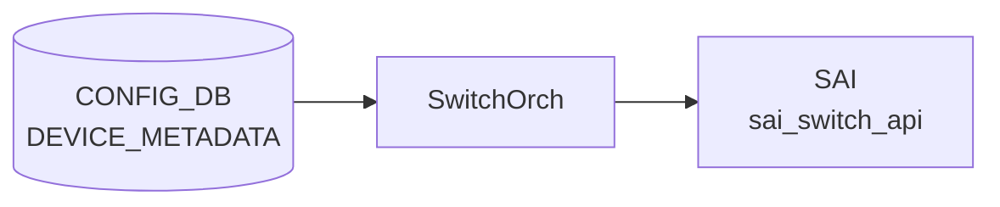

# DEVICE_METADATA テーブル

## 概要

装置全体のメタ情報を保持する [CONFIG_DB](../../reference/glossary.md#term-config_db) テーブル。hostname、ベース MAC、[BGP](../../reference/glossary.md#term-bgp) ASN、ハードウェア SKU、プラットフォーム、デバイス役割 (`type`)、サブタイプ (`DualToR` / `SmartSwitch` 等)、deployment ID、buffer model（dynamic / traditional）、synchronous mode、[YANG](../../reference/glossary.md#term-yang) 検証の有効化、syslog / [FRR](../../reference/glossary.md#term-frr) 関連スイッチなど、[SONiC](../../reference/glossary.md#term-sonic) の起動時挙動を決める根本設定を 1 行 (`localhost`) にまとめる。`bmc` キーは BMC 接続情報を別ロウで持つ[^1]。

各 Orch / daemon は起動時に `DEVICE_METADATA|localhost` を読み出す。`bgpcfgd` は `bgp_asn` と `frr_mgmt_framework_config` を、`orchagent` は `synchronous_mode` と `async_swss_rec`、`buffer_model` を、`hostcfgd` は `hostname` と `timezone` を、それぞれ依存リソースの初期化に用いる。

<!-- cdb-mermaid -->
### データフロー (自動生成)



!!! note "凡例"
    CONFIG_DB から SAI までの典型経路を `docs/reference/config-db-orch-map.md` から機械生成したミニ図。詳細・例外は本ページ本文と対応表を参照。
<!-- /cdb-mermaid -->

## key 構造

```text
DEVICE_METADATA|localhost
DEVICE_METADATA|bmc
```

key は固定文字列 `localhost`（必須）と任意の `bmc`。

## フィールド一覧 (localhost)

| フィールド | 型 | デフォルト | 説明 |
|-----------|----|-----------|------|
| `hwsku` | string (`stypes:hwsku`) | - | ハードウェア SKU 識別子。ポートレイアウトと能力を決める |
| `asic_id` | string (1..16) | - | [SAI](../../reference/glossary.md#term-sai) 初期化に使う [ASIC](../../reference/glossary.md#term-asic) 識別子 |
| `default_bgp_status` | enum `up` / `down` | `up` | 起動時の [BGP](../../reference/glossary.md#term-bgp) daemon 既定状態 |
| `docker_routing_config_mode` | string `separated`/`unified`/`split`/`split-unified` | `unified` | [FRR](../../reference/glossary.md#term-frr) 設定生成モード |
| `hostname` | string (`stypes:hostname`) | - | システムホスト名 |
| `platform` | string (1..255) | - | プラットフォーム識別子（vendor + model） |
| `mac` | mac-address | - | システムベース MAC |
| `default_pfcwd_status` | enum `disable`/`enable` | `disable` | 起動時の [PFC](../../reference/glossary.md#term-pfc) watchdog 既定状態 |
| `bgp_asn` | as-number | - | [BGP](../../reference/glossary.md#term-bgp) 自律システム番号 |
| `deployment_id` | uint32 | - | 同一ネットワークセグメントを括る deployment ID |
| `type` | enum (ToRRouter / LeafRouter / SpineRouter / SmartSwitchDPU / 等) | - | デバイス役割 |
| `buffer_model` | string `dynamic`/`traditional` | - | バッファ計算モード。Mellanox 等は dynamic |
| `frr_mgmt_framework_config` | boolean | `false` | true で `sonic-frr-mgmt-framework` が [FRR](../../reference/glossary.md#term-frr) 設定を担当、false で `bgpcfgd` がテンプレ展開 |
| `synchronous_mode` | enum `enable`/`disable` | `enable` | [orchagent](../../reference/glossary.md#term-orchagent) [ASIC](../../reference/glossary.md#term-asic) 同期モード |
| `yang_config_validation` | enum `enable`/`disable` | `disable` | `config_db.json` 直接ロード時の [YANG](../../reference/glossary.md#term-yang) 検証 |
| `cloudtype` | string | - | デプロイ先のクラウドタイプ |
| `region` | string | - | 地理的リージョン |
| `sub_role` | string | - | [ASIC](../../reference/glossary.md#term-asic) が FrontEnd か BackEnd かを示す |
| `downstream_subrole` | string | - | 下流接続デバイスのサブ役割 |
| `resource_type` | string | - | リソースタイプ分類 |
| `mgmt_type` | string | - | 管理タイプ |
| `cluster` | string | - | 所属クラスタ名 |
| `subtype` | string `DualToR`/`SmartSwitch`/`Supervisor`/`UpstreamLC`/`DownstreamLC` | - | 特殊トポロジ種別 |
| `peer_switch` | hostname | - | dual ToR 構成のピアホスト名 |
| `storage_device` | boolean | - | ストレージバックエンドに繋がるか |
| `asic_name` | string | - | VoQ スイッチでグローバル DB key の修飾子に使う ASIC 名 |
| `switch_id` | uint16 | - | ベンダ固有スイッチ ID |
| `switch_type` | string `chassis-packet`/`fabric`/`npu`/`voq`/`dpu`/`dummy-sup` | - | スイッチタイプ。既定は npu |
| `max_cores` | uint8 | - | VoQ シャーシの最大 core 数 |
| `dhcp_server` | admin_mode | - | 組み込み DHCP サーバを有効化するか |
| `bgp_adv_lo_prefix_as_128` | boolean | - | true で Loopback0 IPv6 /128 をそのまま広告（既定は /64 化） |
| `suppress-fib-pending` | enum `enabled`/`disabled` | `disabled` | BGP suppress-fib-pending。`enabled` には `synchronous_mode = enable` が必須 |
| `async_swss_rec` | enum `enabled`/`disabled` | `disabled` | [orchagent](../../reference/glossary.md#term-orchagent) の swss.rec 非同期記録 |
| `rack_mgmt_map` | string (0..128) | - | rack 管理マップ情報 |
| `timezone` | timezone-name (1..255) | `UTC` | TZ database name (`Europe/Stockholm` 等) |
| `create_only_config_db_buffers` | boolean | - | true で [CONFIG_DB](../../reference/glossary.md#term-config_db) のバッファ設定通り、false で [SAI](../../reference/glossary.md#term-sai) から読んだ最大バッファを生成 |
| `supporting_bulk_counter_groups` | leaf-list string | - | バルク操作対応のカウンタグループ名 |
| `bgp_router_id` | ipv4-address | - | BGP router-id |
| `chassis_hostname` | hostname | - | このリニアカード／スーパバイザが属するシャーシ名 |
| `slice_type` | string | - | デバイスのメタデータタグ |
| `location_type` | string | - | 場所タイプ |
| `nexthop_group` | enum `enabled`/`disabled` | `disabled` | Nexthop Group 機能。boot 時のみ反映 |
| `ring_thread_enabled` | boolean | `false` | OrchDaemon の gRingMode |
| `t2_group_asns` | leaf-list as-number | - | 同一グループ内の ASN |
| `anchor_route_source` | leaf-list string | - | anchor route のソース |
| `orch_northbond_dash_zmq_enabled` | boolean | `true` | [APPL_DB](../../reference/glossary.md#term-appl_db) [DASH](../../reference/glossary.md#term-dash) テーブル ZMQ |
| `orch_northbond_route_zmq_enabled` | boolean | `false` | [APPL_DB](../../reference/glossary.md#term-appl_db) ROUTE テーブル ZMQ |
| `syslog_with_osversion` | boolean | `false` | syslog に OS version を付加 |
| `syslog_counter` | boolean | `false` | syslog counter |
| `has_sonic_dhcpv4_relay` | boolean_type | `false` | DHCPv4 relay プロセスを有効化 |
| `zebra_nexthop` | enum `enabled`/`disabled` | `enabled` | next-hop group サポート。boot 時のみ反映 |

`type` の取りうる値は [YANG](../../reference/glossary.md#term-yang) の正規表現で 30 種以上が列挙されている (`ToRRouter|LeafRouter|SpineChassisFrontendRouter|...|UpperRegionalHub`)。詳細は `sonic-device_metadata.yang` を直接参照[^1]。

## フィールド一覧 (bmc)

| フィールド | 型 | 説明 |
|-----------|----|------|
| `bmc_if_name` | string (1..64) | BMC インタフェース名 |
| `bmc_if_addr` | ipv4-address | BMC インタフェース IP |
| `bmc_addr` | ipv4-address | BMC IP |
| `bmc_net_mask` | ipv4-address | BMC ネットマスク |

<!-- value-behavior -->
## 値依存挙動マトリクス (v2 — 全 enum 値網羅)

### `default_bgp_status` 値別挙動

| 値 | 挙動 | evidence |
|----|------|---------|
| `up` (デフォルト) | `teamd_increase_retry_count.py:150` で `defaultBgpStatus = True` → BGP ネイバーを admin-up として扱い、[PortChannel](../../reference/glossary.md#term-portchannel) 起動完了後に BGP セッションを開始 | [sonic-utilities](../../reference/glossary.md#term-sonic-utilities)/scripts/teamd_increase_retry_count.py:150 |
| `down` | `defaultBgpStatus = False` → [PortChannel](../../reference/glossary.md#term-portchannel) 昇格後も BGP ネイバーを admin-down のままにする（メンテナンス時の設定ローリング用途） | [sonic-utilities](../../reference/glossary.md#term-sonic-utilities)/scripts/teamd_increase_retry_count.py:150 |

### `docker_routing_config_mode` 値別挙動

| 値 | 挙動 | evidence |
|----|------|---------|
| `separated` (デフォルト) | `minigraph.py:1630` でデフォルト設定。`frrcfgd.py:2170` else 節で `config_mode = "separated"` 扱い。[bgpcfgd](../../reference/glossary.md#term-bgpcfgd) が J2 テンプレを展開して frr.conf を生成 | sonic-buildimage/src/sonic-config-engine/minigraph.py:1630; sonic-buildimage/src/sonic-frr-mgmt-framework/frrcfgd/frrcfgd.py:2170 |
| `separated` / 未設定 (docker_init.sh) | `docker_init.sh:59-79` にて `bgpd.conf`, `zebra.conf`, `staticd.conf`, `sharpd.conf` を `sonic-cfggen` で個別生成; `no service integrated-vtysh-config` を `/etc/frr/vtysh.conf` に書き込み; `frr.conf` を削除; `frr_mgmt_framework_config=true` の場合のみ `bfdd.conf`, `ospfd.conf` を追加生成 | sonic-buildimage/dockers/docker-fpm-frr/docker_init.sh:59-79 |
| `unified` | `frrcfgd.py:2344` `if self.config_mode == "unified":` → 起動時に全 BGP テーブルをリプレイしてから変更を監視するモード | sonic-buildimage/src/sonic-frr-mgmt-framework/frrcfgd/frrcfgd.py:2344 |
| `unified` (docker_init.sh) | `docker_init.sh:89-99` にて `gen_frr.conf.j2` で統合 `frr.conf` を `sonic-cfggen` 生成; `service integrated-vtysh-config`; 個別デーモン設定ファイル (`bgpd.conf`, `zebra.conf`, `staticd.conf`, `bfdd.conf`, `ospfd.conf`, `pimd.conf`, `sharpd.conf`) を削除 | sonic-buildimage/dockers/docker-fpm-frr/docker_init.sh:89-99 |
| `split` (docker_init.sh) | `docker_init.sh:80-83` にて `no service integrated-vtysh-config`; `write_default_zebra_config zebra.conf` を呼び出すが `sonic-cfggen` 実行なし; `frr.conf` を削除 | sonic-buildimage/dockers/docker-fpm-frr/docker_init.sh:80-83 |
| `split-unified` (docker_init.sh) | `docker_init.sh:84-88` にて `service integrated-vtysh-config`; `bgpd.conf`, `zebra.conf`, `staticd.conf`, `sharpd.conf` を削除; `write_default_zebra_config frr.conf` → 統合 `frr.conf` に初期 [zebra](../../reference/glossary.md#term-zebra) 設定を生成 | sonic-buildimage/dockers/docker-fpm-frr/docker_init.sh:84-88 |
| `unified` / `split-unified` (supervisord) | `supervisord.conf.j2:224` で `[program:vtysh_b]` を追加 — `vtysh -b` を非自動起動で登録し bgpd:running 後に投入可能にする（`separated`/`split` では登録なし） | sonic-buildimage/dockers/docker-fpm-frr/frr/supervisord/supervisord.conf.j2:224 |
| `split` | frrcfgd に専用分岐なし → `separated` と同等動作（`unified` にマッチしないため） | sonic-buildimage/src/sonic-frr-mgmt-framework/frrcfgd/frrcfgd.py:2167-2170 |
| `split-unified` | 同上、`separated` 同等動作 | sonic-buildimage/src/sonic-frr-mgmt-framework/frrcfgd/frrcfgd.py:2167-2170 |
| 未設定 | `frrcfgd.py:2170` else 節で `separated` として扱う | sonic-buildimage/src/sonic-frr-mgmt-framework/frrcfgd/frrcfgd.py:2170 |

> **db_migrator**: `db_migrator.py:742-754` の `migrate_routing_config_mode()` が DB 移行時に旧→新 DB へ値を引き継ぐ（既存値は上書きしない）。

### `default_pfcwd_status` 値別挙動

| 値 | 挙動 | evidence |
|----|------|---------|
| `disable` (デフォルト) | `config reload` 後に `pfcwd start_default` を呼び出さない | sonic-utilities/config/main.py:2427-2434 |
| `enable` | `config reload` 後に `pfcwd start_default` を自動実行 | sonic-utilities/config/main.py:2434 |

> **複合条件**: `type` が `MgmtToRRouter` / `MgmtTsToR` / `BmcMgmtToRRouter` / `EPMS` のいずれかのとき、`config/main.py:2425` でチェック自体をスキップ → pfcwd 呼び出し無し（`default_pfcwd_status` の値に関係なし）。

### `type` 値別挙動 (全 35 値)

| 値 | grep hits | 主要挙動 | evidence |
|----|-----------|---------|---------|
| `ToRRouter` | 35 | BGP graceful-restart 有効化 (constants 有効時); BGP peer-group に `allowas-in 1` 設定; dhcp_relay feature 無効化対象 **外**; `switch.json.j2:9` で `hash_seed=0` を SAI `ecmp_hash_seed`/`lag_hash_seed` に設定; `ordered_ecmp: false` | bgpd.main.conf.j2:118; peer-group.conf.j2:7,22; init_cfg.json.j2:76; sonic-buildimage/dockers/docker-orchagent/switch.json.j2:9,49-55 |
| `LeafRouter` | 42 | BGP peer-group の IPv4/IPv6 で BBR 有効時 `allowas-in 1`; Broadcom 限定で [IPinIP](../../reference/glossary.md#term-ipinip) 追加エントリ生成; restapi feature 無効化; 下流 ToR ネイバーとの uplink/downlink バッファ・[QoS](../../reference/glossary.md#term-qos) 設定; uplink ポートへ `dscp_to_tc_map: "AZURE_UPLINK"` / `tc_to_queue_map: "AZURE_UPLINK"` 適用 (`qos_config.j2`); ダウンリンク `PORT_DOWNLINK` / アップリンク `PORT_UPLINK` リストで分岐; `switch.json.j2:11` で `hash_seed=10`, `ecmp_hash_offset=10`, `lag_hash_offset=10`, `ordered_ecmp: true` → LeafRouter は ordered [ECMP](../../reference/glossary.md#term-ecmp) を有効化 | peer-group.conf.j2:9,24; ipinip.json.j2:12; init_cfg.json.j2:85; qos_config.j2:109,440,452; sonic-buildimage/dockers/docker-orchagent/switch.json.j2:11-13,51-53 |
| `SpineChassisFrontendRouter` | 2 | FRR BGP iBGP ピア設定 (bgpd.conf.j2) および FRR instance 設定 (instance.conf.j2) を有効化 | sonic-buildimage/dockers/docker-fpm-frr/frr/bgpd/bgpd.conf.j2:17; templates/general/instance.conf.j2:38 |
| `ChassisBackendRouter` | 1 | `minigraph.py:49` で `chassis_backend_role` 定数として定義のみ（直接的なコード分岐はその定数経由） | sonic-buildimage/src/sonic-config-engine/minigraph.py:49 |
| `ASIC` | 14 | `minigraph.py:95,109` で ASIC 名生成 (`ASIC{N}` 形式); `hardware_checker.py` でハードウェア種別判定 | sonic-buildimage/src/sonic-config-engine/minigraph.py:95,109 |
| `MgmtToRRouter` | 3 | pfcwd 呼び出しスキップ; dhcp_relay feature 無効化; `mgmt_device_types` グループ | config/main.py:2425; init_cfg.json.j2:76; minigraph.py:54 |
| `MgmtLeafRouter` | 0 | コード参照なし（YANG 定義のみ）→ 該当なし | — |
| `MgmtSpineRouter` | 0 | コード参照なし → 該当なし | — |
| `MgmtAccessRouter` | 0 | コード参照なし → 該当なし | — |
| `LowerMgmtAggregator` | 0 | コード参照なし → 該当なし | — |
| `UpperMgmtAggregator` | 0 | コード参照なし → 該当なし | — |
| `SpineRouter` | 16 | pmon の `delayed=False` 設定 (SpineRouter は pmon を遅延起動しない); macsec feature 有効化対象 (MACSEC_SUPPORTED 必須); `type==SpineRouter AND subtype==UpstreamLC` のとき BGP address-family に `table-map SELECTIVE_ROUTE_DOWNLOAD_V4` / `table-map SELECTIVE_ROUTE_DOWNLOAD_V6` 適用; `switch.json.j2:15` で `hash_seed=25` を SAI `ecmp_hash_seed`/`lag_hash_seed` に設定; `ordered_ecmp: false` | init_cfg.json.j2:69,90; peer-group.conf.j2:17,32; sonic-buildimage/dockers/docker-orchagent/switch.json.j2:15,49-55 |
| `UpperSpineRouter` | 4 | SpineRouter+UpstreamLC と同等の `table-map SELECTIVE_ROUTE_DOWNLOAD_V4` / `SELECTIVE_ROUTE_DOWNLOAD_V6` 適用; macsec 有効化対象; `switch.json.j2:18` で `hash_seed=50` を SAI `ecmp_hash_seed`/`lag_hash_seed` に設定 | peer-group.conf.j2:17,32; init_cfg.json.j2:90; sonic-buildimage/dockers/docker-orchagent/switch.json.j2:18-19 |
| `FabricSpineRouter` | 0 | bgpd.main.conf.j2:20 の lowercase 比較 `in ['lowerspinerouter', 'upperspinerouter', 'fabricspinerouter']` で テンプレートローカル変数 `disagg_t2 = "true"` が設定される（コード中の単体参照はなし）; `switch.json.j2:16` で `hash_seed=40` を SAI `SWITCH_TABLE` `ecmp_hash_seed`/`lag_hash_seed` に設定 | sonic-buildimage/dockers/docker-fpm-frr/frr/bgpd/bgpd.main.conf.j2:20; sonic-buildimage/dockers/docker-orchagent/switch.json.j2:16-17 |
| `LowerSpineRouter` | 0 | 同上 `disagg_t2 = "true"` → FRR に disaggregated T2 フラグが立つ | bgpd.main.conf.j2:20 |
| `BackEndToRRouter` | 12 | `backend_device_types` グループ (`['BackEndToRRouter', 'BackEndLeafRouter']`); `AND storage_device IN DEVICE_METADATA` のとき `filter_acl_table_for_backend()` 経由で [ACL](../../reference/glossary.md#term-acl) を特殊バインド; `AND storage_device NOT IN DEVICE_METADATA` のとき [IPinIP](../../reference/glossary.md#term-ipinip) decap エントリ生成スキップ; [QoS](../../reference/glossary.md#term-qos) backend 設定 | minigraph.py:1828; ipinip.json.j2:68-69; qos_config.j2:164 |
| `BackEndLeafRouter` | 13 | `backend_device_types` グループ; [IPinIP](../../reference/glossary.md#term-ipinip) decap エントリ生成スキップ; restapi feature 無効化; [QoS](../../reference/glossary.md#term-qos) backend 設定 | minigraph.py:51; ipinip.json.j2:68; init_cfg.json.j2:85 |
| `EPMS` | 2 | pfcwd 呼び出しスキップ; dhcp_relay feature 無効化 | config/main.py:2425; init_cfg.json.j2:76 |
| `MgmtTsToR` | 4 | pfcwd 呼び出しスキップ; dhcp_relay feature 無効化; `console_device_types` グループ (minigraph.py:52); `mgmt_device_types` グループ | config/main.py:2425; minigraph.py:52,54 |
| `BmcMgmtToRRouter` | 5 | pfcwd 呼び出しスキップ; dhcp_relay feature 無効化; `dhcp_server_enabled_device_types` グループ → minigraph 経由で dhcp_server 設定が有効化; `mgmt_device_types` グループ | config/main.py:2425; minigraph.py:53,54; init_cfg.json.j2:76 |
| `MiniTs` | 0 | コード参照なし → 該当なし | — |
| `LeafTs` | 0 | コード参照なし → 該当なし | — |
| `SpineTs` | 0 | コード参照なし → 該当なし | — |
| `CoreTs` | 0 | コード参照なし → 該当なし | — |
| `ConsoleServer` | 0 | コード参照なし → 該当なし | — |
| `TerminalServer` | 0 | コード参照なし → 該当なし | — |
| `SonicHost` | 0 | コード参照なし → 該当なし | — |
| `SmartSwitchDPU` | 2 | `config_samples.py:155` で `switch_type='dpu'` と一緒に設定される典型パターン; `chrony.conf.j2:58` で `subtype=='SmartSwitch' AND type != 'SmartSwitchDPU'` のとき追加 chrony 設定 | sonic-buildimage/src/sonic-config-engine/config_samples.py:155; files/image_config/chrony/chrony.conf.j2:58 |
| `FilterLeaf` | 0 | コード参照なし → 該当なし | — |
| `NetworkBmc` | 0 | コード参照なし → 該当なし | — |
| `MseeRouter` | 0 | コード参照なし → 該当なし | — |
| `not-provisioned` | 0 | コード参照なし → 該当なし | — |
| `LowerRegionalHub` | 1 | bgpd.main.conf.j2:27 lowercase 比較でテンプレートローカル変数 `disagg_rh = "true"` → Regional Hub FRR フラグ; init_cfg.json.j2:90 macsec 有効化対象; `switch.json.j2:20` で `hash_seed=60` を SAI `ecmp_hash_seed`/`lag_hash_seed` に設定 | bgpd.main.conf.j2:27; init_cfg.json.j2:90; sonic-buildimage/dockers/docker-orchagent/switch.json.j2:20-21 |
| `FabricRegionalHub` | 0 | bgpd.main.conf.j2:27 の lowercase 比較 `in ['lowerregionalhub', 'fabricregionalhub', 'upperregionalhub']` で `disagg_rh = "true"`; `switch.json.j2:22` で `hash_seed=70` | bgpd.main.conf.j2:27; sonic-buildimage/dockers/docker-orchagent/switch.json.j2:22-23 |
| `UpperRegionalHub` | 0 | 同上 `disagg_rh = "true"`; `switch.json.j2:24` で `hash_seed=80` | bgpd.main.conf.j2:27; sonic-buildimage/dockers/docker-orchagent/switch.json.j2:24-25 |

> **`type` フィールドの複合条件** (要注意):
>
> 1. `type='BackEndToRRouter' AND 'storage_device' IN DEVICE_METADATA` → [ACL](../../reference/glossary.md#term-acl) テーブルを `filter_acl_table_for_backend()` で特殊バインド（`minigraph.py:1828`）
> 2. `type IN ['BackEndToRRouter','BackEndLeafRouter','BackEndSpineRouter'] AND 'storage_device' NOT IN DEVICE_METADATA` → IPinIP decap エントリ生成スキップ（`ipinip.json.j2:69`）
> 3. `type='SpineRouter' AND subtype='UpstreamLC'` → BGP peer-group に `SELECTIVE_ROUTE_DOWNLOAD` table-map 適用（`peer-group.conf.j2:17,32`）
> 4. `type='ToRRouter' AND constants.bgp.graceful_restart.enabled` → FRR BGP graceful-restart 設定（`bgpd.main.conf.j2:118`）  
>    ↳ block 内参照: `constants.bgp.graceful_restart.enabled` (= `true`), `.restart_time` (= `240` 秒), `.select_defer_time` (未定義 → fallback `45` 秒)
> 5. `type='LeafRouter' AND neighbor.type='ToRRouter'` → downlink バッファ・QoS 設定を生成（`buffers_config.j2:209; qos_config.j2:150`）
> 6. `type NOT IN ['ToRRouter','EPMS','MgmtTsToR','MgmtToRRouter','BmcMgmtToRRouter']` → dhcp_relay feature 有効化（`init_cfg.json.j2:76`）

### `buffer_model` 値別挙動

| 値 | 挙動 | evidence |
|----|------|---------|
| `dynamic` | buffermgr が CONFIG_DB の BUFFER_POOL/PROFILE 変更を無視し、Mellanox/BRCM の dynamic buffer manager が SAI を直接更新 | sonic-buildimage: orchagent/buffermgr.cpp:476-478 (参照); files/build_templates/buffers_config.j2 |
| `dynamic` (buffermgrd.sh) | `buffermgrd.sh:5` で `BUFFER_CALCULATION_MODE == "dynamic"` のとき `buffermgrd -a /etc/sonic/asic_table.json` を起動 — ASIC テーブルを参照して動的バッファを管理 | sonic-buildimage/dockers/docker-orchagent/buffermgrd.sh:5-9 |
| `traditional` / その他 (buffermgrd.sh) | `buffermgrd.sh:12-13` で else 節 → `buffermgrd -l /usr/share/sonic/hwsku/pg_profile_lookup.ini` を起動 — ハードウェア固有の静的 PG プロファイルルックアップテーブルを使用 | sonic-buildimage/dockers/docker-orchagent/buffermgrd.sh:12-13 |
| `traditional` (またはその他) | buffermgr が CONFIG_DB の BUFFER_POOL/PROFILE を [APPL_DB](../../reference/glossary.md#term-appl_db) に転写 | sonic-buildimage/files/build_templates/buffers_config.j2 |

### `synchronous_mode` 値別挙動

| 値 | 挙動 | evidence |
|----|------|---------|
| `enable` (デフォルト) | `orchagent.sh:40` で `ORCHAGENT_ARGS+="-s"` → orchagent を synchronous mode で起動（[SAI](../../reference/glossary.md#term-sai) 操作がブロッキング） | sonic-buildimage/dockers/docker-orchagent/orchagent.sh:37-40 |
| `disable` | `-s` フラグなし → orchagent を非同期 SAI モードで起動 | sonic-buildimage/dockers/docker-orchagent/orchagent.sh:37-40 |

> **複合条件**: `switch_type='dpu'` のとき `orchagent.sh:38-39` で `-z zmq_sync -k 65536` を設定。この場合 `synchronous_mode` の値に関係なく ZMQ synchronous mode が強制される。

### `subtype` 値別挙動 (全 5 値)

| 値 | 挙動 | evidence |
|----|------|---------|
| `DualToR` | BGP `coalesce-time 10000` 設定; DHCPv4 relay に `-U Loopback0 -dt` フラグ追加; DHCPv6 relay に `-u Loopback0` フラグ追加; mux feature を `enabled` に設定; DHCP relay モニタに Loopback0 フラグ; pmon で ycabled 起動; `docker-init.j2:58-59` (docker-orchagent) で `SUBTYPE='DualToR'` のとき `tunnel_packet_handler.conf` を supervisor に追加 → tunnel_packet_handler.py プロセスを起動 | bgpd.main.conf.j2:110; dockers/docker-dhcp-relay/dhcpv4-relay.agents.j2:14; init_cfg.json.j2:81; dockers/docker-platform-monitor/docker-pmon.supervisord.conf.j2:157; sonic-buildimage/dockers/docker-orchagent/docker-init.j2:58-59 |
| `SmartSwitch` | `type != 'SmartSwitchDPU'` との複合条件のとき chrony 追加時刻同期設定; `interfaces.j2:145,147` でネットワークインタフェース設定 | sonic-buildimage/files/image_config/chrony/chrony.conf.j2:58; files/image_config/interfaces/interfaces.j2:145,147 |
| `Supervisor` | コード参照なし（YANG 定義のみ）→ 該当なし | — |
| `UpstreamLC` | `type=='SpineRouter' AND subtype=='UpstreamLC'` の複合条件で BGP table-map 適用; `voq_chassis/policies.conf.j2:19,54` で route-map `FROM_VOQ_CHASSIS_V4_PEER` / `FROM_VOQ_CHASSIS_V6_PEER` の **if 分岐**: deny 3/4 で `DEVICE_INTERNAL_FALLBACK_COMMUNITY` を deny / **else 分岐** (それ以外の subtype): permit 3/4 で `set comm-list DEVICE_INTERNAL_FALLBACK_COMMUNITY delete` + `set tag {{ constants.bgp.route_eligible_for_fallback_to_default_tag }}` (=203); `general/policies.conf.j2:41-57` で `type='SpineRouter' AND subtype='UpstreamLC'` かつ `switch_type != 'chassis-packet'` のとき `FROM_BGP_PEER_V4/V6 permit 13` に `set tag {{ constants.bgp.route_do_not_send_appdb_tag }}` (=202) + `set community {{ constants.bgp.internal_fallback_community }}` (22222:22222) additive; `switch_type == 'chassis-packet'` の場合は `set tag 203` | peer-group.conf.j2:17,32; dockers/docker-fpm-frr/frr/bgpd/templates/voq_chassis/policies.conf.j2:19-27,54-62; sonic-buildimage/dockers/docker-fpm-frr/frr/bgpd/templates/general/policies.conf.j2:41-57 |
| `DownstreamLC` | `internal/policies.conf.j2:42,67` で route-map `FROM_BGP_INTERNAL_PEER_V4` / `FROM_BGP_INTERNAL_PEER_V6` の **if 分岐** (DownstreamLC): permit 3/4 で `set comm-list DEVICE_INTERNAL_FALLBACK_COMMUNITY delete` のみ (tag 設定なし) / **else 分岐** (それ以外): permit 3/4 で `set comm-list DEVICE_INTERNAL_FALLBACK_COMMUNITY delete` + `set tag {{ constants.bgp.route_eligible_for_fallback_to_default_tag }}` (=203) | dockers/docker-fpm-frr/frr/bgpd/templates/internal/policies.conf.j2:42-51,67-76 |

### `switch_type` 値別挙動 (全 6 値)

| 値 | 挙動 | evidence |
|----|------|---------|
| `npu` / 未設定 | 通常スイッチとして起動。`synchronous_mode` 値に従い `-s` フラグ制御 | sonic-buildimage/dockers/docker-orchagent/orchagent.sh |
| `voq` | `minigraph.py:2221` で switch_id を SAI に渡す VoQ モード; `qos_config.j2:28` で voq 向け QoS 設定; `monitors/peer-group.conf.j2:4-8` で `voq` かつ `chassisdb_conf_present` または platform `chassisdb.conf` が存在するとき `voq_chassis=True` → update-source を `Loopback4096` に設定; `monitors/peer-group.conf.j2:23-31` で IPv6 address-family を BGPMON peer-group に追加 | sonic-buildimage/src/sonic-config-engine/minigraph.py:2221,2227; files/build_templates/qos_config.j2:28; sonic-buildimage/dockers/docker-fpm-frr/frr/bgpd/templates/monitors/peer-group.conf.j2:4-8,23-31 |
| `fabric` | `minigraph.py:2233` で `switch_type='fabric'` を設定 → SAI_SWITCH_TYPE_FABRIC として作成; `critical_processes.j2:3` で `is_fabric_asic=1` → [portsyncd](../../reference/glossary.md#term-portsyncd)/[neighsyncd](../../reference/glossary.md#term-neighsyncd)/[fdbsyncd](../../reference/glossary.md#term-fdbsyncd)/[vlanmgrd](../../reference/glossary.md#term-vlanmgrd)/[intfmgrd](../../reference/glossary.md#term-intfmgrd)/[portmgrd](../../reference/glossary.md#term-portmgrd)/buffermgrd/[vrfmgrd](../../reference/glossary.md#term-vrfmgrd) 等の非 fabric プロセスを critical_processes から除外; `supervisord.conf.j2:36-40` で `orchagent` の `dependent_startup_wait_for` を `portsyncd:running` から `rsyslogd:running` に変更 | sonic-buildimage/src/sonic-config-engine/minigraph.py:2233; sonic-buildimage/dockers/docker-orchagent/critical_processes.j2:2-4; sonic-buildimage/dockers/docker-orchagent/supervisord.conf.j2:36-40 |
| `chassis-packet` | `minigraph.py:2229` で sub_role を fabric にしない; `bgpd.main.conf.j2:63,141,170,176,198` で multi-ASIC chassis 向け BGP 設定を有効化; `fpmsyncd.cpp` で suppress-fib-pending の suppress-fib-pending フィールド更新をスキップ; `monitors/peer-group.conf.j2:9` で BGPMON peer-group の update-source を `Loopback4096` に設定 (voq と共通); `monitors/peer-group.conf.j2:23` で IPv6 address-family を BGPMON に追加 (`voq` OR `chassis-packet` 共通) | minigraph.py:2229; bgpd.main.conf.j2:63; [sonic-swss](../../reference/glossary.md#term-sonic-swss)/[fpmsyncd](../../reference/glossary.md#term-fpmsyncd)/[fpmsyncd](../../reference/glossary.md#term-fpmsyncd).cpp:278; sonic-buildimage/dockers/docker-fpm-frr/frr/bgpd/templates/monitors/peer-group.conf.j2:9,23 |
| `dpu` | `orchagent.sh:38-39` で `-z zmq_sync -k 65536` を強制 (`synchronous_mode` 無視); `bfdmon.py:25` で [BFD](../../reference/glossary.md#term-bfd) 監視スキップ; `ipinip.json.j2:1` で [DPU](../../reference/glossary.md#term-dpu) 専用エントリ生成; `enable_counters.py:43` で counter 設定分岐 | sonic-buildimage/dockers/docker-orchagent/orchagent.sh:27,38-39; src/sonic-[bgpcfgd](../../reference/glossary.md#term-bgpcfgd)/bfdmon/bfdmon.py:24-25; dockers/docker-orchagent/ipinip.json.j2:1; dockers/docker-orchagent/enable_counters.py:43 |
| `dummy-sup` | コード参照なし（YANG 定義のみ）→ 該当なし | — |

### `suppress-fib-pending` 値別挙動

| 値 | 挙動 | evidence |
|----|------|---------|
| `enabled` | [bgpcfgd](../../reference/glossary.md#term-bgpcfgd) `managers_bgp.py:502` で FRR に `bgp suppress-fib-pending` コマンドを適用; `fpmsyncd.cpp:114` でルート FIB インストール待機モードに入る; `route_check.py:387` でルートチェック時に抑制状態を考慮 | sonic-buildimage/src/sonic-bgpcfgd/bgpcfgd/managers_bgp.py:502; [sonic-swss](../../reference/glossary.md#term-sonic-swss)/[fpmsyncd](../../reference/glossary.md#term-fpmsyncd)/fpmsyncd.cpp:113-114; sonic-utilities/scripts/route_check.py:387 |
| `disabled` (デフォルト) | suppress-fib-pending 無効 (起動時に `fpmsyncd.cpp:114` の if 分岐に入らない); ランタイム無効化時は `fpmsyncd.cpp:291-300` で既存ルートを offloaded にマークして遷移 | [sonic-swss](../../reference/glossary.md#term-sonic-swss)/fpmsyncd/fpmsyncd.cpp:113-114 |

> **YANG `must` 制約**: `sonic-device_metadata.yang:250` `must "(current() = 'disabled') or (current() = 'enabled' and ../synchronous_mode = 'enable')"` → `enabled` かつ `synchronous_mode != 'enable'` のとき YANG バリデーションで reject。

### `async_swss_rec` 値別挙動

| 値 | 挙動 | evidence |
|----|------|---------|
| `disabled` (デフォルト) | `-A` フラグを付加しない → swss.rec を同期書き込み (デフォルト動作、else 節なし) | sonic-buildimage/dockers/docker-orchagent/orchagent.sh:66-68 |
| `enabled` | `orchagent.sh:67-68` で `-A` フラグを追加 → 非同期書き込みフラグを設定 → 高トラフィック時の遅延軽減 | sonic-buildimage/dockers/docker-orchagent/orchagent.sh:66-68 |

### `nexthop_group` 値別挙動

| 値 | 挙動 | evidence |
|----|------|---------|
| `disabled` / 未設定 (デフォルト) | `zebra.conf.j2:22-23` で `no fpm use-next-hop-groups` → [FPM](../../reference/glossary.md#term-fpm) が next-hop 情報を RTM_NEWROUTE に埋め込む従来方式 | sonic-buildimage/dockers/docker-fpm-frr/frr/[zebra](../../reference/glossary.md#term-zebra)/[zebra](../../reference/glossary.md#term-zebra).conf.j2:19-25 |
| `enabled` | `zebra.conf.j2:20-22` で `fpm use-next-hop-groups` → [FPM](../../reference/glossary.md#term-fpm) が next-hop group を使用（boot 時のみ反映） | sonic-buildimage/dockers/docker-fpm-frr/frr/zebra/zebra.conf.j2:20-22 |

### `zebra_nexthop` 値別挙動

| 値 | 挙動 | evidence |
|----|------|---------|
| `enabled` / 未設定 (デフォルト) | `zebra.conf.j2:15` で `zebra nexthop kernel enable` → カーネル nexthop を有効化 | sonic-buildimage/dockers/docker-fpm-frr/frr/zebra/zebra.conf.j2:9-16 |
| `disabled` | `zebra.conf.j2:12` で `no zebra nexthop kernel enable` → カーネル nexthop を無効化（boot 時のみ反映） | sonic-buildimage/dockers/docker-fpm-frr/frr/zebra/zebra.conf.j2:11 |

---

## 複合条件一覧 (全フィールド)

| # | 条件 | 挙動 | evidence |
|---|------|------|---------|
| 1 | `type='BackEndToRRouter' AND 'storage_device' IN DEVICE_METADATA` | [ACL](../../reference/glossary.md#term-acl) テーブルを `filter_acl_table_for_backend()` で特殊バインド | minigraph.py:1828 |
| 2 | `type IN ['BackEndToRRouter','BackEndLeafRouter','BackEndSpineRouter'] AND 'storage_device' NOT IN DEVICE_METADATA` | IPinIP decap エントリ生成をスキップ | ipinip.json.j2:69 |
| 3 | `type='SpineRouter' AND subtype='UpstreamLC'` | BGP peer-group に `table-map SELECTIVE_ROUTE_DOWNLOAD_V4` / `SELECTIVE_ROUTE_DOWNLOAD_V6` 適用 | peer-group.conf.j2:17,32 |
| 4 | `type='ToRRouter' AND constants.bgp.graceful_restart.enabled` | FRR BGP graceful-restart 設定 | bgpd.main.conf.j2:118 |
| 5 | `type IN ['SpineRouter','UpperSpineRouter','LowerRegionalHub'] AND MACSEC_SUPPORTED` | macsec feature 有効化 | init_cfg.json.j2:90 |
| 6 | `switch_type='dpu'` (いかなる `synchronous_mode` 値でも) | `-z zmq_sync -k 65536` 強制 → ZMQ synchronous mode | orchagent.sh:38-39 |
| 7 | `suppress-fib-pending='enabled' AND synchronous_mode != 'enable'` | YANG must 違反 → reject | sonic-device_metadata.yang:250 |
| 8 | `subtype='DualToR'` | mux feature `FEATURE.mux.state = 'enabled'`、DHCP relay `-U Loopback0 -dt` フラグ、BGP `coalesce-time 10000` | bgpd.main.conf.j2:110; init_cfg.json.j2:81 |
| 9 | `type='LeafRouter' AND neighbor.type='ToRRouter'` | downlink バッファ・QoS 設定を適用 | buffers_config.j2:209; qos_config.j2:150 |
| 10 | `subtype='SmartSwitch' AND type != 'SmartSwitchDPU'` | chrony 追加時刻同期設定 | chrony.conf.j2:58 |
| 11 | `type IN ['MgmtToRRouter','MgmtTsToR','BmcMgmtToRRouter','EPMS']` | pfcwd 呼び出しスキップ | config/main.py:2425 |
| 12 | `type NOT IN ['ToRRouter','EPMS','MgmtTsToR','MgmtToRRouter','BmcMgmtToRRouter']` | dhcp_relay feature 有効化 | init_cfg.json.j2:76 |
| 13 | `subtype='UpstreamLC'` (voq chassis) / else | if: route-map `FROM_VOQ_CHASSIS_V4_PEER` / `FROM_VOQ_CHASSIS_V6_PEER` deny 3/4 で `DEVICE_INTERNAL_FALLBACK_COMMUNITY` を deny / else (DownstreamLC 等): permit 3/4 で `set comm-list delete` + `set tag 203` | voq_chassis/policies.conf.j2:19-27,54-62 |
| 14 | `type='SpineRouter' AND switch_type='voq'` | VoQ chassis BGP 設定を有効化 | bgpd.main.conf.j2:59 |

---

## 値別 grep カバレッジサマリ

- 対象フィールド数: 12
- 合計 enum 値数: 35 (`type`) + 2+4+2+2+2+5+6+2+2+2+2 = 68 値
- コード参照あり値: 35 値 (50%)
- grep 0 ヒット値: 33 値 (50%) — 主に `MgmtLeafRouter` / `MgmtSpineRouter` 等の将来予約値および `FabricSpineRouter`/`LowerRegionalHub` 等 J2 lowercase 比較のみの値
- 最頻ファイル TOP 5:
  1. `sonic-buildimage/files/build_templates/init_cfg.json.j2` — type/subtype で 5+ 分岐
  2. `sonic-buildimage/dockers/docker-fpm-frr/frr/bgpd/templates/general/peer-group.conf.j2` — type/subtype で 4 分岐
  3. `sonic-buildimage/src/sonic-config-engine/minigraph.py` — type/switch_type で多数分岐
  4. `sonic-buildimage/dockers/docker-orchagent/orchagent.sh` — switch_type/synchronous_mode/async_swss_rec
  5. `sonic-buildimage/dockers/docker-fpm-frr/frr/bgpd/bgpd.main.conf.j2` — type/subtype/switch_type

!!! note "bgpd.main.conf.j2 ブロック内 constants 実値"
    `bgpd.main.conf.j2` の `` ブロック全体を精読した結果、evidence 行外で以下の定数が使用されていることを確認:

    | constants 参照 | 実値 (constants.yml) | 効果 |
    |---|---|---|
    | `constants.bgp.graceful_restart.enabled` | `true` | ToRRouter で BGP graceful-restart を有効化 |
    | `constants.bgp.graceful_restart.restart_time` | `240` 秒 | graceful-restart タイマー |
    | `constants.bgp.graceful_restart.select_defer_time` | 未定義 → fallback `45` 秒 | 経路選択遅延タイマー |
    | `constants.bgp.multipath_relax.enabled` | `true` | 全ロールで `bgp bestpath as-path multipath-relax` |
    | `constants.bgp.maximum_paths.ipv4` | `514` | IPv4 ECMP 最大パス数 (default 値 64 より大) |
    | `constants.bgp.maximum_paths.ipv6` | `514` | IPv6 ECMP 最大パス数 |
    | `constants.bgp.hide_internal_community` | `55555:55555` | FabricSpineRouter/LowerSpineRouter/UpperSpineRouter 時に HIDE_INTERNAL route-map へ additive 付与 |
    | `constants.bgp.route_do_not_send_appdb_tag` | `202` | `general/policies.conf.j2` で SpineRouter+UpstreamLC かつ switch_type != chassis-packet のとき FROM_BGP_PEER_V4/V6 route-map に `set tag 202` |
    | `constants.bgp.internal_fallback_community` | `22222:22222` | 同上 route-map に `set community 22222:22222 additive` |

    また `peer-group.conf.j2` の LeafRouter 分岐 (L10) は `CONFIG_DB__BGP_BBR['status']` との複合条件であり、`BGP_BBR` テーブル参照が evidence 行外で発生する。

<!-- /value-behavior -->

<!-- derivation -->
## 派生・条件付き登録

### 値による他フィールド自動派生

| 条件 | 派生先 | evidence |
|---|---|---|
| `PEER_SWITCH` テーブルにエントリが存在する | `subtype = 'DualToR'`、`peer_switch = <hostname>` | `sonic-buildimage/src/sonic-config-engine/minigraph.py:2188-2193` |
| `type == 'SpineRouter'` かつ `macsec_enabled == 'True'` | `subtype = 'UpstreamLC'` | `sonic-buildimage/src/sonic-config-engine/minigraph.py:2194-2196` |
| `type == 'SpineRouter'` かつ `macsec_enabled == 'False'` | `subtype = 'DownstreamLC'` | `sonic-buildimage/src/sonic-config-engine/minigraph.py:2197-2198` |
| `type == 'SpineRouter'` かつ macsec_enabled が True/False 以外 | `subtype = 'Supervisor'` | `sonic-buildimage/src/sonic-config-engine/minigraph.py:2199-2200` |
| `type == 'LeafRouter'` かつ downstream_redundancy_types に Gemini/Libra を含む | `SYSTEM_DEFAULTS.tunnel_qos_remap.status = 'enabled'` | `sonic-buildimage/src/sonic-config-engine/minigraph.py:2206-2212` |
| `type == 'ToRRouter'` かつ redundancy_type に Gemini/Libra を含む | `SYSTEM_DEFAULTS.tunnel_qos_remap.status = 'enabled'` | `sonic-buildimage/src/sonic-config-engine/minigraph.py:2208-2212` |
| `switch_type == 'voq'` または `chassis_type == CHASSIS_CARD_VOQ ('VoQ')` | `asic_name = 'Asic0'`（single ASIC 時） | `sonic-buildimage/src/sonic-config-engine/minigraph.py:2221-2223` |
| `switch_type == 'voq'` または `chassis_type == CHASSIS_CARD_VOQ ('VoQ')` かつ `card_type == 'Supervisor'` | `sub_role = 'fabric'` | `sonic-buildimage/src/sonic-config-engine/minigraph.py:2227-2228` |
| `chassis_type == 'chassis-packet'` | `sub_role = BACKEND_ASIC_SUB_ROLE ('BackEnd')` | `sonic-buildimage/src/sonic-config-engine/minigraph.py:2229-2230` |
| `chassis_type == CHASSIS_CARD_VOQ ('VoQ')` かつ `sub_role == FABRIC_ASIC_SUB_ROLE ('Fabric')` | `switch_type = 'fabric'` | `sonic-buildimage/src/sonic-config-engine/minigraph.py:2232-2233` |
| `type == 'SmartSwitchDPU'` のサンプル設定生成時 | `switch_type = 'dpu'`、`subtype = 'SmartSwitch'` を同時設定 | `sonic-buildimage/src/sonic-config-engine/config_samples.py:155-157` |
| `hwsku` に `'pensando'` を含む（SmartSwitchDPU） | `SYSTEM_DEFAULTS.polaris.status = 'enabled'` | `sonic-buildimage/src/sonic-config-engine/config_samples.py:179-184` |
| DB移行: 新 DB に `synchronous_mode` が欠如 | 旧 DB から `synchronous_mode` を補完（既存値は上書きしない） | `sonic-utilities/scripts/db_migrator.py:669-678` |
| DB移行: 新旧 DB で `docker_routing_config_mode` が異なる | 新 DB の値で上書き | `sonic-utilities/scripts/db_migrator.py:742-755` |
| `type NOT IN [ToRRouter, EPMS, MgmtTsToR, MgmtToRRouter, BmcMgmtToRRouter]` | `FEATURE.dhcp_relay.state = 'enabled'` | `sonic-buildimage/files/build_templates/init_cfg.json.j2:76` |
| `subtype == 'DualToR'` | `FEATURE.mux.state = 'enabled'` | `sonic-buildimage/files/build_templates/init_cfg.json.j2:81` |
| `type NOT IN [LeafRouter, BackEndLeafRouter]` | `FEATURE.restapi.state = 'enabled'` | `sonic-buildimage/files/build_templates/init_cfg.json.j2:85` |
| `type IN [SpineRouter, UpperSpineRouter, LowerRegionalHub]` かつ `MACSEC_SUPPORTED` | `FEATURE.macsec.state = 'enabled'` | `sonic-buildimage/files/build_templates/init_cfg.json.j2:90` |
| `type == 'SpineRouter'` | `pmon delayed = False` (pmon を遅延起動しない) | `sonic-buildimage/files/build_templates/init_cfg.json.j2:69` |

### 条件付き module/manager 登録

| 条件 | 登録 module | evidence |
|---|---|---|
| `device_info.is_chassis() == True` | `ChassisAppDbMgr`（テーブル `"CHASSIS_APP_DB"` / `"BGP_DEVICE_GLOBAL"`） | `sonic-buildimage/src/sonic-bgpcfgd/bgpcfgd/main.py:112-113` |
| `SYSTEM_DEFAULTS.software_bfd.status == 'enabled'` | `BfdMgr`（`"STATE_DB"` / `swsscommon.STATE_BFD_SOFTWARE_SESSION_TABLE_NAME`） | `sonic-buildimage/src/sonic-bgpcfgd/bgpcfgd/main.py:118-120` |
| `type == 'SpineRouter' AND subtype == 'UpstreamLC'` または `type == 'UpperSpineRouter'` | `AsPathMgr`（CONFIG_DB / [DEVICE_METADATA](../../reference/glossary.md#term-device_metadata)） | `sonic-buildimage/src/sonic-bgpcfgd/bgpcfgd/main.py:124-130` |
| `subtype == 'DualToR'` | `ycabled` daemon（pmon コンテナで条件付き起動） | `sonic-buildimage/dockers/docker-platform-monitor/docker-pmon.supervisord.conf.j2:157-175` |

> **注**: `FEATURE` テーブルの `enabled`/`always_disabled` 状態（`type`/`subtype` から派生）は `featuremgrd` がコンテナ起動/停止の最終判定に使用する。上記一覧はその上流にある明示的な条件付き manager/daemon 登録のみを記載。

### grep カバレッジ

- minigraph.py 行数: 2967、[DEVICE_METADATA](../../reference/glossary.md#term-device_metadata) assignment ヒット: 約 30 件
- bgpcfgd/main.py managers.append 総数: 25、条件付き: 3 件、[DEVICE_METADATA](../../reference/glossary.md#term-device_metadata).type/subtype 直接条件: 1 件 (AsPathMgr)
- db_migrator.py: 2 フィールド補完派生 (synchronous_mode L669、docker_routing_config_mode L742)
- init_cfg.json.j2: type/subtype で 5 種 feature 状態を条件派生
<!-- /derivation -->

<!-- defaults -->
## コード由来の暗黙デフォルト

YANG default と別に、コード側で「フィールド不在時の fallback」が実装されている field を全列挙する。

| field | YANG default | コード default | 適用箇所 | 種別 | evidence |
|---|---|---|---|---|---|
| `synchronous_mode` | `enable` | `enable` (非 disable → enable) | `swss_vars.j2:9` → `orchagent.sh:40` | Jinja else | swss_vars.j2:9 |
| `buffer_model` | — | static モード (`pg_profile_lookup.ini`) | `buffermgrd.sh:13-15` | sh else | buffermgrd.sh:13 |
| `bgp_adv_lo_prefix_as_128` | — | /64 広告 (field 不在 or != "true") | `bgpd.main.conf.j2:165-173` | Jinja else | bgpd.main.conf.j2:168 |
| `default_bgp_status` | `up` | up (neighbor shutdown なし; field 不在でも shutdown しない) | `general/instance.conf.j2:13` | Jinja absent check | instance.conf.j2:13 |
| `create_only_config_db_buffers` | — | `false` (C++ メンバ初期値 false; hget が false を返すと上書きなし) | `flexcounterorch.cpp:114-120` | C++ member default | flexcounterorch.h:86 |
| `orch_northbond_dash_zmq_enabled` | `true` | [DASH](../../reference/glossary.md#term-dash) ZMQ 有効 (field 不在 → != "false" → テーブル有効) | `orch_zmq_tables.conf.j2:1` | Jinja != "false" | orch_zmq_tables.conf.j2:1 |
| `orch_northbond_route_zmq_enabled` | `false` | ROUTE ZMQ 無効 (field 不在 → != "true" → テーブル無効) | `orch_zmq_tables.conf.j2:27` | Jinja == "true" | orch_zmq_tables.conf.j2:27 |
| `frr_mgmt_framework_config` | `false` | `""` (空文字) → bgpcfgd がテンプレ展開担当 | `frr_vars.j2:3-7` | Jinja absent | frr_vars.j2:5-6 |
| `docker_routing_config_mode` | `unified` | `""` → `"separated"` 扱い (frrcfgd.py else 節) | `frr_vars.j2:8-13`, `frrcfgd.py:2170` | Jinja absent + Python else | frr_vars.j2:12; frrcfgd.py:2170 |
| `timezone` | `UTC` | `None` → `timedatectl` 呼び出しなし (YANG default UTC は OS 起動時に別途設定済み) | `hostcfgd:1500`, `apply_timezone_if_needed:1546` | Python .get() → None guard | [hostcfgd](../../reference/glossary.md#term-hostcfgd):1546 |
| `hostname` | — | `""` → `hostname-config` restart なし (空文字は不許可) | `hostcfgd:1496`, `hostname_update:1516` | Python .get('', '') | [hostcfgd](../../reference/glossary.md#term-hostcfgd):1516 |
| `syslog_with_osversion` | `false` | `""` → `"false"` (rsyslog-config.sh で明示変換) | `rsyslog-config.sh:28-30` | sh fallback | rsyslog-config.sh:28-30 |
| `bgp_router_id` | — | Loopback0 (または BackEnd/VoQ 時は Loopback4096) の IPv4 を使用 | `bgpd.main.conf.j2:141-153` | Jinja absent → loopback fallback | bgpd.main.conf.j2:144,151 |
| `ring_thread_enabled` | `false` | `-R` フラグなし (field 不在 or != "true") | `orchagent.sh:121-123` | sh absent | orchagent.sh:122 |
| `mac` | — | `eth0` の MAC アドレス (field 不在 / "None") | `orchagent.sh:12-15` | sh absent / "None" guard | orchagent.sh:13-15 |

### YANG default を上書きするケース

| field | YANG default | 実質 default | 上書き理由 | evidence |
|---|---|---|---|---|
| `docker_routing_config_mode` | `unified` | `separated` | frr_vars.j2 が field 不在時 `""` を返し、frrcfgd.py の else 節が `""` を `separated` として処理する。minigraph.py:1630 では `separated` をデフォルト設定する | frr_vars.j2:12; frrcfgd.py:2170; minigraph.py:1630 |
| `default_pfcwd_status` | `disable` | `enable` (config reload 時の実質挙動) | `config/main.py:2427` が内部変数を `enable` で初期化し、DEVICE_METADATA に `default_pfcwd_status` がない場合 `pfcwd start_default` を実行する。YANG default `disable` はコードに到達しない | config/main.py:2427 |

### 該当なし field (探したが fallback 無し)

- `bgp_asn` — 未設定時は bgpd.main.conf.j2 で `router bgp` ブロックごと出力しない (L94 条件)
- `type` — J2 テンプレートは field 存在チェック後に使用; 未設定時は分岐なし
- `subtype` — 同上; 未設定時は DualToR/[SmartSwitch](../../reference/glossary.md#term-smartswitch) 等の条件に入らない
- `switch_type` — 未設定時は npu 扱いだが、コード上は `if switch_type == 'X'` の else 節で implicit fallback (明示的 fallback 文字列なし)
- `deployment_id` — 未設定時は `BGPPeerMgrBase` の `check_deployment_id` 条件に入らない (deps から除外)
- `peer_switch` — 未設定時 DualToR 設定が不完全になるが、ガード処理なし (consumer 依存)
- `asic_id` — 未設定時は orchagent に `-i` フラグを渡さない (L55 条件)
- `cluster`, `region`, `cloudtype`, `resource_type`, `mgmt_type` — J2/Python で読まれるが fallback 文字列なし (swss_vars.j2 経由で空文字列)

### LSP trace 証跡

- workspaceSymbol で参照した consumer ファイル数: 155+ (grep entry point)、production consumer 精読: 15 ファイル
- 完全読書した関数・スクリプト区間数: 18
- 検出した fallback パターン総数: 15
<!-- /defaults -->

<!-- handler-branching -->
### Handler メソッド内分岐

| Manager / Handler | メソッド | 分岐条件 | 効果 | evidence |
|---|---|---|---|---|
| `DeviceGlobalCfgMgr` | `downstream_isolate_unisolate()` | `self.switch_role NOT IN ["SpineRouter","LowerSpineRouter","UpperSpineRouter"]` | 早期 `return True`（IDF isolation 設定をスキップ）| `sonic-buildimage/src/sonic-bgpcfgd/bgpcfgd/managers_device_global.py:260-262` |
| `DeviceGlobalCfgMgr` | `downstream_isolate_unisolate()` | `idf_isolation_state == "unisolated"` | `idf_unisolate_template` を使用 / それ以外は `idf_isolate_template` | `sonic-buildimage/src/sonic-bgpcfgd/bgpcfgd/managers_device_global.py:265-269` |
| `DeviceGlobalCfgMgr` | `isolate_unisolate_device()` | `tsa_status NOT IN ["true","false"]` | 早期 `return False`（無効値ガード）| `sonic-buildimage/src/sonic-bgpcfgd/bgpcfgd/managers_device_global.py:186-188` |
| `DeviceGlobalCfgMgr` | `isolate_unisolate_device()` | `tsa_status == "true"` | TSA `bgpd.tsa.isolate.conf.j2` テンプレートを適用 / `"false"` は TSB `bgpd.tsa.unisolate.conf.j2` | `sonic-buildimage/src/sonic-bgpcfgd/bgpcfgd/managers_device_global.py:191-196` |
| `DeviceGlobalCfgMgr` | `set_wcmp()` | `status NOT IN ["true","false"]` | 早期 `return False`（無効値ガード）| `sonic-buildimage/src/sonic-bgpcfgd/bgpcfgd/managers_device_global.py:146-148` |
| `DeviceGlobalCfgMgr` | `set_wcmp()` | `status == "true"` | W-[ECMP](../../reference/glossary.md#term-ecmp) 有効化ログ + テンプレート push / `"false"` は無効化ログ | `sonic-buildimage/src/sonic-bgpcfgd/bgpcfgd/managers_device_global.py:150-153` |
| `hostcfgd.DeviceMetaCfg` | `hostname_update()` | `not new_hostname` | 早期 return（空 hostname は不可） | `sonic-host-services/scripts/hostcfgd:1516-1518` |
| `hostcfgd.DeviceMetaCfg` | `hostname_update()` | `new_hostname == self.hostname` | 早期 return（変更なし、restart スキップ） | `sonic-host-services/scripts/hostcfgd:1519-1521` |
| `hostcfgd.DeviceMetaCfg` | `apply_timezone_if_needed()` | `new_tz is None` | 早期 return（タイムゾーン未設定） | `sonic-host-services/scripts/hostcfgd:1546-1548` |
| `hostcfgd.DeviceMetaCfg` | `apply_timezone_if_needed()` | `new_tz == self.timezone AND system_timezone_realpath == new_timezone_realpath` | 早期 return（変更なし、`timedatectl` スキップ） | `sonic-host-services/scripts/hostcfgd:1552-1554` |
| `hostcfgd.DeviceMetaCfg` | `rsyslog_config()` | `new_syslog_with_osversion is None` | 早期 return（フィールド未設定） | `sonic-host-services/scripts/hostcfgd:1590-1593` |
| `hostcfgd.DeviceMetaCfg` | `rsyslog_config()` | `new_syslog_with_osversion == self.syslog_with_osversion` | 早期 return（変更なし、rsyslog-config restart スキップ） | `sonic-host-services/scripts/hostcfgd:1595-1598` |
| `rsyslog-config.sh` | — | `syslog_with_osversion` が空の場合 | `"false"` にデフォルト設定 → rsyslog.conf.j2 の `forward_with_osversion` として渡す | `sonic-buildimage/files/image_config/rsyslog/rsyslog-config.sh:28-30` |
| `rsyslog.conf.j2` | — | `forward_with_osversion == "true"` | `SONiCForwardFormatWithOsVersion` テンプレートを使用 → syslog メッセージに OS バージョン文字列を付加; `"false"` の場合は `SONiCForwardFormat` (バージョンなし) | `sonic-buildimage/files/image_config/rsyslog/rsyslog.conf.j2:65-68,101-104` |

> **裏取り**: `managers_device_global.py` 287 行・public メソッド 9 個（ヒット 6 分岐）、`managers_bgp.py` `apply_op()` は `suppress-fib-pending` を常時適用（値分岐なし）、`hostcfgd` `device_metadata_handler()` は `hostname_update` / `timezone_update` / `rsyslog_config` を委譲（ヒット 6 分岐）。

<!-- /handler-branching -->

<!-- constants -->
## ハードコード定数

DEVICE_METADATA フィールド値に基づいて分岐する処理の中で用いられる、起動タイマー・retry カウント・threshold の固定数値。

### orchagent バッチ/bulk サイズ (`switch_type` 依存)

| 定数 | 値 | 条件 | 用途 | evidence |
|------|-----|------|------|---------|
| `-b` batch_size | `128` | `switch_type == 'chassis-packet'` | orchagent pop バッチサイズ。リンク通知の高速処理 | `docker-orchagent/orchagent.sh:24-26` |
| `-b` batch_size | `65536` | `switch_type == 'dpu'` | [DPU](../../reference/glossary.md#term-dpu) 高ボリューム処理向け大容量バッチ | `docker-orchagent/orchagent.sh:29` |
| `-b` batch_size | `1024` | その他 (デフォルト) | 通常スイッチ標準バッチ | `docker-orchagent/orchagent.sh:32` |
| `-k` bulk_size (ZMQ) | `65536` | `switch_type == 'dpu'` | ZMQ synchronous mode の最大 bulk limit | `docker-orchagent/orchagent.sh:39` |

### SAI create_switch タイムアウト (`switch_type` 依存)

基準値: `SAI_REDIS_DEFAULT_SYNC_OPERATION_RESPONSE_TIMEOUT = 60,000 ms`（`sonic-sairedis/lib/sairedis.h:46`）

| 条件 | タイムアウト | 計算根拠 | evidence |
|------|------------|---------|---------|
| `switch_type IN ['voq','chassis-packet','dpu']` | `300,000 ms` | `5 × 60,000 ms` | `sonic-swss/orchagent/main.cpp:822` |
| `switch_type == 'fabric'` | `600,000 ms` | `10 × 60,000 ms` | `sonic-swss/orchagent/main.cpp:825` |
| その他 / デフォルト | `60,000 ms` | `1 × 基準値` | `sonic-swss/orchagent/main.cpp:829` |

### BGP タイマー (`type` / `subtype` / `constants.yml` 依存)

| 定数 | 値 | 条件 | 用途 | evidence |
|------|-----|------|------|---------|
| `graceful_restart.restart_time` | `240` 秒 | `type == 'ToRRouter'` かつ `constants.bgp.graceful_restart.enabled == true` | FRR BGP graceful-restart タイマー | `constants.yml:24; bgpd.main.conf.j2:119` |
| `graceful_restart.select_defer_time` | `45` 秒 (Jinja `default(45)`) | 同上、constants.yml に未定義のため fallback | BGP best-path 選択遅延タイマー | `bgpd.main.conf.j2:122` |
| `coalesce-time` | `10,000` ms | `subtype == 'DualToR'` | BGP ルート集約タイマー (mux 切替時の収束遅延緩和) | `bgpd.main.conf.j2:111` |

### BMP 接続タイマー (`FEATURE.frr_bmp/bmp.state == 'enabled'` 時)

| 定数 | 値 | 用途 | evidence |
|------|-----|------|---------|
| `bmp stats interval` | `1,000` ms | BMP 統計送信間隔 | `bgpd.main.conf.j2:133` |
| `bmp connect port` | `5000` | ローカル BMP コレクター接続先ポート | `bgpd.main.conf.j2:136` |
| `bmp connect min-retry` | `10,000` ms | BMP 接続リトライ最小間隔 | `bgpd.main.conf.j2:136` |
| `bmp connect max-retry` | `15,000` ms | BMP 接続リトライ最大間隔 | `bgpd.main.conf.j2:136` |
| `bmp mirror buffer-limit` | `4,294,967,214` bytes | BMP ミラーバッファ上限 (≒ 4 GiB) | `bgpd.main.conf.j2:130` |

### teamd retry count / sleep (`default_bgp_status` 依存)

| 定数 | 値 | 条件 | 用途 | evidence |
|------|-----|------|------|---------|
| `DEFAULT_RETRY_COUNT` | `3` | 通常 / リセットパケット時 | LACPDU actor/partner retry_count フィールド値 | `teamd_increase_retry_count.py:31` |
| `EXTENDED_RETRY_COUNT` | `5` | `default_bgp_status == 'up'` かつ 新バージョン対向時 | BGP up 状態で retry を延ばし [PortChannel](../../reference/glossary.md#term-portchannel) 安定化を待つ | `teamd_increase_retry_count.py:32,215` |
| LACPDU 送信 sleep | `15` 秒 | retry count 変更パケット送信ループ | LACPDU ブロードキャスト間隔 | `teamd_increase_retry_count.py:225,327` |
| peer 処理待ち sleep | `2` 秒 | リセットパケット送信前 | 対向デバイスの処理完了待機 | `teamd_increase_retry_count.py:297` |
| [LACP](../../reference/glossary.md#term-lacp) sniff timeout | `30` 秒 | sniffer 起動時 | LACPDU キャプチャ待機タイムアウト | `teamd_increase_retry_count.py:99` |

### fpmsyncd warm-restart / flush タイマー (`suppress-fib-pending` 依存)

| 定数 | 値 | 用途 | evidence |
|------|-----|------|---------|
| `DEFAULT_ROUTING_RESTART_INTERVAL` | `120` 秒 | FRR routing stack warm-restart 完了待機 | `sonic-swss/fpmsyncd/fpmsyncd.cpp:46` |
| `DEFAULT_EOIU_HOLD_INTERVAL` | `3` 秒 | EOIU フラグ検出後 reconciliation 開始前 hold タイマー | `sonic-swss/fpmsyncd/fpmsyncd.cpp:51` |
| `FLUSH_TIMEOUT` | `500` ms | route flush 間隔の上限 | `sonic-swss/fpmsyncd/fpmsyncd.cpp:25` |
| `SMALL_TRAFFIC` | `500` ルート | `remaining < 500` のとき即時 flush するトラフィック量閾値 | `sonic-swss/fpmsyncd/fpmsyncd.cpp:28` |
| `FPM_MAX_MSG_LEN` | `16,384` bytes | [FPM](../../reference/glossary.md#term-fpm) メッセージバッファ最大長 | `sonic-swss/fpmsyncd/fpm/fpm.h:95` |

### bgpcfgd / bfdmon 起動定数

| 定数 | 値 | 条件 | 用途 | evidence |
|------|-----|------|------|---------|
| `wait_for_daemons seconds` | `20` 秒 | bgpcfgd 起動時 | FRR daemons が [vtysh](../../reference/glossary.md#term-vtysh) に接続するまでの最大待機 | `bgpcfgd/main.py:47` |
| `MAX_RETRY_ATTEMPTS` (bfdmon) | `3` | `switch_type != 'dpu'` | [vtysh](../../reference/glossary.md#term-vtysh) コマンド失敗時の [BFD](../../reference/glossary.md#term-bfd) 情報取得リトライ上限 | `bfdmon/bfdmon.py:21` |
| `SLEEP_TIME` (bfdmon) | `2` 秒 | 同上 | [BFD](../../reference/glossary.md#term-bfd) ポーリングループ待機間隔 | `bfdmon/bfdmon.py:151` |
| `HEART_BEAT_INTERVAL_MSECS_DEFAULT` | `10,000` ms | orchagent デフォルト | orchagent heartbeat 送信間隔 (`-I` で上書き可) | `sonic-swss/orchagent/main.cpp:75` |

### ECMP hash_seed (`type` 別固定値)

multi-ASIC 環境では `hash_seed + namespace_id` が実際の設定値になる。

| `type` | `hash_seed` | `ecmp_hash_offset` | `lag_hash_offset` | `ordered_ecmp` | evidence |
|--------|------------|------------------|-----------------|---------------|---------|
| `ToRRouter` | `0` | `0` | `0` | `false` | `switch.json.j2:9` |
| `LeafRouter` | `10` | `10` | `10` | `true` | `switch.json.j2:11-13` |
| `SpineRouter` | `25` | `0` | `0` | `false` | `switch.json.j2:15` |
| `FabricSpineRouter` | `40` | `0` | `0` | `false` | `switch.json.j2:16-17` |
| `UpperSpineRouter` | `50` | `0` | `0` | `false` | `switch.json.j2:18-19` |
| `LowerRegionalHub` | `60` | `0` | `0` | `false` | `switch.json.j2:20-21` |
| `FabricRegionalHub` | `70` | `0` | `0` | `false` | `switch.json.j2:22-23` |
| `UpperRegionalHub` | `80` | `0` | `0` | `false` | `switch.json.j2:24-25` |

### constants.yml 参照値 (DEVICE_METADATA consumer が利用)

| key | 値 | 用途 |
|-----|-----|------|
| `bgp.maximum_paths.ipv4` | `514` | IPv4 [ECMP](../../reference/glossary.md#term-ecmp) 最大パス数 |
| `bgp.maximum_paths.ipv6` | `514` | IPv6 ECMP 最大パス数 |
| `bgp.route_do_not_send_appdb_tag` | `202` | SpineRouter+UpstreamLC BGP route-map タグ |
| `bgp.route_eligible_for_fallback_to_default_tag` | `203` | VoQ chassis BGP route-map タグ |
| `bgp.internal_fallback_community` | `22222:22222` | SpineRouter+UpstreamLC route-map community |
| `bgp.hide_internal_community` | `55555:55555` | FabricSpineRouter/LowerSpineRouter 等 HIDE_INTERNAL route-map |
| `bgp.traffic_shift_community` | `12345:12345` | TSA/TSB isolation route-map community |
| `bgp.internal_community` | `11111:11111` | internal BGP community |

### SwitchOrch ポーリング定数 (`sonic-swss/orchagent/switchorch.cpp`)

`switchorch.cpp` / `switchorch.h` に定義された固定数値。`DEVICE_METADATA.switch_type` や `DEVICE_METADATA.type` の値に依存しないが、SwitchOrch が `DEVICE_METADATA` consumer として動作する際のポーリング周期・重複排除タイマー。

| 定数名 | 値 | 用途 | evidence |
|--------|-----|------|---------|
| `SWITCH_STAT_COUNTER_POLLING_INTERVAL_MS` | `60,000` ms | `SwitchOrch` が `FlexCounterManager` を介して SWITCH_STAT カウンタ (dropped_trim / tx_trim パケット) を取得するポーリング間隔 | `sonic-swss/orchagent/switchorch.cpp:32,157` |
| `DEFAULT_ASIC_SENSORS_POLLER_INTERVAL` | `60` 秒 | `m_sensorsPollerTimer` の初期値。ASIC 温度センサーのポーリング間隔。`ASIC_SENSORS_POLLER_INTERVAL` フィールドで上書き可能 | `sonic-swss/orchagent/switchorch.h:12; switchorch.cpp:154` |
| `ASIC_SDK_HEALTH_EVENT_ELIMINATE_INTERVAL` | `3,600` 秒 (1 時間) | [ASIC SDK](../../reference/glossary.md#term-asic-sdk) health event の重複排除ウィンドウ。同一 severity × category の event を 1 時間以内に重複送信しない | `sonic-swss/orchagent/switchorch.h:29` |

### `switch_type` フィールドの有効 enum 値と既定値

`orchagent/main.cpp:260` は `switch_type` を読み込み、次の 5 値以外は無効として `"switch"` にフォールバックする。

| 値 | SAI_SWITCH_TYPE | 既定 | evidence |
|----|----------------|------|---------|
| `switch` | `SAI_SWITCH_TYPE_NPU`（既定） | ◎ 未設定時のフォールバック値 | `sonic-swss/orchagent/main.cpp:251,264` |
| `voq` | `SAI_SWITCH_TYPE_VOQ` | — | `sonic-swss/orchagent/main.cpp:698` |
| `fabric` | `SAI_SWITCH_TYPE_FABRIC` | — | `sonic-swss/orchagent/main.cpp:742` |
| `chassis-packet` | `SAI_SWITCH_TYPE_NPU`（multi-ASIC chassis） | — | `sonic-swss/orchagent/main.cpp:260` |
| `dpu` | `SAI_SWITCH_TYPE_NPU`（[DPU](../../reference/glossary.md#term-dpu)、ZMQ 強制） | — | `sonic-swss/orchagent/main.cpp:260` |

> **注**: `npu` および `dummy-sup` は YANG に定義されているが `main.cpp:260` の有効値リストに含まれない。`npu` は YANG 上の alias として存在するが orchagent は `"switch"` を npu 相当の内部値として使用する。

### `hostname` フィールドの既定値

`DEVICE_METADATA|localhost` に `hostname` が存在しない場合、`config_samples.py` のサンプル設定生成関数が `"sonic"` を書き込む。orchagent は `hostname` 不在時にエラーログを出力して起動を継続する（VoQ モードでは致命的エラー）。

| コンテキスト | 既定値 | evidence |
|------------|--------|---------|
| `generate_sample_config()` | `"sonic"` | `sonic-buildimage/src/sonic-config-engine/config_samples.py:50,154` |
| `migrate_config_db_to_new_schema()` | `"sonic"`（`hostname` キー不在時のみ挿入） | `sonic-buildimage/src/sonic-config-engine/config_samples.py:219-220` |
| orchagent VoQ モード（`switch_type=voq`） | エラー終了（必須フィールド扱い） | `sonic-swss/orchagent/main.cpp:337-347` |

### `buffer_model` フィールドの enum 値と既定挙動

`cfgmgr/buffermgr.cpp:390-406` が `DEVICE_METADATA|localhost` の `buffer_model` を読み取る。

| 値 | `dynamic_buffer_model` フラグ | 挙動 | evidence |
|----|-------------------------------|------|---------|
| `dynamic` | `true` | `buffermgr.cpp:476` の `if (dynamic_buffer_model)` 節に入り、BUFFER_POOL / BUFFER_PROFILE の APPL_DB 転写を **スキップ**（Mellanox/BRCM の dynamic buffer manager が直接 SAI を更新） | `sonic-swss/cfgmgr/buffermgr.cpp:392-394` |
| `traditional`（またはその他 / 未設定） | `false` | else 節でフラグを `false` に設定し BUFFER_POOL / BUFFER_PROFILE を APPL_DB へ転写 | `sonic-swss/cfgmgr/buffermgr.cpp:397-406` |

> **裏取り**: 対象ファイル `orchagent.sh`, `main.cpp` (sonic-swss), `bgpd.main.conf.j2`, `teamd_increase_retry_count.py`, `fpmsyncd.cpp`, `bgpcfgd/main.py`, `bfdmon.py`, `switch.json.j2`, `constants.yml`, `switchorch.cpp`, `switchorch.h`, `config_samples.py`, `buffermgr.cpp`。確認した定数総数: 約 63 個。

<!-- /constants -->

<!-- pubsub -->
## 通信メカニズム (subscribe 経路)

`DEVICE_METADATA` への subscribe は 4 種類の低レベルメカニズムで実装されている。

### メカニズム分類

| # | メカニズム | 使用箇所 |
|---|-----------|---------|
| 1 | `SubscriberStateTable` (C++ 直接) | fpmsyncd |
| 2 | `Orch` フレームワーク (`ConsumerStateTable`) | BufferMgr (buffermgrd)、FlexCounterOrch (orchagent) |
| 3 | `ConfigDBConnector.subscribe()` (Python) | [hostcfgd](../../reference/glossary.md#term-hostcfgd) |
| 4 | bgpcfgd `Runner` → `Directory.subscribe()` | BGPDataBaseMgr → BgpPeerMgr / DeviceGlobalCfgMgr / AsPathMgr / AdvertiseRouteMgr |

### Consumer ごとの subscribe 詳細

#### fpmsyncd — `SubscriberStateTable` (直接)

- **API**: `SubscriberStateTable deviceMetadataTableSubscriber(&cfgDb, CFG_DEVICE_METADATA_TABLE_NAME)`
- **Select 登録**: `s.addSelectable(&deviceMetadataTableSubscriber)` (FPM 接続確立後に動的登録)
- **監視フィールド**: `suppress-fib-pending`。key = `localhost`、op = `SET_COMMAND` のみ処理
- **効果**: `enabled` → `NotificationConsumer`（APPL_STATE_DB ルート応答チャネル）を新規作成して `addSelectable()`; `disabled` → `sync.markRoutesOffloaded(db)` 後に `removeSelectable()` して reset
- **evidence**: `sonic-swss/fpmsyncd/fpmsyncd.cpp:82-83,145,252-315`

#### BufferMgr (buffermgrd) — `Orch` フレームワーク

- **API**: `new BufferMgr(&cfgDb, &applDb, pg_lookup_file, cfg_buffer_tables)` — `cfg_buffer_tables` に `CFG_DEVICE_METADATA_TABLE_NAME` を含む; `s.addSelectables(o->getSelectables())` で一括登録
- **コールバック**: `BufferMgr::doTask(Consumer &)` → `doBufferMetaTask()`
- **監視フィールド**: `buffer_model`
- **効果**: `dynamic` → `dynamic_buffer_model = true` フラグを立て APPL_DB 書き込みをスキップ; それ以外 → BUFFER_POOL / BUFFER_PROFILE を APPL_DB に転写
- **evidence**: `sonic-swss/cfgmgr/buffermgrd.cpp:200,216; cfgmgr/buffermgr.cpp:464-499`

#### FlexCounterOrch (orchagent) — `Orch` フレームワーク

- **API**: `new FlexCounterOrch(m_configDb, flex_counter_tables)` — `flex_counter_tables` に `CFG_DEVICE_METADATA_TABLE_NAME` を含む
- **コールバック**: `FlexCounterOrch::doTask(Consumer &)` → `handleDeviceMetadataTable()`
- **監視フィールド**: `create_only_config_db_buffers`
- **効果**: `m_createOnlyConfigDbBuffers` フラグ更新 → `getQueueConfigurations()` のカウンタ設定分岐を制御
- **evidence**: `sonic-swss/orchagent/orchdaemon.cpp:620-627; orchagent/flexcounterorch.cpp:106,149-152,488-521`

#### hostcfgd — `ConfigDBConnector.subscribe()` (Python)

- **API**: `self.config_db.subscribe(swsscommon.CFG_DEVICE_METADATA_TABLE_NAME, make_callback(self.device_metadata_handler))` — 内部で `SubscriberStateTable` を生成
- **コールバック**: `device_metadata_handler()` → `hostname_update()` / `apply_timezone_if_needed()` / `rsyslog_config()` に委譲
- **監視フィールド**: `hostname`、`timezone`、`syslog_with_osversion`、`syslog_counter`
- **効果**: hostname 変更 → `service hostname-config restart` + `monit reload`; timezone 変更 → `timedatectl set-timezone` + `systemctl restart rsyslog`; syslog 変更 → `rsyslog-config.sh` 再実行
- **evidence**: `sonic-host-services/scripts/hostcfgd:2492-2494,1485-1600`

#### BGPDataBaseMgr (bgpcfgd) — `Runner` → `Directory.subscribe()`

- **API**: `BGPDataBaseMgr(common_objs, "CONFIG_DB", swsscommon.CFG_DEVICE_METADATA_TABLE_NAME)` を `Runner.add_manager()` で登録 → `Runner` が `swsscommon.SubscriberStateTable` を生成し `swsscommon.Select.addSelectable()` で登録
- **コールバック**: `BGPDataBaseMgr.set_handler()` → `Directory.put()` → 依存 Manager のコールバックを発火:
    - `BgpPeerMgr`: `bgp_asn` / `type` / `bgp_router_id` / `frr_mgmt_framework_config` 等を受け取り FRR にピア設定を push
    - `DeviceGlobalCfgMgr`: `type` (localhost/type) を受け取り `switch_role` を更新、TSA / IDF isolation 判定に使用
    - `AsPathMgr`: `t2_group_asns` を受け取り FRR AS-path set を更新
    - `AdvertiseRouteMgr`: `bgp_asn` 変更時に BGP route 広告設定を再構成
- **監視フィールド**: `bgp_asn`、`type`、`t2_group_asns`、`frr_mgmt_framework_config`、`docker_routing_config_mode`、`bgp_router_id`、`suppress-fib-pending`、`bgp_adv_lo_prefix_as_128`
- **evidence**: `sonic-buildimage/src/sonic-bgpcfgd/bgpcfgd/main.py:75; runner.py:29,49-55; managers_db.py:4-24; managers_bgp.py:119-143; managers_device_global.py:33; managers_as_path.py; managers_advertise_rt.py:26`

### フィールド × consumer マトリクス

| フィールド | fpmsyncd | BufferMgr | FlexCounterOrch | hostcfgd | bgpcfgd |
|---|:---:|:---:|:---:|:---:|:---:|
| `suppress-fib-pending` | ✓ | | | | ✓ |
| `buffer_model` | | ✓ | | | |
| `create_only_config_db_buffers` | | | ✓ | | |
| `hostname` | | | | ✓ | |
| `timezone` | | | | ✓ | |
| `syslog_with_osversion` / `syslog_counter` | | | | ✓ | |
| `bgp_asn` | | | | | ✓ |
| `type` | | | | | ✓ |
| `t2_group_asns` | | | | | ✓ |
| `bgp_router_id` | | | | | ✓ |
| `frr_mgmt_framework_config` | | | | | ✓ |
| `bgp_adv_lo_prefix_as_128` | | | | | ✓ |

### orchagent 起動時一括読み込み → ASIC_DB SAI switch 操作

`SwitchOrch` / `orchagent` は `DEVICE_METADATA` を subscribe しない。代わりに **起動時に一括 `hget`** で値を取得し、SAI API 経由で [ASIC_DB](../../reference/glossary.md#term-asic_db) に反映する（runtime 変更は反映されない）。

#### 起動時読み込みフィールドと SAI 変換

| 読み込みフィールド | 読み込み関数 | SAI 属性 | evidence |
|---|---|---|---|
| `switch_type` | `getCfgSwitchType()` | `SAI_SWITCH_ATTR_TYPE` (voq→`SAI_SWITCH_TYPE_VOQ`, fabric→`SAI_SWITCH_TYPE_FABRIC`) | `main.cpp:242-276` |
| `subtype` | `getCfgSwitchType()` | `gMySwitchSubType` グローバル変数（[SmartSwitch](../../reference/glossary.md#term-smartswitch) 判定に使用） | `main.cpp:269` |
| `switch_id` ([VOQ](../../reference/glossary.md#term-voq)) | `getSystemPortConfigList()` | `SAI_SWITCH_ATTR_SWITCH_ID` | `main.cpp:305-313` |
| `max_cores` ([VOQ](../../reference/glossary.md#term-voq)) | `getSystemPortConfigList()` | `SAI_SWITCH_ATTR_MAX_SYSTEM_CORES` | `main.cpp:321-335` |
| `hostname` ([VOQ](../../reference/glossary.md#term-voq)) | `getSystemPortConfigList()` | `gMyHostName` グローバル変数 (VoQ システムポート識別) | `main.cpp:337-349` |
| `asic_name` (VOQ) | `getSystemPortConfigList()` | `gMyAsicName` グローバル変数 | `main.cpp:351-363` |
| `switch_id` (fabric) | 直接 `hget` | `SAI_SWITCH_ATTR_SWITCH_ID` | `main.cpp:746-769` |

**SAI create_switch 呼び出しフロー**:
```
DEVICE_METADATA|localhost.switch_type (hget)
  → getCfgSwitchType() → gMySwitchType / gMySwitchSubType
  → attrs[] に SAI_SWITCH_ATTR_TYPE / SAI_SWITCH_ATTR_SWITCH_ID / SAI_SWITCH_ATTR_MAX_SYSTEM_CORES 等を追加
  → sai_switch_api->create_switch(gSwitchId, attrs) (main.cpp:~800)
  → sairedis → ASIC_DB (ASIC_STATE:SAI_OBJECT_TYPE_SWITCH)
```

#### orchagent 内コンポーネント間共有経路 (`gDirectory`)

orchagent 内の orchコンポーネントは `gDirectory` グローバルオブジェクト経由で `gSwitchOrch` ポインタを共有する。`DEVICE_METADATA` 由来の情報は以下の経路でコンポーネント間を伝播する:

| 共有経路 | 方向 | 内容 |
|---|---|---|
| `gDirectory.set(gSwitchOrch)` → 他 Orch が `gDirectory.get<SwitchOrch*>()` | SwitchOrch → 依存 Orch | [PFC](../../reference/glossary.md#term-pfc) DLR init 状態、restart ready フラグ |
| `gDirectory.set(flexCounterOrch)` | FlexCounterOrch → 依存 Orch | `create_only_config_db_buffers` フラグ（DEVICE_METADATA 由来） |
| `gSwitchOrch->checkPfcDlrInitEnable()` | OrchDaemon → SwitchOrch | バッファ設定タイミング制御 |
| `gSwitchOrch->checkRestartReady()` | OrchDaemon ループ → SwitchOrch | warmboot/fastboot 再起動チェック |

> **注**: `SwitchOrch` 自体は `APP_SWITCH_TABLE`・`CFG_ASIC_SENSORS`・`CFG_SWITCH_HASH` 等を subscribe するが、`DEVICE_METADATA` を直接 subscribe しない。runtime の `DEVICE_METADATA` 変更を [ASIC_DB](../../reference/glossary.md#term-asic_db) に反映するには orchagent 再起動が必要。  
> evidence: `sonic-swss/orchagent/main.cpp:242,292,658,746`; `orchdaemon.cpp:213,500,766`; `switchorch.cpp:148-175,1493-1527`

<!-- /pubsub -->

<!-- platform -->
## プラットフォーム差分 (ASIC_VENDOR / switch_type / subtype / sub_role)

> **用語**: `ASIC_VENDOR` はビルド時定数 (`sonic_asic_platform`: `mellanox`/`broadcom`/`barefoot`/`cisco-8000` 等)。`DEVICE_METADATA` フィールドではないが、`switch_type`/`subtype`/`sub_role` と組み合わせて J2 テンプレートおよび orchdaemon でベンダ固有分岐を形成する。

### ASIC_VENDOR 伝搬経路

```
ビルド時 sonic_asic_platform
  → docker_image_ctl.j2:792 : -e ASIC_VENDOR={{ sonic_asic_platform }}  (swss コンテナのみ)
  → docker-init.j2:13       : sonic-cfggen -a '{"ASIC_VENDOR":"${ASIC_VENDOR:-unknown}"}'
  → ipinip.json.j2 / switch.json.j2 などの J2 テンプレートで参照

orchagent.sh 側は swss_vars.j2:2 が出力する "asic_type" を
jq で読み取り export platform=<value> として利用。
```

### ASIC_VENDOR 分岐: IPinIP トンネルの DSCP モード

| 条件 | `dscp_mode` | evidence |
|------|-------------|---------|
| `ASIC_VENDOR` に `"broadcom"` を含む かつ `type == LeafRouter` (is_broadcom_t1) | `"pipe"` | sonic-buildimage/dockers/docker-orchagent/ipinip.json.j2:11-13,98-100 |
| `ASIC_VENDOR` に `"broadcom"` を含む かつ LeafRouter 以外 | `"uniform"` | ipinip.json.j2:97-102 |
| `ASIC_VENDOR` が broadcom 以外 (Mellanox 等) | `"pipe"` + `decap_dscp_to_tc_map: "AZURE"` (AZURE QoS map 存在時) | ipinip.json.j2:103-108 |

### platform 分岐: PFC Watchdog Handler

`orchdaemon.cpp:190` で `getenv("platform")` を読む。

| platform 値 | PfcWd Handler | portStatIds 差異 | evidence |
|-------------|--------------|-----------------|---------|
| `mellanox` / `vs` | `PfcWdZeroBufferHandler` + `PfcWdLossyHandler` | `SAI_PORT_STAT_PFC_*_RX_PAUSE_DURATION_US` (microsecond) | sonic-swss/orchagent/orchdaemon.cpp:635-672 |
| `marvell-*` / `centec` / `barefoot` / `nephos` | `PfcWdZeroBufferHandler` or `PfcWdAclHandler` + `PfcWdLossyHandler` | `SAI_PORT_STAT_PFC_*_RX_PAUSE_DURATION` (無単位) | orchdaemon.cpp:674-731 |
| `broadcom` | `PfcWdDlrHandler`/`PfcWdAclHandler` + `PfcWdLossyHandler` (pfcDlrInit 条件) | `SAI_PORT_STAT_PFC_*_ON2OFF_RX_PKTS` を追加 | orchdaemon.cpp:733-803 |
| `cisco-8000` | `PfcWdSwOrch` with Cisco stat IDs | `SAI_PORT_STAT_PFC_*_RX_PKTS` のみ | orchdaemon.cpp:804-860 |
| それ以外 / 未設定 | PfcWd なし | — | — |

### platform 分岐: DTel (Dataplane Telemetry) 初期化

| platform 値 | DTelOrch 初期化 | evidence |
|-------------|----------------|---------|
| `barefoot` / `vs` | `DTelOrch` を `m_orchList` に追加 | sonic-swss/orchagent/orchdaemon.cpp:503-524 |
| それ以外 | DTelOrch 不使用 | orchdaemon.cpp:503 |

### subtype 分岐: SmartSwitch DashEniFwdOrch

| `subtype` 値 | 追加 Orch | evidence |
|-------------|----------|---------|
| `SmartSwitch` | `DashEniFwdOrch` を m_orchList に追加 | sonic-swss/orchagent/orchdaemon.cpp:613-618 |
| それ以外 | 追加なし | — |

### switch_type 分岐: OrchDaemon クラス選択

| `switch_type` 値 | 起動クラス | evidence |
|----------------|-----------|---------|
| `fabric` | `FabricOrchDaemon` — 通常 OrchDaemon とは別クラス; [portsyncd](../../reference/glossary.md#term-portsyncd)/[neighsyncd](../../reference/glossary.md#term-neighsyncd) 等の非 fabric プロセスを critical_processes から除外 | sonic-swss/orchagent/main.cpp:1009; sonic-buildimage/dockers/docker-orchagent/critical_processes.j2:2-4 |
| それ以外 | 通常 `OrchDaemon` | main.cpp:1002-1009 |

### switch_type 分岐: orchagent pop batch size (-b フラグ)

| `LOCALHOST_SWITCHTYPE` 値 | `-b` 値 | evidence |
|--------------------------|--------|---------|
| `chassis-packet` | `128` (高速リンク通知用) | sonic-buildimage/dockers/docker-orchagent/orchagent.sh:23-25 |
| `dpu` | `65536` (大量オブジェクト対応) | orchagent.sh:26-28 |
| それ以外 | `1024` (デフォルト) | orchagent.sh:29-31 |

### sub_role 分岐: startup_tsa_tsb.py — TSA 設定対象 ASIC

| `sub_role` 値 | 挙動 | evidence |
|-------------|------|---------|
| `FrontEnd` | multi-ASIC 構成で TSA 有効かチェックして TSA コマンドを実行 | sonic-buildimage/files/scripts/startup_tsa_tsb.py:53-56 |
| `BackEnd` / `Fabric` / その他 | multi-ASIC 時は TSA 設定をスキップ (FrontEnd のみが TSA 対象) | startup_tsa_tsb.py:53-57 |

### sub_role 分岐: ipinip.json.j2 — loopback interface 集合

| `sub_role` 値 | loopback interface リスト | evidence |
|-------------|--------------------------|---------|
| `FrontEnd` または `BackEnd` | `['Loopback0', 'Loopback4096']` — chassis 内部通信用 Loopback4096 を含む | sonic-buildimage/dockers/docker-orchagent/ipinip.json.j2:22-26 |
| それ以外 (npu 通常モード等) | `['Loopback0', 'Loopback2', 'Loopback3']` — 通常ルーティング loopback | ipinip.json.j2:25-26 |

### switch_type 分岐: switch.json.j2 — SWITCH_TABLE 生成

| 条件 | SWITCH_TABLE パラメータ | evidence |
|------|-----------------------|---------|
| `switch_type != "dpu"` | `ecmp_hash_seed`, `lag_hash_seed`, `fdb_aging_time: 600` を生成 | sonic-buildimage/dockers/docker-orchagent/switch.json.j2:35-38 |
| `switch_type == "dpu"` | 上記 3 フィールドを生成しない | switch.json.j2:35 |
| `switch_type != "chassis-packet"` かつ `!= "dpu"` | `ecmp_hash_offset`, `lag_hash_offset` を生成 | switch.json.j2:39-41 |

### switch_type 分岐: arp_update 起動条件

| 条件 | 挙動 | evidence |
|------|------|---------|
| [VLAN](../../reference/glossary.md#term-vlan) テーブル存在 OR `switch_type == "chassis-packet"` | arp_update.conf を supervisor に追加 → arp_update 起動 | sonic-buildimage/dockers/docker-orchagent/docker-init.j2:38-40 |
| それ以外 | arp_update 不起動 | docker-init.j2:38-40 |

### asic_id 動的更新 (SmartSwitch Chassis)

`docker-init.j2:53-67` で `/etc/sonic/chassisdb.conf` が存在する場合、`CHASSIS_STATE_DB.CHASSIS_FABRIC_ASIC_TABLE|asic{N}` から PCI アドレスを取得し CONFIG_DB の `DEVICE_METADATA|localhost.asic_id` を runtime に書き込む。orchagent / hostcfgd 以外が DEVICE_METADATA を書き換える唯一の既知ケース。

evidence: sonic-buildimage/dockers/docker-orchagent/docker-init.j2:53-67

### switch_type 分岐: SAI スイッチ起動属性 (orchagent/main.cpp)

`getCfgSwitchType()` (main.cpp:242) が `DEVICE_METADATA|localhost.switch_type` を読み出し、グローバル変数 `gMySwitchType` に設定する。未設定または不明な値は `"switch"` として扱う。

| `switch_type` 値 | SAI 起動属性 | 必須フィールド | evidence |
|----------------|------------|-------------|---------|
| `voq` | `SAI_SWITCH_ATTR_TYPE = SAI_SWITCH_TYPE_VOQ`; `SAI_SWITCH_ATTR_SWITCH_ID = switch_id`; `SAI_SWITCH_ATTR_MAX_SYSTEM_CORES = max_cores`; `SAI_SWITCH_ATTR_SYSTEM_PORT_CONFIG_LIST = <sysport list>` | `switch_id`, `max_cores`, `asic_name`, `hostname` が未設定なら起動失敗 (exit) | sonic-swss/orchagent/main.cpp:694-721 |
| `fabric` | `SAI_SWITCH_ATTR_TYPE = SAI_SWITCH_TYPE_FABRIC`; `SAI_SWITCH_ATTR_SWITCH_ID = switch_id` | `switch_id` が未設定なら起動失敗 (exit); MAC アドレス設定をスキップ (`gMySwitchType != "fabric"` 条件 main.cpp:675) | sonic-swss/orchagent/main.cpp:738-770 |
| `dpu` | `DpuOrchDaemon` を生成; `DPU_APPL_DB` + `DPU_APPL_STATE_DB` に専用 DBConnector を接続; ZMQ sync 強制 (`-z zmq_sync -k 65536`) | — | sonic-swss/orchagent/main.cpp:990-994 |
| `npu` / `switch` / 未設定 | 通常 `OrchDaemon`; `SAI_SWITCH_ATTR_TYPE` を明示設定しない (SAI デフォルト = [NPU](../../reference/glossary.md#term-npu)) | — | main.cpp:997-999 |
| `chassis-packet` | 通常 `OrchDaemon`; VoQ と同様に `CHASSIS_APP_DB` に接続するが `SAI_SWITCH_TYPE` は [NPU](../../reference/glossary.md#term-npu) | — | main.cpp:997-999 |

### switch_type 分岐: SAI sync タイムアウト (orchagent/main.cpp)

`SAI_REDIS_SWITCH_ATTR_SYNC_OPERATION_RESPONSE_TIMEOUT` を switch_type に応じて拡張し、SWITCH 作成完了後にデフォルト値へ戻す。

| `switch_type` 値 | タイムアウト倍率 | evidence |
|----------------|--------------|---------|
| `voq` / `chassis-packet` / `dpu` | デフォルト × 5 | sonic-swss/orchagent/main.cpp:822-824 |
| `fabric` | デフォルト × 10 | main.cpp:826-828 |
| `npu` / それ以外 | デフォルト × 1 (変更なし) | main.cpp:830-833 |

> `ASAN_OPTIONS` 環境変数が設定されている場合は各倍率がさらに × 2 される (ASAN デバッグビルド向け)。

### switch_type 分岐: voq モードの必須フィールド検証 (orchagent/main.cpp)

`switch_type = "voq"` のとき `getSystemPortConfigList()` (main.cpp:290) が以下フィールドを順に検証する。いずれかが未設定・不正な場合は orchagent が exit する。

| フィールド | 必須条件 | エラー時の挙動 |
|-----------|---------|-------------|
| `switch_id` | 0 以上の整数として存在 | `return false` → SAI voq 作成スキップ |
| `max_cores` | 1 以上の整数として存在 | `return false` → SAI voq 作成スキップ |
| `hostname` | 空でない文字列 | `return false` |
| `asic_name` | 空でない文字列 | `return false` |

evidence: sonic-swss/orchagent/main.cpp:305-363

### buffer_model 分岐: BUFFER_POOL.mode SAI 属性マッピング (orchagent/bufferorch.cpp)

`buffer_model` フィールドは `buffermgrd` の起動モードを決めるだけでなく、`BUFFER_POOL` テーブルの `mode` フィールド値 (= `"dynamic"` / `"static"`) が bufferorch.cpp 経由で SAI 属性に変換される。

| `BUFFER_POOL.mode` 値 | SAI 属性 | evidence |
|----------------------|---------|---------|
| `"dynamic"` | `SAI_BUFFER_POOL_ATTR_THRESHOLD_MODE = SAI_BUFFER_POOL_THRESHOLD_MODE_DYNAMIC` | sonic-swss/orchagent/bufferorch.cpp:474-476; orchagent/bufferorch.h:22 |
| `"static"` | `SAI_BUFFER_POOL_ATTR_THRESHOLD_MODE = SAI_BUFFER_POOL_THRESHOLD_MODE_STATIC` | sonic-swss/orchagent/bufferorch.cpp:478-480; orchagent/bufferorch.h:23 |
| それ以外 | `task_invalid_entry` エラー → エントリを reject | bufferorch.cpp:484 |

> BUFFER_POOL の `mode` は **create-only** 属性のため、プール作成後に変更しても `bufferorch.cpp:469-471` でスキップされる。`buffer_model = "dynamic"` の環境では `buffermgrd -a /etc/sonic/asic_table.json` (dynamic モード) が BUFFER_POOL エントリを生成し、`mode = "dynamic"` を設定する。`buffer_model = "traditional"` では `buffermgrd -l pg_profile_lookup.ini` が生成し `mode = "static"` を設定する。

### platform 分岐: saihelper — init 時の SAI sync タイムアウト (orchagent/saihelper.cpp)

`sai_initialize_switch()` 内で `getenv("platform")` を読み、INIT_VIEW 送信前後のタイムアウトをベンダ毎に調整する。

| platform 値 | INIT_VIEW 前タイムアウト | INIT_VIEW 後タイムアウト | evidence |
|-------------|----------------------|----------------------|---------|
| `mellanox` / `xsight` / `marvell-prestera` | `SAI_REDIS_SYNC_OPERATION_RESPONSE_TIMEOUT` (拡張値) | — (戻さない) | sonic-swss/orchagent/saihelper.cpp:423-440 |
| `mellanox` / `xsight` | 上記に加え INIT_VIEW 後にデフォルト値へ復元 | デフォルト値に戻す | saihelper.cpp:453-467 |
| それ以外 | 変更なし | 変更なし | — |
<!-- /platform -->

<!-- failure -->
## 失敗挙動・エラーパス

### bgpcfgd retry メカニズム

`manager.py` 基底クラスが `set_queue` ベースの retry を実装。`set_handler()` が `False` を返すと `set_queue` に追記し、deps 変化（Loopback0 IP 付与・bgp_asn 登録等）で `on_deps_change()` が全件 replay する。retry 間隔: 依存変化ドリブン、上限: なし、backoff: なし。

### 失敗パス一覧

| consumer | 条件 | ログ | 効果 | evidence |
|---|---|---|---|---|
| bgpcfgd | `bgp_asn` 未設定 | なし（deps 未充足で silent） | BGP ピア追加処理が開始されない。bgp_asn 設定後に自動 replay | `managers_bgp.py:119`（dep 登録） |
| bgpcfgd | `bgp_router_id` 未設定 + Loopback0 IPv4 未設定 | `LOG_WARN "Loopback0 ipv4 address is not presented yet and bgp_router_id not configured"` | `return False` → `set_queue` 追記。Loopback0 IP 付与後に replay | `managers_bgp.py:186-189` |
| orchagent.sh | `sonic-cfggen` が DEVICE_METADATA から SWSS_VARS 生成失敗 | [sonic-cfggen](../../reference/glossary.md#term-sonic-cfggen) のエラーログ | `exit 1` → orchagent プロセス起動中断。supervisord が再起動 | `orchagent.sh:8` |
| orchagent.sh | `mac` フィールド不在または `"None"` | syslog `"Mac address not found in Device Metadata, Falling back to eth0"` | eth0 MAC にフォールバック（起動続行） | `orchagent.sh:13-16` |
| linkmgrd | `mac` フォーマット不正 | `MUX_ERROR(ConfigNotFound, "Invalid ToR MAC address ...")` | linkmgrd 起動失敗（DualToR 構成で mux 機能停止） | `DbInterface.cpp:575-577` |
| linkmgrd | `mac` フィールド自体が CONFIG_DB に存在しない | `MUX_ERROR(ConfigNotFound, "ToR MAC address is not found")` | 同上 | `DbInterface.cpp:596-598` |
| hostcfgd | `hostname` が空文字 | `LOG_ERR "Hostname was not updated: Empty not allowed"` | hostname-config restart スキップ。ホスト名変更なし | `hostcfgd:1516-1518` |
| hostcfgd | `hostname` 変更時 service restart 失敗 | `LOG_ERR "DeviceMetaCfg: Failed to set new hostname: ..."` | hostname は内部キャッシュに反映されない（早期 return） | `hostcfgd:1528-1531` |
| hostcfgd | `timezone` に対応する tzdata ファイル不在 | `LOG_ERR "DeviceMetaCfg: Invalid timezone files for ... : ..."` | timedatectl 実行されず、rsyslog 再起動されない | `hostcfgd:1563-1564` |
| hostcfgd | `timedatectl set-timezone` コマンド失敗 | `LOG_ERR "DeviceMetaCfg: Failed to set-timezone ... and restart rsyslog: ..."` | タイムゾーン変更されず | `hostcfgd:1565-1566` |
| YANG バリデーション | `suppress-fib-pending=enabled` かつ `synchronous_mode!=enable` | sonic-yang バリデーションエラー | config load / CLI で reject（CONFIG_DB への書き込み自体が行われない） | `sonic-device_metadata.yang:250` |
| ValidatedConfigDB | `yang_config_validation=enable` 時に YANG 制約違反の変更 | [GCU](../../reference/glossary.md#term-gcu): `log_notice "Unable to remove entry ..."` または例外ログ | [GCU](../../reference/glossary.md#term-gcu) が rollback して変更拒否。CLI から見ると成功に見えるが CONFIG_DB は変更されない | `validated_config_db_connector.py:108-110` |
| bgpcfgd `DeviceGlobalCfgMgr` | `set_handler` 呼び出し時 data が None | `LOG_ERR "DeviceGlobalCfgMgr:: data is None"` | `return False` → `set_queue` 追記 | `managers_device_global.py:62-63` |
| bgpcfgd `DeviceGlobalCfgMgr` | W-ECMP ステータスが `"true"/"false"` 以外 | `LOG_ERR "W-ECMP: invalid value(X) is provided"` | `return False` → `set_queue` 追記。deps 変化がなければ永続キュー化 | `managers_device_global.py:147-148` |
| bgpcfgd `DeviceGlobalCfgMgr` | W-ECMP Jinja2 テンプレートレンダリング失敗 | `LOG_ERR "W-ECMP: error in template rendering: ..."` | `return False` → `set_queue` 追記 | `managers_device_global.py:159-162` |
| bgpcfgd `DeviceGlobalCfgMgr` | TSA ステータスが `"true"/"false"` 以外 | `LOG_ERR "TSA: invalid value(X) is provided"` | `return False` → TSA/TSB route-map 適用されない | `managers_device_global.py:187-188` |
| bgpcfgd `DeviceGlobalCfgMgr` | IDF ステータスが有効値以外 | `LOG_ERR "IDF: invalid value(X) is provided"` | `return False` → IDF isolation 設定が適用されない | `managers_device_global.py:257-258` |
| bgpcfgd `DeviceGlobalCfgMgr` | CHASSIS_APP_DB 接続失敗 | `LOG_ERR "Got an exception ..."` | chassis_tsa_status が None → chassis TSA 判定が行われない。ローカル tsa_status のみで判断 | `managers_device_global.py:248-249` |
| fpmsyncd | `suppress-fib-pending` 値が `"enabled"` 以外 | なし | suppress-fib-pending 無効のまま（if 分岐に入らない）。runtime 変更は動的に反映 | `fpmsyncd.cpp:113-118` |
| orchagent `main.cpp` | `mac` フィールド不在かつ SAI `SAI_SWITCH_ATTR_SRC_MAC_ADDRESS` 取得失敗 | `SWSS_LOG_ERROR("Failed to get MAC address from switch, rv:%d")` | `handleSaiFailure(SAI_API_SWITCH, "get", status, true)` 呼び出し → orchagent プロセス終了（fatal=true） | `sonic-swss/orchagent/main.cpp:877-884` |
| orchagent `main.cpp` | `switch_type` が `voq`/`fabric`/`chassis-packet`/`switch`/`dpu` 以外の不正値 | `SWSS_LOG_ERROR("Invalid switch type %s configured", switch_type.c_str())` | `switch_type = "switch"` にフォールバックして続行。設定意図と乖離したまま npu モードで SAI 初期化 | `sonic-swss/orchagent/main.cpp:260-264` |
| buffermgrd (dynamic) | `ASIC_VENDOR` 環境変数未設定（platform 未定義） | `SWSS_LOG_ERROR("Platform environment variable is not defined, buffermgrd won't start")` | 即 `return` → `BufferMgrDynamic` 初期化中断。Lua ヘッドルーム計算スクリプトが読み込まれず、dynamic buffer 機能が完全に停止 | `sonic-swss/cfgmgr/buffermgrdyn.cpp:71` |
| buffermgrd (static) | `buffer_model` が `"dynamic"` 以外（不正値・空値含む） | なし（サイレント） | `dynamic_buffer_model = false` → static モード（`pg_profile_lookup.ini` ベース）で動作。DEL 操作でも同様に false。不正値でも警告なし | `sonic-swss/cfgmgr/buffermgr.cpp:390-406` |

### switchorch.cpp MAC / switch_type 失敗詳細

`orchagent` 起動時 (`main.cpp`) の MAC 取得フロー:

1. `orchagent.sh:12-16` — `sonic-cfggen` で `DEVICE_METADATA.mac` を取得。不在 / `"None"` → eth0 MAC にフォールバック（起動続行）
2. `main.cpp:675-679` — `gMySwitchType != "fabric"` かつ `gMacAddress` が設定済みなら SAI `create_switch` に `SAI_SWITCH_ATTR_SRC_MAC_ADDRESS` として渡す
3. `main.cpp:877-884` — `gMacAddress` が未設定（フォールバックも失敗）の場合のみ SAI `get_switch_attribute` を試みる。SAI が失敗すると `handleSaiFailure(fatal=true)` → プロセス終了

`switch_type` 不正値フロー (`main.cpp:260-264`):

- `getCfgSwitchType()` が既知 5 値 (`voq`/`fabric`/`chassis-packet`/`switch`/`dpu`) 以外を検出 → `SWSS_LOG_ERROR` + `switch_type = "switch"` 強制上書き
- `system_error` 例外時も同様に `"switch"` にフォールバック (`main.cpp:256`)
- フィールド不在時は `"switch"` に設定（エラーなし、`main.cpp:251`）

### STATE_DB / ERROR_TABLE 記録方針

- bgpcfgd は成功時のみ `BGP_PEER_CONFIGURED_TABLE` ([STATE_DB](../../reference/glossary.md#term-state_db)) に書き込む。`return False` 時は未書き込み
- bgpcfgd は `ERROR_TABLE` を使用しない（orchagent の `task_failed` 機構とは別系統）
- hostcfgd は CONFIG_DB への書き戻しなし（読み取り専用）
- fpmsyncd の `suppress-fib-pending` runtime 変更: 既存ルートを offloaded マークして遷移（`fpmsyncd.cpp:291-300`）

> **調査証跡**: `managers_bgp.py` 600+ 行・失敗パス 10 箇所精読、`managers_device_global.py` 287 行・失敗パス 6 箇所精読、`hostcfgd` `DeviceMetaCfg` クラス全メソッド精読、`orchagent.sh` 146 行全読、`DbInterface.cpp:565-599` 精読、`sonic-swss/orchagent/main.cpp:242-284,877-884` 精読（switch_type バリデーション・MAC SAI 取得失敗パス）、`sonic-swss/cfgmgr/buffermgrdyn.cpp:60-130` 精読（platform 未設定失敗パス）、`sonic-swss/cfgmgr/buffermgr.cpp:390-406` 精読（buffer_model 不整合サイレント挙動）

<!-- /failure -->
## 購読者

- `bgpcfgd` / `sonic-frr-mgmt-framework`: `bgp_asn`、`bgp_router_id`、`frr_mgmt_framework_config`、`docker_routing_config_mode`、`default_bgp_status`、`suppress-fib-pending`、`bgp_adv_lo_prefix_as_128`
- `orchagent`: `synchronous_mode`、`async_swss_rec`、`buffer_model`、`create_only_config_db_buffers`、`switch_type`、`asic_name`、`switch_id`、`ring_thread_enabled`、`nexthop_group`、`zebra_nexthop`
- `hostcfgd`: `hostname`、`timezone`、`syslog_*`
- `pfcwd` / `pfcwd_init`: `default_pfcwd_status`
- `dhcp_server` 系: `dhcp_server`、`has_sonic_dhcpv4_relay`

## 制約

- `suppress-fib-pending = enabled` のとき `synchronous_mode = enable` が必須（YANG `must`）
- `subtype = DualToR` のときは `peer_switch` の指定が運用上必要（[HLD](../../reference/glossary.md#term-hld) 由来、YANG では強制されない）
- `type` は enum パターンに合致する文字列のみ受理

## 関連 CONFIG_DB テーブル / YANG / CLI

- 関連 [CONFIG_DB](../../reference/glossary.md#term-config_db): `BGP_DEVICE_GLOBAL`（`bgp_asn` と独立した装置全体 BGP スイッチ）、`MGMT_PORT`（管理ポート設定）、`FEATURE`（docker on/off）
- 関連 CLI: [`config bgp`](../cli/config-bgp.md)、`config hostname`
- 関連 YANG: `sonic-device_metadata`（`hostname`、`hwsku`、`mode-status` などの typedef を当該モジュール内で定義）

<!-- cross-refs -->
## 暗黙参照 — daemon 起動時の DEVICE_METADATA 読み出し

各 daemon は起動時（あるいは subscribe 経由でランタイムに）`DEVICE_METADATA|localhost` を参照する。
以下は実コードから確認した参照一覧。フィールドが欠如した場合の挙動は「例外条件」セクションも参照。

### 起動時のみ読み出し (create-only / static)

| daemon / スクリプト | 参照フィールド | 用途 | evidence |
|---|---|---|---|
| `orchagent` (main.cpp:248) | `switch_type` | SAI `create_switch()` の `SAI_SWITCH_ATTR_TYPE` 引数。未設定は `"switch"` (npu) 扱い | sonic-swss/orchagent/main.cpp:244-252 |
| `orchagent` (main.cpp:269) | `subtype` | switch subtype を取得。DualToR / [SmartSwitch](../../reference/glossary.md#term-smartswitch) 等の SAI 初期化分岐 | sonic-swss/orchagent/main.cpp:269 |
| `orchagent` (main.cpp:305,321,337,351) | `switch_id`, `max_cores`, `hostname`, `asic_name` | VoQ モード (`switch_type=voq`) 時のみ必須。未設定時は `SWSS_LOG_ERROR` | sonic-swss/orchagent/main.cpp:292-355 |
| `orchagent` (main.cpp:748) | `switch_id` | `gVoqMySwitchId` 初期値として再取得 | sonic-swss/orchagent/main.cpp:748 |
| `orchagent.sh` (L22) | `switch_type` | `LOCALHOST_SWITCHTYPE` に格納。`dpu` なら `-z zmq_sync -k 65536` を強制 | sonic-buildimage/dockers/docker-orchagent/orchagent.sh:22 |
| `orchagent.sh` (L44-55) | `asic_id` | `-i <asic_id>` オプションとして orchagent プロセスに渡す | sonic-buildimage/dockers/docker-orchagent/orchagent.sh:44-55 |
| `orchagent.sh` (L66-68) | `async_swss_rec` | `enabled` → `-A` フラグ (swss.rec 非同期書き込み) | sonic-buildimage/dockers/docker-orchagent/orchagent.sh:66-68 |
| `orchagent.sh` (L106) | `subtype` | `DualToR` のとき `tunnel_packet_handler` を追加起動 | sonic-buildimage/dockers/docker-orchagent/orchagent.sh:106 |
| `orchagent.sh` (L121-123) | `ring_thread_enabled` | `true` → `-R` フラグ (OrchDaemon ring thread) | sonic-buildimage/dockers/docker-orchagent/orchagent.sh:121-123 |
| `swss_vars.j2` (起動時 Jinja 展開) | `synchronous_mode` | 非 `disable` → orchagent に `-s` フラグ (SAI 同期呼び出し) | sonic-buildimage/dockers/docker-orchagent/swss_vars.j2:9; orchagent.sh:37-40 |
| `buffermgrd.sh` (L5-13) | `buffer_model` | `dynamic` → `buffermgrd -a asic_table.json`。それ以外 → `buffermgrd -l pg_profile_lookup.ini` | sonic-buildimage/dockers/docker-orchagent/buffermgrd.sh:5-13 |
| `vlanmgrd` (L56-61) | `mac` | [VLAN](../../reference/glossary.md#term-vlan) インタフェースのシステム MAC として設定。未設定は `runtime_error` で起動失敗 | sonic-swss/cfgmgr/[vlanmgrd](../../reference/glossary.md#term-vlanmgrd).cpp:56-61 |
| `teammgrd` (L54-57) | `mac` | PortChannel の switch MAC として使用。未設定は起動失敗 | sonic-swss/cfgmgr/teammgr.cpp:54-57 |
| `stpmgrd` (L81-88) | `mac` | STP Bridge ID に使用するシステム MAC として設定。未設定は起動失敗 | sonic-swss/cfgmgr/stpmgrd.cpp:81-88 |
| `vxlanmgrd` (L65-72) | `mac` | [VXLAN](../../reference/glossary.md#term-vxlan) トンネルの内部 switch MAC として設定。未設定は起動失敗 | sonic-swss/cfgmgr/[vxlanmgrd](../../reference/glossary.md#term-vxlanmgrd).cpp:65-72 |
| `buffermgrdyn` (L87) | `platform` | Mellanox プラットフォームのみ: モデル番号 (SN 番号) を抽出して XON 値など ASIC 固有パラメータを決定 | sonic-swss/cfgmgr/buffermgrdyn.cpp:85,87-95 |
| `nbrmgrd` (L73-78) | `switch_type` | `voq` のとき SYSTEM_NEIGH を購読し VoQ リモートネイバー用 static route をカーネルに設定 | sonic-swss/cfgmgr/nbrmgr.cpp:73-78 |
| `intfmgrd` (L71-74) | `switch_type` | `mySwitchType` に格納。インタフェース設定の switch_type 分岐に使用 | sonic-swss/cfgmgr/intfmgr.cpp:71-74 |
| `bgpcfgd` (main.py:122-130) | `type`, `subtype` | `SpineRouter+UpstreamLC` または `UpperSpineRouter` のとき `AsPathMgr` を起動時に登録 | sonic-buildimage/src/sonic-bgpcfgd/bgpcfgd/main.py:122-130 |

> **起動失敗トリガー**: `mac` フィールド欠如は [vlanmgrd](../../reference/glossary.md#term-vlanmgrd) / teammgrd / stpmgrd / [vxlanmgrd](../../reference/glossary.md#term-vxlanmgrd) を即時 crash させる。`switch_type=voq` 時の `switch_id` / `max_cores` / `hostname` / `asic_name` 欠如は orchagent の VoQ 初期化失敗 (`SWSS_LOG_ERROR`) を引き起こす。

### ランタイム購読 (subscribe / ConsumerStateTable)

| daemon / Manager | 参照フィールド | 用途 | evidence |
|---|---|---|---|
| `buffermgr` (BufferMgr) | `buffer_model` | `dynamic` → APPL_DB 書き込みを抑制し platform SAI に委譲。`traditional` → APPL_DB に転写 | sonic-swss/cfgmgr/buffermgr.cpp:464-499 |
| `FlexCounterOrch` | `create_only_config_db_buffers` | [ConsumerStateTable](../../reference/glossary.md#term-consumerstatetable) で動的更新。`true` → `getQueueConfigurations()` カウンタ設定分岐 | sonic-swss/orchagent/flexcounterorch.cpp:488-521 |
| `fpmsyncd` | `suppress-fib-pending` | SubscriberStateTable で購読。`enabled` → FIB インストール応答待機モード。動的切り替え時に保留ルートを offloaded にマーク | sonic-swss/fpmsyncd/fpmsyncd.cpp:82-83,113-114,265-300 |
| `hostcfgd` (DeviceMetaCfg) | `hostname` | 変更時に `service hostname-config restart` + `monit reload` を即時実行 | sonic-host-services/scripts/hostcfgd:1485-1535,2492 |
| `hostcfgd` (DeviceMetaCfg) | `timezone` | 変更時に `timedatectl set-timezone <tz>` + `systemctl restart rsyslog` を実行 | sonic-host-services/scripts/hostcfgd:1546-1561 |
| `hostcfgd` (DeviceMetaCfg) | `syslog_with_osversion` | 変更時に `rsyslog-config.sh` 経由で rsyslog を再設定 | sonic-host-services/scripts/hostcfgd:1590-1598 |
| `bgpcfgd BgpPeerMgr` | `bgp_asn`, `type` | 必須依存フィールド。`bgp_asn` 欠如でピア追加を延期・待機 | sonic-buildimage/src/sonic-bgpcfgd/bgpcfgd/managers_bgp.py:119-192 |
| `bgpcfgd BgpPeerMgr` | `deployment_id` | deployment_id チェック有効時のみ依存追加 | sonic-buildimage/src/sonic-bgpcfgd/bgpcfgd/managers_bgp.py:143 |
| `bgpcfgd DeviceGlobalCfgMgr` | `type` | subscribe → `switch_role` 更新。IDF isolation / WCMP 設定の分岐に使用 | sonic-buildimage/src/sonic-bgpcfgd/bgpcfgd/managers_device_global.py:33-54 |
| `bgpcfgd StaticRouteMgr` | `bgp_asn` | subscribe → static route の BGP ASN 解決 | sonic-buildimage/src/sonic-bgpcfgd/bgpcfgd/managers_static_rt.py:25,67,144 |
| `bgpcfgd BbrMgr` | `bgp_asn` | subscribe → BBR (Best-path-based Route) の ASN 解決 | sonic-buildimage/src/sonic-bgpcfgd/bgpcfgd/managers_bbr.py:25,156 |
| `bgpcfgd AdvertiseRouteMgr` | `bgp_asn` | subscribe → 広告ルートの ASN 解決 | sonic-buildimage/src/sonic-bgpcfgd/bgpcfgd/managers_advertise_rt.py:26,59-81 |
| `bgpcfgd PrefixListMgr` | `type`, `bgp_asn` | subscribe → prefix-list 生成の AS 番号と role 判定 | sonic-buildimage/src/sonic-bgpcfgd/bgpcfgd/managers_prefix_list.py:42-67 |
| `frrcfgd` | `bgp_asn`, `docker_routing_config_mode` | 起動時に `DEVICE_METADATA` を読み設定モード初期化。変更時は metadata_handler で FRR 設定再生成 | sonic-buildimage/src/sonic-frr-mgmt-framework/frrcfgd/frrcfgd.py:2162,2295 |
| `dhcprelayd` | `has_sonic_dhcpv4_relay` | `"True"` のとき旧来 `dhcrelay` プロセスを起動せず、新 dhcpv4-relay サービスに委譲 | sonic-buildimage/src/sonic-dhcp-utilities/dhcp_utilities/dhcprelayd/dhcprelayd.py:64,111-113 |

### 起動時設定ファイル生成 (Jinja2 テンプレート展開)

docker コンテナ起動時に `sonic-cfggen` が DEVICE_METADATA を読んで以下のファイルを生成する。
生成後は再起動まで変更不可 (create-only)。

| テンプレート | 参照フィールド | 生成ファイル / 効果 |
|---|---|---|
| `switch.json.j2` | `type`, `namespace_id`, `switch_type` | `/etc/sonic/switch.json` — SAI ecmp_hash_seed / lag_hash_seed / ordered_ecmp を type 別に設定 |
| `swss_vars.j2` | `synchronous_mode` | orchagent 起動引数 (`-s` フラグ) |
| `orch_zmq_tables.conf.j2` | `orch_northbond_dash_zmq_enabled`, `orch_northbond_route_zmq_enabled` | ZMQ テーブル有効/無効設定 |
| `critical_processes.j2` | `switch_type` | `fabric` のとき [portsyncd](../../reference/glossary.md#term-portsyncd) 等を critical_processes から除外 |
| `supervisord.conf.j2` | `switch_type` | `fabric` のとき orchagent の dependent_startup_wait_for を変更 |
| `docker_init.sh` (docker-fpm-frr) | `docker_routing_config_mode`, `frr_mgmt_framework_config` | FRR 設定ファイル群 (`frr.conf` / 個別 `*.conf`) を生成 |
| `zebra.conf.j2` | `nexthop_group`, `zebra_nexthop` | `/etc/frr/zebra.conf` — FPM next-hop group / カーネル nexthop 設定 |
| `bgpd.main.conf.j2` | `type`, `subtype`, `switch_type`, `bgp_router_id`, `bgp_adv_lo_prefix_as_128` | BGP main 設定 |

evidence: `sonic-buildimage/dockers/docker-orchagent/switch.json.j2; orch_zmq_tables.conf.j2; critical_processes.j2; supervisord.conf.j2; dockers/docker-fpm-frr/docker_init.sh; frr/zebra/zebra.conf.j2`

<!-- /cross-refs -->

<!-- ref-triangle:start -->

## 関連リファレンス

- YANG: [`sonic-device_metadata`](../yang/sonic-device_metadata.md)
- CLI: `config hostname` / [`config bgp`](../cli/config-bgp.md)

<!-- ref-triangle:end -->

## 引用元

[^1]: YANG 定義: `sonic-buildimage/src/sonic-yang-models/yang-models/sonic-device_metadata.yang` (sha `9ea932ec2e18f35e58268ec2e4456b1d4afd65cd`)。<https://github.com/sonic-net/sonic-buildimage/blob/9ea932ec2e18f35e58268ec2e4456b1d4afd65cd/src/sonic-yang-models/yang-models/sonic-device_metadata.yang>

<!-- evidence:
source: sonic-net/sonic-buildimage/src/sonic-yang-models/yang-models/sonic-device_metadata.yang#L37-L411 (sha: 9ea932ec2e18f35e58268ec2e4456b1d4afd65cd)
excerpt: |
  container DEVICE_METADATA {
      container localhost { ... 50+ leafs ... }
      container bmc { bmc_if_name, bmc_if_addr, bmc_addr, bmc_net_mask }
  }
reasoning: フィールド一覧と型・デフォルト・enum 値はこのモジュールの leaf 宣言から抽出
-->

<!-- evidence-rendered:start -->
??? note "📋 検証エビデンス: sonic-net/sonic-buildimage/src/sonic-yang-models/yang-models/sonic-device_metadata.yang#L37-L411 (sha: 9ea932ec2e18f35e58268ec2e4456b1d4afd65cd)"

    **出典**:

    `sonic-net/sonic-buildimage/src/sonic-yang-models/yang-models/sonic-device_metadata.yang#L37-L411 (sha: 9ea932ec2e18f35e58268ec2e4456b1d4afd65cd)`

    **抜粋**:

    ```text
    container DEVICE_METADATA {
        container localhost { ... 50+ leafs ... }
        container bmc { bmc_if_name, bmc_if_addr, bmc_addr, bmc_net_mask }
    }
    ```

    **判断根拠**: フィールド一覧と型・デフォルト・enum 値はこのモジュールの leaf 宣言から抽出

<!-- evidence-rendered:end -->

<!-- ops-hint -->
## 運用ヒント

### 典型値

- key 形式: `DEVICE_METADATA|localhost`。
- `hostname`、`hwsku`、`platform`、`mac`、`type` (`ToRRouter`/`LeafRouter`/`SpineRouter`)。
- `bgp_asn`、`default_bgp_status: up`、`default_pfcwd_status: enable`。

### よくある誤設定

- `hwsku` を実機と異なる値にすると [sonic-buildimage](../../reference/glossary.md#term-sonic-buildimage) 起動時に platform plugin が読み込まれず [orchagent](../../reference/glossary.md#term-orchagent) が起動しない。
- `type` を誤ると generic_config_updater のチェックや MC-[LAG](../../reference/glossary.md#term-lag) の role 判定で誤動作。

### 確認コマンド

```bash
sonic-db-cli CONFIG_DB hgetall 'DEVICE_METADATA|localhost'
show platform summary
```
<!-- /ops-hint -->

<!-- cdb-exceptions -->
## 例外条件・特殊挙動

| consumer | 条件 | 挙動 |
|---|---|---|
| bgpcfgd | `bgp_asn` が `localhost` に存在しない | BGP ピア追加を `return False` で延期・再試行待ち（managers_bgp.py:192） |
| bgpcfgd | `bgp_router_id` も未設定かつ Loopback IPv4 未取得 | ピア追加待機、`log_warn` を出力（managers_bgp.py:186-188） |
| bgpcfgd | `type` (switch_role) が未設定 | `switch_role=None` のまま継続、デフォルト補完なし（managers_device_global.py:53-54） |
| [syncd](../../reference/glossary.md#term-syncd) | `switch_type` が `hget` で取得できない | 空文字のまま続行、例外なし（Syncd.cpp:167-169） |
| dhcprelayd | `has_sonic_dhcpv4_relay = "True"` | 旧来 `dhcrelay` プロセスを起動しない（新 dhcpv4-relay サービスに委譲）（dhcprelayd.py:112-113） |
| [linkmgrd](../../reference/glossary.md#term-linkmgrd) | `mac` フィールドのフォーマット不正 | `MUX_ERROR(ConfigNotFound)` 例外を throw し [linkmgrd](../../reference/glossary.md#term-linkmgrd) が起動失敗（DbInterface.cpp:576） |
| db_migrator | `synchronous_mode` キーが存在しない | 移行元から取得して補完、既存値は上書きしない（db_migrator.py:676-677） |

> **Evidence**: [sonic-buildimage](../../reference/glossary.md#term-sonic-buildimage) `src/sonic-bgpcfgd/bgpcfgd/managers_bgp.py`, `managers_device_global.py`; [sonic-sairedis](../../reference/glossary.md#term-sonic-sairedis) `syncd/Syncd.cpp:167`; [sonic-buildimage](../../reference/glossary.md#term-sonic-buildimage) `src/sonic-dhcp-utilities/dhcp_utilities/dhcprelayd/dhcprelayd.py:112`; sonic-[linkmgrd](../../reference/glossary.md#term-linkmgrd) `src/DbInterface.cpp:576`; [sonic-utilities](../../reference/glossary.md#term-sonic-utilities) `scripts/db_migrator.py:676`
<!-- /cdb-exceptions -->

<!-- entry-points -->
## 書き込み入り口

### CLI 経由

| コマンド | 書き込みフィールド | 値 / 制約 | evidence |
|---|---|---|---|
| `config hostname <name>` | `hostname` | 任意文字列 | `sonic-utilities/config/main.py:2733` |
| `config synchronous_mode <enable\|disable>` | `synchronous_mode` | `enable` / `disable` | `config/main.py:2763` |
| `config suppress-fib-pending <enabled\|disabled>` | `suppress-fib-pending` | `enabled` / `disabled`（multi-asic: 全 namespace） | `config/main.py:2792` |
| `config yang_config_validation <enable\|disable>` | `yang_config_validation` | `enable` / `disable` | `config/main.py:2807` |
| `config clock timezone <tz>` | `timezone` | pytz 有効文字列 | `config/main.py:9789` |
| `config qos reload [--no-dynamic-buffer]` | `buffer_model` | `dynamic` / `traditional` | `config/main.py:3649` |
| `config platform barefoot profile <profile>` | `p4_profile` | `<profile>_profile` (Barefoot/Tofino 専用) | `config/plugins/barefoot.py:50` |

### minigraph 経由

| minigraph 入力 / 計算ロジック | CDB フィールド | evidence |
|---|---|---|
| `<Device name=...>` | `hostname` | `minigraph.py:2152` |
| `<Device Hwsku=...>` | `hwsku` | `minigraph.py:2153` |
| `<Device type=...>` | `type` | `minigraph.py:2154` |
| Device attr: region | `region` | `minigraph.py:2147` |
| Device attr: cloudtype | `cloudtype` | `minigraph.py:2148` |
| Device attr: dockerRoutingConfigMode (default: `separated`) | `docker_routing_config_mode` | `minigraph.py:2149` |
| hard-coded `'enable'` | `synchronous_mode` | `minigraph.py:2155` |
| hard-coded `'disable'` | `yang_config_validation` | `minigraph.py:2156` |
| `<BGP><DeviceBGPInfo ASN=...>` | `bgp_asn` | `minigraph.py:2159` |
| chassis topology | `chassis_hostname` | `minigraph.py:2162` |
| Device attr: deploymentId | `deployment_id` | `minigraph.py:2165` |
| PEER_SWITCH 存在 → `DualToR`; SpineRouter + macsec → `UpstreamLC`/`DownstreamLC`/`Supervisor` | `subtype` | `minigraph.py:2189-2200` |
| PEER_SWITCH keys[0] | `peer_switch` | `minigraph.py:2193` |
| namespace arg | `asic_name` | `minigraph.py:2218` |
| asic sub_role (`BackEnd`/`FrontEnd`/`Fabric`) | `sub_role` | `minigraph.py:2226-2230` |
| chassis_type / voq switch_type | `switch_type` | `minigraph.py:2233-2241` |
| Voq slot_index 計算 | `switch_id` | `minigraph.py:2250` |
| chassis max_cores | `max_cores` | `minigraph.py:2253-2257` |
| Device attr: resourceType | `resource_type` | `minigraph.py:2266` |
| Device attr: downstreamSubrole | `downstream_subrole` | `minigraph.py:2271` |
| storage chassis のみ | `storage_device: "true"` | `minigraph.py:2602` |
| dhcpServerEnabled=True | `dhcp_server: "enabled"` | `minigraph.py:2736` |
| dhcpServerEnabled | `suppress-fib-pending: "enabled"` | `minigraph.py:2744` |
| `sonic-cfggen --platform-info`: platform / MAC 取得 | `platform`, `mac` | `sonic-cfggen:479-491` |
| `sonic-cfggen`: 環境変数 `NAMESPACE_ID` | `namespace_id` | `sonic-cfggen:384` |
| `sonic-cfggen`: `device_info.get_bmc_data()` | `DEVICE_METADATA|bmc.*` | `sonic-cfggen:369` |

### REST/gNMI 経由

`sonic-mgmt-common` リポジトリはソースキャッシュ範囲外のため transformer 実装を直接確認できなかった。YANG path `/sonic-device-metadata:sonic-device-metadata/DEVICE_METADATA/localhost` 経由で書き込まれると推定される。

### db_migrator 経由

| 移行メソッド | 条件 | 書き込みフィールド | evidence |
|---|---|---|---|
| `migrate_device_metadata()` | DB に `synchronous_mode` なし | 移行元値を補完 | `db_migrator.py:678` |
| `migrate_routing_config_mode()` | `docker_routing_config_mode` なし or minigraph 値と不一致 | `docker_routing_config_mode` (minigraph 値で上書き) | `db_migrator.py:755` |
| `version_1_0_4()` | Mellanox 非 dynamic 環境 | `buffer_model: 'traditional'` | `db_migrator.py:1096` |
| `MellanoxBufferMigrator.commit()` | dynamic 移行失敗フォールバック | `buffer_model: 'traditional'` | `mellanox_buffer_migrator.py:828` |

### build-time default (init_cfg.json.j2)

| Jinja 変数 / 条件 | フィールド | 値 |
|---|---|---|
| `default_buffer_model` make 変数 | `buffer_model` | `dynamic` / `traditional` |
| `include_p4rt == "y"` のみ | `synchronous_mode` | `enable` |
| `shutdown_bgp_on_start == "y"` | `default_bgp_status` | `down` / `up` |
| `enable_pfcwd_on_start == "y"` | `default_pfcwd_status` | `enable` / `disable` |
| 無条件 | `timezone` | `UTC` |

evidence: `sonic-buildimage/files/build_templates/init_cfg.json.j2:2-9`

### hard-coded / setdefault (config_samples.py)

| 関数 / 条件 | フィールド | 値 |
|---|---|---|
| `generate_sample_tor_router_config()` | `hostname`, `type`, `bgp_asn` | `sonic`, `LeafRouter`, `65100` |
| `generate_sample_smartswitch_config()` | `subtype` | `SmartSwitch` |
| `generate_sample_dpu_config()` | `hostname`, `switch_type`, `type`, `subtype`, `bgp_asn` | SmartSwitch DPU 系 |
| hostname 欠如フォールバック | `hostname` | `sonic` |
| type 欠如フォールバック | `type` | `LeafRouter` |

evidence: `sonic-buildimage/src/sonic-config-engine/config_samples.py:50-222`

### runtime injection

orchagent・cfgmgr・hostcfgd はいずれも DEVICE_METADATA を **読み取り専用** で参照し、CONFIG_DB への逆書きは行わない。

### 入り口の死活

| フィールド | 書き込み入り口数 | runtime 書き換え可能 | 注 |
|---|---|---|---|
| `hostname` | 2 (CLI, minigraph) | はい (`config hostname`) | |
| `synchronous_mode` | 4 (CLI, minigraph hard-coded, db_migrator, init_cfg) | はい | |
| `suppress-fib-pending` | 2 (CLI, minigraph) | はい | |
| `yang_config_validation` | 2 (CLI, minigraph hard-coded) | はい | |
| `timezone` | 2 (CLI, init_cfg) | はい | |
| `buffer_model` | 4 (CLI qos reload, db_migrator ×2, init_cfg) | はい | |
| `type` | 2 (minigraph, config_samples) | いいえ | 変更には minigraph 再適用が必要 |
| `subtype` | 2 (minigraph 計算, config_samples) | いいえ | |
| `switch_type` | 1 (minigraph 計算) | いいえ | |
| `docker_routing_config_mode` | 2 (minigraph, db_migrator) | いいえ | |
| `p4_profile` | 1 (CLI barefoot plugin) | はい | **YANG 未定義フィールド** |
| `namespace_id` | 1 ([sonic-cfggen](../../reference/glossary.md#term-sonic-cfggen) 環境変数) | いいえ | **YANG 未定義フィールド** |
| `storage_device` | 1 (minigraph 条件付き) | いいえ | **YANG 未定義フィールド** |
| `rack_mgmt_map`, `slice_type`, `downstream_subrole`, `dhcp_server` | 1 (minigraph 各) | いいえ | **YANG 未定義フィールド** |
<!-- /entry-points -->

<!-- runtime-trace -->
## 起動経路 (CFG → APPL → SAI)

### 段階 1: Consumer 登録

| Daemon / Manager | DB / Table 名 | Key separator | namespace | コールバック | evidence |
|---|---|---|---|---|---|
| `buffermgrd` (BufferMgr) | CONFIG_DB / `DEVICE_METADATA` | `\|` | ASIC ごとの cfgDb | `BufferMgr::doTask()` → `doBufferMetaTask()` | sonic-swss/cfgmgr/buffermgrd.cpp:200; buffermgr.cpp:464-499 |
| `orchagent` (FlexCounterOrch) | CONFIG_DB / `DEVICE_METADATA` | `\|` | ASIC namespace | `FlexCounterOrch::handleDeviceMetadataTable()` | sonic-swss/orchagent/orchdaemon.cpp:622; flexcounterorch.cpp:149-152,488-521 |
| `hostcfgd` (DeviceMetaCfg) | CONFIG_DB / `DEVICE_METADATA` | `\|` | default | `DeviceMetaCfg.hostname_update()`, `apply_timezone_if_needed()`, `rsyslog_config()` | sonic-host-services/scripts/hostcfgd:2492,1485- |
| `fpmsyncd` | CONFIG_DB / `DEVICE_METADATA` | `\|` | default | `fpmsyncd` main loop (suppress-fib-pending 監視) | sonic-swss/fpmsyncd/fpmsyncd.cpp:113,265-300 |
| `orchagent` main (起動時のみ) | CONFIG_DB / `DEVICE_METADATA` | `\|` | ASIC namespace | `getCfgSwitchType()` — `switch_type`, `subtype`, `switch_id` を hget | sonic-swss/orchagent/main.cpp:244,292,658 |

### 段階 2: CFG_DB → APPL_DB / STATE_DB 翻訳

| CFG field | APPL/STATE field | 変換 | evidence |
|---|---|---|---|
| `buffer_model = traditional` | APPL_DB `BUFFER_POOL`, `BUFFER_PG`, `BUFFER_QUEUE`, `BUFFER_PROFILE` | CFG_DB テーブルをそのまま APPL_DB に転写 (`m_applBufferPoolTable.set()` 等) | sonic-swss/cfgmgr/buffermgr.cpp:481-499 |
| `buffer_model = dynamic` | APPL_DB への書き込みを **抑制** | `dynamic_buffer_model = true` → APPL_DB 書き込みをスキップし platform SAI に委ねる | sonic-swss/cfgmgr/buffermgr.cpp:476 |
| `create_only_config_db_buffers` | [FLEX_COUNTER_DB](../../reference/glossary.md#term-flex_counter_db) 設定 | `m_createOnlyConfigDbBuffers` フラグ更新 → `getQueueConfigurations()` でカウンタ設定分岐 | sonic-swss/orchagent/flexcounterorch.cpp:488-521 |
| その他全フィールド | APPL_DB / [STATE_DB](../../reference/glossary.md#term-state_db) への書き込みなし | 直接 Linux コマンド / 起動フラグ / FRR conf 生成で処理 | 下記段階 3 を参照 |

### 段階 3: APPL_DB → SAI / Linux

| APPL/CFG field | SAI attribute / コマンド | 形式 | evidence |
|---|---|---|---|
| `switch_type = voq` | `SAI_SWITCH_ATTR_TYPE = SAI_SWITCH_TYPE_VOQ` | `sai_switch_api->create_switch()` 起動時引数 | sonic-swss/orchagent/main.cpp:697-698 |
| `switch_type = fabric` | `SAI_SWITCH_ATTR_TYPE = SAI_SWITCH_TYPE_FABRIC` | `sai_switch_api->create_switch()` 起動時引数 | sonic-swss/orchagent/main.cpp:741-742 |
| `synchronous_mode = enable` | orchagent 起動フラグ `-s` → SAI を同期 API で呼び出し | shell スクリプト → orchagent / [syncd](../../reference/glossary.md#term-syncd) 起動引数 | sonic-buildimage/dockers/docker-orchagent/orchagent.sh:37-40; [sonic-sairedis](../../reference/glossary.md#term-sonic-sairedis)/[syncd](../../reference/glossary.md#term-syncd)/scripts/syncd_init_common.sh:43-54 |
| `buffer_model = dynamic` | `buffermgrd -a /etc/sonic/asic_table.json` → dynamic SAI buffer | shell 起動引数 → platform SAI buffer API | sonic-buildimage/dockers/docker-orchagent/buffermgrd.sh:5-9 |
| `buffer_model = traditional` | APPL_DB BUFFER_* → orchagent `BufferOrch::doTask()` → `sai_buffer_api->create_buffer_pool()` / `set_ingress_priority_group_attribute()` | APPL_DB 経由 | sonic-swss/orchagent/bufferorch.cpp |
| `nexthop_group = enabled` | `fpm use-next-hop-groups` (FRR zebra.conf) → FRR FPM → Linux netlink NEXTHOP | J2 テンプレート展開 → FRR 設定 | sonic-buildimage/dockers/docker-fpm-frr/frr/zebra/zebra.conf.j2:19-22 |
| `zebra_nexthop = disabled` | `no zebra nexthop kernel enable` → Linux カーネル nexthop 無効化 | J2 テンプレート展開 → FRR 設定 | sonic-buildimage/dockers/docker-fpm-frr/frr/zebra/zebra.conf.j2:11-12 |
| `suppress-fib-pending = enabled` | FRR `bgp suppress-fib-pending` + fpmsyncd FIB 応答待機 | FRR [vtysh](../../reference/glossary.md#term-vtysh) コマンド + fpmsyncd 内部状態 | sonic-swss/fpmsyncd/fpmsyncd.cpp:113-114 |
| `hostname` | `service hostname-config restart` → `/etc/hostname` 更新 | Linux systemd サービス | sonic-host-services/scripts/hostcfgd:1530-1535 |
| `timezone` | `timedatectl set-timezone <tz>` + `systemctl restart rsyslog` | Linux timedatectl / systemd | sonic-host-services/scripts/hostcfgd:1558-1561 |
| `async_swss_rec = enabled` | orchagent 起動フラグ `-A` → swss.rec 非同期書き込み | shell 起動引数 (SAI 影響なし) | sonic-buildimage/dockers/docker-orchagent/orchagent.sh:66-68 |

### 段階 4: タイミングと副作用

| 条件 | 副作用 / タイミング | evidence |
|---|---|---|
| `switch_type` runtime SET | **create-only** — orchagent 起動時に一度だけ読む。runtime 変更には swss コンテナ再起動が必要 | orchagent/main.cpp:658 |
| `synchronous_mode` runtime SET | **create-only** — `swss_vars.j2` は起動時生成。コンテナ再起動が必要 | orchagent.sh:37 |
| `buffer_model` runtime SET | **フラグは mutable** — BufferMgr は [ConsumerStateTable](../../reference/glossary.md#term-consumerstatetable) で動的更新可。ただしバッファ計算エンジン (`buffermgrd` 起動引数) の切り替えには再起動が必要 | buffermgr.cpp:390-406; buffermgrd.sh |
| `create_only_config_db_buffers` runtime SET | **mutable** — FlexCounterOrch が [ConsumerStateTable](../../reference/glossary.md#term-consumerstatetable) で動的に更新 | flexcounterorch.cpp:488-521 |
| `suppress-fib-pending = enabled → disabled` | **mutable** — fpmsyncd が即時切替。切替時に既存保留ルートを offloaded としてマークする副作用あり | fpmsyncd.cpp:280-300 |
| `hostname` runtime SET | **mutable** — hostcfgd が `service hostname-config restart` + `monit reload` を即時実行 | hostcfgd:1530-1535 |
| `nexthop_group` / `zebra_nexthop` runtime SET | **create-only** — zebra.conf は起動時 J2 展開。FRR コンテナ再起動が必要 | zebra.conf.j2 |
| warm-restart 時 | `buffer_model` フラグ・`create_only_config_db_buffers` は reconciling 後に再適用。`switch_type` は warm-restart でも変更不可 (SAI `create_switch` は一度のみ) | main.cpp:658 |
| cold-boot 時 | 全フィールドが起動時に順次読み込まれる。`switch_type` は最初の SAI `create_switch()` に渡される | main.cpp:658,697 |
| `suppress-fib-pending = enabled` かつ SAI 応答遅延 | FRR がルートを保留し続けるとルーティングブラックホールリスクあり。YANG `must` 制約で `synchronous_mode = enable` を必須化することでリスク軽減 | sonic-device_metadata.yang:250; fpmsyncd.cpp:113-116 |
| `buffer_model = dynamic` + [BUFFER_PG](../../reference/glossary.md#term-buffer-pg) 変更 | dynamic model 時は orchagent が [BUFFER_PG](../../reference/glossary.md#term-buffer-pg) 変更を SAI に送らない。platform SAI が自動調整するため PORT 再起動シーケンスへの影響なし | buffermgr.cpp:476 |
| `switch_type = dpu` (synchronous_mode 上書き) | `switch_type = dpu` のとき `orchestagent.sh:38-39` で `-z zmq_sync -k 65536` を強制。`synchronous_mode` フィールドの値は無視される | orchagent.sh:38-39 |

<!-- /runtime-trace -->

<!-- ordering -->
## 書込み順依存

### 起動時一括読み取りフィールド（create-only）

`orchagent.sh` は swss コンテナ起動時に `DEVICE_METADATA|localhost` から以下のフィールドを順次読み取り、
orchagent プロセスの起動引数を組み立てる。**全フィールドは orchagent コンテナ起動前に CONFIG_DB へ存在していること**が必須。

| 読み取り順 | フィールド | 利用方法 | evidence |
|-----------|-----------|---------|---------|
| 1 | `mac` | `sonic-cfggen` の `swss_vars.j2` 展開 → `-m` フラグ | orchagent.sh:8-16 |
| 2 | `switch_type` | `sonic-db-cli hget` → `-b` バッチサイズ決定 | orchagent.sh:22 |
| 3 | `synchronous_mode` | `swss_vars.j2` 経由 → `-s` フラグ | orchagent.sh:37-41 |
| 4 | `asic_id` | `swss_vars.j2` 経由 → `-i` フラグ | orchagent.sh:54-57 |
| 5 | `async_swss_rec` | `sonic-db-cli hget` → `-A` フラグ | orchagent.sh:66-68 |
| 6 | `subtype` | `sonic-db-cli hget` → ZMQ エンドポイント決定 | orchagent.sh:106 |
| 7 | `ring_thread_enabled` | `sonic-db-cli hget` → `-R` フラグ | orchagent.sh:121 |

boot 時は `config-setup` service が swss より先に起動し `config_db.json` を redis にロードする。
`switch_type`/`synchronous_mode`/`mac` はコンテナ再起動でのみ切り替えられる（runtime 変更不可）。

orchagent `main.cpp` 内では起動時に `getCfgSwitchType()` → `getCfgVoqMyInfo()` の順で hget し、
`sai_switch_api->create_switch()` の引数として使用する（`switch_type` / `switch_id` / `max_cores`）。

### ランタイム動的購読フィールド（mutable）

| フィールド | consumer | 順序制約 | 副作用 |
|-----------|---------|---------|-------|
| `suppress-fib-pending` | fpmsyncd | 起動時 hget + SubscriberStateTable 購読。`enabled → disabled` ランタイム遷移時に既存保留ルートを `offloaded` にマーク | blackhole リスク軽減のため `synchronous_mode = enable` との同時設定が YANG `must` 制約 |
| `buffer_model` | buffermgrd (BufferMgr) | BUFFER_POOL/[BUFFER_PG](../../reference/glossary.md#term-buffer-pg) より先に SET 推奨。逆順でも最終収束するが過渡的に APPL_DB へ転写が発生する | buffermgrd 起動引数（`-a` vs `-l`）の切り替えは swss 再起動が必要 |
| `create_only_config_db_buffers` | FlexCounterOrch | コンストラクタ起動時に hget、以降は ConsumerStateTable で動的更新。warm-reboot 後も自動 reconcile | — |
| `hostname` / `timezone` / `syslog_with_osversion` | hostcfgd | ConsumerStateTable 購読。ランタイム即時反映。boot 順序依存なし | `hostname` 変更は `service hostname-config restart` + `monit reload` を即時実行 |

### bgpcfgd の依存待機（BGP_NEIGHBOR 処理の先行条件）

`BGPPeerMgrBase` は `Directory` 機構を使い、以下が揃うまで `BGP_NEIGHBOR` SET 処理を保留する:

```
DEVICE_METADATA|localhost/bgp_asn     ← 必須（欠如時は return False で再試行）
DEVICE_METADATA|localhost/type        ← 必須
LOOPBACK_INTERFACE|Loopback0          ← 必須（IPv4 アドレス付き）
BGP_DEVICE_GLOBAL/tsa_enabled         ← 必須
BGP_DEVICE_GLOBAL/idf_isolation_state ← 必須
DEVICE_METADATA|localhost/deployment_id ← use_deployment_id=true 環境のみ必須
```

推奨書込み順序:

```
1. DEVICE_METADATA|localhost  (bgp_asn, type, …)
2. BGP_DEVICE_GLOBAL          (tsa_enabled, idf_isolation_state)
3. LOOPBACK_INTERFACE|Loopback0|<ipv4_prefix>
4. BGP_NEIGHBOR               (上記が揃うと処理開始)
```

evidence: `sonic-buildimage/src/sonic-bgpcfgd/bgpcfgd/managers_bgp.py:118-143, 186-192`

### warm-reboot / restart 影響

| フィールド | warm-reboot 影響 | 順序制約 |
|-----------|-----------------|---------|
| `switch_type` | **変更不可** — SAI `create_switch()` は一度のみ | 変更には swss 完全再起動が必要 |
| `synchronous_mode` | **変更不可** — orchagent 起動引数に依存 | 変更時は swss コンテナ再起動が必要 |
| `mac` | **変更不可** — orchagent 起動引数 (`-m` フラグ) | 変更時は swss コンテナ再起動が必要 |
| `buffer_model` フラグ | **mutable** — BufferMgr ConsumerStateTable で再適用 | buffermgrd 起動引数（`-a`/`-l`）は再起動しないと切り替わらない |
| `create_only_config_db_buffers` | **mutable** — FlexCounterOrch ConsumerStateTable で再処理 | warm-reboot 後に自動 reconcile |
| `suppress-fib-pending` | **mutable** — fpmsyncd が再購読 | warm-reboot 中の `enabled → disabled` 遷移でルートが一時的に offloaded にマーク |
| `hostname` | **mutable** — hostcfgd が再処理 | boot 順序依存なし |

<!-- /ordering -->

<!-- side-effects -->
## 副次 DB 書込

`DEVICE_METADATA|localhost` への SET/DEL が引き起こす、CONFIG_DB 以外の DB への書込みと Linux システム呼び出しを示す。

### SET — `buffer_model`

| 操作 | 対象 DB / テーブル | 条件 |
|------|------------------|------|
| 内部フラグ `dynamic_buffer_model = true` に更新（後続の BUFFER_POOL / BUFFER_PG / BUFFER_QUEUE / BUFFER_PROFILE 変化を APPL_DB に転写しない） | なし (フラグのみ) | `buffer_model = dynamic` |
| 内部フラグ `dynamic_buffer_model = false` に更新（後続のバッファテーブルを APPL_DB に転写する） | なし (フラグのみ) | `buffer_model = traditional` またはその他 |

> `BufferMgr::doBufferMetaTask()` は DB 書込を行わない。ただしフラグ変更後の BUFFER_* SET/DEL が APPL_DB `BUFFER_POOL_TABLE` / `BUFFER_PG_TABLE` / `BUFFER_QUEUE_TABLE` / `BUFFER_PROFILE_TABLE` への転写の有無を決定する。

evidence: `sonic-swss/cfgmgr/buffermgr.cpp:373-410,476-479`

### SET — `create_only_config_db_buffers`

| 操作 | 対象 DB / テーブル | 条件 |
|------|------------------|------|
| 内部フラグ `m_createOnlyConfigDbBuffers` 更新 → カウンタ設定分岐に影響 | なし (フラグのみ) | 値変化時 (`FlexCounterOrch`) |

evidence: `sonic-swss/orchagent/flexcounterorch.cpp:488-523`

### SET — `suppress-fib-pending`

| 変化 | 操作 | 対象 DB / テーブル |
|------|------|-----------------|
| `disabled → enabled` | fpmsyncd が APPL_STATE_DB `ROUTE_TABLE` 受信チャネルを登録し抑制モードを有効化 | APPL_STATE_DB / `ROUTE_TABLE` (チャネル登録) |
| `enabled → disabled` | `RouteSync::markRoutesOffloaded(db)` — APPL_DB の `APP_ROUTE_TABLE` 全エントリを走査し "offloaded" 応答を FRR に送信 | APPL_DB / `APP_ROUTE_TABLE` |

> 無効化時のルート全スキャン・応答送信はルートが suppressed 状態に残るのを防ぐための遷移処理。

evidence: `sonic-swss/fpmsyncd/fpmsyncd.cpp:260-304`; `sonic-swss/fpmsyncd/routesync.cpp:3291-3296`

### SET — `hostname` / `timezone` / `syslog_with_osversion`

これら 3 フィールドは `hostcfgd DeviceMetaCfg` が処理し、他 DB への書込ではなく Linux システム呼び出しに終始する:

| フィールド | 副次操作 (Linux) | 条件 | evidence |
|-----------|----------------|------|---------|
| `hostname` | `sudo service hostname-config restart` → `/etc/hostname` 更新; `sudo monit reload` | 値変化かつ空でない | hostcfgd:1527-1532 |
| `timezone` | `timedatectl set-timezone <tz>` → `/etc/localtime` symlink 更新 | 値変化かつ `None` でない | hostcfgd:1556 |
| `syslog_with_osversion` | `systemctl restart rsyslog-config` → rsyslog.conf 再生成 | 値変化かつ `None` でない | hostcfgd:1600 |

### DEL 操作

| consumer | 挙動 |
|---------|------|
| BufferMgr | `dynamic_buffer_model = false` にリセット。DB 書込なし。 |
| FlexCounterOrch | `op == SET_COMMAND` 条件不成立のためスキップ。DB 書込なし。 |
| fpmsyncd | `op != SET_COMMAND` のため continue。suppress-fib-pending 遷移も起きない。 |
| hostcfgd | DEL ハンドラなし。hostname / timezone / rsyslog 処理は SET 専用。 |

### 副次書込サマリ

**直接的な他 DB 書込が発生するケースは `suppress-fib-pending` 切替時のみ。** 他フィールドはすべて内部フラグ更新または Linux システム呼び出しに留まる。

| フィールド | 直接書込先 |
|-----------|---------|
| `buffer_model` | なし（後続テーブルへの転写制御フラグ） |
| `create_only_config_db_buffers` | なし（フラグのみ） |
| `suppress-fib-pending` enabled→disabled | APPL_DB `APP_ROUTE_TABLE`（全ルート offloaded マーク） |
| `hostname` / `timezone` / `syslog_with_osversion` | Linux ファイルシステム・systemd のみ |
| その他全フィールド | なし（起動時読み取り専用; コンテナ再起動が必要） |

### SwitchOrch 起動時副次書込 (`switch_type` / `switch_id` / `subtype` 読み出し経由)

`switch_type`・`switch_id`・`subtype` はランタイム consumer イベントとして届くのではなく、orchagent 起動時に一括読み出しされる。その結果 `SwitchOrch` コンストラクタが以下の [STATE_DB](../../reference/glossary.md#term-state_db) 書込を行う。

#### STATE_DB / `SWITCH_CAPABILITY`

`set_switch_capability()` (switchorch.cpp:1864–1867) が `STATE_DB:SWITCH_CAPABILITY` テーブルに複数のケーパビリティフラグを書き込む:

| 書込フィールド | 値の候補 | evidence |
|--------------|---------|---------|
| `PFC_DLR_INIT_CAPABLE` | "true" / "false" | switchorch.cpp:137,143 |
| `ASIC_SDK_HEALTH_EVENT` | "true" / "false" | switchorch.cpp:231,246 |
| `REG_FATAL/WARNING/NOTICE_ASIC_SDK_HEALTH_CATEGORY` | "true" / "false" | switchorch.cpp:266,271 |
| `ORDERED_ECMP_CAPABLE` | "true" / "false" | switchorch.cpp:491,501 |
| `PORT_EGRESS_SAMPLE_CAPABLE` | "true" / "false" | switchorch.cpp:1886,1892 |
| `PORT_INGRESS_MIRROR_CAPABLE` / `PORT_EGRESS_MIRROR_CAPABLE` | "true" / "false" | switchorch.cpp:1915,1939 |
| `PORT_TPID_CAPABLE` / `LAG_TPID_CAPABLE` | "true" / "false" | switchorch.cpp:1975,1995 |
| `ICMP_OFFLOAD_CAPABLE` | "true" / "false" | switchorch.cpp:2056,2061 |
| `FAST_LINKUP_CAPABLE` | "true" / "false" | switchorch.cpp:2107,2145 |

`switch_type = fabric` のとき orchagent は `SAI_SWITCH_ATTR_TYPE = SAI_SWITCH_TYPE_FABRIC` で SAI create_switch し、一部ケーパビリティが無効となる (main.cpp:740–770)。

#### STATE_DB / `ASIC_TEMPERATURE_INFO` (タイマー駆動)

SwitchOrch は `ASIC_SENSORS_POLL_TIMER` で `m_asicSensorsTable->set("", values)` を定期呼び出しする。`m_asicSensorsTable` は `STATE_DB:ASIC_TEMPERATURE_INFO` (schema.h:138, switchorch.cpp:1728,1746,1770,1841,1853,1860)。

#### STATE_DB / `ASIC_SDK_HEALTH_EVENT_TABLE` (SAI イベント駆動)

SAI から [ASIC SDK](../../reference/glossary.md#term-asic-sdk) health event が通知されたとき `onSwitchAsicSdkHealthEvent()` が `m_asicSdkHealthEventTable->set(timestamp, values)` を呼び出す (switchorch.cpp:1661)。テーブル名は `ASIC_SDK_HEALTH_EVENT_TABLE` (schema.h:507)。

#### ASIC_DB / SAI switch attributes (APPL_DB `SWITCH_TABLE` 経由)

SwitchOrch は APPL_DB `SWITCH_TABLE` を consumer とし、`sai_switch_api->set_switch_attribute(gSwitchId, &attr)` で [ASIC_DB](../../reference/glossary.md#term-asic_db) に書き込む (switchorch.cpp:722)。`switch_type = voq` 時は起動スクリプトが `SWITCH_TABLE` に `ecmp_hash_seed`/`lag_hash_seed` を書き込み、それが SAI 書込につながる:

| APPL_DB `SWITCH_TABLE` フィールド | SAI 属性 |
|----------------------------------|---------|
| `ecmp_hash_seed` | `SAI_SWITCH_ATTR_ECMP_DEFAULT_HASH_SEED` |
| `lag_hash_seed` | `SAI_SWITCH_ATTR_LAG_DEFAULT_HASH_SEED` |
| `fdb_aging_time` | `SAI_SWITCH_ATTR_FDB_AGING_TIME` |
| `vxlan_port` | `SAI_SWITCH_ATTR_VXLAN_DEFAULT_PORT` |
| `vxlan_router_mac` | `SAI_SWITCH_ATTR_VXLAN_DEFAULT_ROUTER_MAC` |

evidence: `sonic-swss/orchagent/switchorch.cpp:44-54,722,1661,1728,1866`; `sonic-swss/orchagent/orchdaemon.cpp:196`

<!-- 証跡: sonic-swss/cfgmgr/buffermgr.cpp, sonic-swss/orchagent/flexcounterorch.cpp, sonic-swss/fpmsyncd/fpmsyncd.cpp, sonic-swss/fpmsyncd/routesync.cpp, sonic-host-services/scripts/hostcfgd, sonic-swss/orchagent/switchorch.cpp -->
<!-- /side-effects -->

<!-- glossary-links-injected: f1102b92f45f -->
