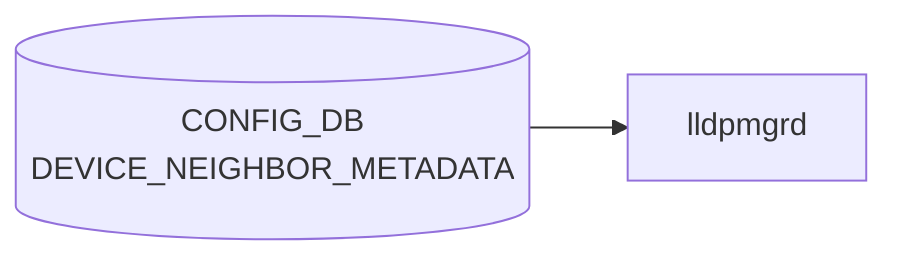

# DEVICE_NEIGHBOR_METADATA テーブル

## 概要

隣接機器（[`DEVICE_NEIGHBOR`](./device-neighbor.md) で参照されるホスト）のメタデータ（hwsku、loopback、管理 IP、deployment_id など）を保持するテーブル[^1]。トポロジ情報を持つ minigraph パーサが `DEVICE_NEIGHBOR` と組で生成する。

<!-- cdb-mermaid -->
### データフロー (自動生成)



!!! note "凡例"
    CONFIG_DB から SAI までの典型経路を `docs/reference/config-db-orch-map.md` から機械生成したミニ図。詳細・例外は本ページ本文と対応表を参照。
<!-- /cdb-mermaid -->

## key 構造

```
DEVICE_NEIGHBOR_METADATA|<name>
```

- `<name>`: 隣接機器ホスト名（length 1..255）

## フィールド

| フィールド | 型 | 説明 |
|-----------|----|------|
| `name` | string (1..255) | 隣接機器ホスト名（key） |
| `cluster` | string | 所属クラスタ名 |
| `hwsku` | `stypes:hwsku` | 隣接機器のハードウェア SKU |
| `lo_addr` | union(ipv4-prefix \| ipv4-address) | loopback IPv4 |
| `lo_addr_v6` | union(ipv6-prefix \| ipv6-address) | loopback IPv6 |
| `mgmt_addr` | union(ipv4-prefix \| ipv4-address) | 管理 IPv4 |
| `mgmt_addr_v6` | union(ipv6-prefix \| ipv6-address) | 管理 IPv6 |
| `type` | string | ネットワーク要素タイプ（`LeafRouter`、`SpineRouter`、`ToRRouter` 等） |
| `deployment_id` | uint32 | デプロイメント識別子 |
| `slice_type` | string | デバイス用メタデータタグ |
| `resource_type` | string | リソース種別（例: `Storage`、`Compute`） |

## 制約

- 同名の `DEVICE_NEIGHBOR_LIST.name` と運用上揃える前提（[YANG](../../reference/glossary.md#term-yang) では leafref 化されていない）
- 各 IP 系 leaf は `union` でアドレス／プレフィクス両形式を許容

## 購読者

- minigraph パーサ ([sonic-cfggen](../../reference/glossary.md#term-sonic-cfggen)): minigraph から生成
- 一部監視・トポロジ可視化スクリプトが参照
- [BGP](../../reference/glossary.md#term-bgp) テンプレート生成 (`bgpcfgd` テンプレート) で hwsku/type を参照することがある

## 関連 CONFIG_DB / YANG / CLI

- 関連 [CONFIG_DB](../../reference/glossary.md#term-config_db): [`DEVICE_NEIGHBOR`](./device-neighbor.md)
- 関連 [YANG](../../reference/glossary.md#term-yang): `sonic-device_neighbor_metadata`
- 関連 CLI: なし

<!-- ref-triangle:start -->

## 関連リファレンス

- [YANG](../../reference/glossary.md#term-yang): `sonic-device_neighbor_metadata`

<!-- ref-triangle:end -->

## 引用元

[^1]: YANG 定義: `sonic-device_neighbor_metadata.yang`. <https://github.com/sonic-net/sonic-buildimage/blob/9ea932ec2e18f35e58268ec2e4456b1d4afd65cd/src/sonic-yang-models/yang-models/sonic-device_neighbor_metadata.yang>

<!-- ops-hint -->
## 運用ヒント

### 典型値

- key 形式: `DEVICE_NEIGHBOR_METADATA|<hostname>`。
- `type`: `LeafRouter` / `SpineRouter` / `ToRRouter` / `Server` 等。`mgmt_addr`、`hwsku` を併記。

### よくある誤設定

- DEVICE_NEIGHBOR と hostname がズレると minigraph 由来の自動 [BGP](../../reference/glossary.md#term-bgp) セッションが立ち上がらない。

### 確認コマンド

```bash
sonic-db-cli CONFIG_DB keys 'DEVICE_NEIGHBOR_METADATA|*'
show lldp table
```
<!-- /ops-hint -->

<!-- glossary-links-injected: 9bd4f7a3d366 -->
