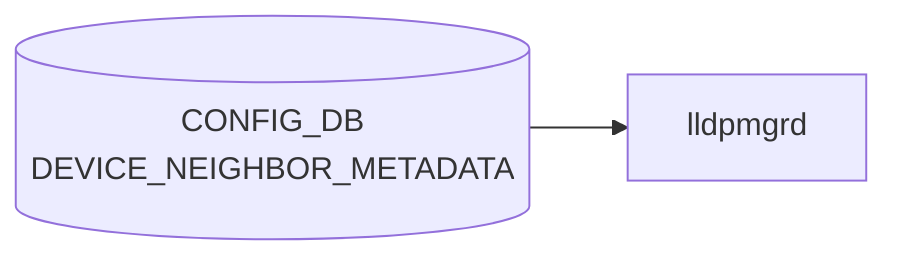

# DEVICE_NEIGHBOR_METADATA テーブル

## 概要

隣接機器（[`DEVICE_NEIGHBOR`](./device-neighbor.md) で参照されるホスト）のメタデータ（hwsku、loopback、管理 IP、deployment_id など）を保持するテーブル[^1]。トポロジ情報を持つ minigraph パーサが `DEVICE_NEIGHBOR` と組で生成する。

<!-- cdb-mermaid -->
### データフロー (自動生成)



!!! note "凡例"
    CONFIG_DB から SAI までの典型経路を `docs/reference/config-db-orch-map.md` から機械生成したミニ図。詳細・例外は本ページ本文と対応表を参照。
<!-- /cdb-mermaid -->

## key 構造

```text
DEVICE_NEIGHBOR_METADATA|<name>
```

- `<name>`: 隣接機器ホスト名（length 1..255）

## フィールド

| フィールド | 型 | 説明 |
|-----------|----|------|
| `name` | string (1..255) | 隣接機器ホスト名（key） |
| `cluster` | string | 所属クラスタ名 |
| `hwsku` | `stypes:hwsku` | 隣接機器のハードウェア SKU |
| `lo_addr` | union(ipv4-prefix \| ipv4-address) | loopback IPv4 |
| `lo_addr_v6` | union(ipv6-prefix \| ipv6-address) | loopback IPv6 |
| `mgmt_addr` | union(ipv4-prefix \| ipv4-address) | 管理 IPv4 |
| `mgmt_addr_v6` | union(ipv6-prefix \| ipv6-address) | 管理 IPv6 |
| `type` | string | ネットワーク要素タイプ（`LeafRouter`、`SpineRouter`、`ToRRouter` 等） |
| `deployment_id` | uint32 | デプロイメント識別子 |
| `slice_type` | string | デバイス用メタデータタグ |
| `resource_type` | string | リソース種別（例: `Storage`、`Compute`） |

<!-- value-behavior -->
## 値依存挙動マトリクス

### `type` (string: 制約なし)

| 値の例 | 挙動 |
|-------|------|
| `ToRRouter` / `LeafRouter` / `SpineRouter` | [BGP](../../reference/glossary.md#term-bgp) テンプレ生成（[bgpcfgd](../../reference/glossary.md#term-bgpcfgd)）で role を参照し、eBGP セッション設定を分岐させることがある |
| `Server` | 末端ホスト扱い（BGP テンプレでは直接利用されないことが多い） |
| 任意の文字列 | YANG 上 string 型で制約なし |

### IP 系フィールド (`lo_addr` / `lo_addr_v6` / `mgmt_addr` / `mgmt_addr_v6`)

| 形式 | 挙動 |
|------|------|
| ipv4-prefix / ipv6-prefix 形式 | prefix 長付きで受理 |
| ipv4-address / ipv6-address 形式 | ホストアドレスとして受理 |
| その他 | YANG union 型違反で reject |

> 明示的な enum 制約なし。フィールド値はすべて自由文字列または union 型。

<!-- /value-behavior -->

## 制約

- 同名の `DEVICE_NEIGHBOR_LIST.name` と運用上揃える前提（[YANG](../../reference/glossary.md#term-yang) では leafref 化されていない）
- 各 IP 系 leaf は `union` でアドレス／プレフィクス両形式を許容

## 購読者

- minigraph パーサ ([sonic-cfggen](../../reference/glossary.md#term-sonic-cfggen)): minigraph から生成
- 一部監視・トポロジ可視化スクリプトが参照
- [BGP](../../reference/glossary.md#term-bgp) テンプレート生成 (`bgpcfgd` テンプレート) で hwsku/type を参照することがある

## 関連 CONFIG_DB / YANG / CLI

- 関連 [CONFIG_DB](../../reference/glossary.md#term-config_db): [`DEVICE_NEIGHBOR`](./device-neighbor.md)
- 関連 [YANG](../../reference/glossary.md#term-yang): `sonic-device_neighbor_metadata`
- 関連 CLI: なし

<!-- ref-triangle:start -->

## 関連リファレンス

- [YANG](../../reference/glossary.md#term-yang): `sonic-device_neighbor_metadata`

<!-- ref-triangle:end -->

## 引用元

[^1]: YANG 定義: `sonic-device_neighbor_metadata.yang`. <https://github.com/sonic-net/sonic-buildimage/blob/9ea932ec2e18f35e58268ec2e4456b1d4afd65cd/src/sonic-yang-models/yang-models/sonic-device_neighbor_metadata.yang>

<!-- ops-hint -->
## 運用ヒント

### 典型値

- key 形式: `DEVICE_NEIGHBOR_METADATA|<hostname>`。
- `type`: `LeafRouter` / `SpineRouter` / `ToRRouter` / `Server` 等。`mgmt_addr`、`hwsku` を併記。

### よくある誤設定

- DEVICE_NEIGHBOR と hostname がズレると minigraph 由来の自動 [BGP](../../reference/glossary.md#term-bgp) セッションが立ち上がらない。

### 確認コマンド

```bash
sonic-db-cli CONFIG_DB keys 'DEVICE_NEIGHBOR_METADATA|*'
show lldp table
```
<!-- /ops-hint -->

<!-- cdb-exceptions -->
## 例外条件・特殊挙動

| consumer | 条件 | 挙動 |
|---|---|---|
| [bgpcfgd](../../reference/glossary.md#term-bgpcfgd) | `DEVICE_NEIGHBOR_METADATA` が directory に未到達 | `log_info("DEVICE_NEIGHBOR_METADATA is not ready...")` を出力して `return False` で延期。依存関係登録済みのため到着後に再処理（managers_bgp.py:220-222） |
| pfcwd | neighbor `name` フィールド欠落 | `KeyError` が発生し pfcwd の起動シーケンスが中断する（pfcwd/main.py:102） |

> **Evidence**: [sonic-buildimage](../../reference/glossary.md#term-sonic-buildimage) `src/sonic-bgpcfgd/bgpcfgd/managers_bgp.py:140,220-224`; [sonic-utilities](../../reference/glossary.md#term-sonic-utilities) `pfcwd/main.py:102`
<!-- /cdb-exceptions -->


<!-- runtime-trace -->
## 実コンテナ動作トレース

### 段階 1 — Consumer 登録

`lldpmgrd` / `intfmgrd` / neighbor discovery が CONFIG_DB の `DEVICE_NEIGHBOR_METADATA` テーブルを購読する。

`DEVICE_NEIGHBOR_METADATA` は `<device_name>` の key で hwsku / type 情報を保持。

### 段階 2 — CFG→APPL 翻訳

なし (APPL_DB 中継なし)

### 段階 3 — APPL→SAI

なし (SAI 非経由 — LLDP / neighbor テーブルのメタデータとして参照)

### 段階 4 — タイミングと副作用

**適用タイミング**: CONFIG_DB に書き込まれると即時に参照可能。lldpmgrd が LLDP neighbor との照合に使用。

**副作用**: neighbor metadata の変更は LLDP 情報の表示 / 解釈に影響。ネットワーク動作への直接影響なし。
<!-- /runtime-trace -->

<!-- entry-points -->
## 書き込み入り口 (Direction A)

対象テーブル: `DEVICE_NEIGHBOR_METADATA`

### CLI
- なし (CLI 書き込みパスなし)

### minigraph / sonic-cfggen
- あり: `sonic-cfggen -m <minigraph.xml>` 実行時に本テーブルが生成・上書きされる

### REST / gNMI (sonic-mgmt-common)
- なし (対応 OpenConfig/SONiC YANG transformer なし)

### db_migrator
- なし

### ビルド時デフォルト (init_cfg / j2 テンプレート)
- `sonic-cfggen -m` で minigraph.xml を処理して生成。`device_metadata.py` の `parse_device_desc_xml()` が各NeighborDevice のメタを読み出す

### ハードコードデフォルト
- なし

### ランタイム注入 (デーモン自動書き込み)
- なし
<!-- /entry-points -->

<!-- defaults -->
## コード由来の暗黙デフォルト

> **Evidence**: `src/sonic-config-engine/minigraph.py`（`parse_device()` / `parse_png()`）、`src/sonic-bgpcfgd/bgpcfgd/managers_bgp.py`、`sonic-utilities/pfcwd/main.py`、`sonic-utilities/show/interfaces/__init__.py`、`files/build_templates/buffers_config.j2`、`files/build_templates/qos_config.j2`

### フィールド別暗黙デフォルト

| フィールド | YANG default | コード由来挙動 | カテゴリ |
|-----------|-------------|----------------|---------|
| `name` (key) | なし（必須） | XML `<Hostname>` から取得。None の場合は後段でサイレント KeyError リスク | 複合必須制約 |
| `hwsku` | なし | `<HwSku>` ノード欠落時は `device_data` に追加されない（silent drop） | silent drop |
| `cluster` | なし | `<ClusterName>` 欠落時 silent drop。自ノードの cluster 取得時は `""` フォールバック（`minigraph.py:2170`） | YANG 外 fallback |
| `lo_addr` | なし | `<Address><IPPrefix>` 欠落時 silent drop。`show interfaces neighbor expected` では文字列 `'None'` を表示。bgpcfgd での `devices[peer]["lo_addr"]` 直接参照では KeyError リスク | silent drop + consumer 依存 |
| `lo_addr_v6` | なし | 欠落時 silent drop。bgpcfgd は事前に `'lo_addr_v6' in devices[neighbor]` でガード済み | silent drop |
| `mgmt_addr` | なし | `<ManagementAddress><IPPrefix>` 欠落時 silent drop。show コマンドでは文字列 `'None'` を表示 | silent drop |
| `mgmt_addr_v6` | なし | 欠落時 silent drop | silent drop |
| `type` | なし（string、enum 制約なし） | `<ElementType>` 欠落時は属性 `xsi:type` にフォールバック。それも欠落なら silent drop。pfcwd は `type` キー欠落時に KeyError（`pfcwd/main.py:104`）。qos_config.j2 は `'ToRRouter' in neighbor_info.type` で `type` が None だとエラー。show コマンドでは文字列 `'None'` 表示 | silent drop + 消費者依存エラー |
| `deployment_id` | なし（uint32） | `<DeploymentId>` テキストを文字列として格納。欠落時 silent drop。bgpcfgd は DEVICE_NEIGHBOR_METADATA の `deployment_id` を直接参照しない（DEVICE_METADATA.localhost.deployment_id を使用） | dead field 候補 |
| `slice_type` | なし | `<AssociatedSliceStr>` テキストに `"AZNG_Production"` が含まれる場合のみ `"AZNG_Production"` 固定値で書き込まれる。それ以外は silent drop | ハードコード固定値 |
| `resource_type` | なし | YANG に定義されているが `parse_device()` が書き込まない。minigraph は `resource_type` を DEVICE_METADATA.localhost にのみ書き込む | dead field / YANG-実装 discrepancy |
| `subtype` | YANG 外フィールド | `parse_device()` が `<SubType>` ノードから読み出し `device_data['subtype']` として書き込む。YANG モデルに定義なし | YANG-実装 discrepancy |

### 経路依存乖離（single-ASIC vs multi-ASIC）

`minigraph.py` の以下ロジックにより格納内容が変わる:

```python
# single-ASIC または asic_name 未指定: 自ホスト以外の全デバイス
results['DEVICE_NEIGHBOR_METADATA'] = {
    key: devices[key] for key in devices if key.lower() != hostname.lower()
}
# multi-ASIC（asic_name 指定あり）: DEVICE_NEIGHBOR に出現するデバイスのみ
results['DEVICE_NEIGHBOR_METADATA'] = {
    key: devices[key] for key in devices
    if key in {device['name'] for device in neighbors.values()}
}
```

multi-ASIC 環境では直接隣接していないデバイスのメタデータが欠落する。

### `type` フィールドの大文字小文字制約

| 消費者 | 比較方法 | 大文字小文字 |
|-------|---------|------------|
| pfcwd | `.lower() == 'server'` | 非感受 |
| buffers_config.j2 | `neighbor_role \| lower` | 非感受 |
| qos_config.j2 | `'ToRRouter' in neighbor_info.type` | 感受（大文字小文字区別） |
| db_migrator | `v.get("type") == "EdgeZoneAggregator"` | 感受 |

`type` 値は大文字小文字を一致させないと qos_config.j2 / db_migrator で意図した分岐に入らない。

### BGP 依存関係と延期ロジック

bgpcfgd では `constants.bgp.use_neighbors_meta` が True の場合のみ DEVICE_NEIGHBOR_METADATA を依存関係として登録する。テーブルが directory に未到達の場合 `log_info("DEVICE_NEIGHBOR_METADATA is not ready...")` を出力し `return False`（到達後に自動再処理）。フラグが False の場合、テーブルは依存関係として登録されず参照もされない。
<!-- /defaults -->

<!-- glossary-links-injected: 6a290c48f0ce -->
