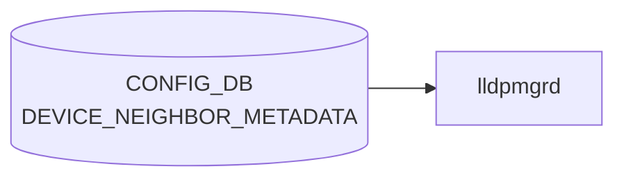

# DEVICE_NEIGHBOR_METADATA テーブル

## 概要

隣接機器（[`DEVICE_NEIGHBOR`](./device-neighbor.md) で参照されるホスト）のメタデータ（hwsku、loopback、管理 IP、deployment_id など）を保持するテーブル[^1]。トポロジ情報を持つ minigraph パーサが `DEVICE_NEIGHBOR` と組で生成する。

<!-- cdb-mermaid -->
### データフロー (自動生成)



!!! note "凡例"
    CONFIG_DB から SAI までの典型経路を `docs/reference/config-db-orch-map.md` から機械生成したミニ図。詳細・例外は本ページ本文と対応表を参照。
<!-- /cdb-mermaid -->

## key 構造

```text
DEVICE_NEIGHBOR_METADATA|<name>
```

- `<name>`: 隣接機器ホスト名（length 1..255）

## フィールド

| フィールド | 型 | 説明 |
|-----------|----|------|
| `name` | string (1..255) | 隣接機器ホスト名（key） |
| `cluster` | string | 所属クラスタ名 |
| `hwsku` | `stypes:hwsku` | 隣接機器のハードウェア SKU |
| `lo_addr` | union(ipv4-prefix \| ipv4-address) | loopback IPv4 |
| `lo_addr_v6` | union(ipv6-prefix \| ipv6-address) | loopback IPv6 |
| `mgmt_addr` | union(ipv4-prefix \| ipv4-address) | 管理 IPv4 |
| `mgmt_addr_v6` | union(ipv6-prefix \| ipv6-address) | 管理 IPv6 |
| `type` | string | ネットワーク要素タイプ（`LeafRouter`、`SpineRouter`、`ToRRouter` 等） |
| `deployment_id` | uint32 | デプロイメント識別子 |
| `slice_type` | string | デバイス用メタデータタグ |
| `resource_type` | string | リソース種別（例: `Storage`、`Compute`） |

<!-- value-behavior -->
## 値依存挙動マトリクス

### `type` (string: 制約なし)

| 値の例 | 挙動 |
|-------|------|
| `ToRRouter` / `LeafRouter` / `SpineRouter` | [BGP](../../reference/glossary.md#term-bgp) テンプレ生成（[bgpcfgd](../../reference/glossary.md#term-bgpcfgd)）で role を参照し、eBGP セッション設定を分岐させることがある |
| `Server` | 末端ホスト扱い（BGP テンプレでは直接利用されないことが多い） |
| 任意の文字列 | YANG 上 string 型で制約なし |

### IP 系フィールド (`lo_addr` / `lo_addr_v6` / `mgmt_addr` / `mgmt_addr_v6`)

| 形式 | 挙動 |
|------|------|
| ipv4-prefix / ipv6-prefix 形式 | prefix 長付きで受理 |
| ipv4-address / ipv6-address 形式 | ホストアドレスとして受理 |
| その他 | YANG union 型違反で reject |

> 明示的な enum 制約なし。フィールド値はすべて自由文字列または union 型。

<!-- /value-behavior -->

## 制約

- 同名の `DEVICE_NEIGHBOR_LIST.name` と運用上揃える前提（[YANG](../../reference/glossary.md#term-yang) では leafref 化されていない）
- 各 IP 系 leaf は `union` でアドレス／プレフィクス両形式を許容

<!-- ordering -->
## 書込み順依存 (Phase B)

`DEVICE_NEIGHBOR_METADATA` は `sonic-cfggen -m <minigraph.xml>` の実行時に一括生成される。生成後は複数の consumer が直接参照するが、以下の順序依存が存在する。

### 検出された順序依存

| # | 依存関係 | 方向 | 緩和策 |
|---|----------|------|--------|
| 1 | `DEVICE_NEIGHBOR_METADATA` ロード → BGP ピア `set_handler` 実行許可（`use_neighbors_meta=True` 時） | **強制先行** | bgpcfgd の directory メカニズムがテーブル到着後に自動再試行 |
| 2 | 個別 `DEVICE_NEIGHBOR_METADATA` エントリ存在 → 対応 BGP ピア設定の適用 | **強制先行** | `return False` で再キュー、エントリ到着後に再処理 |
| 3 | `DEVICE_NEIGHBOR` ロード → `DEVICE_NEIGHBOR_METADATA` 参照（pfcwd） | 実質的直列（同一 `sonic-cfggen` 実行内） | 欠落時は `VLAN_MEMBER` フォールバック |
| 4 | single / multi-ASIC 環境差 → 収録エントリ集合の違い | 環境依存（書込み前提条件） | multi-ASIC では間接隣接デバイスのメタが欠落する前提で consumer を設計 |

### 主要な制約詳細

**bgpcfgd 全件ブロック (依存 #1)**: `BGPPeerMgrBase.__init__()` (`managers_bgp.py:128-140`) は `constants.bgp.use_neighbors_meta == True` の場合のみ `CFG_DEVICE_NEIGHBOR_METADATA_TABLE_NAME` を `deps` に追加する。directory メカニズムはこの宣言を元に「DEVICE_NEIGHBOR_METADATA が到着するまで BGP ピア `set_handler` を実行しない」制御を行う。minigraph 書込み完了前に bgpcfgd が起動している環境では、BGP セッションは DEVICE_NEIGHBOR_METADATA 到着まで**全件ブロック**される（evidence: `managers_bgp.py:128-131,138-140`）。

**個別エントリ不在での延期 (依存 #2)**: `BGPPeerMgrBase.set_handler()` (`managers_bgp.py:218-224`) は `data['name']` が `neigmeta` に存在しない場合に `log_info("DEVICE_NEIGHBOR_METADATA is not ready for neighbor ...")` を出力して `return False`（再試行待ち）を返す。BGP_NEIGHBOR エントリが先に CONFIG_DB に書き込まれても、対応する DEVICE_NEIGHBOR_METADATA エントリが存在しない限り BGP セッション設定は適用されない（evidence: `managers_bgp.py:218-224`）。

**pfcwd の直列参照 (依存 #3)**: `get_server_facing_ports()` (`pfcwd/main.py:97-108`) は DEVICE_NEIGHBOR の各エントリの `name` を使って DEVICE_NEIGHBOR_METADATA の `type` を参照する。DEVICE_NEIGHBOR_METADATA 側に対応エントリがない場合、サーバー向けポートとして列挙されず、VLAN_MEMBER フォールバックに移行する。minigraph は両テーブルを同一実行内で生成するため通常は同時到着するが、テーブル単位の書込み順は `hset` 操作順に依存する（evidence: `pfcwd/main.py:97-108`）。

<!-- /ordering -->

<!-- cross-refs -->
## 暗黙参照テーブル (Phase C)

`DEVICE_NEIGHBOR_METADATA` の consumer はいずれも **`DEVICE_NEIGHBOR` テーブルと組み合わせて**参照する。
`DEVICE_NEIGHBOR[port].name` をキーとして本テーブルの `type` / `hwsku` / `lo_addr` / `mgmt_addr` 等を取得し、
トポロジ認識・バッファ設定・BGP セッション設定・PFC watchdog 等に利用する。

<!-- evidence: meta/_intermediate/cdb-flow/device-neighbor-metadata-cross-refs.md -->

| 依存方向 | 参照元 | 参照先テーブル | 参照フィールド | 用途 | 証跡 |
|---------|--------|--------------|--------------|------|------|
| 読み手 (BGP) | `bgpcfgd BGPPeerMgrBase.set_handler` | `CONFIG_DB BGP_NEIGHBOR` (キー), `CONFIG_DB DEVICE_METADATA\|localhost` | `type`, `hwsku`, `deployment_id` | BGP セッション Jinja2 テンプレートへの渡し — `kwargs['CONFIG_DB__DEVICE_NEIGHBOR_METADATA']` として全 meta を転送 | `managers_bgp.py:218-224` |
| 読み手 (バッファ設定) | `buffers_config.j2` (sonic-cfggen テンプレート) | `CONFIG_DB DEVICE_NEIGHBOR` (ポート→name), `CONFIG_DB DEVICE_METADATA\|localhost` (type/subtype), `CONFIG_DB SYSTEM_DEFAULTS` (tunnel_qos_remap 条件) | `type` | `switch_role + '_' + neighbor_role` の組み合わせでケーブル長を決定; LeafRouter/DualToR + ToRRouter/LeafRouter 条件で extra queues ポートリストを構築 | `buffers_config.j2:81-82,209-210` |
| 読み手 (QoS 設定) | `qos_config.j2` (sonic-cfggen テンプレート) | `CONFIG_DB DEVICE_NEIGHBOR`, `CONFIG_DB DEVICE_METADATA\|localhost` | `type` | アクティブポートを `PORT_UPLINK` / `PORT_DOWNLINK` に分類 (LeafRouter ↔ ToRRouter/SpineRouter, ToRRouter ↔ LeafRouter) | `qos_config.j2:107-108,150-151` |
| 読み手 (pfcwd) | `pfcwd get_server_facing_ports()` | `CONFIG_DB DEVICE_NEIGHBOR` (ポート→name) | `type` | `type.lower() == 'server'` でサーバー向けポートを判定; 欠落時は `CONFIG_DB VLAN_MEMBER` フォールバック | `pfcwd/main.py:97-108` |
| 読み手 (CLI) | `show interfaces neighbor expected` | `CONFIG_DB DEVICE_NEIGHBOR` | `lo_addr`, `mgmt_addr`, `type` 等 | 隣接デバイス情報の表示 (`show interfaces neighbor expected`) | `show/interfaces/__init__.py:315-340` |
| 読み手 (db_migrator) | `update_edgezone_aggregator_config()` | `CONFIG_DB DEVICE_NEIGHBOR`, `CONFIG_DB CABLE_LENGTH` | `type` | `type == 'EdgeZoneAggregator'` のデバイスに接続するポートを特定し CABLE_LENGTH を 40m に更新 | `db_migrator.py:765-790` |

### DEVICE_NEIGHBOR との密結合

全 consumer が `DEVICE_NEIGHBOR[port].name` をルックアップキーとして使用する。
このため `DEVICE_NEIGHBOR` と `DEVICE_NEIGHBOR_METADATA` のホスト名が一致していることが前提となり、
いずれか一方が欠落するか名前がズレた場合、バッファ長・QoS ポートリスト・BGP セッション・pfcwd の動作がすべて影響を受ける。

!!! note "`type` フィールドがトポロジ認識の鍵"
    `buffers_config.j2` / `qos_config.j2` は `type` 値に基づいてポートをアップリンク/ダウンリンクに分類し、
    ケーブル長テーブルを選択する。`type` の大文字小文字感受性は consumer によって異なる
    (`pfcwd` は `.lower()` で比較する一方、`qos_config.j2` は `'ToRRouter' in neighbor_info.type` で大文字小文字を区別する)。

<!-- /cross-refs -->

<!-- failure -->
## 失敗挙動マトリクス (Phase D)

> 根拠: `sonic-utilities/pfcwd/main.py`; `sonic-buildimage/src/sonic-bgpcfgd/bgpcfgd/managers_bgp.py`; `sonic-utilities/scripts/db_migrator.py`

`DEVICE_NEIGHBOR_METADATA` は **CONFIG_DB への書き込みのみ** であり、orchagent のような明示的な task_failed / task_need_retry は持たない。失敗は consumer 側（bgpcfgd / pfcwd / db_migrator 等）で検出・処理される。

### 失敗パス一覧

| # | 失敗トリガー | consumer | 処置 | リトライ |
|---|---|---|---|---|
| 1 | `DEVICE_NEIGHBOR_METADATA` テーブル未到達（directory 未登録） | bgpcfgd `BGPPeerMgrBase.set_handler` | directory メカニズムがテーブル到着まで全 BGP ピア SET をブロック（`return False`） | あり（テーブル到着後に自動再処理） |
| 2 | 個別エントリ `data['name']` が neigmeta に不在 | bgpcfgd `BGPPeerMgrBase.add_peer` | `log_info("DEVICE_NEIGHBOR_METADATA is not ready for neighbor ...")`, `return False` | あり（エントリ到着後に directory が再通知） |
| 3 | `candidates[port]['name']` キー欠落（DEVICE_NEIGHBOR エントリに `name` フィールドなし） | pfcwd `get_server_facing_ports` | `KeyError` 例外発生 → pfcwd の起動シーケンスが中断 | なし（pfcwd プロセス再起動まで） |
| 4 | `neighbor['type']` キー欠落（DEVICE_NEIGHBOR_METADATA エントリに `type` なし） | pfcwd `get_server_facing_ports` | `KeyError` 例外発生 → pfcwd の起動シーケンスが中断 | なし（pfcwd プロセス再起動まで） |
| 5 | サーバー向けポートが 0 件（`type == 'server'` エントリなし） | pfcwd `get_server_facing_ports` | `VLAN_MEMBER` をフォールバックとして使用（サイレント） | N/A（フォールバックで継続） |
| 6 | `DEVICE_NEIGHBOR_METADATA` テーブルが空または EdgeZoneAggregator 型なし | db_migrator `update_edgezone_aggregator_config` | 早期 return（CABLE_LENGTH 変更なし）、サイレント継続 | N/A（冪等） |
| 7 | `type` フィールド値の大文字小文字不一致（`qos_config.j2`） | sonic-cfggen / `qos_config.j2` | `'ToRRouter' in neighbor_info.type` が `False` → アップリンク/ダウンリンク分類が行われない（サイレント） | なし（cfggen 再実行まで） |

### 詳細

#### 1 & 2. bgpcfgd directory ブロックと個別エントリ延期

bgpcfgd は `constants.bgp.use_neighbors_meta == True` の場合のみ `DEVICE_NEIGHBOR_METADATA` を
依存テーブル (`deps`) として宣言する (`managers_bgp.py:128-140`)。
宣言された場合、directory メカニズムはテーブル全体が到着するまで BGP ピア `set_handler` の
実行を保留する（全件ブロック）。

テーブル到着後は個別エントリ単位のチェックが走る。`data['name']` が `neigmeta` に存在しない場合、
`log_info` を出力して `return False` し再試行を待つ。minigraph 書込み完了前に bgpcfgd が起動している
環境や、BGP_NEIGHBOR エントリを手動で先書きした場合に発生しやすい。

```python
# managers_bgp.py:219-223
if self.check_neig_meta:
    neigmeta = self.directory.get_slot("CONFIG_DB", swsscommon.CFG_DEVICE_NEIGHBOR_METADATA_TABLE_NAME)
    if 'name' in data and data["name"] not in neigmeta:
        log_info("DEVICE_NEIGHBOR_METADATA is not ready for neighbor '%s' - '%s'" % (nbr, data['name']))
        return False
```

#### 3 & 4. pfcwd KeyError によるプロセス中断

`get_server_facing_ports()` (`pfcwd/main.py:97-108`) は
`candidates[port]['name']` で DEVICE_NEIGHBOR から名前を取得し、
続けて `neighbor['type'].lower()` で型を参照する。

`name` または `type` フィールドが欠落している場合は `KeyError` が発生する。
pfcwd は try-catch を設けていないため、例外はコールスタックを伝播して
pfcwd の起動シーケンス (`start_default`) が中断される。

!!! warning "pfcwd 起動中断"
    DEVICE_NEIGHBOR_METADATA の `type` フィールドを省略して書き込むと、
    pfcwd の初回起動時に `KeyError` でプロセスが中断する。
    minigraph 経由では `type` が常に書き込まれるが、直接 DB 操作時は要注意。

#### 5. サーバー向けポート 0 件 → VLAN_MEMBER フォールバック

`type.lower() == 'server'` に合致するエントリが存在しない場合、
`server_facing_ports` は空リストとなり、`VLAN_MEMBER` テーブルのポートで代替される。
これはサイレントなフォールバックで、ログ出力もエラーも発生しない
(`pfcwd/main.py:106-107`)。

<!-- /failure -->

<!-- constants -->
## ハードコード定数 (Phase E)

`DEVICE_NEIGHBOR_METADATA` を参照・生成する consumer コード内に存在する、CONFIG_DB / YANG で管理されないハードコード定数の一覧。出典は `sonic-buildimage/src/sonic-config-engine/minigraph.py`、`sonic-utilities/pfcwd/main.py`、`sonic-utilities/scripts/db_migrator.py`、`sonic-buildimage/files/build_templates/buffers_config.j2`、`sonic-buildimage/files/build_templates/qos_config.j2`。

### minigraph.py — `type` フィールドに関連するデバイス種別定数

| 定数 | 値 | 用途 | ソース |
|------|----|------|--------|
| `backend_device_types` | `['BackEndToRRouter', 'BackEndLeafRouter']` | バックエンドデバイス判定（DEVICE_METADATA.localhost 対象） | `minigraph.py:51` |
| `leafrouter_device_types` | `['LeafRouter']` | リーフルーター判定 | `minigraph.py:55` |
| `dhcp_server_enabled_device_types` | `['BmcMgmtToRRouter']` | DHCP サーバ有効化対象デバイス種別 | `minigraph.py:53` |
| `mgmt_device_types` | `['BmcMgmtToRRouter', 'MgmtToRRouter', 'MgmtTsToR']` | 管理デバイス判定 | `minigraph.py:54` |

> これらのリストは DEVICE_METADATA.localhost.type の判定に使用されるが、DEVICE_NEIGHBOR_METADATA の `type` フィールドにも同系統の文字列（`LeafRouter`, `SpineRouter`, `ToRRouter`, `Server`, `EdgeZoneAggregator` 等）が格納される。両テーブルで参照される文字列リテラルは YANG 上制約されておらず、コード内ハードコードのみが事実上の仕様。

### minigraph.py — `slice_type` の固定値

| 定数 | 値 | 条件 | ソース |
|------|----|------|--------|
| `slice_type` 固定値 | `"AZNG_Production"` | XML の `<AssociatedSliceStr>` テキストに `"AZNG_Production"` が含まれる場合のみ書き込む | `minigraph.py:518-519` |

`slice_type` は上記条件を満たす場合に限り `"AZNG_Production"` という固定文字列で書き込まれる。条件不一致の場合は `None` のままで DEVICE_NEIGHBOR_METADATA へは追加されない（silent drop）。YANG 上は自由文字列だが実装は事実上二値（`"AZNG_Production"` or 欠落）。

### pfcwd — サーバー判定文字列とフォールバック

| 定数 | 値 | 用途 | ソース |
|------|----|------|--------|
| サーバー種別判定 | `'server'`（`.lower()` で大文字小文字非感受） | `type.lower() == 'server'` でサーバー向けポートを選別 | `pfcwd/main.py:104` |

DEVICE_NEIGHBOR_METADATA にサーバー向けポートが 0 件の場合、`get_server_facing_ports()` は自動的に `VLAN_MEMBER` テーブルのポートにフォールバックする（`pfcwd/main.py:106-107`）。この切り替えに明示的な定数はなく、空リスト判定のみ。

### db_migrator — EdgeZoneAggregator ケーブル長

| 定数 | 値 | 用途 | ソース |
|------|----|------|--------|
| `EDGEZONE_AGG_CABLE_LENGTH` | `"40m"` | EdgeZoneAggregator デバイスに接続するポートの CABLE_LENGTH 強制値 | `db_migrator.py:771` |
| CABLE_LENGTH テーブルキー | `"AZURE"` | 参照・更新対象のキー名（ハードコード） | `db_migrator.py:783` |
| EdgeZoneAggregator 型名 | `"EdgeZoneAggregator"` | 大文字小文字感受の完全一致で判定（`.get("type") == "EdgeZoneAggregator"`） | `db_migrator.py:772` |

> `"EdgeZoneAggregator"` は大文字小文字感受（完全一致）。`pfcwd` の `'server'` 判定（`.lower()` 比較）と異なる点に注意。

### buffers_config.j2 / qos_config.j2 — ポートロール分類文字列

| テンプレート | リテラル | 比較方式 | 用途 |
|------------|---------|---------|------|
| `buffers_config.j2` | `'LeafRouter'`, `'ToRRouter'`, `'SpineRouter'`, `'BackEndLeafRouter'`, `'BackEndToRRouter'` | `neighbor_role \| lower`（大文字小文字非感受） | ケーブル長テーブル選択・extra queues ポートリスト構築 |
| `qos_config.j2` | `'ToRRouter'`, `'LeafRouter'`, `'SpineRouter'` | `'ToRRouter' in neighbor_info.type`（大文字小文字感受・部分一致） | アップリンク/ダウンリンクポート分類 |

`qos_config.j2` の `'ToRRouter' in neighbor_info.type` は**大文字小文字感受の部分一致**であり、`'torporouter'` や `'tOrRouter'` では一致しない。`buffers_config.j2` の `neighbor_role | lower` は Jinja2 フィルタで正規化するため大文字小文字に非感受。同じ `type` 文字列を参照しながら比較方式が異なることに注意（詳細は `<!-- defaults -->` セクション参照）。

詳細な定数一覧は `meta/_intermediate/cdb-flow/device-neighbor-metadata-constants.md` を参照。
<!-- /constants -->

<!-- side-effects -->
## 副次 DB 書込 (Phase F)

`DEVICE_NEIGHBOR_METADATA` はオーケストレータを経由しない（SAI 非到達）ため、本テーブルの **直接的な** 副次書き込みはない。ただし consumer として本テーブルを参照するプロセスが他の DB テーブルへ波及書き込みを行う。

### bgpcfgd → STATE_DB BGP_PEER_CONFIGURED_TABLE 書き込み

`BGPPeerMgrBase.add_peer()` (`managers_bgp.py:172-243`) は DEVICE_NEIGHBOR_METADATA の内容を `kwargs['CONFIG_DB__DEVICE_NEIGHBOR_METADATA']` として Jinja2 テンプレートに渡して BGP ピア設定を FRR に適用する。テンプレート展開成功後に `update_state_db(vrf, nbr, data, "SET")` (`managers_bgp.py:239`) を呼び出す。

| 副次 DB | テーブル / キー | フィールド | 書込内容 | 根拠 |
|---------|---------------|---------|---------|------|
| STATE_DB | `BGP_PEER_CONFIGURED_TABLE\|<nbr>` （デフォルト VRF）または `BGP_PEER_CONFIGURED_TABLE\|<vrf>\|<nbr>` | BGP_NEIGHBOR データ全フィールド | BGP ピア設定内容（sorted items）| `managers_bgp.py:287-290` |

**条件**: `constants.bgp.use_neighbors_meta == True` かつ DEVICE_NEIGHBOR_METADATA に対応エントリが存在し、テンプレート展開が成功した場合のみ。`use_neighbors_meta == False` の環境ではこの副次書き込みは発生しない。

**DEL 時**: `update_state_db(vrf, nbr, data, "DEL")` で同エントリを削除する（`managers_bgp.py:292-294`）。

### db_migrator → CONFIG_DB CABLE_LENGTH テーブル更新

`update_edgezone_aggregator_config()` (`db_migrator.py:757-799`) は DB マイグレーション時に DEVICE_NEIGHBOR_METADATA の `type == "EdgeZoneAggregator"` エントリを検索し、対応ポートの `CABLE_LENGTH|AZURE` を強制的に `"40m"` に更新する。

| 副次 DB | テーブル / キー | フィールド | 書込内容 | 根拠 |
|---------|---------------|---------|---------|------|
| CONFIG_DB | `CABLE_LENGTH\|AZURE` | EdgeZoneAggregator 接続ポート名 | `"40m"` 固定 | `db_migrator.py:799` |

**発生条件**: `type == "EdgeZoneAggregator"` エントリが存在し、かつ CABLE_LENGTH テーブルに不均一な値がある場合のみ。全エントリが同一値の場合は early return で変更なし（冪等）。

### sonic-cfggen テンプレートによる波及（minigraph 再生成時）

`buffers_config.j2` / `qos_config.j2` は `sonic-cfggen` 実行時に DEVICE_NEIGHBOR_METADATA の `type` フィールドを参照して ポートロール（uplink/downlink）とケーブル長を決定し、CONFIG_DB の CABLE_LENGTH / QoS テーブルへ出力する。これは `sonic-cfggen -m <minigraph.xml>` 実行時にのみ発生する（実行時の Consumer 書き込みではない）。

| 副次 DB | テーブル / キー | 書込内容 | 根拠 |
|---------|---------------|---------|------|
| CONFIG_DB | `CABLE_LENGTH\|AZURE` | `type` ベースのケーブル長（`switch_role + '_' + neighbor_role` ルックアップ） | `buffers_config.j2:81-103` |
| CONFIG_DB | QoS テーブル（QUEUE / SCHEDULER 等）| PORT_UPLINK / PORT_DOWNLINK リストに基づいた QoS 設定 | `qos_config.j2:107-125` |

### 副次書き込みが発生しないケース

| ケース | 理由 |
|--------|------|
| `use_neighbors_meta == False` | bgpcfgd が DEVICE_NEIGHBOR_METADATA を依存として登録しない → STATE_DB BGP_PEER_CONFIGURED_TABLE への書き込みなし |
| EdgeZoneAggregator エントリなし | `update_edgezone_aggregator_config()` が早期 return → CABLE_LENGTH 変更なし |
| CABLE_LENGTH テーブルに不均一値なし | db_migrator が冪等判定で終了 → CABLE_LENGTH 変更なし |
| APPL_DB / COUNTERS_DB / FLEX_COUNTER_DB | 本テーブルは orchagent に到達しないため SAI レイヤの副次書き込みなし |

> **スキャン証跡**: `managers_bgp.py` L128-243, L271-300 読了。`db_migrator.py` L757-799 読了。`buffers_config.j2` L76-130 読了。`qos_config.j2` L103-154 読了。副次書き込み先は STATE_DB (`BGP_PEER_CONFIGURED_TABLE`) と CONFIG_DB (`CABLE_LENGTH|AZURE`) の 2 テーブル。詳細は `meta/_intermediate/cdb-flow/device-neighbor-metadata-side-effects.md` 参照。
<!-- /side-effects -->

## 購読者

- minigraph パーサ ([sonic-cfggen](../../reference/glossary.md#term-sonic-cfggen)): minigraph から生成
- 一部監視・トポロジ可視化スクリプトが参照
- [BGP](../../reference/glossary.md#term-bgp) テンプレート生成 (`bgpcfgd` テンプレート) で hwsku/type を参照することがある

## 関連 CONFIG_DB / YANG / CLI

- 関連 [CONFIG_DB](../../reference/glossary.md#term-config_db): [`DEVICE_NEIGHBOR`](./device-neighbor.md)
- 関連 [YANG](../../reference/glossary.md#term-yang): `sonic-device_neighbor_metadata`
- 関連 CLI: なし

<!-- ref-triangle:start -->

## 関連リファレンス

- [YANG](../../reference/glossary.md#term-yang): `sonic-device_neighbor_metadata`

<!-- ref-triangle:end -->

## 引用元

[^1]: YANG 定義: `sonic-device_neighbor_metadata.yang`. <https://github.com/sonic-net/sonic-buildimage/blob/9ea932ec2e18f35e58268ec2e4456b1d4afd65cd/src/sonic-yang-models/yang-models/sonic-device_neighbor_metadata.yang>

<!-- ops-hint -->
## 運用ヒント

### 典型値

- key 形式: `DEVICE_NEIGHBOR_METADATA|<hostname>`。
- `type`: `LeafRouter` / `SpineRouter` / `ToRRouter` / `Server` 等。`mgmt_addr`、`hwsku` を併記。

### よくある誤設定

- DEVICE_NEIGHBOR と hostname がズレると minigraph 由来の自動 [BGP](../../reference/glossary.md#term-bgp) セッションが立ち上がらない。

### 確認コマンド

```bash
sonic-db-cli CONFIG_DB keys 'DEVICE_NEIGHBOR_METADATA|*'
show lldp table
```
<!-- /ops-hint -->

<!-- cdb-exceptions -->
## 例外条件・特殊挙動

| consumer | 条件 | 挙動 |
|---|---|---|
| [bgpcfgd](../../reference/glossary.md#term-bgpcfgd) | `DEVICE_NEIGHBOR_METADATA` が directory に未到達 | `log_info("DEVICE_NEIGHBOR_METADATA is not ready...")` を出力して `return False` で延期。依存関係登録済みのため到着後に再処理（managers_bgp.py:220-222） |
| pfcwd | neighbor `name` フィールド欠落 | `KeyError` が発生し pfcwd の起動シーケンスが中断する（pfcwd/main.py:102） |

> **Evidence**: [sonic-buildimage](../../reference/glossary.md#term-sonic-buildimage) `src/sonic-bgpcfgd/bgpcfgd/managers_bgp.py:140,220-224`; [sonic-utilities](../../reference/glossary.md#term-sonic-utilities) `pfcwd/main.py:102`
<!-- /cdb-exceptions -->


<!-- runtime-trace -->
## 実コンテナ動作トレース

### 段階 1 — Consumer 登録

`lldpmgrd` / `intfmgrd` / neighbor discovery が CONFIG_DB の `DEVICE_NEIGHBOR_METADATA` テーブルを購読する。

`DEVICE_NEIGHBOR_METADATA` は `<device_name>` の key で hwsku / type 情報を保持。

### 段階 2 — CFG→APPL 翻訳

なし (APPL_DB 中継なし)

### 段階 3 — APPL→SAI

なし (SAI 非経由 — LLDP / neighbor テーブルのメタデータとして参照)

### 段階 4 — タイミングと副作用

**適用タイミング**: CONFIG_DB に書き込まれると即時に参照可能。lldpmgrd が LLDP neighbor との照合に使用。

**副作用**: neighbor metadata の変更は LLDP 情報の表示 / 解釈に影響。ネットワーク動作への直接影響なし。
<!-- /runtime-trace -->

<!-- entry-points -->
## 書き込み入り口 (Direction A)

対象テーブル: `DEVICE_NEIGHBOR_METADATA`

### CLI
- なし (CLI 書き込みパスなし)

### minigraph / sonic-cfggen
- あり: `sonic-cfggen -m <minigraph.xml>` 実行時に本テーブルが生成・上書きされる

### REST / gNMI (sonic-mgmt-common)
- なし (対応 OpenConfig/SONiC YANG transformer なし)

### db_migrator
- なし

### ビルド時デフォルト (init_cfg / j2 テンプレート)
- `sonic-cfggen -m` で minigraph.xml を処理して生成。`device_metadata.py` の `parse_device_desc_xml()` が各NeighborDevice のメタを読み出す

### ハードコードデフォルト
- なし

### ランタイム注入 (デーモン自動書き込み)
- なし
<!-- /entry-points -->

<!-- defaults -->
## コード由来の暗黙デフォルト

> **Evidence**: `src/sonic-config-engine/minigraph.py`（`parse_device()` / `parse_png()`）、`src/sonic-bgpcfgd/bgpcfgd/managers_bgp.py`、`sonic-utilities/pfcwd/main.py`、`sonic-utilities/show/interfaces/__init__.py`、`files/build_templates/buffers_config.j2`、`files/build_templates/qos_config.j2`

### フィールド別暗黙デフォルト

| フィールド | YANG default | コード由来挙動 | カテゴリ |
|-----------|-------------|----------------|---------|
| `name` (key) | なし（必須） | XML `<Hostname>` から取得。None の場合は後段でサイレント KeyError リスク | 複合必須制約 |
| `hwsku` | なし | `<HwSku>` ノード欠落時は `device_data` に追加されない（silent drop） | silent drop |
| `cluster` | なし | `<ClusterName>` 欠落時 silent drop。自ノードの cluster 取得時は `""` フォールバック（`minigraph.py:2170`） | YANG 外 fallback |
| `lo_addr` | なし | `<Address><IPPrefix>` 欠落時 silent drop。`show interfaces neighbor expected` では文字列 `'None'` を表示。bgpcfgd での `devices[peer]["lo_addr"]` 直接参照では KeyError リスク | silent drop + consumer 依存 |
| `lo_addr_v6` | なし | 欠落時 silent drop。bgpcfgd は事前に `'lo_addr_v6' in devices[neighbor]` でガード済み | silent drop |
| `mgmt_addr` | なし | `<ManagementAddress><IPPrefix>` 欠落時 silent drop。show コマンドでは文字列 `'None'` を表示 | silent drop |
| `mgmt_addr_v6` | なし | 欠落時 silent drop | silent drop |
| `type` | なし（string、enum 制約なし） | `<ElementType>` 欠落時は属性 `xsi:type` にフォールバック。それも欠落なら silent drop。pfcwd は `type` キー欠落時に KeyError（`pfcwd/main.py:104`）。qos_config.j2 は `'ToRRouter' in neighbor_info.type` で `type` が None だとエラー。show コマンドでは文字列 `'None'` 表示 | silent drop + 消費者依存エラー |
| `deployment_id` | なし（uint32） | `<DeploymentId>` テキストを文字列として格納。欠落時 silent drop。bgpcfgd は DEVICE_NEIGHBOR_METADATA の `deployment_id` を直接参照しない（DEVICE_METADATA.localhost.deployment_id を使用） | dead field 候補 |
| `slice_type` | なし | `<AssociatedSliceStr>` テキストに `"AZNG_Production"` が含まれる場合のみ `"AZNG_Production"` 固定値で書き込まれる。それ以外は silent drop | ハードコード固定値 |
| `resource_type` | なし | YANG に定義されているが `parse_device()` が書き込まない。minigraph は `resource_type` を DEVICE_METADATA.localhost にのみ書き込む | dead field / YANG-実装 discrepancy |
| `subtype` | YANG 外フィールド | `parse_device()` が `<SubType>` ノードから読み出し `device_data['subtype']` として書き込む。YANG モデルに定義なし | YANG-実装 discrepancy |

### 経路依存乖離（single-ASIC vs multi-ASIC）

`minigraph.py` の以下ロジックにより格納内容が変わる:

```python
# single-ASIC または asic_name 未指定: 自ホスト以外の全デバイス
results['DEVICE_NEIGHBOR_METADATA'] = {
    key: devices[key] for key in devices if key.lower() != hostname.lower()
}
# multi-ASIC（asic_name 指定あり）: DEVICE_NEIGHBOR に出現するデバイスのみ
results['DEVICE_NEIGHBOR_METADATA'] = {
    key: devices[key] for key in devices
    if key in {device['name'] for device in neighbors.values()}
}
```

multi-ASIC 環境では直接隣接していないデバイスのメタデータが欠落する。

### `type` フィールドの大文字小文字制約

| 消費者 | 比較方法 | 大文字小文字 |
|-------|---------|------------|
| pfcwd | `.lower() == 'server'` | 非感受 |
| buffers_config.j2 | `neighbor_role \| lower` | 非感受 |
| qos_config.j2 | `'ToRRouter' in neighbor_info.type` | 感受（大文字小文字区別） |
| db_migrator | `v.get("type") == "EdgeZoneAggregator"` | 感受 |

`type` 値は大文字小文字を一致させないと qos_config.j2 / db_migrator で意図した分岐に入らない。

### BGP 依存関係と延期ロジック

bgpcfgd では `constants.bgp.use_neighbors_meta` が True の場合のみ DEVICE_NEIGHBOR_METADATA を依存関係として登録する。テーブルが directory に未到達の場合 `log_info("DEVICE_NEIGHBOR_METADATA is not ready...")` を出力し `return False`（到達後に自動再処理）。フラグが False の場合、テーブルは依存関係として登録されず参照もされない。
<!-- /defaults -->

<!-- glossary-links-injected: 6a290c48f0ce -->
