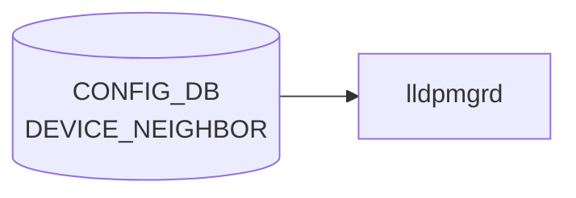

# DEVICE_NEIGHBOR テーブル

## 概要

直接接続される隣接機器（cable 配線レベル）と自スイッチの port を紐付けるテーブル[^1]。[LLDP](../../reference/glossary.md#term-lldp) の正解値 (expected neighbor) として `lldp` / `lldpmgrd` が利用するほか、minigraph 取り込み時にも生成される。隣接機器の hwsku 等のメタデータは [`DEVICE_NEIGHBOR_METADATA`](./device-neighbor-metadata.md) 側で管理する。

<!-- cdb-mermaid -->
### データフロー (自動生成)



!!! note "凡例"
    CONFIG_DB から SAI までの典型経路を `docs/reference/config-db-orch-map.md` から機械生成したミニ図。詳細・例外は本ページ本文と対応表を参照。
<!-- /cdb-mermaid -->

## key 構造

```text
DEVICE_NEIGHBOR|<peer_name>
```

- `<peer_name>`: 自由文字列（length 1..255）。通常は隣接機器のホスト名と同値だが、key 重複回避のための識別子として独立して使われる。

## フィールド

| フィールド | 型 | 説明 |
|-----------|----|------|
| `peer_name` | string (1..255) | エントリ識別子（key） |
| `name` | string (1..255) | 隣接機器のホスト名 |
| `mgmt_addr` | inet:ip-address | 隣接機器の管理 IP |
| `local_port` | leafref → `PORT.name` | 自スイッチ側ポート名 |
| `port` | string (1..255) | 隣接側ポート名 |
| `type` | string (1..255) | 隣接機器タイプ（`ToRRouter`、`LeafRouter` 等の運用ロール文字列） |

<!-- value-behavior -->
## 値依存挙動マトリクス

### `local_port` (leafref → PORT.name)

| 値 | 挙動 |
|----|------|
| 存在する PORT.name | lldpmgrd が期待 neighbor の照合に使用 |
| 存在しない PORT.name | YANG leafref 違反で reject |

### `type` (string: 制約なし)

| 値の例 | 挙動 |
|-------|------|
| `ToRRouter` / `LeafRouter` 等 | lldpmgrd や [BGP](../../reference/glossary.md#term-bgp) テンプレが参照することがある |
| 任意の文字列 | YANG 上 string 型で制約なし |

> フィールドに明示的な enum 制約なし。`local_port` の leafref 違反のみ YANG レベルで reject。

<!-- /value-behavior -->

## 制約

- `local_port` は `PORT_LIST.name` への leafref。存在しないポートを指定するとバリデーションで弾かれる
- `name` は `DEVICE_NEIGHBOR_METADATA_LIST.name` と慣習的に一致させ、メタデータ側を joins する運用が一般的（[YANG](../../reference/glossary.md#term-yang) レベルでは leafref 化されていない）

## 購読者

- `lldpmgrd`: 期待 neighbor として [LLDP](../../reference/glossary.md#term-lldp) の判定に利用
- minigraph パーサ ([sonic-cfggen](../../reference/glossary.md#term-sonic-cfggen)): `minigraph.xml` から生成

## 関連 CONFIG_DB / YANG / CLI

- 関連 [CONFIG_DB](../../reference/glossary.md#term-config_db): [`DEVICE_NEIGHBOR_METADATA`](./device-neighbor-metadata.md)、`PORT`
- 関連 [YANG](../../reference/glossary.md#term-yang): `sonic-device_neighbor`、`sonic-device_neighbor_metadata`
- 関連 CLI: なし（minigraph または `config_db.json` 経由で投入）

<!-- ref-triangle:start -->

## 関連リファレンス

- [YANG](../../reference/glossary.md#term-yang): `sonic-device_neighbor`

<!-- ref-triangle:end -->

## 引用元

[^1]: YANG 定義: `sonic-device_neighbor.yang`. <https://github.com/sonic-net/sonic-buildimage/blob/9ea932ec2e18f35e58268ec2e4456b1d4afd65cd/src/sonic-yang-models/yang-models/sonic-device_neighbor.yang>

<!-- ops-hint -->
## 運用ヒント

### 典型値

- key 形式: `DEVICE_NEIGHBOR|Ethernet0`。
- `name`: 対向ホスト名（minigraph 由来）。
- `port`: 対向ポート名。

### よくある誤設定

- `name` が `DEVICE_NEIGHBOR_METADATA` に未登録だと [BGP](../../reference/glossary.md#term-bgp) の neighbor 名解決が失敗。

### 確認コマンド

```bash
sonic-db-cli CONFIG_DB keys 'DEVICE_NEIGHBOR|*'
show lldp neighbors
```
<!-- /ops-hint -->

<!-- cdb-exceptions -->
## 例外条件・特殊挙動

| consumer | 条件 | 挙動 |
|---|---|---|
| minigraph.py | [port_config.ini](../../reference/glossary.md#term-port-config-ini) に存在しないインターフェイスがエントリに含まれる | `Warning: ignore interface '%s' in DEVICE_NEIGHBOR...` を stderr に出力してスキップ（minigraph.py:2635） |
| show interfaces | DEVICE_NEIGHBOR テーブルが空 | `"DEVICE_NEIGHBOR information is not present."` を表示して継続。エラーにはならない（show/interfaces/__init__.py:318） |
| pfcwd | DEVICE_NEIGHBOR テーブルが空 | 全ポートを内部ポートとして扱い、外部ポート判定を行わない（pfcwd/main.py:413） |

> **Evidence**: [sonic-buildimage](../../reference/glossary.md#term-sonic-buildimage) `src/sonic-config-engine/minigraph.py:2635`; [sonic-utilities](../../reference/glossary.md#term-sonic-utilities) `show/interfaces/__init__.py:318`, `pfcwd/main.py:413`
<!-- /cdb-exceptions -->

<!-- ordering -->
## 書込み順依存 (Phase B)

`DEVICE_NEIGHBOR` には orchagent / SAI 経路の依存はない。書込み順が問題になるのは **minigraph.py によるテーブル生成時** と、**pfcwd / ecnconfig がテーブルを参照するタイミング** の 2 箇所である。

### minigraph による生成順序

`sonic-cfggen -m <minigraph.xml>` の `parse_xml()` 内部では、以下の順序で処理が行われる。

| ステップ | 処理内容 | evidence |
|--------|---------|---------|
| 1 | `get_port_config()` で `port_config.ini` を読み込み `ports` dict を構築 | `minigraph.py:2064` |
| 2 | minigraph.xml 解析で隣接情報 `neighbors` dict を構築 | `minigraph.py:649,741,766` |
| 3 | `ports` に存在しない key を `neighbors` から削除（Warning 出力） | `minigraph.py:2631-2636` |
| 4 | `results['DEVICE_NEIGHBOR'] = neighbors` を確定 | `minigraph.py:2637` |
| 5 | `results['DEVICE_NEIGHBOR_METADATA']` を `neighbors.values()` から派生生成 | `minigraph.py:2638-2641` |

**PORT（`port_config.ini`）が先行必須**: ステップ 3 で `port_config.ini` に存在しないインターフェイス名のエントリは自動削除される。DEVICE_NEIGHBOR のキー空間は PORT テーブルのキー空間のサブセットであることが保証される。

**DEVICE_NEIGHBOR → DEVICE_NEIGHBOR_METADATA の派生順序**: ステップ 5 で `neighbors.values()` の `name` フィールドを使って DEVICE_NEIGHBOR_METADATA のエントリセットが決定される（multi-ASIC 環境）。DEVICE_NEIGHBOR が確定していないと DEVICE_NEIGHBOR_METADATA の絞り込みが正しく行われない。

### pfcwd start_default の依存

`pfcwd start_default`（`pfcwd/main.py:413`）は起動時に `get_table('DEVICE_NEIGHBOR').keys()` を外部ポート一覧として取得する。**DEVICE_NEIGHBOR が空の状態で `pfcwd start_default` を実行すると外部ポートが 0 件となり、PFC Watchdog が外部ポートに対して有効化されない**（silent misconfiguration）。

推奨書込み順:

```
1. PORT テーブル確定（port_config.ini 由来）
2. DEVICE_NEIGHBOR 書込み（sonic-cfggen -m での minigraph 処理）
3. DEVICE_NEIGHBOR_METADATA 書込み（同上 parse_xml() 内で自動派生）
4. pfcwd start_default 実行（外部ポートが正しく認識される前提）
```

### ecnconfig の依存

`ecnconfig`（`scripts/ecnconfig:282-287`）は非 multi-ASIC 環境でポート一覧として `DEVICE_NEIGHBOR.keys()` を使用する。テーブルが空の場合は `Exception("No active ports detected...")` を raise し処理が中断する。DEVICE_NEIGHBOR が書き込まれる前に ecnconfig を実行してはならない。

### bgpcfgd の間接依存

`bgpcfgd`（`managers_bgp.py:219-224`）は `BGP_NEIGHBOR` の SET 処理時に `DEVICE_NEIGHBOR_METADATA` を参照し、`data['name']`（DEVICE_NEIGHBOR の `name` フィールドと一致する値）が DEVICE_NEIGHBOR_METADATA に存在しない場合は `return False` でピア追加を保留する。DEVICE_NEIGHBOR_METADATA の内容は DEVICE_NEIGHBOR の `name` 集合から派生するため、DEVICE_NEIGHBOR が正しく書き込まれていないと BGP セッション確立が silent に失敗する。

> **Evidence**: `sonic-buildimage` `src/sonic-config-engine/minigraph.py:2064,2631-2641`; `sonic-utilities` `pfcwd/main.py:413-416`; `scripts/ecnconfig:282-287`; `sonic-buildimage` `src/sonic-bgpcfgd/bgpcfgd/managers_bgp.py:219-224`
<!-- /ordering -->

<!-- cross-refs -->
## 暗黙参照テーブル (Phase C)

<!-- evidence: meta/_intermediate/cdb-flow/device-neighbor-cross-refs.md -->

`DEVICE_NEIGHBOR` テーブルは単独で機能せず、書き込み時・参照時に複数のテーブルおよびファイルシステムリソースを暗黙的に参照する。

| 参照先テーブル / リソース | 参照方向 | 条件 | evidence |
|--------------------------|---------|------|----------|
| `PORT`（CONFIG_DB） | `local_port` leafref による書き込み時バリデーション | YANG バリデーション有効時。存在しないポート名は reject | `sonic-device_neighbor.yang:52-55` |
| `port_config.ini`（ファイルシステム） | minigraph 生成時のフィルタ参照（ポート名の存在確認） | `sonic-cfggen -m` 実行時。対応ポートなしのエントリは Warning 出力後に削除 | `minigraph.py:2631-2636` |
| `DEVICE_NEIGHBOR_METADATA`（CONFIG_DB） | `name` フィールド経由の間接結合。bgpcfgd での BGP neighbor 追加前の存在チェック | BGP neighbor 追加時。`name` が METADATA に未登録なら `return False`（silent 失敗） | `managers_bgp.py:219-224`, `minigraph.py:2638-2641` |
| `VLAN_MEMBER`（CONFIG_DB） | pfcwd が DEVICE_NEIGHBOR 空時の fallback として参照 | `get_server_facing_ports()` で DEVICE_NEIGHBOR が空の場合のみ | `pfcwd/main.py:104-105` |

### `local_port` YANG leafref

`sonic-device_neighbor.yang` の `local_port` フィールドは `sonic-port` モジュールへの leafref を持つ:

```yang
leaf local_port {
    type leafref {
        path /port:sonic-port/port:PORT/port:PORT_LIST/port:name;
    }
}
```

YANG バリデーション時に `PORT_LIST.name` に存在しないポート名は reject される。`local_port` を含むエントリを書く場合は `PORT` テーブルが先行して存在している必要がある。

### minigraph の port_config.ini フィルタ

`sonic-cfggen -m` が minigraph.xml を処理する際、`port_config.ini` に存在しないインターフェイス名を `DEVICE_NEIGHBOR` から削除する（`minigraph.py:2631-2636`）。DEVICE_NEIGHBOR のキー空間は常に PORT テーブルのキー空間のサブセットとなる。

### DEVICE_NEIGHBOR_METADATA との暗黙結合

`DEVICE_NEIGHBOR.name` フィールドは YANG leafref ではないが、`bgpcfgd` が BGP neighbor 追加時に `DEVICE_NEIGHBOR_METADATA` テーブルを参照し、`name` がそこに存在しない場合は `return False` で処理を中断する（`managers_bgp.py:219-224`）。`DEVICE_NEIGHBOR` が書き込まれているが `DEVICE_NEIGHBOR_METADATA` に対応エントリがない場合、BGP セッション確立が silent に失敗する。

### pfcwd・ecnconfig の参照

- `pfcwd/main.py:413`: `get_table('DEVICE_NEIGHBOR').keys()` を外部ポート一覧として使用。テーブルが空の場合は外部ポートが 0 件と判定される
- `pfcwd/main.py:98`: `get_server_facing_ports()` がサーバ向きポート候補を DEVICE_NEIGHBOR から取得。空の場合は `VLAN_MEMBER` から fallback
- `scripts/ecnconfig:282-287`: 非 multi-ASIC 環境でポート一覧を DEVICE_NEIGHBOR から取得。テーブルが空の場合は `Exception("No active ports detected...")` を raise

<!-- /cross-refs -->

<!-- runtime-trace -->
## 実コンテナ動作トレース

### 段階 1 — Consumer 登録

`lldpmgrd` / neighbor 情報参照 が CONFIG_DB の `DEVICE_NEIGHBOR` テーブルを購読する。

`DEVICE_NEIGHBOR` の key は `<port>` (例: `Ethernet0`)。接続先 device / port 情報を保持。

### 段階 2 — CFG→APPL 翻訳

なし (APPL_DB 中継なし)

### 段階 3 — APPL→SAI

なし (SAI 非経由 — neighbor topology 情報)

### 段階 4 — タイミングと副作用

**適用タイミング**: CONFIG_DB に書き込まれると即時に参照可能。lldpmgrd が neighbor 情報との照合に使用。

**副作用**: topology 情報の更新のみ。ネットワーク動作への直接影響なし。
<!-- /runtime-trace -->

<!-- entry-points -->
## 書き込み入り口 (Direction A)

対象テーブル: `DEVICE_NEIGHBOR`

### CLI
- なし (CLI 書き込みパスなし)

### minigraph / sonic-cfggen
- あり: `sonic-cfggen -m <minigraph.xml>` 実行時に本テーブルが生成・上書きされる

### REST / gNMI (sonic-mgmt-common)
- なし (対応 OpenConfig/SONiC YANG transformer なし)

### db_migrator
- なし

### ビルド時デフォルト (init_cfg / j2 テンプレート)
- `sonic-cfggen -m` で minigraph.xml を処理して隣接デバイス情報を生成

### ハードコードデフォルト
- なし

### ランタイム注入 (デーモン自動書き込み)
- なし
<!-- /entry-points -->

<!-- defaults -->
## コード由来の暗黙デフォルト・挙動

### lldpmgrd は DEVICE_NEIGHBOR を実際には読まない (dead consumer)

`lldpmgrd` のソース冒頭に `TODO: Also listen for changes in DEVICE_NEIGHBOR and PORT tables in Config DB` と明記されており、現行実装では DEVICE_NEIGHBOR テーブルへの subscribe が**実装されていない**。`lldpmgrd` が読む CONFIG_DB テーブルは `DEVICE_METADATA` と `MGMT_INTERFACE` のみ。

### `name` — DEVICE_NEIGHBOR_METADATA との暗黙結合

`name` フィールドは YANG レベルでは leafref 化されていないが、`bgpcfgd` (`managers_bgp.py:221-223`) は `data['name']` が `DEVICE_NEIGHBOR_METADATA` に存在しない場合にピア追加を `return False` で中断する。**`name` が DEVICE_NEIGHBOR_METADATA に未登録の場合、BGP セッションが確立されない**（silent failure）。

### `mgmt_addr` — 実質 dead field

DEVICE_NEIGHBOR テーブル内の `mgmt_addr` を参照する consumer はコードベース上で確認できない。`show interfaces expected` が表示する管理 IP は `DEVICE_NEIGHBOR_METADATA` 側の `mgmt_addr` を参照している (`show/interfaces/__init__.py:342-344`)。DEVICE_NEIGHBOR の `mgmt_addr` は書いても読まれない。

### `type` — YANG-実装 discrepancy (buildimage vs sonic-mgmt-common)

| YANG | 制約 |
|------|------|
| buildimage `sonic-device_neighbor.yang` | `string(1..255)` — 任意文字列 |
| sonic-mgmt-common `sonic-device-neighbor.yang` | `enum { ToRRouter; LeafRouter; }` — 2値のみ |

buildimage 側では任意文字列が通るが、sonic-mgmt-common (gNMI/REST パス) 経由では `ToRRouter`/`LeafRouter` 以外を設定すると reject される。

### `port` — YANG-実装 discrepancy

buildimage YANG では `port` は自由文字列 (`string(1..255)`)。sonic-mgmt-common YANG では `PORT_LIST.ifname` への leafref となっており、隣接側ポート名まで自ポートの PORT テーブルで検証される設計になっているが、buildimage 実装では未適用。

### `local_port` テーブルが空の場合の副作用

- **pfcwd**: `pfcwd start_default` は `DEVICE_NEIGHBOR.keys()` を外部ポート一覧として使用。テーブルが空の場合、外部ポートが 0 件となりバックプレーンポートのみを対象にする (`pfcwd/main.py:413-416`)。
- **ecnconfig**: 非 multi-ASIC 環境で `DEVICE_NEIGHBOR.keys()` をポート一覧として使用。テーブルが空の場合は `Exception("No active ports detected...")` を raise する (`ecnconfig:282-287`)。

### `peer_name` (key) — minigraph 由来の silent drop

minigraph.py は `port_config.ini` に存在しないインターフェイス名を key とするエントリを、`Warning: ignore interface '%s' in DEVICE_NEIGHBOR...` を stderr に出力してから `del neighbors[nghbr]` で黙って削除する (`minigraph.py:2631-2636`)。書き込みは行われない。

### minigraph 由来エントリの構造

minigraph.py が生成するエントリは常に `{'name': <隣接ホスト名>, 'port': <隣接ポート名>}` の 2 フィールドのみ。`mgmt_addr`・`type`・`local_port` は minigraph 経由では DEVICE_NEIGHBOR テーブルには書かれない（これらは DEVICE_NEIGHBOR_METADATA 側に書かれる）。

### multi-ASIC での DEVICE_NEIGHBOR_METADATA スコープ相違

- 非 multi-ASIC: DEVICE_NEIGHBOR_METADATA = 自ホスト以外の全 device
- multi-ASIC / asic_name 指定時: DEVICE_NEIGHBOR_METADATA = DEVICE_NEIGHBOR に登場する device のみ

(`minigraph.py:2638-2641`)

> **Evidence**: `sonic-buildimage` `src/sonic-config-engine/minigraph.py:649,2631-2641`; `dockers/docker-lldp/lldpmgrd:12-14`; `sonic-utilities` `pfcwd/main.py:413-416`; `show/interfaces/__init__.py:316-360`; `scripts/ecnconfig:282-287`; `sonic-buildimage` `src/sonic-bgpcfgd/bgpcfgd/managers_bgp.py:219-224`; `sonic-mgmt-common` `cvl/testdata/schema/sonic-device-neighbor.yang`
<!-- /defaults -->

<!-- glossary-links-injected: 2c4f81fa98e5 -->
