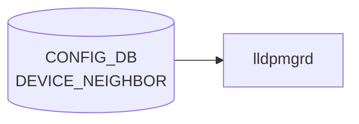

# DEVICE_NEIGHBOR テーブル

## 概要

直接接続される隣接機器（cable 配線レベル）と自スイッチの port を紐付けるテーブル[^1]。[LLDP](../../reference/glossary.md#term-lldp) の正解値 (expected neighbor) として `lldp` / `lldpmgrd` が利用するほか、minigraph 取り込み時にも生成される。隣接機器の hwsku 等のメタデータは [`DEVICE_NEIGHBOR_METADATA`](./device-neighbor-metadata.md) 側で管理する。

<!-- cdb-mermaid -->
### データフロー (自動生成)



!!! note "凡例"
    CONFIG_DB から SAI までの典型経路を `docs/reference/config-db-orch-map.md` から機械生成したミニ図。詳細・例外は本ページ本文と対応表を参照。
<!-- /cdb-mermaid -->

## key 構造

```text
DEVICE_NEIGHBOR|<peer_name>
```

- `<peer_name>`: 自由文字列（length 1..255）。通常は隣接機器のホスト名と同値だが、key 重複回避のための識別子として独立して使われる。

## フィールド

| フィールド | 型 | 説明 |
|-----------|----|------|
| `peer_name` | string (1..255) | エントリ識別子（key） |
| `name` | string (1..255) | 隣接機器のホスト名 |
| `mgmt_addr` | inet:ip-address | 隣接機器の管理 IP |
| `local_port` | leafref → `PORT.name` | 自スイッチ側ポート名 |
| `port` | string (1..255) | 隣接側ポート名 |
| `type` | string (1..255) | 隣接機器タイプ（`ToRRouter`、`LeafRouter` 等の運用ロール文字列） |

<!-- value-behavior -->
## 値依存挙動マトリクス

### `local_port` (leafref → PORT.name)

| 値 | 挙動 |
|----|------|
| 存在する PORT.name | lldpmgrd が期待 neighbor の照合に使用 |
| 存在しない PORT.name | YANG leafref 違反で reject |

### `type` (string: 制約なし)

| 値の例 | 挙動 |
|-------|------|
| `ToRRouter` / `LeafRouter` 等 | lldpmgrd や [BGP](../../reference/glossary.md#term-bgp) テンプレが参照することがある |
| 任意の文字列 | YANG 上 string 型で制約なし |

> フィールドに明示的な enum 制約なし。`local_port` の leafref 違反のみ YANG レベルで reject。

<!-- /value-behavior -->

## 制約

- `local_port` は `PORT_LIST.name` への leafref。存在しないポートを指定するとバリデーションで弾かれる
- `name` は `DEVICE_NEIGHBOR_METADATA_LIST.name` と慣習的に一致させ、メタデータ側を joins する運用が一般的（[YANG](../../reference/glossary.md#term-yang) レベルでは leafref 化されていない）

## 購読者

- `lldpmgrd`: 期待 neighbor として [LLDP](../../reference/glossary.md#term-lldp) の判定に利用
- minigraph パーサ ([sonic-cfggen](../../reference/glossary.md#term-sonic-cfggen)): `minigraph.xml` から生成

## 関連 CONFIG_DB / YANG / CLI

- 関連 [CONFIG_DB](../../reference/glossary.md#term-config_db): [`DEVICE_NEIGHBOR_METADATA`](./device-neighbor-metadata.md)、`PORT`
- 関連 [YANG](../../reference/glossary.md#term-yang): `sonic-device_neighbor`、`sonic-device_neighbor_metadata`
- 関連 CLI: なし（minigraph または `config_db.json` 経由で投入）

<!-- ref-triangle:start -->

## 関連リファレンス

- [YANG](../../reference/glossary.md#term-yang): `sonic-device_neighbor`

<!-- ref-triangle:end -->

## 引用元

[^1]: YANG 定義: `sonic-device_neighbor.yang`. <https://github.com/sonic-net/sonic-buildimage/blob/9ea932ec2e18f35e58268ec2e4456b1d4afd65cd/src/sonic-yang-models/yang-models/sonic-device_neighbor.yang>

<!-- ops-hint -->
## 運用ヒント

### 典型値

- key 形式: `DEVICE_NEIGHBOR|Ethernet0`。
- `name`: 対向ホスト名（minigraph 由来）。
- `port`: 対向ポート名。

### よくある誤設定

- `name` が `DEVICE_NEIGHBOR_METADATA` に未登録だと [BGP](../../reference/glossary.md#term-bgp) の neighbor 名解決が失敗。

### 確認コマンド

```bash
sonic-db-cli CONFIG_DB keys 'DEVICE_NEIGHBOR|*'
show lldp neighbors
```
<!-- /ops-hint -->

<!-- cdb-exceptions -->
## 例外条件・特殊挙動

| consumer | 条件 | 挙動 |
|---|---|---|
| minigraph.py | [port_config.ini](../../reference/glossary.md#term-port-config-ini) に存在しないインターフェイスがエントリに含まれる | `Warning: ignore interface '%s' in DEVICE_NEIGHBOR...` を stderr に出力してスキップ（minigraph.py:2635） |
| show interfaces | DEVICE_NEIGHBOR テーブルが空 | `"DEVICE_NEIGHBOR information is not present."` を表示して継続。エラーにはならない（show/interfaces/__init__.py:318） |
| pfcwd | DEVICE_NEIGHBOR テーブルが空 | 全ポートを内部ポートとして扱い、外部ポート判定を行わない（pfcwd/main.py:413） |

> **Evidence**: [sonic-buildimage](../../reference/glossary.md#term-sonic-buildimage) `src/sonic-config-engine/minigraph.py:2635`; [sonic-utilities](../../reference/glossary.md#term-sonic-utilities) `show/interfaces/__init__.py:318`, `pfcwd/main.py:413`
<!-- /cdb-exceptions -->


<!-- runtime-trace -->
## 実コンテナ動作トレース

### 段階 1 — Consumer 登録

`lldpmgrd` / neighbor 情報参照 が CONFIG_DB の `DEVICE_NEIGHBOR` テーブルを購読する。

`DEVICE_NEIGHBOR` の key は `<port>` (例: `Ethernet0`)。接続先 device / port 情報を保持。

### 段階 2 — CFG→APPL 翻訳

なし (APPL_DB 中継なし)

### 段階 3 — APPL→SAI

なし (SAI 非経由 — neighbor topology 情報)

### 段階 4 — タイミングと副作用

**適用タイミング**: CONFIG_DB に書き込まれると即時に参照可能。lldpmgrd が neighbor 情報との照合に使用。

**副作用**: topology 情報の更新のみ。ネットワーク動作への直接影響なし。
<!-- /runtime-trace -->

<!-- glossary-links-injected: 2c4f81fa98e5 -->
