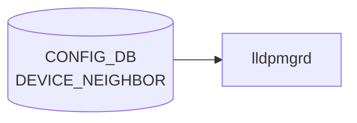

# DEVICE_NEIGHBOR テーブル

## 概要

直接接続される隣接機器（cable 配線レベル）と自スイッチの port を紐付けるテーブル[^1]。[LLDP](../../reference/glossary.md#term-lldp) の正解値 (expected neighbor) として `lldp` / `lldpmgrd` が利用するほか、minigraph 取り込み時にも生成される。隣接機器の hwsku 等のメタデータは [`DEVICE_NEIGHBOR_METADATA`](./device-neighbor-metadata.md) 側で管理する。

<!-- cdb-mermaid -->
### データフロー (自動生成)



!!! note "凡例"
    CONFIG_DB から SAI までの典型経路を `docs/reference/config-db-orch-map.md` から機械生成したミニ図。詳細・例外は本ページ本文と対応表を参照。
<!-- /cdb-mermaid -->

## key 構造

```
DEVICE_NEIGHBOR|<peer_name>
```

- `<peer_name>`: 自由文字列（length 1..255）。通常は隣接機器のホスト名と同値だが、key 重複回避のための識別子として独立して使われる。

## フィールド

| フィールド | 型 | 説明 |
|-----------|----|------|
| `peer_name` | string (1..255) | エントリ識別子（key） |
| `name` | string (1..255) | 隣接機器のホスト名 |
| `mgmt_addr` | inet:ip-address | 隣接機器の管理 IP |
| `local_port` | leafref → `PORT.name` | 自スイッチ側ポート名 |
| `port` | string (1..255) | 隣接側ポート名 |
| `type` | string (1..255) | 隣接機器タイプ（`ToRRouter`、`LeafRouter` 等の運用ロール文字列） |

## 制約

- `local_port` は `PORT_LIST.name` への leafref。存在しないポートを指定するとバリデーションで弾かれる
- `name` は `DEVICE_NEIGHBOR_METADATA_LIST.name` と慣習的に一致させ、メタデータ側を joins する運用が一般的（[YANG](../../reference/glossary.md#term-yang) レベルでは leafref 化されていない）

## 購読者

- `lldpmgrd`: 期待 neighbor として [LLDP](../../reference/glossary.md#term-lldp) の判定に利用
- minigraph パーサ ([sonic-cfggen](../../reference/glossary.md#term-sonic-cfggen)): `minigraph.xml` から生成

## 関連 CONFIG_DB / YANG / CLI

- 関連 [CONFIG_DB](../../reference/glossary.md#term-config_db): [`DEVICE_NEIGHBOR_METADATA`](./device-neighbor-metadata.md)、`PORT`
- 関連 [YANG](../../reference/glossary.md#term-yang): `sonic-device_neighbor`、`sonic-device_neighbor_metadata`
- 関連 CLI: なし（minigraph または `config_db.json` 経由で投入）

<!-- ref-triangle:start -->

## 関連リファレンス

- [YANG](../../reference/glossary.md#term-yang): `sonic-device_neighbor`

<!-- ref-triangle:end -->

## 引用元

[^1]: YANG 定義: `sonic-device_neighbor.yang`. <https://github.com/sonic-net/sonic-buildimage/blob/9ea932ec2e18f35e58268ec2e4456b1d4afd65cd/src/sonic-yang-models/yang-models/sonic-device_neighbor.yang>

<!-- ops-hint -->
## 運用ヒント

### 典型値

- key 形式: `DEVICE_NEIGHBOR|Ethernet0`。
- `name`: 対向ホスト名（minigraph 由来）。
- `port`: 対向ポート名。

### よくある誤設定

- `name` が `DEVICE_NEIGHBOR_METADATA` に未登録だと [BGP](../../reference/glossary.md#term-bgp) の neighbor 名解決が失敗。

### 確認コマンド

```bash
sonic-db-cli CONFIG_DB keys 'DEVICE_NEIGHBOR|*'
show lldp neighbors
```
<!-- /ops-hint -->

<!-- glossary-links-injected: 86469dbd1da9 -->
