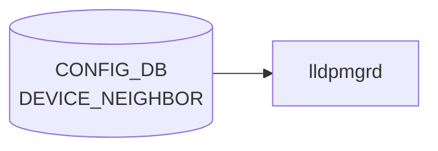

# DEVICE_NEIGHBOR テーブル

## 概要

直接接続される隣接機器（cable 配線レベル）と自スイッチの port を紐付けるテーブル[^1]。[LLDP](../../reference/glossary.md#term-lldp) の正解値 (expected neighbor) として `lldp` / `lldpmgrd` が利用するほか、minigraph 取り込み時にも生成される。隣接機器の hwsku 等のメタデータは [`DEVICE_NEIGHBOR_METADATA`](./device-neighbor-metadata.md) 側で管理する。

<!-- cdb-mermaid -->
### データフロー (自動生成)



!!! note "凡例"
    CONFIG_DB から SAI までの典型経路を `docs/reference/config-db-orch-map.md` から機械生成したミニ図。詳細・例外は本ページ本文と対応表を参照。
<!-- /cdb-mermaid -->

## key 構造

```text
DEVICE_NEIGHBOR|<peer_name>
```

- `<peer_name>`: 自由文字列（length 1..255）。通常は隣接機器のホスト名と同値だが、key 重複回避のための識別子として独立して使われる。

## フィールド

| フィールド | 型 | 説明 |
|-----------|----|------|
| `peer_name` | string (1..255) | エントリ識別子（key） |
| `name` | string (1..255) | 隣接機器のホスト名 |
| `mgmt_addr` | inet:ip-address | 隣接機器の管理 IP |
| `local_port` | leafref → `PORT.name` | 自スイッチ側ポート名 |
| `port` | string (1..255) | 隣接側ポート名 |
| `type` | string (1..255) | 隣接機器タイプ（`ToRRouter`、`LeafRouter` 等の運用ロール文字列） |

<!-- value-behavior -->
## 値依存挙動マトリクス

### `local_port` (leafref → PORT.name)

| 値 | 挙動 |
|----|------|
| 存在する PORT.name | lldpmgrd が期待 neighbor の照合に使用 |
| 存在しない PORT.name | YANG leafref 違反で reject |

### `type` (string: 制約なし)

| 値の例 | 挙動 |
|-------|------|
| `ToRRouter` / `LeafRouter` 等 | lldpmgrd や [BGP](../../reference/glossary.md#term-bgp) テンプレが参照することがある |
| 任意の文字列 | YANG 上 string 型で制約なし |

> フィールドに明示的な enum 制約なし。`local_port` の leafref 違反のみ YANG レベルで reject。

<!-- /value-behavior -->

## 制約

- `local_port` は `PORT_LIST.name` への leafref。存在しないポートを指定するとバリデーションで弾かれる
- `name` は `DEVICE_NEIGHBOR_METADATA_LIST.name` と慣習的に一致させ、メタデータ側を joins する運用が一般的（[YANG](../../reference/glossary.md#term-yang) レベルでは leafref 化されていない）

## 購読者

- `lldpmgrd`: 期待 neighbor として [LLDP](../../reference/glossary.md#term-lldp) の判定に利用
- minigraph パーサ ([sonic-cfggen](../../reference/glossary.md#term-sonic-cfggen)): `minigraph.xml` から生成

## 関連 CONFIG_DB / YANG / CLI

- 関連 [CONFIG_DB](../../reference/glossary.md#term-config_db): [`DEVICE_NEIGHBOR_METADATA`](./device-neighbor-metadata.md)、`PORT`
- 関連 [YANG](../../reference/glossary.md#term-yang): `sonic-device_neighbor`、`sonic-device_neighbor_metadata`
- 関連 CLI: なし（minigraph または `config_db.json` 経由で投入）

<!-- ref-triangle:start -->

## 関連リファレンス

- [YANG](../../reference/glossary.md#term-yang): `sonic-device_neighbor`

<!-- ref-triangle:end -->

## 引用元

[^1]: YANG 定義: `sonic-device_neighbor.yang`. <https://github.com/sonic-net/sonic-buildimage/blob/9ea932ec2e18f35e58268ec2e4456b1d4afd65cd/src/sonic-yang-models/yang-models/sonic-device_neighbor.yang>

<!-- ops-hint -->
## 運用ヒント

### 典型値

- key 形式: `DEVICE_NEIGHBOR|Ethernet0`。
- `name`: 対向ホスト名（minigraph 由来）。
- `port`: 対向ポート名。

### よくある誤設定

- `name` が `DEVICE_NEIGHBOR_METADATA` に未登録だと [BGP](../../reference/glossary.md#term-bgp) の neighbor 名解決が失敗。

### 確認コマンド

```bash
sonic-db-cli CONFIG_DB keys 'DEVICE_NEIGHBOR|*'
show lldp neighbors
```
<!-- /ops-hint -->

<!-- cdb-exceptions -->
## 例外条件・特殊挙動

| consumer | 条件 | 挙動 |
|---|---|---|
| minigraph.py | [port_config.ini](../../reference/glossary.md#term-port-config-ini) に存在しないインターフェイスがエントリに含まれる | `Warning: ignore interface '%s' in DEVICE_NEIGHBOR...` を stderr に出力してスキップ（minigraph.py:2635） |
| show interfaces | DEVICE_NEIGHBOR テーブルが空 | `"DEVICE_NEIGHBOR information is not present."` を表示して継続。エラーにはならない（show/interfaces/__init__.py:318） |
| pfcwd | DEVICE_NEIGHBOR テーブルが空 | 全ポートを内部ポートとして扱い、外部ポート判定を行わない（pfcwd/main.py:413） |

> **Evidence**: [sonic-buildimage](../../reference/glossary.md#term-sonic-buildimage) `src/sonic-config-engine/minigraph.py:2635`; [sonic-utilities](../../reference/glossary.md#term-sonic-utilities) `show/interfaces/__init__.py:318`, `pfcwd/main.py:413`
<!-- /cdb-exceptions -->

<!-- ordering -->
## 書込み順依存 (Phase B)

`DEVICE_NEIGHBOR` には [orchagent](../../reference/glossary.md#term-orchagent) / [SAI](../../reference/glossary.md#term-sai) 経路の依存はない。書込み順が問題になるのは **minigraph.py によるテーブル生成時** と、**pfcwd / ecnconfig がテーブルを参照するタイミング** の 2 箇所である。

### minigraph による生成順序

`sonic-cfggen -m <minigraph.xml>` の `parse_xml()` 内部では、以下の順序で処理が行われる。

| ステップ | 処理内容 | evidence |
|--------|---------|---------|
| 1 | `get_port_config()` で `port_config.ini` を読み込み `ports` dict を構築 | `minigraph.py:2064` |
| 2 | [minigraph.xml](../../reference/glossary.md#term-minigraph.xml) 解析で隣接情報 `neighbors` dict を構築 | `minigraph.py:649,741,766` |
| 3 | `ports` に存在しない key を `neighbors` から削除（Warning 出力） | `minigraph.py:2631-2636` |
| 4 | `results['DEVICE_NEIGHBOR'] = neighbors` を確定 | `minigraph.py:2637` |
| 5 | `results['DEVICE_NEIGHBOR_METADATA']` を `neighbors.values()` から派生生成 | `minigraph.py:2638-2641` |

**PORT（`port_config.ini`）が先行必須**: ステップ 3 で `port_config.ini` に存在しないインターフェイス名のエントリは自動削除される。DEVICE_NEIGHBOR のキー空間は PORT テーブルのキー空間のサブセットであることが保証される。

**DEVICE_NEIGHBOR → DEVICE_NEIGHBOR_METADATA の派生順序**: ステップ 5 で `neighbors.values()` の `name` フィールドを使って DEVICE_NEIGHBOR_METADATA のエントリセットが決定される（multi-ASIC 環境）。DEVICE_NEIGHBOR が確定していないと DEVICE_NEIGHBOR_METADATA の絞り込みが正しく行われない。

### pfcwd start_default の依存

`pfcwd start_default`（`pfcwd/main.py:413`）は起動時に `get_table('DEVICE_NEIGHBOR').keys()` を外部ポート一覧として取得する。**DEVICE_NEIGHBOR が空の状態で `pfcwd start_default` を実行すると外部ポートが 0 件となり、[PFC Watchdog](../../reference/glossary.md#term-pfc-watchdog) が外部ポートに対して有効化されない**（silent misconfiguration）。

推奨書込み順:

```
1. PORT テーブル確定（port_config.ini 由来）
2. DEVICE_NEIGHBOR 書込み（sonic-cfggen -m での minigraph 処理）
3. DEVICE_NEIGHBOR_METADATA 書込み（同上 parse_xml() 内で自動派生）
4. pfcwd start_default 実行（外部ポートが正しく認識される前提）
```

### ecnconfig の依存

`ecnconfig`（`scripts/ecnconfig:282-287`）は非 multi-ASIC 環境でポート一覧として `DEVICE_NEIGHBOR.keys()` を使用する。テーブルが空の場合は `Exception("No active ports detected...")` を raise し処理が中断する。DEVICE_NEIGHBOR が書き込まれる前に ecnconfig を実行してはならない。

### bgpcfgd の間接依存

`bgpcfgd`（`managers_bgp.py:219-224`）は `BGP_NEIGHBOR` の SET 処理時に `DEVICE_NEIGHBOR_METADATA` を参照し、`data['name']`（DEVICE_NEIGHBOR の `name` フィールドと一致する値）が DEVICE_NEIGHBOR_METADATA に存在しない場合は `return False` でピア追加を保留する。DEVICE_NEIGHBOR_METADATA の内容は DEVICE_NEIGHBOR の `name` 集合から派生するため、DEVICE_NEIGHBOR が正しく書き込まれていないと [BGP](../../reference/glossary.md#term-bgp) セッション確立が silent に失敗する。

> **Evidence**: `sonic-buildimage` `src/sonic-config-engine/minigraph.py:2064,2631-2641`; `sonic-utilities` `pfcwd/main.py:413-416`; `scripts/ecnconfig:282-287`; `sonic-buildimage` `src/sonic-bgpcfgd/bgpcfgd/managers_bgp.py:219-224`
<!-- /ordering -->

<!-- cross-refs -->
## 暗黙参照テーブル (Phase C)

<!-- evidence: meta/_intermediate/cdb-flow/device-neighbor-cross-refs.md -->

`DEVICE_NEIGHBOR` テーブルは単独で機能せず、書き込み時・参照時に複数のテーブルおよびファイルシステムリソースを暗黙的に参照する。

| 参照先テーブル / リソース | 参照方向 | 条件 | evidence |
|--------------------------|---------|------|----------|
| `PORT`（[CONFIG_DB](../../reference/glossary.md#term-config_db)） | `local_port` leafref による書き込み時バリデーション | YANG バリデーション有効時。存在しないポート名は reject | `sonic-device_neighbor.yang:52-55` |
| `port_config.ini`（ファイルシステム） | minigraph 生成時のフィルタ参照（ポート名の存在確認） | `sonic-cfggen -m` 実行時。対応ポートなしのエントリは Warning 出力後に削除 | `minigraph.py:2631-2636` |
| `DEVICE_NEIGHBOR_METADATA`（[CONFIG_DB](../../reference/glossary.md#term-config_db)） | `name` フィールド経由の間接結合。[bgpcfgd](../../reference/glossary.md#term-bgpcfgd) での BGP neighbor 追加前の存在チェック | BGP neighbor 追加時。`name` が METADATA に未登録なら `return False`（silent 失敗） | `managers_bgp.py:219-224`, `minigraph.py:2638-2641` |
| `VLAN_MEMBER`（CONFIG_DB） | pfcwd が DEVICE_NEIGHBOR 空時の fallback として参照 | `get_server_facing_ports()` で DEVICE_NEIGHBOR が空の場合のみ | `pfcwd/main.py:104-105` |

### `local_port` YANG leafref

`sonic-device_neighbor.yang` の `local_port` フィールドは `sonic-port` モジュールへの leafref を持つ:

```yang
leaf local_port {
    type leafref {
        path /port:sonic-port/port:PORT/port:PORT_LIST/port:name;
    }
}
```

YANG バリデーション時に `PORT_LIST.name` に存在しないポート名は reject される。`local_port` を含むエントリを書く場合は `PORT` テーブルが先行して存在している必要がある。

### minigraph の port_config.ini フィルタ

`sonic-cfggen -m` が [minigraph.xml](../../reference/glossary.md#term-minigraph.xml) を処理する際、`port_config.ini` に存在しないインターフェイス名を `DEVICE_NEIGHBOR` から削除する（`minigraph.py:2631-2636`）。DEVICE_NEIGHBOR のキー空間は常に PORT テーブルのキー空間のサブセットとなる。

### DEVICE_NEIGHBOR_METADATA との暗黙結合

`DEVICE_NEIGHBOR.name` フィールドは YANG leafref ではないが、`bgpcfgd` が BGP neighbor 追加時に `DEVICE_NEIGHBOR_METADATA` テーブルを参照し、`name` がそこに存在しない場合は `return False` で処理を中断する（`managers_bgp.py:219-224`）。`DEVICE_NEIGHBOR` が書き込まれているが `DEVICE_NEIGHBOR_METADATA` に対応エントリがない場合、BGP セッション確立が silent に失敗する。

### pfcwd・ecnconfig の参照

- `pfcwd/main.py:413`: `get_table('DEVICE_NEIGHBOR').keys()` を外部ポート一覧として使用。テーブルが空の場合は外部ポートが 0 件と判定される
- `pfcwd/main.py:98`: `get_server_facing_ports()` がサーバ向きポート候補を DEVICE_NEIGHBOR から取得。空の場合は `VLAN_MEMBER` から fallback
- `scripts/ecnconfig:282-287`: 非 multi-ASIC 環境でポート一覧を DEVICE_NEIGHBOR から取得。テーブルが空の場合は `Exception("No active ports detected...")` を raise

<!-- /cross-refs -->

<!-- runtime-trace -->
## 実コンテナ動作トレース

### 段階 1 — Consumer 登録

`lldpmgrd` / neighbor 情報参照 が CONFIG_DB の `DEVICE_NEIGHBOR` テーブルを購読する。

`DEVICE_NEIGHBOR` の key は `<port>` (例: `Ethernet0`)。接続先 device / port 情報を保持。

### 段階 2 — CFG→APPL 翻訳

なし ([APPL_DB](../../reference/glossary.md#term-appl_db) 中継なし)

### 段階 3 — APPL→SAI

なし ([SAI](../../reference/glossary.md#term-sai) 非経由 — neighbor topology 情報)

### 段階 4 — タイミングと副作用

**適用タイミング**: CONFIG_DB に書き込まれると即時に参照可能。lldpmgrd が neighbor 情報との照合に使用。

**副作用**: topology 情報の更新のみ。ネットワーク動作への直接影響なし。
<!-- /runtime-trace -->

<!-- entry-points -->
## 書き込み入り口 (Direction A)

対象テーブル: `DEVICE_NEIGHBOR`

### CLI
- なし (CLI 書き込みパスなし)

### minigraph / sonic-cfggen
- あり: `sonic-cfggen -m <minigraph.xml>` 実行時に本テーブルが生成・上書きされる

### REST / gNMI (sonic-mgmt-common)
- なし (対応 OpenConfig/SONiC YANG transformer なし)

### db_migrator
- なし

### ビルド時デフォルト (init_cfg / j2 テンプレート)
- `sonic-cfggen -m` で [minigraph.xml](../../reference/glossary.md#term-minigraph.xml) を処理して隣接デバイス情報を生成

### ハードコードデフォルト
- なし

### ランタイム注入 (デーモン自動書き込み)
- なし
<!-- /entry-points -->

<!-- defaults -->
## コード由来の暗黙デフォルト・挙動

### lldpmgrd は DEVICE_NEIGHBOR を実際には読まない (dead consumer)

`lldpmgrd` のソース冒頭に `TODO: Also listen for changes in DEVICE_NEIGHBOR and PORT tables in Config DB` と明記されており、現行実装では DEVICE_NEIGHBOR テーブルへの subscribe が**実装されていない**。`lldpmgrd` が読む CONFIG_DB テーブルは `DEVICE_METADATA` と `MGMT_INTERFACE` のみ。

### `name` — DEVICE_NEIGHBOR_METADATA との暗黙結合

`name` フィールドは YANG レベルでは leafref 化されていないが、`bgpcfgd` (`managers_bgp.py:221-223`) は `data['name']` が `DEVICE_NEIGHBOR_METADATA` に存在しない場合にピア追加を `return False` で中断する。**`name` が DEVICE_NEIGHBOR_METADATA に未登録の場合、BGP セッションが確立されない**（silent failure）。

### `mgmt_addr` — 実質 dead field

DEVICE_NEIGHBOR テーブル内の `mgmt_addr` を参照する consumer はコードベース上で確認できない。`show interfaces expected` が表示する管理 IP は `DEVICE_NEIGHBOR_METADATA` 側の `mgmt_addr` を参照している (`show/interfaces/__init__.py:342-344`)。DEVICE_NEIGHBOR の `mgmt_addr` は書いても読まれない。

### `type` — YANG-実装 discrepancy (buildimage vs sonic-mgmt-common)

| YANG | 制約 |
|------|------|
| buildimage `sonic-device_neighbor.yang` | `string(1..255)` — 任意文字列 |
| [sonic-mgmt](../../reference/glossary.md#term-sonic-mgmt)-common `sonic-device-neighbor.yang` | `enum { ToRRouter; LeafRouter; }` — 2値のみ |

buildimage 側では任意文字列が通るが、[sonic-mgmt](../../reference/glossary.md#term-sonic-mgmt)-common ([gNMI](../../reference/glossary.md#term-gnmi)/REST パス) 経由では `ToRRouter`/`LeafRouter` 以外を設定すると reject される。

### `port` — YANG-実装 discrepancy

buildimage YANG では `port` は自由文字列 (`string(1..255)`)。[sonic-mgmt](../../reference/glossary.md#term-sonic-mgmt)-common YANG では `PORT_LIST.ifname` への leafref となっており、隣接側ポート名まで自ポートの PORT テーブルで検証される設計になっているが、buildimage 実装では未適用。

### `local_port` テーブルが空の場合の副作用

- **pfcwd**: `pfcwd start_default` は `DEVICE_NEIGHBOR.keys()` を外部ポート一覧として使用。テーブルが空の場合、外部ポートが 0 件となりバックプレーンポートのみを対象にする (`pfcwd/main.py:413-416`)。
- **ecnconfig**: 非 multi-ASIC 環境で `DEVICE_NEIGHBOR.keys()` をポート一覧として使用。テーブルが空の場合は `Exception("No active ports detected...")` を raise する (`ecnconfig:282-287`)。

### `peer_name` (key) — minigraph 由来の silent drop

minigraph.py は `port_config.ini` に存在しないインターフェイス名を key とするエントリを、`Warning: ignore interface '%s' in DEVICE_NEIGHBOR...` を stderr に出力してから `del neighbors[nghbr]` で黙って削除する (`minigraph.py:2631-2636`)。書き込みは行われない。

### minigraph 由来エントリの構造

minigraph.py が生成するエントリは常に `{'name': <隣接ホスト名>, 'port': <隣接ポート名>}` の 2 フィールドのみ。`mgmt_addr`・`type`・`local_port` は minigraph 経由では DEVICE_NEIGHBOR テーブルには書かれない（これらは DEVICE_NEIGHBOR_METADATA 側に書かれる）。

### multi-ASIC での DEVICE_NEIGHBOR_METADATA スコープ相違

- 非 multi-ASIC: DEVICE_NEIGHBOR_METADATA = 自ホスト以外の全 device
- multi-ASIC / asic_name 指定時: DEVICE_NEIGHBOR_METADATA = DEVICE_NEIGHBOR に登場する device のみ

(`minigraph.py:2638-2641`)

> **Evidence**: `sonic-buildimage` `src/sonic-config-engine/minigraph.py:649,2631-2641`; `dockers/docker-lldp/lldpmgrd:12-14`; `sonic-utilities` `pfcwd/main.py:413-416`; `show/interfaces/__init__.py:316-360`; `scripts/ecnconfig:282-287`; `sonic-buildimage` `src/sonic-bgpcfgd/bgpcfgd/managers_bgp.py:219-224`; `sonic-mgmt-common` `cvl/testdata/schema/sonic-device-neighbor.yang`
<!-- /defaults -->

<!-- failure -->
## 失敗挙動マトリクス (Phase D)

ソース: `sonic-buildimage/src/sonic-config-engine/minigraph.py:2631-2641`; `sonic-utilities/pfcwd/main.py:98-108,413-416`; `sonic-utilities/scripts/ecnconfig:282-287`; `sonic-buildimage/src/sonic-bgpcfgd/bgpcfgd/managers_bgp.py:219-223`; `sonic-utilities/show/interfaces/__init__.py:316-319`; `sonic-buildimage/src/sonic-yang-models/yang-models/sonic-device_neighbor.yang:52-56`

### SET / 生成における失敗経路

| # | 失敗条件 | コンポーネント | 結果 | ログ / メッセージ | evidence |
|---|----------|--------------|------|-----------------|---------|
| 1 | `local_port` に `PORT_LIST.name` に存在しないポート名を指定 | YANG バリデーション | SET reject（YANG leafref 違反） | pyang / [sonic-cfggen](../../reference/glossary.md#term-sonic-cfggen) エラー | `sonic-device_neighbor.yang:52-56` |
| 2 | minigraph.xml に `port_config.ini` に存在しないインターフェイスが隣接情報として含まれる | `minigraph.py` parse_xml | 当該エントリを `del neighbors[nghbr]` で削除（silent skip）、DB に書き込まれない | stderr `"Warning: ignore interface '%s' in DEVICE_NEIGHBOR as it is not in the port_config.ini"` | `minigraph.py:2631-2636` |
| 3 | `name` フィールドが `DEVICE_NEIGHBOR_METADATA` に未登録 | `bgpcfgd` (`managers_bgp.py`) | BGP ピア追加を `return False` で中断（silent failure）、BGP セッション未確立 | `log_info("DEVICE_NEIGHBOR_METADATA is not ready for neighbor...")` | `managers_bgp.py:221-223` |

### テーブル空（空テーブル）の場合の影響

| # | 失敗条件 | コンポーネント | 結果 | ログ / メッセージ | evidence |
|---|----------|--------------|------|-----------------|---------|
| 4 | DEVICE_NEIGHBOR テーブルが空で `ecnconfig` を実行 | `ecnconfig` | `Exception("No active ports detected in table 'DEVICE_NEIGHBOR'")` を raise し処理中断 | Exception | `ecnconfig:286-287` |
| 5 | DEVICE_NEIGHBOR テーブルが空で `pfcwd start_default` を実行 | `pfcwd` | `external_ports = []` となりバックプレーンポートのみが対象に（外部ポート未設定の silent misconfiguration） | なし | `pfcwd/main.py:413-416` |
| 6 | DEVICE_NEIGHBOR テーブルが `None`（DB 接続問題等）で `show interfaces expected` を実行 | `show interfaces` | `"DEVICE_NEIGHBOR information is not present."` を表示して return（エラーにはならない） | console output | `show/interfaces/__init__.py:316-319` |

### DEL 操作の影響

| # | 失敗条件 / 操作 | コンポーネント | 結果 | evidence |
|---|----------------|--------------|------|---------|
| 7 | DEVICE_NEIGHBOR エントリを DEL → `pfcwd start_default` 再実行 | `pfcwd` | 削除済みエントリが外部ポート一覧から除外され、次回 `pfcwd start_default` で [PFC](../../reference/glossary.md#term-pfc) Watchdog が有効化されない | `pfcwd/main.py:413` |
| 8 | DEVICE_NEIGHBOR エントリを DEL → [bgpcfgd](../../reference/glossary.md#term-bgpcfgd) への影響 | `bgpcfgd` | [bgpcfgd](../../reference/glossary.md#term-bgpcfgd) は DEVICE_NEIGHBOR を直接 subscribe しない。BGP セッションは DEVICE_NEIGHBOR_METADATA を参照するため、DEVICE_NEIGHBOR 削除単体では即時影響なし | `managers_bgp.py:219-224` |

### 補足

- **leafref reject (依存 #1)**: `sonic-cfggen` や `sonic-yang` 経由でのバリデーション実行時のみ発生。[Redis](../../reference/glossary.md#term-redis) 直接書き込み (`redis-cli hset`) の場合は leafref チェックが行われないため通過する。本番環境では `sonic-cfggen` 経由での投入が標準。
- **silent misconfiguration (依存 #5)**: `pfcwd start_default` は DEVICE_NEIGHBOR が空でも Exception を出さずに継続する（ecnconfig と異なり非 fatal）。結果として外部ポートに対する [PFC Watchdog](../../reference/glossary.md#term-pfc-watchdog) が無効化された状態が構成される。`show pfcwd config` で確認しないと検出できない。
- **bgpcfgd の check_neig_meta フラグ (依存 #3)**: `check_neig_meta = True` の場合のみ DEVICE_NEIGHBOR_METADATA の存在チェックを行う。フラグの初期値は `True`（通常構成）。`return False` 後は bgpcfgd が次のイベントループで再試行するため、DEVICE_NEIGHBOR_METADATA が後から書き込まれれば自動復旧する。
<!-- /failure -->

<!-- constants -->
## ハードコード定数 (Phase E)

### テーブル名文字列リテラル

`DEVICE_NEIGHBOR` を参照する各コンポーネントは、テーブル名を以下の文字列リテラルまたは定数としてハードコードする。YANG / CONFIG_DB スキーマ定義とは独立して管理されており、テーブル名が変更された場合は各コンポーネントを個別に修正する必要がある。

| リテラル / 定数名 | 値 | コンポーネント | evidence |
|-----------------|-----|--------------|---------|
| `DEVICE_NEIGHBOR_TABLE_NAME` | `"DEVICE_NEIGHBOR"` | `ecnconfig` — ポート一覧取得用テーブル名定数 | `ecnconfig:93` |
| `get_table('DEVICE_NEIGHBOR')` | `"DEVICE_NEIGHBOR"` | `pfcwd/main.py` — 外部ポート一覧取得 | `pfcwd/main.py:413` |
| `get_table("DEVICE_NEIGHBOR")` | `"DEVICE_NEIGHBOR"` | `show/interfaces/__init__.py` — `show interfaces expected` | `show/interfaces/__init__.py:316` |
| `results['DEVICE_NEIGHBOR']` | `"DEVICE_NEIGHBOR"` | `minigraph.py` — CONFIG_DB 書き込み dict キー | `minigraph.py:2637` |

### YANG 文字列長制約

| フィールド | 制約 | YANG ソース |
|-----------|------|------------|
| `peer_name` | `length 1..255` | `sonic-device_neighbor.yang:35-36` |
| `name` | `length 1..255` | `sonic-device_neighbor.yang:42-43` |
| `port` | `length 1..255` | `sonic-device_neighbor.yang:61-62` |
| `type` | `length 1..255` | `sonic-device_neighbor.yang:68-69` |
| `mgmt_addr` | `inet:ip-address`（IPv4/IPv6） | `sonic-device_neighbor.yang:46` |
| `local_port` | leafref → `PORT_LIST.name`（長さ制約は PORT 側） | `sonic-device_neighbor.yang:52-55` |

### minigraph リンク種別フィルタ文字列

`minigraph.py` は `DeviceInterfaceLinks` セクションを処理する際に、リンク種別を以下のハードコード文字列で分類する。DEVICE_NEIGHBOR に取り込まれるリンク種別と除外対象が明示的に制御される。

| 文字列 | 扱い | evidence |
|--------|------|---------|
| `"DeviceInterfaceLink"` | DEVICE_NEIGHBOR へ取り込む | `minigraph.py:631,636` |
| `"UnderlayInterfaceLink"` | DEVICE_NEIGHBOR へ取り込む | `minigraph.py:636` |
| `"DeviceMgmtLink"` | 管理リンク — DEVICE_NEIGHBOR へは取り込まない | `minigraph.py:636,648,655` |
| `"DeviceSerialLink"` | シリアルリンク — DEVICE_NEIGHBOR へは取り込まない | `minigraph.py:610` |

### minigraph 生成エントリのフィールドセット

minigraph.py が生成するエントリは **`name` と `port` の 2 フィールドのみ**。これはハードコードされた dict リテラルで構成される:

```python
neighbors[port] = {'name': startdevice, 'port': endport}
```

`mgmt_addr`・`local_port`・`type` は minigraph 経由では DEVICE_NEIGHBOR テーブルに書き込まれない。<!-- evidence: minigraph.py:649,655 -->

### ポートソート定数（ecnconfig）

`ecnconfig` は `DEVICE_NEIGHBOR.keys()` から取得したポート一覧を以下のキー関数でソートする:

```python
self.ports_key.sort(
    key = lambda k: int(k[8:]) if "BP" not in k else int(k[11:]) + 1024
)
```

- `k[8:]`: `"Ethernet"` プレフィックス（8 文字）をスキップして数値部分を抽出
- `"BP"` 含む場合（バックプレーンポート `Ethernet-BPxy`）: `k[11:]` + `1024` でソート末尾へ配置

これらの数値（8・11・1024）は YANG 未定義のハードコード値。<!-- evidence: ecnconfig:291-294 -->

### ポート description 生成フォーマット（minigraph）

ポートに `description` が設定されていない場合、minigraph.py が DEVICE_NEIGHBOR 情報から自動設定する:

```python
port['description'] = "%s:%s" % (neighbors[port_name]['name'], neighbors[port_name]['port'])
```

形式: `<隣接ホスト名>:<隣接ポート名>`（コロン区切り、ハードコード）<!-- evidence: minigraph.py:2465 -->

### ハードコードエラーメッセージ文字列

| コンポーネント | メッセージ | evidence |
|--------------|----------|---------|
| `minigraph.py` | `"Warning: ignore interface '%s' in DEVICE_NEIGHBOR as it is not in the port_config.ini"` | `minigraph.py:2635` |
| `ecnconfig` | `"No active ports detected in table '{}'"` (format 引数: `DEVICE_NEIGHBOR_TABLE_NAME`) | `ecnconfig:287` |
| `show/interfaces/__init__.py` | `"DEVICE_NEIGHBOR information is not present."` | `show/interfaces/__init__.py:318` |
| `managers_bgp.py` | `"DEVICE_NEIGHBOR_METADATA is not ready for neighbor '%s' - '%s'"` | `managers_bgp.py:222` |

> **スキャン証跡**: `ecnconfig:93,282-294` 読了。`pfcwd/main.py:98,413` 読了。`show/interfaces/__init__.py:316-323` 読了。`minigraph.py:610,631-655,2465,2635-2637` 読了。`sonic-device_neighbor.yang` 全行読了。定数 5 種別 15 件を確認。詳細は `meta/_intermediate/cdb-flow/device-neighbor-constants.md` 参照。
<!-- /constants -->

<!-- side-effects -->
## 副次 DB 書込 (Phase F)

`DEVICE_NEIGHBOR` テーブルは **書かれる側（producer のみ）** であり、[orchagent](../../reference/glossary.md#term-orchagent) / [SAI](../../reference/glossary.md#term-sai) 経路の書き手を持たない。副次書込が発生するのは、DEVICE_NEIGHBOR を**参照した後に別テーブルへ書き込む CLI ツール**（pfcwd / ecnconfig）と、**bgpcfgd が BGP セッション確立後に [STATE_DB](../../reference/glossary.md#term-state_db) へ書き込む**場面の 2 種類に分類される。

### DB 書込サマリ

| 副次 DB | 書込有無 | 書込テーブル | 書込コンポーネント | 根拠 |
|--------|---------|------------|----------------|------|
| CONFIG_DB `PFC_WD` | あり | `PFC_WD\|<port>`, `PFC_WD\|GLOBAL` | `pfcwd start_default` | `pfcwd/main.py:292-300,442-444` |
| CONFIG_DB `QUEUE` | あり | `QUEUE\|<port>\|<queue>` | `ecnconfig -s enable/disable` | `ecnconfig:325-336` |
| [STATE_DB](../../reference/glossary.md#term-state_db) `BGP_PEER_CONFIGURED` | あり | `BGP_PEER_CONFIGURED\|<nbr>` | `bgpcfgd managers_bgp.py` | `managers_bgp.py:286-295` |
| [APPL_DB](../../reference/glossary.md#term-appl_db) | なし | — | — | DEVICE_NEIGHBOR を参照するコンポーネントは [APPL_DB](../../reference/glossary.md#term-appl_db) に書かない |
| [COUNTERS_DB](../../reference/glossary.md#term-counters_db) | なし | — | — | 同上 |
| [ASIC_DB](../../reference/glossary.md#term-asic_db) | なし | — | — | SAI 非経由。DEVICE_NEIGHBOR は topology 情報のみ |

### pfcwd → CONFIG_DB PFC_WD 書込

`pfcwd start_default`（`pfcwd/main.py:405-444`）は起動時に以下の順序で CONFIG_DB `PFC_WD` テーブルへ書き込む:

1. `get_table('DEVICE_NEIGHBOR').keys()` で外部ポート一覧を取得（`pfcwd/main.py:413`）
2. 各ポートに対して `verify_pfc_enable_status_per_port()` を呼び出し、`PFC_WD|<port>` エントリを `set_entry()` または `mod_entry()` で書き込む（`pfcwd/main.py:295-300`）
3. `PFC_WD|GLOBAL` に `POLL_INTERVAL` を書き込む（`pfcwd/main.py:442-444`）

DEVICE_NEIGHBOR が空の場合、ステップ 1 で外部ポートが 0 件となり、ステップ 2 の書込みが全スキップされる。**PFC_WD が書き込まれないため、[PFC Watchdog](../../reference/glossary.md#term-pfc-watchdog) は外部ポートに対して有効化されない**（silent misconfiguration）。

### ecnconfig → CONFIG_DB QUEUE 書込

`ecnconfig -s enable/disable`（`ecnconfig:282-336`）は DEVICE_NEIGHBOR からポート一覧を取得後、各ポートの `QUEUE` エントリに `wred_profile` フィールドを書き込む（enable 時）または削除する（disable 時）:

```python
# ecnconfig:325-336 抜粋（簡略）
for port_key in self.ports_key:
    key = '|'.join([port_key, queue])
    entry = self.config_db.get_entry(QUEUE_TABLE_NAME, key)
    entry[FIELD] = ON  # または del entry[FIELD]
    self.config_db.set_entry(QUEUE_TABLE_NAME, key, entry)
```

DEVICE_NEIGHBOR が空の場合は `gen_ports_key()` 内で `Exception("No active ports detected...")` を raise して処理が中断し、QUEUE テーブルへの書込みは行われない。

### bgpcfgd → STATE_DB BGP_PEER_CONFIGURED 書込

`bgpcfgd` は DEVICE_NEIGHBOR を直接 subscribe しないが、BGP_NEIGHBOR の SET 処理時に DEVICE_NEIGHBOR_METADATA（DEVICE_NEIGHBOR の `name` 集合から派生）を参照した後、ピア追加に成功すると [STATE_DB](../../reference/glossary.md#term-state_db) `BGP_PEER_CONFIGURED_TABLE` へ書き込む（`managers_bgp.py:285-295`）。

DEVICE_NEIGHBOR が正しく書き込まれていない場合、`DEVICE_NEIGHBOR_METADATA` の内容が不完全となり、bgpcfgd の STATE_DB 書込みが silent に保留される。

> **Evidence**: `sonic-utilities` `pfcwd/main.py:62,278-300,413-444`; `scripts/ecnconfig:282-336`; `sonic-buildimage` `src/sonic-bgpcfgd/bgpcfgd/managers_bgp.py:219-224,284-295`
<!-- /side-effects -->

<!-- pubsub -->
## CONFIG_DB Subscribe 機構 (Phase G)

`DEVICE_NEIGHBOR` テーブルは **SubscriberStateTable / subscribe によるリアルタイム購読をするコンポーネントが存在しない**。すべての consumer は起動時または操作実行時の **one-shot `get_table()` 読み取り** でテーブル全体を取得する。

### lldpmgrd — DEVICE_NEIGHBOR を購読しない（TODO 状態）

`lldpmgrd` (`dockers/docker-lldp/lldpmgrd:13`) のコメントに

```python
# TODO: Also listen for changes in DEVICE_NEIGHBOR and PORT tables in
#       Config DB and update LLDP config upon changes.
```

と明記されており、実装は存在しない。`lldpmgrd` が `swsscommon.Select` に登録するのは以下の 3 テーブルのみ:

| テーブル | DB | subscribe 方式 | 用途 |
|---------|-----|--------------|------|
| `APP_PORT_TABLE` (APPL_DB) | APPL_DB | `SubscriberStateTable` | ポート oper-status 変化 → lldpcli 設定 |
| `CFG_MGMT_INTERFACE_TABLE_NAME` (CONFIG_DB) | CONFIG_DB | `SubscriberStateTable` | 管理 IP 変化 → lldpcli management pattern 更新 |
| `CFG_DEVICE_METADATA_TABLE_NAME` (CONFIG_DB) | CONFIG_DB | `SubscriberStateTable` | hostname 変化 → lldpcli hostname 更新 |

`DEVICE_NEIGHBOR` への subscribe は実装されていないため、**DEVICE_NEIGHBOR の変化は lldpmgrd にリアルタイム通知されない**。

### pfcwd / ecnconfig — one-shot 読み取り

`pfcwd start_default`（`pfcwd/main.py:413`）および `ecnconfig`（`ecnconfig:282`）は、コマンド実行時に `config_db.get_table('DEVICE_NEIGHBOR')` を 1 回呼び出してキー一覧を取得する。subscribe ではないため、実行後に DEVICE_NEIGHBOR が変化しても pfcwd / ecnconfig には通知されない。再実行時のみ最新値を反映する。

### bgpcfgd — DEVICE_NEIGHBOR_METADATA を購読（DEVICE_NEIGHBOR は非購読）

`bgpcfgd` (`main.py:76`) は `BGPDataBaseMgr` を通じて `CFG_DEVICE_NEIGHBOR_METADATA_TABLE_NAME` を購読するが、`DEVICE_NEIGHBOR` テーブル自体は購読しない。DEVICE_NEIGHBOR の変化は bgpcfgd に直接通知されない。

### minigraph.py — one-shot 書き込みのみ

`sonic-cfggen -m` の parse_xml() は DEVICE_NEIGHBOR への **一回限りの書き込み** であり、テーブルを購読する Consumer 側には位置しない。

### 通信フロー全体図

```
CONFIG_DB DEVICE_NEIGHBOR|<peer_name> (SET/DEL)
  │
  ├─ [購読なし] lldpmgrd — TODO コメントのみ、subscribe 未実装
  │
  ├─ [one-shot] pfcwd start_default
  │     config_db.get_table('DEVICE_NEIGHBOR')  ← コマンド実行時のみ
  │     → 外部ポート一覧取得 → CONFIG_DB PFC_WD 書込
  │
  ├─ [one-shot] ecnconfig
  │     config_db.get_table('DEVICE_NEIGHBOR')  ← コマンド実行時のみ
  │     → ポート一覧取得 → CONFIG_DB QUEUE 書込
  │
  └─ [間接] bgpcfgd
        CFG_DEVICE_NEIGHBOR_METADATA を購読
        （DEVICE_NEIGHBOR_METADATA は DEVICE_NEIGHBOR から派生するが、
         DEVICE_NEIGHBOR 本体は subscribe 対象外）
```

!!! note "DEVICE_NEIGHBOR 変更後の手動再実行が必要"
    `DEVICE_NEIGHBOR` をランタイムに変更（`redis-cli hset` 等）しても、pfcwd / ecnconfig / lldpmgrd はリアルタイムに反応しない。`pfcwd start_default` や `ecnconfig` を手動で再実行する必要がある。

> **Evidence**: `sonic-buildimage` `dockers/docker-lldp/lldpmgrd:12-14,300-326`; `sonic-utilities` `pfcwd/main.py:413`; `scripts/ecnconfig:282-287`; `sonic-buildimage` `src/sonic-bgpcfgd/bgpcfgd/main.py:75-76`
<!-- /pubsub -->

<!-- platform -->
## プラットフォーム差 (Phase H)

> 詳細証跡: `meta/_intermediate/cdb-flow/device-neighbor-platform.md`
> スキャン範囲: `sonic-buildimage/src/sonic-config-engine/minigraph.py` 全行（重点: 599-839, 1719-1782, 2064-2120, 2186-2193, 2631-2641）

`DEVICE_NEIGHBOR` は [orchagent](../../reference/glossary.md#term-orchagent) / SAI を経由しないため `getenv("platform")` による ASIC 種別分岐は存在しない。プラットフォーム差が生じるのは **minigraph.py によるテーブル生成時** のトポロジ種別（multi-ASIC pizza box / VoQ chassis / DualToR）に起因する差異のみである。

### 非 multi-ASIC（pizza box）— 通常パス

`parse_png()`（`minigraph.py:590`）が `<PngDec>` セクションを解析して `neighbors` を生成する。`DeviceInterfaceLink` と `UnderlayInterfaceLink` のみが DEVICE_NEIGHBOR に取り込まれ、`DeviceMgmtLink` / `DeviceSerialLink` は除外される（`minigraph.py:631-651`）。

**DEVICE_NEIGHBOR_METADATA スコープ**: 自ホスト以外の**全デバイス**が登録される（`minigraph.py:2638-2639`）。DEVICE_NEIGHBOR に登場しないデバイスも含む広いスコープ。

### multi-ASIC pizza box（asic_name 指定時）

`parse_asic_png()`（`minigraph.py:779`）が使用される。リンクの `<ChassisInternal>` 要素によって外部リンク（`parse_asic_external_link()`）と内部リンク（`parse_asic_internal_link()`）に分類する。

- **外部リンク**（`ChassisInternal == "false"`）: ポート名を `port_alias_asic_map` → `port_alias_map` の二段変換でエイリアス解決して DEVICE_NEIGHBOR に登録する。
- **内部リンク**（`ChassisInternal == "true"`）: ASIC 間インターコネクト（BackEnd ポート）も DEVICE_NEIGHBOR に登録される。BackEnd ASIC では内部リンクのみが登録されるため、`pfcwd start_default` がポート一覧を DEVICE_NEIGHBOR から取得すると BackEnd ポートを外部ポートとして誤認する可能性がある。

**DEVICE_NEIGHBOR_METADATA スコープ**: DEVICE_NEIGHBOR の `name` フィールドに登場するデバイス**のみ**が登録される（`minigraph.py:2640-2641`）。非 multi-ASIC より狭いスコープ。BGP セッション確立時に `bgpcfgd` が DEVICE_NEIGHBOR_METADATA を参照するため、スコープが狭いと BGP 確立に影響する。

### VoQ chassis ラインカード（chassis_type == "VoQ"）

`asic_hostname` が設定されるため multi-ASIC と同じ `parse_asic_png()` 分岐が適用される。VoQ 固有の差異:

1. **内部 VoQ インターフェイス除外**: `voq_internal_intfs = ['cpu', 'recirc', 'inband']`（`minigraph.py:88`）で定義される内部インターフェイスは DEVICE_NEIGHBOR に登録されない。
2. **`BGP_VOQ_CHASSIS_NEIGHBOR` テーブル**: VoQ chassis 専用の内部 BGP セッション用テーブルが別途生成される（`minigraph.py:2277`）。DEVICE_NEIGHBOR は外部 BGP neighbor 向けのまま。
3. **Spine chassis frontend ロール**: `parse_spine_chassis_fe()`（`minigraph.py:1719`）が DEVICE_NEIGHBOR の `name` フィールドを参照し、隣接デバイスのタイプが `ChassisBackendRouter` でない場合にインターフェイスを `VnetFE` に enslaved させる（`minigraph.py:1749-1753`）。DEVICE_NEIGHBOR の `name` が vnet 割り当ての判定キーとして使われる。

### DualToR（ActiveStandby / ActiveActive 冗長構成）

`parse_png()` の通常パスで DEVICE_NEIGHBOR が生成される（変更なし）。DualToR 固有の差異:

- `PEER_SWITCH` テーブルが生成され `DEVICE_METADATA.localhost.subtype = 'DualToR'` が設定される（`minigraph.py:2188-2189`）が、DEVICE_NEIGHBOR の内容は変わらない。
- [MUX](../../reference/glossary.md#term-mux) ケーブル接続（`LogicalLink` タイプ）は `mux_cable_ports` dict を経由して `MUX_CABLE` テーブルへ書き込まれる（`minigraph.py:2617`）。DEVICE_NEIGHBOR には影響しない。
- DEVICE_NEIGHBOR_METADATA は非 multi-ASIC の全デバイス登録パスが適用され、peer switch（対向 ToR）も含まれる。

### プラットフォーム差サマリ

| 構成 | 生成関数 | DEVICE_NEIGHBOR の内容 | DEVICE_NEIGHBOR_METADATA スコープ |
|------|---------|----------------------|----------------------------------|
| 非 multi-ASIC (pizza box) | `parse_png()` | 外部隣接のみ（DeviceInterfaceLink / UnderlayInterfaceLink） | 全デバイス（自ホスト除く） |
| multi-ASIC pizza box | `parse_asic_png()` | 外部隣接 + 内部リンク（ChassisInternal で分類） | DEVICE_NEIGHBOR に登場するデバイスのみ |
| VoQ chassis ラインカード | `parse_asic_png()` | 外部隣接 + 内部リンク（voq_internal_intfs を除く） | DEVICE_NEIGHBOR に登場するデバイスのみ |
| DualToR | `parse_png()` | 外部隣接のみ（T0 トポロジ通常） | 全デバイス（peer switch 含む） |

> **Evidence**: `sonic-buildimage` `src/sonic-config-engine/minigraph.py:85-88,178-179,599-724,727-778,779-839,1719-1782,2064-2120,2186-2193,2277,2616-2622,2631-2641`
<!-- /platform -->

<!-- glossary-links-injected: 8e5a180b3e1a -->
