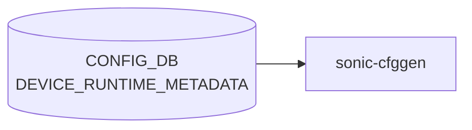

# DEVICE_RUNTIME_METADATA テーブル

## 概要

[CONFIG_DB](../../reference/glossary.md#term-config_db) に永続化されない、起動時に計算で組み立てられる **仮想テーブル**[^1]。`sonic_py_common.device_info.get_device_runtime_metadata()` が hwsku / chassis / port-config 情報から生成し、`sonic-cfggen` の Jinja 環境に投入される。`FEATURE.has_per_asic_scope` などのテンプレ条件式から `DEVICE_RUNTIME_METADATA['ETHERNET_PORTS_PRESENT']` のように参照される。[CONFIG_DB](../../reference/glossary.md#term-config_db) ファイルには通常永続化されない。

<!-- cdb-mermaid -->
### データフロー (自動生成)



!!! note "凡例"
    CONFIG_DB から SAI までの典型経路を `docs/reference/config-db-orch-map.md` から機械生成したミニ図。詳細・例外は本ページ本文と対応表を参照。
<!-- /cdb-mermaid -->

## key 構造

[CONFIG_DB](../../reference/glossary.md#term-config_db) テーブル形式の慣習に従うが、実体は `sonic-cfggen` のテンプレ変数辞書である。論理的には:

```text
DEVICE_RUNTIME_METADATA|CHASSIS_METADATA
DEVICE_RUNTIME_METADATA|ETHERNET_PORTS_PRESENT
DEVICE_RUNTIME_METADATA|MACSEC_SUPPORTED
```

## サブキーとフィールド

| サブキー | フィールド | 値 | 説明 |
|---------|-----------|----|------|
| `CHASSIS_METADATA` | `module_type` | `supervisor` / `linecard` | シャーシ環境でのみ存在。`is_supervisor()` の判定結果 |
| `ETHERNET_PORTS_PRESENT` | (直値) | `True`/`False` | `port_config.ini` がプラットフォーム配下に存在するかどうか。`get_path_to_port_config_file()` の結果 |
| `MACSEC_SUPPORTED` | (直値) | `True`/`False` | プラットフォーム JSON で MACsec 機能が宣言されているか |

実コードでは `runtime_metadata` 辞書に `chassis_metadata` / `port_metadata` / `macsec_support_metadata` を merge して返している[^1]。

## 用途 (Jinja からの参照例)

```jinja
"has_per_asic_scope": "FalseTrue"
```

(`init_cfg.json.j2` の `FEATURE` テーブル展開で使用)[^2]。

<!-- value-behavior -->
## 値依存挙動マトリクス

### `ETHERNET_PORTS_PRESENT` (True/False)

| 値 | 挙動 |
|----|------|
| `True` | [port_config.ini](../../reference/glossary.md#term-port-config-ini) が存在。init_cfg.json.j2 が `has_per_asic_scope = "True"` を生成可能 |
| `False` | [port_config.ini](../../reference/glossary.md#term-port-config-ini) なし（supervisor 等）。init_cfg.json.j2 が `has_per_asic_scope = "False"` を生成 |

### `CHASSIS_METADATA.module_type` (supervisor/linecard)

| 値 | 挙動 |
|----|------|
| `supervisor` | init_cfg.json.j2 の Jinja 条件式で per-asic インスタンスを False に設定 |
| `linecard` | per-asic インスタンス有効として扱う |
| キー自体が存在しない（非 chassis） | linecard 相当として扱われる（`'CHASSIS_METADATA' in DEVICE_RUNTIME_METADATA` が False） |

### `MACSEC_SUPPORTED` (True/False)

| 値 | 挙動 |
|----|------|
| `True` | init_cfg.json.j2 に MACsec 関連 FEATURE エントリが含まれる |
| `False` / キーなし | MACsec FEATURE エントリは生成されない |

> 明示的な enum 制約なし。[YANG](../../reference/glossary.md#term-yang) スキーマなし。CONFIG_DB に永続化されない仮想テーブル。

<!-- /value-behavior -->

## 注意点

- [YANG](../../reference/glossary.md#term-yang) モジュールは存在しない (`sonic-yang-models/yang-models/` 配下にスキーマなし)
- CONFIG_DB の永続テーブルではなく、`sonic-cfggen` 実行時にのみ存在するメモリ上の名前空間
- ベンダー / hwsku によりキーの有無が変わる (chassis でない箱では `CHASSIS_METADATA` キー自体が存在しない)

<!-- ref-triangle:start -->

## 関連リファレンス

- (関連リンクなし)

<!-- ref-triangle:end -->

## 引用元

[^1]: `src/sonic-py-common/sonic_py_common/device_info.py::get_device_runtime_metadata`. <https://github.com/sonic-net/sonic-buildimage/blob/9ea932ec2e18f35e58268ec2e4456b1d4afd65cd/src/sonic-py-common/sonic_py_common/device_info.py#L735>
[^2]: 使用例: `src/sonic-yang-models/tests/yang_model_tests/tests_config/feature.json` ほか init_cfg テンプレ群. <https://github.com/sonic-net/sonic-buildimage/blob/9ea932ec2e18f35e58268ec2e4456b1d4afd65cd/src/sonic-yang-models/tests/yang_model_tests/tests_config/feature.json>

## 関連ページ
- [CONFIG_DB: DEVICE_METADATA](device-metadata.md)
- [CONFIG_DB: FEATURE](feature.md)

<!-- ops-hint -->
## 運用ヒント

### 典型値

- CONFIG_DB に永続化されない仮想テーブル。`sonic-cfggen` 実行時のメモリ上に展開される。
- サブキー: `CHASSIS_METADATA` (chassis のみ) / `ETHERNET_PORTS_PRESENT` / `MACSEC_SUPPORTED`。

### よくある誤設定

- 手動でこのテーブルを `config_db.json` に書こうとしても無視される (テンプレ生成専用)。
- chassis でない箱で `CHASSIS_METADATA` が存在しないことを前提に書かれていないテンプレを使うとエラー。

### 確認コマンド

```bash
sonic-cfggen -d -v "DEVICE_RUNTIME_METADATA"
sonic-cfggen -d -v "DEVICE_RUNTIME_METADATA['ETHERNET_PORTS_PRESENT']"
```
<!-- /ops-hint -->

<!-- cdb-exceptions -->
## 例外条件・特殊挙動

| consumer | 条件 | 挙動 |
|---|---|---|
| init_cfg.json.j2 | `ETHERNET_PORTS_PRESENT = False` | `bgp` / `teamd` feature の初期 state を `disabled` に設定（j2:67,75） |
| init_cfg.json.j2 | `CHASSIS_METADATA.module_type = supervisor` | `bgp` feature を `disabled`、`has_per_asic_scope=False` に設定（j2:67,107） |
| init_cfg.json.j2 | `CHASSIS_METADATA.module_type = linecard` | `has_global_scope=False` に設定（j2:106） |
| init_cfg.json.j2 | `MACSEC_SUPPORTED = False` または platform_env.conf に `macsec_enabled=0` | device type が SpineRouter 系でも `macsec` feature を `disabled` に設定（j2:90） |
| device_info.py | `platform_env.conf` が存在しない | `is_macsec_supported()` が 0 を返し `MACSEC_SUPPORTED=False` となる（device_info.py:720-721） |

> **Evidence**: [sonic-buildimage](../../reference/glossary.md#term-sonic-buildimage) `files/build_templates/init_cfg.json.j2:67,75,90,106-107`; `src/sonic-py-common/sonic_py_common/device_info.py:720-747`
<!-- /cdb-exceptions -->


<!-- runtime-trace -->
## 実コンテナ動作トレース

### 段階 1 — Consumer 登録

`sonic-cfggen` / 各種設定生成スクリプト が CONFIG_DB の `DEVICE_RUNTIME_METADATA` テーブルを購読する。

`DEVICE_RUNTIME_METADATA` は動的に生成されるデバイス情報 (mac address 等) を保持。

### 段階 2 — CFG→APPL 翻訳

なし (APPL_DB 中継なし)

### 段階 3 — APPL→SAI

なし (SAI 非経由 — ランタイムメタデータ)

### 段階 4 — タイミングと副作用

**適用タイミング**: デバイス起動時に `sonic-cfggen` が生成して CONFIG_DB に書き込む。実行時に参照されるが基本的に読み取り専用。

**副作用**: 直接的なネットワーク動作への影響なし。`DEVICE_METADATA` と組み合わせてシステム設定生成に使用。
<!-- /runtime-trace -->

<!-- glossary-links-injected: e33fec70e206 -->
