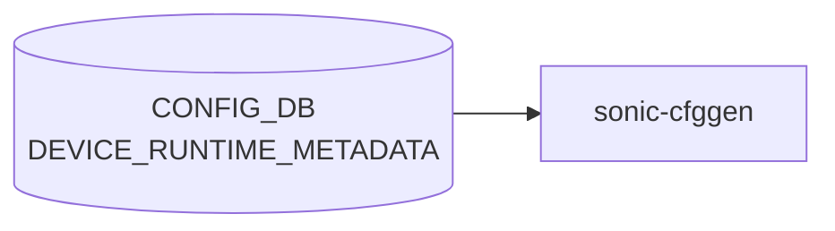

# DEVICE_RUNTIME_METADATA テーブル

## 概要

[CONFIG_DB](../../reference/glossary.md#term-config_db) に永続化されない、起動時に計算で組み立てられる **仮想テーブル**[^1]。`sonic_py_common.device_info.get_device_runtime_metadata()` が hwsku / chassis / port-config 情報から生成し、`sonic-cfggen` の Jinja 環境に投入される。`FEATURE.has_per_asic_scope` などのテンプレ条件式から `DEVICE_RUNTIME_METADATA['ETHERNET_PORTS_PRESENT']` のように参照される。[CONFIG_DB](../../reference/glossary.md#term-config_db) ファイルには通常永続化されない。

<!-- cdb-mermaid -->
### データフロー (自動生成)



!!! note "凡例"
    CONFIG_DB から SAI までの典型経路を `docs/reference/config-db-orch-map.md` から機械生成したミニ図。詳細・例外は本ページ本文と対応表を参照。
<!-- /cdb-mermaid -->

## key 構造

[CONFIG_DB](../../reference/glossary.md#term-config_db) テーブル形式の慣習に従うが、実体は `sonic-cfggen` のテンプレ変数辞書である。論理的には:

```text
DEVICE_RUNTIME_METADATA|CHASSIS_METADATA
DEVICE_RUNTIME_METADATA|ETHERNET_PORTS_PRESENT
DEVICE_RUNTIME_METADATA|MACSEC_SUPPORTED
```

## サブキーとフィールド

| サブキー | フィールド | 値 | 説明 |
|---------|-----------|----|------|
| `CHASSIS_METADATA` | `module_type` | `supervisor` / `linecard` | シャーシ環境でのみ存在。`is_supervisor()` の判定結果 |
| `ETHERNET_PORTS_PRESENT` | (直値) | `True`/`False` | `port_config.ini` がプラットフォーム配下に存在するかどうか。`get_path_to_port_config_file()` の結果 |
| `MACSEC_SUPPORTED` | (直値) | `True`/`False` | プラットフォーム JSON で [MACsec](../../reference/glossary.md#term-macsec) 機能が宣言されているか |

実コードでは `runtime_metadata` 辞書に `chassis_metadata` / `port_metadata` / `macsec_support_metadata` を merge して返している[^1]。

## 用途 (Jinja からの参照例)

```jinja
"has_per_asic_scope": "FalseTrue"
```

(`init_cfg.json.j2` の `FEATURE` テーブル展開で使用)[^2]。

<!-- defaults -->
## コード由来の暗黙デフォルト (Phase A)

<!-- evidence: sonic-buildimage/src/sonic-py-common/sonic_py_common/device_info.py / sonic-buildimage/files/build_templates/init_cfg.json.j2 / sonic-host-services/scripts/featured -->

`DEVICE_RUNTIME_METADATA` は **CONFIG_DB に永続化されない仮想テーブル** で、`sonic_py_common.device_info.get_device_runtime_metadata()` が起動時にプラットフォーム検出結果から自動生成する (`device_info.py:735-747`)。ユーザ設定経路 (CLI / minigraph / db_migrator / [YANG](../../reference/glossary.md#term-yang) transformer) は存在しないため、全フィールドが **コード由来デフォルト** となる。

### サブキー存在条件のデフォルト

| サブキー | 既定の存在条件 | 判定 |
|---------|--------------|------|
| `CHASSIS_METADATA` | **chassis 環境でのみ存在**。非 chassis (典型 ToR / leaf) ではキー自体なし | `is_chassis()` = `(is_voq_chassis() and not is_disaggregated_chassis()) or is_packet_chassis() or is_virtual_chassis()` (`device_info.py:667-668`) |
| `ETHERNET_PORTS_PRESENT` | **常に存在** | `port_config.ini` 探索結果を `True`/`False` で必ずセット |
| `MACSEC_SUPPORTED` | **常に存在** | `platform_env.conf` 未配置でも `False` を必ずセット |

### フィールド既定値

| サブキー / フィールド | コード由来デフォルト | 検出ロジック | 出典 |
|----------------------|---------------------|-------------|------|
| `CHASSIS_METADATA.module_type` | `'linecard'` (`supervisor=1` が `platform_env.conf` に無い場合) / `'supervisor'` (ある場合) | `'supervisor' if is_supervisor() else 'linecard'` | `device_info.py:738`, `is_supervisor()` L699-712 |
| `CHASSIS_METADATA.chassis_type` | `'packet'` (`switch_type` が `voq`/`fabric` 以外、または `chassisdb.conf` 不在) / `'voq'` (両条件成立) | `'voq' if is_voq_chassis() else 'packet'` | `device_info.py:739`, `is_voq_chassis()` L630-634 |
| `ETHERNET_PORTS_PRESENT` | `False` (`get_path_to_port_config_file()` が None を返す = supervisor / fabric card 等) / `True` ([port_config.ini](../../reference/glossary.md#term-port-config-ini) 検出時) | `bool(get_path_to_port_config_file(hwsku=None, asic="0" if is_multi_npu() else None))` | `device_info.py:741` |
| `MACSEC_SUPPORTED` | `False` (`platform_env.conf` 未配置 / `macsec_enabled` 行なし / `macsec_enabled=0`) / `True` (`macsec_enabled=1`) | `bool(is_macsec_supported())` | `device_info.py:742`, `is_macsec_supported()` L714-732 |

### platform 自動検出のフォールバック挙動

- **`platform_env.conf` が存在しないプラットフォーム** → `is_supervisor()=False`, `is_macsec_supported()=0`。結果として `MACSEC_SUPPORTED=False`、(chassis 環境の場合) `module_type='linecard'` がデフォルトになる (`device_info.py:700-702, 720-721`)。
- **`switch_type` 未設定** (`get_platform_info().get('switch_type')` が空) → `is_voq_chassis()=False`, `is_packet_chassis()=False` → 仮想 chassis でなければ `is_chassis()=False` → `CHASSIS_METADATA` キー自体が生成されない。
- **multi-[NPU](../../reference/glossary.md#term-npu) プラットフォーム** → `get_path_to_port_config_file()` 呼び出し時に `asic="0"` を指定して [ASIC](../../reference/glossary.md#term-asic)#0 名前空間の port_config.ini を確認する (`device_info.py:741`)。

### init_cfg.json.j2 が参照するデフォルト経路

`featured` (sonic-host-services) も含め、デフォルト値は最終的に `init_cfg.json.j2` の FEATURE エントリ生成へ反映される (具体的な分岐は本ページ「例外条件・特殊挙動」表を参照):

- `ETHERNET_PORTS_PRESENT=False` または `module_type=supervisor` の組み合わせで `bgp` / `teamd` / `has_per_asic_scope` が `disabled` / `False` に倒れる。
- `MACSEC_SUPPORTED=False` で `macsec` feature が `disabled`。
- `CHASSIS_METADATA` キーなしの環境では `has_global_scope=True` がデフォルト。

> **書き込み不能**: ユーザーが `config_db.json` でこのテーブルを上書きしても、`get_device_runtime_metadata()` が `sonic-cfggen` 実行時に再生成するため反映されない。
<!-- /defaults -->

<!-- value-behavior -->
## 値依存挙動マトリクス

### `ETHERNET_PORTS_PRESENT` (True/False)

| 値 | 挙動 |
|----|------|
| `True` | [port_config.ini](../../reference/glossary.md#term-port-config-ini) が存在。init_cfg.json.j2 が `has_per_asic_scope = "True"` を生成可能 |
| `False` | [port_config.ini](../../reference/glossary.md#term-port-config-ini) なし（supervisor 等）。init_cfg.json.j2 が `has_per_asic_scope = "False"` を生成 |

### `CHASSIS_METADATA.module_type` (supervisor/linecard)

| 値 | 挙動 |
|----|------|
| `supervisor` | init_cfg.json.j2 の Jinja 条件式で per-asic インスタンスを False に設定 |
| `linecard` | per-asic インスタンス有効として扱う |
| キー自体が存在しない（非 chassis） | linecard 相当として扱われる（`'CHASSIS_METADATA' in DEVICE_RUNTIME_METADATA` が False） |

### `MACSEC_SUPPORTED` (True/False)

| 値 | 挙動 |
|----|------|
| `True` | init_cfg.json.j2 に [MACsec](../../reference/glossary.md#term-macsec) 関連 FEATURE エントリが含まれる |
| `False` / キーなし | [MACsec](../../reference/glossary.md#term-macsec) FEATURE エントリは生成されない |

> 明示的な enum 制約なし。[YANG](../../reference/glossary.md#term-yang) スキーマなし。CONFIG_DB に永続化されない仮想テーブル。

<!-- /value-behavior -->

## 注意点

- [YANG](../../reference/glossary.md#term-yang) モジュールは存在しない (`sonic-yang-models/yang-models/` 配下にスキーマなし)
- CONFIG_DB の永続テーブルではなく、`sonic-cfggen` 実行時にのみ存在するメモリ上の名前空間
- ベンダー / hwsku によりキーの有無が変わる (chassis でない箱では `CHASSIS_METADATA` キー自体が存在しない)

<!-- ref-triangle:start -->

## 関連リファレンス

- (関連リンクなし)

<!-- ref-triangle:end -->

## 引用元

[^1]: `src/sonic-py-common/sonic_py_common/device_info.py::get_device_runtime_metadata`. <https://github.com/sonic-net/sonic-buildimage/blob/9ea932ec2e18f35e58268ec2e4456b1d4afd65cd/src/sonic-py-common/sonic_py_common/device_info.py#L735>
[^2]: 使用例: `src/sonic-yang-models/tests/yang_model_tests/tests_config/feature.json` ほか init_cfg テンプレ群. <https://github.com/sonic-net/sonic-buildimage/blob/9ea932ec2e18f35e58268ec2e4456b1d4afd65cd/src/sonic-yang-models/tests/yang_model_tests/tests_config/feature.json>

## 関連ページ
- [CONFIG_DB: DEVICE_METADATA](device-metadata.md)
- [CONFIG_DB: FEATURE](feature.md)

<!-- ops-hint -->
## 運用ヒント

### 典型値

- CONFIG_DB に永続化されない仮想テーブル。`sonic-cfggen` 実行時のメモリ上に展開される。
- サブキー: `CHASSIS_METADATA` (chassis のみ) / `ETHERNET_PORTS_PRESENT` / `MACSEC_SUPPORTED`。

### よくある誤設定

- 手動でこのテーブルを `config_db.json` に書こうとしても無視される (テンプレ生成専用)。
- chassis でない箱で `CHASSIS_METADATA` が存在しないことを前提に書かれていないテンプレを使うとエラー。

### 確認コマンド

```bash
sonic-cfggen -d -v "DEVICE_RUNTIME_METADATA"
sonic-cfggen -d -v "DEVICE_RUNTIME_METADATA['ETHERNET_PORTS_PRESENT']"
```
<!-- /ops-hint -->

<!-- cdb-exceptions -->
## 例外条件・特殊挙動

| consumer | 条件 | 挙動 |
|---|---|---|
| init_cfg.json.j2 | `ETHERNET_PORTS_PRESENT = False` | `bgp` / `teamd` feature の初期 state を `disabled` に設定（j2:67,75） |
| init_cfg.json.j2 | `CHASSIS_METADATA.module_type = supervisor` | `bgp` feature を `disabled`、`has_per_asic_scope=False` に設定（j2:67,107） |
| init_cfg.json.j2 | `CHASSIS_METADATA.module_type = linecard` | `has_global_scope=False` に設定（j2:106） |
| init_cfg.json.j2 | `MACSEC_SUPPORTED = False` または platform_env.conf に `macsec_enabled=0` | device type が SpineRouter 系でも `macsec` feature を `disabled` に設定（j2:90） |
| device_info.py | `platform_env.conf` が存在しない | `is_macsec_supported()` が 0 を返し `MACSEC_SUPPORTED=False` となる（device_info.py:720-721） |

> **Evidence**: [sonic-buildimage](../../reference/glossary.md#term-sonic-buildimage) `files/build_templates/init_cfg.json.j2:67,75,90,106-107`; `src/sonic-py-common/sonic_py_common/device_info.py:720-747`
<!-- /cdb-exceptions -->

<!-- runtime-trace -->
## 実コンテナ動作トレース

### 段階 1 — Consumer 登録

`DEVICE_RUNTIME_METADATA` は CONFIG_DB に永続化されない仮想テーブル。`sonic-cfggen` 実行時にのみ存在するメモリ上の名前空間として、各種 Jinja テンプレートから参照される。永続テーブルではないため、Redis 上の「購読者」は存在しない。

保持内容は `ETHERNET_PORTS_PRESENT` / `MACSEC_SUPPORTED` / `CHASSIS_METADATA`（chassis 構成時のみ）の 3 サブキーのみ。mac address は `DEVICE_METADATA.localhost.mac` が管理する。

### 段階 2 — CFG→APPL 翻訳

なし ([APPL_DB](../../reference/glossary.md#term-appl_db) 中継なし)

### 段階 3 — APPL→SAI

なし ([SAI](../../reference/glossary.md#term-sai) 非経由 — ランタイムメタデータ)

### 段階 4 — タイミングと副作用

**適用タイミング**: `sonic-cfggen` 実行時に動的に組み立てられる仮想テーブルであり、CONFIG_DB への永続書き込みは行われない。テンプレート展開時にのみ参照される。

**副作用**: 直接的なネットワーク動作への影響なし。`DEVICE_METADATA` と組み合わせてシステム設定生成に使用。
<!-- /runtime-trace -->

<!-- entry-points -->
## 書き込み入り口 (Direction A)

対象テーブル: `DEVICE_RUNTIME_METADATA`

### CLI
- なし (CLI 書き込みパスなし)

### minigraph / sonic-cfggen
- なし

### REST / gNMI (sonic-mgmt-common)
- なし (対応 OpenConfig/[SONiC](../../reference/glossary.md#term-sonic) YANG transformer なし)

### db_migrator
- なし

### ビルド時デフォルト (init_cfg / j2 テンプレート)
- なし

### ハードコードデフォルト
- なし

### ランタイム注入 (デーモン自動書き込み)
- 起動時に `sonic-cfggen` や `platform_env.conf` スクリプトが実行環境情報 (platform name, HW SKU 等) を注入する。YANG モデルなし・スキーマレス
<!-- /entry-points -->

<!-- ordering -->
## 書込み順依存 (Phase B)

`DEVICE_RUNTIME_METADATA` は `sonic-cfggen` / `sysmonitor.py` が起動時にオンデマンドで構築するインメモリ辞書であり、CONFIG_DB への永続書き込みは行われない。そのため通常の SET/DEL シーケンス依存は存在しないが、以下の**呼び出し内部の順序制約**が成立する。

### 検出された順序依存

| # | 依存関係 | 方向 | 緩和策 |
|---|----------|------|--------|
| 1 | プラットフォームファイル読み取り (`/etc/sonic/platform_env.conf`, `port_config.ini`) → `get_device_runtime_metadata()` 構築 | 強制先行 | ファイル未存在時は `MACSEC_SUPPORTED=False` / `ETHERNET_PORTS_PRESENT=False` にフォールバック |
| 2 | `get_device_runtime_metadata()` 返却 → `init_cfg.json.j2` / `sysmonitor.py` による FEATURE 状態評価 | **強制先行** | 関数が戻るまで呼び出し側は FEATURE の `state` 値を確定できない |
| 3 | `DEVICE_METADATA` テーブル取得 → `DEVICE_RUNTIME_METADATA` 辞書と合算 (`sysmonitor.py` L219-220) | 強制先行 | `config_db.get_table('DEVICE_METADATA')` が先に呼ばれ、その後 `get_device_runtime_metadata()` が結合される |
| 4 | `chassis_metadata` / `port_metadata` / `macsec_support_metadata` の順で `runtime_metadata.update()` | 決定論的（後勝ち） | 同一キーが複数サブ辞書に存在する場合は後の update が勝つ。現時点でキー重複なし |

### 主要な制約詳細

**プラットフォームファイル先行 (依存 #1)**: `get_device_runtime_metadata()` は `is_chassis()` → `is_supervisor()` → `get_path_to_port_config_file()` → `is_macsec_supported()` の順に呼び出しを行い、それぞれがシステムファイルや platform API に依存する。これらのファイルが存在しない場合（コンテナ初回起動直後など）は各フィールドが `False` に設定されたうえで辞書が返される。呼び出し側は返り値を信頼してよいが、ファイルが後から配置された場合は再呼び出しが必要（evidence: `device_info.py:735-747`）。

**FEATURE 状態評価との依存 (依存 #2)**: `sysmonitor.py` は `config_db.get_table("FEATURE")` でテーブルを取得後、各エントリの `state` フィールドが Jinja テンプレート式 (`"enableddisabled"`) である場合に `get_render_value_for_field()` でレンダリングする。このレンダリングに `DEVICE_RUNTIME_METADATA` の値が参照されるため、`get_device_runtime_metadata()` の完了が必須となる。FEATURE テーブルが未準備の場合は最大 3 回リトライする設計になっている（evidence: `sysmonitor.py:210-237`）。

<!-- /ordering -->

<!-- cross-refs -->
## 暗黙参照テーブル (Phase C)

`DEVICE_RUNTIME_METADATA` は CONFIG_DB に書き込まれず `get_device_runtime_metadata()` がインメモリで構築する仮想テーブルである。そのためここでの「暗黙参照」は、**生成関数が内部で依存するリソース**（CONFIG_DB テーブルおよびファイルシステムオブジェクト）を指す。

| 参照先リソース | 参照方向 | 条件 | 参照元 evidence |
|---|---|---|---|
| `DEVICE_METADATA\|localhost.switch_type` (CONFIG_DB) | 読み取り → `chassis_type` 決定 | 常時。`get_platform_info()` が CONFIG_DB から `switch_type` を読み取り、`is_voq_chassis()` / `is_packet_chassis()` 判定へ。結果が `CHASSIS_METADATA.chassis_type` (`'voq'` / `'packet'`) に反映される | `device_info.py:559-566` (`get_platform_info`), L630-639 (`is_voq_chassis`, `is_packet_chassis`) |
| `platform_env.conf` (ファイルシステム) | 読み取り → `module_type` / `MACSEC_SUPPORTED` 決定 | `is_chassis()=True` 時（`module_type` 判定）または常時（`MACSEC_SUPPORTED` 判定）。`supervisor=1` 行で `module_type='supervisor'`、`macsec_enabled=1` 行で `MACSEC_SUPPORTED=True`、ファイル不在時は両方 `False` / `'linecard'` | `device_info.py:228-248` (`get_platform_env_conf_file_path`), L699-712 (`is_supervisor`), L715-732 (`is_macsec_supported`) |
| `chassisdb.conf` (ファイルシステム) | 存在確認 → `is_voq_chassis()` 分岐 | `switch_type=voq/fabric` の場合のみ参照。ファイル存在 = `is_chassis_config_absent()=False` → `CHASSIS_METADATA` 生成対象として確定 | `device_info.py:251-268` (`get_chassis_db_conf_file_path`), L630-634 (`is_voq_chassis`) |
| `port_config.ini` / `platform.json` (ファイルシステム) | 存在確認 → `ETHERNET_PORTS_PRESENT` 決定 | 常時。`get_path_to_port_config_file()` がプラットフォーム hwsku ディレクトリを探索。supervisor / fabric カードでは不在のため `False` となる | `device_info.py:445-509` (`get_path_to_port_config_file`), L741 |
| `sonic_version.yml` (ファイルシステム) | 読み取り → `is_virtual_chassis()` 判定 | [VS](../../reference/glossary.md#term-vs) / テスト環境で `asic_type=vs` かつ `switch_type` が `dummy-sup`/`voq`/`chassis-packet` のとき。`CHASSIS_METADATA` が生成される | `device_info.py:511-523` (`get_sonic_version_info`), L658-664 (`is_virtual_chassis`) |

!!! note "CONFIG_DB 参照は `get_platform_info()` のグローバルキャッシュ経由"
    `get_platform_info()` は `hw_info_dict` グローバル変数にキャッシュするため (`device_info.py:541-542`)、同一プロセス内では `DEVICE_METADATA` が変化しても再読み込みされない。`DEVICE_RUNTIME_METADATA` の値はプロセス起動時点の `switch_type` に固定される。ファイルシステム系関数 (`is_supervisor` / `is_macsec_supported` / `get_path_to_port_config_file`) はキャッシュを持たず、呼び出しごとにファイルを開く。

!!! note "書き手は存在しない"
    `DEVICE_RUNTIME_METADATA` に書き込みを行うプロセスは存在しない。本テーブルは `get_device_runtime_metadata()` の返り値として `sonic-cfggen` / `sysmonitor.py` がローカル辞書として保持するのみであり、CONFIG_DB には永続化されない。

<!-- /cross-refs -->

<!-- failure -->
## 失敗挙動・エラーパス (Phase D)

> **調査根拠**: `sonic_py_common/device_info.py` L228-748 全行精読 (2026-05-18)
> 詳細証跡: `meta/_intermediate/cdb-flow/device-runtime-metadata-failure.md`

`DEVICE_RUNTIME_METADATA` は CONFIG_DB に永続化されない仮想テーブルであり、`get_device_runtime_metadata()` が起動時に構築する。失敗はすべて「フィールドがフォールバック値（`False`）に設定される」か「未キャッチ例外が呼び出し元に伝播する」の 2 種類に分類できる。

### プラットフォームファイル不在によるサイレントフォールバック

| 失敗条件 | 影響フィールド | フォールバック値 | evidence |
|---|---|---|---|
| `platform_env.conf` が `CONTAINER_PLATFORM_PATH` / `HOST_DEVICE_PATH/<platform>/` 両方に不在 | `MACSEC_SUPPORTED`、chassis 環境の `module_type` | `MACSEC_SUPPORTED=False`、`module_type='linecard'` | `device_info.py:700-702` (`is_supervisor`), `device_info.py:720-721` (`is_macsec_supported`) |
| `chassisdb.conf` が不在 → `is_chassis_config_absent()=True` | `CHASSIS_METADATA` キー自体が生成されない | キーなし（`is_chassis()=False`） | `device_info.py:622-634` |
| `port_config.ini` / `platform.json` が hwsku ディレクトリに不在 | `ETHERNET_PORTS_PRESENT` | `False` (`bool(None)=False`) | `device_info.py:741` |

いずれの条件も例外 raise・syslog なし（サイレント）。呼び出し元は戻り値を正常値として受け取るが、FEATURE 状態評価で `bgp`/`teamd`/`macsec` が `disabled` に倒れる副作用が生じる。

### `get_platform_info()` CONFIG_DB 接続失敗

`get_platform_info()` は `ConfigDBConnector().connect()` / `config_db.get_table('DEVICE_METADATA')["localhost"]` を `try…except Exception: pass` でラップする (`device_info.py:557-568`)。接続失敗時は `hw_info_dict['switch_type']` が設定されず、`get_platform_info().get('switch_type')` が `None` を返す。

- **結果**: `is_voq_chassis()=False`、`is_packet_chassis()=False` → `is_chassis()=False` → `CHASSIS_METADATA` キー生成されない。
- **ログ**: なし（`except: pass` でサイレント握り潰し）。

### `hw_info_dict` グローバルキャッシュによる古い値の固定

`get_platform_info()` は `hw_info_dict` グローバル変数にキャッシュを持つ (`device_info.py:539-542`)。一度キャッシュされると同プロセス内での再読み込みは行われない。

- **結果**: デーモン再起動なしに CONFIG_DB の `DEVICE_METADATA.switch_type` を変更しても、`CHASSIS_METADATA.chassis_type` / `ETHERNET_PORTS_PRESENT` の再評価は起きない。
- **回避策**: `get_device_runtime_metadata()` を呼び出すプロセス（`sonic-cfggen` / `sysmonitor.py`）の再起動が必要。

### `is_macsec_supported()` の `int()` 変換失敗（未キャッチ）

`platform_env.conf` に `macsec_enabled=<非整数文字列>` が記述されていると、`int(supported)` で `ValueError` が発生する (`device_info.py:732`)。この例外は `get_device_runtime_metadata()` 内でキャッチされないため、呼び出し元に伝播する。

!!! warning "`ValueError` は未キャッチで伝播"
    `is_macsec_supported()` が `ValueError` を raise すると `get_device_runtime_metadata()` の返り値が得られない。
    `sonic-cfggen` では設定生成が失敗し、FEATURE テーブル生成が不完全になる可能性がある。
    `platform_env.conf` の `macsec_enabled` 値は整数（`0` または `1`）のみ許容される。

<!-- /failure -->

<!-- constants -->
## ハードコード定数 (Phase E)

> **調査根拠**: `sonic_py_common/device_info.py` L1-60 (定数定義群), L699-747 (生成関数群) 精読 (2026-05-19)
> 詳細証跡: `meta/_intermediate/cdb-flow/device-runtime-metadata-constants.md`

`DEVICE_RUNTIME_METADATA` の全フィールドキー名・フィールド値文字列はすべて `device_info.py` にハードコードされた Python 文字列リテラルであり、YANG スキーマ・CLI・設定ファイルから変更できない。

### ファイルシステムパス定数

| 定数名 | ハードコード値 | 影響フィールド |
|-------|--------------|--------------|
| `HOST_DEVICE_PATH` | `"/usr/share/sonic/device"` | プラットフォームディレクトリ探索全般 |
| `CONTAINER_PLATFORM_PATH` | `"/usr/share/sonic/platform"` | コンテナ内プラットフォームパス |
| `MACHINE_CONF_PATH` | `"/host/machine.conf"` | プラットフォーム名解決 |
| `SONIC_VERSION_YAML_PATH` | `"/etc/sonic/sonic_version.yml"` | [VS](../../reference/glossary.md#term-vs)/仮想シャーシ判定 |
| `PORT_CONFIG_FILE` | `"port_config.ini"` | `ETHERNET_PORTS_PRESENT` |
| `PLATFORM_JSON_FILE` | `"platform.json"` | `ETHERNET_PORTS_PRESENT` (代替候補) |
| `PLATFORM_ENV_CONF_FILENAME` | `"platform_env.conf"` | `module_type`, `MACSEC_SUPPORTED` |
| `CHASSIS_DB_CONF_FILENAME` | `"chassisdb.conf"` | `is_voq_chassis()` → `CHASSIS_METADATA` 生成有無 |

(evidence: `device_info.py:14-43`)

### フィールド値文字列リテラル

`get_device_runtime_metadata()` が返す辞書のキーおよびフィールド値はすべてハードコード:

| キー / フィールド | ハードコード値 | 条件 |
|-----------------|--------------|------|
| `CHASSIS_METADATA` (辞書キー) | `'CHASSIS_METADATA'` | `is_chassis()=True` 時のみ生成 |
| `module_type` | `'supervisor'` / `'linecard'` | `is_supervisor()` 真偽値で切替 |
| `chassis_type` | `'voq'` / `'packet'` | `is_voq_chassis()` 真偽値で切替 |
| `ETHERNET_PORTS_PRESENT` (辞書キー) | `'ETHERNET_PORTS_PRESENT'` | 常時生成 |
| `MACSEC_SUPPORTED` (辞書キー) | `'MACSEC_SUPPORTED'` | 常時生成 |

(evidence: `device_info.py:738-742`)

### `platform_env.conf` パース用キーワード

`platform_env.conf` から設定を読み取る際の比較キーワードもハードコード:

| 検索キーワード | 解釈 | 使用関数 |
|------------|------|---------|
| `'supervisor'` (`.lower()` 後比較) | 値 `'1'` → `module_type='supervisor'` | `is_supervisor()` L708-711 |
| `'macsec_enabled'` (`.lower()` 後比較) | 値を `int()` 変換 → `MACSEC_SUPPORTED` | `is_macsec_supported()` L729-731 |

> **注意**: `'supervisor=YES'` や `'macsec_enabled=true'` のような非整数・非 `'1'` 値はいずれも検出されない（`'1'` のみ `True` 扱い）。`macsec_enabled` の値が整数文字列以外だと `int()` で `ValueError` が未キャッチで伝播する（Phase D 参照）。

### マルチ NPU での ASIC 番号ハードコード

`ETHERNET_PORTS_PRESENT` の判定で multi-[NPU](../../reference/glossary.md#term-npu) 環境では常に [ASIC](../../reference/glossary.md#term-asic) `"0"` のポート設定ファイルを確認する:

```python
get_path_to_port_config_file(hwsku=None, asic="0" if is_multi_npu() else None)
```

[ASIC](../../reference/glossary.md#term-asic) 番号の起点 `"0"` がハードコードされており、ASIC 1 以降の存在は確認されない (`device_info.py:741`)。

<!-- /constants -->

<!-- side-effects -->
## 副次 DB 書込 (Phase F)

> **調査根拠**: `sonic-host-services/scripts/featured` L145,195,232,587-590; `sonic-buildimage/files/build_templates/init_cfg.json.j2` L67,75,90,106-107 精読 (2026-05-19)
> 詳細証跡: `meta/_intermediate/cdb-flow/device-runtime-metadata-side-effects.md`

`DEVICE_RUNTIME_METADATA` は CONFIG_DB に永続化されない仮想テーブルであり、自身が DB を直接書き込むことはない。ここでは `get_device_runtime_metadata()` の返り値を参照した consumer（`featured` / `sysmonitor.py` / `init_cfg.json.j2`）が、**FEATURE テーブル以外**へ副次的に行う書き込みを示す。

### 副次書込み一覧

| 副次書込み先 | 書き込み元 | 条件 | evidence |
|---|---|---|---|
| `CONFIG_DB FEATURE\|<name>` の `state` / `has_global_scope` / `has_per_asic_scope` (初回生成) | `sonic-cfggen` (init_cfg.json.j2) | 起動時 1 回。`ETHERNET_PORTS_PRESENT` / `MACSEC_SUPPORTED` / `CHASSIS_METADATA.module_type` の値で `enabled`/`disabled`/`True`/`False` を決定 | `init_cfg.json.j2:67,75,90,106-107` |
| `STATE_DB FEATURE\|<name>` の `state` | `featured` | CONFIG_DB `FEATURE` 変化検知時または起動時 `sync_state_field()` 実行時。`_device_running_config` をレンダリングコンテキストに混入し、Jinja テンプレート文字列の `state` を評価して書き込む | `featured:145,195,232,587-590` |
| `CONFIG_DB FEATURE\|<name>` の `has_global_scope` / `has_per_asic_scope` (書き戻し) | `featured` | `update_feature_state()` 成功後に `sync_feature_scope()` → `_conditional_update_scope()` を実行。`ETHERNET_PORTS_PRESENT` / `module_type` 由来の scope 値が CONFIG_DB の現在値と異なる場合のみ上書き | `featured:213-214,346-355` |

### init_cfg.json.j2 による初回書き込みの分岐

`sonic-cfggen` が `init_cfg.json.j2` をレンダリングして CONFIG_DB に書き込む初回起動時、`DEVICE_RUNTIME_METADATA` の値が以下の FEATURE エントリへ直接反映される:

| FEATURE 名 | 参照フィールド | 倒れる方向 |
|---|---|---|
| `bgp` | `ETHERNET_PORTS_PRESENT=False` または `module_type=supervisor` | `state=disabled` |
| `teamd` | `ETHERNET_PORTS_PRESENT=False` | `state=disabled` |
| `macsec` | `MACSEC_SUPPORTED=False` | `state=disabled` |
| 全 feature | `module_type=linecard` | `has_global_scope=False` |
| 全 feature | `ETHERNET_PORTS_PRESENT=False` または `module_type=supervisor` | `has_per_asic_scope=False` |

### APPL_DB / ASIC_DB / COUNTERS_DB — 書込なし

`featured` / `sysmonitor.py` はいずれも [SAI](../../reference/glossary.md#term-sai) 非経由であり、[APPL_DB](../../reference/glossary.md#term-appl_db) / [ASIC_DB](../../reference/glossary.md#term-asic_db) / [COUNTERS_DB](../../reference/glossary.md#term-counters_db) / [FLEX_COUNTER_DB](../../reference/glossary.md#term-flex_counter_db) への書き込みは一切発生しない。
<!-- /side-effects -->

<!-- pubsub -->
## 通信メカニズム (Phase G)

> **調査根拠**: `sonic-host-services/scripts/featured:137-145,193-196`; `sonic-buildimage/src/system-health/health_checker/sysmonitor.py:217-226`; `sonic-buildimage/files/build_templates/init_cfg.json.j2:67,75,90,106-107` 精読 (2026-05-19)
> 詳細証跡: `meta/_intermediate/cdb-flow/device-runtime-metadata-pubsub.md`

`DEVICE_RUNTIME_METADATA` は [Redis](../../reference/glossary.md#term-redis) に永続化されない **仮想テーブル** であり、`device_info.get_device_runtime_metadata()` 呼び出しによってインメモリで生成される。このため [Redis](../../reference/glossary.md#term-redis) keyspace notification (`PSUBSCRIBE`) や `SubscriberStateTable` / `ConsumerStateTable` による subscribe は **一切存在しない**。

### Redis pub/sub の不在

| 購読方式 | 採用有無 | 理由 |
|---------|---------|------|
| `SubscriberStateTable` (C++ swss) | なし | テーブルが [Redis](../../reference/glossary.md#term-redis) に存在しないため不可 |
| `ConsumerStateTable` / `Orch` | なし | 同上 |
| `ConfigDBConnector.subscribe()` (Python) | なし | 同上 |
| keyspace 通知 (PSUBSCRIBE) | なし | Redis に書き込まれないためイベントが発生しない |

### Consumer の取得パターン

すべての consumer が `device_info.get_device_runtime_metadata()` の **直接関数呼び出し**でデータを取得する。

| consumer | 取得タイミング | 格納先 | evidence |
|---------|--------------|--------|---------|
| `featured` (`FeatureHandler.__init__`) | デーモン起動時 1 回のみ | `self._device_running_config` インスタンス変数 | `featured:145` |
| `sysmonitor.py` (`get_service_from_feature_table`) | `config reload` 等の CONFIG_DB FEATURE 変化検知時に都度 | ローカル変数 `device_config` | `sysmonitor.py:220` |
| `sonic-cfggen` / `init_cfg.json.j2` | システム起動時テンプレートレンダリング (1 回限り) | Jinja2 変数辞書 | `init_cfg.json.j2:67,75,90,106-107` |

### runtime 変更通知の非サポート

`DEVICE_RUNTIME_METADATA` の値はシステム起動時に決定するハードウェア由来の静的メタデータ（プラットフォーム種別・ポート設定ファイルの有無・MACsec 対応）であり、実行中に変化しないことを前提とした設計になっている。`featured` はデーモン起動時に取得した `_device_running_config` を再取得・更新する仕組みを持たないため、起動後にプラットフォームのメタデータが変化した場合は `featured` の再起動が必要となる。
<!-- /pubsub -->

<!-- platform -->
## プラットフォーム差 (Phase H)

> **調査根拠**: `sonic_py_common/device_info.py` L511-747 全行精読 (2026-05-19)
> 詳細証跡: `meta/_intermediate/cdb-flow/device-runtime-metadata-platform.md`

`DEVICE_RUNTIME_METADATA` のフィールド構造・値はすべてランタイム時の**ハードウェアプラットフォーム検出結果**に依存する。ASIC ベンダや YANG スキーマには依存せず、以下の 3 要素の組み合わせで決定する。

1. `switch_type` / `chassisdb.conf` 存否 → `CHASSIS_METADATA` キーの有無と `chassis_type`
2. `platform_env.conf` の内容 → `module_type` および `MACSEC_SUPPORTED`
3. hwsku ディレクトリの `port_config.ini` 存否 → `ETHERNET_PORTS_PRESENT`

### `CHASSIS_METADATA` — chassis 種別による有無とフィールド値

| プラットフォーム種別 | 判定条件 | `CHASSIS_METADATA` | `chassis_type` | `module_type` |
|---|---|---|---|---|
| 標準 ToR / leaf (非シャーシ) | `is_chassis()=False` | **生成されない** | — | — |
| [VOQ](../../reference/glossary.md#term-voq) chassis (linecard) | `switch_type=voq` + `chassisdb.conf` 存在 + `supervisor=1` なし | あり | `'voq'` | `'linecard'` |
| [VOQ](../../reference/glossary.md#term-voq) chassis (supervisor) | `switch_type=voq` + `chassisdb.conf` 存在 + `platform_env.conf` に `supervisor=1` | あり | `'voq'` | `'supervisor'` |
| Packet chassis | `switch_type=chassis-packet` | あり | `'packet'` | `supervisor=1` 有無で決定 |
| Virtual chassis ([VS](../../reference/glossary.md#term-vs)) | `asic_type=vs` (`sonic_version.yml`) + `switch_type` が `dummy-sup`/`voq`/`chassis-packet` のいずれか | あり | `'voq'` or `'packet'` | VS 内 `supervisor=1` 有無 |
| Disaggregated chassis | `switch_type=voq` + `disaggregated_chassis=1` in `platform_env.conf` | **生成されない** | — | — |

(evidence: `device_info.py:630-668`, `device_info.py:737-739`)

> `is_virtual_chassis()` は `get_platform_info().get('asic_type')` が `"vs"` であることを条件に含む。`asic_type` は `sonic_version.yml` から読み込まれる (`device_info.py:550-551, 660`)。

### `ETHERNET_PORTS_PRESENT` — hwsku 種別による差

| プラットフォーム種別 | 値 | 理由 |
|---|---|---|
| 通常 ToR / Leaf / Spine | `True` | hwsku ディレクトリ配下に `port_config.ini` が存在する |
| Supervisor カード (chassis) | `False` | supervisor の hwsku には `port_config.ini` が存在しない |
| Fabric カード ([VOQ](../../reference/glossary.md#term-voq) chassis) | `False` | fabric カードはデータプレーンポートを持たず `port_config.ini` 不在 |
| [Multi-ASIC](../../reference/glossary.md#term-multi-asic) プラットフォーム | ASIC #0 の `port_config.ini` 存否に依存 | `asic="0"` をハードコードして検索 (`device_info.py:741`) |
| VS (Virtual Switch) テスト | `True` (通常) | VS プラットフォームのテスト hwsku に `port_config.ini` が付属する |

Multi-[NPU](../../reference/glossary.md#term-npu) 環境では常に ASIC `"0"` のポート設定ファイルを確認する。ASIC 1 以降は確認しない (`device_info.py:741`)。

### `MACSEC_SUPPORTED` — `platform_env.conf` 依存

| プラットフォーム種別 | 値 | 理由 |
|---|---|---|
| MACsec 非対応ハードウェア (大多数) | `False` | `platform_env.conf` 不在、または `macsec_enabled=0` |
| MACsec 対応ハードウェア (一部 Broadcom 等) | `True` | `platform_env.conf` に `macsec_enabled=1` が記述されている |
| VS / コンテナ / テスト環境 | `False` | `platform_env.conf` 不在のため `is_macsec_supported()=0` |

MACsec 対応の宣言は `platform_env.conf` の `macsec_enabled=1` 行のみで制御される。ASIC ベンダ別のハードコードや YANG スキーマ上の制約は存在しない (`device_info.py:720-721`, `700-702`)。

### SmartSwitch / DPU — 影響なし

`is_smartswitch()` / `is_dpu()` は `platform.json` の `DPUS` / `DPU` キーを参照するが (`device_info.py:679-694`)、`get_device_runtime_metadata()` はこれらの関数を呼び出さない。[SmartSwitch](../../reference/glossary.md#term-smartswitch) NPU 側も [DPU](../../reference/glossary.md#term-dpu) カード側も、非シャーシ構成であれば `CHASSIS_METADATA` は生成されず `ETHERNET_PORTS_PRESENT` / `MACSEC_SUPPORTED` のみが返される (`device_info.py:735-747`)。

> **Evidence**: `device_info.py:630-668` (`is_voq_chassis` / `is_packet_chassis` / `is_virtual_chassis` / `is_chassis`)、`device_info.py:699-732` (`is_supervisor` / `is_macsec_supported`)、`device_info.py:735-747` (`get_device_runtime_metadata`)
<!-- /platform -->

<!-- glossary-links-injected: ca6bc30b1f0e -->
