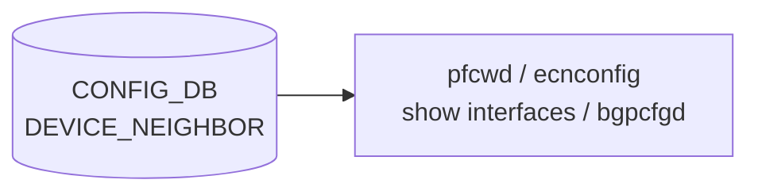

# DEVICE_NEIGHBOR 動作状態（device op state）

## 概要

[`DEVICE_NEIGHBOR`](./device-neighbor.md) テーブルは **直接接続される隣接機器と自スイッチポートの対応表** として CONFIG_DB に永続化される。  
設定テーブルとしての役割に加え、複数のランタイム daemon が DEVICE_NEIGHBOR の **key 集合**（= ローカルポート名の集合）を「外部ポート一覧」として動的に参照する。このページでは、各 consumer がどのようなコード由来デフォルト・副作用を持つかを整理する。

<!-- cdb-mermaid -->
### データフロー (自動生成)



!!! note "凡例"
    CONFIG_DB から SAI までの典型経路を `docs/reference/config-db-orch-map.md` から機械生成したミニ図。詳細・例外は本ページ本文と対応表を参照。
<!-- /cdb-mermaid -->

## 外部ポート一覧としての機能

SONiC の複数 daemon は `DEVICE_NEIGHBOR.keys()` を「自スイッチが持つ外部ポート（対向機器と直結するポート）の一覧」として扱う。DEVICE_NEIGHBOR が config としてだけでなく **ランタイムの port scope 決定器** として機能する点が本ページの主題である。

## consumer 別動作

### pfcwd — 外部ポート判定

`pfcwd start_default` (`pfcwd/main.py:405-416`) は次のように外部ポートを決定する。

```python
external_ports = list(self.config_db.get_table('DEVICE_NEIGHBOR').keys())
bp_ports = get_bp_ports(self.config_db)
active_ports = natsorted(set(external_ports + bp_ports))
```

| 条件 | 結果 |
|------|------|
| DEVICE_NEIGHBOR に 1 件以上のエントリあり | `external_ports` にそのキー（ポート名）が入る |
| DEVICE_NEIGHBOR が空 | `external_ports = []` → バックプレーンポートのみが `active_ports` になる（外部ポートなし）|

### pfcwd — サーバー向けポート判定

`get_server_facing_ports()` (`pfcwd/main.py:97-108`) は DEVICE_NEIGHBOR を起点に DEVICE_NEIGHBOR_METADATA の `type` を参照する。

```python
candidates = db.get_table('DEVICE_NEIGHBOR')
for port in candidates:
    neighbor = db.get_entry('DEVICE_NEIGHBOR_METADATA', candidates[port]['name'])
    if neighbor and neighbor['type'].lower() == 'server':
        server_facing_ports.append(port)
if not server_facing_ports:
    server_facing_ports = [p[1] for p in db.get_table('VLAN_MEMBER')]
```

- DEVICE_NEIGHBOR_METADATA に対応エントリが存在しない、または `type` が `'server'` でない場合はサーバー向けポートとして列挙されない
- サーバー向けポートが **0 件** の場合、`VLAN_MEMBER` のポートにフォールバック

### ecnconfig — ポート一覧（非 multi-ASIC 環境）

`ecnconfig` (`scripts/ecnconfig:282-287`) は非 multi-ASIC 環境で DEVICE_NEIGHBOR を外部ポート一覧として使用する。

```python
port_table = self.config_db.get_table(DEVICE_NEIGHBOR_TABLE_NAME)
self.ports_key = list(port_table.keys())
if len(self.ports_key) == 0:
    raise Exception("No active ports detected in table '{}'".format(DEVICE_NEIGHBOR_TABLE_NAME))
```

!!! warning "pfcwd との違い"
    pfcwd は空テーブルを「外部ポートなし」として継続するのに対し、ecnconfig は **Exception を raise** して動作停止する。multi-ASIC 環境では `SYSTEM_PORT_TABLE` を代替として使用する（ブランチ分岐）。

### show interfaces neighbor expected — 隣接表示

`show interfaces neighbor expected` (`show/interfaces/__init__.py:310-365`) は DEVICE_NEIGHBOR と DEVICE_NEIGHBOR_METADATA を組み合わせて隣接情報を表示する。

| 表示カラム | データ元 | 欠落時 |
|-----------|---------|-------|
| `LocalPort` | DEVICE_NEIGHBOR の key | — |
| `Neighbor` | `DEVICE_NEIGHBOR[port]['name']` | KeyError → "No neighbor information available" 表示 |
| `NeighborPort` | `DEVICE_NEIGHBOR[port]['port']` | KeyError → 同上 |
| `NeighborLoopback` | `DEVICE_NEIGHBOR_METADATA[device]['lo_addr']` | 文字列 `'None'` を表示 |
| `NeighborMgmt` | `DEVICE_NEIGHBOR_METADATA[device]['mgmt_addr']` | 文字列 `'None'` を表示 |
| `NeighborType` | `DEVICE_NEIGHBOR_METADATA[device]['type']` | 文字列 `'None'` を表示 |

!!! note "mgmt_addr の所在"
    表示に使われる `mgmt_addr` は **DEVICE_NEIGHBOR_METADATA** 側のフィールドである。DEVICE_NEIGHBOR テーブル自体の `mgmt_addr` フィールドは現行 consumer から参照されない（dead field）。

### lldpmgrd — 非購読（dead consumer）

`lldpmgrd` (`dockers/docker-lldp/lldpmgrd:12-14`) のソースに次の TODO が明記されている。

```python
# TODO: Also listen for changes in DEVICE_NEIGHBOR and PORT tables in
#       Config DB and update LLDP config upon changes.
```

現行実装での lldpmgrd が subscribe するテーブルは次の 3 つのみ:

- `APP_PORT_TABLE_NAME` (APPL_DB) — port oper_status 変化
- `CFG_MGMT_INTERFACE_TABLE_NAME` (CONFIG_DB) — 管理 IP 変化
- `CFG_DEVICE_METADATA_TABLE_NAME` (CONFIG_DB) — hostname 変化

DEVICE_NEIGHBOR は**まったく購読されていない**。lldpmgrd の動作に DEVICE_NEIGHBOR の内容は現状影響しない。

### bgpcfgd — DEVICE_NEIGHBOR_METADATA 依存待機

bgpcfgd (`managers_bgp.py:139-140,219-224`) は DEVICE_NEIGHBOR 本体ではなく **DEVICE_NEIGHBOR_METADATA** を依存テーブルとして登録する。

- `check_neig_meta = True` の場合のみ `CFG_DEVICE_NEIGHBOR_METADATA_TABLE_NAME` を deps に追加
- BGP neighbor の `set_handler` で `data['name']` が DEVICE_NEIGHBOR_METADATA に不在の場合 → `return False`（延期）
- テーブル到着後に directory メカニズムが自動再処理

<!-- ordering -->
## 書込み順依存 (Phase B)

DEVICE_NEIGHBOR テーブルは **consumer が起動時に一括読み出し（`get_table`）する**参照テーブルであり、常時 subscribe する daemon は存在しない（lldpmgrd は TODO 状態で未実装）。このため、書込み順依存は「consumer の起動タイミング vs. DEVICE_NEIGHBOR の書込みタイミング」という起動順序の問題として現れる。

### 検出された順序依存

| # | 依存関係 | 方向 | 緩和策 |
|---|----------|------|--------|
| 1 | DEVICE_NEIGHBOR 書込み → `pfcwd start_default` 実行 | **強制先行**（起動時スナップショット） | pfcwd は起動時に `get_table` でスナップショット取得。後から追加されたエントリは反映されない |
| 2 | DEVICE_NEIGHBOR 書込み → `ecnconfig` 起動 | **強制先行**（起動時スナップショット） | 空テーブル状態で ecnconfig が起動すると Exception が発生し、操作が不可能になる |
| 3 | DEVICE_NEIGHBOR 書込み → DEVICE_NEIGHBOR_METADATA 書込み → `bgpcfgd` BGP peer 処理 | **2 段前提**（check_neig_meta 有効時） | bgpcfgd は `data['name']` が DEVICE_NEIGHBOR_METADATA に存在するまで `return False` でハンドラを延期し続ける（managers_bgp.py:219-224） |
| 4 | DEVICE_NEIGHBOR_METADATA `type='server'` 書込み → `pfcwd get_server_facing_ports` 実行 | **強制先行** | DEVICE_NEIGHBOR に行が存在しても DEVICE_NEIGHBOR_METADATA に `type='server'` がなければ VLAN_MEMBER フォールバックへ移行する |
| 5 | DEVICE_NEIGHBOR 書込み → `show interfaces neighbor expected` 実行 | 任意（表示のみ） | テーブルが None の場合は "not present" を表示して即 return。runtime への影響なし |

### 主要な制約詳細

**pfcwd の起動時スナップショット (依存 #1)**: `pfcwd start_default` (`pfcwd/main.py:405-416`) は `self.config_db.get_table('DEVICE_NEIGHBOR')` を呼び出した時点のスナップショットで `external_ports` を確定する。DEVICE_NEIGHBOR に後から行を追加しても、既に起動済みの pfcwd ポートスコープには反映されない。`pfcwd start_default` を再実行するまで古いスコープが維持される。

**ecnconfig の起動前条件 (依存 #2)**: `ecnconfig` (`scripts/ecnconfig:282-287`) は DEVICE_NEIGHBOR が空の場合に `Exception("No active ports detected in table 'DEVICE_NEIGHBOR'")` を raise して停止する。このため、DEVICE_NEIGHBOR の書込みが完了する前に ecnconfig コマンドを実行すると、コマンド自体が失敗する。multi-ASIC 環境では `SYSTEM_PORT_TABLE` を代替として使用するためこの制約は生じない。

**bgpcfgd の 2 段前提 (依存 #3)**: bgpcfgd の `BGPPeerMgrBase` は `check_neig_meta` が有効な場合、`deps` に `CFG_DEVICE_NEIGHBOR_METADATA_TABLE_NAME` を追加する。BGP neighbor の `set_handler` 内で `data['name']`（= DEVICE_NEIGHBOR の `name` フィールド値）が DEVICE_NEIGHBOR_METADATA に存在しない場合、`return False` を返してハンドラを延期する。DEVICE_NEIGHBOR_METADATA が書き込まれるまで BGP セッション確立処理が進まない。DEVICE_NEIGHBOR 書込み → DEVICE_NEIGHBOR_METADATA 書込み の 2 段順序が必要（evidence: `managers_bgp.py:118-150,219-224`）。

> **Evidence**: `sonic-utilities` `pfcwd/main.py:97-108,405-416`; `scripts/ecnconfig:282-287`; `sonic-buildimage` `src/sonic-bgpcfgd/bgpcfgd/managers_bgp.py:118-150,219-224`
<!-- /ordering -->

<!-- cross-refs -->
## 暗黙参照テーブル (Phase C)

DEVICE_NEIGHBOR は **consumer が `get_table` で一括読み出しする**参照テーブルであり、複数の CONFIG_DB テーブルを横断的に参照する。以下は DEVICE_NEIGHBOR の consumer が暗黙的に依存するテーブル・リソースの一覧である。

| 参照先テーブル / リソース | 参照方向 | 条件 | 参照元 evidence |
|--------------------------|---------|------|----------------|
| `DEVICE_NEIGHBOR_METADATA\|<name>` (CONFIG_DB) | key 転写 + フィールド参照 | 常時。pfcwd は `candidates[port]['name']` をキーとして DEVICE_NEIGHBOR_METADATA の `type` を照合。bgpcfgd は `data['name']` が DEVICE_NEIGHBOR_METADATA に存在するかチェック | `pfcwd/main.py:98-104`, `managers_bgp.py:220-224` |
| `VLAN_MEMBER` (CONFIG_DB) | フォールバック参照 | `pfcwd get_server_facing_ports` でサーバー向けポートが 0 件の場合にのみ参照。DEVICE_NEIGHBOR がすべて非 `server` 型か空の場合に適用 | `pfcwd/main.py:106-107` |
| `PORT` (CONFIG_DB) | バックプレーンポート列挙 | `pfcwd start_default` が `get_bp_ports()` を通じて `PORT` テーブルを読み、`role='Int'` かつ `admin_status='up'` のポートを `active_ports` に追加 | `pfcwd/main.py:111-119,413-416` |
| `DEVICE_METADATA\|localhost` (CONFIG_DB) | フィールド参照 | `pfcwd start_default` が `default_pfcwd_status` フィールドを読み、`'enable'` でない場合は `pfcwd start_default` が即 return（DEVICE_NEIGHBOR を読んでも PFC WD を設定しない） | `pfcwd/main.py:408-419` |

!!! note "DEVICE_NEIGHBOR は「ポート集合の源泉」"
    各 consumer は DEVICE_NEIGHBOR のキー集合（= 外部ポート名一覧）を取得した後、そのポート名を使って他テーブル（DEVICE_NEIGHBOR_METADATA・PORT）を参照する。DEVICE_NEIGHBOR 自体のフィールド（`name` 以外）を直接利用する consumer はほとんどなく、キーのみを利用するパターンが支配的。

!!! note "VLAN_MEMBER 参照は非自明なフォールバック"
    `pfcwd get_server_facing_ports()` は DEVICE_NEIGHBOR + DEVICE_NEIGHBOR_METADATA を組み合わせてサーバー向けポートを決定しようとするが、該当ポートが 0 件の場合にのみ VLAN_MEMBER をフォールバックとして使う。このため VLAN 設定が pfcwd のポートスコープに予期せず影響することがある（evidence: `pfcwd/main.py:106-107`）。

> **Evidence**: `sonic-utilities` `pfcwd/main.py:97-119,405-424`; `sonic-buildimage` `src/sonic-bgpcfgd/bgpcfgd/managers_bgp.py:118-154,219-224`
<!-- /cross-refs -->

<!-- failure -->
## 失敗挙動 (Phase D)

DEVICE_NEIGHBOR は CONFIG_DB の読み取り専用テーブルとして機能し、各 consumer が起動時にスナップショット取得（`get_table`）する。orchagent のような retry/ack ループは存在しないため、失敗は「consumer の動作停止」「サイレントな縮退」「処理延期」のいずれかで現れる。

### consumer 別失敗パターン

| consumer | 失敗ケース | 発生箇所 | 挙動 | retry / 回復 |
|---------|-----------|---------|------|-------------|
| `ecnconfig` (非 multi-ASIC) | DEVICE_NEIGHBOR テーブルが空 | `scripts/ecnconfig:287` | `Exception("No active ports detected in table 'DEVICE_NEIGHBOR'")` を raise → コマンド異常終了 | なし（再実行が必要） |
| `pfcwd start_default` | DEVICE_NEIGHBOR テーブルが空 | `pfcwd/main.py:412` | `external_ports = []` としてサイレント継続。バックプレーンポートのみが `active_ports` に入る | なし（`pfcwd start_default` 再実行で回復） |
| `pfcwd get_server_facing_ports` | DEVICE_NEIGHBOR エントリの `name` フィールドが欠落 | `pfcwd/main.py:102` | `candidates[port]['name']` で `KeyError` → pfcwd 起動シーケンス中断 | なし（エントリ修正後に再実行） |
| `pfcwd get_server_facing_ports` | DEVICE_NEIGHBOR_METADATA に `type='server'` エントリがない | `pfcwd/main.py:106-107` | サーバー向けポート 0 件 → `VLAN_MEMBER` フォールバックへ（非自明挙動） | なし（VLAN_MEMBER でフォールバック継続） |
| `bgpcfgd` (`check_neig_meta` 有効) | `data['name']` が DEVICE_NEIGHBOR_METADATA に不在 | `managers_bgp.py:220-223` | `log_info("DEVICE_NEIGHBOR_METADATA is not ready...")` → `return False`（ハンドラ延期） | DEVICE_NEIGHBOR_METADATA 書込み後に directory 機構が自動再処理 |
| `show interfaces neighbor expected` | DEVICE_NEIGHBOR テーブルが None | `show/interfaces/__init__.py:317-319` | `"DEVICE_NEIGHBOR information is not present."` 表示して即 return | 表示のみ影響。runtime への副作用なし |

### ecnconfig の起動前条件違反（最も影響が大きい失敗）

`ecnconfig` は非 multi-ASIC 環境で DEVICE_NEIGHBOR を**必須入力**として扱う。テーブルが空の場合は Exception を raise してコマンド全体が異常終了する（`scripts/ecnconfig:282-287`）。この失敗は **retry 機構が存在しない**ため、DEVICE_NEIGHBOR にポートエントリが存在しない状態では `ecnconfig` コマンドの一切の操作（設定変更・表示）が不可能になる。

一方 multi-ASIC 環境では `SYSTEM_PORT_TABLE` を代替として使用するため、DEVICE_NEIGHBOR が空でも影響を受けない（`scripts/ecnconfig:265-280`）。

### bgpcfgd の延期処理（自動回復あり）

`bgpcfgd` の `BGPPeerMgrBase` が `check_neig_meta = True` の場合、`add_peer()` 内で `data['name']` が DEVICE_NEIGHBOR_METADATA に存在しないと `return False` で処理を延期する（`managers_bgp.py:220-223`）。延期されたタスクは BGPPeerMgrBase の directory 機構が DEVICE_NEIGHBOR_METADATA の書込みを検知した後に自動再処理されるため、**DEVICE_NEIGHBOR_METADATA の書込み順序を正しく守れば自動回復する**。

> **Evidence**: `sonic-utilities` `pfcwd/main.py:97-108,405-416`; `scripts/ecnconfig:265-287`; `show/interfaces/__init__.py:317-319`; `sonic-buildimage` `src/sonic-bgpcfgd/bgpcfgd/managers_bgp.py:118-150,219-224`
<!-- /failure -->

<!-- value-behavior -->
## 値依存挙動マトリクス

### テーブル空時の consumer 別挙動

| consumer | テーブル空時の挙動 | エラー種別 |
|---------|-----------------|---------|
| pfcwd start_default | `external_ports = []` → バックプレーンポートのみで active_ports 構成 | サイレント（動作継続） |
| pfcwd get_server_facing_ports | サーバー向けポート 0 件 → VLAN_MEMBER にフォールバック | サイレント（フォールバック） |
| ecnconfig (非 multi-ASIC) | `Exception("No active ports detected...")` raise → 動作停止 | 例外 |
| show interfaces neighbor expected | `"DEVICE_NEIGHBOR information is not present."` 表示して即 return | ユーザー表示のみ |
| bgpcfgd | DEVICE_NEIGHBOR を直接参照しない | 影響なし |
| lldpmgrd | DEVICE_NEIGHBOR を購読しない（TODO 状態） | 影響なし |

<!-- /value-behavior -->

<!-- defaults -->
## コード由来の暗黙デフォルト

### フィールド別コード由来挙動

| フィールド | YANG default | コード由来挙動 | カテゴリ |
|-----------|-------------|----------------|---------|
| `peer_name` (key) | なし（必須） | pfcwd / ecnconfig が key 集合を外部ポート一覧として使用。空テーブル → pfcwd: 外部ポートなし / ecnconfig: Exception | 複合必須制約 |
| `name` | なし | bgpcfgd: DEVICE_NEIGHBOR_METADATA に不在 → `return False` 延期。lldpmgrd は参照しない（dead consumer） | 前提条件依存 + dead consumer |
| `port` | なし | show interfaces neighbor expected で直接参照。欠落時 KeyError → "No neighbor information available" 表示 | silent drop 候補 |
| `mgmt_addr` | なし | DEVICE_NEIGHBOR テーブルの `mgmt_addr` を参照する consumer なし（dead field）。show コマンドは DEVICE_NEIGHBOR_METADATA 側を参照 | dead field |
| `local_port` | なし（leafref → PORT.name） | key（peer_name）を外部ポートとして使用するため、local_port と key が実質同値。テーブル空 → pfcwd が外部ポートなしと判定 / ecnconfig が Exception | YANG leafref + 副作用 |
| `type` | なし（string 制約なし） | DEVICE_NEIGHBOR の `type` を直接参照する consumer はコードベース上で確認できない。pfcwd は DEVICE_NEIGHBOR_METADATA 側の `type` を参照 | dead field 候補 |

### lldpmgrd は DEVICE_NEIGHBOR を実際には読まない（dead consumer）

現行実装では DEVICE_NEIGHBOR テーブルへの subscribe が**実装されていない**（TODO 状態）。`lldpmgrd` が読む CONFIG_DB テーブルは `DEVICE_METADATA` と `MGMT_INTERFACE` のみ。

### `mgmt_addr` — DEVICE_NEIGHBOR 内は dead field

DEVICE_NEIGHBOR テーブル内の `mgmt_addr` を参照する consumer はコードベース上で確認できない。`show interfaces neighbor expected` が表示する管理 IP は `DEVICE_NEIGHBOR_METADATA` 側の `mgmt_addr` を参照している (`show/interfaces/__init__.py:342-344`)。DEVICE_NEIGHBOR の `mgmt_addr` は書いても読まれない。

### `type` — DEVICE_NEIGHBOR 側は dead field 候補

`pfcwd get_server_facing_ports()` は `DEVICE_NEIGHBOR_METADATA['type']` を参照する。DEVICE_NEIGHBOR 本体の `type` フィールドを参照するコードパスは現行 consumer で確認できない。

### ecnconfig と pfcwd の空テーブル処理の非対称性

pfcwd は空テーブルをサイレントに処理（外部ポートなしとして継続）するが、ecnconfig は Exception を raise して停止する。この非対称性により、DEVICE_NEIGHBOR が空の環境では ecnconfig コマンドが使用不可になる一方、pfcwd は（外部ポートなしとして）動作を継続する。

> **Evidence**: `sonic-utilities` `pfcwd/main.py:97-108,405-416`; `scripts/ecnconfig:93,282-287`; `show/interfaces/__init__.py:310-365`; `sonic-buildimage` `dockers/docker-lldp/lldpmgrd:12-14`; `src/sonic-bgpcfgd/bgpcfgd/managers_bgp.py:139-140,219-224`
<!-- /defaults -->

## 関連 CONFIG_DB / YANG / CLI

- 関連 [CONFIG_DB](../../reference/glossary.md#term-config_db): [`DEVICE_NEIGHBOR`](./device-neighbor.md)、[`DEVICE_NEIGHBOR_METADATA`](./device-neighbor-metadata.md)、`PORT`
- 関連 [YANG](../../reference/glossary.md#term-yang): `sonic-device_neighbor`
- 関連 CLI: `show interfaces neighbor expected`

<!-- ref-triangle:start -->

## 関連リファレンス

- [CONFIG_DB: DEVICE_NEIGHBOR](device-neighbor.md)
- [CONFIG_DB: DEVICE_NEIGHBOR_METADATA](device-neighbor-metadata.md)

<!-- ref-triangle:end -->

<!-- ops-hint -->
## 運用ヒント

### 典型値

- DEVICE_NEIGHBOR が空の場合、`ecnconfig` コマンドは `Exception("No active ports detected...")` で停止する。
- pfcwd は DEVICE_NEIGHBOR が空でも動作するが、外部ポートに対する PFC Watchdog が有効化されない。
- `show interfaces neighbor expected` は DEVICE_NEIGHBOR と DEVICE_NEIGHBOR_METADATA の両テーブルが存在することを前提とする。

### よくある誤設定

- DEVICE_NEIGHBOR の `mgmt_addr` を管理 IP として参照しようとしても、show コマンドは DEVICE_NEIGHBOR_METADATA 側を使用するため表示されない。
- `name` フィールドが DEVICE_NEIGHBOR_METADATA に未登録だと BGP セッションが確立されない（bgpcfgd が `return False` で延期し続ける）。

### 確認コマンド

```bash
sonic-db-cli CONFIG_DB keys 'DEVICE_NEIGHBOR|*'
show interfaces neighbor expected
pfcwd show ports
```
<!-- /ops-hint -->

<!-- cdb-exceptions -->
## 例外条件・特殊挙動

| consumer | 条件 | 挙動 |
|---|---|---|
| ecnconfig (非 multi-ASIC) | DEVICE_NEIGHBOR テーブルが空 | `Exception("No active ports detected in table 'DEVICE_NEIGHBOR'")` を raise して停止（ecnconfig:287） |
| pfcwd start_default | DEVICE_NEIGHBOR テーブルが空 | 外部ポートを空リストとして処理し、バックプレーンポートのみで PFC Watchdog を設定（pfcwd/main.py:413-416） |
| pfcwd get_server_facing_ports | DEVICE_NEIGHBOR に `name` フィールド欠落エントリあり | `KeyError` が発生し pfcwd の起動シーケンスが中断する（pfcwd/main.py:102） |
| pfcwd get_server_facing_ports | DEVICE_NEIGHBOR_METADATA に `type=='server'` エントリがない | VLAN_MEMBER をフォールバックとして使用（pfcwd/main.py:106-107） |
| show interfaces neighbor expected | DEVICE_NEIGHBOR が None | `"DEVICE_NEIGHBOR information is not present."` を表示して即 return（show/interfaces/__init__.py:317-319） |
| show interfaces neighbor expected | 指定インターフェイスの DEVICE_NEIGHBOR エントリがない | `"No neighbor information available for interface {}"` を表示（show/interfaces/__init__.py:346-348） |
| bgpcfgd | `data['name']` が DEVICE_NEIGHBOR_METADATA に不在 | `log_info("DEVICE_NEIGHBOR_METADATA is not ready...")` を出力して `return False`（延期処理）（managers_bgp.py:221-223） |

> **Evidence**: `sonic-utilities` `pfcwd/main.py:97-108,405-416`; `scripts/ecnconfig:282-287`; `show/interfaces/__init__.py:317-319,346-348`; `sonic-buildimage` `src/sonic-bgpcfgd/bgpcfgd/managers_bgp.py:221-223`
<!-- /cdb-exceptions -->
