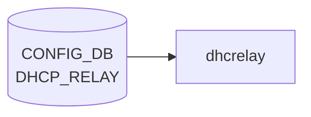

# DHCP_RELAY テーブル

## 概要

**DHCPv6 relay agent** の [VLAN](../../reference/glossary.md#term-vlan) インタフェース単位設定を保持する [CONFIG_DB](../../reference/glossary.md#term-config_db) テーブル[^1]。`dhcp6relay` プロセス (sonic-dhcp-relay リポ) が [CONFIG_DB](../../reference/glossary.md#term-config_db) から読み、IPv6 リレー対象 [VLAN](../../reference/glossary.md#term-vlan) と上流サーバを構築する。

> 注: 名前は単に `DHCP_RELAY` だが、[YANG](../../reference/glossary.md#term-yang) モジュール名 `sonic-dhcpv6-relay` の通り **IPv6 リレー専用**。IPv4 リレーは `VLAN` テーブルの `dhcp_servers` フィールド（旧仕様）または `DHCP_SERVER_IPV4` (新仕様の DHCP サーバ機能) を参照。

<!-- cdb-mermaid -->
### データフロー (自動生成)



!!! note "凡例"
    CONFIG_DB から SAI までの典型経路を `docs/reference/config-db-orch-map.md` から機械生成したミニ図。詳細・例外は本ページ本文と対応表を参照。
<!-- /cdb-mermaid -->

## key 構造

```text
DHCP_RELAY|<name>
```

- `<name>`: DHCPv6 リレー対象の [VLAN](../../reference/glossary.md#term-vlan) インタフェース名 (例: `Vlan100`)。[YANG](../../reference/glossary.md#term-yang) では `type string` だが、実運用上は VLAN 名を入れる。

## フィールド

| フィールド | 型 | 説明 |
|-----------|----|------|
| `name` (key) | string | DHCPv6 リレー対象の VLAN インタフェース名 |
| `dhcpv6_servers` | leaf-list of `inet:ipv6-address` (ordered-by user) | 上流 DHCPv6 サーバの IPv6 アドレス群 |
| `rfc6939_support` | string `"true"`/`"false"` | RFC 6939 (Client Link-Layer Address Option) サポート |
| `interface_id` | string `"true"`/`"false"` | リレーメッセージへの Interface-ID オプション挿入 (RFC 3315 / RFC 6422) |

`dhcpv6_servers` は `ordered-by user` で **設定順を維持** する。`dhcp6relay` は順序通りに upstream をスキャンする。

`rfc6939_support` / `interface_id` は [YANG](../../reference/glossary.md#term-yang) 上 `pattern "false|true"` の string 型（boolean ではない）。[CONFIG_DB](../../reference/glossary.md#term-config_db) の慣習で文字列リテラル。

> **注意 (YANG-実装 discrepancy)**: `dhcp6relay` daemon は YANG が定義する flat field キー名（`rfc6939_support` / `interface_id`）ではなく、`dhcpv6_option|rfc6939_support` / `dhcpv6_option|interface_id`（フィールド名にパイプ `|` を含む形式）を読む。YANG バリデーションを通過した設定が daemon に届かない silent drop が発生する可能性がある（`config_interface.cpp:169,172` / `mock_config.py` 参照）。

<!-- value-behavior -->
## 値依存挙動マトリクス

### `dhcpv6_servers` (leaf-list of ipv6-address, ordered-by user)

| 値 | 挙動 |
|----|------|
| 1 件以上 | dhcp6relay が VLAN ごとの upstream サーバとして登録。設定順（ordered-by user）を維持してスキャン |
| 0 件（空 leaf-list） | その VLAN のリレーは無効（config_interface.cpp: servers.empty() → skip） |

### `rfc6939_support` (string pattern "false|true")

| 値 | 挙動 |
|----|------|
| `"true"` (デフォルト) | dhcp6relay が RFC 6939 Client Link-Layer Address Option (option 79) をリレーメッセージに追加 |
| `"false"` | option 79 を付与しない（config_interface.cpp:169） |

### `interface_id` (string pattern "false|true")

| 値 | 挙動 |
|----|------|
| `"true"` | Interface-ID オプション (OPTION_INTERFACE_ID) をリレーメッセージに挿入（config_interface.cpp:172-173） |
| `"false"` / 未設定（非 DualToR） | Interface-ID なし（デフォルト off） |
| 未設定（DualToR 環境） | dual_tor_sock が存在する場合はデフォルト on（config_interface.cpp:118-122） |

<!-- /value-behavior -->

## 制約

- `name` キーは leafref ではないので任意の文字列が許されるが、対応する `VLAN` エントリが存在しなければ実環境では機能しない。
- `dhcpv6_servers` が空 (leaf-list 自体が無い) の場合、その VLAN のリレーは事実上無効。

## 購読者

- `dhcp6relay` (sonic-dhcp-relay リポ): CONFIG_DB → `dhcp6relay --config-file` 相当のランタイム反映
- `dhcpmon` (オプション): リレー監視・統計

## 関連 CONFIG_DB / YANG / CLI

- 関連 CONFIG_DB: `VLAN`, `VLAN_INTERFACE` (リレー対象 VLAN の IP)、`DHCP_SERVER_IPV4` (v4 側 in-band サーバ機能)
- 関連 CLI: `config dhcp_relay ipv6 destination add/remove`, `config dhcp_relay ipv6 helper`
- 関連 YANG: `sonic-dhcpv6-relay`

<!-- ref-triangle:start -->

## 関連リファレンス

- YANG: `sonic-dhcpv6-relay`
- CLI: [`config dhcp_relay`](../cli/config-dhcp-relay.md)

<!-- ref-triangle:end -->

## 引用元

[^1]: YANG 定義: `sonic-dhcpv6-relay.yang` (revision 2021-10-30). <https://github.com/sonic-net/sonic-buildimage/blob/9ea932ec2e18f35e58268ec2e4456b1d4afd65cd/src/sonic-yang-models/yang-models/sonic-dhcpv6-relay.yang>

<!-- ops-hint -->
## 運用ヒント

### 典型値

- key 形式: `DHCP_RELAY|<vlan>`。
- `dhcp_servers`: relay 先サーバ IP の list、`rfc3046_compatibility`: `true`。

### よくある誤設定

- dhcp_relay デーモンが対象 VLAN に SVI を持たないと relay されない。

### 確認コマンド

```bash
sonic-db-cli CONFIG_DB keys 'DHCP_RELAY|*'
show dhcprelay_helper ipv4
```
<!-- /ops-hint -->

<!-- cdb-exceptions -->
## 例外条件・特殊挙動

| consumer | 条件 | 挙動 |
|---|---|---|
| dhcp6relay | 登録 VLAN が VLAN_INTERFACE テーブルに存在しない | `LOG_WARNING: "%s doesn't exist in VLAN_INTERFACE table, skip it"` を出力してスキップ（config_interface.cpp:135） |
| dhcp6relay | VLAN に IPv6 アドレス未設定 | `LOG_WARNING: "%s doesn't have IPv6 address configured, skip it"` を出力してスキップ（config_interface.cpp:146） |
| dhcp6relay | VLAN にサーバアドレスが 0 件 | `LOG_WARNING: "No servers found for VLAN %s, skipping configuration."` を出力（config_interface.cpp:177） |
| dhcp6relay | `dhcpv6_option\|interface_id` 未設定 | 非 Dual-ToR 環境: `false`、Dual-ToR 環境: `true` をデフォルト使用（config_interface.cpp:117-121） |
| dhcp6relay | `dhcpv6_option\|rfc6939_support` 未設定 | `true`（Option 79 付与）をハードコードデフォルト使用（config_interface.cpp:117） |
| dhcp6relay | DHCP_RELAY 設定変更（起動後） | 動的変更は無視。"need restart container" ログのみ出力（config_interface.cpp:76-78） |
| dhcp6relay | YANG 経由の `rfc6939_support`/`interface_id` 書込み | daemon は `dhcpv6_option\|` prefix 付きキーを読むため YANG flat key 設定は silent drop |

> **Evidence**: sonic-dhcp-relay `dhcp6relay/src/config_interface.cpp:76-182`、`sonic-buildimage/dockers/docker-dhcp-relay/cli-plugin-tests/mock_config.py`
<!-- /cdb-exceptions -->


<!-- runtime-trace -->
## 実コンテナ動作トレース

### 段階 1 — Consumer 登録

`dhcrelay` Docker コンテナ / `dhcp_relay` サービス が CONFIG_DB の `DHCP_RELAY` テーブルを購読する。

`DHCP_RELAY` の key は `<vlan_intf>` (例: `Vlan1000`)。複数 server を `dhcp_servers` フィールドでリスト。

### 段階 2 — CFG→APPL 翻訳

なし (APPL_DB 中継なし)

### 段階 3 — APPL→SAI

なし (SAI 非経由 — Linux カーネルの L4 DHCP relay)

### 段階 4 — タイミングと副作用

**適用タイミング**: `dhcrelay` サービスが CONFIG_DB の `DHCP_RELAY` を読み込んで起動パラメータを決定。設定変更はサービス再起動が必要。

**副作用**: DHCP server アドレスの変更は relay 転送先を変更。サービス再起動中 DHCP relay が一時停止する。
<!-- /runtime-trace -->

<!-- defaults -->
## コード由来の暗黙デフォルト (Phase A)

> **調査根拠**: `sonic-dhcp-relay/dhcp6relay/src/config_interface.cpp` 全行精読 (2026-05-14)

### `rfc6939_support` — ハードコードデフォルト `true` + YANG-実装 discrepancy

| 状態 | 実行時挙動 |
|---|---|
| フィールド未設定 | RFC 6939 Option 79 を**有効**（ハードコード `option_79_default = true`、cpp:117） |
| フィールド = `"false"` | Option 79 無効（cpp:169 で明示 override） |
| フィールド = `"true"` | Option 79 有効（デフォルトと同じ） |

**YANG-実装 discrepancy**: YANG モデルは `rfc6939_support` を `DHCP_RELAY|<vlan>` の flat field として定義するが、C++ daemon は `dhcpv6_option|rfc6939_support`（フィールド名にパイプを含む Redis hash key）を読む（cpp:169）。YANG 経由で `rfc6939_support = "false"` を書き込んでも daemon は読まず **silent drop** — 常にハードコードデフォルト `true` で動作する。CLI テスト mock は `dhcpv6_option|rfc6939_support` 形式を使用（`mock_config.py` 参照）。

### `interface_id` — プラットフォーム依存デフォルト + YANG-実装 discrepancy

| 環境 | フィールド未設定時の挙動 |
|---|---|
| 非 DualToR | Interface-ID オプション**無効**（ハードコード `interface_id_default = false`、cpp:118） |
| DualToR (`dual_tor_sock` 存在) | Interface-ID オプション**有効**（cpp:121 で `true` に変更） |

**DualToR 判定**: `dhcpv6-relay.agents.j2:16` で `DEVICE_METADATA.localhost.subtype == "DualToR"` の場合に `-u Loopback0` オプションが付き `dual_tor_sock` が生成される。`interface_id` のデフォルトは **DEVICE_METADATA.subtype に間接依存**。

**YANG-実装 discrepancy**: `rfc6939_support` と同様、YANG の flat field `interface_id` ではなく `dhcpv6_option|interface_id` を daemon が読む（cpp:172）。YANG 経由の設定は **silent drop**。

### `dhcpv6_servers` — 空リスト時の silent skip

`dhcpv6_servers` が空または未設定の VLAN は vlans マップに登録されない（cpp:176-179）。ログ出力のみで relay は無効（エラーなし）。

### 動的変更の dead consumer

`dhcp6relay` 起動後に `DHCP_RELAY` を変更しても設定は反映されない（cpp:76-78: "need restart container to take effect"）。**コンテナ再起動が必要**。ライブ変更は complete dead consumer。

### minigraph / CLI による書込みフィールドの制限

`sonic-cfggen` (minigraph.py:1071-1078) および CLI plugin (`dhcp_relay.py`) は `dhcpv6_servers` のみ `DHCP_RELAY` に書き込み、`rfc6939_support` / `interface_id` は**書き込まない**。これらは daemon のハードコードデフォルト（`true` / 環境依存）が適用される。
<!-- /defaults -->

<!-- entry-points -->
## 書き込み入り口 (Direction A)

対象テーブル: `DHCP_RELAY`

### CLI
- `config interface dhcp-relay add/del <vlan> <server-ip>`
  - ソース: `sonic-utilities/config/vlan.py`

### minigraph / sonic-cfggen
- あり: `sonic-cfggen -m <minigraph.xml>` 実行時に本テーブルが生成・上書きされる。`dhcpv6_servers` のみ書き込まれ、`rfc6939_support` / `interface_id` は省略される（minigraph.py:1071-1078）

### REST / gNMI (sonic-mgmt-common)
- なし (対応 OpenConfig/SONiC YANG transformer なし)

### db_migrator
- なし

### ビルド時デフォルト (init_cfg / j2 テンプレート)
- なし

### ハードコードデフォルト
- `rfc6939_support` 未設定 → daemon 内部で `true`（Option 79 有効）
- `interface_id` 未設定 → 非 DualToR: `false`、DualToR: `true`

### ランタイム注入 (デーモン自動書き込み)
- なし
<!-- /entry-points -->

<!-- ordering -->
## 書込み順依存 (Phase B)

### 概要

`DHCP_RELAY` テーブルの consumer (`dhcp6relay`) は **起動時に一度だけ** CONFIG_DB を読み込む設計であり、ランタイム中の変更は無視される。そのため SET/DEL の順序と、先行テーブルの存在有無が動作に直接影響する。

### 順序依存マトリクス

| フィールド / 操作 | 依存テーブル / 条件 | 順序制約 | 違反時の挙動 |
|-----------------|-------------------|---------|------------|
| key (`<vlan>`) SET | `VLAN_INTERFACE\|<vlan>\|*` (IPv6 アドレス付き) が CONFIG_DB に存在すること | `VLAN` → `VLAN_INTERFACE`（IPv6 prefix 付き）→ `DHCP_RELAY` の順 | `LOG_WARNING: "%s doesn't exist in VLAN_INTERFACE table, skip it"` でスキップ。エントリは書き込まれるが dhcp6relay に反映されない |
| key (`<vlan>`) SET | VLAN インタフェースに IPv6 アドレスが設定済みであること | `VLAN_INTERFACE` の IPv6 prefix 設定 → `DHCP_RELAY` SET | `LOG_WARNING: "%s doesn't have IPv6 address configured, skip it"` でスキップ |
| `dhcpv6_servers` SET/DEL | dhcp_relay サービス再起動 | SET/DEL 後に `systemctl stop/reset-failed/start dhcp_relay` | 設定変更後に再起動しないと `LOG_WARNING: "relay config changed, need restart container to take effect"` が出力され反映されない |
| `dhcpv6_servers` 追加順 | — | CLI `add` は末尾 append (`dhcp_servers.append`) | 追加順が dhcp6relay の upstream スキャン順（`ordered-by user`）に直結。後から追加したサーバは優先度が低い |
| `dhcpv6_servers` 全削除 DEL | dhcp_relay サービス再起動 | DEL 後に再起動しないと vlans マップがメモリ上に残留 | dhcp6relay プロセスはリレーを継続する（DEL は未反映）。再起動でのみリセット |
| `rfc6939_support` / `interface_id` | 起動時の `DEVICE_METADATA.subtype` / `-u` 引数 | サービス起動前に確定（boot 時）。変更は再起動が必要 | DualToR 環境では `-u Loopback0` 引数で `dual_tor_sock=true` → `interface_id` デフォルト `true`。非 DualToR はデフォルト `false` |
| 全フィールド（boot 時） | STATE_DB `INTERFACE_TABLE\|<vlan>\|<prefix>\|state == ok` | `wait_for_intf.sh` が STATE_DB をポーリングし、インタフェース up 確認後さらに 10 秒待機してから dhcp6relay を起動 | VLAN インタフェースが STATE_DB に `ok` 状態で現れる前に dhcp_relay コンテナを起動しても dhcp6relay は起動しない |

### Evidence

- `config_interface.cpp:63-79` — `get_dhcp` が `dynamic=true` 時に変更を無視して警告ログを出すコードパス
- `config_interface.cpp:117-121` — `dual_tor_sock` による `interface_id_default` 切り替え
- `config_interface.cpp:130-143` — `VLAN_INTERFACE|<vlan>|*` キー存在チェック + IPv6 アドレス確認
- `config_interface.cpp:145-148` — `has_ipv6_address == false` 時のスキップ
- `config_interface.cpp:160-165` — `dhcpv6_servers` の順序付き push_back（`ordered-by user` 反映）
- `config_interface.cpp:176-179` — `servers.empty()` 時のスキップ
- `dhcp_relay.py:51-61` — `restart_dhcp_relay_service`: add/del 後に `systemctl stop/reset-failed/start dhcp_relay` を自動実行
- `dhcp_relay.py:155-162` — `del_dhcp_relay`: servers が空になると `set_entry(None)` でエントリ全削除 (DEL 伝播)
- `wait_for_intf.sh.j2:12-19` — STATE_DB `INTERFACE_TABLE|<intf>|<prefix>|state` ポーリング
- `wait_for_intf.sh.j2:49-52` — `sleep 10` (インタフェース ready 後の追加待機)
- `docker-dhcp-relay.supervisord.conf.j2:33-44` — `start` (priority=2) → `dhcp6relay` (priority=3, `dependent_startup_wait_for=start:exited`)
- `dhcpv6-relay.agents.j2:2-10` — `DHCP_RELAY[vlan_name]['dhcpv6_servers']|length > 0` で dhcp6relay プログラムエントリ生成を制御

### LSP トレース証跡

```
main.cpp:37          initialize_swss(vlans)
  └── config_interface.cpp:22      SubscriberStateTable("DHCP_RELAY")  ← 購読登録
  └── config_interface.cpp:24      get_dhcp(vlans, &ipHelpersTable, false, configDbPtr)
        └── config_interface.cpp:66       swssSelect.select()
        └── config_interface.cpp:72-79    selectable == ipHelpersTable && !dynamic
              └── handleRelayNotification(...)
                    └── processRelayNotification(entries, vlans, config_db)
                          ├── config_interface.cpp:130-143  VLAN_INTERFACE IPv6 チェック
                          ├── config_interface.cpp:160-165  dhcpv6_servers push_back (順序保持)
                          ├── config_interface.cpp:169      rfc6939_support="false" → is_option_79=false
                          ├── config_interface.cpp:172-173  interface_id="true" → is_interface_id=true
                          └── config_interface.cpp:176-183  servers.empty() → skip; else vlans[vlan]=intf

main.cpp:38          loop_relay(vlans)  ← 取り込んだ vlans でリレーループ開始（以降変更不可）
```
<!-- /ordering -->

<!-- failure -->
## 失敗挙動 (Phase D)

### 概要

`dhcp6relay` は orchagent/SAI を経由せず Linux カーネルの UDP relay (L4) として動作するため、SAI error / task_need_retry / task_failed の概念は存在しない。失敗は大きく「起動時致命エラー (exit)」「パケット単位の silent drop」「設定変更の無視」の 3 類型に分類される。

### 起動時致命エラー (exit)

| 発生箇所 | 条件 | 挙動 |
|---------|------|------|
| `relay.cpp:168` `RelayMsg::MarshalBinary()` | `new uint8_t[BUFFER_SIZE]` 失敗 | `LOG_ERR "Failed to init relay msg buffer"` → `exit(1)` |
| `relay.cpp:1241` `loop_relay()` | `event_base_new()` NULL | `LOG_ERR "libevent: Failed to create event base"` → `exit(EXIT_FAILURE)` |
| `relay.cpp:1253` `loop_relay()` | `sock_open()` (raw socket/bind/BPF) 失敗 | `LOG_ERR "Failed to create client listen socket"` → `exit(EXIT_FAILURE)` |
| `relay.cpp:1271` `loop_relay()` | DualToR: `prepare_lo_socket()` 失敗 | `LOG_ERR "Failed to create dualtor loopback listen socket"` → `exit(EXIT_FAILURE)` |
| `relay.cpp:1420` `lla_check_callback()` | `prepare_vlan_sockets()` 失敗 (6 回 retry 後) | `LOG_ERR` → `exit(EXIT_FAILURE)` |
| `relay.cpp:489` `prepare_relay_config()` | `getifaddrs()` 失敗 | `LOG_WARNING "getifaddrs: Unable to get network interfaces"` → `exit(1)` |
| `main.cpp:40` | 未捕捉 `std::exception` | `LOG_ERR "An exception occurred."` → `return 1` (プロセス終了) |

プロセス終了後は systemd / supervisord による自動 restart に委ねる。CONFIG_DB/STATE_DB の状態はそのまま残る。

### VLAN ソケット bind retry (起動時)

`prepare_vlan_sockets()` (`relay.cpp:604-658`) では VLAN インタフェースの GUA/LLA アドレス未割り当て時に 5 秒 sleep × 最大 6 回リトライする。

```
LOG_WARNING "Retry #%d to bind to sockets on interface %s"
```

6 回全失敗後は `exit(EXIT_FAILURE)`。**retry 回数: 6、retry 間隔: 5 秒**。

### LLA 未準備 VLAN の定期チェック (60 s タイマー)

`lla_check_callback()` (`relay.cpp:1361`) が 60 秒周期で起動時に LLA 未準備だった VLAN を再チェックする。起動直後にも即時実行される。

- LLA 未準備の VLAN はスキップされ、その間にサーバから届いた reply パケットは:
  - `LOG_WARNING "Link local address for %s is not ready, packet will be dropped"` → drop
- 全 VLAN の LLA が準備完了すると `event_del(timer_event)` でタイマー解除。

### 設定変更の無視 (hot-reload 不可)

`config_interface.cpp:76-78` — ランタイム中に CONFIG_DB の `DHCP_RELAY` エントリが変更されると:

```
LOG_WARNING "relay config changed, need restart container to take effect"
```

**変更は適用されない。** CONFIG_DB への書き込みは正常完了するが dhcp6relay は無視する。ロールバックもなく、**DB 状態と実動作が乖離したまま**になる。反映にはコンテナ再起動が必要。

### SELECT エラー → return (継続)

`config_interface.cpp:67-70` — 初期化時の `swssSelect.select()` が `Select::ERROR` を返した場合:

```
LOG_WARNING "Select: returned ERROR"
```

return して継続。retry はなく、次の呼び出しタイミングまで待つ。

### パケット単位の silent drop

| 発生箇所 | 条件 | ログ / カウンタ |
|---------|------|----------------|
| `relay.cpp:679` `relay_client()` | DHCPv6 オプション不正 (malformed) | `LOG_WARNING "DHCPv6 option is invalid..."` + `Malformed` カウンタ +1 → drop |
| `relay.cpp:807` `relay_relay_reply()` | relay-reply オプション不正 | `LOG_WARNING "Relay-reply option is invalid..."` + `Malformed` カウンタ +1 → drop |
| `relay.cpp:814` `relay_relay_reply()` | OPTION_RELAY_MSG なし | `LOG_WARNING "Option relay-msg not found"` + `Unknown` カウンタ +1 → drop |
| `relay.cpp:747` `relay_relay_forw()` | hop_count >= HOP_LIMIT (32) | `LOG_INFO "Dropping relay-forward message..."` → drop (カウンタ加算なし) |
| `relay.cpp:969` `client_packet_handler()` | 不明 msg_type | `LOG_WARNING "Unknown DHCPv6 message type..."` + `Unknown` カウンタ +1 → drop |
| `relay.cpp:893` `client_callback()` | if_indextoname 失敗 | `LOG_WARNING "Invalid input interface index..."` → continue |
| `relay.cpp:908` `client_callback()` | vlan_map に該当インタフェースなし | silent continue (CLIENT_IF_PREFIX 以外) または `LOG_WARNING` |
| `relay.cpp:1038` `get_relay_int_from_relay_msg()` | link_address から VLAN 特定不可 | `LOG_WARNING "can't find vlan info from link address..."` → NULL → drop |

### パケット送信失敗 → retry なし

`sender.cpp:21-27` — `sendto()` 失敗:

```
LOG_ERR "sendto: Failed to send to target address: %s, error: %s"
```

return false → 呼び出し元で `increase_counter()` が呼ばれない（**カウンタ未加算**）。retry なし。

### libevent イベント生成失敗の非対称性

| イベント種別 | 失敗時の挙動 |
|------------|------------|
| client listen event (全体共用) | `exit(EXIT_FAILURE)` |
| server listen event (VLAN ごと) | `LOG_ERR "libevent: Failed to create server listen libevent"` → exit なし (サーバ応答受信不可のまま継続) |

VLAN 単位の server listen event 生成失敗は **プロセスを停止させない部分失敗**。その VLAN のクライアントへ reply が届かなくなるが、他の VLAN の relay は継続する。

### STATE_DB への障害記録

`STATE_DB` の `DHCPv6_COUNTER_TABLE|<ifname>` にメッセージ種別ごとのカウンタを記録する:

- カウンタ種別: `Unknown`, `Solicit`, `Advertise`, `Request`, `Confirm`, `Renew`, `Rebind`, `Reply`, `Release`, `Decline`, `Reconfigure`, `Information-Request`, `Relay-Forward`, `Relay-Reply`, `Malformed`
- 送信失敗 (`sendto` エラー) 時はカウンタが加算されない
- `STATE_DB` の `ERROR_TABLE` への書き込みはなし (dhcp6relay は ERROR_TABLE を使用しない)

### 部分成功シナリオ

複数 VLAN が設定されている場合、一部の VLAN が LLA 未準備で `is_lla_ready=false` のまま残っていても他 VLAN の relay は正常動作する。その VLAN に関連する CONFIG_DB エントリは残骸として存在するが削除はされない。

> **Evidence**: `sonic-dhcp-relay` `dhcp6relay/src/relay.cpp`, `dhcp6relay/src/config_interface.cpp`, `dhcp6relay/src/sender.cpp`, `dhcp6relay/src/main.cpp`

---

### dhcprelayd (IPv4 リレー管理デーモン) の失敗挙動

> **調査根拠**: `sonic-buildimage/src/sonic-dhcp-utilities/dhcp_utilities/dhcprelayd/dhcprelayd.py` 全行精読 (2026-05-16)

`dhcprelayd` は `DHCP_SERVER_IPV4` 機能が有効な場合に `isc-dhcp-relay` (`dhcrelay`) プロセスの起動・停止を管理する Python デーモン。`dhcp6relay` とは独立した失敗経路を持つ。

#### 不正 server_ip — STATE_DB 取得失敗 → exit(1)

`_get_dhcp_server_ip()` は `STATE_DB::DHCP_SERVER_IPV4_SERVER_IP|eth0|ip` から DHCP サーバ IP を取得する。取得できない場合は 10 秒 sleep × 10 回リトライ後に `sys.exit(1)` で終了する。

| 条件 | ログ | 挙動 |
|------|------|------|
| STATE_DB に server_ip なし (1〜9 回目) | `syslog.LOG_INFO "Cannot get dhcp server ip"` | 10 秒 sleep 後リトライ |
| STATE_DB に server_ip なし (10 回目) | `syslog.LOG_ERR "Cannot get dhcp_server ip from state_db"` | `sys.exit(1)` → dhcprelayd プロセス終了 |

プロセス終了後は supervisord が dhcp_relay コンテナを再起動する。`STATE_DB` の `DHCP_SERVER_IPV4_SERVER_IP` は `dhcp_server` 機能 (dhcpd) が書き込む — dhcpd が起動前または異常終了した場合にこの失敗経路に入る。

#### VLAN 未解決 — dhcp_interfaces からの除外 (silent discard)

`refresh_dhcrelay()` は `DHCP_SERVER_IPV4` テーブルで `state == "enabled"` のインタフェースを `dhcp_interfaces` に追加した後、`VLAN` テーブルに存在しないインタフェースを `dhcp_interfaces.discard()` で除外する (`dhcprelayd.py:97-98`)。

| 条件 | 挙動 |
|------|------|
| `DHCP_SERVER_IPV4` に enabled エントリあり、かつ `VLAN` テーブルに当該 VLAN が存在しない | `dhcp_interfaces` から除外 → `dhcrelay` 起動コマンドに `-id <vlan>` が含まれない |
| `MID_PLANE_BRIDGE` にも一致しない場合 | 同上。ログ出力なし (silent discard) |

`enabled_dhcp_interfaces` には残留するため、将来 VLAN が追加されたときに `VlanTableEventChecker` / `VlanIntfTableEventChecker` が変化を検知して `refresh_dhcrelay()` を再実行する設計。

#### isc-dhcp-relay 起動失敗 — zombie 検出 → exit(1)

`_start_dhcrelay_process()` は `subprocess.Popen()` で `dhcrelay` を起動後、1 秒 sleep して `psutil.STATUS_ZOMBIE` を確認する (`dhcprelayd.py:309-313`)。

| 条件 | ログ | 挙動 |
|------|------|------|
| `dhcrelay` が zombie 状態 | `syslog.LOG_ERR "Failed to start dhcrelay process with: {cmds}"` | `terminate_proc()` で zombie 回収 → `sys.exit(1)` |
| `dhcrelay` が正常起動 | `syslog.LOG_INFO "dhcrelay process started successfully"` | 正常継続 |

#### dhcrelay 動作確認失敗 → exit(1) (`dhcp_server` 機能 disabled 時)

`_check_dhcp_relay_processes()` は `dhcp_server` 機能が disabled の場合に定期実行され、実行中の `dhcrelay` プロセスの cmdline と supervisord 設定の期待値を比較する (`dhcprelayd.py:259-262`)。

| 条件 | ログ | 挙動 |
|------|------|------|
| 実行中プロセスが期待値と不一致 | `syslog.LOG_ERR "Running processes is not as expected! Running: {...}. Expected: {...}"` | `sys.exit(1)` → dhcp_relay コンテナ再起動を強制 |
| 一致 | なし | 正常継続 |

> **Evidence**: `sonic-buildimage/src/sonic-dhcp-utilities/dhcp_utilities/dhcprelayd/dhcprelayd.py:97-98, 259-262, 290-313, 375-385`
<!-- /failure -->

<!-- glossary-links-injected: 11715e560dc6 -->
