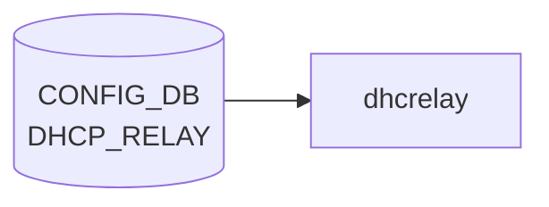

# DHCP_RELAY テーブル

## 概要

**DHCPv6 relay agent** の [VLAN](../../reference/glossary.md#term-vlan) インタフェース単位設定を保持する [CONFIG_DB](../../reference/glossary.md#term-config_db) テーブル[^1]。`dhcp6relay` プロセス (sonic-dhcp-relay リポ) が [CONFIG_DB](../../reference/glossary.md#term-config_db) から読み、IPv6 リレー対象 [VLAN](../../reference/glossary.md#term-vlan) と上流サーバを構築する。

> 注: 名前は単に `DHCP_RELAY` だが、[YANG](../../reference/glossary.md#term-yang) モジュール名 `sonic-dhcpv6-relay` の通り **IPv6 リレー専用**。IPv4 リレーは `VLAN` テーブルの `dhcp_servers` フィールド（旧仕様）または `DHCP_SERVER_IPV4` (新仕様の DHCP サーバ機能) を参照。

<!-- cdb-mermaid -->
### データフロー (自動生成)



!!! note "凡例"
    CONFIG_DB から SAI までの典型経路を `docs/reference/config-db-orch-map.md` から機械生成したミニ図。詳細・例外は本ページ本文と対応表を参照。
<!-- /cdb-mermaid -->

## key 構造

```text
DHCP_RELAY|<name>
```

- `<name>`: DHCPv6 リレー対象の [VLAN](../../reference/glossary.md#term-vlan) インタフェース名 (例: `Vlan100`)。[YANG](../../reference/glossary.md#term-yang) では `type string` だが、実運用上は VLAN 名を入れる。

## フィールド

| フィールド | 型 | 説明 |
|-----------|----|------|
| `name` (key) | string | DHCPv6 リレー対象の VLAN インタフェース名 |
| `dhcpv6_servers` | leaf-list of `inet:ipv6-address` (ordered-by user) | 上流 DHCPv6 サーバの IPv6 アドレス群 |
| `rfc6939_support` | string `"true"`/`"false"` | RFC 6939 (Client Link-Layer Address Option) サポート |
| `interface_id` | string `"true"`/`"false"` | リレーメッセージへの Interface-ID オプション挿入 (RFC 3315 / RFC 6422) |

`dhcpv6_servers` は `ordered-by user` で **設定順を維持** する。`dhcp6relay` は順序通りに upstream をスキャンする。

`rfc6939_support` / `interface_id` は [YANG](../../reference/glossary.md#term-yang) 上 `pattern "false|true"` の string 型（boolean ではない）。[CONFIG_DB](../../reference/glossary.md#term-config_db) の慣習で文字列リテラル。

<!-- value-behavior -->
## 値依存挙動マトリクス

### `dhcpv6_servers` (leaf-list of ipv6-address, ordered-by user)

| 値 | 挙動 |
|----|------|
| 1 件以上 | dhcp6relay が VLAN ごとの upstream サーバとして登録。設定順（ordered-by user）を維持してスキャン |
| 0 件（空 leaf-list） | その VLAN のリレーは無効（config_interface.cpp: servers.empty() → skip） |

### `rfc6939_support` (string pattern "false|true")

| 値 | 挙動 |
|----|------|
| `"true"` (デフォルト) | dhcp6relay が RFC 6939 Client Link-Layer Address Option (option 79) をリレーメッセージに追加 |
| `"false"` | option 79 を付与しない（config_interface.cpp:169） |

### `interface_id` (string pattern "false|true")

| 値 | 挙動 |
|----|------|
| `"true"` | Interface-ID オプション (OPTION_INTERFACE_ID) をリレーメッセージに挿入（config_interface.cpp:172-173） |
| `"false"` / 未設定（非 DualToR） | Interface-ID なし（デフォルト off） |
| 未設定（DualToR 環境） | dual_tor_sock が存在する場合はデフォルト on（config_interface.cpp:118-122） |

<!-- /value-behavior -->

## 制約

- `name` キーは leafref ではないので任意の文字列が許されるが、対応する `VLAN` エントリが存在しなければ実環境では機能しない。
- `dhcpv6_servers` が空 (leaf-list 自体が無い) の場合、その VLAN のリレーは事実上無効。

## 購読者

- `dhcp6relay` (sonic-dhcp-relay リポ): CONFIG_DB → `dhcp6relay --config-file` 相当のランタイム反映
- `dhcpmon` (オプション): リレー監視・統計

## 関連 CONFIG_DB / YANG / CLI

- 関連 CONFIG_DB: `VLAN`, `VLAN_INTERFACE` (リレー対象 VLAN の IP)、`DHCP_SERVER_IPV4` (v4 側 in-band サーバ機能)
- 関連 CLI: `config dhcp_relay ipv6 destination add/remove`, `config dhcp_relay ipv6 helper`
- 関連 YANG: `sonic-dhcpv6-relay`

<!-- ref-triangle:start -->

## 関連リファレンス

- YANG: `sonic-dhcpv6-relay`
- CLI: [`config dhcp_relay`](../cli/config-dhcp-relay.md)

<!-- ref-triangle:end -->

## 引用元

[^1]: YANG 定義: `sonic-dhcpv6-relay.yang` (revision 2021-10-30). <https://github.com/sonic-net/sonic-buildimage/blob/9ea932ec2e18f35e58268ec2e4456b1d4afd65cd/src/sonic-yang-models/yang-models/sonic-dhcpv6-relay.yang>

<!-- ops-hint -->
## 運用ヒント

### 典型値

- key 形式: `DHCP_RELAY|<vlan>`。
- `dhcp_servers`: relay 先サーバ IP の list、`rfc3046_compatibility`: `true`。

### よくある誤設定

- dhcp_relay デーモンが対象 VLAN に SVI を持たないと relay されない。

### 確認コマンド

```bash
sonic-db-cli CONFIG_DB keys 'DHCP_RELAY|*'
show dhcprelay_helper ipv4
```
<!-- /ops-hint -->

<!-- cdb-exceptions -->
## 例外条件・特殊挙動

| consumer | 条件 | 挙動 |
|---|---|---|
| dhcp6relay | 登録 VLAN が VLAN_INTERFACE テーブルに存在しない | `LOG_WARNING: "%s doesn't exist in VLAN_INTERFACE table, skip it"` を出力してスキップ（config_interface.cpp:135） |
| dhcp6relay | VLAN に IPv6 アドレス未設定 | `LOG_WARNING: "%s doesn't have IPv6 address configured, skip it"` を出力してスキップ（config_interface.cpp:146） |
| dhcp6relay | VLAN にサーバアドレスが 0 件 | `LOG_WARNING: "No servers found for VLAN %s, skipping configuration."` を出力（config_interface.cpp:177） |
| dhcp6relay | `dhcpv6_option\|interface_id` フィールド未設定 | 非 Dual-ToR 環境では `false`、Dual-ToR 環境では `true` をデフォルト使用（config_interface.cpp:117-121） |

> **Evidence**: sonic-dhcp-relay `dhcp6relay/src/config_interface.cpp:117-177`
<!-- /cdb-exceptions -->


<!-- runtime-trace -->
## 実コンテナ動作トレース

### 段階 1 — Consumer 登録

`dhcrelay` Docker コンテナ / `dhcp_relay` サービス が CONFIG_DB の `DHCP_RELAY` テーブルを購読する。

`DHCP_RELAY` の key は `<vlan_intf>` (例: `Vlan1000`)。複数 server を `dhcp_servers` フィールドでリスト。

### 段階 2 — CFG→APPL 翻訳

なし (APPL_DB 中継なし)

### 段階 3 — APPL→SAI

なし (SAI 非経由 — Linux カーネルの L4 DHCP relay)

### 段階 4 — タイミングと副作用

**適用タイミング**: `dhcrelay` サービスが CONFIG_DB の `DHCP_RELAY` を読み込んで起動パラメータを決定。設定変更はサービス再起動が必要。

**副作用**: DHCP server アドレスの変更は relay 転送先を変更。サービス再起動中 DHCP relay が一時停止する。
<!-- /runtime-trace -->

<!-- entry-points -->
## 書き込み入り口 (Direction A)

対象テーブル: `DHCP_RELAY`

### CLI
- `config interface dhcp-relay add/del <vlan> <server-ip>`
  - ソース: `sonic-utilities/config/vlan.py`

### minigraph / sonic-cfggen
- あり: `sonic-cfggen -m <minigraph.xml>` 実行時に本テーブルが生成・上書きされる

### REST / gNMI (sonic-mgmt-common)
- なし (対応 OpenConfig/SONiC YANG transformer なし)

### db_migrator
- なし

### ビルド時デフォルト (init_cfg / j2 テンプレート)
- なし

### ハードコードデフォルト
- なし

### ランタイム注入 (デーモン自動書き込み)
- なし
<!-- /entry-points -->

<!-- ordering -->
## 書込み順依存 (Phase B)

### 概要

`DHCP_RELAY` テーブルは **dhcp6relay** (DHCPv6) と **isc-dhcp-relay** / **dhcprelayd** (DHCPv4) の 2 系統の consumer を持つ。それぞれ起動タイミングと参照テーブルが異なり、書き込み順違反時の挙動も異なる。

### dhcp6relay (DHCPv6) — 順序依存マトリクス

| フィールド / 操作 | 依存テーブル / 条件 | 順序制約 | 違反時の挙動 |
|-----------------|-------------------|---------|------------|
| key (`<vlan>`) SET | `VLAN_INTERFACE\|<vlan>\|*` (IPv6 アドレス付き) が CONFIG_DB に存在すること | `VLAN` → `VLAN_INTERFACE`（IPv6 prefix 付き）→ `DHCP_RELAY` の順 | `LOG_WARNING: "%s doesn't exist in VLAN_INTERFACE table, skip it"` でスキップ。エントリは書き込まれるが dhcp6relay に反映されない |
| key (`<vlan>`) SET | VLAN インタフェースに IPv6 アドレスが設定済みであること | `VLAN_INTERFACE` の IPv6 prefix 設定 → `DHCP_RELAY` SET | `LOG_WARNING: "%s doesn't have IPv6 address configured, skip it"` でスキップ |
| `dhcpv6_servers` SET/DEL | dhcp_relay サービス再起動 | SET/DEL 後に `systemctl stop/reset-failed/start dhcp_relay` | 設定変更後に再起動しないと `LOG_WARNING: "relay config changed, need restart container to take effect"` が出力され反映されない |
| `dhcpv6_servers` 追加順 | — | CLI `add` は末尾 append (`dhcp_servers.append`) | 追加順が dhcp6relay の upstream スキャン順（`ordered-by user`）に直結。後から追加したサーバは優先度が低い |
| `dhcpv6_servers` 全削除 DEL | dhcp_relay サービス再起動 | DEL 後に再起動しないと vlans マップがメモリ上に残留 | dhcp6relay プロセスはリレーを継続する（DEL は未反映）。再起動でのみリセット |
| `rfc6939_support` / `interface_id` | 起動時の `DEVICE_METADATA.subtype` / `-u` 引数 | サービス起動前に確定（boot 時）。変更は再起動が必要 | DualToR 環境では `-u Loopback0` 引数で `dual_tor_sock=true` → `interface_id` デフォルト `true`。非 DualToR はデフォルト `false` |
| 全フィールド（boot 時） | STATE_DB `INTERFACE_TABLE\|<vlan>\|<prefix>\|state == ok` | `wait_for_intf.sh` が STATE_DB をポーリングし、インタフェース up 確認後さらに 10 秒待機してから dhcp6relay を起動 | VLAN インタフェースが STATE_DB に `ok` 状態で現れる前に dhcp_relay コンテナを起動しても dhcp6relay は起動しない |

### isc-dhcp-relay (`dhcrelay`) (IPv4) — 順序依存マトリクス

旧方式の IPv4 relay は `DHCP_RELAY` テーブルを使わず、**`VLAN[<vlan>].dhcp_servers`** フィールドを参照する。supervisord テンプレート (`dhcpv4-relay.agents.j2`) がコンテナ起動時に `isc-dhcpv4-relay-<vlan>` プログラムエントリを生成する。

| 操作 / 依存 | 前提条件 | 順序制約 | 違反時の挙動 |
|-----------|---------|---------|------------|
| `isc-dhcpv4-relay-<vlan>` プロセス起動 | `VLAN_INTERFACE` に IPv4 prefix が存在する VLAN (`pfx_filter` で抽出) | `VLAN` + `VLAN_INTERFACE`（IPv4 prefix 付き）が設定済みでコンテナ再生成 | j2 テンプレートが該当 VLAN をスキップ。コンテナ再起動しても `isc-dhcpv4-relay-<vlan>` が supervisord に登録されない |
| `VLAN[<vlan>].dhcp_servers` 設定 | `VLAN` エントリが存在し `dhcp_servers` フィールドに IPv4 アドレスが 1 件以上 | `VLAN` → `VLAN_INTERFACE`（IPv4）→ `VLAN.dhcp_servers` 設定 → コンテナ再起動 | `dhcp_servers` が空または `VLAN` が存在しなければ j2 テンプレートがプロセスエントリを生成しない |
| upstream インタフェース (`-iu`) の決定 | `VLAN_INTERFACE`、`INTERFACE`、`PORTCHANNEL_INTERFACE` が設定済み | upstream IF 設定 → コンテナ起動 | `-iu` なしで起動すると relay reply を受信するインタフェースがなくなる |
| DualToR: `-U Loopback0 -dt` オプション | `DEVICE_METADATA.localhost.subtype == "DualToR"` | subtype 設定 → コンテナ起動 | subtype 未設定では DualToR 用オプションが付かない |
| PORT 監視 (`dhcpmon`) | `isc-dhcpv4-relay-<vlan>:running` (または `dhcp4relay:running`) が supervisord 上で running 状態 | `isc-dhcpv4-relay-<vlan>` 起動 (priority=3) → `dhcpmon-<vlan>` 起動 (priority=4) | `dhcpmon` は `dependent_startup_wait_for` で isc-dhcpv4-relay が running になるまで起動しない |

### dhcprelayd (Python supervisor) — VLAN/PORT 動的監視

`dhcprelayd` は supervisord priority=3 で `start:exited` 後に起動する Python デーモンで、`DHCP_SERVER_IPV4` が enabled のときに `dhcrelay` / `dhcpmon` プロセスの動的管理を担う。

| 操作 / 依存 | 監視テーブル | 順序制約 | 挙動 |
|-----------|-----------|---------|------|
| `dhcrelay` プロセス起動 | `DHCP_SERVER_IPV4[<intf>].state == "enabled"` + `VLAN[<intf>]` が存在 | `VLAN` → `DHCP_SERVER_IPV4` (state=enabled) → `dhcprelayd` が `refresh_dhcrelay()` | VLAN が存在しない enabled インタフェースは `dhcp_interfaces` から除外されプロセスが起動しない（dhcprelayd.py:97-98） |
| VLAN 変更検知 | `VlanTableEventChecker` (`VLAN` テーブル購読) | VLAN 追加/削除 → dhcprelayd が `refresh_dhcrelay(force_kill=False)` | VLAN エントリ変更で dhcrelay を非強制再起動。インタフェースセットが変わらなければ kill しない（dhcprelayd.py:159） |
| VLAN_INTERFACE 変更検知 | `VlanIntfTableEventChecker` (`VLAN_INTERFACE` テーブル購読) | VLAN_INTERFACE 変更 → dhcprelayd が `refresh_dhcrelay(force_kill=True)` | VLAN_INTERFACE 変更は **force kill** で dhcrelay を再起動（dhcprelayd.py:156-158）。MidPlane 変更も同様 |
| FEATURE.dhcp_server 切替 | `DhcpServerFeatureStateChecker` (`FEATURE` テーブル) | `dhcp_server.state` enabled/disabled 切替 → supervisord の relay プロセスを stop/start | disabled → enabled: supervisord の isc-dhcpv4-relay を stop し dhcprelayd が dhcrelay を管理。enabled → disabled: dhcrelay を kill して supervisord の isc-dhcpv4-relay を start（dhcprelayd.py:148-174） |
| dhcprelayd 起動後の 5 秒待機 | — | `start()` 内で `time.sleep(5)` 後に処理開始 | supervisord が isc-dhcpv4-relay を起動するための猶予。VLAN/DHCP_SERVER_IPV4 を読む前に既存 dhcrelay が起動済みであることを保証（dhcprelayd.py:67） |

### ブート時の supervisord 起動順 (全体)

```
priority=1: rsyslogd
priority=2: start (wait_for_intf.sh) — STATE_DB INTERFACE_TABLE|<vlan>|state==ok ポーリング + sleep 10
priority=3: dhcp6relay       (dependent_startup_wait_for=start:exited)
            isc-dhcpv4-relay-<vlan>  (同上、DEVICE_METADATA.has_sonic_dhcpv4_relay==False の場合)
            dhcprelayd       (同上、常時)
priority=4: dhcpmon-<vlan>   (dependent_startup_wait_for=isc-dhcpv4-relay-<vlan>:running
                               または dhcp4relay:running)
```

`wait_for_intf.sh.j2` は `VLAN_INTERFACE` に IPv4 prefix を持つ VLAN と `DHCP_RELAY` に IPv6 prefix を持つ VLAN を列挙し、全て STATE_DB で `ok` になるまでブロックする。`VLAN_INTERFACE` が空 (VLAN 未設定) の場合、ポーリング対象なし → 即座に exited → dhcp6relay/isc-dhcpv4-relay が設定なしで起動する。

### Evidence

- `config_interface.cpp:63-79` — dhcp6relay `get_dhcp` が `dynamic=true` 時に変更を無視して警告ログを出すコードパス
- `config_interface.cpp:117-121` — `dual_tor_sock` による `interface_id_default` 切り替え
- `config_interface.cpp:130-143` — `VLAN_INTERFACE|<vlan>|*` キー存在チェック + IPv6 アドレス確認
- `config_interface.cpp:160-165` — `dhcpv6_servers` の順序付き push_back（`ordered-by user` 反映）
- `config_interface.cpp:176-179` — `servers.empty()` 時のスキップ
- `dhcp_relay.py:51-61` — `restart_dhcp_relay_service`: add/del 後に `systemctl stop/reset-failed/start dhcp_relay` を自動実行
- `wait_for_intf.sh.j2:12-19` — STATE_DB `INTERFACE_TABLE|<intf>|<prefix>|state` ポーリング
- `wait_for_intf.sh.j2:49-52` — `sleep 10` (インタフェース ready 後の追加待機)
- `docker-dhcp-relay.supervisord.conf.j2:47-102` — 全 program エントリ、priority, dependent_startup_wait_for
- `dhcpv4-relay.agents.j2:2-45` — `isc-dhcpv4-relay-<vlan>` 生成条件 (`VLAN.dhcp_servers|length > 0`, `VLAN_INTERFACE|pfx_filter`)
- `dhcp-relay.monitors.j2:52-56` — `dhcpmon` が `isc-dhcpv4-relay-<vlan>:running` または `dhcp4relay:running` を待機
- `dhcprelayd.py:67` — `time.sleep(5)` dhcrelay 起動待機
- `dhcprelayd.py:94-113` — `refresh_dhcrelay`: VLAN / DHCP_SERVER_IPV4 / VLAN_INTERFACE 依存関係チェック
- `dhcprelayd.py:148-174` — FEATURE.dhcp_server 切替時の stop/start シーケンス

### LSP トレース証跡 (dhcp6relay)

```
main.cpp:37          initialize_swss(vlans)
  └── config_interface.cpp:22      SubscriberStateTable("DHCP_RELAY")  ← 購読登録
  └── config_interface.cpp:24      get_dhcp(vlans, &ipHelpersTable, false, configDbPtr)
        └── config_interface.cpp:66       swssSelect.select()
        └── config_interface.cpp:72-79    selectable == ipHelpersTable && !dynamic
              └── handleRelayNotification(...)
                    └── processRelayNotification(entries, vlans, config_db)
                          ├── config_interface.cpp:130-143  VLAN_INTERFACE IPv6 チェック
                          ├── config_interface.cpp:160-165  dhcpv6_servers push_back (順序保持)
                          ├── config_interface.cpp:169      rfc6939_support="false" → is_option_79=false
                          ├── config_interface.cpp:172-173  interface_id="true" → is_interface_id=true
                          └── config_interface.cpp:176-183  servers.empty() → skip; else vlans[vlan]=intf

main.cpp:38          loop_relay(vlans)  ← 取り込んだ vlans でリレーループ開始（以降変更不可）
```
<!-- /ordering -->

<!-- glossary-links-injected: 11715e560dc6 -->
