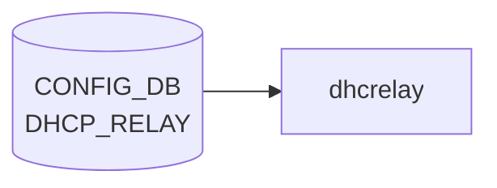

# DHCP_RELAY テーブル

## 概要

**DHCPv6 relay agent** の [VLAN](../../reference/glossary.md#term-vlan) インタフェース単位設定を保持する [CONFIG_DB](../../reference/glossary.md#term-config_db) テーブル[^1]。`dhcp6relay` プロセス (sonic-dhcp-relay リポ) が [CONFIG_DB](../../reference/glossary.md#term-config_db) から読み、IPv6 リレー対象 [VLAN](../../reference/glossary.md#term-vlan) と上流サーバを構築する。

> 注: 名前は単に `DHCP_RELAY` だが、[YANG](../../reference/glossary.md#term-yang) モジュール名 `sonic-dhcpv6-relay` の通り **IPv6 リレー専用**。IPv4 リレーは `VLAN` テーブルの `dhcp_servers` フィールド（旧仕様）または `DHCPV4_RELAY` テーブル（新仕様）を参照。IPv4 の組み込みサーバ機能は別途 `DHCP_SERVER_IPV4` テーブルで管理される。

<!-- cdb-mermaid -->
### データフロー (自動生成)



!!! note "凡例"
    CONFIG_DB から SAI までの典型経路を `docs/reference/config-db-orch-map.md` から機械生成したミニ図。詳細・例外は本ページ本文と対応表を参照。
<!-- /cdb-mermaid -->

## key 構造

```text
DHCP_RELAY|<name>
```

- `<name>`: DHCPv6 リレー対象の [VLAN](../../reference/glossary.md#term-vlan) インタフェース名 (例: `Vlan100`)。[YANG](../../reference/glossary.md#term-yang) では `type string` だが、実運用上は VLAN 名を入れる。

## フィールド

| フィールド | 型 | 説明 |
|-----------|----|------|
| `name` (key) | string | DHCPv6 リレー対象の VLAN インタフェース名 |
| `dhcpv6_servers` | leaf-list of `inet:ipv6-address` (ordered-by user) | 上流 DHCPv6 サーバの IPv6 アドレス群 |
| `rfc6939_support` | string `"true"`/`"false"` | RFC 6939 (Client Link-Layer Address Option) サポート |
| `interface_id` | string `"true"`/`"false"` | リレーメッセージへの Interface-ID オプション挿入 (RFC 3315 / RFC 6422) |

`dhcpv6_servers` は `ordered-by user` で **設定順を維持** する。`dhcp6relay` は順序通りに upstream をスキャンする。

`rfc6939_support` / `interface_id` は [YANG](../../reference/glossary.md#term-yang) 上 `pattern "false|true"` の string 型（boolean ではない）。[CONFIG_DB](../../reference/glossary.md#term-config_db) の慣習で文字列リテラル。

> **注意 (YANG-実装 discrepancy)**: `dhcp6relay` daemon は YANG が定義する flat field キー名（`rfc6939_support` / `interface_id`）ではなく、`dhcpv6_option|rfc6939_support` / `dhcpv6_option|interface_id`（フィールド名にパイプ `|` を含む形式）を読む。YANG バリデーションを通過した設定が daemon に届かない silent drop が発生する可能性がある（`config_interface.cpp:169,172` / `mock_config.py` 参照）。

<!-- value-behavior -->
## 値依存挙動マトリクス

### `dhcpv6_servers` (leaf-list of ipv6-address, ordered-by user)

| 値 | 挙動 |
|----|------|
| 1 件以上 | dhcp6relay が VLAN ごとの upstream サーバとして登録。設定順（ordered-by user）を維持してスキャン |
| 0 件（空 leaf-list） | その VLAN のリレーは無効（config_interface.cpp: servers.empty() → skip） |

### `rfc6939_support` (string pattern "false|true")

| 値 | 挙動 |
|----|------|
| `"true"` (デフォルト) | dhcp6relay が RFC 6939 Client Link-Layer Address Option (option 79) をリレーメッセージに追加 |
| `"false"` | option 79 を付与しない（config_interface.cpp:169） |

### `interface_id` (string pattern "false|true")

| 値 | 挙動 |
|----|------|
| `"true"` | Interface-ID オプション (OPTION_INTERFACE_ID) をリレーメッセージに挿入（config_interface.cpp:172-173） |
| `"false"` / 未設定（非 DualToR） | Interface-ID なし（デフォルト off） |
| 未設定（DualToR 環境） | dual_tor_sock が存在する場合はデフォルト on（config_interface.cpp:118-122） |

<!-- /value-behavior -->

## 制約

- `name` キーは leafref ではないので任意の文字列が許されるが、対応する `VLAN` エントリが存在しなければ実環境では機能しない。
- `dhcpv6_servers` が空 (leaf-list 自体が無い) の場合、その VLAN のリレーは事実上無効。

## 購読者

- `dhcp6relay` (sonic-dhcp-relay リポ): CONFIG_DB → `dhcp6relay --config-file` 相当のランタイム反映
- `dhcpmon` (オプション): リレー監視・統計

## 関連 CONFIG_DB / YANG / CLI

- 関連 CONFIG_DB: `VLAN`, `VLAN_INTERFACE` (リレー対象 VLAN の IP)、`DHCP_SERVER_IPV4` (v4 側 in-band サーバ機能)
- 関連 CLI: `config dhcp_relay ipv6 destination add/remove`, `config dhcp_relay ipv6 helper`
- 関連 YANG: `sonic-dhcpv6-relay`

<!-- ref-triangle:start -->

## 関連リファレンス

- YANG: `sonic-dhcpv6-relay`
- CLI: [`config dhcp_relay`](../cli/config-dhcp-relay.md)

<!-- ref-triangle:end -->

## 引用元

[^1]: YANG 定義: `sonic-dhcpv6-relay.yang` (revision 2021-10-30). <https://github.com/sonic-net/sonic-buildimage/blob/9ea932ec2e18f35e58268ec2e4456b1d4afd65cd/src/sonic-yang-models/yang-models/sonic-dhcpv6-relay.yang>

<!-- ops-hint -->
## 運用ヒント

### 典型値

- key 形式: `DHCP_RELAY|<vlan>`。
- `dhcpv6_servers`: relay 先 DHCPv6 サーバの IPv6 アドレスリスト、`rfc6939_support`: `"true"`。

### よくある誤設定

- dhcp_relay デーモンが対象 VLAN に SVI を持たないと relay されない。

### 確認コマンド

```bash
sonic-db-cli CONFIG_DB keys 'DHCP_RELAY|*'
show dhcp_relay destination ipv6
```
<!-- /ops-hint -->

<!-- cdb-exceptions -->
## 例外条件・特殊挙動

| consumer | 条件 | 挙動 |
|---|---|---|
| dhcp6relay | 登録 VLAN が VLAN_INTERFACE テーブルに存在しない | `LOG_WARNING: "%s doesn't exist in VLAN_INTERFACE table, skip it"` を出力してスキップ（config_interface.cpp:135） |
| dhcp6relay | VLAN に IPv6 アドレス未設定 | `LOG_WARNING: "%s doesn't have IPv6 address configured, skip it"` を出力してスキップ（config_interface.cpp:146） |
| dhcp6relay | VLAN にサーバアドレスが 0 件 | `LOG_WARNING: "No servers found for VLAN %s, skipping configuration."` を出力（config_interface.cpp:177） |
| dhcp6relay | `dhcpv6_option\|interface_id` 未設定 | 非 Dual-ToR 環境: `false`、Dual-ToR 環境: `true` をデフォルト使用（config_interface.cpp:117-121） |
| dhcp6relay | `dhcpv6_option\|rfc6939_support` 未設定 | `true`（Option 79 付与）をハードコードデフォルト使用（config_interface.cpp:117） |
| dhcp6relay | DHCP_RELAY 設定変更（起動後） | 動的変更は無視。"need restart container" ログのみ出力（config_interface.cpp:76-78） |
| dhcp6relay | YANG 経由の `rfc6939_support`/`interface_id` 書込み | daemon は `dhcpv6_option\|` prefix 付きキーを読むため YANG flat key 設定は silent drop |

> **Evidence**: sonic-dhcp-relay `dhcp6relay/src/config_interface.cpp:76-182`、`sonic-buildimage/dockers/docker-dhcp-relay/cli-plugin-tests/mock_config.py`
<!-- /cdb-exceptions -->


<!-- runtime-trace -->
## 実コンテナ動作トレース

### 段階 1 — Consumer 登録

`dhcrelay` Docker コンテナ / `dhcp_relay` サービス が CONFIG_DB の `DHCP_RELAY` テーブルを購読する。

`DHCP_RELAY` の key は `<vlan_intf>` (例: `Vlan1000`)。複数 server を `dhcp_servers` フィールドでリスト。

### 段階 2 — CFG→APPL 翻訳

なし ([APPL_DB](../../reference/glossary.md#term-appl_db) 中継なし)

### 段階 3 — APPL→SAI

なし ([SAI](../../reference/glossary.md#term-sai) 非経由 — Linux カーネルの L4 DHCP relay)

### 段階 4 — タイミングと副作用

**適用タイミング**: `dhcrelay` サービスが CONFIG_DB の `DHCP_RELAY` を読み込んで起動パラメータを決定。設定変更はサービス再起動が必要。

**副作用**: DHCP server アドレスの変更は relay 転送先を変更。サービス再起動中 DHCP relay が一時停止する。
<!-- /runtime-trace -->

<!-- defaults -->
## コード由来の暗黙デフォルト (コード由来)

> **Evidence**: `sonic-dhcp-relay/dhcp6relay/src/config_interface.cpp` (2026-05-14)

### `rfc6939_support` — ハードコードデフォルト `true` + YANG-実装 discrepancy

| 状態 | 実行時挙動 |
|---|---|
| フィールド未設定 | RFC 6939 Option 79 を**有効**（ハードコード `option_79_default = true`、cpp:117） |
| フィールド = `"false"` | Option 79 無効（cpp:169 で明示 override） |
| フィールド = `"true"` | Option 79 有効（デフォルトと同じ） |

**YANG-実装 discrepancy**: YANG モデルは `rfc6939_support` を `DHCP_RELAY|<vlan>` の flat field として定義するが、C++ daemon は `dhcpv6_option|rfc6939_support`（フィールド名にパイプを含む [Redis](../../reference/glossary.md#term-redis) hash key）を読む（cpp:169）。YANG 経由で `rfc6939_support = "false"` を書き込んでも daemon は読まず **silent drop** — 常にハードコードデフォルト `true` で動作する。CLI テスト mock は `dhcpv6_option|rfc6939_support` 形式を使用（`mock_config.py` 参照）。

### `interface_id` — プラットフォーム依存デフォルト + YANG-実装 discrepancy

| 環境 | フィールド未設定時の挙動 |
|---|---|
| 非 DualToR | Interface-ID オプション**無効**（ハードコード `interface_id_default = false`、cpp:118） |
| DualToR (`dual_tor_sock` 存在) | Interface-ID オプション**有効**（cpp:121 で `true` に変更） |

**DualToR 判定**: `dhcpv6-relay.agents.j2:16` で `DEVICE_METADATA.localhost.subtype == "DualToR"` の場合に `-u Loopback0` オプションが付き `dual_tor_sock` が生成される。`interface_id` のデフォルトは **[DEVICE_METADATA](../../reference/glossary.md#term-device_metadata).subtype に間接依存**。

**YANG-実装 discrepancy**: `rfc6939_support` と同様、YANG の flat field `interface_id` ではなく `dhcpv6_option|interface_id` を daemon が読む（cpp:172）。YANG 経由の設定は **silent drop**。

### `dhcpv6_servers` — 空リスト時の silent skip

`dhcpv6_servers` が空または未設定の VLAN は vlans マップに登録されない（cpp:176-179）。ログ出力のみで relay は無効（エラーなし）。

### 動的変更の dead consumer

`dhcp6relay` 起動後に `DHCP_RELAY` を変更しても設定は反映されない（cpp:76-78: "need restart container to take effect"）。**コンテナ再起動が必要**。ライブ変更は complete dead consumer。

### minigraph / CLI による書込みフィールドの制限

`sonic-cfggen` (minigraph.py:1071-1078) および CLI plugin (`dhcp_relay.py`) は `dhcpv6_servers` のみ `DHCP_RELAY` に書き込み、`rfc6939_support` / `interface_id` は**書き込まない**。これらは daemon のハードコードデフォルト（`true` / 環境依存）が適用される。
<!-- /defaults -->

<!-- constants -->
## ハードコード定数

> **Evidence**: `sonic-dhcp-relay/dhcp6relay/src/relay.h`, `config_interface.cpp`, `relay.cpp`, `wait_for_intf.sh.j2` (2026-05-15)

### プロトコル定数 (relay.h)

| 定数 | 値 | 証拠 | 意味 |
|-----|-----|------|------|
| `RELAY_PORT` | `547` | relay.h:22 | DHCPv6 サーバ・リレー間 UDP ポート (RFC 3315) |
| `CLIENT_PORT` | `546` | relay.h:23 | DHCPv6 クライアント向け UDP ポート |
| `HOP_LIMIT` | `8` | relay.h:24 | relay-forward の最大 hop count。RFC 8415 準拠で旧値 32 から変更。超過パケットは silent drop |
| `DHCPv6_OPTION_LIMIT` | `147` | relay.h:25 | 処理対象オプションコードの上限値 |
| `RAWSOCKET_RECV_SIZE` | `1048576` (1 MiB) | relay.h:27 | クライアント側 raw socket 受信バッファサイズ |
| `CLIENT_IF_PREFIX` | `"Ethernet"` | relay.h:28 | クライアント I/F 判定プレフィックス |
| `BUFFER_SIZE` | `9200` バイト | relay.h:29 | DHCPv6 メッセージシリアライズ用バッファ。ジャンボフレーム (MTU 9000) 対応マジックナンバー |
| `BATCH_SIZE` | `64` | relay.h:37 | `SubscriberStateTable.pops()` の一回あたり最大エントリ数 |
| `OPTION_RELAY_MSG` | `9` | relay.h:33 | DHCPv6 OPTION_RELAY_MSG コード (RFC 3315 §22.10) |
| `OPTION_INTERFACE_ID` | `18` | relay.h:34 | DHCPv6 OPTION_INTERFACE_ID コード (RFC 3315 §22.18) |
| `OPTION_CLIENT_LINKLAYER_ADDR` | `79` | relay.h:35 | DHCPv6 Option 79 コード (RFC 6939) |

### 動作定数 (config_interface.cpp / relay.cpp)

| 定数 | 値 | 証拠 | 意味 |
|-----|-----|------|------|
| `DEFAULT_TIMEOUT_MSEC` | `1000` ms | config_interface.cpp:6 | `swssSelect.select()` タイムアウト。`constexpr auto` で変更不可 |
| `option_79_default` | `true` | config_interface.cpp:117 | `rfc6939_support` 未設定時のデフォルト（Option 79 有効） |
| `interface_id_default` (非 DualToR) | `false` | config_interface.cpp:118 | `interface_id` 未設定・非 DualToR 時のデフォルト |
| `interface_id_default` (DualToR) | `true` | config_interface.cpp:121 | `dual_tor_sock` 存在時に上書き |
| VLAN ソケット bind retry 回数 | `6` | relay.cpp:641 | `prepare_vlan_sockets()` の最大リトライ回数 |
| VLAN ソケット bind retry 間隔 | `5` 秒 | relay.cpp:640 | リトライ間 `sleep(5)` |
| LLA チェックタイマー周期 | `60` 秒 | relay.cpp:1305 | LLA 未準備 VLAN の定期再チェック間隔 (`EV_PERSIST`) |

### 起動待機定数 (wait_for_intf.sh.j2)

| 定数 | 値 | 証拠 | 意味 |
|-----|-----|------|------|
| [STATE_DB](../../reference/glossary.md#term-state_db) ポーリング間隔 | `1` 秒 | wait_for_intf.sh.j2:18 | `INTERFACE_TABLE\|<intf>\|state == ok` ポーリング間隔 |
| インタフェース ready 後の追加待機 | `10` 秒 | wait_for_intf.sh.j2:51 | [STATE_DB](../../reference/glossary.md#term-state_db) ok 確認後の固定 `sleep 10` |

### 定数の外部変更可否

すべての定数はコンパイル時または起動スクリプト内で固定されており、CONFIG_DB・環境変数・設定ファイルから**変更不可**。`HOP_LIMIT` と `BUFFER_SIZE` のみソースコード変更＋再ビルドで変更可能。
<!-- /constants -->

<!-- entry-points -->
## 書き込み入り口

対象テーブル: `DHCP_RELAY`

### CLI
- `config interface dhcp-relay add/del <vlan> <server-ip>`
  - ソース: `sonic-utilities/config/vlan.py`

### minigraph / sonic-cfggen
- あり: `sonic-cfggen -m <minigraph.xml>` 実行時に本テーブルが生成・上書きされる。`dhcpv6_servers` のみ書き込まれ、`rfc6939_support` / `interface_id` は省略される（minigraph.py:1071-1078）

### REST / gNMI (sonic-mgmt-common)
- なし (対応 OpenConfig/[SONiC](../../reference/glossary.md#term-sonic) YANG transformer なし)

### db_migrator
- なし

### ビルド時デフォルト (init_cfg / j2 テンプレート)
- なし

### ハードコードデフォルト
- `rfc6939_support` 未設定 → daemon 内部で `true`（Option 79 有効）
- `interface_id` 未設定 → 非 DualToR: `false`、DualToR: `true`

### ランタイム注入 (デーモン自動書き込み)
- なし
<!-- /entry-points -->

<!-- pubsub -->
## 通信メカニズム (Redis PUBSUB / keyspace notification)

> **Evidence**: `sonic-dhcp-relay/dhcp6relay/src/config_interface.cpp`、`sonic-swss-common/common/subscriberstatetable.cpp` 参照 (2026-05-14)

### 購読方式

`dhcp6relay` は `swss::SubscriberStateTable` を通じて CONFIG_DB の `DHCP_RELAY` テーブルを購読する。内部実装は [Redis](../../reference/glossary.md#term-redis) の **keyspace notification (PSUBSCRIBE)** であり、[ConsumerStateTable](../../reference/glossary.md#term-consumerstatetable) / NotificationConsumer は使用しない。TTL/keyspace expire 通知も使用しない。

### 通信シーケンス

```
dhcp6relay 起動
  └─ initialize_swss()                               (config_interface.cpp:18)
       ├─ DBConnector("CONFIG_DB", 0)                ← Redis DB #4
       ├─ SubscriberStateTable(db, "DHCP_RELAY")
       │    ├─ PSUBSCRIBE __keyspace@4__:DHCP_RELAY|*  ← keyspace 購読
       │    ├─ KEYS "DHCP_RELAY|*"                    ← 起動時スナップショット取得
       │    └─ 全エントリを m_buffer に SET_COMMAND として積む
       └─ swssSelect.addSelectable(&ipHelpersTable)
            └─ get_dhcp(vlans, table, dynamic=false, config_db)
                 └─ swssSelect.select(timeout_ms=1000)
                      └─ handleRelayNotification()
                           ├─ ipHelpersTable.pops(entries)
                           └─ processRelayNotification(entries, vlans, config_db)
```

### keyspace notification 詳細

| 項目 | 値 |
|------|-----|
| PSUBSCRIBE パターン | `__keyspace@4__:DHCP_RELAY\|*` |
| notify-keyspace-events | `KEA` (K=keyspace, E=keyevent, A=all commands) |
| Select timeout | 1000 ms |
| 起動時スナップショット | `Table::getKeys()` + `Table::get()` で全エントリ即時読み込み |
| 実行時変更検知 | keyspace event を受信するが `dynamic=true` フラグにより **無視** |

### pops() 処理フロー

```
ipHelpersTable.pops(entries)
  ├─ m_buffer (起動時スナップショット) があれば flush して return
  └─ m_keyspace_event_buffer を処理:
       pmessage.channel = "__keyspace@4__:DHCP_RELAY|<vlan>"
       pmessage.data    = "set" | "hset" | "del" | ...
       → "del"  → kfvOp = DEL_COMMAND
       → その他 → Table::get(key) で最新値を再取得 → kfvOp = SET_COMMAND
```

### 動的変更の dead consumer

起動後に `DHCP_RELAY` エントリを変更しても、`get_dhcp()` が `dynamic=true` フラグ付きで呼ばれるため、keyspace event を受信しても設定には反映されず `LOG_WARNING "relay config changed, need restart container to take effect"` のみ出力する (config_interface.cpp:76-78)。**コンテナ再起動が必須**。

---

### dhcprelayd (Python) — DHCPv4 リレー制御の通信メカニズム

> **Evidence**: `sonic-buildimage/src/sonic-dhcp-utilities/dhcp_utilities/dhcprelayd/dhcprelayd.py`、`dhcp_utilities/common/dhcp_db_monitor.py` (2026-05-16)

`dhcprelayd` は DHCPv4 向け Python デーモンで、CONFIG_DB の複数テーブルを `swss::SubscriberStateTable` 経由で購読し、`isc-dhcp-relay` (`dhcrelay`) プロセスを supervisord / subprocess 経由で制御する。`dhcp6relay` (C++) とは独立した別実装。

#### 購読テーブルと Checker クラス

| Checker クラス | 購読テーブル | 購読条件 | 用途 |
|---|---|---|---|
| `DhcpServerFeatureStateChecker` | `FEATURE` | 常時有効 (起動直後から) | `dhcp_server` フィーチャー の enabled/disabled 変更検知 |
| `DhcpServerTableIntfEnablementEventChecker` | `DHCP_SERVER_IPV4` | dhcp_server 有効時のみ | DHCP_SERVER_IPV4 の `state` フィールド変更検知 |
| `VlanTableEventChecker` | `VLAN` | dhcp_server 有効かつ VLAN DHCP インタフェース存在時 | VLAN メンバ追加/削除検知 |
| `VlanIntfTableEventChecker` | `VLAN_INTERFACE` | dhcp_server 有効かつ VLAN DHCP インタフェース存在時 | VLAN に IPv4 アドレス追加/削除検知 |
| `MidPlaneTableEventChecker` | `MID_PLANE_BRIDGE` | [SmartSwitch](../../reference/glossary.md#term-smartswitch) 環境かつ mid-plane DHCP インタフェース存在時 | MID_PLANE_BRIDGE の bridge フィールド変更検知 |

#### 通信シーケンス

```
dhcprelayd 起動 (main.py)
  └─ swsscommon.Select() ← 単一 Select オブジェクトで全テーブルを管理
  └─ 各 Checker.__init__(sel, config_db)
  │    └─ subscriber_state_table = None  (disabled 状態で初期化)
  └─ DhcpRelaydDbMonitor(db_connector, sel, checkers, timeout=5000ms)
  └─ dhcprelayd.start()
       ├─ _is_dhcp_server_enabled()  ← FEATURE テーブルを一括取得
       ├─ DhcpServerFeatureStateChecker.enable()
       │    └─ SubscriberStateTable(config_db, "FEATURE")
       │         └─ PSUBSCRIBE __keyspace@4__:FEATURE|*
       │    └─ sel.addSelectable(subscriber_state_table)
       └─ dhcp_server 有効時: DhcpServerTableIntfEnablementEventChecker.enable()
            └─ SubscriberStateTable(config_db, "DHCP_SERVER_IPV4")
                 └─ PSUBSCRIBE __keyspace@4__:DHCP_SERVER_IPV4|*

dhcprelayd.wait() ループ
  └─ DhcpRelaydDbMonitor.check_db_update(db_snapshot)
       └─ sel.select(timeout_ms=5000)
            ├─ TIMEOUT → {} 返却 (何もしない)
            └─ OBJECT → 各 enabled Checker.check_update_event(db_snapshot)
                  └─ subscriber_state_table.pop()  ← keyspace event 取り出し
                        → 条件判定 → True/False 返却
  └─ _proceed_with_check_res(check_res) で dhcrelay プロセス制御
```

#### isc-dhcp-relay (dhcrelay) 制御 — port-watch 経路

`dhcprelayd` は CONFIG_DB 変更を検知すると `dhcrelay` プロセスを以下の手順で再起動する:

```
refresh_dhcrelay(force_kill)
  ├─ DHCP_SERVER_IPV4 テーブルを一括取得 (get_config_db_table)
  ├─ VLAN テーブルを一括取得
  │    → enabled_dhcp_interfaces を構築 (state=="enabled" かつ VLAN 存在)
  ├─ VlanTableEventChecker / VlanIntfTableEventChecker の動的 enable/disable
  ├─ DEVICE_METADATA.has_sonic_dhcpv4_relay が "False" の場合のみ:
  │    _start_dhcrelay_process(dhcp_interfaces, dhcp_server_ip, force_kill)
  │         ├─ _kill_exist_relay_releated_process("dhcrelay", force_kill)
  │         │    └─ psutil.process_iter() で dhcrelay プロセスを走査
  │         │         → force_kill or インタフェースセット変更時: terminate_proc()
  │         └─ subprocess.Popen(["/usr/sbin/dhcrelay", "-d", "-m", "discard",
  │                  "-a", "%h:%p", "%P", "--name-alias-map-file", ...,
  │                  "-id", <vlan>, ..., "-iu", "docker0", <dhcp_server_ip>])
  └─ supervisord 経由制御 (dhcp_server 有効/無効切り替え時):
       supervisorctl stop/start <isc-dhcpv4-relay-VlanXXXX>
```

**port-watch 経路**: `VlanIntfTableEventChecker` が `VLAN_INTERFACE` テーブルの IPv4 アドレス変更を検知 → `refresh_dhcrelay(force_kill=True)` → dhcrelay プロセスを強制再起動。`VlanTableEventChecker` が VLAN 変更を検知 → `refresh_dhcrelay(force_kill=False)` → インタフェースセット変更時のみ再起動。

#### Select タイムアウトと動的 Checker 制御

| パラメータ | 値 | 根拠 |
|---|---|---|
| `DEFAULT_SELECT_TIMEOUT` | `5000` ms | dhcprelayd.py:22 |
| Checker 起動時有効 | `DhcpServerFeatureStateChecker` のみ | start() で初期化 |
| dhcp_server 有効時に追加 | `DhcpServerTableIntfEnablementEventChecker` | _proceed_with_check_res() |
| VLAN あり時に追加 | `VlanTableEventChecker`, `VlanIntfTableEventChecker` | refresh_dhcrelay() |
| [SmartSwitch](../../reference/glossary.md#term-smartswitch) 時に追加 | `MidPlaneTableEventChecker` | refresh_dhcrelay() |
| FEATURE / DHCP_SERVER チェッカー | 無効化対象外 (常時維持) | dhcprelayd.py:107-108 |

#### dhcprelayd と dhcp6relay の購読方式比較

| 項目 | dhcp6relay (C++) | dhcprelayd (Python) |
|---|---|---|
| 購読テーブル | `DHCP_RELAY` | `FEATURE`, `DHCP_SERVER_IPV4`, `VLAN`, `VLAN_INTERFACE`, `MID_PLANE_BRIDGE` |
| Select timeout | 1000 ms | 5000 ms |
| 動的変更への反応 | **無視** (dead consumer) | **即時反応** → dhcrelay 再起動 |
| 起動時スナップショット | `Table::getKeys()` で即時読み込み | `get_config_db_table()` で都度取得 |
| プロセス制御 | なし (自身がリレーを実装) | subprocess / supervisorctl で dhcrelay を制御 |

<!-- /pubsub -->

<!-- ordering -->
## 書込み順依存

### 概要

`DHCP_RELAY` テーブルは **dhcp6relay** (DHCPv6) と **isc-dhcp-relay** / **dhcprelayd** (DHCPv4) の 2 系統の consumer を持つ。それぞれ起動タイミングと参照テーブルが異なり、書き込み順違反時の挙動も異なる。

### dhcp6relay (DHCPv6) — 順序依存マトリクス

| フィールド / 操作 | 依存テーブル / 条件 | 順序制約 | 違反時の挙動 |
|-----------------|-------------------|---------|------------|
| key (`<vlan>`) SET | `VLAN_INTERFACE\|<vlan>\|*` (IPv6 アドレス付き) が CONFIG_DB に存在すること | `VLAN` → `VLAN_INTERFACE`（IPv6 prefix 付き）→ `DHCP_RELAY` の順 | `LOG_WARNING: "%s doesn't exist in VLAN_INTERFACE table, skip it"` でスキップ。エントリは書き込まれるが dhcp6relay に反映されない |
| key (`<vlan>`) SET | VLAN インタフェースに IPv6 アドレスが設定済みであること | `VLAN_INTERFACE` の IPv6 prefix 設定 → `DHCP_RELAY` SET | `LOG_WARNING: "%s doesn't have IPv6 address configured, skip it"` でスキップ |
| `dhcpv6_servers` SET/DEL | dhcp_relay サービス再起動 | SET/DEL 後に `systemctl stop/reset-failed/start dhcp_relay` | 設定変更後に再起動しないと `LOG_WARNING: "relay config changed, need restart container to take effect"` が出力され反映されない |
| `dhcpv6_servers` 追加順 | — | CLI `add` は末尾 append (`dhcp_servers.append`) | 追加順が dhcp6relay の upstream スキャン順（`ordered-by user`）に直結。後から追加したサーバは優先度が低い |
| `dhcpv6_servers` 全削除 DEL | dhcp_relay サービス再起動 | DEL 後に再起動しないと vlans マップがメモリ上に残留 | dhcp6relay プロセスはリレーを継続する（DEL は未反映）。再起動でのみリセット |
| `rfc6939_support` / `interface_id` | 起動時の `DEVICE_METADATA.subtype` / `-u` 引数 | サービス起動前に確定（boot 時）。変更は再起動が必要 | DualToR 環境では `-u Loopback0` 引数で `dual_tor_sock=true` → `interface_id` デフォルト `true`。非 DualToR はデフォルト `false` |
| 全フィールド（boot 時） | [STATE_DB](../../reference/glossary.md#term-state_db) `INTERFACE_TABLE\|<vlan>\|<prefix>\|state == ok` | `wait_for_intf.sh` が STATE_DB をポーリングし、インタフェース up 確認後さらに 10 秒待機してから dhcp6relay を起動 | VLAN インタフェースが STATE_DB に `ok` 状態で現れる前に dhcp_relay コンテナを起動しても dhcp6relay は起動しない |

### isc-dhcp-relay (`dhcrelay`) (IPv4) — 順序依存マトリクス

旧方式の IPv4 relay は `DHCP_RELAY` テーブルを使わず、**`VLAN[<vlan>].dhcp_servers`** フィールドを参照する。supervisord テンプレート (`dhcpv4-relay.agents.j2`) がコンテナ起動時に `isc-dhcpv4-relay-<vlan>` プログラムエントリを生成する。

| 操作 / 依存 | 前提条件 | 順序制約 | 違反時の挙動 |
|-----------|---------|---------|------------|
| `isc-dhcpv4-relay-<vlan>` プロセス起動 | `VLAN_INTERFACE` に IPv4 prefix が存在する VLAN (`pfx_filter` で抽出) | `VLAN` + `VLAN_INTERFACE`（IPv4 prefix 付き）が設定済みでコンテナ再生成 | j2 テンプレートが該当 VLAN をスキップ。コンテナ再起動しても `isc-dhcpv4-relay-<vlan>` が supervisord に登録されない |
| `VLAN[<vlan>].dhcp_servers` 設定 | `VLAN` エントリが存在し `dhcp_servers` フィールドに IPv4 アドレスが 1 件以上 | `VLAN` → `VLAN_INTERFACE`（IPv4）→ `VLAN.dhcp_servers` 設定 → コンテナ再起動 | `dhcp_servers` が空または `VLAN` が存在しなければ j2 テンプレートがプロセスエントリを生成しない |
| upstream インタフェース (`-iu`) の決定 | `VLAN_INTERFACE`、`INTERFACE`、`PORTCHANNEL_INTERFACE` が設定済み | upstream IF 設定 → コンテナ起動 | `-iu` なしで起動すると relay reply を受信するインタフェースがなくなる |
| DualToR: `-U Loopback0 -dt` オプション | `DEVICE_METADATA.localhost.subtype == "DualToR"` | subtype 設定 → コンテナ起動 | subtype 未設定では DualToR 用オプションが付かない |
| PORT 監視 (`dhcpmon`) | `isc-dhcpv4-relay-<vlan>:running` (または `dhcp4relay:running`) が supervisord 上で running 状態 | `isc-dhcpv4-relay-<vlan>` 起動 (priority=3) → `dhcpmon-<vlan>` 起動 (priority=4) | `dhcpmon` は `dependent_startup_wait_for` で isc-dhcpv4-relay が running になるまで起動しない |

### dhcprelayd (Python supervisor) — VLAN/PORT 動的監視

`dhcprelayd` は supervisord priority=3 で `start:exited` 後に起動する Python デーモンで、`DHCP_SERVER_IPV4` が enabled のときに `dhcrelay` / `dhcpmon` プロセスの動的管理を担う。

| 操作 / 依存 | 監視テーブル | 順序制約 | 挙動 |
|-----------|-----------|---------|------|
| `dhcrelay` プロセス起動 | `DHCP_SERVER_IPV4[<intf>].state == "enabled"` + `VLAN[<intf>]` が存在 | `VLAN` → `DHCP_SERVER_IPV4` (state=enabled) → `dhcprelayd` が `refresh_dhcrelay()` | VLAN が存在しない enabled インタフェースは `dhcp_interfaces` から除外されプロセスが起動しない（dhcprelayd.py:97-98） |
| VLAN 変更検知 | `VlanTableEventChecker` (`VLAN` テーブル購読) | VLAN 追加/削除 → dhcprelayd が `refresh_dhcrelay(force_kill=False)` | VLAN エントリ変更で dhcrelay を非強制再起動。インタフェースセットが変わらなければ kill しない（dhcprelayd.py:159） |
| VLAN_INTERFACE 変更検知 | `VlanIntfTableEventChecker` (`VLAN_INTERFACE` テーブル購読) | VLAN_INTERFACE 変更 → dhcprelayd が `refresh_dhcrelay(force_kill=True)` | VLAN_INTERFACE 変更は **force kill** で dhcrelay を再起動（dhcprelayd.py:156-158）。MidPlane 変更も同様 |
| FEATURE.dhcp_server 切替 | `DhcpServerFeatureStateChecker` (`FEATURE` テーブル) | `dhcp_server.state` enabled/disabled 切替 → supervisord の relay プロセスを stop/start | disabled → enabled: supervisord の isc-dhcpv4-relay を stop し dhcprelayd が dhcrelay を管理。enabled → disabled: dhcrelay を kill して supervisord の isc-dhcpv4-relay を start（dhcprelayd.py:148-174） |
| dhcprelayd 起動後の 5 秒待機 | — | `start()` 内で `time.sleep(5)` 後に処理開始 | supervisord が isc-dhcpv4-relay を起動するための猶予。VLAN/DHCP_SERVER_IPV4 を読む前に既存 dhcrelay が起動済みであることを保証（dhcprelayd.py:67） |

### ブート時の supervisord 起動順 (全体)

```
priority=1: rsyslogd
priority=2: start (wait_for_intf.sh) — STATE_DB INTERFACE_TABLE|<vlan>|state==ok ポーリング + sleep 10
priority=3: dhcp6relay       (dependent_startup_wait_for=start:exited)
            isc-dhcpv4-relay-<vlan>  (同上、DEVICE_METADATA.has_sonic_dhcpv4_relay==False の場合)
            dhcprelayd       (同上、常時)
priority=4: dhcpmon-<vlan>   (dependent_startup_wait_for=isc-dhcpv4-relay-<vlan>:running
                               または dhcp4relay:running)
```

`wait_for_intf.sh.j2` は `VLAN_INTERFACE` に IPv4 prefix を持つ VLAN と `DHCP_RELAY` に IPv6 prefix を持つ VLAN を列挙し、全て STATE_DB で `ok` になるまでブロックする。`VLAN_INTERFACE` が空 (VLAN 未設定) の場合、ポーリング対象なし → 即座に exited → dhcp6relay/isc-dhcpv4-relay が設定なしで起動する。

### Evidence

- `config_interface.cpp:63-79` — dhcp6relay `get_dhcp` が `dynamic=true` 時に変更を無視して警告ログを出すコードパス
- `config_interface.cpp:117-121` — `dual_tor_sock` による `interface_id_default` 切り替え
- `config_interface.cpp:130-143` — `VLAN_INTERFACE|<vlan>|*` キー存在チェック + IPv6 アドレス確認
- `config_interface.cpp:160-165` — `dhcpv6_servers` の順序付き push_back（`ordered-by user` 反映）
- `config_interface.cpp:176-179` — `servers.empty()` 時のスキップ
- `dhcp_relay.py:51-61` — `restart_dhcp_relay_service`: add/del 後に `systemctl stop/reset-failed/start dhcp_relay` を自動実行
- `wait_for_intf.sh.j2:12-19` — STATE_DB `INTERFACE_TABLE|<intf>|<prefix>|state` ポーリング
- `wait_for_intf.sh.j2:49-52` — `sleep 10` (インタフェース ready 後の追加待機)
- `docker-dhcp-relay.supervisord.conf.j2:47-102` — 全 program エントリ、priority, dependent_startup_wait_for
- `dhcpv4-relay.agents.j2:2-45` — `isc-dhcpv4-relay-<vlan>` 生成条件 (`VLAN.dhcp_servers|length > 0`, `VLAN_INTERFACE|pfx_filter`)
- `dhcp-relay.monitors.j2:52-56` — `dhcpmon` が `isc-dhcpv4-relay-<vlan>:running` または `dhcp4relay:running` を待機
- `dhcprelayd.py:67` — `time.sleep(5)` dhcrelay 起動待機
- `dhcprelayd.py:94-113` — `refresh_dhcrelay`: VLAN / DHCP_SERVER_IPV4 / VLAN_INTERFACE 依存関係チェック
- `dhcprelayd.py:148-174` — FEATURE.dhcp_server 切替時の stop/start シーケンス

### LSP トレース証跡 (dhcp6relay)

```
main.cpp:37          initialize_swss(vlans)
  └── config_interface.cpp:22      SubscriberStateTable("DHCP_RELAY")  ← 購読登録
  └── config_interface.cpp:24      get_dhcp(vlans, &ipHelpersTable, false, configDbPtr)
        └── config_interface.cpp:66       swssSelect.select()
        └── config_interface.cpp:72-79    selectable == ipHelpersTable && !dynamic
              └── handleRelayNotification(...)
                    └── processRelayNotification(entries, vlans, config_db)
                          ├── config_interface.cpp:130-143  VLAN_INTERFACE IPv6 チェック
                          ├── config_interface.cpp:160-165  dhcpv6_servers push_back (順序保持)
                          ├── config_interface.cpp:169      rfc6939_support="false" → is_option_79=false
                          ├── config_interface.cpp:172-173  interface_id="true" → is_interface_id=true
                          └── config_interface.cpp:176-183  servers.empty() → skip; else vlans[vlan]=intf

main.cpp:38          loop_relay(vlans)  ← 取り込んだ vlans でリレーループ開始（以降変更不可）
```
<!-- /ordering -->

<!-- failure -->
## 失敗挙動

### 概要

`dhcp6relay` は [orchagent](../../reference/glossary.md#term-orchagent)/[SAI](../../reference/glossary.md#term-sai) を経由せず Linux カーネルの UDP relay (L4) として動作するため、[SAI](../../reference/glossary.md#term-sai) error / task_need_retry / task_failed の概念は存在しない。失敗は大きく「起動時致命エラー (exit)」「パケット単位の silent drop」「設定変更の無視」の 3 類型に分類される。

### 起動時致命エラー (exit)

| 発生箇所 | 条件 | 挙動 |
|---------|------|------|
| `relay.cpp:168` `RelayMsg::MarshalBinary()` | `new uint8_t[BUFFER_SIZE]` 失敗 | `LOG_ERR "Failed to init relay msg buffer"` → `exit(1)` |
| `relay.cpp:1241` `loop_relay()` | `event_base_new()` NULL | `LOG_ERR "libevent: Failed to create event base"` → `exit(EXIT_FAILURE)` |
| `relay.cpp:1253` `loop_relay()` | `sock_open()` (raw socket/bind/BPF) 失敗 | `LOG_ERR "Failed to create client listen socket"` → `exit(EXIT_FAILURE)` |
| `relay.cpp:1271` `loop_relay()` | DualToR: `prepare_lo_socket()` 失敗 | `LOG_ERR "Failed to create dualtor loopback listen socket"` → `exit(EXIT_FAILURE)` |
| `relay.cpp:1420` `lla_check_callback()` | `prepare_vlan_sockets()` 失敗 (6 回 retry 後) | `LOG_ERR` → `exit(EXIT_FAILURE)` |
| `relay.cpp:489` `prepare_relay_config()` | `getifaddrs()` 失敗 | `LOG_WARNING "getifaddrs: Unable to get network interfaces"` → `exit(1)` |
| `main.cpp:40` | 未捕捉 `std::exception` | `LOG_ERR "An exception occurred."` → `return 1` (プロセス終了) |

プロセス終了後は systemd / supervisord による自動 restart に委ねる。CONFIG_DB/STATE_DB の状態はそのまま残る。

### VLAN ソケット bind retry (起動時)

`prepare_vlan_sockets()` (`relay.cpp:604-658`) では VLAN インタフェースの GUA/LLA アドレス未割り当て時に 5 秒 sleep × 最大 6 回リトライする。

```
LOG_WARNING "Retry #%d to bind to sockets on interface %s"
```

6 回全失敗後は `exit(EXIT_FAILURE)`。**retry 回数: 6、retry 間隔: 5 秒**。

### LLA 未準備 VLAN の定期チェック (60 s タイマー)

`lla_check_callback()` (`relay.cpp:1361`) が 60 秒周期で起動時に LLA 未準備だった VLAN を再チェックする。起動直後にも即時実行される。

- LLA 未準備の VLAN はスキップされ、その間にサーバから届いた reply パケットは:
  - `LOG_WARNING "Link local address for %s is not ready, packet will be dropped"` → drop
- 全 VLAN の LLA が準備完了すると `event_del(timer_event)` でタイマー解除。

### 設定変更の無視 (hot-reload 不可)

`config_interface.cpp:76-78` — ランタイム中に CONFIG_DB の `DHCP_RELAY` エントリが変更されると:

```
LOG_WARNING "relay config changed, need restart container to take effect"
```

**変更は適用されない。** CONFIG_DB への書き込みは正常完了するが dhcp6relay は無視する。ロールバックもなく、**DB 状態と実動作が乖離したまま**になる。反映にはコンテナ再起動が必要。

### SELECT エラー → return (継続)

`config_interface.cpp:67-70` — 初期化時の `swssSelect.select()` が `Select::ERROR` を返した場合:

```
LOG_WARNING "Select: returned ERROR"
```

return して継続。retry はなく、次の呼び出しタイミングまで待つ。

### パケット単位の silent drop

| 発生箇所 | 条件 | ログ / カウンタ |
|---------|------|----------------|
| `relay.cpp:679` `relay_client()` | DHCPv6 オプション不正 (malformed) | `LOG_WARNING "DHCPv6 option is invalid..."` + `Malformed` カウンタ +1 → drop |
| `relay.cpp:807` `relay_relay_reply()` | relay-reply オプション不正 | `LOG_WARNING "Relay-reply option is invalid..."` + `Malformed` カウンタ +1 → drop |
| `relay.cpp:814` `relay_relay_reply()` | OPTION_RELAY_MSG なし | `LOG_WARNING "Option relay-msg not found"` + `Unknown` カウンタ +1 → drop |
| `relay.cpp:747` `relay_relay_forw()` | hop_count >= HOP_LIMIT (32) | `LOG_INFO "Dropping relay-forward message..."` → drop (カウンタ加算なし) |
| `relay.cpp:969` `client_packet_handler()` | 不明 msg_type | `LOG_WARNING "Unknown DHCPv6 message type..."` + `Unknown` カウンタ +1 → drop |
| `relay.cpp:893` `client_callback()` | if_indextoname 失敗 | `LOG_WARNING "Invalid input interface index..."` → continue |
| `relay.cpp:908` `client_callback()` | vlan_map に該当インタフェースなし | silent continue (CLIENT_IF_PREFIX 以外) または `LOG_WARNING` |
| `relay.cpp:1038` `get_relay_int_from_relay_msg()` | link_address から VLAN 特定不可 | `LOG_WARNING "can't find vlan info from link address..."` → NULL → drop |

### パケット送信失敗 → retry なし

`sender.cpp:21-27` — `sendto()` 失敗:

```
LOG_ERR "sendto: Failed to send to target address: %s, error: %s"
```

return false → 呼び出し元で `increase_counter()` が呼ばれない（**カウンタ未加算**）。retry なし。

### libevent イベント生成失敗の非対称性

| イベント種別 | 失敗時の挙動 |
|------------|------------|
| client listen event (全体共用) | `exit(EXIT_FAILURE)` |
| server listen event (VLAN ごと) | `LOG_ERR "libevent: Failed to create server listen libevent"` → exit なし (サーバ応答受信不可のまま継続) |

VLAN 単位の server listen event 生成失敗は **プロセスを停止させない部分失敗**。その VLAN のクライアントへ reply が届かなくなるが、他の VLAN の relay は継続する。

### STATE_DB への障害記録

`STATE_DB` の `DHCPv6_COUNTER_TABLE|<ifname>` にメッセージ種別ごとのカウンタを記録する:

- カウンタ種別: `Unknown`, `Solicit`, `Advertise`, `Request`, `Confirm`, `Renew`, `Rebind`, `Reply`, `Release`, `Decline`, `Reconfigure`, `Information-Request`, `Relay-Forward`, `Relay-Reply`, `Malformed`
- 送信失敗 (`sendto` エラー) 時はカウンタが加算されない
- `STATE_DB` の `ERROR_TABLE` への書き込みはなし (dhcp6relay は ERROR_TABLE を使用しない)

### 部分成功シナリオ

複数 VLAN が設定されている場合、一部の VLAN が LLA 未準備で `is_lla_ready=false` のまま残っていても他 VLAN の relay は正常動作する。その VLAN に関連する CONFIG_DB エントリは残骸として存在するが削除はされない。

> **Evidence**: `sonic-dhcp-relay` `dhcp6relay/src/relay.cpp`, `dhcp6relay/src/config_interface.cpp`, `dhcp6relay/src/sender.cpp`, `dhcp6relay/src/main.cpp`

---

### dhcprelayd (IPv4 リレー管理デーモン) の失敗挙動

> **Evidence**: `sonic-buildimage/src/sonic-dhcp-utilities/dhcp_utilities/dhcprelayd/dhcprelayd.py` (2026-05-16)

`dhcprelayd` は `DHCP_SERVER_IPV4` 機能が有効な場合に `isc-dhcp-relay` (`dhcrelay`) プロセスの起動・停止を管理する Python デーモン。`dhcp6relay` とは独立した失敗経路を持つ。

#### 不正 server_ip — STATE_DB 取得失敗 → exit(1)

`_get_dhcp_server_ip()` は `STATE_DB::DHCP_SERVER_IPV4_SERVER_IP|eth0|ip` から DHCP サーバ IP を取得する。取得できない場合は 10 秒 sleep × 10 回リトライ後に `sys.exit(1)` で終了する。

| 条件 | ログ | 挙動 |
|------|------|------|
| STATE_DB に server_ip なし (1〜9 回目) | `syslog.LOG_INFO "Cannot get dhcp server ip"` | 10 秒 sleep 後リトライ |
| STATE_DB に server_ip なし (10 回目) | `syslog.LOG_ERR "Cannot get dhcp_server ip from state_db"` | `sys.exit(1)` → dhcprelayd プロセス終了 |

プロセス終了後は supervisord が dhcp_relay コンテナを再起動する。`STATE_DB` の `DHCP_SERVER_IPV4_SERVER_IP` は `dhcp_server` 機能 (dhcpd) が書き込む — dhcpd が起動前または異常終了した場合にこの失敗経路に入る。

#### VLAN 未解決 — dhcp_interfaces からの除外 (silent discard)

`refresh_dhcrelay()` は `DHCP_SERVER_IPV4` テーブルで `state == "enabled"` のインタフェースを `dhcp_interfaces` に追加した後、`VLAN` テーブルに存在しないインタフェースを `dhcp_interfaces.discard()` で除外する (`dhcprelayd.py:97-98`)。

| 条件 | 挙動 |
|------|------|
| `DHCP_SERVER_IPV4` に enabled エントリあり、かつ `VLAN` テーブルに当該 VLAN が存在しない | `dhcp_interfaces` から除外 → `dhcrelay` 起動コマンドに `-id <vlan>` が含まれない |
| `MID_PLANE_BRIDGE` にも一致しない場合 | 同上。ログ出力なし (silent discard) |

`enabled_dhcp_interfaces` には残留するため、将来 VLAN が追加されたときに `VlanTableEventChecker` / `VlanIntfTableEventChecker` が変化を検知して `refresh_dhcrelay()` を再実行する設計。

#### isc-dhcp-relay 起動失敗 — zombie 検出 → exit(1)

`_start_dhcrelay_process()` は `subprocess.Popen()` で `dhcrelay` を起動後、1 秒 sleep して `psutil.STATUS_ZOMBIE` を確認する (`dhcprelayd.py:309-313`)。

| 条件 | ログ | 挙動 |
|------|------|------|
| `dhcrelay` が zombie 状態 | `syslog.LOG_ERR "Failed to start dhcrelay process with: {cmds}"` | `terminate_proc()` で zombie 回収 → `sys.exit(1)` |
| `dhcrelay` が正常起動 | `syslog.LOG_INFO "dhcrelay process started successfully"` | 正常継続 |

#### dhcrelay 動作確認失敗 → exit(1) (`dhcp_server` 機能 disabled 時)

`_check_dhcp_relay_processes()` は `dhcp_server` 機能が disabled の場合に定期実行され、実行中の `dhcrelay` プロセスの cmdline と supervisord 設定の期待値を比較する (`dhcprelayd.py:259-262`)。

| 条件 | ログ | 挙動 |
|------|------|------|
| 実行中プロセスが期待値と不一致 | `syslog.LOG_ERR "Running processes is not as expected! Running: {...}. Expected: {...}"` | `sys.exit(1)` → dhcp_relay コンテナ再起動を強制 |
| 一致 | なし | 正常継続 |

> **Evidence**: `sonic-buildimage/src/sonic-dhcp-utilities/dhcp_utilities/dhcprelayd/dhcprelayd.py:97-98, 259-262, 290-313, 375-385`
<!-- /failure -->

<!-- side-effects -->
## 副次 DB 書込・プロセス制御

> **Evidence**: `sonic-buildimage/src/sonic-dhcp-utilities/dhcp_utilities/dhcprelayd/dhcprelayd.py`、`sonic-dhcp-relay/dhcp6relay/src/relay.cpp:264-304, 1342-1401` (2026-05-16)

### 概要

`DHCP_RELAY` テーブルを起点として発生する副次的な DB 書込・プロセス制御は以下の 3 種類に分類される。

| 種別 | 主体 | 対象 |
|------|------|------|
| STATE_DB 書き込み | `dhcp6relay` (sonic-dhcp-relay) | `DHCPv6_COUNTER_TABLE\|<vlan>` |
| プロセス起動・停止 | `dhcprelayd` ([sonic-buildimage](../../reference/glossary.md#term-sonic-buildimage)) | `dhcrelay` / `dhcpmon` subprocess |
| supervisord プログラム制御 | `dhcprelayd` | `isc-dhcpv4-relay-*` / `dhcpmon-*` |

### 1. STATE_DB への書き込み (`dhcp6relay`)

`dhcp6relay` は `DHCP_RELAY` に登録された VLAN ごとに `STATE_DB::DHCPv6_COUNTER_TABLE|<vlan>` を初期化・更新する。

#### 初期化

```
loop_relay() → lla_check_callback() → prepare_relay_config()
  └── initialize_counter(state_db, ifname)   # relay.cpp:1401
        └── clear_counter(state_db)          # relay.cpp:1342-1346: DEL "DHCPv6_COUNTER_TABLE|<vlan>|*"
        └── state_db->hset(table_name, msg_type, "0")  # relay.cpp:277: 全メッセージ種別を 0 で初期化
```

#### メッセージ受信ごとのカウンタ加算

```
client_callback() / server_callback()
  └── increase_counter(state_db, ifname, msg_type)  # relay.cpp:292-304
        ├── state_db->hget(table_name, type)         # 現在値を取得
        └── state_db->hset(table_name, type, count+1)  # インクリメント
```

| 書き込みキー | タイミング | 値 |
|------------|----------|-----|
| `DHCPv6_COUNTER_TABLE\|<vlan>\|Solicit` 等 | パケット受信ごと | 累積カウント (string) |
| `DHCPv6_COUNTER_TABLE\|<vlan>\|Malformed` | 不正パケット受信ごと | 累積カウント |
| 全カウンタ | `dhcp6relay` 起動時 (`initialize_counter`) | `"0"` にリセット |

`sendto()` 失敗時はカウンタ加算されない (`sender.cpp:21-27`)。

### 2. `dhcprelayd` によるプロセス制御 (`dhcrelay` / `dhcpmon` subprocess)

`dhcprelayd` は `DHCP_RELAY` を直接購読しないが、`DHCP_SERVER_IPV4` / `VLAN` / `VLAN_INTERFACE` / `FEATURE` の変更を受けて `dhcrelay` プロセスを制御する。`DHCP_RELAY` の設定内容（relay 先インタフェース一覧）が `dhcrelay` の起動引数に反映される。

```python
# dhcprelayd.py:301-306
cmds = ["/usr/sbin/dhcrelay", "-d", "-m", "discard", "-a", "%h:%p", "%P",
        "--name-alias-map-file", "/tmp/port-name-alias-map.txt"]
for dhcp_interface in new_dhcp_interfaces:
    cmds += ["-id", dhcp_interface]
cmds += ["-iu", "docker0", dhcp_server_ip]
popen_res = subprocess.Popen(cmds)
```

| 条件 | 動作 |
|------|------|
| `DHCP_SERVER_IPV4[intf]['state'] == 'enabled'` かつ VLAN に対応する relay インタフェース存在 | `dhcrelay` subprocess 起動 |
| `new_dhcp_interfaces` が空 | `dhcrelay` 停止のみ（起動しない） |
| `force_kill=True`（VLAN_INTERFACE 変更時） | 既存 `dhcrelay` を SIGTERM→SIGKILL で強制終了してから再起動 |
| 既存 `-id` セットが変化なし かつ `force_kill=False` | `NOT_KILLED`（再起動なし） |

`_kill_exist_relay_releated_process()` (`dhcprelayd.py:343-373`) が `psutil` で `"dhcrelay"` / `"dhcpmon"` プロセスを検索し終了する。

### 3. supervisord プログラム制御

`dhcp_server` feature の enabled/disabled 遷移時に `supervisorctl stop/start` で supervisord 管理下のプログラムを制御する。

```python
# dhcprelayd.py:219-224
cmds = ["supervisorctl", op, program]
res = subprocess.run(cmds, check=True)
```

| 遷移 | `supervisorctl` 操作 |
|------|--------------------|
| `disabled → enabled` | `stop <isc-dhcpv4-relay-*>` + `stop <dhcpmon-*>` |
| `enabled → disabled` | `start <isc-dhcpv4-relay-*>` + `start <dhcpmon-*>` |

設定ファイル (`/etc/supervisor/conf.d/docker-dhcp-relay.supervisord.conf`) はコンテナ起動時に `docker_init.sh` が `sonic-cfggen` + Jinja2 テンプレートで生成する（`dhcprelayd` 自体はファイル書き込みを行わない）。

### 4. STATE_DB 読み取り (`dhcprelayd`)

`dhcprelayd` は `STATE_DB::DHCP_SERVER_IPV4_SERVER_IP|eth0` から `ip` フィールドを読み取り `dhcrelay` 起動引数に使用する (`dhcprelayd.py:376-384`)。10 回リトライ (各 10 秒 sleep)、失敗で `sys.exit(1)`。**書き込みはなし**。

### 5. COUNTERS_DB クリア（コンテナ起動時・`start.sh`）

`dhcprelayd` ではなく `start.sh` が担うが、`DHCP_RELAY` に関連する副次効果として記録する。コンテナ起動時に `COUNTERS_DB::DHCPV4_COUNTER_TABLE:*` キーを全削除する。

### 副次書込なし（スコープ外）

| DB | 理由 |
|----|------|
| [APPL_DB](../../reference/glossary.md#term-appl_db) | 書き込みなし（dhcp6relay・dhcprelayd ともに非使用） |
| [ASIC_DB](../../reference/glossary.md#term-asic_db) / SAI | dhcrelay は L4 UDP relay。SAI/[ASIC](../../reference/glossary.md#term-asic) 非経由 |
| ERROR_TABLE (STATE_DB) | dhcp6relay は ERROR_TABLE を使用しない |

> **Evidence**: `relay.cpp:18, 264-304, 1342-1401`（STATE_DB カウンタ書込）、`dhcprelayd.py:209-225`（supervisorctl）、`dhcprelayd.py:290-313`（dhcrelay subprocess）、`dhcprelayd.py:343-373`（プロセス終了）、`dhcprelayd.py:376-384`（STATE_DB 読み取り）、`start.sh:6-9`（[COUNTERS_DB](../../reference/glossary.md#term-counters_db) クリア）
<!-- /side-effects -->

<!-- cross-refs -->
## 暗黙参照 (cross-table refs)

> **Evidence**: `sonic-dhcp-relay/dhcp6relay/src/config_interface.cpp`, `relay.cpp`, `main.cpp`, `dhcpv6-relay.agents.j2`, `minigraph.py` (2026-05-14)

`DHCP_RELAY` テーブルは YANG leafref を持たないが、実行時に以下のテーブルを暗黙参照する。

| 参照先 | DB | 参照方向 | 条件 | 証拠 |
|---|---|---|---|---|
| `VLAN_INTERFACE\|<vlan>\|*` | CONFIG_DB | 読み取り (IPv6 アドレス有無チェック) | 常時 | config_interface.cpp:130 |
| `VLAN_MEMBER\|<vlan>\|*` | CONFIG_DB | 読み取り (port→vlan 逆引きマップ構築) | 常時 | relay.cpp:856 |
| `DEVICE_METADATA.localhost.subtype` | CONFIG_DB | 読み取り (DualToR 判定・起動時) | 起動時 j2 テンプレート | dhcpv6-relay.agents.j2:16 |
| `HW_MUX_CABLE_TABLE\|<port>` | STATE_DB | 読み取り (mux active/standby) | DualToR 環境のみ | relay.cpp:1250, 915 |
| `DHCPv6_COUNTER_TABLE\|<vlan>` | STATE_DB | 書き込み (メッセージカウンタ) | 常時 | relay.cpp:18, 273-304 |

### VLAN_INTERFACE — 実質的な必須前提条件

`processRelayNotification()` は `DHCP_RELAY|<vlan>` エントリを処理するとき、`VLAN_INTERFACE|<vlan>|*` パターンで CONFIG_DB をスキャンし IPv6 アドレスを確認する (config_interface.cpp:130)。IPv6 アドレスが存在しない場合は LOG_WARNING を出力してスキップ — **VLAN_INTERFACE への leafref は YANG 上存在しないが、実装上は必須の暗黙前提条件**。

### VLAN_MEMBER — client packet 受付の前提

`update_vlan_mapping()` が `VLAN_MEMBER|<vlan>|*` からメンバーポート一覧を取得し、受信パケットの interface→vlan 逆引きマップを構築する (relay.cpp:856-863)。メンバーが存在しない VLAN はクライアントパケットを受け付けられない。

### DEVICE_METADATA.subtype — interface_id デフォルト値を決定

`dhcpv6-relay.agents.j2:16` が `DEVICE_METADATA['localhost']['subtype'] == 'DualToR'` を評価し、真の場合 `-u Loopback0` を `dhcp6relay` 起動引数に追加する。これにより `dual_tor_sock = true` → `interface_id` のハードコードデフォルトが `false` から `true` に変わる (config_interface.cpp:120-122)。

### HW_MUX_CABLE_TABLE — DualToR の active/standby 制御

DualToR 環境でのみ、クライアントパケット受信時に `STATE_DB::HW_MUX_CABLE_TABLE|<port>` の `state` フィールドを読む (relay.cpp:915)。`state == "standby"` のポートからのパケットはリレーしない。CONFIG_DB の `MUX_CABLE` テーブルに対応する STATE_DB 側テーブル。

### DHCPv6_COUNTER_TABLE — STATE_DB への書き込み副作用

`DHCP_RELAY` に登録された VLAN ごとに `STATE_DB::DHCPv6_COUNTER_TABLE|<vlan>` を初期化・更新する (relay.cpp:273-304)。`show dhcprelay counters` コマンドの参照先。DHCP_RELAY にエントリがない VLAN はカウンタ対象外。

### SAI 参照

なし。`dhcp6relay` は Linux カーネルの L4 UDP relay であり SAI/[ASIC](../../reference/glossary.md#term-asic) に一切触れない。
<!-- /cross-refs -->

<!-- platform -->
## プラットフォーム差

> **Evidence**: `dhcprelayd.py`, `utils.py`, `dhcp_db_monitor.py`, `dhcpv4-relay.agents.j2`, `dhcpv6-relay.agents.j2`, `docker-dhcp-relay.supervisord.conf.j2` (2026-05-16)

### 1. SmartSwitch DPU — mid-plane bridge 対応

`DEVICE_METADATA.localhost.subtype == "SmartSwitch"` の場合、`dhcprelayd` は `VLAN` テーブルに加え `MID_PLANE_BRIDGE` テーブルも監視し、[DPU](../../reference/glossary.md#term-dpu) 向けの IPv4 DHCP リレーを有効化する。

| 項目 | 通常スイッチ | [SmartSwitch](../../reference/glossary.md#term-smartswitch) ([DPU](../../reference/glossary.md#term-dpu)) |
|------|------------|-------------------|
| リレー対象インタフェース | VLAN テーブルのみ | VLAN + `MID_PLANE_BRIDGE.GLOBAL.bridge`（例: `bridge-midplane`） |
| イベント監視 | `VlanTableEventChecker` / `VlanIntfTableEventChecker` | 上記に加え `MidPlaneTableEventChecker` を動的有効化 |
| dhcp_server 無効化時 | VLAN 系 checker を解除 | `MID_PLANE_CHECKER` も解除対象に追加 |
| [DPU](../../reference/glossary.md#term-dpu) への IP 割当 | N/A | `DHCP_SERVER_IPV4_PORT\|bridge-midplane\|dpu0` 等で個別 IP を割当 |

`DHCP_RELAY` テーブル（DHCPv6 設定）自体は引き続き VLAN ベースで動作し、mid-plane bridge 経路とは独立している。

`dhcprelayd.py:97-103`, `utils.py:153-161`。

### 2. DualToR — `interface_id` デフォルト差

`DEVICE_METADATA.localhost.subtype == "DualToR"` の場合、`dhcpv6-relay.agents.j2` が `dhcp6relay` に `-u Loopback0` オプションを追加し、`dual_tor_sock` フラグが立つ。これにより `interface_id` のハードコードデフォルトが変化する。

| 環境 | `dhcp6relay` 起動オプション | `interface_id` デフォルト |
|------|--------------------------|--------------------------|
| 通常スイッチ | `-u` オプションなし | `false`（Interface-ID 挿入なし） |
| DualToR | `-u Loopback0` 付き | `true`（Interface-ID オプション自動挿入） |

さらに DualToR 環境では `STATE_DB::HW_MUX_CABLE_TABLE|<port>` の `state == "standby"` ポートからのパケットをリレーしない制御が追加される (`relay.cpp:915`)。

DHCPv4 側の DualToR オプションは `-U Loopback0 -dt`（大文字 U + `-dt` フラグ）で、DHCPv6 の `-u Loopback0`（小文字 u）と異なる点に注意。

`dhcpv6-relay.agents.j2:9-12`, `config_interface.cpp:117-122`。

### 3. IPv4 vs IPv6 relay の実装差

DHCPv4 と DHCPv6 では relay の設定テーブル・プロセス・ランタイム変更可否がすべて異なる。

| 比較項目 | DHCPv4 relay | DHCPv6 relay |
|---------|-------------|-------------|
| 設定テーブル | `VLAN.dhcp_servers`（旧）または `DHCP_SERVER_IPV4`（新） | `DHCP_RELAY` テーブル専用 |
| プロセス | `dhcrelay`（ISC DHCP）または `dhcp4relay`（[SONiC](../../reference/glossary.md#term-sonic) 独自） | `dhcp6relay`（[SONiC](../../reference/glossary.md#term-sonic) 独自）|
| 切替フラグ | `DEVICE_METADATA.localhost.has_sonic_dhcpv4_relay == "True"` で新旧切替 | 切替なし |
| ランタイム変更 | `dhcprelayd` が kill + 再起動で反映 | dead consumer — コンテナ再起動が必要 |
| deployment_id 分岐 | `deployment_id == "8"` 時に `-si` オプション追加 | deployment_id 依存なし |

`has_sonic_dhcpv4_relay == "True"` 環境では `dhcprelayd` が DHCP_SERVER_IPV4 テーブルを動的に読んで dhcrelay を管理し、ランタイム設定変更に対応できる。`"False"` 環境では従来の ISC `dhcrelay` を supervisord が VLAN ごとに静的起動する。

`docker-dhcp-relay.supervisord.conf.j2:29-46`, `dhcprelayd.py:112`。

### まとめ

| 差分軸 | 影響フィールド / 挙動 | 検出方法 | ソース |
|--------|---------------------|----------|--------|
| SmartSwitch DPU | mid-plane bridge がリレー対象に追加、MidPlaneTableEventChecker 有効化 | `DEVICE_METADATA.subtype == "SmartSwitch"` | `dhcprelayd.py:65,102`, `utils.py:161` |
| DualToR (DHCPv6) | `interface_id` デフォルト `true`、standby ポートのリレー無効 | `DEVICE_METADATA.subtype == "DualToR"` | `dhcpv6-relay.agents.j2:9-12`, `config_interface.cpp:121` |
| `has_sonic_dhcpv4_relay` | DHCPv4 relay が ISC dhcrelay か SONiC dhcp4relay か切替 | `DEVICE_METADATA.localhost.has_sonic_dhcpv4_relay` | `supervisord.conf.j2:29-46`, `dhcprelayd.py:112` |
| IPv4 vs IPv6 | relay プロセス・テーブル・ランタイム変更可否が異なる | プロトコル種別 | `dhcpv4-relay.agents.j2`, `dhcpv6-relay.agents.j2` |
<!-- /platform -->

<!-- glossary-links-injected: 88556fd3d252 -->
