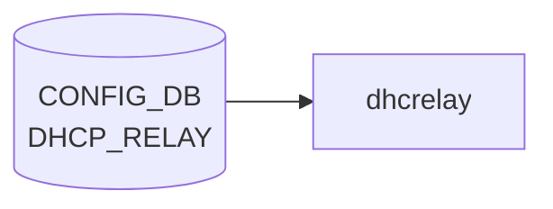

# DHCP_RELAY テーブル

## 概要

**DHCPv6 relay agent** の [VLAN](../../reference/glossary.md#term-vlan) インタフェース単位設定を保持する [CONFIG_DB](../../reference/glossary.md#term-config_db) テーブル[^1]。`dhcp6relay` プロセス (sonic-dhcp-relay リポ) が [CONFIG_DB](../../reference/glossary.md#term-config_db) から読み、IPv6 リレー対象 [VLAN](../../reference/glossary.md#term-vlan) と上流サーバを構築する。

> 注: 名前は単に `DHCP_RELAY` だが、[YANG](../../reference/glossary.md#term-yang) モジュール名 `sonic-dhcpv6-relay` の通り **IPv6 リレー専用**。IPv4 リレーは `VLAN` テーブルの `dhcp_servers` フィールド（旧仕様）または `DHCP_SERVER_IPV4` (新仕様の DHCP サーバ機能) を参照。

<!-- cdb-mermaid -->
### データフロー (自動生成)



!!! note "凡例"
    CONFIG_DB から SAI までの典型経路を `docs/reference/config-db-orch-map.md` から機械生成したミニ図。詳細・例外は本ページ本文と対応表を参照。
<!-- /cdb-mermaid -->

## key 構造

```text
DHCP_RELAY|<name>
```

- `<name>`: DHCPv6 リレー対象の [VLAN](../../reference/glossary.md#term-vlan) インタフェース名 (例: `Vlan100`)。[YANG](../../reference/glossary.md#term-yang) では `type string` だが、実運用上は VLAN 名を入れる。

## フィールド

| フィールド | 型 | 説明 |
|-----------|----|------|
| `name` (key) | string | DHCPv6 リレー対象の VLAN インタフェース名 |
| `dhcpv6_servers` | leaf-list of `inet:ipv6-address` (ordered-by user) | 上流 DHCPv6 サーバの IPv6 アドレス群 |
| `rfc6939_support` | string `"true"`/`"false"` | RFC 6939 (Client Link-Layer Address Option) サポート |
| `interface_id` | string `"true"`/`"false"` | リレーメッセージへの Interface-ID オプション挿入 (RFC 3315 / RFC 6422) |

`dhcpv6_servers` は `ordered-by user` で **設定順を維持** する。`dhcp6relay` は順序通りに upstream をスキャンする。

`rfc6939_support` / `interface_id` は [YANG](../../reference/glossary.md#term-yang) 上 `pattern "false|true"` の string 型（boolean ではない）。[CONFIG_DB](../../reference/glossary.md#term-config_db) の慣習で文字列リテラル。

> **注意 (YANG-実装 discrepancy)**: `dhcp6relay` daemon は YANG が定義する flat field キー名（`rfc6939_support` / `interface_id`）ではなく、`dhcpv6_option|rfc6939_support` / `dhcpv6_option|interface_id`（フィールド名にパイプ `|` を含む形式）を読む。YANG バリデーションを通過した設定が daemon に届かない silent drop が発生する可能性がある（`config_interface.cpp:169,172` / `mock_config.py` 参照）。

<!-- value-behavior -->
## 値依存挙動マトリクス

### `dhcpv6_servers` (leaf-list of ipv6-address, ordered-by user)

| 値 | 挙動 |
|----|------|
| 1 件以上 | dhcp6relay が VLAN ごとの upstream サーバとして登録。設定順（ordered-by user）を維持してスキャン |
| 0 件（空 leaf-list） | その VLAN のリレーは無効（config_interface.cpp: servers.empty() → skip） |

### `rfc6939_support` (string pattern "false|true")

| 値 | 挙動 |
|----|------|
| `"true"` (デフォルト) | dhcp6relay が RFC 6939 Client Link-Layer Address Option (option 79) をリレーメッセージに追加 |
| `"false"` | option 79 を付与しない（config_interface.cpp:169） |

### `interface_id` (string pattern "false|true")

| 値 | 挙動 |
|----|------|
| `"true"` | Interface-ID オプション (OPTION_INTERFACE_ID) をリレーメッセージに挿入（config_interface.cpp:172-173） |
| `"false"` / 未設定（非 DualToR） | Interface-ID なし（デフォルト off） |
| 未設定（DualToR 環境） | dual_tor_sock が存在する場合はデフォルト on（config_interface.cpp:118-122） |

<!-- /value-behavior -->

## 制約

- `name` キーは leafref ではないので任意の文字列が許されるが、対応する `VLAN` エントリが存在しなければ実環境では機能しない。
- `dhcpv6_servers` が空 (leaf-list 自体が無い) の場合、その VLAN のリレーは事実上無効。

## 購読者

- `dhcp6relay` (sonic-dhcp-relay リポ): CONFIG_DB → `dhcp6relay --config-file` 相当のランタイム反映
- `dhcpmon` (オプション): リレー監視・統計

## 関連 CONFIG_DB / YANG / CLI

- 関連 CONFIG_DB: `VLAN`, `VLAN_INTERFACE` (リレー対象 VLAN の IP)、`DHCP_SERVER_IPV4` (v4 側 in-band サーバ機能)
- 関連 CLI: `config dhcp_relay ipv6 destination add/remove`, `config dhcp_relay ipv6 helper`
- 関連 YANG: `sonic-dhcpv6-relay`

<!-- ref-triangle:start -->

## 関連リファレンス

- YANG: `sonic-dhcpv6-relay`
- CLI: [`config dhcp_relay`](../cli/config-dhcp-relay.md)

<!-- ref-triangle:end -->

## 引用元

[^1]: YANG 定義: `sonic-dhcpv6-relay.yang` (revision 2021-10-30). <https://github.com/sonic-net/sonic-buildimage/blob/9ea932ec2e18f35e58268ec2e4456b1d4afd65cd/src/sonic-yang-models/yang-models/sonic-dhcpv6-relay.yang>

<!-- ops-hint -->
## 運用ヒント

### 典型値

- key 形式: `DHCP_RELAY|<vlan>`。
- `dhcp_servers`: relay 先サーバ IP の list、`rfc3046_compatibility`: `true`。

### よくある誤設定

- dhcp_relay デーモンが対象 VLAN に SVI を持たないと relay されない。

### 確認コマンド

```bash
sonic-db-cli CONFIG_DB keys 'DHCP_RELAY|*'
show dhcprelay_helper ipv4
```
<!-- /ops-hint -->

<!-- cdb-exceptions -->
## 例外条件・特殊挙動

| consumer | 条件 | 挙動 |
|---|---|---|
| dhcp6relay | 登録 VLAN が VLAN_INTERFACE テーブルに存在しない | `LOG_WARNING: "%s doesn't exist in VLAN_INTERFACE table, skip it"` を出力してスキップ（config_interface.cpp:135） |
| dhcp6relay | VLAN に IPv6 アドレス未設定 | `LOG_WARNING: "%s doesn't have IPv6 address configured, skip it"` を出力してスキップ（config_interface.cpp:146） |
| dhcp6relay | VLAN にサーバアドレスが 0 件 | `LOG_WARNING: "No servers found for VLAN %s, skipping configuration."` を出力（config_interface.cpp:177） |
| dhcp6relay | `dhcpv6_option\|interface_id` 未設定 | 非 Dual-ToR 環境: `false`、Dual-ToR 環境: `true` をデフォルト使用（config_interface.cpp:117-121） |
| dhcp6relay | `dhcpv6_option\|rfc6939_support` 未設定 | `true`（Option 79 付与）をハードコードデフォルト使用（config_interface.cpp:117） |
| dhcp6relay | DHCP_RELAY 設定変更（起動後） | 動的変更は無視。"need restart container" ログのみ出力（config_interface.cpp:76-78） |
| dhcp6relay | YANG 経由の `rfc6939_support`/`interface_id` 書込み | daemon は `dhcpv6_option\|` prefix 付きキーを読むため YANG flat key 設定は silent drop |

> **Evidence**: sonic-dhcp-relay `dhcp6relay/src/config_interface.cpp:76-182`、`sonic-buildimage/dockers/docker-dhcp-relay/cli-plugin-tests/mock_config.py`
<!-- /cdb-exceptions -->


<!-- runtime-trace -->
## 実コンテナ動作トレース

### 段階 1 — Consumer 登録

`dhcrelay` Docker コンテナ / `dhcp_relay` サービス が CONFIG_DB の `DHCP_RELAY` テーブルを購読する。

`DHCP_RELAY` の key は `<vlan_intf>` (例: `Vlan1000`)。複数 server を `dhcp_servers` フィールドでリスト。

### 段階 2 — CFG→APPL 翻訳

なし (APPL_DB 中継なし)

### 段階 3 — APPL→SAI

なし (SAI 非経由 — Linux カーネルの L4 DHCP relay)

### 段階 4 — タイミングと副作用

**適用タイミング**: `dhcrelay` サービスが CONFIG_DB の `DHCP_RELAY` を読み込んで起動パラメータを決定。設定変更はサービス再起動が必要。

**副作用**: DHCP server アドレスの変更は relay 転送先を変更。サービス再起動中 DHCP relay が一時停止する。
<!-- /runtime-trace -->

<!-- defaults -->
## コード由来の暗黙デフォルト (Phase A)

> **調査根拠**: `sonic-dhcp-relay/dhcp6relay/src/config_interface.cpp` 全行精読 (2026-05-14)

### `rfc6939_support` — ハードコードデフォルト `true` + YANG-実装 discrepancy

| 状態 | 実行時挙動 |
|---|---|
| フィールド未設定 | RFC 6939 Option 79 を**有効**（ハードコード `option_79_default = true`、cpp:117） |
| フィールド = `"false"` | Option 79 無効（cpp:169 で明示 override） |
| フィールド = `"true"` | Option 79 有効（デフォルトと同じ） |

**YANG-実装 discrepancy**: YANG モデルは `rfc6939_support` を `DHCP_RELAY|<vlan>` の flat field として定義するが、C++ daemon は `dhcpv6_option|rfc6939_support`（フィールド名にパイプを含む Redis hash key）を読む（cpp:169）。YANG 経由で `rfc6939_support = "false"` を書き込んでも daemon は読まず **silent drop** — 常にハードコードデフォルト `true` で動作する。CLI テスト mock は `dhcpv6_option|rfc6939_support` 形式を使用（`mock_config.py` 参照）。

### `interface_id` — プラットフォーム依存デフォルト + YANG-実装 discrepancy

| 環境 | フィールド未設定時の挙動 |
|---|---|
| 非 DualToR | Interface-ID オプション**無効**（ハードコード `interface_id_default = false`、cpp:118） |
| DualToR (`dual_tor_sock` 存在) | Interface-ID オプション**有効**（cpp:121 で `true` に変更） |

**DualToR 判定**: `dhcpv6-relay.agents.j2:16` で `DEVICE_METADATA.localhost.subtype == "DualToR"` の場合に `-u Loopback0` オプションが付き `dual_tor_sock` が生成される。`interface_id` のデフォルトは **DEVICE_METADATA.subtype に間接依存**。

**YANG-実装 discrepancy**: `rfc6939_support` と同様、YANG の flat field `interface_id` ではなく `dhcpv6_option|interface_id` を daemon が読む（cpp:172）。YANG 経由の設定は **silent drop**。

### `dhcpv6_servers` — 空リスト時の silent skip

`dhcpv6_servers` が空または未設定の VLAN は vlans マップに登録されない（cpp:176-179）。ログ出力のみで relay は無効（エラーなし）。

### 動的変更の dead consumer

`dhcp6relay` 起動後に `DHCP_RELAY` を変更しても設定は反映されない（cpp:76-78: "need restart container to take effect"）。**コンテナ再起動が必要**。ライブ変更は complete dead consumer。

### minigraph / CLI による書込みフィールドの制限

`sonic-cfggen` (minigraph.py:1071-1078) および CLI plugin (`dhcp_relay.py`) は `dhcpv6_servers` のみ `DHCP_RELAY` に書き込み、`rfc6939_support` / `interface_id` は**書き込まない**。これらは daemon のハードコードデフォルト（`true` / 環境依存）が適用される。
<!-- /defaults -->

<!-- entry-points -->
## 書き込み入り口 (Direction A)

対象テーブル: `DHCP_RELAY`

### CLI
- `config interface dhcp-relay add/del <vlan> <server-ip>`
  - ソース: `sonic-utilities/config/vlan.py`

### minigraph / sonic-cfggen
- あり: `sonic-cfggen -m <minigraph.xml>` 実行時に本テーブルが生成・上書きされる。`dhcpv6_servers` のみ書き込まれ、`rfc6939_support` / `interface_id` は省略される（minigraph.py:1071-1078）

### REST / gNMI (sonic-mgmt-common)
- なし (対応 OpenConfig/SONiC YANG transformer なし)

### db_migrator
- なし

### ビルド時デフォルト (init_cfg / j2 テンプレート)
- なし

### ハードコードデフォルト
- `rfc6939_support` 未設定 → daemon 内部で `true`（Option 79 有効）
- `interface_id` 未設定 → 非 DualToR: `false`、DualToR: `true`

### ランタイム注入 (デーモン自動書き込み)
- なし
<!-- /entry-points -->

<!-- glossary-links-injected: 11715e560dc6 -->
