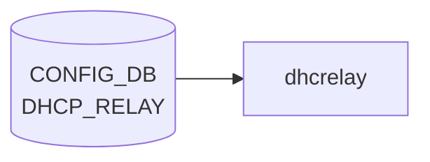

# DHCP_RELAY テーブル

## 概要

**DHCPv6 relay agent** の [VLAN](../../reference/glossary.md#term-vlan) インタフェース単位設定を保持する [CONFIG_DB](../../reference/glossary.md#term-config_db) テーブル[^1]。`dhcp6relay` プロセス (sonic-dhcp-relay リポ) が [CONFIG_DB](../../reference/glossary.md#term-config_db) から読み、IPv6 リレー対象 [VLAN](../../reference/glossary.md#term-vlan) と上流サーバを構築する。

> 注: 名前は単に `DHCP_RELAY` だが、[YANG](../../reference/glossary.md#term-yang) モジュール名 `sonic-dhcpv6-relay` の通り **IPv6 リレー専用**。IPv4 リレーは `VLAN` テーブルの `dhcp_servers` フィールド（旧仕様）または `DHCP_SERVER_IPV4` (新仕様の DHCP サーバ機能) を参照。

<!-- cdb-mermaid -->
### データフロー (自動生成)



!!! note "凡例"
    CONFIG_DB から SAI までの典型経路を `docs/reference/config-db-orch-map.md` から機械生成したミニ図。詳細・例外は本ページ本文と対応表を参照。
<!-- /cdb-mermaid -->

## key 構造

```text
DHCP_RELAY|<name>
```

- `<name>`: DHCPv6 リレー対象の [VLAN](../../reference/glossary.md#term-vlan) インタフェース名 (例: `Vlan100`)。[YANG](../../reference/glossary.md#term-yang) では `type string` だが、実運用上は VLAN 名を入れる。

## フィールド

| フィールド | 型 | 説明 |
|-----------|----|------|
| `name` (key) | string | DHCPv6 リレー対象の VLAN インタフェース名 |
| `dhcpv6_servers` | leaf-list of `inet:ipv6-address` (ordered-by user) | 上流 DHCPv6 サーバの IPv6 アドレス群 |
| `rfc6939_support` | string `"true"`/`"false"` | RFC 6939 (Client Link-Layer Address Option) サポート |
| `interface_id` | string `"true"`/`"false"` | リレーメッセージへの Interface-ID オプション挿入 (RFC 3315 / RFC 6422) |

`dhcpv6_servers` は `ordered-by user` で **設定順を維持** する。`dhcp6relay` は順序通りに upstream をスキャンする。

`rfc6939_support` / `interface_id` は [YANG](../../reference/glossary.md#term-yang) 上 `pattern "false|true"` の string 型（boolean ではない）。[CONFIG_DB](../../reference/glossary.md#term-config_db) の慣習で文字列リテラル。

## 制約

- `name` キーは leafref ではないので任意の文字列が許されるが、対応する `VLAN` エントリが存在しなければ実環境では機能しない。
- `dhcpv6_servers` が空 (leaf-list 自体が無い) の場合、その VLAN のリレーは事実上無効。

## 購読者

- `dhcp6relay` (sonic-dhcp-relay リポ): CONFIG_DB → `dhcp6relay --config-file` 相当のランタイム反映
- `dhcpmon` (オプション): リレー監視・統計

## 関連 CONFIG_DB / YANG / CLI

- 関連 CONFIG_DB: `VLAN`, `VLAN_INTERFACE` (リレー対象 VLAN の IP)、`DHCP_SERVER_IPV4` (v4 側 in-band サーバ機能)
- 関連 CLI: `config dhcp_relay ipv6 destination add/remove`, `config dhcp_relay ipv6 helper`
- 関連 YANG: `sonic-dhcpv6-relay`

<!-- ref-triangle:start -->

## 関連リファレンス

- YANG: `sonic-dhcpv6-relay`
- CLI: [`config dhcp_relay`](../cli/config-dhcp-relay.md)

<!-- ref-triangle:end -->

## 引用元

[^1]: YANG 定義: `sonic-dhcpv6-relay.yang` (revision 2021-10-30). <https://github.com/sonic-net/sonic-buildimage/blob/9ea932ec2e18f35e58268ec2e4456b1d4afd65cd/src/sonic-yang-models/yang-models/sonic-dhcpv6-relay.yang>

<!-- ops-hint -->
## 運用ヒント

### 典型値

- key 形式: `DHCP_RELAY|<vlan>`。
- `dhcp_servers`: relay 先サーバ IP の list、`rfc3046_compatibility`: `true`。

### よくある誤設定

- dhcp_relay デーモンが対象 VLAN に SVI を持たないと relay されない。

### 確認コマンド

```bash
sonic-db-cli CONFIG_DB keys 'DHCP_RELAY|*'
show dhcprelay_helper ipv4
```
<!-- /ops-hint -->

<!-- cdb-exceptions -->
## 例外条件・特殊挙動

| consumer | 条件 | 挙動 |
|---|---|---|
| dhcp6relay | 登録 VLAN が VLAN_INTERFACE テーブルに存在しない | `LOG_WARNING: "%s doesn't exist in VLAN_INTERFACE table, skip it"` を出力してスキップ（config_interface.cpp:135） |
| dhcp6relay | VLAN に IPv6 アドレス未設定 | `LOG_WARNING: "%s doesn't have IPv6 address configured, skip it"` を出力してスキップ（config_interface.cpp:146） |
| dhcp6relay | VLAN にサーバアドレスが 0 件 | `LOG_WARNING: "No servers found for VLAN %s, skipping configuration."` を出力（config_interface.cpp:177） |
| dhcp6relay | `dhcpv6_option\|interface_id` フィールド未設定 | 非 Dual-ToR 環境では `false`、Dual-ToR 環境では `true` をデフォルト使用（config_interface.cpp:117-121） |

> **Evidence**: sonic-dhcp-relay `dhcp6relay/src/config_interface.cpp:117-177`
<!-- /cdb-exceptions -->

<!-- glossary-links-injected: 11715e560dc6 -->
