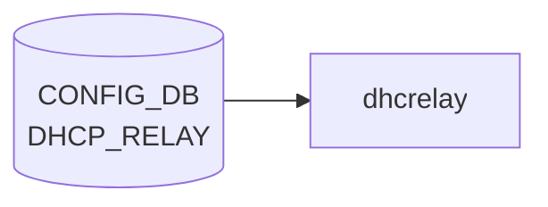

# DHCP_RELAY テーブル

## 概要

**DHCPv6 relay agent** の [VLAN](../../reference/glossary.md#term-vlan) インタフェース単位設定を保持する [CONFIG_DB](../../reference/glossary.md#term-config_db) テーブル[^1]。`dhcp6relay` プロセス (sonic-dhcp-relay リポ) が [CONFIG_DB](../../reference/glossary.md#term-config_db) から読み、IPv6 リレー対象 [VLAN](../../reference/glossary.md#term-vlan) と上流サーバを構築する。

> 注: 名前は単に `DHCP_RELAY` だが、[YANG](../../reference/glossary.md#term-yang) モジュール名 `sonic-dhcpv6-relay` の通り **IPv6 リレー専用**。IPv4 リレーは `VLAN` テーブルの `dhcp_servers` フィールド（旧仕様）または `DHCP_SERVER_IPV4` (新仕様の DHCP サーバ機能) を参照。

<!-- cdb-mermaid -->
### データフロー (自動生成)



!!! note "凡例"
    CONFIG_DB から SAI までの典型経路を `docs/reference/config-db-orch-map.md` から機械生成したミニ図。詳細・例外は本ページ本文と対応表を参照。
<!-- /cdb-mermaid -->

## key 構造

```text
DHCP_RELAY|<name>
```

- `<name>`: DHCPv6 リレー対象の [VLAN](../../reference/glossary.md#term-vlan) インタフェース名 (例: `Vlan100`)。[YANG](../../reference/glossary.md#term-yang) では `type string` だが、実運用上は VLAN 名を入れる。

## フィールド

| フィールド | 型 | 説明 |
|-----------|----|------|
| `name` (key) | string | DHCPv6 リレー対象の VLAN インタフェース名 |
| `dhcpv6_servers` | leaf-list of `inet:ipv6-address` (ordered-by user) | 上流 DHCPv6 サーバの IPv6 アドレス群 |
| `rfc6939_support` | string `"true"`/`"false"` | RFC 6939 (Client Link-Layer Address Option) サポート |
| `interface_id` | string `"true"`/`"false"` | リレーメッセージへの Interface-ID オプション挿入 (RFC 3315 / RFC 6422) |

`dhcpv6_servers` は `ordered-by user` で **設定順を維持** する。`dhcp6relay` は順序通りに upstream をスキャンする。

`rfc6939_support` / `interface_id` は [YANG](../../reference/glossary.md#term-yang) 上 `pattern "false|true"` の string 型（boolean ではない）。[CONFIG_DB](../../reference/glossary.md#term-config_db) の慣習で文字列リテラル。

<!-- value-behavior -->
## 値依存挙動マトリクス

### `dhcpv6_servers` (leaf-list of ipv6-address, ordered-by user)

| 値 | 挙動 |
|----|------|
| 1 件以上 | dhcp6relay が VLAN ごとの upstream サーバとして登録。設定順（ordered-by user）を維持してスキャン |
| 0 件（空 leaf-list） | その VLAN のリレーは無効（config_interface.cpp: servers.empty() → skip） |

### `rfc6939_support` (string pattern "false|true")

| 値 | 挙動 |
|----|------|
| `"true"` (デフォルト) | dhcp6relay が RFC 6939 Client Link-Layer Address Option (option 79) をリレーメッセージに追加 |
| `"false"` | option 79 を付与しない（config_interface.cpp:169） |

### `interface_id` (string pattern "false|true")

| 値 | 挙動 |
|----|------|
| `"true"` | Interface-ID オプション (OPTION_INTERFACE_ID) をリレーメッセージに挿入（config_interface.cpp:172-173） |
| `"false"` / 未設定（非 DualToR） | Interface-ID なし（デフォルト off） |
| 未設定（DualToR 環境） | dual_tor_sock が存在する場合はデフォルト on（config_interface.cpp:118-122） |

<!-- /value-behavior -->

## 制約

- `name` キーは leafref ではないので任意の文字列が許されるが、対応する `VLAN` エントリが存在しなければ実環境では機能しない。
- `dhcpv6_servers` が空 (leaf-list 自体が無い) の場合、その VLAN のリレーは事実上無効。

## 購読者

- `dhcp6relay` (sonic-dhcp-relay リポ): CONFIG_DB → `dhcp6relay --config-file` 相当のランタイム反映
- `dhcpmon` (オプション): リレー監視・統計

## 関連 CONFIG_DB / YANG / CLI

- 関連 CONFIG_DB: `VLAN`, `VLAN_INTERFACE` (リレー対象 VLAN の IP)、`DHCP_SERVER_IPV4` (v4 側 in-band サーバ機能)
- 関連 CLI: `config dhcp_relay ipv6 destination add/remove`, `config dhcp_relay ipv6 helper`
- 関連 YANG: `sonic-dhcpv6-relay`

<!-- ref-triangle:start -->

## 関連リファレンス

- YANG: `sonic-dhcpv6-relay`
- CLI: [`config dhcp_relay`](../cli/config-dhcp-relay.md)

<!-- ref-triangle:end -->

## 引用元

[^1]: YANG 定義: `sonic-dhcpv6-relay.yang` (revision 2021-10-30). <https://github.com/sonic-net/sonic-buildimage/blob/9ea932ec2e18f35e58268ec2e4456b1d4afd65cd/src/sonic-yang-models/yang-models/sonic-dhcpv6-relay.yang>

<!-- ops-hint -->
## 運用ヒント

### 典型値

- key 形式: `DHCP_RELAY|<vlan>`。
- `dhcp_servers`: relay 先サーバ IP の list、`rfc3046_compatibility`: `true`。

### よくある誤設定

- dhcp_relay デーモンが対象 VLAN に SVI を持たないと relay されない。

### 確認コマンド

```bash
sonic-db-cli CONFIG_DB keys 'DHCP_RELAY|*'
show dhcprelay_helper ipv4
```
<!-- /ops-hint -->

<!-- cdb-exceptions -->
## 例外条件・特殊挙動

| consumer | 条件 | 挙動 |
|---|---|---|
| dhcp6relay | 登録 VLAN が VLAN_INTERFACE テーブルに存在しない | `LOG_WARNING: "%s doesn't exist in VLAN_INTERFACE table, skip it"` を出力してスキップ（config_interface.cpp:135） |
| dhcp6relay | VLAN に IPv6 アドレス未設定 | `LOG_WARNING: "%s doesn't have IPv6 address configured, skip it"` を出力してスキップ（config_interface.cpp:146） |
| dhcp6relay | VLAN にサーバアドレスが 0 件 | `LOG_WARNING: "No servers found for VLAN %s, skipping configuration."` を出力（config_interface.cpp:177） |
| dhcp6relay | `dhcpv6_option\|interface_id` フィールド未設定 | 非 Dual-ToR 環境では `false`、Dual-ToR 環境では `true` をデフォルト使用（config_interface.cpp:117-121） |

> **Evidence**: sonic-dhcp-relay `dhcp6relay/src/config_interface.cpp:117-177`
<!-- /cdb-exceptions -->


<!-- runtime-trace -->
## 実コンテナ動作トレース

### 段階 1 — Consumer 登録

`dhcrelay` Docker コンテナ / `dhcp_relay` サービス が CONFIG_DB の `DHCP_RELAY` テーブルを購読する。

`DHCP_RELAY` の key は `<vlan_intf>` (例: `Vlan1000`)。複数 server を `dhcp_servers` フィールドでリスト。

### 段階 2 — CFG→APPL 翻訳

なし (APPL_DB 中継なし)

### 段階 3 — APPL→SAI

なし (SAI 非経由 — Linux カーネルの L4 DHCP relay)

### 段階 4 — タイミングと副作用

**適用タイミング**: `dhcrelay` サービスが CONFIG_DB の `DHCP_RELAY` を読み込んで起動パラメータを決定。設定変更はサービス再起動が必要。

**副作用**: DHCP server アドレスの変更は relay 転送先を変更。サービス再起動中 DHCP relay が一時停止する。
<!-- /runtime-trace -->

<!-- entry-points -->
## 書き込み入り口 (Direction A)

対象テーブル: `DHCP_RELAY`

### CLI
- `config interface dhcp-relay add/del <vlan> <server-ip>`
  - ソース: `sonic-utilities/config/vlan.py`

### minigraph / sonic-cfggen
- あり: `sonic-cfggen -m <minigraph.xml>` 実行時に本テーブルが生成・上書きされる

### REST / gNMI (sonic-mgmt-common)
- なし (対応 OpenConfig/SONiC YANG transformer なし)

### db_migrator
- なし

### ビルド時デフォルト (init_cfg / j2 テンプレート)
- なし

### ハードコードデフォルト
- なし

### ランタイム注入 (デーモン自動書き込み)
- なし
<!-- /entry-points -->

<!-- side-effects -->
## 副次 DB 書込・プロセス制御 (Phase F)

> **調査根拠**: `sonic-buildimage/src/sonic-dhcp-utilities/dhcp_utilities/dhcprelayd/dhcprelayd.py` 全行精読、`docker_init.sh`、`start.sh` 参照 (2026-05-16)

`dhcprelayd` は `DHCP_RELAY` テーブルを直接購読しないが、DHCP サーバ機能（`DHCP_SERVER_IPV4` / `FEATURE`）の有効・無効に応じて `dhcrelay` プロセスと supervisord を制御する。**STATE_DB への書き込みは行わない**（読み取り専用）。

### STATE_DB 読み取り（書き込みなし）

`_get_dhcp_server_ip()` が STATE_DB の `DHCP_SERVER_IPV4_SERVER_IP|eth0` から `ip` フィールドを読み取る。10 回リトライし、失敗すると `sys.exit(1)` （`dhcprelayd.py:376-384`）。STATE_DB への書き込みは `dhcpservd` が担当する。

### dhcrelay プロセス制御（subprocess 副作用）

`refresh_dhcrelay()` → `_start_dhcrelay_process()` が `/usr/sbin/dhcrelay` を `subprocess.Popen` で起動する。

| 条件 | 動作 |
|------|------|
| `DHCP_SERVER_IPV4[intf]['state'] == 'enabled'` かつ VLAN 存在 かつ `DEVICE_METADATA.has_sonic_dhcpv4_relay == 'False'` | dhcrelay を 1 プロセス起動（対象 VLAN を `-id` で列挙、`-iu docker0 <dhcp_server_ip>`） |
| `force_kill=True`（VLAN_INTERFACE 変更時） | 既存 dhcrelay を強制終了後に再起動 |
| 既存 dhcrelay の `-id` セットが新セットと同一 かつ `force_kill=False` | 再起動なし（`NOT_KILLED`） |
| `new_dhcp_interfaces` が空 | dhcrelay 停止のみ |

`dhcpmon` プロセス制御のコードも存在するが、現状はコメントアウト（`dhcprelayd.py:115-116`）。

### supervisord プログラム制御

`dhcp_server` feature の有効/無効遷移時に `supervisorctl stop/start` で supervisord 管理下のプログラムを制御する（`dhcprelayd.py:209-225`）。

| 遷移 | supervisorctl 操作 |
|------|--------------------|
| `disabled → enabled` | `supervisorctl stop <isc-dhcpv4-relay-*>` / `<dhcpmon-*>` |
| `enabled → disabled` | `supervisorctl start <isc-dhcpv4-relay-*>` / `<dhcpmon-*>` |

### supervisord 設定ファイル（コンテナ起動時に生成）

`dhcprelayd` 自体はファイルを書き込まない。コンテナ起動時に `docker_init.sh` が `sonic-cfggen` + `docker-dhcp-relay.supervisord.conf.j2` テンプレートから `/etc/supervisor/conf.d/docker-dhcp-relay.supervisord.conf` を生成する。テンプレートは `DHCP_RELAY` / `VLAN` / `DEVICE_METADATA` を参照し、各 VLAN の dhcrelay / dhcp6relay / dhcpmon プログラムエントリを生成する。

### COUNTERS_DB クリア（コンテナ起動時）

`start.sh` がコンテナ起動時に `COUNTERS_DB` の `DHCPV4_COUNTER_TABLE:*` キーを全削除する。`dhcprelayd` はカウンタ操作を行わない。

### 副次書込なし

| DB | 理由 |
|----|------|
| STATE_DB | dhcprelayd は読み取りのみ。書き込みは dhcpservd が担当 |
| APPL_DB | 書き込みなし |
| ASIC_DB / SAI | dhcrelay は L4 UDP relay。SAI/ASIC 非経由 |

> **Evidence**: `dhcprelayd.py:110-116, 209-225, 264-288, 290-315, 343-373, 376-384`、`docker_init.sh:12`、`start.sh:6-9`
<!-- /side-effects -->

<!-- glossary-links-injected: 11715e560dc6 -->
