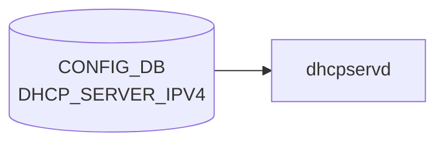

# DHCP_SERVER_IPV4 テーブル

## 概要

組み込み DHCPv4 サーバ機能の [VLAN](../../reference/glossary.md#term-vlan)/IF 単位設定を保持する[^1]。`dhcpservd`（`sonic-dhcp-server` パッケージ）が `kea-dhcp4` の設定を生成、起動する。`DEVICE_METADATA.localhost.dhcp_server` で全体有効化が制御される。

<!-- cdb-mermaid -->
### データフロー (自動生成)



!!! note "凡例"
    CONFIG_DB から SAI までの典型経路を `docs/reference/config-db-orch-map.md` から機械生成したミニ図。詳細・例外は本ページ本文と対応表を参照。
<!-- /cdb-mermaid -->

## key 構造

```text
DHCP_SERVER_IPV4|<name>
```

`<name>` は [VLAN](../../reference/glossary.md#term-vlan) 名 (`Vlan<id>`) または [SmartSwitch](../../reference/glossary.md#term-smartswitch) の bridge 参照 (`MID_PLANE_BRIDGE.GLOBAL.bridge`) の union。

## フィールド一覧

| フィールド | 型 | 必須 | 説明 |
|-----------|----|------|------|
| `name` (key) | string `Vlan<id>` または bridge 名 | ✅ | DHCP 提供 IF |
| `gateway` | ipv4-address | - | クライアントへ通知するゲートウェイ |
| `lease_time` | uint32 (1..2^32-1) | ✅ | リース時間 [秒] |
| `mode` | enum `PORT` | ✅ | IP 割当モード |
| `netmask` | ipv4-address-no-zone | ✅ | サブネットマスク |
| `customized_options` | leaf-list leafref `DHCP_SERVER_IPV4_CUSTOMIZED_OPTIONS.name` | - | カスタムオプション参照リスト |
| `state` | `admin_mode` (`enabled`/`disabled`) | ✅ | サーバ有効化 |

## 関連サブテーブル

- `DHCP_SERVER_IPV4_CUSTOMIZED_OPTIONS|<name>`: option ID / type / value のテンプレ
- `DHCP_SERVER_IPV4_PORT|<vlan>|<port>`: ポート単位の IP プール
- `DHCP_SERVER_IPV4_RANGE|<name>`: アドレスレンジ
- `DHCP_SERVER_IPV4_IP|<vlan>|<port>`: 静的予約

詳細は [YANG](../../reference/glossary.md#term-yang) モジュール `sonic-dhcp-server-ipv4` を直参照。

<!-- value-behavior -->
## 値依存挙動マトリクス

### `state` (admin_mode: enabled/disabled)

| 値 | 挙動 |
|----|------|
| `enabled` | dhcpservd が kea-dhcp4 サーバを起動し DHCP DISCOVER に応答 |
| `disabled` | kea-dhcp4 を停止。クライアントへの応答なし |

### `mode` (enum: PORT)

| 値 | 挙動 |
|----|------|
| `PORT` | ポート単位で IP を割り当て（DHCP_SERVER_IPV4_PORT テーブルで定義）。現在は PORT のみサポート |
| その他 | YANG enum 違反で reject |

### `lease_time` (uint32, 必須)

| 値 | 挙動 |
|----|------|
| 1 以上 | kea-dhcp4 のリース有効期間（秒）として設定 |
| 0 | YANG range 違反（1 以上必須）で reject |

### `customized_options` (leaf-list leafref)

| 値 | 挙動 |
|----|------|
| 存在する DHCP_SERVER_IPV4_CUSTOMIZED_OPTIONS.name | kea-dhcp4 設定にカスタムオプションを追加 |
| 存在しない option 名 | YANG leafref 違反で reject |

> DEVICE_METADATA.dhcp_server が未設定の場合、dhcpservd 自体が起動しないため state の設定は無効。

<!-- /value-behavior -->

## 購読者

- `dhcpservd` (`sonic-dhcp-server` 内)
- `dhcprelayd` （`DHCP_RELAY` 側と排他関係）

## 関連 CONFIG_DB / YANG / CLI

- 関連 [CONFIG_DB](../../reference/glossary.md#term-config_db): `VLAN`、`VLAN_INTERFACE`、`DEVICE_METADATA` (`dhcp_server`)、`DHCP_RELAY` 系
- 関連 CLI: `config dhcp_server ipv4 add/del/range/port`
- 関連 [YANG](../../reference/glossary.md#term-yang): `sonic-dhcp-server-ipv4`

<!-- ref-triangle:start -->

## 関連リファレンス

- [YANG](../../reference/glossary.md#term-yang): [`sonic-dhcp-server-ipv4`](../yang/sonic-dhcp-server.md)
- CLI: `config dhcp_server`

<!-- ref-triangle:end -->

## 引用元

[^1]: YANG 定義: `sonic-dhcp-server-ipv4.yang`. <https://github.com/sonic-net/sonic-buildimage/blob/9ea932ec2e18f35e58268ec2e4456b1d4afd65cd/src/sonic-yang-models/yang-models/sonic-dhcp-server-ipv4.yang>

<!-- topics-back-ref -->
## 関連 Topics

- [Topics: NAT / DHCP Relay / Time-DNS Services](../../topics/16-nat-dhcp-dns/index.md)

<!-- /topics-back-ref -->

<!-- ops-hint -->
## 運用ヒント

### 典型値

- key 形式: `DHCP_SERVER_IPV4|<name>`。
- `state`: `enabled`、`gateway`: subnet GW、`lease_time`: `3600`、`mode`: `PORT`。

### よくある誤設定

- [VLAN](../../reference/glossary.md#term-vlan) に紐付けず DHCP_SERVER_IPV4_PORT エントリも無いと DISCOVER が応答されない。

### 確認コマンド

```bash
sonic-db-cli CONFIG_DB keys 'DHCP_SERVER_IPV4|*'
show dhcp_server ipv4 info
```
<!-- /ops-hint -->

<!-- cdb-exceptions -->
## 例外条件・特殊挙動

| consumer | 条件 | 挙動 |
|---|---|---|
| dhcp_cfggen | standard option の `type` が期待型と不一致 | `LOG_WARNING` を出力して**期待型を優先**して処理継続（dhcp_cfggen.py:133-137） |
| dhcp_cfggen | `type` が `SUPPORT_DHCP_OPTION_TYPE` 外 | `LOG_ERR` を出力してそのオプションエントリをスキップ、他は継続（dhcp_cfggen.py:140-143） |
| dhcp_cfggen | `validate_str_type(option_type, value)` 失敗 | `LOG_ERR` を出力してそのオプションをスキップ（dhcp_cfggen.py:144-147） |
| dhcp_cfggen | `type=string` かつ `value` が 253 文字超 | `LOG_ERR` を出力してそのオプションをスキップ（dhcp_cfggen.py:148-150） |
| dhcp_cfggen | `ips` と `ranges` の両方を同時指定 | `LOG_WARNING: "...contains both ips and ranges, skip"` を出力してそのポートをスキップ（dhcp_cfggen.py:418-421） |
| dhcp_cfggen | `ranges` で指定した range 名が DHCP_SERVER_IPV4_RANGE に存在しない | `LOG_WARNING: "Range %s is not in range table, skip"` を出力してその range をスキップ（dhcp_cfggen.py:452-454） |
| dhcprelayd | `state=enabled` でも VLAN が VLAN テーブルに存在しない | dhcrelay の起動対象から除外（dhcprelayd.py:97-98） |

> **Evidence**: [sonic-buildimage](../../reference/glossary.md#term-sonic-buildimage) `src/sonic-dhcp-utilities/dhcp_utilities/dhcpservd/dhcp_cfggen.py:133-454`; `dhcp_utilities/dhcprelayd/dhcprelayd.py:94-98`
<!-- /cdb-exceptions -->


<!-- runtime-trace -->
## 実コンテナ動作トレース

### 段階 1 — Consumer 登録

`dhcpservd` (`sonic-dhcp-server`) が CONFIG_DB の `DHCP_SERVER_IPV4` テーブルを購読する。

`DHCP_SERVER_IPV4` は SONiC 独自の DHCP server 機能 (sonic-dhcp-server)。

### 段階 2 — CFG→APPL 翻訳

なし (APPL_DB 中継なし)

### 段階 3 — APPL→SAI

なし (SAI 非経由 — Linux カーネルの DHCP サーバ機能)

### 段階 4 — タイミングと副作用

**適用タイミング**: `dhcpservd` が CONFIG_DB の `DHCP_SERVER_IPV4` を購読。変化検知後 DHCP server 設定を更新。新規設定は次回 DHCP discover から有効。

**副作用**: subnet / pool 変更は新規 DHCP リクエストから適用。既存 lease には影響しない (lease 期限まで)。
<!-- /runtime-trace -->

<!-- entry-points -->
## 書き込み入り口 (Direction A)

対象テーブル: `DHCP_SERVER_IPV4`

### CLI
- `config dhcp-server ipv4 add/del <gateway>`
- `config dhcp-server ipv4 enable/disable <gateway>`
  - ソース: `sonic-utilities/config/main.py (dhcp-server グループ)`

### minigraph / sonic-cfggen
- なし

### REST / gNMI (sonic-mgmt-common)
- なし (対応 OpenConfig/SONiC YANG transformer なし)

### db_migrator
- なし

### ビルド時デフォルト (init_cfg / j2 テンプレート)
- なし

### ハードコードデフォルト
- なし

### ランタイム注入 (デーモン自動書き込み)
- なし
<!-- /entry-points -->

<!-- pubsub -->
## 通信メカニズム (Redis PUBSUB / keyspace notification)

> **調査根拠**: `dhcp_utilities/common/dhcp_db_monitor.py` + `dhcp_utilities/dhcpservd/dhcpservd.py` 全行精読、`sonic-swss-common/common/subscriberstatetable.cpp` 参照 (2026-05-15)  
> 詳細証跡: `meta/_intermediate/cdb-flow/dhcp-server-ipv4-pubsub.md`

### 購読方式

`dhcpservd` は `swss::SubscriberStateTable` を通じて CONFIG_DB の複数テーブルを購読する。`dhcp_db_monitor.py` が各テーブルに対応する `ConfigDbEventChecker` サブクラスを定義し、`DhcpServdDbMonitor` が `swsscommon.Select`（5000 ms タイムアウト）で束ねる。ConsumerStateTable / NotificationConsumer / ProducerStateTable は使用しない。APPL_DB 中継もなく、kea-dhcp4.conf ファイル経由で設定を反映する。

### 購読テーブルと発火条件

| チェッカークラス | 購読テーブル | 発火条件 |
|---|---|---|
| `DhcpServerTableCfgChangeEventChecker` | `DHCP_SERVER_IPV4` | enabled IF への変更、または `state=enabled` への遷移 |
| `DhcpPortTableEventChecker` | `DHCP_SERVER_IPV4_PORT` | vlan 部分が enabled_dhcp_interfaces に含まれる |
| `DhcpOptionTableEventChecker` | `DHCP_SERVER_IPV4_CUSTOMIZED_OPTIONS` | option 名が used_options に含まれる |
| `DhcpRangeTableEventChecker` | `DHCP_SERVER_IPV4_RANGE` | range 名が used_range に含まれる |
| `VlanTableEventChecker` | `VLAN` | key が enabled_dhcp_interfaces に含まれる |
| `VlanIntfTableEventChecker` | `VLAN_INTERFACE` | vlan 部分が enabled かつ IPv4 変更 |
| `VlanMemberTableEventChecker` | `VLAN_MEMBER` | vlan 部分が enabled_dhcp_interfaces に含まれる |
| `MidPlaneTableEventChecker` | `MID_PLANE_BRIDGE` | DEL、または bridge フィールドが enabled IF |
| `DpusTableEventChecker` | `DPUS` | 常に発火（SmartSwitch DPU 変更） |

チェッカーは `dump_dhcp4_config()` が返す `enable_checker` set に応じて動的に enable/disable される。使われていない range/option を無駄に購読しない設計。

### 通信シーケンス

```
dhcpservd 起動
  └─ DhcpDbConnector(redis_sock="/var/run/redis/redis.sock")
       ├─ config_db = DBConnector("CONFIG_DB", 0)   ← Redis DB #4
       └─ state_db  = DBConnector("STATE_DB", 0)    ← SERVER_IP 書き込み用
  └─ sel = swsscommon.Select()
  └─ DhcpServdDbMonitor(sel, checkers, select_timeout=5000)
  └─ DhcpServd.start()
       └─ dump_dhcp4_config()            ← 起動時全量生成
            └─ dhcp_cfg_generator.generate()
                 → enabled_dhcp_interfaces, used_ranges, used_options, enable_checker
            └─ monitor.enable_checkers(enable_checker)
                 └─ SubscriberStateTable(config_db, table_name)
                      └─ PSUBSCRIBE __keyspace@4__:<table_name>|*
            └─ write /etc/kea/kea-dhcp4.conf
            └─ _notify_kea_dhcp4_proc() → SIGHUP → kea-dhcp4 設定再読込
       └─ _update_dhcp_server_ip()      ← STATE_DB DHCP_SERVER_IPV4_SERVER_IP|eth0 更新
       └─ _signal_readiness()           ← /tmp/dhcpservd_ready に PID 書き込み
  └─ DhcpServd.wait()                  ← メインループ
       └─ sel.select(5000 ms)
            ├─ TIMEOUT → ループ継続
            └─ OBJECT  → check_update_event(db_snapshot)
                 → need_refresh=True → dump_dhcp4_config() (全量再生成 + SIGHUP)
```

### keyspace notification 詳細

| 項目 | 値 |
|------|-----|
| PSUBSCRIBE パターン (例) | `__keyspace@4__:DHCP_SERVER_IPV4\|*` |
| notify-keyspace-events | `KEA` (K=keyspace, E=keyevent, A=all commands) |
| Select timeout | 5000 ms |
| 起動時スナップショット | なし — `generate()` で CONFIG_DB を live 読み取り |
| 実行時変更反映 | need_refresh=True → `dump_dhcp4_config()` 全量再生成 + SIGHUP |
| STATE_DB 書き込み | `DHCP_SERVER_IPV4_SERVER_IP\|eth0` に eth0 IPv4 (起動時 1 回) |

### 反映タイミング

CONFIG_DB 書込み → `SubscriberStateTable` が keyspace event 受信 → `check_update_event()` が need_refresh 判定 → `dump_dhcp4_config()` 全量再生成 → `/etc/kea/kea-dhcp4.conf` 上書き → SIGHUP → kea-dhcp4 設定再読込。Select timeout (5000 ms) 以内に反映される。1 変更につき 1 回の SIGHUP が発生する。

<!-- /pubsub -->

<!-- defaults -->
## コード由来の暗黙デフォルト・Fallback

### `lease_time` — CLI デフォルト 900 秒 + 実行時 fallback

`config dhcp_server ipv4 add` の `--lease_time` オプションは省略時 `"900"` を DB に書き込む（`dhcp_server.py:70`）。さらに dhcpservd の設定生成時にも `dhcp_config.get("lease_time", DEFAULT_LEASE_TIME)` で `DEFAULT_LEASE_TIME = 900` へフォールバックする（`dhcp_cfggen.py:255, :25`）。YANG は `mandatory true` だが実装は absent でも動作継続する（YANG-実装 discrepancy）。

### `state` — CLI 書込み時は常に `disabled`

`add` コマンドは必ず `"state": "disabled"` を書き込む（`dhcp_server.py:105`）。`enable` サブコマンドを実行するまで dhcpservd はそのインタフェースを silent skip する（`dhcp_cfggen.py:199`）。`state` フィールドが DB に存在しない場合も `enabled` 以外として扱われ skip される。

### `gateway` — absent 時は silent omission

`gateway` が DB に存在しない場合、kea-dhcp4 設定の `routers` オプションが生成されない（`dhcp_cfggen.py:258-259`）。クライアントへのデフォルトゲートウェイ通知が行われない。`--dup_gw_nm` フラグで VLAN_INTERFACE の IPv4 アドレスから自動コピー可能（`dhcp_server.py:86-91`）。

### `netmask` — kea 設定生成では参照されない (dead field 相当)

YANG は `mandatory true` だが、dhcp_cfggen が kea-dhcp4 の subnet を計算する際は VLAN_INTERFACE の ip_prefix を `ipaddress.ip_network()` で変換して使用する。`netmask` フィールドの値は kea 設定生成で直接参照されない（YANG-実装 discrepancy）。CLI での入力検証用として機能する。

### `customized_options.always_send` — DB absent 時は `true`

`DHCP_SERVER_IPV4_CUSTOMIZED_OPTIONS` の `always_send` フィールドは YANG default `true`（`sonic-dhcp-server-ipv4.yang:168`）、dhcp_cfggen でも `config.get("always_send", "true")` でフォールバック（`dhcp_cfggen.py:151`）。

### dhcp_server_id (option 54) の自動注入

`customized_options` に option ID `"54"` が含まれない場合、dhcp_cfggen は VLAN_INTERFACE の IPv4 アドレスを `always_send=true` で dhcp_server_id オプションとして自動注入する（`dhcp_cfggen.py:245-249`）。ユーザー定義で上書き可能。

### SmartSwitch 時の subnet ID ハードコード

SmartSwitch 環境では kea-dhcp4 の subnet ID が `MID_PLANE_BRIDGE_SUBNET_ID = 10000` に固定される（`dhcp_cfggen.py:251, :19`）。通常 VLAN では VLAN 番号を整数変換して使用。

### 書込み順依存 (CLI add → enable)

`add` 時点で `state=disabled` が書き込まれるため、`enable` コマンドを実行しないと dhcpservd は設定を無効とみなす。ORDER-SENSITIVE。

> **Evidence**: `src/sonic-dhcp-utilities/dhcp_utilities/dhcpservd/dhcp_cfggen.py:19,25,151,199,245-249,251,255,258-259`; `dockers/docker-dhcp-server/cli/config/plugins/dhcp_server.py:70,86-91,105`; `src/sonic-yang-models/yang-models/sonic-dhcp-server-ipv4.yang:168`
<!-- /defaults -->

<!-- ordering -->
## 書込み順依存 (Phase B)

### 他テーブル先行必須

| 先行テーブル | 理由 | 違反時の挙動 |
|---|---|---|
| `VLAN` / `VLAN_INTERFACE|<name>|<ipv4_prefix>` | `dhcp_cfggen.generate()` が VLAN_INTERFACE から IPv4 サブネットを取得してから DHCP 設定を生成。未設定だと `_parse_port()` でそのインタフェースをスキップ | kea-dhcp4 起動するが VLAN のサブネット定義なし→ DISCOVER 無応答（`dhcp_cfggen.py:432-433`） |
| `VLAN_MEMBER|<vlan>|<port>` | PORT モードでポートが VLAN メンバーとして登録されていないと `_parse_port()` で `"Port %s is not in %s"` 警告を出しスキップ | そのポートへの IP プール割当なし |
| `FEATURE|dhcp_server state=enabled` | CLI の `dhcp_server` グループ入口で feature 有効チェック。dhcpservd 自体も feature 有効でなければ起動しない | CLI コマンドすべて `ctx.fail()` で終了（`dhcp_server.py:54`） |
| `DHCP_SERVER_IPV4_RANGE|<name>` | `ranges` 参照の `DHCP_SERVER_IPV4_PORT` を書く前に range エントリが必須。CLI bind は range 存在チェック済み | CLI `ctx.fail()`; 直接 DB 書込み時は `LOG_WARNING` でそのレンジのプールをスキップ（`dhcp_cfggen.py:452-454`） |
| `DHCP_SERVER_IPV4_CUSTOMIZED_OPTIONS|<name>` | `customized_options` leafref を書く前にオプションエントリが必須。CLI option bind は存在チェック済み | CLI `ctx.fail()`; 直接 DB 書込み時は `LOG_WARNING` でそのオプションをスキップ（`dhcp_cfggen.py:213-215`） |

**推奨書込み順序**:

```
# 1. VLAN / IF / Member
SET VLAN|<name>
SET VLAN_INTERFACE|<name>|<ipv4_prefix>
SET VLAN_MEMBER|<name>|<port>

# 2. DHCP サブリソース（range / option）
SET DHCP_SERVER_IPV4_RANGE|<range_name>   # ranges 利用時
SET DHCP_SERVER_IPV4_CUSTOMIZED_OPTIONS|<opt_name>  # customized_options 利用時

# 3. DHCP メインエントリ（state=disabled で投入）
SET DHCP_SERVER_IPV4|<name>  state=disabled  ...

# 4. ポート-IP/レンジ バインド
SET DHCP_SERVER_IPV4_PORT|<name>|<port>

# 5. 有効化（最後に state=enabled）
SET DHCP_SERVER_IPV4|<name>  state=enabled
```

### SET 後 DEL の順序依存

| シナリオ | 問題 | 安全な手順 |
|---|---|---|
| `state=enabled` エントリをいきなり DEL | dhcpservd が即再生成して kea-dhcp4 SIGHUP。既存リースはリース期限まで有効のまま残る（新規割当は停止） | 先に `state=disabled` を SET してから DEL |
| `DHCP_SERVER_IPV4_RANGE` を使用中に DEL | CLI は参照中の range を `ctx.fail()` で拒否。`--force` で強制 DEL すると次回 generate 時にそのレンジが kea-dhcp4 設定から消える | `unbind` → `range del` の順で実施 |
| `DHCP_SERVER_IPV4_CUSTOMIZED_OPTIONS` を参照中に DEL | CLI は参照中のオプションを `ctx.fail()` で拒否 | `option unbind` → `option del` の順で実施 |

### Notification / SIGHUP 経路と反映タイミング

CONFIG_DB 書込み → dhcpservd `Select()` (最大 5000 ms ポーリング) → `dump_dhcp4_config()` (全量 generate) → `kea-dhcp4.conf` 上書き → SIGHUP → kea-dhcp4 再読込。1 変更につき 1 回の SIGHUP が発生する。設定変更は次回 DHCP DISCOVER から有効。

### warm-reboot

dhcpservd は stateless（CONFIG_DB から毎回全量 generate）。再起動時に `start()` → `dump_dhcp4_config()` → SIGHUP を自動実行するため、CONFIG_DB が整合していれば再起動後も自動復元される。kea-lease.csv (`/var/lib/kea/kea-lease.csv`) は永続化されており既存リース情報は引き継がれる。

> **Evidence**: sonic-buildimage `src/sonic-dhcp-utilities/dhcp_utilities/dhcpservd/dhcp_cfggen.py:65-100,190-270,381-465`; `dhcpservd.py:39-68,89-100`; `common/dhcp_db_monitor.py:160-347`; `dockers/docker-dhcp-server/cli/config/plugins/dhcp_server.py:54-106,250-313,356-444`
<!-- /ordering -->

<!-- cross-refs -->
## 暗黙参照 — Phase C (cross-table refs)

> **調査根拠**: `dhcp_cfggen.py`, `dhcprelayd.py`, `dhcp_server.py` 全行精読 (2026-05-15)  
> 詳細証跡: `meta/_intermediate/cdb-flow/dhcp-server-ipv4-cross-refs.md`

`DHCP_SERVER_IPV4` テーブルは YANG leafref を最小限しか持たないが、実行時に以下のテーブルを暗黙参照する。

| 参照先 | DB | 参照方向 | YANG leafref | 実装上の必須度 | 証拠 |
|---|---|---|---|---|---|
| `VLAN\|<name>` | CONFIG_DB | 読み取り | なし | 実質必須 | dhcprelayd.py:97-98 |
| `VLAN_INTERFACE\|<name>\|<prefix>` | CONFIG_DB | 読み取り (subnet / GW 取得) | なし | 実質必須 | dhcp_cfggen.py:432-433, 245-249, 258-259 |
| `VLAN_MEMBER\|<vlan>\|<port>` | CONFIG_DB | 読み取り (ポート存在確認) | なし | PORT モード必須 | dhcp_cfggen.py:_parse_port() |
| `FEATURE\|dhcp_server` | CONFIG_DB | 読み取り (feature 有効チェック) | なし | 必須 | dhcp_server.py:54 |
| `DEVICE_METADATA\|localhost` (`dhcp_server` フィールド) | CONFIG_DB | 読み取り (全体有効化スイッチ) | なし | 必須 | dhcpservd 起動条件 |
| `DHCP_RELAY` | CONFIG_DB | 排他制約 (同一 VLAN では relay が無効化される) | なし | 排他 | dhcprelayd.py:94-98 |

### VLAN / VLAN_INTERFACE — 実質的な必須前提条件

`dhcp_cfggen.generate()` は `VLAN_INTERFACE|<name>|<prefix>` から IPv4 サブネットを `ipaddress.ip_network()` で取得してから kea-dhcp4 設定を生成する (`dhcp_cfggen.py:432-433`)。VLAN_INTERFACE が存在しないと subnet 定義が生成されず DHCP DISCOVER に無応答。さらに option 54 (dhcp_server_id) 自動注入時 (`dhcp_cfggen.py:245-249`) および `--dup_gw_nm` フラグ時 (`dhcp_cfggen.py:258-259`) にも VLAN_INTERFACE の IPv4 アドレスを使用する。**YANG leafref は存在しないが実装上は必須の暗黙前提条件**。

### VLAN_MEMBER — PORT モードのポート割当前提

`_parse_port()` がポートの VLAN メンバー登録を確認する。未登録ポートは `"Port %s is not in %s"` LOG_WARNING でスキップされ、そのポートへの IP プール割当が行われない。

### FEATURE|dhcp_server — CLI / デーモン起動の前提

CLI `config dhcp_server` グループ入口で `FEATURE|dhcp_server.state` を確認し (`dhcp_server.py:54`)、`enabled` でなければ `ctx.fail()` で終了。dhcpservd 自体も feature 有効でなければ起動しない。

### DEVICE_METADATA.localhost.dhcp_server — 全体有効化スイッチ

`dhcp_server` フィールドが未設定または `disabled` だと dhcpservd が起動しないため、`DHCP_SERVER_IPV4.state` の設定は実質無効となる。

### DHCP_RELAY — 同一 VLAN での排他制約

`dhcprelayd.py:94-98` が `DHCP_SERVER_IPV4|<vlan>.state=enabled` を検出すると、その VLAN を `dhcrelay` 起動対象から除外する。DHCP_SERVER_IPV4 を有効化すると同一 VLAN の DHCP relay が自動的に無効化される。

### SAI 参照

なし。`dhcpservd` / `kea-dhcp4` は Linux ユーザー空間の DHCP サーバであり SAI/ASIC に一切触れない。APPL_DB 中継もない。

<!-- /cross-refs -->

<!-- failure -->
## 失敗挙動・エラーパス (Phase D)

> **調査根拠**: `dhcp_cfggen.py`, `dhcpservd.py`, `dhcprelayd.py`, `dhcp_server.py` 全行精読 (2026-05-15)  
> 詳細証跡: `meta/_intermediate/cdb-flow/dhcp-server-ipv4-failure.md`

### dhcpservd プロセス起動失敗 (即時 exit)

| 条件 | ログ | 挙動 |
|---|---|---|
| `libdhcp_run_script.so` が未検出 | `LOG_ERR "Cannot find hook lib for kea-dhcp4"` | `sys.exit(1)` — kea-dhcp4 起動不可 |
| `DEVICE_METADATA.localhost.hostname` 欠如 | `LOG_ERR "Cannot get hostname"` | Exception → プロセス終了 |
| `/tmp/dhcpservd_ready` 書込み OSError | `LOG_ERR "Failed to write readiness flag ..., exiting"` | `sys.exit(1)` — kea-dhcp4 gate 解除されず |
| `eth0` IPv4 アドレス取得 10 回失敗 (50s) | `LOG_ERR "Failed to get ip address of eth0 after 10 retries, exiting"` | `sys.exit(1)` |

### dhcp_cfggen 設定生成スキップ (プロセス継続・部分設定欠落)

| 条件 | ログ | 挙動 |
|---|---|---|
| `state` フィールド欠如 または `enabled` 以外 | なし (silent skip) | そのインタフェースを kea-dhcp4 設定から除外。DISCOVER 無応答 (`dhcp_cfggen.py:199`) |
| PORT モードで `DHCP_SERVER_IPV4_PORT` エントリなし | `LOG_WARNING "Cannot get DHCP port config for {name}"` | pools 空のまま DISCOVER 無応答 (`dhcp_cfggen.py:204-207`) |
| `VLAN_INTERFACE` に IPv4 アドレスなし | `LOG_WARNING "Interface {name} doesn't have IPv4 address"` | subnet 未定義 → DISCOVER 無応答 (`dhcp_cfggen.py:432-433`) |
| ポートが `VLAN_MEMBER` 未登録 | `LOG_WARNING "Port {port} is not in {vlan}"` | そのポートへの IP プール割当なし (`dhcp_cfggen.py:424-426`) |
| `ips` と `ranges` 同時指定 | `LOG_WARNING "Port config for {key} contains both ips and ranges, skip"` | そのポート設定をスキップ (`dhcp_cfggen.py:418-421`) |
| 参照 range が `DHCP_SERVER_IPV4_RANGE` に未存在 | `LOG_WARNING "Range {name} is not in range table, skip"` | その range のプールをスキップ (`dhcp_cfggen.py:452-454`) |
| range 要素数が 0 または 3 以上 | `LOG_WARNING "Length of {range} is {n}, which is invalid!"` | その range をスキップ (`dhcp_cfggen.py:332-334`) |
| range の start > end | `LOG_WARNING "Start of {range} is greater than end, skip it"` | その range をスキップ (`dhcp_cfggen.py:338-340`) |
| カスタムオプション名が未定義 | `LOG_WARNING "Customized option {opt} configured for {name} is not defined"` | そのオプションをスキップ (`dhcp_cfggen.py:213-215`) |
| オプション ID がサポート外 | `LOG_ERR "Unsupported option: {id}"` | そのオプションをスキップ (`dhcp_cfggen.py:128-130`) |
| 標準オプション `type` が期待型と不一致 | `LOG_WARNING "Option type [...] is not consistent ..., will honor expected type"` | 期待型を優先して処理継続（スキップなし）(`dhcp_cfggen.py:133-137`) |
| オプション型が `SUPPORT_DHCP_OPTION_TYPE` 外 | `LOG_ERR "Unsupported type: {type}, currently only support ..."` | そのオプションをスキップ (`dhcp_cfggen.py:140-143`) |
| オプション型と値が不整合 | `LOG_ERR "Option type [{type}] and value [{value}] are not consistent"` | そのオプションをスキップ (`dhcp_cfggen.py:144-147`) |
| `type=string` かつ value が 253 文字超 | `LOG_ERR "String option value too long: {option_name}"` | そのオプションをスキップ (`dhcp_cfggen.py:148-150`) |

### CLI 失敗

| 条件 | 挙動 |
|---|---|
| `FEATURE\|dhcp_server.state != "enabled"` | `ctx.fail()` — 全 CLI サブコマンドが即時失敗。CONFIG_DB への書き込みなし (`dhcp_server.py:54`) |

### 排他制御

| 条件 | 挙動 |
|---|---|
| `DHCP_SERVER_IPV4\|<vlan>.state=enabled` 時に同一 VLAN の `DHCP_RELAY` が存在 | dhcprelayd がその VLAN を dhcrelay 起動対象から silent 除外 (`dhcprelayd.py:94-98`) |

### 部分成功の性質

複数 VLAN の DHCP_SERVER_IPV4 エントリのうち一部がスキップ条件を満たしても、他のエントリは正常に kea-dhcp4 設定へ組み込まれる。dhcp_cfggen の generate エラーは基本的にエントリ/オプション単位のスキップでプロセスを継続する。rollback はなく、スキップされたエントリは kea-dhcp4 設定に反映されないまま次回 generate まで維持される。

> **Evidence**: sonic-buildimage `src/sonic-dhcp-utilities/dhcp_utilities/dhcpservd/dhcp_cfggen.py:128-150,199-215,332-340,418-434,452-454`; `dhcpservd.py:70-112,127-133`; `dhcp_utilities/dhcprelayd/dhcprelayd.py:94-98`; `dockers/docker-dhcp-server/cli/config/plugins/dhcp_server.py:54`
<!-- /failure -->

<!-- side-effects -->
## 副次 DB 書込 (Phase F)

> **調査根拠**: `dhcp_lease.py`, `dhcpservd.py`, `dhcp_cfggen.py` 全行精読 (2026-05-16)  
> 詳細証跡: `meta/_intermediate/cdb-flow/dhcp-server-ipv4-side-effects.md`

CONFIG_DB の `DHCP_SERVER_IPV4` を書き込むと、`dhcpservd` が以下の副次書き込みを行う。

### STATE_DB: DHCP_SERVER_IPV4_LEASE

kea-dhcp4 がリースイベント（割当・更新・解放）を `lease_update.sh` 経由で dhcpservd に SIGUSR1 通知する。`KeaDhcp4LeaseHandler._update_lease()` が `/var/lib/kea/kea-lease.csv` を読み取り、STATE_DB を更新する。

**key 形式**:

```
DHCP_SERVER_IPV4_LEASE|Vlan<subnet_id>|<mac_address>       # 通常 VLAN
DHCP_SERVER_IPV4_LEASE|<midplane_bridge_name>|<mac_address> # SmartSwitch
```

**フィールド**:

| フィールド | 説明 |
|---|---|
| `ip` | クライアントに割り当てた IPv4 アドレス |
| `lease_start` | リース開始 UNIX タイムスタンプ（`lease_end - valid_lifetime` で算出） |
| `lease_end` | リース終了 UNIX タイムスタンプ（kea-lease.csv の expire カラム） |

**書き込み条件**: `lease_start != lease_end` かつ `now < lease_end`（有効リース）の場合のみ `hset`。期限切れリースは DEL。`lease_update_interval=2` 秒のレートリミットあり。

> **Evidence**: `src/sonic-dhcp-utilities/dhcp_utilities/dhcpservd/dhcp_lease.py:79-93,102-112,140-144`

### STATE_DB: DHCP_SERVER_IPV4_SERVER_IP

dhcpservd 起動時（`start()` 内）に 1 回のみ実行。dhcp_server コンテナの `eth0` IPv4 アドレスを STATE_DB に書き込む。

**key 形式**:

```
DHCP_SERVER_IPV4_SERVER_IP|eth0
```

**フィールド**: `ip` — eth0 の IPv4 アドレス文字列  
eth0 アドレス取得失敗時は 5 秒間隔で最大 10 回リトライ。10 回失敗で `sys.exit(1)`。

> **Evidence**: `dhcpservd.py:22,70-87`

### ファイル: /etc/kea/kea-dhcp4.conf

CONFIG_DB 変更を検知するたびに `dump_dhcp4_config()` が `/etc/kea/kea-dhcp4.conf` を上書きし、kea-dhcp4 に SIGHUP を送信して設定を再読込させる。Jinja2 テンプレート（`kea-dhcp4.conf.j2`）を使用して生成。テンプレートは `hooks-libraries`（SIGUSR1 lease 通知用）、`lease-database`（`/var/lib/kea/kea-lease.csv`、lfc-interval=3600）、`subnet4`（enabled VLAN ごとのサブネット＋プール）、`client-classes`（PORT モード）を含む。

> **Evidence**: `dhcpservd.py:51-68`; `dhcp_cfggen.py:155-162,264`; `tests/test_data/kea-dhcp4.conf.j2`

### ポート購読 (VLAN_MEMBER)

`dhcpservd` は `VlanMemberTableEventChecker` で `VLAN_MEMBER` テーブルを購読し、`generate()` 内で全量読み取りする。`_parse_port()` がポートの VLAN メンバー登録を確認し、未登録ポートは LOG_WARNING でスキップ。

> **Evidence**: `dhcpservd.py:142`; `dhcp_cfggen.py:70-71,165-168`
<!-- /side-effects -->

<!-- constants -->
## ハードコード定数 (Phase E)

> **調査根拠**: `src/sonic-dhcp-utilities/dhcp_utilities/dhcpservd/dhcp_cfggen.py`, `dockers/docker-dhcp-server/cli/config/plugins/dhcp_server.py`, `dockers/docker-dhcp-server/kea-dhcp4.conf.j2`, `src/sonic-yang-models/yang-models/sonic-dhcp-server-ipv4.yang` (2026-05-16)
> 詳細証跡: `meta/_intermediate/cdb-flow/dhcp-server-ipv4-constants.md`

### `state` フィールド — `admin_mode` enum 値

| 定数値 | 定義箇所 | 意味 |
|--------|---------|------|
| `"enabled"` | YANG `stypes:admin_mode`; `dhcp_cfggen.py:199`; `dhcp_server.py:175` | DHCPv4 サーバを有効化。`dhcp_cfggen` がそのインタフェースを kea-dhcp4 設定に組み込む |
| `"disabled"` | `dhcp_server.py:105` (add コマンドの初期値) | DHCPv4 サーバを無効化。`dhcp_cfggen` がそのインタフェースを silent skip する (`dhcp_cfggen.py:199`) |

`add` コマンドは常に `"disabled"` を書き込む。有効化には明示的に `enable` サブコマンドが必要。

### `lease_time` — デフォルト値

| 定数名 | 値 | 定義箇所 |
|--------|-----|---------|
| `DEFAULT_LEASE_TIME` | `900` 秒 | `dhcp_cfggen.py:25` |
| CLI `--lease_time` デフォルト | `"900"` | `dhcp_server.py:70` |
| Jinja2 テンプレート `default_lease_time` | `900` | `kea-dhcp4.conf.j2:1` |

CLI 省略時・DB に `lease_time` が存在しない場合ともに `900` 秒 (15 分) を使用する。YANG は `mandatory true` を宣言しているが、実装はフォールバックで動作継続する（YANG-実装 discrepancy）。

### kea-dhcp4 デフォルト受信ポート

kea-dhcp4 はデフォルトで UDP **ポート 67** (BOOTP/DHCP サーバ標準ポート) を使用する。`kea-dhcp4.conf.j2` および `kea-dhcp4-init.conf` にポート番号の明示的なオーバーライドはなく、kea-dhcp4 のビルトインデフォルト (67) がそのまま適用される。`interfaces-config.interfaces` で `"eth0"` のみを指定。

### `DHCP_SERVER_IPV4_CUSTOMIZED_OPTIONS.type` — オプション型 enum

YANG (`sonic-dhcp-server-ipv4.yang:141-148`) で定義された型 enum。実装側のサポート対象は `SUPPORT_DHCP_OPTION_TYPE` (`dhcp_cfggen.py:30`) と対応する。

| 値 | YANG定義 | `SUPPORT_DHCP_OPTION_TYPE`対応 |
|----|---------|-------------------------------|
| `string` | ✅ | ✅ |
| `ipv4-address` | ✅ | ✅ |
| `uint8` | ✅ | ✅ |
| `uint16` | ✅ | ✅ |
| `uint32` | ✅ | ✅ |
| `binary` | ❌ (YANG未定義) | ✅ (実装のみ) |
| `boolean` | ❌ (YANG未定義) | ✅ (実装のみ) |

YANG 未定義の `binary` / `boolean` は直接 DB 書込みによる拡張型として実装でのみサポートされる。

### その他ハードコード定数

| 定数名 | 値 | 定義箇所 | 意味 |
|--------|-----|---------|------|
| `MID_PLANE_BRIDGE_SUBNET_ID` | `10000` | `dhcp_cfggen.py:19` | SmartSwitch 環境での kea-dhcp4 subnet ID 固定値 |
| `OPTION_DHCP_SERVER_ID` | `"54"` | `dhcp_cfggen.py:31` | DHCP option 54 (dhcp-server-identifier) の自動注入に使用 |
| `DEFAULT_LEASE_PATH` | `"/var/lib/kea/kea-lease.csv"` | `dhcp_cfggen.py:26` | kea-dhcp4 リースファイルパス |
| `lfc-interval` | `3600` 秒 | `kea-dhcp4.conf.j2:37` | kea リースファイル整理間隔 |

> **Evidence**: `src/sonic-dhcp-utilities/dhcp_utilities/dhcpservd/dhcp_cfggen.py:19,25,26,30,31,199`; `dockers/docker-dhcp-server/cli/config/plugins/dhcp_server.py:70,105,175`; `dockers/docker-dhcp-server/kea-dhcp4.conf.j2:1,37`; `dockers/docker-dhcp-server/kea-dhcp4-init.conf`; `src/sonic-yang-models/yang-models/sonic-dhcp-server-ipv4.yang:105,141-148`
<!-- /constants -->

<!-- platform -->
## プラットフォーム差異 (Phase H)

> **調査根拠**: `src/sonic-dhcp-utilities/dhcp_utilities/dhcpservd/dhcp_cfggen.py`、`common/utils.py` 全行精読 (2026-05-16)  
> 詳細証跡: `meta/_intermediate/cdb-flow/dhcp-server-ipv4-platform.md`

### kea-dhcp4 vs dnsmasq

`sonic-dhcp-server` は **kea-dhcp4 のみ**を DHCP バックエンドとして使用する。dnsmasq は一切使用されない（コード内に参照なし）。`dhcpservd` が Jinja2 テンプレート (`kea-dhcp4.conf.j2`) で `/etc/kea/kea-dhcp4.conf` を生成し、SIGHUP で kea-dhcp4 に再読込させる構造。プラットフォームによるバックエンド切替は存在しない。

### SmartSwitch DPU 差異

`DEVICE_METADATA.localhost.subtype == "SmartSwitch"` を `is_smart_switch()` で判定し、以下が分岐する。

| 項目 | 通常 SONiC | SmartSwitch |
|---|---|---|
| DHCP 対象インタフェース | `VLAN` / `VLAN_INTERFACE` ベース | 上記 + `MID_PLANE_BRIDGE.GLOBAL.bridge` (mid-plane bridge) |
| DPU ポート扱い | なし | `DPUS.*.midplane_interface` を仮想ポートとして追加 |
| kea-dhcp4 subnet ID | VLAN 番号を整数変換 (例: `Vlan100` → `100`) | `MID_PLANE_BRIDGE_SUBNET_ID = 10000` 固定 |
| 追加購読テーブル | なし | `DPUS`、`MID_PLANE_BRIDGE` (`SMART_SWITCH_CHECKER`) |
| `DHCP_SERVER_IPV4` key 形式 | `DHCP_SERVER_IPV4\|Vlan<id>` | `DHCP_SERVER_IPV4\|<bridge名>` |

SmartSwitch でも `MID_PLANE_BRIDGE.GLOBAL.bridge` / `ip_prefix` が未設定の場合、DPU 向け DHCP は無効化される（dhcpservd 自体は継続し、通常 VLAN の DHCP は機能する）。

> **Evidence**: `dhcp_cfggen.py:19,23,67,76,84-98,251`; `common/utils.py:153-163`

### FEATURE 有効化差異

| 制御ポイント | 挙動 (全プラットフォーム共通) |
|---|---|
| `FEATURE\|dhcp_server.state` | CLI 入口で確認。`enabled` でなければ全サブコマンドが `ctx.fail()` で即時失敗 (`dhcp_server.py:54`) |
| `DEVICE_METADATA.localhost.dhcp_server` | `enabled` でなければ dhcpservd 自体が起動しない |

SmartSwitch 固有の追加前提: `MID_PLANE_BRIDGE.GLOBAL.{bridge,ip_prefix}` と `DPUS` テーブルが存在しないと DPU 向け DHCP 配布が無効化される（FEATURE 有効化とは独立した実装上の前提条件）。

<!-- /platform -->

<!-- glossary-links-injected: 75921d013977 -->
