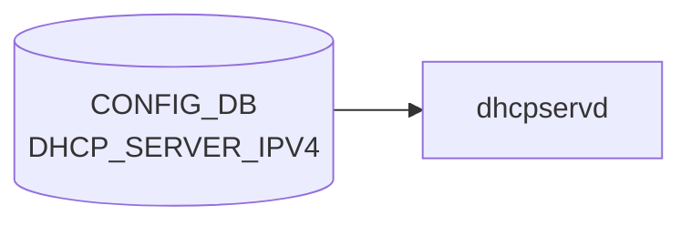

# DHCP_SERVER_IPV4 テーブル

## 概要

組み込み DHCPv4 サーバ機能の [VLAN](../../reference/glossary.md#term-vlan)/IF 単位設定を保持する[^1]。`dhcpservd`（`sonic-dhcp-server` パッケージ）が `kea-dhcp4` の設定を生成、起動する。`DEVICE_METADATA.localhost.dhcp_server` で全体有効化が制御される。

<!-- cdb-mermaid -->
### データフロー (自動生成)



!!! note "凡例"
    CONFIG_DB から SAI までの典型経路を `docs/reference/config-db-orch-map.md` から機械生成したミニ図。詳細・例外は本ページ本文と対応表を参照。
<!-- /cdb-mermaid -->

## key 構造

```
DHCP_SERVER_IPV4|<name>
```

`<name>` は VLAN 名 (`Vlan<id>`) または [SmartSwitch](../../reference/glossary.md#term-smartswitch) の bridge 参照 (`MID_PLANE_BRIDGE.GLOBAL.bridge`) の union。

## フィールド一覧

| フィールド | 型 | 必須 | 説明 |
|-----------|----|------|------|
| `name` (key) | string `Vlan<id>` または bridge 名 | ✅ | DHCP 提供 IF |
| `gateway` | ipv4-address | - | クライアントへ通知するゲートウェイ |
| `lease_time` | uint32 (1..2^32-1) | ✅ | リース時間 [秒] |
| `mode` | enum `PORT` | ✅ | IP 割当モード |
| `netmask` | ipv4-address-no-zone | ✅ | サブネットマスク |
| `customized_options` | leaf-list leafref `DHCP_SERVER_IPV4_CUSTOMIZED_OPTIONS.name` | - | カスタムオプション参照リスト |
| `state` | `admin_mode` (`enabled`/`disabled`) | ✅ | サーバ有効化 |

## 関連サブテーブル

- `DHCP_SERVER_IPV4_CUSTOMIZED_OPTIONS|<name>`: option ID / type / value のテンプレ
- `DHCP_SERVER_IPV4_PORT|<vlan>|<port>`: ポート単位の IP プール
- `DHCP_SERVER_IPV4_RANGE|<name>`: アドレスレンジ
- `DHCP_SERVER_IPV4_IP|<vlan>|<port>`: 静的予約

詳細は [YANG](../../reference/glossary.md#term-yang) モジュール `sonic-dhcp-server-ipv4` を直参照。

## 購読者

- `dhcpservd` (`sonic-dhcp-server` 内)
- `dhcprelayd` （`DHCP_RELAY` 側と排他関係）

## 関連 CONFIG_DB / YANG / CLI

- 関連 [CONFIG_DB](../../reference/glossary.md#term-config_db): `VLAN`、`VLAN_INTERFACE`、`DEVICE_METADATA` (`dhcp_server`)、`DHCP_RELAY` 系
- 関連 CLI: `config dhcp_server ipv4 add/del/range/port`
- 関連 YANG: `sonic-dhcp-server-ipv4`

<!-- ref-triangle:start -->

## 関連リファレンス

- YANG: [`sonic-dhcp-server-ipv4`](../yang/sonic-dhcp-server.md)
- CLI: `config dhcp_server`

<!-- ref-triangle:end -->

## 引用元

[^1]: YANG 定義: `sonic-dhcp-server-ipv4.yang`. <https://github.com/sonic-net/sonic-buildimage/blob/9ea932ec2e18f35e58268ec2e4456b1d4afd65cd/src/sonic-yang-models/yang-models/sonic-dhcp-server-ipv4.yang>

<!-- topics-back-ref -->
## 関連 Topics

- [Topics: NAT / DHCP Relay / Time-DNS Services](../../topics/16-nat-dhcp-dns/index.md)

<!-- /topics-back-ref -->

<!-- ops-hint -->
## 運用ヒント

### 典型値

- key 形式: `DHCP_SERVER_IPV4|<name>`。
- `state`: `enabled`、`gateway`: subnet GW、`lease_time`: `3600`、`mode`: `PORT`。

### よくある誤設定

- VLAN に紐付けず DHCP_SERVER_IPV4_PORT エントリも無いと DISCOVER が応答されない。

### 確認コマンド

```bash
sonic-db-cli CONFIG_DB keys 'DHCP_SERVER_IPV4|*'
show dhcp_server ipv4 info
```
<!-- /ops-hint -->

<!-- glossary-links-injected: 998984a93e58 -->
