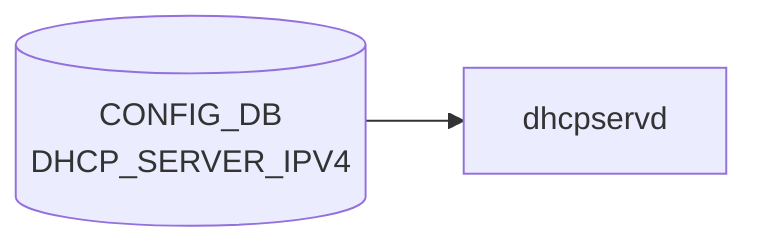

# DHCP_SERVER_IPV4 テーブル

## 概要

組み込み DHCPv4 サーバ機能の [VLAN](../../reference/glossary.md#term-vlan)/IF 単位設定を保持する[^1]。`dhcpservd`（`sonic-dhcp-server` パッケージ）が `kea-dhcp4` の設定を生成、起動する。`DEVICE_METADATA.localhost.dhcp_server` で全体有効化が制御される。

<!-- cdb-mermaid -->
### データフロー (自動生成)



!!! note "凡例"
    CONFIG_DB から SAI までの典型経路を `docs/reference/config-db-orch-map.md` から機械生成したミニ図。詳細・例外は本ページ本文と対応表を参照。
<!-- /cdb-mermaid -->

## key 構造

```text
DHCP_SERVER_IPV4|<name>
```

`<name>` は [VLAN](../../reference/glossary.md#term-vlan) 名 (`Vlan<id>`) または [SmartSwitch](../../reference/glossary.md#term-smartswitch) の bridge 参照 (`MID_PLANE_BRIDGE.GLOBAL.bridge`) の union。

## フィールド一覧

| フィールド | 型 | 必須 | 説明 |
|-----------|----|------|------|
| `name` (key) | string `Vlan<id>` または bridge 名 | ✅ | DHCP 提供 IF |
| `gateway` | ipv4-address | - | クライアントへ通知するゲートウェイ |
| `lease_time` | uint32 (1..2^32-1) | ✅ | リース時間 [秒] |
| `mode` | enum `PORT` | ✅ | IP 割当モード |
| `netmask` | ipv4-address-no-zone | ✅ | サブネットマスク |
| `customized_options` | leaf-list leafref `DHCP_SERVER_IPV4_CUSTOMIZED_OPTIONS.name` | - | カスタムオプション参照リスト |
| `state` | `admin_mode` (`enabled`/`disabled`) | ✅ | サーバ有効化 |

## 関連サブテーブル

- `DHCP_SERVER_IPV4_CUSTOMIZED_OPTIONS|<name>`: option ID / type / value のテンプレ
- `DHCP_SERVER_IPV4_PORT|<vlan>|<port>`: ポート単位の IP プール
- `DHCP_SERVER_IPV4_RANGE|<name>`: アドレスレンジ
- `DHCP_SERVER_IPV4_IP|<vlan>|<port>`: 静的予約

詳細は [YANG](../../reference/glossary.md#term-yang) モジュール `sonic-dhcp-server-ipv4` を直参照。

<!-- value-behavior -->
## 値依存挙動マトリクス

### `state` (admin_mode: enabled/disabled)

| 値 | 挙動 |
|----|------|
| `enabled` | dhcpservd が kea-dhcp4 サーバを起動し DHCP DISCOVER に応答 |
| `disabled` | kea-dhcp4 を停止。クライアントへの応答なし |

### `mode` (enum: PORT)

| 値 | 挙動 |
|----|------|
| `PORT` | ポート単位で IP を割り当て（DHCP_SERVER_IPV4_PORT テーブルで定義）。現在は PORT のみサポート |
| その他 | YANG enum 違反で reject |

### `lease_time` (uint32, 必須)

| 値 | 挙動 |
|----|------|
| 1 以上 | kea-dhcp4 のリース有効期間（秒）として設定 |
| 0 | YANG range 違反（1 以上必須）で reject |

### `customized_options` (leaf-list leafref)

| 値 | 挙動 |
|----|------|
| 存在する DHCP_SERVER_IPV4_CUSTOMIZED_OPTIONS.name | kea-dhcp4 設定にカスタムオプションを追加 |
| 存在しない option 名 | YANG leafref 違反で reject |

> DEVICE_METADATA.dhcp_server が未設定の場合、dhcpservd 自体が起動しないため state の設定は無効。

<!-- /value-behavior -->

## 購読者

- `dhcpservd` (`sonic-dhcp-server` 内)
- `dhcprelayd` （`DHCP_RELAY` 側と排他関係）

## 関連 CONFIG_DB / YANG / CLI

- 関連 [CONFIG_DB](../../reference/glossary.md#term-config_db): `VLAN`、`VLAN_INTERFACE`、`DEVICE_METADATA` (`dhcp_server`)、`DHCP_RELAY` 系
- 関連 CLI: `config dhcp_server ipv4 add/del/range/port`
- 関連 [YANG](../../reference/glossary.md#term-yang): `sonic-dhcp-server-ipv4`

<!-- ref-triangle:start -->

## 関連リファレンス

- [YANG](../../reference/glossary.md#term-yang): [`sonic-dhcp-server-ipv4`](../yang/sonic-dhcp-server.md)
- CLI: `config dhcp_server`

<!-- ref-triangle:end -->

## 引用元

[^1]: YANG 定義: `sonic-dhcp-server-ipv4.yang`. <https://github.com/sonic-net/sonic-buildimage/blob/9ea932ec2e18f35e58268ec2e4456b1d4afd65cd/src/sonic-yang-models/yang-models/sonic-dhcp-server-ipv4.yang>

<!-- topics-back-ref -->
## 関連 Topics

- [Topics: NAT / DHCP Relay / Time-DNS Services](../../topics/16-nat-dhcp-dns/index.md)

<!-- /topics-back-ref -->

<!-- ops-hint -->
## 運用ヒント

### 典型値

- key 形式: `DHCP_SERVER_IPV4|<name>`。
- `state`: `enabled`、`gateway`: subnet GW、`lease_time`: `3600`、`mode`: `PORT`。

### よくある誤設定

- [VLAN](../../reference/glossary.md#term-vlan) に紐付けず DHCP_SERVER_IPV4_PORT エントリも無いと DISCOVER が応答されない。

### 確認コマンド

```bash
sonic-db-cli CONFIG_DB keys 'DHCP_SERVER_IPV4|*'
show dhcp_server ipv4 info
```
<!-- /ops-hint -->

<!-- cdb-exceptions -->
## 例外条件・特殊挙動

| consumer | 条件 | 挙動 |
|---|---|---|
| dhcp_cfggen | standard option の `type` が期待型と不一致 | `LOG_WARNING` を出力して**期待型を優先**して処理継続（dhcp_cfggen.py:133-137） |
| dhcp_cfggen | `type` が `SUPPORT_DHCP_OPTION_TYPE` 外 | `LOG_ERR` を出力してそのオプションエントリをスキップ、他は継続（dhcp_cfggen.py:140-143） |
| dhcp_cfggen | `validate_str_type(option_type, value)` 失敗 | `LOG_ERR` を出力してそのオプションをスキップ（dhcp_cfggen.py:144-147） |
| dhcp_cfggen | `type=string` かつ `value` が 253 文字超 | `LOG_ERR` を出力してそのオプションをスキップ（dhcp_cfggen.py:148-150） |
| dhcp_cfggen | `ips` と `ranges` の両方を同時指定 | `LOG_WARNING: "...contains both ips and ranges, skip"` を出力してそのポートをスキップ（dhcp_cfggen.py:418-421） |
| dhcp_cfggen | `ranges` で指定した range 名が DHCP_SERVER_IPV4_RANGE に存在しない | `LOG_WARNING: "Range %s is not in range table, skip"` を出力してその range をスキップ（dhcp_cfggen.py:452-454） |
| dhcprelayd | `state=enabled` でも VLAN が VLAN テーブルに存在しない | dhcrelay の起動対象から除外（dhcprelayd.py:97-98） |

> **Evidence**: [sonic-buildimage](../../reference/glossary.md#term-sonic-buildimage) `src/sonic-dhcp-utilities/dhcp_utilities/dhcpservd/dhcp_cfggen.py:133-454`; `dhcp_utilities/dhcprelayd/dhcprelayd.py:94-98`
<!-- /cdb-exceptions -->


<!-- runtime-trace -->
## 実コンテナ動作トレース

### 段階 1 — Consumer 登録

`dhcpservd` (`sonic-dhcp-server`) が CONFIG_DB の `DHCP_SERVER_IPV4` テーブルを購読する。

`DHCP_SERVER_IPV4` は SONiC 独自の DHCP server 機能 (sonic-dhcp-server)。

### 段階 2 — CFG→APPL 翻訳

なし (APPL_DB 中継なし)

### 段階 3 — APPL→SAI

なし (SAI 非経由 — Linux カーネルの DHCP サーバ機能)

### 段階 4 — タイミングと副作用

**適用タイミング**: `dhcpservd` が CONFIG_DB の `DHCP_SERVER_IPV4` を購読。変化検知後 DHCP server 設定を更新。新規設定は次回 DHCP discover から有効。

**副作用**: subnet / pool 変更は新規 DHCP リクエストから適用。既存 lease には影響しない (lease 期限まで)。
<!-- /runtime-trace -->

<!-- glossary-links-injected: 75921d013977 -->
