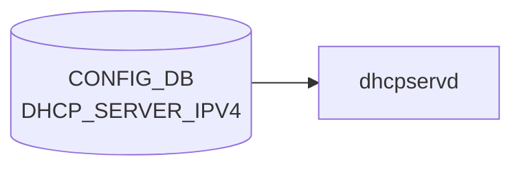

# DHCP_SERVER_IPV6 テーブル

!!! warning "未実装"
    `DHCP_SERVER_IPV6` テーブルは **2026-05-14 時点で sonic-net/sonic-buildimage master に存在しない**。
    SONiC の組み込み DHCP サーバ機能は IPv4 専用（`DHCP_SERVER_IPV4`）のみ実装されている。
    このページは将来の実装に備えたプレースホルダーである。

## 概要

[SONiC](../../reference/glossary.md#term-sonic) は DHCPv6 **リレー**機能（`DHCP_RELAY` テーブル）を持つが、DHCPv6 **サーバ**機能は未実装である。IPv4 側の対応テーブルである `DHCP_SERVER_IPV4` が `dhcpservd` + kea-dhcp4 によって実装されているのに対し、kea-dhcp6 を管理するデーモンおよび対応 [CONFIG_DB](../../reference/glossary.md#term-config_db) テーブルは存在しない。

<!-- defaults -->
<!-- cdb-mermaid -->
### データフロー (自動生成)



!!! note "凡例"
    CONFIG_DB から SAI までの典型経路を `docs/reference/config-db-orch-map.md` から機械生成したミニ図。詳細・例外は本ページ本文と対応表を参照。
<!-- /cdb-mermaid -->

## フィールドデフォルト

**調査結果: フィールドなし（テーブル未実装）**

[SONiC](../../reference/glossary.md#term-sonic) master における `DHCP_SERVER_IPV6` テーブルの [YANG](../../reference/glossary.md#term-yang) モデル、Python デーモン、CLI プラグインは確認されなかった。コード由来のデフォルト値を抽出できるフィールドが存在しない。

実装済み IPv4 版との対比:

| 確認対象 | IPv4 (`DHCP_SERVER_IPV4`) | IPv6 (`DHCP_SERVER_IPV6`) |
|---------|--------------------------|--------------------------|
| [YANG](../../reference/glossary.md#term-yang) モデル | `sonic-dhcp-server-ipv4.yang` | なし |
| デーモン | `dhcpservd` (kea-dhcp4) | なし |
| CLI | `config dhcp_server ipv4` | なし |
| 主要フィールド | `state`, `lease_time`, `mode`, `gateway`, `netmask` | 未定義 |

> Evidence: [sonic-buildimage](../../reference/glossary.md#term-sonic-buildimage)@9ea932ec — `src/sonic-yang-models/yang-models/` にて `sonic-dhcp-server-ipv6.yang` 不在を確認。`doc/dhcp_server/port_based_dhcp_server_high_level_design.md` に「IPv4 Port Based DHCP_SERVER」と明記。

<!-- /defaults -->

<!-- ordering -->
## 書込み順依存

`DHCP_SERVER_IPV6` は未実装だが、[SONiC](../../reference/glossary.md#term-sonic) の DHCPv6 リレー機能（`DHCP_RELAY` テーブル / `dhcp6relay` プロセス）には以下の順序依存が確認されている。将来 `DHCP_SERVER_IPV6` が実装された場合も同等の [VLAN](../../reference/glossary.md#term-vlan) 前提条件が継承される見込み。

### VLAN_INTERFACE 先行が必須

`dhcp6relay` の起動時 (`initialize_swss()` → `processRelayNotification()`) は `DHCP_RELAY|<vlan>` エントリを処理する際に [CONFIG_DB](../../reference/glossary.md#term-config_db) の `VLAN_INTERFACE|<vlan>|*` キーを検索し、**IPv6 アドレス（コロン含む）が 1 件も存在しない [VLAN](../../reference/glossary.md#term-vlan) は無条件でスキップ**する。

```
// dhcp6relay/src/config_interface.cpp:130-148
const std::string match_pattern = "VLAN_INTERFACE|" + vlan + "|*";
auto keys = config_db->keys(match_pattern);
...
if (!has_ipv6_address) {
    syslog(LOG_WARNING, "%s doesn't have IPv6 address configured, skip it", vlan.c_str());
    continue;
}
```

runtime 中の動的更新は「コンテナ再起動が必要」ログを出すのみで設定反映されないため、**DHCP_RELAY 書込み前に VLAN_INTERFACE への IPv6 アドレス付与が完了していること**が必要。

推奨書込み順序:

```
1. VLAN（ブリッジ定義）
2. VLAN_INTERFACE|<vlan>|<ipv6-prefix>  ← IPv6 グローバルアドレス
3. DHCP_RELAY|<vlan>（dhcpv6_servers を含む）
```

### dhcp6relay 起動条件（supervisor テンプレート）

`dhcpv6-relay.agents.j2` / `dhcp-relay.programs.j2` は supervisord エントリを Jinja2 で動的生成する。`dhcp6relay` プログラムは次の条件がすべて真のときのみ登録・起動される:

1. `VLAN_INTERFACE` にエントリが存在する
2. 当該 [VLAN](../../reference/glossary.md#term-vlan) が `DHCP_RELAY` に存在し `dhcpv6_servers` が空でない
3. `dhcpv6_servers` に有効な IPv6 アドレスが 1 件以上含まれる

条件を満たさない状態でコンテナが起動すると `dhcp6relay` はそもそも supervisord に登録されない。

### systemd 起動順（dhcp-relay.service）

`dhcp_relay.service.j2` は以下の `After=` を持つ:

```
After=config-setup.service swss.service syncd.service teamd.service
```

`teamd.service` が完了して VLAN インターフェースが UP し LLA が生成された後に `dhcp-relay` コンテナが起動するため、**LLA 未生成によるソケット開設失敗は通常発生しない**。ただし `After=` は完了順序のみ保証し、[CONFIG_DB](../../reference/glossary.md#term-config_db) への全データ書込みは `config-setup.service` の完了に依存する。

> Evidence: `sonic-net/sonic-dhcp-relay@dhcp6relay/src/config_interface.cpp:130-148`、`sonic-net/sonic-buildimage@dockers/docker-dhcp-relay/dhcpv6-relay.agents.j2:2-10`、`sonic-net/sonic-buildimage@files/build_templates/dhcp_relay.service.j2:4`

<!-- /ordering -->

<!-- side-effects -->
## 副次 DB 書込

> ソース: `sonic-net/sonic-dhcp-relay dhcp6relay/src/relay.cpp`

`DHCP_SERVER_IPV6` テーブルは未実装だが、DHCPv6 リレー機能を担う `dhcp6relay` プロセスは
`DHCP_RELAY` テーブルを読み込み、[STATE_DB](../../reference/glossary.md#term-state_db) へカウンタを書き込む。将来の `DHCP_SERVER_IPV6`
実装時も同等のカウンタ機構が継承される見込みのため、現在の動作を記録する。

### STATE_DB

`dhcp6relay` は起動時および各 DHCPv6 メッセージ受信時に `DHCPv6_COUNTER_TABLE` へ書き込む。

```cpp
// dhcp6relay/src/relay.cpp:18
static std::string counter_table = "DHCPv6_COUNTER_TABLE|";
```

#### 初期化（`initialize_counter`）

VLAN インターフェースの LLA が確認できたタイミングで呼び出される（`lla_check_callback` → `relay.cpp:1401`）。

| テーブル | キー形式 | 書込フィールド | 初期値 | タイミング |
|----------|----------|----------------|--------|------------|
| `DHCPv6_COUNTER_TABLE` | `<vlan_ifname>` | `Unknown`, `Solicit`, `Advertise`, `Request`, `Confirm`, `Renew`, `Rebind`, `Reply`, `Release`, `Decline`, `Reconfigure`, `Information-Request`, `Relay-Forward`, `Relay-Reply`, `Malformed` | `"0"` | `initialize_counter()` 呼び出し時（LLA 確認後） |

事前に `clear_counter()` で既存エントリ（パターン `DHCPv6_COUNTER_TABLE|*`）を全削除してから再初期化する。

#### カウンタ増分（`increase_counter`）

各 DHCPv6 メッセージ処理時に該当フィールドをインクリメントする（`relay.cpp:292-305`）。

| 書込パス | 対象フィールド | タイミング |
|----------|----------------|------------|
| `relay_client()` — クライアント→サーバ方向 | `Solicit` / `Request` / `Confirm` / `Renew` / `Rebind` / `Release` / `Decline` / `Information-Request` / `Malformed` のいずれか | クライアントパケット受信時 |
| `relay_relay_forw()` — Relay-Forward 転送 | `Relay-Forward` | Relay-Forward パケットをサーバへ転送するとき |
| `relay_relay_reply()` — サーバ→クライアント方向 | `Advertise` / `Reply` / `Reconfigure` / `Relay-Reply` / `Malformed` / `Unknown` のいずれか | サーバ応答パケット受信時 |
| ループバック受信（loopback インターフェース） | `Relay-Reply` | ループバックソケットから受信時（`relay.cpp:1098`） |

書込みは `state_db->hset(table_name, type, toString(count + 1))` で行われ、
フィールドが存在しない場合は `"1"` で新規作成される。

### 設定ファイル書込

`dhcp6relay` は設定ファイルへの書込みを行わない。すべての状態情報は [STATE_DB](../../reference/glossary.md#term-state_db) のみに保持される。

> Evidence: `sonic-net/sonic-dhcp-relay@dhcp6relay/src/relay.cpp:18,52-68,273-306,1342-1348,1401`

<!-- /side-effects -->

<!-- failure -->
## 失敗挙動

`DHCP_SERVER_IPV6` テーブルは未実装のため直接の失敗パスは存在しないが、DHCPv6 リレー機能（`DHCP_RELAY` テーブル / `dhcp6relay` プロセス）に以下の失敗挙動が確認されている。将来 `DHCP_SERVER_IPV6` が実装された場合も同等の前提条件・失敗パスが継承される見込み。

### 1. 不正 server_ip（`dhcpv6_servers`）→ LOG_WARNING + 不正アドレスのまま送信継続

`dhcp6relay/src/relay.cpp:476-486` — `prepare_relay_config()`:

```cpp
if(inet_pton(AF_INET6, server.c_str(), &tmp.sin6_addr) != 1)
{
    syslog(LOG_WARNING, "inet_pton: Failed to convert IPv6 address\n");
}
// ★ 変換失敗しても servers_sock.push_back(tmp) は実行される
interface_config.servers_sock.push_back(tmp);
```

`inet_pton()` が 1 を返さなかった場合（不正 IPv6 文字列）でも `servers_sock` にゼロ初期化の `sockaddr_in6` がプッシュされる。**エラー時に `continue` / `return` がなく、不正アドレスへの送信を試みる**。送信失敗は `sendto()` で `LOG_ERR` が出るが retry なし。

また `config_interface.cpp:176-179` で `dhcpv6_servers` が空の場合:

```cpp
if (intf.servers.empty()) {
    syslog(LOG_WARNING, "No servers found for VLAN %s, skipping configuration.", vlan.c_str());
    continue;
}
```

servers が空 VLAN はスキップ（CONFIG_DB にエントリが残存しても dhcp6relay は無視する）。

### 2. VLAN 未解決 → LOG_WARNING + VLAN スキップ（サービス不提供）

`config_interface.cpp:130-148` — `processRelayNotification()`:

```cpp
const std::string match_pattern = "VLAN_INTERFACE|" + vlan + "|*";
auto keys = config_db->keys(match_pattern);
...
if (!has_ipv6_address) {
    syslog(LOG_WARNING, "%s doesn't have IPv6 address configured, skip it", vlan.c_str());
    continue;
}
```

- `VLAN_INTERFACE` テーブルにキーが存在しない場合: `LOG_WARNING "%s doesn't exist in VLAN_INTERFACE table, skip it"`
- IPv6 アドレス（`:` を含む文字列）が 1 件もない場合: `LOG_WARNING "%s doesn't have IPv6 address configured, skip it"`
- いずれも `continue` でスキップ。**該当 VLAN への DHCPv6 リレーは提供されない**。rollback なし・DB 状態変更なし。

### 3. dhcrelay 起動失敗 → exit(EXIT_FAILURE) または retry 後 exit

`relay.cpp:588-658` — `prepare_vlan_sockets()`:

- VLAN ソケット（GUA/LLA）生成失敗: `LOG_ERR "socket: Failed to create gua/lla socket on interface %s\n"` → return -1
- GUA/LLA アドレス取得失敗: `LOG_WARNING "Retry #%d to bind to sockets on interface %s\n"` → 5 秒 sleep × 最大 6 回リトライ
- 6 回全リトライ失敗後:

```
LOG_ERR "bind: Failed to bind socket to global ipv6 address on interface %s after %d retries with %s"
```

→ return -1 → 呼び出し元で `exit(EXIT_FAILURE)`

`relay.cpp:412-434` — `sock_open()`:

- L2 raw ソケット生成失敗: `LOG_ERR "socket: Failed to create socket\n"` → return -1
- bind 失敗: `LOG_ERR "bind: Failed to bind to specified interface\n"` → close + return -1
- BPF filter attach 失敗: `LOG_ERR "setsockopt: Failed to attach filter\n"` → close + return -1

**supervisord / systemd による自動再起動に委ねる。`ERROR_TABLE` への書き込みはなし**（dhcp6relay は ERROR_TABLE を使用しない）。

### 4. runtime 設定変更は再起動まで反映されない（hot-reload 不可）

`config_interface.cpp:76-78`:

```cpp
syslog(LOG_WARNING, "relay config changed, need restart container to take effect");
```

CONFIG_DB の `dhcpv6_servers` を変更しても dhcp6relay は無視する。**DB 状態と実動作が乖離したまま継続**。再起動するまで新設定は反映されない。

> Evidence: `sonic-net/sonic-dhcp-relay@dhcp6relay/src/relay.cpp:476-486`、`dhcp6relay/src/config_interface.cpp:130-148,176-179`

<!-- /failure -->

<!-- cross-refs -->
## 暗黙参照テーブル

> `DHCP_SERVER_IPV6` は未実装のため、DHCPv6 エコシステム（`DHCP_RELAY` / `dhcp6relay`）の暗黙参照を代理調査した結果を示す。

`dhcp6relay` デーモン（`sonic-dhcp-relay/dhcp6relay/src/`）は `DHCP_RELAY` テーブルを処理する際に、[YANG](../../reference/glossary.md#term-yang) leafref 定義なしで以下の CONFIG_DB テーブルを参照する:

| 参照先テーブル | 参照方向 | 条件 | 証拠 |
|---|---|---|---|
| `VLAN_INTERFACE\|<vlan>\|*` | 読み取り (IPv6 アドレス必須チェック) | 常時 | `config_interface.cpp:130` |
| `VLAN_MEMBER\|<vlan>\|*` | 読み取り (ポートマップ構築) | 常時 | `relay.cpp:856` |

**VLAN_INTERFACE**: `config_interface.cpp:130` で `"VLAN_INTERFACE|" + vlan + "|*"` パターンを CONFIG_DB 検索し、IPv6 アドレスが存在しない VLAN は警告を出してスキップする。YANG モデル（`sonic-dhcpv6-relay.yang`）には leafref なし。

**VLAN_MEMBER**: `relay.cpp:856` で `"VLAN_MEMBER|" + vlan + "|*"` を取得し、member interface → VLAN の逆引きマップを構築する。これがないとクライアントパケットの VLAN 判定が不可能。


<!-- /cross-refs -->

<!-- constants -->
## ハードコード定数 (コード由来)

`DHCP_SERVER_IPV6` テーブル自体は未実装だが、DHCPv6 プロトコル処理に直接関係する定数は **dhcp6relay**（`sonic-dhcp-relay` リポジトリ）の `relay.h` にハードコードされている。将来の `DHCP_SERVER_IPV6` 実装でも同一ポート・hop 上限が継承される見込みのため記録する。

### UDP ポート定数

| 定数名 | 値 | 用途 | ソース |
|--------|----|------|--------|
| `RELAY_PORT` | `547` | DHCPv6 サーバ／リレー間 UDP ポート (RFC 8415 §7.2) | relay.h L22 |
| `CLIENT_PORT` | `546` | DHCPv6 クライアント向け UDP ポート (RFC 8415 §7.2) | relay.h L23 |

BPF フィルタは `"udp and port 547"` を使用する。`dhcp6relay` は L2 ソケットを開きポート 547 宛のパケットを直接キャプチャする（`relay.cpp:403`）。

### ホップ上限

| 定数名 | 値 | 用途 | ソース |
|--------|----|------|--------|
| `HOP_LIMIT` | `8` | RELAY-FORWARD の hop_count がこの値以上のパケットはドロップ | relay.h L24 |

コメントに `"HOP_LIMIT reduced from 32 to 8 as stated in RFC8415"` と明記されている。ドロップ時は `syslog(LOG_WARNING, ...)` を出力する（`relay.cpp:747-751`）。新規クライアントパケットは hop_count=0 で開始し、中継ごとに +1 される（`relay.cpp:692, 758`）。**CONFIG_DB から上書き不可のハードコード定数**。

### その他の主要定数

| 定数名 | 値 | 用途 | ソース |
|--------|----|------|--------|
| `DHCPv6_OPTION_LIMIT` | `147` | サポートする DHCPv6 オプション上限 (IANA Option Codes 準拠) | relay.h L25 |
| `RAWSOCKET_RECV_SIZE` | `1048576` (1 MiB) | L2 ソケット受信バッファサイズ上限 | relay.h L27 |
| `BUFFER_SIZE` | `9200` | パケット処理バッファサイズ（ジャンボフレーム対応） | relay.h L29 |
| `OPTION_RELAY_MSG` | `9` | DHCPv6 Option 9 (Relay Message) | relay.h L33 |
| `OPTION_INTERFACE_ID` | `18` | DHCPv6 Option 18 (Interface-ID、RFC 3315) | relay.h L34 |
| `OPTION_CLIENT_LINKLAYER_ADDR` | `79` | DHCPv6 Option 79 (Client Link-Layer Address、RFC 6939) | relay.h L35 |

> Evidence: `sonic-net/sonic-dhcp-relay@dhcp6relay/src/relay.h:22-37` (SHA: 7316417034fee6a6c6002490362c9bc75eeafde1)

<!-- /constants -->

<!-- pubsub -->
## 通信メカニズム

> **Evidence**: `sonic-dhcp-relay/dhcp6relay/src/config_interface.cpp` 全行精読 (2026-05-16)

### DHCP_SERVER_IPV6 に関する結論

`DHCP_SERVER_IPV6` テーブルは未実装であるため、このテーブルを購読・監視するデーモンは存在しない。CONFIG_DB Subscribe、dhcrelay 制御、netlink 監視はすべて **`DHCP_RELAY` テーブルを対象とした `dhcp6relay` プロセス**が担っている。

### DHCPv6 リレー側の通信メカニズム（参照）

`DHCP_SERVER_IPV6` が将来実装される際の参照として、現在の DHCPv6 関連実装を記録する。

#### CONFIG_DB Subscribe (`dhcp6relay`)

`dhcp6relay` (`sonic-dhcp-relay/dhcp6relay/src/config_interface.cpp`) は以下の方法で CONFIG_DB を購読する:

```
dhcp6relay 起動
  └─ initialize_swss()                             (config_interface.cpp:18-29)
       ├─ DBConnector("CONFIG_DB", 0)               ← Redis DB #4
       ├─ SubscriberStateTable(db, "DHCP_RELAY")   ← DHCP_RELAY テーブル購読
       │    └─ PSUBSCRIBE __keyspace@4__:DHCP_RELAY|*
       └─ swssSelect.addSelectable(&ipHelpersTable)
            └─ get_dhcp(vlans, table, dynamic=false, config_db)
                 └─ swssSelect.select(timeout_ms=1000)
                      └─ handleRelayNotification()
                           └─ pops() → processRelayNotification()
```

| 項目 | 値 |
|------|-----|
| 購読テーブル | `DHCP_RELAY`（`DHCP_SERVER_IPV6` は **なし**） |
| SWSS abstraction | `swss::SubscriberStateTable` + `swss::Select` |
| PSUBSCRIBE パターン | `__keyspace@4__:DHCP_RELAY\|*` |
| Select timeout | 1000 ms |
| [ConsumerStateTable](../../reference/glossary.md#term-consumerstatetable) | **不使用** |
| NotificationConsumer | **不使用** |
| TTL / keyspace expire | **不使用** |

#### dhcrelay 制御

`dhcp6relay` はシグナルで制御される。`relay.cpp` で `libevent` を使って SIGINT / SIGTERM をキャッチし、`event_base_loopbreak()` でイベントループを終了する (`relay.cpp:1154-1220`)。

```
SIGTERM / SIGINT 受信
  └─ signal_callback(fd, event, base)              (relay.cpp:1214)
       └─ event_base_loopbreak(base)
```

**動的設定変更は非対応**: `DHCP_RELAY` エントリを変更しても `dynamic=true` フラグにより無視され、`LOG_WARNING "relay config changed, need restart container to take effect"` のみ出力される。設定反映にはコンテナ再起動が必須 (`config_interface.cpp:76-78`)。

#### netlink（間接利用）

`dhcp6relay` は netlink を直接使用しない。LLA（Link Local Address）の確認は `ip -6 addr show <vlan> scope link` コマンドを `popen()` で呼び出す方式を採用する (`config_interface.cpp:196-209`)。インタフェースインデックスの取得のみ `if_nametoindex()` を使用する (`relay.cpp:829`)。

```
// LLA 確認 (config_interface.cpp:196-209)
const std::string cmd = "ip -6 addr show " + vlan + " scope link 2> /dev/null";
popen(cmd.c_str(), "r")  // netlink ソケット直接使用なし
```

<!-- /pubsub -->

<!-- platform -->
## プラットフォーム差

`DHCP_SERVER_IPV6` テーブル自体は未実装だが、DHCPv6 リレー (`dhcp6relay`) には以下のプラットフォーム差が確認された。

| 観点 | 結果 | 根拠 |
|------|------|------|
| DualToR | **差異あり** — [MUX](../../reference/glossary.md#term-mux) 状態に応じてパケット転送を制御 | `DEVICE_METADATA.localhost.subtype == "DualToR"` の場合のみ `-u Loopback0` オプションで起動。`dual_tor_sock = true` がセットされ、`HW_MUX_CABLE_TABLE` の `state` が `standby` なら転送スキップ (`relay.cpp:913-921`) |
| [SmartSwitch](../../reference/glossary.md#term-smartswitch) [DPU](../../reference/glossary.md#term-dpu) | **dhcp6relay 非対応** — [DPU](../../reference/glossary.md#term-dpu) 経路実装なし | `dhcp4relay` は `is_SmartSwitch` フラグ・`DPUS` テーブル監視・`bridge-midplane` MAC 取得を実装するが、`dhcp6relay/src/` には [SmartSwitch](../../reference/glossary.md#term-smartswitch)/[DPU](../../reference/glossary.md#term-dpu) 関連コードが存在しない |
| IPv6 link-local アドレス (LLA) | **DHCPv6 固有の生成待機ロジック** | `check_is_lla_ready()` が `ip -6 addr show <vlan> scope link` で LLA 存在を確認。60 秒タイマー (`lla_check_callback`) でポーリングし、LLA 生成後にソケットを動的追加 (`relay.cpp:1288-1310`) |
| multi-asic | 影響なし | `initialize_swss()` は `CONFIG_DB` を namespace 引数なしで接続。`asicN` namespace を iterate しない |
| [ASIC](../../reference/glossary.md#term-asic) ベンダー | 影響なし | `dhcp6relay` は純粋 L3 UDP リレー処理。[SAI](../../reference/glossary.md#term-sai) / [ASIC SDK](../../reference/glossary.md#term-asic-sdk) 非経由 |

### DualToR 構成の詳細

DualToR 環境では `dhcpv6-relay.agents.j2:16` の Jinja2 条件により `dhcp6relay -u Loopback0` として起動する:

```jinja2
 -u Loopback0 
```

`-u` フラグが渡ると:

1. Loopback0 の GUA アドレスに追加ソケットを作成（`prepare_lo_socket`）し、`server_callback_dualtor` イベントを登録する
2. クライアントからのパケット受信時に `HW_MUX_CABLE_TABLE|<intf>` で `state` を確認し、`standby` の場合は転送しない（active 側のみが中継を担う）
3. サーバからの応答は Loopback ソケット (`server_callback_dualtor`) 経由で受信し、クライアントへ中継する

### SmartSwitch DPU — DHCPv6 非対応

DHCPv4 側 (`dhcp4relay`) が [SmartSwitch](../../reference/glossary.md#term-smartswitch) の `DPUS` テーブルを監視し DPU インターフェース (`dpu0..N`) 向けに `GIADDR` を書き換えるのに対し、**`dhcp6relay` には同等の実装がない**。SmartSwitch 環境での DPU への DHCPv6 アドレス配布は community master では未サポートである。

### IPv6 LLA 生成待機の仕組み

VLAN インターフェースに IPv6 GUA が設定されていても kernel による LLA (`fe80::`) 生成は数ミリ秒〜数秒の遅延がある。`dhcp6relay` は起動直後に `lla_check_callback` を手動実行し (`relay.cpp:1310`)、その後 60 秒ごとにポーリングする。LLA が確認されると `is_lla_ready = true` としてソケット作成・イベント登録を行う。LLA が未生成の VLAN はソケット作成をスキップし、次回タイマーで再試行する。

<!-- /platform -->

## DHCPv6 サポートの現状

SONiC の DHCPv6 対応は次の 2 要素のみ:

1. **DHCPv6 リレー** — `DHCP_RELAY` テーブル（sonic-dhcpv6-relay.yang）。VLAN ごとに `dhcpv6_servers`、`rfc6939_support`、`interface_id` を設定し、`dhcrelay` プロセスが DHCPv6 RELAY-FORWARD/REPLY をプロキシする
2. **DHCPv6 リレーカウンタ** — `show dhcp6relay_counters` CLI で統計確認可能

DHCPv6 サーバ機能（kea-dhcp6 管理、ステートフル/ステートレスアドレス配布）はコミュニティ版 master には存在しない。

## 関連ドキュメント

- [DHCP_SERVER_IPV4 テーブル](dhcp-server-ipv4.md) — 実装済み IPv4 版
- [DHCP_RELAY テーブル（DHCPv4）](dhcp-relay.md)
- [DHCPv4 リレー テーブル](dhcpv4-relay.md)

<!-- ref-triangle:start -->

## 関連リファレンス

- CONFIG_DB: [`DHCP_SERVER_IPV4`](dhcp-server-ipv4.md)、[`DHCP_RELAY`](dhcp-relay.md)

<!-- ref-triangle:end -->

<!-- glossary-links-injected: 4ad78d92b6ed -->
