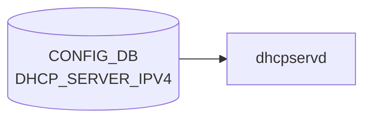

<!-- cdb-mermaid -->
### データフロー (自動生成)

!!! note "凡例"
    CONFIG_DB から SAI までの典型経路を `docs/reference/config-db-orch-map.md` から機械生成したミニ図。詳細・例外は本ページ本文と対応表を参照。
<!-- /cdb-mermaid -->

# DHCP_SERVER_IPV6 テーブル

!!! warning "未実装スタブ"
    `DHCP_SERVER_IPV6` テーブルは **2026-06-04 時点で sonic-net/sonic-buildimage master に存在しない**。
    [SONiC](../../reference/glossary.md#term-sonic) の組み込み DHCP サーバ機能は IPv4 専用 (`DHCP_SERVER_IPV4`) のみ実装されている。
    本ページは将来の実装に備えたプレースホルダーであり、リレー側 (`DHCP_RELAY` / `dhcp6relay`) の詳細は本ページでは扱わない。

## 未実装である根拠

`src/sonic-yang-models/yang-models/` 配下には `sonic-dhcp-server-ipv4.yang` のみが存在し、`sonic-dhcp-server-ipv6.yang` に相当する [YANG](../../reference/glossary.md#term-yang) モデルは存在しない。[HLD](../../reference/glossary.md#term-hld) (`doc/dhcp_server/port_based_dhcp_server_high_level_design.md`) のタイトルも「IPv4 Port Based DHCP_SERVER in [SONiC](../../reference/glossary.md#term-sonic)」であり、設計段階から IPv4 限定として始まっている。

[CONFIG_DB](../../reference/glossary.md#term-config_db) を購読する `dhcpservd` デーモン (kea-dhcp4 ラッパ) も IPv4 専用で、kea-dhcp6 を起動・管理する [SONiC](../../reference/glossary.md#term-sonic) 側の対応デーモンは master に未存在。CLI (`config dhcp_server ipv4 ...`) も IPv4 系統のみが `sonic-utilities` に登録されている。

## IPv4 実装との対比

| 確認対象 | IPv4 (`DHCP_SERVER_IPV4`) | IPv6 (`DHCP_SERVER_IPV6`) |
|---------|--------------------------|--------------------------|
| [YANG](../../reference/glossary.md#term-yang) モデル | `sonic-dhcp-server-ipv4.yang` | なし |
| デーモン | `dhcpservd` (kea-dhcp4 管理) | なし |
| CLI | `config dhcp_server ipv4 ...` | なし |
| [HLD](../../reference/glossary.md#term-hld) | `port_based_dhcp_server_high_level_design.md` (IPv4 限定) | なし |

> Evidence: [sonic-buildimage](../../reference/glossary.md#term-sonic-buildimage)@9ea932ec — `src/sonic-yang-models/yang-models/` 配下の [YANG](../../reference/glossary.md#term-yang) 一覧および `sonic-net/SONiC@master:doc/dhcp_server/port_based_dhcp_server_high_level_design.md:1` のタイトル行で IPv4 限定であることを確認。

## SONiC における DHCPv6 サポートの現状

`DHCP_SERVER_IPV6` ではなく、リレー側で DHCPv6 を扱う:

1. **DHCPv6 リレー** — `DHCP_RELAY` テーブル (`sonic-dhcpv6-relay.yang`)。[VLAN](../../reference/glossary.md#term-vlan) ごとに `dhcpv6_servers` / `rfc6939_support` / `interface_id` を設定し、`dhcp6relay` プロセスが DHCPv6 RELAY-FORWARD/REPLY を上位サーバへプロキシする。
2. **DHCPv6 リレーカウンタ** — `show dhcp6relay_counters` CLI で `DHCPv6_COUNTER_TABLE` ([STATE_DB](../../reference/glossary.md#term-state_db)) のメッセージ別カウンタを表示する。

リレーの起動順序依存・カウンタ書込・プラットフォーム差 (DualToR の `-u Loopback0` 起動など) の詳細は専用ページに集約しているため、そちらを参照すること。

## 関連リファレンス

- [DHCP_SERVER_IPV4 テーブル](dhcp-server-ipv4.md) — 実装済み IPv4 版の設定テーブル。
- [DHCP_RELAY テーブル](dhcp-relay.md) — DHCPv6 リレーの [CONFIG_DB](../../reference/glossary.md#term-config_db) スキーマと `dhcp6relay` の動作詳細。
- [DHCPv4 リレー テーブル](dhcpv4-relay.md) — DHCPv4 側リレーの比較対象。

<!-- ref-triangle:start -->

## 関連リファレンス (索引)

- [CONFIG_DB](../../reference/glossary.md#term-config_db): [`DHCP_SERVER_IPV4`](dhcp-server-ipv4.md)、[`DHCP_RELAY`](dhcp-relay.md)

<!-- ref-triangle:end -->

<!-- glossary-links-injected: d323bb817491 -->
