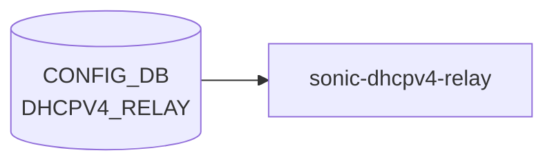

# DHCPV4_RELAY テーブル

## 概要

DHCPv4 relay agent の [VLAN](../../reference/glossary.md#term-vlan) 単位設定を保持する[^1]。`DEVICE_METADATA.has_sonic_dhcpv4_relay = true` のとき `sonic-dhcpv4-relay` (新実装) が読み出し、relay agent を構成する。link-selection、server-id-override、[VRF](../../reference/glossary.md#term-vrf) selection、source interface 指定をサポートする。

<!-- cdb-mermaid -->
### データフロー (自動生成)



!!! note "凡例"
    CONFIG_DB から SAI までの典型経路を `docs/reference/config-db-orch-map.md` から機械生成したミニ図。詳細・例外は本ページ本文と対応表を参照。
<!-- /cdb-mermaid -->

## key 構造

```text
DHCPV4_RELAY|<name>
```

`<name>` は `Vlan<id>` 形式（[VLAN](../../reference/glossary.md#term-vlan) 名）。

## フィールド一覧

| フィールド | 型 | 必須 | デフォルト | 説明 |
|-----------|----|------|-----------|------|
| `name` (key) | string `Vlan<id>` | ✅ | - | [VLAN](../../reference/glossary.md#term-vlan) 名 |
| `dhcpv4_servers` | leaf-list ipv4-address (min 1) | ✅ | - | リレー先 DHCPv4 サーバ |
| `server_vrf` | leafref `VRF.name` | - | - | サーバ側 [VRF](../../reference/glossary.md#term-vrf)。設定時は `link_selection`、`server_id_override`、`vrf_selection` が `enable` 必須 (`must`) |
| `source_interface` | union (PORT / PORTCHANNEL / VLAN / LOOPBACK) | - | - | リレーパケットの source IP を決める IF |
| `link_selection` | `mode-status` | - | `disable` | RFC 3527 Link selection sub-option |
| `server_id_override` | `mode-status` | - | `disable` | RFC 5107 server-id override |
| `vrf_selection` | `mode-status` | - | `disable` | RFC 6607 [VRF](../../reference/glossary.md#term-vrf) selection |
| `agent_relay_mode` | `relay-agent-mode` | - | `forward_untouched` (YANG) / discard (実装) | 既存 Option82 を持つパケットの処理モード。**注意**: YANG default `"forward_untouched"` はコードで認識されず discard になる |
| `max_hop_count` | uint8 (1..16) | - | `4` (YANG) / `16` (C++ struct) | ホップ数上限。YANG-実装間で default 値が乖離 |

<!-- defaults -->
## コード由来の暗黙デフォルトと挙動の罠

### `agent_relay_mode` — YANG-実装 discrepancy (critical)

YANG default 値は `forward_untouched` だが、`dhcp4relay.cpp` の文字列比較は `"append"` / `"replace"` / `"forward"` のみを認識する。`"forward_untouched"` は else 分岐に落ち、**discard (全パケットドロップ)** になる。

```
// dhcp4relay.cpp:607-620
if (config.agent_relay_mode == "append") { ... }
else if (config.agent_relay_mode == "replace") { ... }
else if (config.agent_relay_mode == "forward") { /* pass through */ }
else { /* discard — includes "forward_untouched" */ drop packet }
```

**影響**: YANG default のまま DB に書かれた場合、既存 Option82 を持つ relay パケットが全てドロップされる。CLI が `forward_untouched` を DB に書かないかを確認すること。

### `max_hop_count` — YANG default 4 vs C++ struct default 16

YANG は `default 4` を宣言するが、C++ の `relay_config` struct は `uint8_t max_hop_count = MAX_HOP_COUNT` (= `16`) で初期化される (`dhcp4relay.h:120`)。DB から field が届かない場合（ゼロデイ互換や直接書き込み等）は 16 が使われる。`stoi()` 例外時も struct 値 (16) のまま続行する (WARNING ログのみ)。

### `server_vrf` 未設定時の暗黙 fallback + 書き込み順依存

`server_vrf` が未設定のとき、`dhcp4relay_mgr.cpp:422-431` が `VLAN_INTERFACE[vlan].vrf_name` を参照し、空なら `relay_msg->vrf = "default"` を採用する。`DHCPV4_RELAY` SET の時点で `VLAN_INTERFACE` の VRF が未設定だと、`"default"` VRF のソケットが作られる。後から VLAN_INTERFACE が更新されると `VLAN_INTERFACE_UPDATE` イベントで修正されるが、起動順序次第で一時的に誤 VRF になる。

### `link_selection` + DualToR — プラットフォーム依存強制上書き

`DEVICE_METADATA.subtype = "DualToR"` のとき、DB の `link_selection` 設定値に関わらず Link Selection sub-option が強制 enable され、`source_interface` も `"Loopback0"` に自動上書きされる。DualToR 環境ではこれら2フィールドの設定は実質 dead field となる。

### `source_interface` 未設定 → giaddr fallback

`source_interface` 未設定かつ VLAN に primary IP がない場合、giaddr = 0 となりパケットをドロップする (`dhcp4relay.cpp:587-592`)。YANG must 制約は `link_selection = enable` のときのみ `source_interface` を必須とするが、この drop は `link_selection = disable` でも起きる。

### `dhcpv4_servers` 空 → silent skip

DB を YANG バリデーション外で書いた場合、`servers` が空のとき `dhcp4relay_mgr.cpp:443-447` が WARNING ログのみで config event をスキップする。relay 設定は適用されず、エラーにはならない。

### `feature_dhcp_server = enabled` → DHCPV4_RELAY が dead consumer

`FEATURE.dhcp_server.state = "enabled"` のとき、`DHCPV4_RELAY` テーブルの watch が停止し (`dhcp4relay_mgr.cpp:135-157`)、以降の DHCPV4_RELAY 変更は全て無視される。

<!-- /defaults -->

<!-- value-behavior -->
## 値依存挙動マトリクス

### `link_selection` (mode-status: enable/disable)

| 値 | 挙動 |
|----|------|
| `disable` (デフォルト) | Link Selection Sub-option なし |
| `enable` | RFC 3527 Link Selection Sub-option をリレーパケットに付与（dhcp4relay.cpp:521） |
| DualToR 環境（is_dualTor=true） | 設定値に関わらず Link Selection が自動 enable（dhcp4relay.cpp:265） |

### `server_id_override` (mode-status: enable/disable)

| 値 | 挙動 |
|----|------|
| `disable` (デフォルト) | Server-ID Override なし |
| `enable` | RFC 5107 Server-ID Override sub-option を付与（dhcp4relay.cpp:530） |

### `vrf_selection` (mode-status: enable/disable)

| 値 | 挙動 |
|----|------|
| `disable` (デフォルト) | VRF Selection なし |
| `enable` | RFC 6607 VRF Selection sub-option を付与（dhcp4relay.cpp:540）。`server_vrf` 必須（YANG must） |

### `dhcpv4_servers` (leaf-list, min 1)

| 値 | 挙動 |
|----|------|
| 1 件以上 | dhcp4relay_mgr がサーバリストを設定 |
| 0 件 | YANG min-elements 違反で reject |

<!-- /value-behavior -->

## 制約 (must)

- `server_vrf` を指定するなら `link_selection = enable` かつ `server_id_override = enable`
- `vrf_selection = enable` なら `server_vrf` 必須

## 購読者

- `sonic-dhcpv4-relay` (新パッケージ) が `DEVICE_METADATA.has_sonic_dhcpv4_relay = true` のとき
- 旧来の `dhcrelay`（`VLAN.dhcp_servers` 経由）はこのテーブルを使わない

## 関連 CONFIG_DB / YANG / CLI

- 関連 [CONFIG_DB](../../reference/glossary.md#term-config_db): `VLAN`、`VLAN_INTERFACE`、`VRF`、`LOOPBACK_INTERFACE`、`DEVICE_METADATA` (`has_sonic_dhcpv4_relay`)
- 関連 CLI: `config dhcp_relay ipv4 add/del`
- 関連 [YANG](../../reference/glossary.md#term-yang): `sonic-dhcpv4-relay`

<!-- ref-triangle:start -->

## 関連リファレンス

- [YANG](../../reference/glossary.md#term-yang): `sonic-dhcpv4-relay`
- CLI: [`config dhcp_relay`](../cli/config-dhcp-relay.md)

<!-- ref-triangle:end -->

## 引用元

[^1]: YANG 定義: `sonic-dhcpv4-relay.yang`. <https://github.com/sonic-net/sonic-buildimage/blob/9ea932ec2e18f35e58268ec2e4456b1d4afd65cd/src/sonic-yang-models/yang-models/sonic-dhcpv4-relay.yang>

<!-- topics-back-ref -->
## 関連 Topics

- [Topics: NAT / DHCP Relay / Time-DNS Services](../../topics/16-nat-dhcp-dns/index.md)

<!-- /topics-back-ref -->

<!-- ops-hint -->
## 運用ヒント

### 典型値

- key 形式: `DHCP_RELAY|<vlan>` (DHCPv4 relay)`。
- `dhcp_servers`: relay 先 IPv4。`source_interface`: 任意の SVI / Loopback。

### よくある誤設定

- source_interface に IP が付いていないと relay packet の giaddr が 0 になりサーバが応答しない。

### 確認コマンド

```bash
sonic-db-cli CONFIG_DB keys 'DHCP_RELAY|*'
show dhcprelay_helper ipv4
```
<!-- /ops-hint -->

<!-- cdb-exceptions -->
## 例外条件・特殊挙動

| consumer | 条件 | 挙動 |
|---|---|---|
| db_migrator | DHCPV4_RELAY に `dhcpv4_servers` が既存 | `"Skipping migration for {vlan_key}: dhcpv4_servers already present in DHCPV4_RELAY"` を出力してスキップ（べき等性）（db_migrator.py:928） |
| config vlan | DHCPV4_RELAY 参照中の VLAN を削除しようとした | `ctx.fail("{vlan} cannot be removed as it is being used in DHCPV4_RELAY table.")` でエラー終了（config/vlan.py:243） |
| config main | DHCPV4_RELAY 参照中の VRF を削除しようとした | 削除を拒否（config/main.py:1699-1706） |
| dhcp_relay CLI | 同一サーバ IP を重複追加 | 既存エントリを get してマージするため重複エントリは発生しない（dhcp_relay.py:601-628） |

> **Evidence**: [sonic-utilities](../../reference/glossary.md#term-sonic-utilities) `scripts/db_migrator.py:928`; `config/vlan.py:242-243`; `config/main.py:1699-1706`; [sonic-buildimage](../../reference/glossary.md#term-sonic-buildimage) `dockers/docker-dhcp-relay/cli/config/plugins/dhcp_relay.py:601-628`
<!-- /cdb-exceptions -->


<!-- runtime-trace -->
## 実コンテナ動作トレース

### 段階 1 — Consumer 登録

`dhcrelay` / `dhcp_relay` サービス (DHCPv4 relay 専用) が CONFIG_DB の `DHCPV4_RELAY` テーブルを購読する。

`DHCPV4_RELAY` は一部の SONiC バージョンで `DHCP_RELAY` と統合/分離されている。

### 段階 2 — CFG→APPL 翻訳

なし (APPL_DB 中継なし)

### 段階 3 — APPL→SAI

なし (SAI 非経由 — Linux カーネルの DHCPv4 relay)

### 段階 4 — タイミングと副作用

**適用タイミング**: `dhcrelay` が CONFIG_DB を読み込んで設定。`DHCP_RELAY` と同様にサービス再起動で反映。

**副作用**: `DHCP_RELAY` テーブルと機能的に重複する部分がある。設定変更時はサービス再起動が必要。
<!-- /runtime-trace -->

<!-- entry-points -->
## 書き込み入り口 (Direction A)

対象テーブル: `DHCPV4_RELAY`

### CLI
- `config dhcpv4-relay add/del <vlan> <server-ip>`
  - ソース: `sonic-utilities/config/main.py (dhcpv4-relay グループ)`

### minigraph / sonic-cfggen
- なし

### REST / gNMI (sonic-mgmt-common)
- なし (対応 OpenConfig/SONiC YANG transformer なし)

### db_migrator
- なし

### ビルド時デフォルト (init_cfg / j2 テンプレート)
- なし

### ハードコードデフォルト
- なし

### ランタイム注入 (デーモン自動書き込み)
- なし
<!-- /entry-points -->

<!-- glossary-links-injected: 9aad8bf0c717 -->
