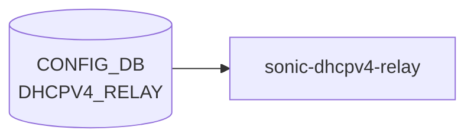

# DHCPV4_RELAY テーブル

## 概要

DHCPv4 relay agent の [VLAN](../../reference/glossary.md#term-vlan) 単位設定を保持する[^1]。`DEVICE_METADATA.has_sonic_dhcpv4_relay = true` のとき `sonic-dhcpv4-relay` (新実装) が読み出し、relay agent を構成する。link-selection、server-id-override、[VRF](../../reference/glossary.md#term-vrf) selection、source interface 指定をサポートする。

<!-- cdb-mermaid -->
### データフロー (自動生成)



!!! note "凡例"
    CONFIG_DB から SAI までの典型経路を `docs/reference/config-db-orch-map.md` から機械生成したミニ図。詳細・例外は本ページ本文と対応表を参照。
<!-- /cdb-mermaid -->

## key 構造

```text
DHCPV4_RELAY|<name>
```

`<name>` は `Vlan<id>` 形式（[VLAN](../../reference/glossary.md#term-vlan) 名）。

## フィールド一覧

| フィールド | 型 | 必須 | デフォルト | 説明 |
|-----------|----|------|-----------|------|
| `name` (key) | string `Vlan<id>` | ✅ | - | [VLAN](../../reference/glossary.md#term-vlan) 名 |
| `dhcpv4_servers` | leaf-list ipv4-address (min 1) | ✅ | - | リレー先 DHCPv4 サーバ |
| `server_vrf` | leafref `VRF.name` | - | - | サーバ側 [VRF](../../reference/glossary.md#term-vrf)。設定時は `link_selection`、`server_id_override`、`vrf_selection` が `enable` 必須 (`must`) |
| `source_interface` | union (PORT / PORTCHANNEL / VLAN / LOOPBACK) | - | - | リレーパケットの source IP を決める IF |
| `link_selection` | `mode-status` | - | `disable` | RFC 3527 Link selection sub-option |
| `server_id_override` | `mode-status` | - | `disable` | RFC 5107 server-id override |
| `vrf_selection` | `mode-status` | - | `disable` | RFC 6607 [VRF](../../reference/glossary.md#term-vrf) selection |
| `agent_relay_mode` | `relay-agent-mode` | - | `forward_untouched` (YANG) / discard (実装) | 既存 Option82 を持つパケットの処理モード。**注意**: YANG default `"forward_untouched"` はコードで認識されず discard になる |
| `max_hop_count` | uint8 (1..16) | - | `4` (YANG) / `16` (C++ struct) | ホップ数上限。YANG-実装間で default 値が乖離 |

<!-- ordering -->
## 書込み順依存 (Phase B)

`sonic-dhcpv4-relay` (`DHCPMgr`) は CONFIG_DB の複数テーブルを同時購読する。`DHCPV4_RELAY` の SET イベント受信時点でこれらが揃っていないと、設定の欠落や誤った VRF での中間状態が発生する。

### 他テーブル先行必須

| 先行テーブル | 理由 | 違反時の挙動 |
|---|---|---|
| `VLAN\|<name>` | `process_dhcp_server_ipv4_notification()` が `vlan_tbl.hget(vlan, "vlanid", ...)` で VLAN 存在チェックを行い、VLAN が未登録ならイベントを破棄（`dhcp4relay_mgr.cpp:793-800`） | `DHCP_SERVER_IPV4` 経由の relay 設定が silent drop され relay が有効にならない |
| `VLAN_INTERFACE\|<name>` | `server_vrf` 未指定時に `vlan_intf_tbl->hget(vlan, VRF_NAME_FIELD, ...)` で VLAN_INTERFACE の vrf_name を取得。未設定なら `"default"` VRF を使用（`dhcp4relay_mgr.cpp:421-431`） | `VLAN_INTERFACE` が後から追加されると `VLAN_INTERFACE_UPDATE` イベントで修正されるが、起動直後の packet は誤 VRF のソケットに流れる |
| `DEVICE_METADATA\|localhost\|has_sonic_dhcpv4_relay` | `true` でなければ旧 `dhcrelay` が `DHCPV4_RELAY` を無視し、新 `sonic-dhcpv4-relay` が起動しない | relay が全く動作しない |
| `FEATURE\|dhcp_server` | `dhcp_server.state = "enabled"` のとき `DHCPMgr` が `DHCPV4_RELAY` の watch を停止し `DHCP_SERVER_IPV4` を watch し始める（`dhcp4relay_mgr.cpp:468-600`）。先に `FEATURE.dhcp_server` の state を確定しておかないと、起動中に watch 対象が切り替わり一部イベントが欠落する | relay/dhcp-server 切り替え直後の SET イベントが取りこぼされる可能性 |

### 推奨書込み順序

```
# 1. VLAN 本体
SET VLAN|<name>  vlanid=<id>

# 2. VLAN L3 インタフェース（VRF 割当が必要な場合）
SET VLAN_INTERFACE|<name>  vrf_name=<vrf>

# 3. DEVICE_METADATA 有効化（初回のみ）
SET DEVICE_METADATA|localhost  has_sonic_dhcpv4_relay=true

# 4. DHCPV4_RELAY エントリ投入
SET DHCPV4_RELAY|<Vlan_name>  dhcpv4_servers=<ip,...>  ...
```

### SET 後 DEL の順序依存

| シナリオ | 問題 | 安全な手順 |
|---|---|---|
| DHCPV4_RELAY DEL 後に VLAN を削除 | `config vlan del` が `DHCPV4_RELAY` 参照を検出して `ctx.fail()` で拒否（`config/vlan.py:243`） | 先に `DHCPV4_RELAY` エントリを DEL してから VLAN を削除 |
| VRF 削除前に DHCPV4_RELAY の `server_vrf` が残存 | `config main` が VRF 削除を拒否（`config/main.py:1699-1706`） | `server_vrf` フィールドを除いた SET で上書きするか DHCPV4_RELAY 自体を DEL してから VRF を削除 |

<!-- /ordering -->

<!-- defaults -->
## コード由来の暗黙デフォルトと挙動の罠

### `agent_relay_mode` — YANG-実装 discrepancy (critical)

YANG default 値は `forward_untouched` だが、`dhcp4relay.cpp` の文字列比較は `"append"` / `"replace"` / `"forward"` のみを認識する。`"forward_untouched"` は else 分岐に落ち、**discard (全パケットドロップ)** になる。

```
// dhcp4relay.cpp:607-620
if (config.agent_relay_mode == "append") { ... }
else if (config.agent_relay_mode == "replace") { ... }
else if (config.agent_relay_mode == "forward") { /* pass through */ }
else { /* discard — includes "forward_untouched" */ drop packet }
```

**影響**: YANG default のまま DB に書かれた場合、既存 Option82 を持つ relay パケットが全てドロップされる。CLI が `forward_untouched` を DB に書かないかを確認すること。

### `max_hop_count` — YANG default 4 vs C++ struct default 16

YANG は `default 4` を宣言するが、C++ の `relay_config` struct は `uint8_t max_hop_count = MAX_HOP_COUNT` (= `16`) で初期化される (`dhcp4relay.h:120`)。DB から field が届かない場合（ゼロデイ互換や直接書き込み等）は 16 が使われる。`stoi()` 例外時も struct 値 (16) のまま続行する (WARNING ログのみ)。

### `server_vrf` 未設定時の暗黙 fallback + 書き込み順依存

`server_vrf` が未設定のとき、`dhcp4relay_mgr.cpp:422-431` が `VLAN_INTERFACE[vlan].vrf_name` を参照し、空なら `relay_msg->vrf = "default"` を採用する。`DHCPV4_RELAY` SET の時点で `VLAN_INTERFACE` の VRF が未設定だと、`"default"` VRF のソケットが作られる。後から VLAN_INTERFACE が更新されると `VLAN_INTERFACE_UPDATE` イベントで修正されるが、起動順序次第で一時的に誤 VRF になる。

### `link_selection` + DualToR — プラットフォーム依存強制上書き

`DEVICE_METADATA.subtype = "DualToR"` のとき、DB の `link_selection` 設定値に関わらず Link Selection sub-option が強制 enable され、`source_interface` も `"Loopback0"` に自動上書きされる。DualToR 環境ではこれら2フィールドの設定は実質 dead field となる。

### `source_interface` 未設定 → giaddr fallback

`source_interface` 未設定かつ VLAN に primary IP がない場合、giaddr = 0 となりパケットをドロップする (`dhcp4relay.cpp:587-592`)。YANG must 制約は `link_selection = enable` のときのみ `source_interface` を必須とするが、この drop は `link_selection = disable` でも起きる。

### `dhcpv4_servers` 空 → silent skip

DB を YANG バリデーション外で書いた場合、`servers` が空のとき `dhcp4relay_mgr.cpp:443-447` が WARNING ログのみで config event をスキップする。relay 設定は適用されず、エラーにはならない。

### `feature_dhcp_server = enabled` → DHCPV4_RELAY が dead consumer

`FEATURE.dhcp_server.state = "enabled"` のとき、`DHCPV4_RELAY` テーブルの watch が停止し (`dhcp4relay_mgr.cpp:135-157`)、以降の DHCPV4_RELAY 変更は全て無視される。

<!-- /defaults -->

<!-- ordering -->
## 書込み順依存 (Phase B)

> **調査根拠**: `sonic-dhcp-relay/dhcp4relay/src/dhcp4relay_mgr.cpp` 全行精読 (2026-05-18)

### 他テーブル先行必須

| 先行テーブル | 理由 | 違反時の挙動 |
|---|---|---|
| `VLAN` / `VLAN_INTERFACE\|<vlan>` | `process_relay_notification()` が `VLAN_INTERFACE` を同期読みして `server_vrf` 未設定時の VRF fallback を決定（`dhcp4relay_mgr.cpp:422-431`）。VLAN_INTERFACE が未登録だと `vrf = "default"` ソケットが作られる | 誤 VRF の UDP ソケットが生成される。後続の `VLAN_INTERFACE_UPDATE` イベントで修正されるが起動順序次第で一時的に誤 VRF relay が動作する |
| `VLAN_MEMBER\|<vlan>\|<port>` | DHCPv4 パケット受信時にポートが `VLAN_MEMBER` として登録されていないと、ポートが relay 対象外と判定される | relay 設定は適用されるがポートからのパケットが無視される |
| `DEVICE_METADATA\|localhost` (`subtype`, `mac`, `hostname`) | `process_device_metadata_notification()` が `is_dualTor` フラグと `host_mac_addr` を設定。これらは relay パケット生成時に参照される（`dhcp4relay_mgr.cpp:195-283`）。起動時に初回スナップショット読みはするが SET 通知より遅延する可能性がある | `is_dualTor=false` のまま relay が動作。DualToR 環境では Link Selection が強制 enable されず、`source_interface` も `Loopback0` に設定されない |
| `FEATURE\|dhcp_server` (`state`) | `process_feature_notification()` が `feature_dhcp_server_enabled` フラグを更新。`enabled` になると `DHCPV4_RELAY` watch が停止し `DHCP_SERVER_IPV4` watch に切替わる（`dhcp4relay_mgr.cpp:495-539`） | FEATURE SET の前に DHCPV4_RELAY を書いた場合、dhcp_server=enabled が来た瞬間に `vlans_copy` がクリアされ、既存 relay 設定が全削除される |

**推奨書込み順序**:

```
# 1. VLAN / インタフェース / メンバー先行
SET VLAN|<vlan>
SET VLAN_INTERFACE|<vlan>           # VRF 設定がある場合は vrf_name も含める
SET VLAN_MEMBER|<vlan>|<port>       # relay 対象ポートを登録

# 2. DHCP メインエントリ
SET DHCPV4_RELAY|<vlan>  dhcpv4_servers=<ip,...>  [server_vrf=<vrf>]  [source_interface=<intf>]

# dhcp_server feature と併用する場合
# FEATURE|dhcp_server state=enabled を SET すると DHCPV4_RELAY watch が停止するため
# DHCPV4_RELAY テーブルへの書込みは FEATURE SET の前に完了させること
```

### SET 後 DEL の順序依存

| シナリオ | 問題 | 安全な手順 |
|---|---|---|
| DHCPV4_RELAY エントリを DEL する前に VLAN を DEL | `process_vlan_notification()` が DEL 通知を受け `vlans_copy` から relay 設定を除去してしまう。後続 DHCPV4_RELAY DEL は `vlans_copy` が空のまま処理される | DHCPV4_RELAY を先に DEL してから VLAN を DEL |
| VLAN_INTERFACE の VRF を変更後に DHCPV4_RELAY を再設定 | `server_vrf` 未設定時の VRF fallback は DHCPV4_RELAY SET 時点の VLAN_INTERFACE の値をスナップショットする。後から VLAN_INTERFACE の VRF を変えても `VLAN_INTERFACE_UPDATE` イベントが来るまで relay は旧 VRF ソケットを保持 | VRF 変更時は `DHCPV4_RELAY` を DEL → 再 SET して反映する |

### FEATURE 排他制御と書込みタイミング

`FEATURE|dhcp_server` の `state=enabled` / `state=disabled` 切替えはアトミックではなく、切替え瞬間に `vlans_copy` がクリアされる（`dhcp4relay_mgr.cpp:504,523`）。dhcp_server enabled 状態では `DHCPV4_RELAY` を書いても無視されるため、dhcp_server を使用する場合は `DHCPV4_RELAY` テーブルへの書込みを行わないこと。

> **Evidence**: `sonic-dhcp-relay/dhcp4relay/src/dhcp4relay_mgr.cpp:57-86,135-157,195-283,371-459,479-541,619-714,822-861`
<!-- /ordering -->

<!-- cross-refs -->
## 暗黙参照 — `sonic-dhcpv4-relay` が読み出す関連 CONFIG_DB テーブル (Phase C)

`dhcp4relay_mgr` スレッドは `DHCPV4_RELAY` 単体ではなく、9 テーブル + STATE_DB 2 テーブルを同時購読し (`SubscriberStateTable`)、さらに処理中に `VLAN_INTERFACE` / `VLAN` / `MID_PLANE_BRIDGE` を direct read (`Table::hget`) する。relay の正常動作には以下の依存テーブルが先行して存在する必要がある。

### CONFIG_DB — subscribe (SubscriberStateTable) で常時監視

| テーブル | 参照タイミング | 用途 | evidence |
|---|---|---|---|
| `VLAN` | subscribe + direct read | DHCPV4_RELAY SET 処理時に `vlanid` フィールドで VLAN 存在を確認。未登録 VLAN の relay config は skip | dhcp4relay_mgr.cpp:64,735-796 |
| `VLAN_MEMBER` | subscribe | VLAN メンバ変化 → `prepare_vlan_sockets()` / `prepare_relay_interface_config()` を再実行。client_sock を再生成 | dhcp4relay_mgr.cpp:62,163 |
| `DEVICE_METADATA` | subscribe | `subtype` (DualToR / SmartSwitch) / `hostname` / `mac` / `deployment_id` の変化を監視。DualToR 判定は link_selection / source_interface 強制上書きに直結 | dhcp4relay_mgr.cpp:61,159 |
| `FEATURE` | subscribe | `dhcp_server.state = enabled` になると `DHCPV4_RELAY` watch を停止して `delete_all_relay_configs()` を呼ぶ。以降の DHCPV4_RELAY 変更は全て無視 | dhcp4relay_mgr.cpp:63,169,495-539 |
| `INTERFACE` | subscribe | 物理ポート / SVI の IP イベント → `prepare_relay_interface_config()` で giaddr / src IP を更新 | dhcp4relay_mgr.cpp:58,140 |
| `LOOPBACK_INTERFACE` | subscribe | Loopback IP イベント → `source_interface` が Loopback のとき src IP 解決に使用 | dhcp4relay_mgr.cpp:59,143 |
| `PORTCHANNEL_INTERFACE` | subscribe | PortChannel IP イベント → src IP 解決 | dhcp4relay_mgr.cpp:60,145 |
| `DHCP_SERVER_IPV4` | subscribe (条件付き) | `dhcp_server` 機能 ON 時のみ購読。relay 転送先 IP を STATE_DB 経由で取得 | dhcp4relay_mgr.cpp:65,150-155 |
| `DPUS` | subscribe | SmartSwitch: DPU 構成変化 → midplane socket を再設定 | dhcp4relay_mgr.cpp:68,178 |
| `PORT` | subscribe | PortChannel メンバの物理ポート更新 → relay socket / interface mapping を更新 | dhcp4relay_mgr.cpp:67,175 |

### CONFIG_DB — direct read (Table::hget) でイベント処理中に参照

| テーブル | 参照箇所 | 用途 | evidence |
|---|---|---|---|
| `VLAN_INTERFACE` | DHCPV4_RELAY SET 処理時・VLAN_MEMBER UPDATE 時 | `server_vrf` 未設定なら `VLAN_INTERFACE[vlan].vrf_name` を読んで `relay_msg->vrf` を決定。空なら `"default"` を使用 | dhcp4relay_mgr.cpp:424-430, dhcp4relay.cpp:888-892 |
| `DHCPV4_RELAY` | VLAN_INTERFACE_UPDATE 受信時 | `SERVER_VRF_FIELD` を self-read して `server_vrf` が空の場合のみ VRF ソケットを更新 | dhcp4relay.cpp:1378-1390 |
| `MID_PLANE_BRIDGE` | DEVICE_METADATA subtype=SmartSwitch のとき | `GLOBAL.bridge` フィールドで midplane bridge 名を取得 | dhcp4relay_mgr.cpp:201,244 |

### STATE_DB — subscribe で監視

| テーブル | 参照箇所 | 用途 | evidence |
|---|---|---|---|
| `DHCP_SERVER_IPV4_SERVER_IP` | `dhcp_server` モード有効時のみ | dhcp_server コンテナが STATE_DB に公開したサーバ IP を relay の転送先として使用 | dhcp4relay_mgr.cpp:66,763 |
| `INTERFACE_TABLE` | socket bind 失敗時の再試行 | IP アドレスの active 状態を監視してソケット bind を再試行 | dhcp4relay_mgr.cpp:69 |

### 依存サマリ

| # | 依存テーブル | 先行必須度 | 理由 |
|---|---|---|---|
| 1 | `VLAN` | **必須** | 未登録 VLAN の relay config は skip（silent drop） |
| 2 | `VLAN_INTERFACE` | **推奨** | `server_vrf` 未設定時の VRF fallback。欠如時は `"default"` VRF ソケットが生成される |
| 3 | `DEVICE_METADATA` | 起動時自動ロード | DualToR / SmartSwitch 判定。start-up 時 subscribe で初回通知が届く |
| 4 | `FEATURE` | 排他制御 | `dhcp_server = enabled` は DHCPV4_RELAY 設定を全消去する副作用を持つ |
| 5 | `VLAN_MEMBER` | 推奨 | メンバ未登録時は client_sock が未生成でパケット受信不可 |

詳細スキャン手順と grep 結果は `meta/_intermediate/cdb-flow/dhcpv4-relay-cross-refs.md` を参照。
<!-- /cross-refs -->

<!-- constants -->
## ハードコード定数 (Phase E)

> **調査根拠**: `sonic-dhcp-relay/dhcp4relay/src/dhcp4relay.h` 全行精読、`sonic-buildimage/src/sonic-dhcp-utilities/dhcp_utilities/dhcprelayd/dhcprelayd.py` 精読 (2026-05-16)

### プロトコル定数 (dhcp4relay.h)

| 定数 | 値 | 証拠 | 意味 |
|-----|-----|------|------|
| `RELAY_PORT` | `67` | dhcp4relay.h:24 | DHCPv4 サーバ・リレー間 UDP ポート (RFC 2131)。BPF フィルタ `"udp and port 67"` で使用 |
| `CLIENT_PORT` | `68` | dhcp4relay.h:25 | DHCPv4 クライアント向け UDP ポート |
| `HOP_LIMIT` | `4` | dhcp4relay.h:26 | relay-forward の hop count 閾値。超過パケットは drop |
| `DHCPv4_OPTION_LIMIT` | `255` | dhcp4relay.h:27 | 処理対象オプションコードの上限値 |
| `RAWSOCKET_RECV_SIZE` | `1048576` (1 MiB) | dhcp4relay.h:28 | クライアント側 raw socket 受信バッファサイズ |
| `CLIENT_IF_PREFIX` | `"Ethernet"` | dhcp4relay.h:29 | クライアント I/F 判定プレフィックス |
| `BUFFER_SIZE` | `9200` バイト | dhcp4relay.h:35 | DHCPv4 メッセージシリアライズ用バッファ。ジャンボフレーム (MTU 9000) 対応マジックナンバー |
| `MAX_DHCP_PKT_SIZE` | `1472` バイト | dhcp4relay.h:36 | 最大 DHCP パケットサイズ (1500 − IP+UDP ヘッダ 28 バイト) |
| `MAX_HOP_COUNT` | `16` | dhcp4relay.h:39 | `relay_config.max_hop_count` C++ struct のデフォルト初期値 (YANG default `4` と乖離) |
| `OPTION_RELAY_MSG` | `82` | dhcp4relay.h:57 | DHCPv4 Option 82 (Relay Agent Information) コード (RFC 3046) |

### 動作定数 (dhcprelayd.py)

| 定数 | 値 | 証拠 | 意味 |
|-----|-----|------|------|
| `DEFAULT_SELECT_TIMEOUT` | `5000` ms | dhcprelayd.py:22 | swsscommon Select タイムアウト |
| dhcrelay 起動待機 sleep | `5` 秒 | dhcprelayd.py:67 | dhcrelay プロセス起動後の固定待機 |
| dhcp_server_ip ポーリング上限 | `10` 回 | dhcprelayd.py:377 | STATE_DB から dhcp_server IP を取得する最大試行回数 |
| dhcp_server_ip ポーリング間隔 | `10` 秒 | dhcprelayd.py:383 | 試行失敗時の sleep 間隔 |

### `HOP_LIMIT` vs `MAX_HOP_COUNT` の使い分け

`HOP_LIMIT` (= 4) はパケット受信時の hop count チェックに使用する閾値で、超過パケットを drop する。
`MAX_HOP_COUNT` (= 16) は `relay_config` struct の `max_hop_count` フィールドの C++ デフォルト初期値。
`DHCPV4_RELAY.max_hop_count` フィールドが CONFIG_DB から読み込めた場合はその値で上書きされる（YANG range 1..16）。
DB 未設定時・`stoi()` 例外時はいずれも `MAX_HOP_COUNT = 16` のまま継続する。

### 定数の外部変更可否

`RELAY_PORT` / `CLIENT_PORT` / `HOP_LIMIT` / `MAX_HOP_COUNT` はすべてコンパイル時固定。
CONFIG_DB・環境変数・設定ファイルから変更不可。
`max_hop_count` のみ `DHCPV4_RELAY` テーブルフィールド経由で上書き可能（YANG uint8 1..16）。
<!-- /constants -->

<!-- failure -->
## 失敗挙動・リトライ・リカバリ (Phase D)

> **調査根拠**: `sonic-dhcp-relay/dhcp4relay/src/dhcp4relay.cpp` および `dhcp4relay_mgr.cpp` 全行精読 (2026-05-18)

### 起動時 — fatal exit (exit(EXIT_FAILURE))

以下の条件では `loop_relay()` が `exit(EXIT_FAILURE)` を呼び、プロセスが即終了する。supervisor が `docker-dhcp-relay` コンテナを再起動する。

| 条件 | ログ | evidence |
|------|------|----------|
| `event_base_new()` 失敗 (libevent 初期化) | `"libevent: Failed to create event base"` | dhcp4relay.cpp:1517-1519 |
| `pipe()` 失敗 (スレッド間 IPC パイプ生成) | `"Failed to create config update pipe"` | dhcp4relay.cpp:1533-1535 |
| `event_new()` 失敗 (config pipe libevent 作成) | `"Failed to create event for config pipe"` | dhcp4relay.cpp:1545-1547 |
| `sock_open()` 失敗 (raw DHCP パケットソケット生成) | `"Failed to create client listen socket"` | dhcp4relay.cpp:1565-1567 |
| `event_new()` 失敗 (packet listen libevent 作成) | `"libevent: Failed to create client listen event"` | dhcp4relay.cpp:1560-1562 |
| config_pipe sync-barrier 書込み失敗 (起動時 pre-drain) | `"Failed to write sync barrier to config pipe: ...; exiting to avoid startup hang"` | dhcp4relay_mgr.cpp:112-117 |

### VLAN ソケット生成失敗 — 自動リトライ

`prepare_vlan_sockets()` は VLAN インタフェースに IPv4 アドレスが未付与の場合 `-1` を返す。この失敗はプロセスを停止させず、次の設定イベントで再試行される。

| 条件 | ログ | リトライ契機 |
|------|------|------------|
| VLAN インタフェースに primary IPv4 なし | `"No IPv4 address on interface %s, deferring socket creation"` | 次の config イベント（VLAN_INTERFACE update 等） |
| `SO_BINDTODEVICE` 失敗 | `"failed to bind client_sock to vlan %s, error: %s"` | 次の config イベント |
| `bind()` 失敗 | `"bind: Failed to bind socket to IPv4 address on interface %s: %s"` | 次の config イベント |

VLAN_INTERFACE_UPDATE 受信時に `prepare_vlan_sockets()` が再実行されるため、VLAN に IP が付与されると自動的にソケットが生成される (`dhcp4relay.cpp:1355-1357, 1378-1380`)。

### relay 設定処理中のエラー — silent skip

relay config イベント処理 (`process_relay_notification()`) では以下のエラーはログのみで処理を継続（skip）する。

| 条件 | ログ | 挙動 |
|------|------|------|
| `dhcpv4_servers` が空 | `"No servers found for VLAN %s, skipping configuration."` (WARNING) | イベントを skip、vlans_copy は更新されない |
| `new relay_config` のメモリ確保失敗 | `"Memory allocation failed: %s"` (ERR) | イベントを skip |
| `stoi()` によるフィールド変換失敗 (`max_hop_count` 等) | `"Invalid max_hop_count value '%s' for VLAN %s: %s"` (WARNING) | フィールドのみスキップ、struct 値 (16) のまま継続 |
| config_pipe への `write()` 失敗 | `"Failed to write to config update pipe: %s"` (ERR) | relay_msg を delete して skip |

### サーバ応答パスのドロップ — ログのみ

サーバから戻りパケットを受信した際、VLAN ソケットが未作成（IPv4 未付与）の場合はパケットをドロップする。プロセスは継続する。

```
// dhcp4relay.cpp:806
syslog(LOG_WARNING, "[DHCPV4_RELAY] Dropping server reply for %s: VLAN socket not ready (no IPv4 address)\n", ...)
```

### Select ループエラー — continue (再試行)

`initialize_config_listener()` のメインループで `Select::ERROR` が返された場合は `syslog(LOG_ERR, ...)` のみで `continue` し、ループを継続する (`dhcp4relay_mgr.cpp:125-127`)。処理が止まることはない。

### 回復シナリオまとめ

| 失敗ケース | 回復方法 | 自動か手動か |
|-----------|---------|------------|
| libevent / pipe 初期化失敗 | supervisor によるコンテナ再起動 | 自動（コンテナ再起動） |
| VLAN に IPv4 未付与でソケット生成失敗 | VLAN_INTERFACE に IP 付与後、次 config イベントで自動ソケット生成 | 自動 |
| `dhcpv4_servers` 空で config skip | 正しいサーバ IP を SET して再投入 | 手動 |
| `max_hop_count` 変換失敗 | 正しい uint8 値を SET して再投入 | 手動 |
| config_pipe write 失敗 | コンテナ再起動 | 手動（異常な状況） |

> **Evidence**: `sonic-dhcp-relay/dhcp4relay/src/dhcp4relay.cpp:372-450, 806, 1355-1380, 1515-1568`; `sonic-dhcp-relay/dhcp4relay/src/dhcp4relay_mgr.cpp:112-117, 125-127, 377-459`
<!-- /failure -->

<!-- value-behavior -->
## 値依存挙動マトリクス

### `link_selection` (mode-status: enable/disable)

| 値 | 挙動 |
|----|------|
| `disable` (デフォルト) | Link Selection Sub-option なし |
| `enable` | RFC 3527 Link Selection Sub-option をリレーパケットに付与（dhcp4relay.cpp:521） |
| DualToR 環境（is_dualTor=true） | 設定値に関わらず Link Selection が自動 enable（dhcp4relay.cpp:265） |

### `server_id_override` (mode-status: enable/disable)

| 値 | 挙動 |
|----|------|
| `disable` (デフォルト) | Server-ID Override なし |
| `enable` | RFC 5107 Server-ID Override sub-option を付与（dhcp4relay.cpp:530） |

### `vrf_selection` (mode-status: enable/disable)

| 値 | 挙動 |
|----|------|
| `disable` (デフォルト) | VRF Selection なし |
| `enable` | RFC 6607 VRF Selection sub-option を付与（dhcp4relay.cpp:540）。`server_vrf` 必須（YANG must） |

### `dhcpv4_servers` (leaf-list, min 1)

| 値 | 挙動 |
|----|------|
| 1 件以上 | dhcp4relay_mgr がサーバリストを設定 |
| 0 件 | YANG min-elements 違反で reject |

<!-- /value-behavior -->

## 制約 (must)

- `server_vrf` を指定するなら `link_selection = enable` かつ `server_id_override = enable`
- `vrf_selection = enable` なら `server_vrf` 必須

## 購読者

- `sonic-dhcpv4-relay` (新パッケージ) が `DEVICE_METADATA.has_sonic_dhcpv4_relay = true` のとき
- 旧来の `dhcrelay`（`VLAN.dhcp_servers` 経由）はこのテーブルを使わない

## 関連 CONFIG_DB / YANG / CLI

- 関連 [CONFIG_DB](../../reference/glossary.md#term-config_db): `VLAN`、`VLAN_INTERFACE`、`VRF`、`LOOPBACK_INTERFACE`、`DEVICE_METADATA` (`has_sonic_dhcpv4_relay`)
- 関連 CLI: `config dhcp_relay ipv4 add/del`
- 関連 [YANG](../../reference/glossary.md#term-yang): `sonic-dhcpv4-relay`

<!-- ref-triangle:start -->

## 関連リファレンス

- [YANG](../../reference/glossary.md#term-yang): `sonic-dhcpv4-relay`
- CLI: [`config dhcp_relay`](../cli/config-dhcp-relay.md)

<!-- ref-triangle:end -->

## 引用元

[^1]: YANG 定義: `sonic-dhcpv4-relay.yang`. <https://github.com/sonic-net/sonic-buildimage/blob/9ea932ec2e18f35e58268ec2e4456b1d4afd65cd/src/sonic-yang-models/yang-models/sonic-dhcpv4-relay.yang>

<!-- topics-back-ref -->
## 関連 Topics

- [Topics: NAT / DHCP Relay / Time-DNS Services](../../topics/16-nat-dhcp-dns/index.md)

<!-- /topics-back-ref -->

<!-- ops-hint -->
## 運用ヒント

### 典型値

- key 形式: `DHCP_RELAY|<vlan>` (DHCPv4 relay)`。
- `dhcp_servers`: relay 先 IPv4。`source_interface`: 任意の SVI / Loopback。

### よくある誤設定

- source_interface に IP が付いていないと relay packet の giaddr が 0 になりサーバが応答しない。

### 確認コマンド

```bash
sonic-db-cli CONFIG_DB keys 'DHCP_RELAY|*'
show dhcprelay_helper ipv4
```
<!-- /ops-hint -->

<!-- cdb-exceptions -->
## 例外条件・特殊挙動

| consumer | 条件 | 挙動 |
|---|---|---|
| db_migrator | DHCPV4_RELAY に `dhcpv4_servers` が既存 | `"Skipping migration for {vlan_key}: dhcpv4_servers already present in DHCPV4_RELAY"` を出力してスキップ（べき等性）（db_migrator.py:928） |
| config vlan | DHCPV4_RELAY 参照中の VLAN を削除しようとした | `ctx.fail("{vlan} cannot be removed as it is being used in DHCPV4_RELAY table.")` でエラー終了（config/vlan.py:243） |
| config main | DHCPV4_RELAY 参照中の VRF を削除しようとした | 削除を拒否（config/main.py:1699-1706） |
| dhcp_relay CLI | 同一サーバ IP を重複追加 | 既存エントリを get してマージするため重複エントリは発生しない（dhcp_relay.py:601-628） |

> **Evidence**: [sonic-utilities](../../reference/glossary.md#term-sonic-utilities) `scripts/db_migrator.py:928`; `config/vlan.py:242-243`; `config/main.py:1699-1706`; [sonic-buildimage](../../reference/glossary.md#term-sonic-buildimage) `dockers/docker-dhcp-relay/cli/config/plugins/dhcp_relay.py:601-628`
<!-- /cdb-exceptions -->


<!-- runtime-trace -->
## 実コンテナ動作トレース

### 段階 1 — Consumer 登録

`dhcrelay` / `dhcp_relay` サービス (DHCPv4 relay 専用) が CONFIG_DB の `DHCPV4_RELAY` テーブルを購読する。

`DHCPV4_RELAY` は一部の SONiC バージョンで `DHCP_RELAY` と統合/分離されている。

### 段階 2 — CFG→APPL 翻訳

なし (APPL_DB 中継なし)

### 段階 3 — APPL→SAI

なし (SAI 非経由 — Linux カーネルの DHCPv4 relay)

### 段階 4 — タイミングと副作用

**適用タイミング**: `dhcrelay` が CONFIG_DB を読み込んで設定。`DHCP_RELAY` と同様にサービス再起動で反映。

**副作用**: `DHCP_RELAY` テーブルと機能的に重複する部分がある。設定変更時はサービス再起動が必要。
<!-- /runtime-trace -->

<!-- entry-points -->
## 書き込み入り口 (Direction A)

対象テーブル: `DHCPV4_RELAY`

### CLI
- `config dhcpv4-relay add/del <vlan> <server-ip>`
  - ソース: `sonic-utilities/config/main.py (dhcpv4-relay グループ)`

### minigraph / sonic-cfggen
- なし

### REST / gNMI (sonic-mgmt-common)
- なし (対応 OpenConfig/SONiC YANG transformer なし)

### db_migrator
- なし

### ビルド時デフォルト (init_cfg / j2 テンプレート)
- なし

### ハードコードデフォルト
- なし

### ランタイム注入 (デーモン自動書き込み)
- なし
<!-- /entry-points -->

<!-- glossary-links-injected: 9aad8bf0c717 -->
