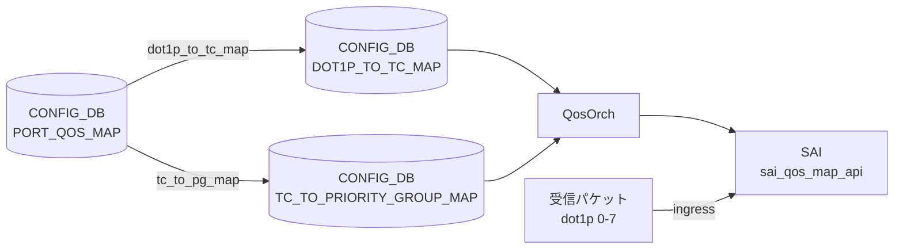

# DOT1P_TO_PG_MAP テーブル

!!! warning "このテーブルは SONiC に存在しない"
    `DOT1P_TO_PG_MAP` という CONFIG_DB テーブルは SONiC master ブランチに存在しない。dot1p (IEEE 802.1p Priority Code Point) から Priority Group (PG) へのマッピングは **2 段構成** で実現される。

## 概要

SONiC の QoS アーキテクチャでは dot1p 値を PG に直接マッピングするテーブルを持たない。実際の経路は以下のとおり:

```
dot1p (0-7)
  ──→ Traffic Class  (DOT1P_TO_TC_MAP テーブル)
  ──→ Priority Group (TC_TO_PRIORITY_GROUP_MAP テーブル)
```

`PORT_QOS_MAP` テーブルの `dot1p_to_tc_map` leaf と `tc_to_pg_map` leaf を組み合わせることで、入口ポートの dot1p 値が最終的に ingress buffer priority group へ到達する。

## 実際のアーキテクチャ

<!-- cdb-mermaid -->
### データフロー


<!-- /cdb-mermaid -->

### 段階 1 — dot1p → Traffic Class

`DOT1P_TO_TC_MAP|<name>` テーブルに dot1p 値（0-7）→ Traffic Class 値（0-7）のエントリを定義する。`PORT_QOS_MAP.<port>.dot1p_to_tc_map` から参照される。`qosorch` が `SAI_QOS_MAP_TYPE_DOT1P_TO_TC` オブジェクトを生成する。

詳細: [DOT1P_TO_TC_MAP](dot1p-to-tc-map.md)

### 段階 2 — Traffic Class → Priority Group

`TC_TO_PRIORITY_GROUP_MAP|<name>` テーブルに TC 値（0-7）→ PG 値（0-7）のエントリを定義する。`PORT_QOS_MAP.<port>.tc_to_pg_map` から参照される。`qosorch` が `SAI_QOS_MAP_TYPE_TC_TO_PRIORITY_GROUP` オブジェクトを生成する。

詳細: [TC_TO_PRIORITY_GROUP_MAP](tc-to-priority-group-map.md)

## コード証拠

`qosorch.cpp:80-96` の `m_qos_maps` 初期化リストには以下のテーブルが登録されているが、`DOT1P_TO_PG_MAP` は含まれない[^1]:

```cpp
type_map QosOrch::m_qos_maps = {
    {CFG_DSCP_TO_TC_MAP_TABLE_NAME, ...},
    {CFG_DOT1P_TO_TC_MAP_TABLE_NAME, ...},       // "DOT1P_TO_TC_MAP"
    {CFG_TC_TO_PRIORITY_GROUP_MAP_TABLE_NAME, ...}, // "TC_TO_PRIORITY_GROUP_MAP"
    // DOT1P_TO_PG_MAP に対応するエントリはない
    ...
};
```

`sonic-buildimage/src/sonic-yang-models/yang-models/` には `sonic-dot1p-pg-map.yang` も存在しない[^2]。

<!-- defaults -->
## 暗黙デフォルト・コード由来挙動

`DOT1P_TO_PG_MAP` テーブル自体が存在しないため、フィールドデフォルトは定義されない。2 段マッピングを構成する各テーブルのデフォルトは以下のとおり:

### DOT1P_TO_TC_MAP のデフォルト（段階 1）

| フィールド | デフォルト有無 | 内容 |
|-----------|--------------|------|
| `name` | プラットフォーム依存 | ストレージバックエンドプラットフォームのみ `qos_config.j2` が `AZURE` という名前のマップを自動注入する |
| `dot1p` | なし | 0-7 の値を明示的に設定する必要あり |
| `tc` | なし | 0-7 の Traffic Class 値を明示的に設定する必要あり |

ストレージバックエンドプラットフォームで注入されるデフォルト値（`qos_config.j2`）:

```json
{
  "DOT1P_TO_TC_MAP": {
    "AZURE": {
      "0": "1",
      "1": "0",
      "2": "2",
      "3": "3",
      "4": "4",
      "5": "5",
      "6": "6",
      "7": "7"
    }
  }
}
```

> dot1p=1（Background）を TC=0 へ、dot1p=0（Best Effort）を TC=1 へとスワップしている点に注意。

### TC_TO_PRIORITY_GROUP_MAP のデフォルト（段階 2）

`qos_config.j2` の `generate_tc_to_pg_map()` マクロが platform 別に生成する。マクロが未定義の platform ではビルド時デフォルトなし（`PORT_QOS_MAP.tc_to_pg_map` が未設定となる）。

<!-- /defaults -->

<!-- ordering -->
## 書込み順依存 (Phase B)

`DOT1P_TO_PG_MAP` テーブルは存在しないため、実際の 2 段マッピングチェーン全体の書き込み順依存を記述する。

### allPortsReady() ブロック

`QosOrch::doTask()` (`qosorch.cpp:2258`) は `gPortsOrch->allPortsReady()` が false の間は即 return する。`DOT1P_TO_TC_MAP`・`TC_TO_PRIORITY_GROUP_MAP`・`PORT_QOS_MAP` すべての処理が**完全にブロック**される。orchdaemon が PortsOrch の初期化完了を保証するため通常は意識不要だが、起動シーケンス中の早期書き込みは処理待ちになる。

### SET 順序（マップ先行）

```
SET DOT1P_TO_TC_MAP|<map_name>          # 段階 1 マップを先に作成
SET TC_TO_PRIORITY_GROUP_MAP|<pg_name>  # 段階 2 マップを先に作成
SET PORT_QOS_MAP|<port>  dot1p_to_tc_map=<map_name> tc_to_pg_map=<pg_name>
```

`handlePortQosMapTable()` (`qosorch.cpp:2124`) は `resolveFieldRefValue()` を呼び、参照先マップが未作成の場合は `task_need_retry` を返す。orchagent のメインループで自動リトライされるが、マップが存在するまで PORT_QOS_MAP の SAI 反映はブロックされる。

### DEL 順序（参照元先行）

```
DEL PORT_QOS_MAP|<port>                 # 参照を先に解除
DEL DOT1P_TO_TC_MAP|<map_name>          # 参照がなくなってから削除
DEL TC_TO_PRIORITY_GROUP_MAP|<pg_name>  # 参照がなくなってから削除
```

汎用マップハンドラ (`qosorch.cpp:181`) は `isObjectBeingReferenced()` が true の間は DEL 要求に対して `m_pendingRemove=true` をセットして `task_need_retry` を返す。`PORT_QOS_MAP` の参照が解除されるまで SAI 削除は実行されない。

### 依存関係サマリ

| 依存関係 | 方向 | 緩和策 |
|---------|------|-------|
| allPortsReady() 完了 → 全 QosOrch 処理 | 強制先行 | orchdaemon が自動管理 |
| DOT1P_TO_TC_MAP SET → PORT_QOS_MAP SET (dot1p_to_tc_map) | 必須先行 | task_need_retry で自動リトライ |
| TC_TO_PRIORITY_GROUP_MAP SET → PORT_QOS_MAP SET (tc_to_pg_map) | 必須先行 | task_need_retry で自動リトライ |
| PORT_QOS_MAP DEL → DOT1P_TO_TC_MAP DEL | 必須先行 | m_pendingRemove + task_need_retry |
| PORT_QOS_MAP DEL → TC_TO_PRIORITY_GROUP_MAP DEL | 必須先行 | m_pendingRemove + task_need_retry |

> **スキャン証跡**: `QosOrch::doTask()` L2254-2299、`handlePortQosMapTable()` L2046-2134、汎用マップハンドラ L130-196 参照。
<!-- /ordering -->

## 制約

- `DOT1P_TO_PG_MAP` テーブルは存在しないため、このキー名で CONFIG_DB に書き込んでも `qosorch` は無視する
- 実際の dot1p → PG 経路を設定するには `DOT1P_TO_TC_MAP`、`TC_TO_PRIORITY_GROUP_MAP`、`PORT_QOS_MAP` の 3 テーブルを適切に設定する必要がある

## 関連 CONFIG_DB / YANG / CLI

- 関連 [CONFIG_DB](../../reference/glossary.md#term-config_db): `DOT1P_TO_TC_MAP`、`TC_TO_PRIORITY_GROUP_MAP`、`PORT_QOS_MAP`
- 関連 CLI: `config qos`

## 引用元

[^1]: QosOrch m_qos_maps 初期化: `sonic-swss/orchagent/qosorch.cpp:80-96`. <https://github.com/sonic-net/sonic-swss/blob/master/orchagent/qosorch.cpp>
[^2]: YANG モデル一覧: `sonic-buildimage/src/sonic-yang-models/yang-models/`. <https://github.com/sonic-net/sonic-buildimage/tree/master/src/sonic-yang-models/yang-models>

## 関連ページ

- [CONFIG_DB: DOT1P_TO_TC_MAP](dot1p-to-tc-map.md)
- [CONFIG_DB: TC_TO_PRIORITY_GROUP_MAP](tc-to-priority-group-map.md)
- [CONFIG_DB: PORT_QOS_MAP](port-qos-map.md)
