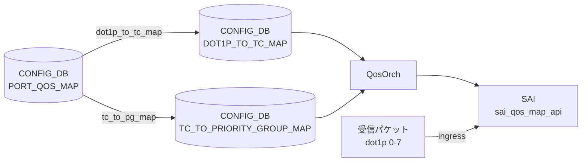

# DOT1P_TO_PG_MAP テーブル

!!! warning "このテーブルは SONiC に存在しない"
    `DOT1P_TO_PG_MAP` という CONFIG_DB テーブルは SONiC master ブランチに存在しない。dot1p (IEEE 802.1p Priority Code Point) から Priority Group (PG) へのマッピングは **2 段構成** で実現される。

## 概要

SONiC の QoS アーキテクチャでは dot1p 値を PG に直接マッピングするテーブルを持たない。実際の経路は以下のとおり:

```
dot1p (0-7)
  ──→ Traffic Class  (DOT1P_TO_TC_MAP テーブル)
  ──→ Priority Group (TC_TO_PRIORITY_GROUP_MAP テーブル)
```

`PORT_QOS_MAP` テーブルの `dot1p_to_tc_map` leaf と `tc_to_pg_map` leaf を組み合わせることで、入口ポートの dot1p 値が最終的に ingress buffer priority group へ到達する。

## 実際のアーキテクチャ

<!-- cdb-mermaid -->
### データフロー


<!-- /cdb-mermaid -->

### 段階 1 — dot1p → Traffic Class

`DOT1P_TO_TC_MAP|<name>` テーブルに dot1p 値（0-7）→ Traffic Class 値（0-7）のエントリを定義する。`PORT_QOS_MAP.<port>.dot1p_to_tc_map` から参照される。`qosorch` が `SAI_QOS_MAP_TYPE_DOT1P_TO_TC` オブジェクトを生成する。

詳細: [DOT1P_TO_TC_MAP](dot1p-to-tc-map.md)

### 段階 2 — Traffic Class → Priority Group

`TC_TO_PRIORITY_GROUP_MAP|<name>` テーブルに TC 値（0-7）→ PG 値（0-7）のエントリを定義する。`PORT_QOS_MAP.<port>.tc_to_pg_map` から参照される。`qosorch` が `SAI_QOS_MAP_TYPE_TC_TO_PRIORITY_GROUP` オブジェクトを生成する。

詳細: [TC_TO_PRIORITY_GROUP_MAP](tc-to-priority-group-map.md)

## コード証拠

`qosorch.cpp:80-96` の `m_qos_maps` 初期化リストには以下のテーブルが登録されているが、`DOT1P_TO_PG_MAP` は含まれない[^1]:

```cpp
type_map QosOrch::m_qos_maps = {
    {CFG_DSCP_TO_TC_MAP_TABLE_NAME, ...},
    {CFG_DOT1P_TO_TC_MAP_TABLE_NAME, ...},       // "DOT1P_TO_TC_MAP"
    {CFG_TC_TO_PRIORITY_GROUP_MAP_TABLE_NAME, ...}, // "TC_TO_PRIORITY_GROUP_MAP"
    // DOT1P_TO_PG_MAP に対応するエントリはない
    ...
};
```

`sonic-buildimage/src/sonic-yang-models/yang-models/` には `sonic-dot1p-pg-map.yang` も存在しない[^2]。

<!-- defaults -->
## 暗黙デフォルト・コード由来挙動

`DOT1P_TO_PG_MAP` テーブル自体が存在しないため、フィールドデフォルトは定義されない。2 段マッピングを構成する各テーブルのデフォルトは以下のとおり:

### DOT1P_TO_TC_MAP のデフォルト（段階 1）

| フィールド | デフォルト有無 | 内容 |
|-----------|--------------|------|
| `name` | プラットフォーム依存 | ストレージバックエンドプラットフォームのみ `qos_config.j2` が `AZURE` という名前のマップを自動注入する |
| `dot1p` | なし | 0-7 の値を明示的に設定する必要あり |
| `tc` | なし | 0-7 の Traffic Class 値を明示的に設定する必要あり |

ストレージバックエンドプラットフォームで注入されるデフォルト値（`qos_config.j2`）:

```json
{
  "DOT1P_TO_TC_MAP": {
    "AZURE": {
      "0": "1",
      "1": "0",
      "2": "2",
      "3": "3",
      "4": "4",
      "5": "5",
      "6": "6",
      "7": "7"
    }
  }
}
```

> dot1p=1（Background）を TC=0 へ、dot1p=0（Best Effort）を TC=1 へとスワップしている点に注意。

### TC_TO_PRIORITY_GROUP_MAP のデフォルト（段階 2）

`qos_config.j2` の `generate_tc_to_pg_map()` マクロが platform 別に生成する。マクロが未定義の platform ではビルド時デフォルトなし（`PORT_QOS_MAP.tc_to_pg_map` が未設定となる）。

<!-- /defaults -->

<!-- ordering -->
## 書込み順依存 (Phase B)

`DOT1P_TO_PG_MAP` テーブル自体は存在しないが、同等の機能を実現する 2 段マッピング (`DOT1P_TO_TC_MAP` → `TC_TO_PRIORITY_GROUP_MAP` → `PORT_QOS_MAP`) には `qosorch` (`handlePortQosMapTable`) が強制する書き込み順序依存がある。

### 検出された順序依存

| # | 依存関係 | 方向 | 緩和策 |
|---|----------|------|--------|
| 1 | `DOT1P_TO_TC_MAP\|<name>` 先行作成 → `PORT_QOS_MAP.<port>.dot1p_to_tc_map` 参照 | **先行必須** (`task_need_retry`) | `resolveFieldRefValue` が未解決の場合 `task_need_retry` を返し Consumer が自動再キュー |
| 2 | `TC_TO_PRIORITY_GROUP_MAP\|<name>` 先行作成 → `PORT_QOS_MAP.<port>.tc_to_pg_map` 参照 | **先行必須** (`task_need_retry`) | 同上 — マップオブジェクトが未生成の間 `PORT_QOS_MAP` は保留される |
| 3 | `PORT_QOS_MAP` 適用 → SAI `set_port_attribute` | マップ全フィールド解決後に一括適用 | `update_list` に積んでから `sai_port_api->set_port_attribute` をまとめて呼ぶ |
| 4 | `DOT1P_TO_TC_MAP` → `TC_TO_PRIORITY_GROUP_MAP` 相互依存 | 独立（順序自由） | 両マップは独立して生成可能。`PORT_QOS_MAP` が両方を参照する時点で揃えばよい |

### 主要な制約詳細

**`PORT_QOS_MAP` は参照先マップ不在時に `task_need_retry` を返す (依存 #1, #2)**: `handlePortQosMapTable()` は `qos_to_attr_map` 内の各フィールドに対して `resolveFieldRefValue(m_qos_maps, map_type_name, ...)` を呼ぶ。`DOT1P_TO_TC_MAP` または `TC_TO_PRIORITY_GROUP_MAP` のいずれかが `m_qos_maps` に未登録の状態では `ref_resolve_status::success` にならず `task_need_retry` が返る。Consumer はこのエントリを再キューし、参照先マップが作成された後に再実行する（evidence: `qosorch.cpp:2077-2083`, `qosorch.cpp:2122-2126`）。

**2 段マッピングの SAI 適用はまとめて実行 (依存 #3)**: `handlePortQosMapTable()` は全フィールドの参照解決が揃った後、`update_list` に `<sai_port_attr_t, sai_object_id_t>` ペアを積み、`sai_port_api->set_port_attribute()` を順番に呼ぶ。`DOT1P_TO_TC_MAP` 由来の `SAI_PORT_ATTR_QOS_DOT1P_TO_TC_MAP` と `TC_TO_PRIORITY_GROUP_MAP` 由来の `SAI_PORT_ATTR_QOS_TC_TO_PRIORITY_GROUP_MAP` は同一 `PORT_QOS_MAP` エントリの処理内でそれぞれ独立して `set_port_attribute` される（evidence: `qosorch.cpp:2132-2156`）。
<!-- /ordering -->

<!-- cross-refs -->
## 暗黙参照 — `qosorch` / `handlePortQosMapTable` が読み出す関連テーブル (Phase C)

`DOT1P_TO_PG_MAP` テーブルは存在しないが、等価な 2 段マッピング経路 (`DOT1P_TO_TC_MAP` → `TC_TO_PRIORITY_GROUP_MAP` → `PORT_QOS_MAP`) を処理する `qosorch` が参照する CONFIG_DB テーブルおよび外部リソースは以下のとおり。

| 参照先テーブル / リソース | 参照方向 | 条件 | evidence |
|--------------------------|---------|------|---------|
| `DOT1P_TO_TC_MAP\|<name>` (CONFIG_DB) | 被参照 (`resolveFieldRefValue`) | `PORT_QOS_MAP` エントリ SET 時に `dot1p_to_tc_map` フィールドが存在する場合。未解決なら `task_need_retry` | `qosorch.cpp:102`, `qosorch.cpp:2124` |
| `TC_TO_PRIORITY_GROUP_MAP\|<name>` (CONFIG_DB) | 被参照 (`resolveFieldRefValue`) | `PORT_QOS_MAP` エントリ SET 時に `tc_to_pg_map` フィールドが存在する場合。未解決なら `task_need_retry` | `qosorch.cpp:106`, `qosorch.cpp:2124` |
| `PORT_QOS_MAP\|<port_name>` (CONFIG_DB) | 参照元（2 段マップの最終適用対象） | 常時。`dot1p_to_tc_map` / `tc_to_pg_map` フィールドを通じて 2 つのマップを取り込み、SAI に適用 | `qosorch.cpp:2046-2156` |
| `PORT` (PortsOrch `gPortsOrch->getPort()`) | ポート存在チェック | `PORT_QOS_MAP` の key が `global` でない場合。未登録ポートはエラーログ + `continue` でスキップ | `qosorch.cpp:28`, `qosorch.cpp:2068` |

!!! note "SWITCH レベル direct 適用は DSCP_TO_TC のみ"
    `handleGlobalQosMap()` 経路 (`PORT_QOS_MAP|global`) で SWITCH に直接適用されるのは `DSCP_TO_TC_MAP` のみ (`qosorch.cpp:1956`)。
    `dot1p_to_tc_map` / `tc_to_pg_map` は `PORT_QOS_MAP|global` 経由の SWITCH 直接設定には対応しておらず、常にポート単位の `set_port_attribute` 経由で適用される。

!!! note "`BUFFER_PG` / `DEVICE_METADATA` は非参照"
    `qosorch.cpp` の `handlePortQosMapTable()` は `BUFFER_PG`、`BUFFER_QUEUE`、`DEVICE_METADATA` を直接参照しない。
    PG バッファ割り当ては `BufferOrch` が担当し、`TC_TO_PRIORITY_GROUP_MAP` の SAI 適用後に独立して処理される。

詳細スキャン手順と grep 結果は `meta/_intermediate/cdb-flow/dot1p-to-pg-map-cross-refs.md` を参照。
<!-- /cross-refs -->

<!-- failure -->
## 失敗挙動・retry / recovery (Phase D)

<!-- evidence: meta/_intermediate/cdb-flow/dot1p-to-pg-map-failure.md -->

### DOT1P_TO_PG_MAP 自体への書き込み — 無視

`DOT1P_TO_PG_MAP` テーブルは `m_qos_maps` 初期化リストに登録されていないため、このキー名で CONFIG_DB に書き込んでも `qosorch` はイベントを受信せず無視する。エラーログは発生しない。

### retry パターン概要

2 段マッピング経路 (`DOT1P_TO_TC_MAP` + `TC_TO_PRIORITY_GROUP_MAP`) の失敗挙動は `task_process_status` パターンで管理される。

| パターン | 代表的なトリガー | 挙動 |
|---|---|---|
| **`task_need_retry`** | `dot1p_to_tc_map` / `tc_to_pg_map` 参照先マップ未作成、`pending_remove` 中の SET | `m_toSync` に残し次 doTask() で再試行。上限なし |
| **`task_failed`** | SAI `create_qos_map` / `set_port_attribute` 失敗、`resolveFieldRefValue` 内部エラー、`dot1p` 非数値文字列 | エントリ削除。retry なし |

### フィールド別 failure 詳細

#### `dot1p` 値の変換失敗

`Dot1pToTcMapHandler::addQosItem()` は `stoi()` で dot1p 文字列を変換する際に例外処理ガードがない。非数値文字列を書くと `std::invalid_argument` 例外が伝播し `task_failed` となる。(`qosorch.cpp:360-427`)

#### DEL 時の参照ロック (`pending_remove`)

`PORT_QOS_MAP.<port>.dot1p_to_tc_map` から参照されている間は `DOT1P_TO_TC_MAP` の DEL がブロックされ `task_need_retry` が返る。推奨 DEL 順序: `PORT_QOS_MAP` の参照フィールドを先に除去 → `DOT1P_TO_TC_MAP` を DEL。`pending_remove` フラグが立っている間は同エントリへの SET も `task_need_retry` でブロックされる。(`qosorch.cpp:136-139`, `181-191` 相当)

#### `resolveFieldRefValue` 失敗 (PORT_QOS_MAP 経路)

`dot1p_to_tc_map` / `tc_to_pg_map` フィールドの参照解決で `not_resolved`（マップ未作成）の場合は `task_need_retry`、その他内部エラーの場合は `SWSS_LOG_ERROR "Failed to resolve field ..."` → `task_failed`。(`qosorch.cpp:2077-2083`, `qosorch.cpp:2122-2126`)

#### 存在しないポート名

`handlePortQosMapTable()` は未登録ポートを `SWSS_LOG_ERROR "Port with alias: ... not found"` を出力して `continue` でスキップし、エントリ全体は `task_success` 扱いとなる。(`qosorch.cpp:2068`)

#### SAI `set_port_attribute` 失敗

`SAI_PORT_ATTR_QOS_DOT1P_TO_TC_MAP` / `SAI_PORT_ATTR_QOS_TC_TO_PRIORITY_GROUP_MAP` の `set_port_attribute` 失敗は `handleSaiSetStatus()` を経由して retry / 永続失敗に分岐する。複数属性を順番に適用するため途中での失敗は**部分適用**が残る。rollback なし。QosOrch は STATE_DB / ERROR_TABLE への失敗記録を行わないため、反映状況の確認は `sonic-db-cli ASIC_DB hgetall` が必要。
<!-- /failure -->

## 制約

- `DOT1P_TO_PG_MAP` テーブルは存在しないため、このキー名で CONFIG_DB に書き込んでも `qosorch` は無視する
- 実際の dot1p → PG 経路を設定するには `DOT1P_TO_TC_MAP`、`TC_TO_PRIORITY_GROUP_MAP`、`PORT_QOS_MAP` の 3 テーブルを適切に設定する必要がある

## 関連 CONFIG_DB / YANG / CLI

- 関連 [CONFIG_DB](../../reference/glossary.md#term-config_db): `DOT1P_TO_TC_MAP`、`TC_TO_PRIORITY_GROUP_MAP`、`PORT_QOS_MAP`
- 関連 CLI: `config qos`

## 引用元

[^1]: QosOrch m_qos_maps 初期化: `sonic-swss/orchagent/qosorch.cpp:80-96`. <https://github.com/sonic-net/sonic-swss/blob/master/orchagent/qosorch.cpp>
[^2]: YANG モデル一覧: `sonic-buildimage/src/sonic-yang-models/yang-models/`. <https://github.com/sonic-net/sonic-buildimage/tree/master/src/sonic-yang-models/yang-models>

## 関連ページ

- [CONFIG_DB: DOT1P_TO_TC_MAP](dot1p-to-tc-map.md)
- [CONFIG_DB: TC_TO_PRIORITY_GROUP_MAP](tc-to-priority-group-map.md)
- [CONFIG_DB: PORT_QOS_MAP](port-qos-map.md)
