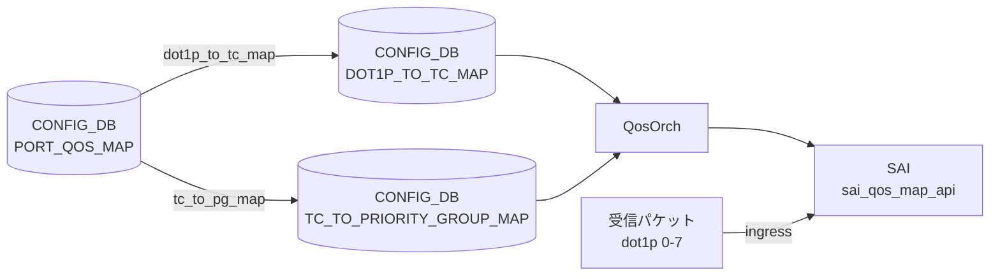

# DOT1P_TO_PG_MAP テーブル

!!! warning "このテーブルは SONiC に存在しない"
    `DOT1P_TO_PG_MAP` という CONFIG_DB テーブルは SONiC master ブランチに存在しない。dot1p (IEEE 802.1p Priority Code Point) から Priority Group (PG) へのマッピングは **2 段構成** で実現される。

## 概要

SONiC の QoS アーキテクチャでは dot1p 値を PG に直接マッピングするテーブルを持たない。実際の経路は以下のとおり:

```
dot1p (0-7)
  ──→ Traffic Class  (DOT1P_TO_TC_MAP テーブル)
  ──→ Priority Group (TC_TO_PRIORITY_GROUP_MAP テーブル)
```

`PORT_QOS_MAP` テーブルの `dot1p_to_tc_map` leaf と `tc_to_pg_map` leaf を組み合わせることで、入口ポートの dot1p 値が最終的に ingress buffer priority group へ到達する。

## 実際のアーキテクチャ

<!-- cdb-mermaid -->
### データフロー


<!-- /cdb-mermaid -->

### 段階 1 — dot1p → Traffic Class

`DOT1P_TO_TC_MAP|<name>` テーブルに dot1p 値（0-7）→ Traffic Class 値（0-7）のエントリを定義する。`PORT_QOS_MAP.<port>.dot1p_to_tc_map` から参照される。`qosorch` が `SAI_QOS_MAP_TYPE_DOT1P_TO_TC` オブジェクトを生成する。

詳細: [DOT1P_TO_TC_MAP](dot1p-to-tc-map.md)

### 段階 2 — Traffic Class → Priority Group

`TC_TO_PRIORITY_GROUP_MAP|<name>` テーブルに TC 値（0-7）→ PG 値（0-7）のエントリを定義する。`PORT_QOS_MAP.<port>.tc_to_pg_map` から参照される。`qosorch` が `SAI_QOS_MAP_TYPE_TC_TO_PRIORITY_GROUP` オブジェクトを生成する。

詳細: [TC_TO_PRIORITY_GROUP_MAP](tc-to-priority-group-map.md)

## コード証拠

`qosorch.cpp:80-96` の `m_qos_maps` 初期化リストには以下のテーブルが登録されているが、`DOT1P_TO_PG_MAP` は含まれない[^1]:

```cpp
type_map QosOrch::m_qos_maps = {
    {CFG_DSCP_TO_TC_MAP_TABLE_NAME, ...},
    {CFG_DOT1P_TO_TC_MAP_TABLE_NAME, ...},       // "DOT1P_TO_TC_MAP"
    {CFG_TC_TO_PRIORITY_GROUP_MAP_TABLE_NAME, ...}, // "TC_TO_PRIORITY_GROUP_MAP"
    // DOT1P_TO_PG_MAP に対応するエントリはない
    ...
};
```

`sonic-buildimage/src/sonic-yang-models/yang-models/` には `sonic-dot1p-pg-map.yang` も存在しない[^2]。

<!-- defaults -->
## 暗黙デフォルト・コード由来挙動

`DOT1P_TO_PG_MAP` テーブル自体が存在しないため、フィールドデフォルトは定義されない。2 段マッピングを構成する各テーブルのデフォルトは以下のとおり:

### DOT1P_TO_TC_MAP のデフォルト（段階 1）

| フィールド | デフォルト有無 | 内容 |
|-----------|--------------|------|
| `name` | プラットフォーム依存 | ストレージバックエンドプラットフォームのみ `qos_config.j2` が `AZURE` という名前のマップを自動注入する |
| `dot1p` | なし | 0-7 の値を明示的に設定する必要あり |
| `tc` | なし | 0-7 の Traffic Class 値を明示的に設定する必要あり |

ストレージバックエンドプラットフォームで注入されるデフォルト値（`qos_config.j2`）:

```json
{
  "DOT1P_TO_TC_MAP": {
    "AZURE": {
      "0": "1",
      "1": "0",
      "2": "2",
      "3": "3",
      "4": "4",
      "5": "5",
      "6": "6",
      "7": "7"
    }
  }
}
```

> dot1p=1（Background）を TC=0 へ、dot1p=0（Best Effort）を TC=1 へとスワップしている点に注意。

### TC_TO_PRIORITY_GROUP_MAP のデフォルト（段階 2）

`qos_config.j2` の `generate_tc_to_pg_map()` マクロが platform 別に生成する。マクロが未定義の platform ではビルド時デフォルトなし（`PORT_QOS_MAP.tc_to_pg_map` が未設定となる）。

<!-- /defaults -->

<!-- ordering -->
## 書込み順依存 (Phase B)

`DOT1P_TO_PG_MAP` テーブル自体は存在しないが、同等の機能を実現する 2 段マッピング (`DOT1P_TO_TC_MAP` → `TC_TO_PRIORITY_GROUP_MAP` → `PORT_QOS_MAP`) には `qosorch` (`handlePortQosMapTable`) が強制する書き込み順序依存がある。

### 検出された順序依存

| # | 依存関係 | 方向 | 緩和策 |
|---|----------|------|--------|
| 1 | `DOT1P_TO_TC_MAP\|<name>` 先行作成 → `PORT_QOS_MAP.<port>.dot1p_to_tc_map` 参照 | **先行必須** (`task_need_retry`) | `resolveFieldRefValue` が未解決の場合 `task_need_retry` を返し Consumer が自動再キュー |
| 2 | `TC_TO_PRIORITY_GROUP_MAP\|<name>` 先行作成 → `PORT_QOS_MAP.<port>.tc_to_pg_map` 参照 | **先行必須** (`task_need_retry`) | 同上 — マップオブジェクトが未生成の間 `PORT_QOS_MAP` は保留される |
| 3 | `PORT_QOS_MAP` 適用 → SAI `set_port_attribute` | マップ全フィールド解決後に一括適用 | `update_list` に積んでから `sai_port_api->set_port_attribute` をまとめて呼ぶ |
| 4 | `DOT1P_TO_TC_MAP` → `TC_TO_PRIORITY_GROUP_MAP` 相互依存 | 独立（順序自由） | 両マップは独立して生成可能。`PORT_QOS_MAP` が両方を参照する時点で揃えばよい |

### 主要な制約詳細

**`PORT_QOS_MAP` は参照先マップ不在時に `task_need_retry` を返す (依存 #1, #2)**: `handlePortQosMapTable()` は `qos_to_attr_map` 内の各フィールドに対して `resolveFieldRefValue(m_qos_maps, map_type_name, ...)` を呼ぶ。`DOT1P_TO_TC_MAP` または `TC_TO_PRIORITY_GROUP_MAP` のいずれかが `m_qos_maps` に未登録の状態では `ref_resolve_status::success` にならず `task_need_retry` が返る。Consumer はこのエントリを再キューし、参照先マップが作成された後に再実行する（evidence: `qosorch.cpp:2077-2083`, `qosorch.cpp:2122-2126`）。

**2 段マッピングの SAI 適用はまとめて実行 (依存 #3)**: `handlePortQosMapTable()` は全フィールドの参照解決が揃った後、`update_list` に `<sai_port_attr_t, sai_object_id_t>` ペアを積み、`sai_port_api->set_port_attribute()` を順番に呼ぶ。`DOT1P_TO_TC_MAP` 由来の `SAI_PORT_ATTR_QOS_DOT1P_TO_TC_MAP` と `TC_TO_PRIORITY_GROUP_MAP` 由来の `SAI_PORT_ATTR_QOS_TC_TO_PRIORITY_GROUP_MAP` は同一 `PORT_QOS_MAP` エントリの処理内でそれぞれ独立して `set_port_attribute` される（evidence: `qosorch.cpp:2132-2156`）。
<!-- /ordering -->

<!-- cross-refs -->
## 暗黙参照 — `qosorch` / `handlePortQosMapTable` が読み出す関連テーブル (Phase C)

`DOT1P_TO_PG_MAP` テーブルは存在しないが、等価な 2 段マッピング経路 (`DOT1P_TO_TC_MAP` → `TC_TO_PRIORITY_GROUP_MAP` → `PORT_QOS_MAP`) を処理する `qosorch` が参照する CONFIG_DB テーブルおよび外部リソースは以下のとおり。

| 参照先テーブル / リソース | 参照方向 | 条件 | evidence |
|--------------------------|---------|------|---------|
| `DOT1P_TO_TC_MAP\|<name>` (CONFIG_DB) | 被参照 (`resolveFieldRefValue`) | `PORT_QOS_MAP` エントリ SET 時に `dot1p_to_tc_map` フィールドが存在する場合。未解決なら `task_need_retry` | `qosorch.cpp:102`, `qosorch.cpp:2124` |
| `TC_TO_PRIORITY_GROUP_MAP\|<name>` (CONFIG_DB) | 被参照 (`resolveFieldRefValue`) | `PORT_QOS_MAP` エントリ SET 時に `tc_to_pg_map` フィールドが存在する場合。未解決なら `task_need_retry` | `qosorch.cpp:106`, `qosorch.cpp:2124` |
| `PORT_QOS_MAP\|<port_name>` (CONFIG_DB) | 参照元（2 段マップの最終適用対象） | 常時。`dot1p_to_tc_map` / `tc_to_pg_map` フィールドを通じて 2 つのマップを取り込み、SAI に適用 | `qosorch.cpp:2046-2156` |
| `PORT` (PortsOrch `gPortsOrch->getPort()`) | ポート存在チェック | `PORT_QOS_MAP` の key が `global` でない場合。未登録ポートはエラーログ + `continue` でスキップ | `qosorch.cpp:28`, `qosorch.cpp:2068` |

!!! note "SWITCH レベル direct 適用は DSCP_TO_TC のみ"
    `handleGlobalQosMap()` 経路 (`PORT_QOS_MAP|global`) で SWITCH に直接適用されるのは `DSCP_TO_TC_MAP` のみ (`qosorch.cpp:1956`)。
    `dot1p_to_tc_map` / `tc_to_pg_map` は `PORT_QOS_MAP|global` 経由の SWITCH 直接設定には対応しておらず、常にポート単位の `set_port_attribute` 経由で適用される。

!!! note "`BUFFER_PG` / `DEVICE_METADATA` は非参照"
    `qosorch.cpp` の `handlePortQosMapTable()` は `BUFFER_PG`、`BUFFER_QUEUE`、`DEVICE_METADATA` を直接参照しない。
    PG バッファ割り当ては `BufferOrch` が担当し、`TC_TO_PRIORITY_GROUP_MAP` の SAI 適用後に独立して処理される。

詳細スキャン手順と grep 結果は `meta/_intermediate/cdb-flow/dot1p-to-pg-map-cross-refs.md` を参照。
<!-- /cross-refs -->

<!-- failure -->
## 失敗挙動・retry / recovery (Phase D)

<!-- evidence: meta/_intermediate/cdb-flow/dot1p-to-pg-map-failure.md -->

### DOT1P_TO_PG_MAP 自体への書き込み — 無視

`DOT1P_TO_PG_MAP` テーブルは `m_qos_maps` 初期化リストに登録されていないため、このキー名で CONFIG_DB に書き込んでも `qosorch` はイベントを受信せず無視する。エラーログは発生しない。

### retry パターン概要

2 段マッピング経路 (`DOT1P_TO_TC_MAP` + `TC_TO_PRIORITY_GROUP_MAP`) の失敗挙動は `task_process_status` パターンで管理される。

| パターン | 代表的なトリガー | 挙動 |
|---|---|---|
| **`task_need_retry`** | `dot1p_to_tc_map` / `tc_to_pg_map` 参照先マップ未作成、`pending_remove` 中の SET | `m_toSync` に残し次 doTask() で再試行。上限なし |
| **`task_failed`** | SAI `create_qos_map` / `set_port_attribute` 失敗、`resolveFieldRefValue` 内部エラー、`dot1p` 非数値文字列 | エントリ削除。retry なし |

### フィールド別 failure 詳細

#### `dot1p` 値の変換失敗

`Dot1pToTcMapHandler::addQosItem()` は `stoi()` で dot1p 文字列を変換する際に例外処理ガードがない。非数値文字列を書くと `std::invalid_argument` 例外が伝播し `task_failed` となる。(`qosorch.cpp:360-427`)

#### DEL 時の参照ロック (`pending_remove`)

`PORT_QOS_MAP.<port>.dot1p_to_tc_map` から参照されている間は `DOT1P_TO_TC_MAP` の DEL がブロックされ `task_need_retry` が返る。推奨 DEL 順序: `PORT_QOS_MAP` の参照フィールドを先に除去 → `DOT1P_TO_TC_MAP` を DEL。`pending_remove` フラグが立っている間は同エントリへの SET も `task_need_retry` でブロックされる。(`qosorch.cpp:136-139`, `181-191` 相当)

#### `resolveFieldRefValue` 失敗 (PORT_QOS_MAP 経路)

`dot1p_to_tc_map` / `tc_to_pg_map` フィールドの参照解決で `not_resolved`（マップ未作成）の場合は `task_need_retry`、その他内部エラーの場合は `SWSS_LOG_ERROR "Failed to resolve field ..."` → `task_failed`。(`qosorch.cpp:2077-2083`, `qosorch.cpp:2122-2126`)

#### 存在しないポート名

`handlePortQosMapTable()` は未登録ポートを `SWSS_LOG_ERROR "Port with alias: ... not found"` を出力して `continue` でスキップし、エントリ全体は `task_success` 扱いとなる。(`qosorch.cpp:2068`)

#### SAI `set_port_attribute` 失敗

`SAI_PORT_ATTR_QOS_DOT1P_TO_TC_MAP` / `SAI_PORT_ATTR_QOS_TC_TO_PRIORITY_GROUP_MAP` の `set_port_attribute` 失敗は `handleSaiSetStatus()` を経由して retry / 永続失敗に分岐する。複数属性を順番に適用するため途中での失敗は**部分適用**が残る。rollback なし。QosOrch は STATE_DB / ERROR_TABLE への失敗記録を行わないため、反映状況の確認は `sonic-db-cli ASIC_DB hgetall` が必要。
<!-- /failure -->

<!-- constants -->
## ハードコード定数 (Phase E)

> 調査証跡: `meta/_intermediate/cdb-flow/dot1p-to-pg-map-ordering.md`

`DOT1P_TO_PG_MAP` テーブルは存在しないため、2 段マッピングパイプライン (`DOT1P_TO_TC_MAP` → `TC_TO_PRIORITY_GROUP_MAP` → `PORT_QOS_MAP`) を構成するハードコード定数を記述する。出典は `qosorch.h`、`qosorch.cpp`、および各 YANG モジュール。

### CONFIG_DB フィールド名定数 (qosorch.h)

`PORT_QOS_MAP` テーブルのフィールド名は `qosorch.h` に `const string` としてハードコードされている。

| 定数名 | 値 | 用途 | ソース |
|-------|----|------|--------|
| `dot1p_to_tc_field_name` | `"dot1p_to_tc_map"` | `PORT_QOS_MAP.<port>.dot1p_to_tc_map` フィールド名。`DOT1P_TO_TC_MAP` へのリファレンス | qosorch.h L13 |
| `tc_to_pg_map_field_name` | `"tc_to_pg_map"` | `PORT_QOS_MAP.<port>.tc_to_pg_map` フィールド名。`TC_TO_PRIORITY_GROUP_MAP` へのリファレンス | qosorch.h L18 |

### SAI QOS マップタイプ定数

各ハンドラが SAI オブジェクト作成時に `qos_map_attr.value` にセットするハードコード定数。

| SAI 定数 | 使用箇所 | 意味 |
|----------|---------|------|
| `SAI_QOS_MAP_TYPE_DOT1P_TO_TC` | `qosorch.cpp:406` | dot1p → Traffic Class マップの SAI タイプ |
| `SAI_QOS_MAP_TYPE_TC_TO_PRIORITY_GROUP` | `qosorch.cpp:913` | TC → Priority Group マップの SAI タイプ |

> **重要**: `SAI_QOS_MAP_TYPE_DOT1P_TO_PRIORITY_GROUP` は SAI 仕様に存在しない。これが `DOT1P_TO_PG_MAP` テーブルが SONiC に存在しない根本理由の一つである。

### SAI ポート属性定数

`PORT_QOS_MAP` を SAI ポートオブジェクトに適用する際の属性 ID。

| SAI 定数 | 対応フィールド | ソース |
|----------|-------------|--------|
| `SAI_PORT_ATTR_QOS_DOT1P_TO_TC_MAP` | `dot1p_to_tc_map` | qosorch.cpp:63 |
| `SAI_PORT_ATTR_QOS_TC_TO_PRIORITY_GROUP_MAP` | `tc_to_pg_map` | qosorch.cpp:67 |

### YANG 値域制約（ハードコードパターン）

YANG バリデーションで強制される値域はコードではなく YANG ファイルにハードコードされている。

#### DOT1P_TO_TC_MAP の値域制約

| フィールド | YANG パターン / 型 | 許容値 | ソース |
|-----------|-----------------|--------|--------|
| `name` | `[a-zA-Z0-9]{1}([-a-zA-Z0-9_]{0,31})` | 英数字始まり、英数字・ハイフン・アンダースコア、最大 32 文字 | sonic-dot1p-tc-map.yang L41-44 |
| `dot1p` (key) | `"[0-7]?"` | `0`〜`7` の整数文字列のみ（空文字も YANG 上は許容） | sonic-dot1p-tc-map.yang L57-62 |
| `tc` (value) | `stypes:tc_type` (`uint8` range `0..15`) | `0`〜`15` | sonic-types.yang.j2 L338-345 |

#### TC_TO_PRIORITY_GROUP_MAP の値域制約

| フィールド | YANG パターン / 型 | 許容値 | ソース |
|-----------|-----------------|--------|--------|
| `name` | `[a-zA-Z0-9]{1}([-a-zA-Z0-9_]{0,31})` | 英数字始まり、最大 32 文字 | sonic-tc-priority-group-map.yang |
| `tc` (key) | `stypes:tc_type` (`uint8` range `0..15`) | `0`〜`15` | sonic-types.yang.j2 L338-345 |
| `pg` (value) | `"[0-7]?"` | `0`〜`7` または空文字 | sonic-tc-priority-group-map.yang |

> **注意**: `dot1p` と `pg` のパターン `[0-7]?` は空文字を許容するが、`qosorch.cpp` の `stoi()` 呼び出しは例外処理なしのため空文字列を与えると `std::invalid_argument` が送出され `task_failed` となる（`qosorch.cpp:377-382`, `qosorch.cpp:895`）。

> **Evidence**: `qosorch.h:13,18`; `qosorch.cpp:63,67,406,913`; `sonic-dot1p-tc-map.yang:41-67`; `sonic-types.yang.j2:338-345`
<!-- /constants -->

<!-- side-effects -->
## 副次 DB 書込み (Phase F)

> 調査証跡: `meta/_intermediate/cdb-flow/dot1p-to-pg-map-side-effects.md`

`DOT1P_TO_PG_MAP` テーブルは存在しないため、副次 DB 書込みは 2 段マッピングパイプライン (`DOT1P_TO_TC_MAP` → `TC_TO_PRIORITY_GROUP_MAP`) および `PORT_QOS_MAP` の処理に由来する。

### SET 時 — SAI 呼び出し (ASIC_DB)

| テーブル | SAI API | SAI 属性 |
|---------|--------|---------|
| `DOT1P_TO_TC_MAP` SET | `sai_qos_map_api->create_qos_map()` | `SAI_QOS_MAP_ATTR_TYPE = SAI_QOS_MAP_TYPE_DOT1P_TO_TC` + `SAI_QOS_MAP_ATTR_MAP_TO_VALUE_LIST` |
| `TC_TO_PRIORITY_GROUP_MAP` SET | `sai_qos_map_api->create_qos_map()` | `SAI_QOS_MAP_ATTR_TYPE = SAI_QOS_MAP_TYPE_TC_TO_PRIORITY_GROUP` + `SAI_QOS_MAP_ATTR_MAP_TO_VALUE_LIST` |
| `PORT_QOS_MAP` SET (`dot1p_to_tc_map` フィールド) | `sai_port_api->set_port_attribute()` | `SAI_PORT_ATTR_QOS_DOT1P_TO_TC_MAP` |
| `PORT_QOS_MAP` SET (`tc_to_pg_map` フィールド) | `sai_port_api->set_port_attribute()` | `SAI_PORT_ATTR_QOS_TC_TO_PRIORITY_GROUP_MAP` |

### DEL 時 — PFC ビットマスク クリア

`PORT_QOS_MAP` DEL 時に `gPortsOrch->setPortPfc(port.m_port_id, 0)` が呼ばれ、ポートの PFC ビットマスクが 0 にリセットされる (`qosorch.cpp:2100`)。これは QoS マップ削除に連動した暗黙的な副次効果である。

### TUNNEL_DECAP_TABLE への波及

`TC_TO_PRIORITY_GROUP_MAP` は `APP_TUNNEL_DECAP_TABLE` の `decap_tc_to_pg_map` フィールドからも参照される (`qosorch.cpp:114`)。`PORT_QOS_MAP` 経路と同じ OID が `resolveTunnelQosMap()` で解決され、トンネルデカップ処理に適用される。

### STATE_DB / COUNTERS_DB / FLEX_COUNTER_DB

`QosOrch` は `DOT1P_TO_TC_MAP` / `TC_TO_PRIORITY_GROUP_MAP` の SET/DEL において STATE_DB・COUNTERS_DB・FLEX_COUNTER_DB への直接書き込みを行わない。

<!-- evidence:
source: sonic-swss/orchagent/qosorch.cpp#L399-L420 (sha: master)
excerpt: |
  sai_status_t sai_status = sai_qos_map_api->create_qos_map(&object_id, gSwitchId, (uint32_t)attrs.size(), attrs.data());
reasoning: Dot1pToTcMapHandler::addQosItem が SAI create_qos_map を呼び出す。ASIC_DB に SAI OID が書き込まれる。
-->
<!-- evidence:
source: sonic-swss/orchagent/qosorch.cpp#L2086-L2106 (sha: master)
excerpt: |
  sai_status_t status = sai_port_api->set_port_attribute(port.m_port_id, &attr);
  ...
  if (!gPortsOrch->setPortPfc(port.m_port_id, 0))
reasoning: PORT_QOS_MAP DEL 時に set_port_attribute で各 SAI 属性を NULL OID にセットし、さらに setPortPfc(0) でPFCビットを無効化する。
-->
<!-- /side-effects -->

<!-- pubsub -->
## 通信メカニズム (Phase G)

`DOT1P_TO_PG_MAP` テーブルは存在しないが、等価な 2 段マッピング経路を処理する `QosOrch` の Redis 通信メカニズムを示す。

### Producer/Consumer ペア

| 区間 | 方式 | チャンネル / パターン |
|------|------|----------------------|
| CONFIG_DB → QosOrch (`DOT1P_TO_TC_MAP`) | `SubscriberStateTable` | `__keyspace@{config_db_id}__:DOT1P_TO_TC_MAP\|*` |
| CONFIG_DB → QosOrch (`TC_TO_PRIORITY_GROUP_MAP`) | `SubscriberStateTable` | `__keyspace@{config_db_id}__:TC_TO_PRIORITY_GROUP_MAP\|*` |
| CONFIG_DB → QosOrch (`PORT_QOS_MAP`) | `SubscriberStateTable` | `__keyspace@{config_db_id}__:PORT_QOS_MAP\|*` |
| QosOrch → SAI | SAI API 直接呼び出し | `sai_qos_map_api->create_qos_map()` / `sai_port_api->set_port_attribute()` |

### SubscriberStateTable の動作

`QosOrch` は `Orch(db, tableNames)` 基底クラスを介して `CFG_DOT1P_TO_TC_MAP_TABLE_NAME` / `CFG_TC_TO_PRIORITY_GROUP_MAP_TABLE_NAME` / `CFG_PORT_QOS_MAP_TABLE_NAME` など計 15 テーブルに対する `SubscriberStateTable` を登録する (`orchdaemon.cpp:365-384`)。keyspace notification (`PSUBSCRIBE __keyspace@db__:<table>|*`) でエントリ変化を検出し、`pops()` で現在値を読み出す。APPL_DB への中継は行わない。

### select() ループと doTask 実行順序

orchdaemon は `Select::select()` を 1000 ms タイムアウトで実行する。イベント受信時は `Consumer::drain()` → `QosOrch::doTask()` が呼ばれる。

`QosOrch::doTask()` (`qosorch.cpp:2231`) はカスタム drain 順序を実装する:

1. `PORT_QOS_MAP` と `QUEUE` を **除く** 全テーブルを先に drain（`DOT1P_TO_TC_MAP`、`TC_TO_PRIORITY_GROUP_MAP` を含む）
2. `PORT_QOS_MAP` を drain（参照先マップ解決済みの状態で実行）
3. 最後に `QUEUE` を drain

この順序により、`DOT1P_TO_TC_MAP` / `TC_TO_PRIORITY_GROUP_MAP` の SAI オブジェクト作成が `PORT_QOS_MAP` 処理より常に先行し、`task_need_retry` の発生を最小化する。

`doTask(Consumer&)` の冒頭では `gPortsOrch->allPortsReady()` チェックがあり、全ポート初期化完了まで処理を保留する (`qosorch.cpp:2254-2258`)。

### データフロー図

```
CONFIG_DB[DOT1P_TO_TC_MAP|<name>]
  ↓ SubscriberStateTable (keyspace notification)
  ↓ PSUBSCRIBE __keyspace@config_db_id__:DOT1P_TO_TC_MAP|*
orchdaemon select() loop (SELECT_TIMEOUT=1000ms)
  ↓ Consumer::drain() → QosOrch::doTask()
  ↓   [pass 1: 非 PORT_QOS_MAP/QUEUE テーブルを先に drain]
  ↓   → handleDot1pToTcTable() / handleTcToPgTable()
  ↓   → sai_qos_map_api->create_qos_map()
  ↓   [pass 2: PORT_QOS_MAP drain]
  ↓   → handlePortQosMapTable()
  ↓   → sai_port_api->set_port_attribute(SAI_PORT_ATTR_QOS_DOT1P_TO_TC_MAP)
  ↓   → sai_port_api->set_port_attribute(SAI_PORT_ATTR_QOS_TC_TO_PRIORITY_GROUP_MAP)
ASIC (sairedis → ASIC_DB 経由)

APPL_DB 書き込み: なし
STATE_DB 書き込み: なし
NotificationConsumer: なし
```

> **Evidence**: `sonic-swss/orchagent/orchdaemon.cpp:365-384`; `sonic-swss/orchagent/qosorch.cpp:1313,2231-2253`; `sonic-swss/orchagent/qosorch.cpp:1331` (`handleDot1pToTcTable` 登録)
<!-- /pubsub -->

<!-- platform -->
## プラットフォーム差異 (Phase H)

> 詳細証跡: `meta/_intermediate/cdb-flow/dot1p-to-pg-map-platform.md`

`DOT1P_TO_PG_MAP` テーブルは存在しないが、等価な 2 段マッピング経路
(`DOT1P_TO_TC_MAP` → `TC_TO_PRIORITY_GROUP_MAP` → `PORT_QOS_MAP`) を処理する
`QosOrch` のコードパスにプラットフォーム依存分岐が存在するかを調査した結果を示す。

### orchagent 実行時コードパス — プラットフォーム差異なし

`Dot1pToTcMapHandler::addQosItem()` / `convertFieldValuesToAttributes()` (`qosorch.cpp:360-427`) および
`TcToPgHandler::addQosItem()` (`qosorch.cpp:905-930`) のいずれにも `gMySwitchType` 参照が存在しない。
`handlePortQosMapTable()` (`qosorch.cpp:2046-2156`) も同様に platform 分岐なし。

`gMySwitchType == "voq"` 分岐は `handleQueueTable`・`applySchedulerToQueueSchedulerGroup`・
`applyWredProfileToQueue` にのみ存在し、dot1p 関連ハンドラには適用されない。

全 switch_type（standard / voq / dpu）で同一 SAI 経路（`sai_qos_map_api->create_qos_map()` /
`sai_port_api->set_port_attribute()`）が実行される。

### 初期設定注入のプラットフォーム差異（qos_config.j2）

`sonic-buildimage/files/build_templates/qos_config.j2` はストレージバックエンドプラットフォーム
（`DEVICE_METADATA['localhost']['type'] in backend_device_types` かつ
`storage_device == 'true'`）でのみ `DOT1P_TO_TC_MAP|AZURE` エントリと
`PORT_QOS_MAP.<port>.dot1p_to_tc_map=AZURE` を自動注入する。

| プラットフォーム条件 | 自動注入内容 |
|---------------------|-------------|
| ストレージバックエンド (`storage_device=true`) | `DOT1P_TO_TC_MAP|AZURE` (dot1p 0↔1 スワップ) + `PORT_QOS_MAP.<port>.dot1p_to_tc_map=AZURE` |
| 上記以外の全 platform | 注入なし（手動設定が必要） |

> **Evidence**: `sonic-swss/orchagent/qosorch.cpp:360-427,905-930,2046-2156`（platform 分岐なし）;
> `sonic-swss/orchagent/qosorch.cpp:1637,1715,1772`（voq 分岐は Queue/Wred 系のみ）;
> `sonic-buildimage/files/build_templates/qos_config.j2:240-252,435`（ストレージバックエンドのみ注入）
<!-- /platform -->

## 実装との乖離

`DOT1P_TO_PG_MAP` は名称としては想定可能だが、SONiC CONFIG_DB / YANG / OrchAgent のいずれにも実装されていない。dot1p → Priority Group マッピングは `DOT1P_TO_TC_MAP` と `TC_TO_PRIORITY_GROUP_MAP` の 2 段で構成する設計であり、本テーブルを単独で定義しても OrchAgent は購読しない。

| 乖離 | 期待（誤解されがちな設計） | 実装 (community master) | 根拠 |
|------|-------------------------|------------------------|------|
| `DOT1P_TO_PG_MAP` の存在 | dot1p から PG への直接マップを 1 テーブルで保持 | テーブル定義なし。`qosorch.cpp` の `m_qos_maps` に該当キー無し | `sonic-swss/orchagent/qosorch.cpp:80-96`[^1] |
| YANG モデル | `sonic-dot1p-pg-map.yang` が存在 | `sonic-yang-models/yang-models/` に該当ファイル無し。`sonic-dot1p-tc-map.yang` のみ存在 | `sonic-buildimage/src/sonic-yang-models/yang-models/`[^2] |

## 制約

- `DOT1P_TO_PG_MAP` テーブルは存在しないため、このキー名で CONFIG_DB に書き込んでも `qosorch` は無視する
- 実際の dot1p → PG 経路を設定するには `DOT1P_TO_TC_MAP`、`TC_TO_PRIORITY_GROUP_MAP`、`PORT_QOS_MAP` の 3 テーブルを適切に設定する必要がある

## 関連 CONFIG_DB / YANG / CLI

- 関連 [CONFIG_DB](../../reference/glossary.md#term-config_db): `DOT1P_TO_TC_MAP`、`TC_TO_PRIORITY_GROUP_MAP`、`PORT_QOS_MAP`
- 関連 CLI: `config qos`

## 引用元

[^1]: QosOrch m_qos_maps 初期化: `sonic-swss/orchagent/qosorch.cpp:80-96`. <https://github.com/sonic-net/sonic-swss/blob/master/orchagent/qosorch.cpp>
[^2]: YANG モデル一覧: `sonic-buildimage/src/sonic-yang-models/yang-models/`. <https://github.com/sonic-net/sonic-buildimage/tree/master/src/sonic-yang-models/yang-models>

## 関連ページ

- [CONFIG_DB: DOT1P_TO_TC_MAP](dot1p-to-tc-map.md)
- [CONFIG_DB: TC_TO_PRIORITY_GROUP_MAP](tc-to-priority-group-map.md)
- [CONFIG_DB: PORT_QOS_MAP](port-qos-map.md)
