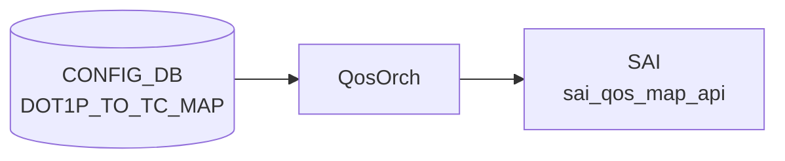

# DOT1P_TO_TC_MAP テーブル

## 概要

`DOT1P_TO_TC_MAP` テーブルは IEEE 802.1p Priority Code Point (PCP, 0-7) を SONiC の Traffic Class へマップするテーブル[^1]。[QoS](../../reference/glossary.md#term-qos) 入口分類で使われ、`PORT_QOS_MAP.dot1p_to_tc_map` から参照される。`qosorch` ([sonic-swss](../../reference/glossary.md#term-sonic-swss)) が [CONFIG_DB](../../reference/glossary.md#term-config_db) を読み、[SAI](../../reference/glossary.md#term-sai) の `SAI_QOS_MAP_TYPE_DOT1P_TO_TC` オブジェクトを生成する。

[YANG](../../reference/glossary.md#term-yang) は親 `DOT1P_TO_TC_MAP_LIST`（key: `name`）と、その下の inner list `DOT1P_TO_TC_MAP`（key: `dot1p`）の 2 段構造。

<!-- cdb-mermaid -->
### データフロー (自動生成)



!!! note "凡例"
    CONFIG_DB から SAI までの典型経路を `docs/reference/config-db-orch-map.md` から機械生成したミニ図。詳細・例外は本ページ本文と対応表を参照。
<!-- /cdb-mermaid -->

## key 構造

```text
DOT1P_TO_TC_MAP|<name>             # マップ全体（hash で dot1p→tc の dict）
```

[CONFIG_DB](../../reference/glossary.md#term-config_db) 上は `DOT1P_TO_TC_MAP|<name>` の単一ハッシュで `dot1p` → `tc` の対応を保持する（一般的な SONiC [QoS](../../reference/glossary.md#term-qos) map と同形式）。

| キー | 型 | 説明 |
|------|----|------|
| `name` | string (1..32) | マップ名。`[a-zA-Z0-9]{1}([-a-zA-Z0-9_]{0,31})` |

## フィールド

inner list で定義される各エントリ:

| フィールド | 型 | 説明 |
|-----------|----|------|
| `dot1p` | string パターン `[0-7]?` | 802.1p PCP 値（0-7） |
| `tc` | `sonic-types:tc_type` | マップ先 Traffic Class |

<!-- value-behavior -->
## 値依存挙動マトリクス

### `dot1p` (string pattern [0-7])

| 値 | 挙動 |
|----|------|
| `0`..`7` | qosorch が SAI_QOS_MAP_TYPE_DOT1P_TO_TC エントリを生成 |
| 範囲外（8 以上等） | YANG pattern 違反で reject |

### `tc` (tc_type: 0..7)

| 値 | 挙動 |
|----|------|
| `0`..`7` | [SAI](../../reference/glossary.md#term-sai) QoS map オブジェクトの Traffic Class 値として設定 |
| 8 以上 | ASIC が拒否（SAI エラー） |

> 明示的な enum 制約なし（任意の 0-7 ペアで構成可能）。PORT_QOS_MAP.dot1p_to_tc_map から参照されない限り SAI に反映されない。

<!-- /value-behavior -->

## 制約

- `dot1p` は 0-7 の単一文字
- `name` 文字列長 1..32、パターン制約あり

## 購読者

- `qosorch` ([sonic-swss](../../reference/glossary.md#term-sonic-swss)) — [SAI](../../reference/glossary.md#term-sai) [QoS](../../reference/glossary.md#term-qos) Map オブジェクト生成
- `PORT_QOS_MAP` の `dot1p_to_tc_map` leaf から参照

## 関連 CONFIG_DB / YANG / CLI

- 関連 [CONFIG_DB](../../reference/glossary.md#term-config_db): `PORT_QOS_MAP`、`DSCP_TO_TC_MAP`、`TC_TO_QUEUE_MAP`
- 関連 [YANG](../../reference/glossary.md#term-yang): `sonic-dot1p-tc-map`、`sonic-port-qos-map`
- 関連 CLI: `config qos`

<!-- ref-triangle:start -->

## 関連リファレンス

- [YANG](../../reference/glossary.md#term-yang): [`sonic-dot1p-tc-map`](../yang/sonic-dot1p-tc-map.md)
- CLI: [`config qos`](../cli/config-qos.md)

<!-- ref-triangle:end -->

## 引用元

[^1]: YANG 定義: `sonic-dot1p-tc-map.yang`. <https://github.com/sonic-net/sonic-buildimage/blob/9ea932ec2e18f35e58268ec2e4456b1d4afd65cd/src/sonic-yang-models/yang-models/sonic-dot1p-tc-map.yang>

## 関連ページ
- [CONFIG_DB: DSCP_TO_TC_MAP](dscp-to-tc-map.md)

<!-- ops-hint -->
## 運用ヒント

### 典型値

- key 形式: `DOT1P_TO_TC_MAP|<map-name>`。
- `0`-`7` の dot1p 値→ TC 値。COS6/7 を TC3 などコントロールトラフィック用に分離する設計が一般的。

### よくある誤設定

- PORT_QOS_MAP から参照されていないとマップを定義しても有効化されない。

### 確認コマンド

```bash
sonic-db-cli CONFIG_DB keys 'DOT1P_TO_TC_MAP|*'
show qos map dot1p-tc
```
<!-- /ops-hint -->

<!-- cdb-exceptions -->
## 例外条件・特殊挙動

| consumer | 条件 | 挙動 |
|---|---|---|
| [orchagent](../../reference/glossary.md#term-orchagent) | DEL 時に他テーブル (PORT 等) から参照中 | `m_pendingRemove=true` を立てて `task_need_retry` を返す。参照解放後に削除実行（qosorch.cpp:181-186） |
| [orchagent](../../reference/glossary.md#term-orchagent) | pending remove 中に SET が到着 | `"Entry is pending remove, need retry"` を LOG_NOTICE して `task_need_retry` を返す（qosorch.cpp:136-139） |
| [orchagent](../../reference/glossary.md#term-orchagent) | SAI オブジェクト生成 (`addQosItem`) 失敗 | `"Failed to create [DOT1P_TO_TC_MAP:...]"` を LOG_ERROR して `task_failed` を返す（qosorch.cpp:162-166） |
| orchagent | SAI オブジェクト変更 (`modifyQosItem`) 失敗 | `"Failed to set [DOT1P_TO_TC_MAP:...]"` を LOG_ERROR して `task_failed` を返す（qosorch.cpp:151-155） |
| orchagent | DEL 対象が type map に存在しない | `"Object with name:%s not found."` を LOG_ERROR して `task_invalid_entry` を返す（qosorch.cpp:176-179） |

> **Evidence**: [sonic-swss](../../reference/glossary.md#term-sonic-swss) `orchagent/qosorch.cpp:124-201`
<!-- /cdb-exceptions -->

<!-- glossary-links-injected: b1003b21c66f -->
