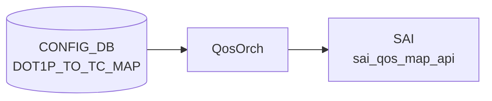

# DOT1P_TO_TC_MAP テーブル

## 概要

`DOT1P_TO_TC_MAP` テーブルは IEEE 802.1p Priority Code Point (PCP, 0-7) を SONiC の Traffic Class へマップするテーブル[^1]。[QoS](../../reference/glossary.md#term-qos) 入口分類で使われ、`PORT_QOS_MAP.dot1p_to_tc_map` から参照される。`qosorch` ([sonic-swss](../../reference/glossary.md#term-sonic-swss)) が [CONFIG_DB](../../reference/glossary.md#term-config_db) を読み、[SAI](../../reference/glossary.md#term-sai) の `SAI_QOS_MAP_TYPE_DOT1P_TO_TC` オブジェクトを生成する。

[YANG](../../reference/glossary.md#term-yang) は親 `DOT1P_TO_TC_MAP_LIST`（key: `name`）と、その下の inner list `DOT1P_TO_TC_MAP`（key: `dot1p`）の 2 段構造。

<!-- cdb-mermaid -->
### データフロー (自動生成)



!!! note "凡例"
    CONFIG_DB から SAI までの典型経路を `docs/reference/config-db-orch-map.md` から機械生成したミニ図。詳細・例外は本ページ本文と対応表を参照。
<!-- /cdb-mermaid -->

## key 構造

```text
DOT1P_TO_TC_MAP|<name>             # マップ全体（hash で dot1p→tc の dict）
```

[CONFIG_DB](../../reference/glossary.md#term-config_db) 上は `DOT1P_TO_TC_MAP|<name>` の単一ハッシュで `dot1p` → `tc` の対応を保持する（一般的な SONiC [QoS](../../reference/glossary.md#term-qos) map と同形式）。

| キー | 型 | 説明 |
|------|----|------|
| `name` | string (1..32) | マップ名。`[a-zA-Z0-9]{1}([-a-zA-Z0-9_]{0,31})` |

## フィールド

inner list で定義される各エントリ:

| フィールド | 型 | 説明 |
|-----------|----|------|
| `dot1p` | string パターン `[0-7]?` | 802.1p PCP 値（0-7） |
| `tc` | `sonic-types:tc_type` (uint8 0..15) | マップ先 Traffic Class。YANG は 0..15 を許容するが多くの ASIC は 0..7 のみサポート |

<!-- value-behavior -->
## 値依存挙動マトリクス

### `dot1p` (string pattern [0-7])

| 値 | 挙動 |
|----|------|
| `0`..`7` | qosorch が SAI_QOS_MAP_TYPE_DOT1P_TO_TC エントリを生成 |
| 範囲外（8 以上等） | YANG pattern 違反で reject |

### `tc` (tc_type: 0..15)

| 値 | 挙動 |
|----|------|
| `0`..`7` | [SAI](../../reference/glossary.md#term-sai) QoS map オブジェクトの Traffic Class 値として設定（全 ASIC で動作） |
| `8`..`15` | YANG 検証は通過（`tc_type` は `uint8 range 0..15`）。qosorch も通過するが ASIC が拒否する場合あり（プラットフォーム依存） |
| `16` 以上 | YANG 検証で reject |

> `stypes:tc_type` の実体は `uint8 range 0..15`。PORT_QOS_MAP.dot1p_to_tc_map から参照されない限り SAI に反映されない。

<!-- /value-behavior -->

## 制約

- `dot1p` は 0-7 の単一文字
- `name` 文字列長 1..32、パターン制約あり

## 購読者

- `qosorch` ([sonic-swss](../../reference/glossary.md#term-sonic-swss)) — [SAI](../../reference/glossary.md#term-sai) [QoS](../../reference/glossary.md#term-qos) Map オブジェクト生成
- `PORT_QOS_MAP` の `dot1p_to_tc_map` leaf から参照

## 関連 CONFIG_DB / YANG / CLI

- 関連 [CONFIG_DB](../../reference/glossary.md#term-config_db): `PORT_QOS_MAP`、`DSCP_TO_TC_MAP`、`TC_TO_QUEUE_MAP`
- 関連 [YANG](../../reference/glossary.md#term-yang): `sonic-dot1p-tc-map`、`sonic-port-qos-map`
- 関連 CLI: `config qos`

<!-- ref-triangle:start -->

## 関連リファレンス

- [YANG](../../reference/glossary.md#term-yang): [`sonic-dot1p-tc-map`](../yang/sonic-dot1p-tc-map.md)
- CLI: [`config qos`](../cli/config-qos.md)

<!-- ref-triangle:end -->

## 引用元

[^1]: YANG 定義: `sonic-dot1p-tc-map.yang`. <https://github.com/sonic-net/sonic-buildimage/blob/9ea932ec2e18f35e58268ec2e4456b1d4afd65cd/src/sonic-yang-models/yang-models/sonic-dot1p-tc-map.yang>

## 関連ページ
- [CONFIG_DB: DSCP_TO_TC_MAP](dscp-to-tc-map.md)

<!-- ops-hint -->
## 運用ヒント

### 典型値

- key 形式: `DOT1P_TO_TC_MAP|<map-name>`。
- `0`-`7` の dot1p 値→ TC 値。COS6/7 を TC3 などコントロールトラフィック用に分離する設計が一般的。

### よくある誤設定

- PORT_QOS_MAP から参照されていないとマップを定義しても有効化されない。

### 確認コマンド

```bash
sonic-db-cli CONFIG_DB keys 'DOT1P_TO_TC_MAP|*'
show qos map dot1p-tc
```
<!-- /ops-hint -->

<!-- cdb-exceptions -->
## 例外条件・特殊挙動

| consumer | 条件 | 挙動 |
|---|---|---|
| [orchagent](../../reference/glossary.md#term-orchagent) | DEL 時に他テーブル (PORT 等) から参照中 | `m_pendingRemove=true` を立てて `task_need_retry` を返す。参照解放後に削除実行（qosorch.cpp:181-186） |
| [orchagent](../../reference/glossary.md#term-orchagent) | pending remove 中に SET が到着 | `"Entry is pending remove, need retry"` を LOG_NOTICE して `task_need_retry` を返す（qosorch.cpp:136-139） |
| [orchagent](../../reference/glossary.md#term-orchagent) | SAI オブジェクト生成 (`addQosItem`) 失敗 | `"Failed to create [DOT1P_TO_TC_MAP:...]"` を LOG_ERROR して `task_failed` を返す（qosorch.cpp:162-166） |
| orchagent | SAI オブジェクト変更 (`modifyQosItem`) 失敗 | `"Failed to set [DOT1P_TO_TC_MAP:...]"` を LOG_ERROR して `task_failed` を返す（qosorch.cpp:151-155） |
| orchagent | DEL 対象が type map に存在しない | `"Object with name:%s not found."` を LOG_ERROR して `task_invalid_entry` を返す（qosorch.cpp:176-179） |

> **Evidence**: [sonic-swss](../../reference/glossary.md#term-sonic-swss) `orchagent/qosorch.cpp:124-201`
<!-- /cdb-exceptions -->

<!-- runtime-trace -->
## 実コンテナ動作トレース

### 段階 1 — Consumer 登録

`QosOrch` (orchagent 直接 CFG 購読) が CONFIG_DB の `DOT1P_TO_TC_MAP` テーブルを購読する。

`DOT1P_TO_TC_MAP` の key はマップ名 (例: `AZURE`)。`<dot1p_value>` → `<tc_value>` のマッピング。

### 段階 2 — CFG→APPL 翻訳

なし (orchagent が直接 CONFIG_DB を購読)

### 段階 3 — APPL→SAI

`sai_qos_map_api` — `sai_create_qos_map` で DOT1P→TC マッピングテーブルを作成

### 段階 4 — タイミングと副作用

**適用タイミング**: orchagent が CONFIG_DB 変化を検知後即座に SAI QoS map を作成/更新。ポートへのマップ割り当ては `PORT_QOS_MAP` テーブルで行う。

**副作用**: マップ内容の変更は即座にマップを参照するすべてのポートの QoS 分類に影響。traffic の優先度処理が変化する。
<!-- /runtime-trace -->

<!-- entry-points -->
## 書き込み入り口 (Direction A)

対象テーブル: `DOT1P_TO_TC_MAP`

### CLI
- `config qos map dot1p-tc add/del <map-name> <dot1p> <tc>`
  - ソース: `sonic-utilities/config/main.py (qos グループ)`

### minigraph / sonic-cfggen
- なし

### REST / gNMI (sonic-mgmt-common)
- なし (対応 OpenConfig/SONiC YANG transformer なし)

### db_migrator
- なし

### ビルド時デフォルト (init_cfg / j2 テンプレート)
- `qos_config.j2` から platform 別 QoS マップが生成される場合あり

### ハードコードデフォルト
- なし

### ランタイム注入 (デーモン自動書き込み)
- なし
<!-- /entry-points -->

<!-- defaults -->
## 暗黙デフォルト・コード由来挙動

### `name` (マップ名キー)

| 検出種 | 内容 |
|--------|------|
| プラットフォーム依存 | `qos_config.j2` は `type in backend_device_types AND storage_device == 'true'` のストレージバックエンドプラットフォームでのみ `DOT1P_TO_TC_MAP\|AZURE` を注入する。それ以外のプラットフォームにはビルド時デフォルトなし |
| ハードコード固定値 | ストレージバックエンド時のデフォルト: `{"0":"1","1":"0","2":"2","3":"3","4":"4","5":"5","6":"6","7":"7"}` |
| 大文字小文字制約 | YANG pattern は混在大文字小文字を許容するが、[Redis](../../reference/glossary.md#term-redis) キーは大文字小文字区別あり。`AZURE` と `Azure` は別エントリ |

### `dot1p` (エントリキー)

| 検出種 | 内容 |
|--------|------|
| YANG-実装 discrepancy | YANG pattern `[0-7]?` は空文字列 `""` を許容する（`?` で文字省略可）。qosorch は `stoi(fvField(fv))` で処理するため `""` は `std::invalid_argument` を投げる |
| silent drop | `convertFieldValuesToAttributes()` (qosorch.cpp 375-384) は `invalid_argument` / `out_of_range` をキャッチして `continue` — 該当エントリを **サイレントに脱落** させ、残りエントリで SAI マップを生成。`return true` は維持されるため呼び出し元にエラーが伝播しない |
| 書込み後との乖離 | 無効エントリが混在した SET を送ると CONFIG_DB には全エントリが記録されるが SAI には有効エントリのみ反映される（書き込み vs 実行時乖離） |

### `tc` (トラフィッククラス値)

| 検出種 | 内容 |
|--------|------|
| YANG-ドキュメント discrepancy | `stypes:tc_type` の実体は `uint8 range 0..15`（sonic-types.yang.j2:338-346）。本ページ従来記述の 0..7 は誤り。YANG テスト (`qosmaps.json`) でも `"tc":"8"` が有効・`"tc":"16"` が無効として検証済み |
| プラットフォーム依存 | YANG は 0..15 を許容するが、多くの ASIC は TC 0..7 のみサポート。TC 8..15 は YANG 検証を通過しても SAI が拒否する場合がある（ASIC 依存） |
| silent drop | `stoi` 失敗（非数値・範囲外）時は dot1p と同様にエントリがサイレント脱落する |

### 共通挙動

| 検出種 | 内容 |
|--------|------|
| dead consumer | `PORT_QOS_MAP.dot1p_to_tc_map` から参照されない限りマップは SAI オブジェクトとして生成されるが **トラフィック分類に影響しない** |
| 書込み順依存 | DEL pending 中に SET が到着すると `task_need_retry` を返して SET を遅延させる（qosorch.cpp:136-139） |
| partial failure | SET 時は全エントリを一括で SAI に送信（per-entry パッチなし）。1 エントリの不正でも他の有効エントリが反映される（SAI 側は全エントリを受け取る） |
| 暗黙 reset+restore | エントリを削除する唯一の方法は有効エントリを除いたマップ全体を再 SET すること（DEL は名前単位でマップ全体を削除） |
| CONFIG_DB 直接購読 | [APPL_DB](../../reference/glossary.md#term-appl_db) 中継なし。`QosOrch` が CONFIG_DB を直接購読し即座に SAI へ反映 |

> **Evidence**: `sonic-swss/orchagent/qosorch.cpp:360-397`, `sonic-buildimage/files/build_templates/qos_config.j2:240-253`, `sonic-buildimage/src/sonic-yang-models/yang-templates/sonic-types.yang.j2:338-346`, `sonic-buildimage/src/sonic-yang-models/tests/yang_model_tests/tests_config/qosmaps.json`
<!-- /defaults -->

<!-- ordering -->
## 書込み順依存 (Phase B)

> 調査証跡: `meta/_intermediate/cdb-flow/dot1p-to-tc-map-ordering.md`

対象テーブル: `DOT1P_TO_TC_MAP`。Consumer: `QosOrch::handleDot1pToTcTable()` / `QosOrch::handlePortQosMapTable()` (`qosorch.cpp`)。

### SET 時の先行必須テーブル

| # | 依存 | 方向 | 挙動 |
|---|------|------|------|
| 1 | `DOT1P_TO_TC_MAP\|<name>` SAI 作成 → `PORT_QOS_MAP\|<port>` SET | 先行推奨 | `resolveFieldRefValue()` が未解決で `task_need_retry`（自動再試行、`qosorch.cpp:2120-2130`） |
| 2 | 不正 dot1p 値のサイレント脱落 | SET 後に上書きで解消 | `stoi()` 失敗エントリは `continue` でスキップ → SAI には有効エントリのみ反映（`qosorch.cpp:360-397`） |

> **推奨順序（SET）**: `DOT1P_TO_TC_MAP|<name>` 登録 → `PORT_QOS_MAP|<port>` の `dot1p_to_tc_map` フィールド設定

### DEL 時の順序制約

| # | 依存 | 方向 | 挙動 |
|---|------|------|------|
| 1 | `PORT_QOS_MAP\|<port>` の `dot1p_to_tc_map` 参照解除 → `DOT1P_TO_TC_MAP\|<name>` DEL | **先行必須** | 参照中は `m_pendingRemove=true` + `task_need_retry` ロック（`qosorch.cpp:174-186`） |
| 2 | pending_remove 解消後のみ SET 可能 | **先行必須** | pending_remove 中の SET は即 `task_need_retry`（`qosorch.cpp:136-139`） |

> **推奨順序（DEL）**: `PORT_QOS_MAP|<port>` の `dot1p_to_tc_map` フィールド削除 → `DOT1P_TO_TC_MAP|<name>` DEL

> **Evidence**: `qosorch.cpp:124-201` (QosMapHandler::processWorkItem); `qosorch.cpp:2046-2134` (handlePortQosMapTable); `qosorch.cpp:422-427` (handleDot1pToTcTable); `qosorch.cpp:360-397` (Dot1pToTcMapHandler::convertFieldValuesToAttributes)
<!-- /ordering -->

<!-- cross-refs -->
## 暗黙参照 (Phase C)

`DOT1P_TO_TC_MAP` が関わる CONFIG_DB テーブル間の暗黙参照を `qosorch.cpp` / `qosorch.h` から抽出した。

| 参照方向 | 参照元テーブル | フィールド | SAI 属性 | evidence |
|---------|-------------|-----------|---------|---------|
| 被参照 (referenced by) | `PORT_QOS_MAP` | `dot1p_to_tc_map` | `SAI_PORT_ATTR_QOS_DOT1P_TO_TC_MAP` | `qosorch.h:13`, `qosorch.cpp:63` |
| 参照管理 | `handlePortQosMapTable` | SET 時 object_id 解決 / DEL 時参照解除 | — | `qosorch.cpp:2046,2077,2108,2133` |
| SWITCH レベル適用 | なし | DOT1P マップは SWITCH 直接適用なし | — | `qosorch.cpp:1956`（DSCP_TO_TC_MAP のみ対象） |

- `qos_to_ref_table_map`（`qosorch.cpp:99-102`）が `dot1p_to_tc_field_name` → `CFG_DOT1P_TO_TC_MAP_TABLE_NAME` と対応付けており、`PORT_QOS_MAP` SET 時の `resolveFieldRefValue()` で本マップが参照される。
- `PORT_QOS_MAP.dot1p_to_tc_map` から参照中に DEL しようとすると `isObjectBeingReferenced()` が true を返し `task_need_retry` で削除保留。
- SWITCH レベルへの直接適用（`PORT_QOS_MAP|global` 経路）は `DSCP_TO_TC_MAP` のみ。`DOT1P_TO_TC_MAP` は SWITCH 直接適用なし（`querySwitchCapability` 判定対象外）。

> 詳細: `meta/_intermediate/cdb-flow/dot1p-to-tc-map-cross-refs.md`

<!-- /cross-refs -->

<!-- failure -->
## 失敗挙動マトリクス (Phase D)

`Dot1pToTcMapHandler::processWorkItem()` / `QosMapHandler::processWorkItem()`（`sonic-swss/orchagent/qosorch.cpp`）における SET / DEL 失敗条件と結果を網羅する。

<!-- evidence: meta/_intermediate/cdb-flow/dot1p-to-tc-map-failure.md -->

### SET 失敗マトリクス

| 失敗条件 | 検出箇所 | 結果 | ログ出力 | evidence |
|---|---|---|---|---|
| 既存オブジェクトが `m_pendingRemove == true` の状態で SET | `qosorch.cpp:136-139` | `task_need_retry` — m_toSync 残留、次 doTask() で再評価 | `"Entry %s %s is pending remove, need retry"` (NOTICE) | `qosorch.cpp:138` |
| `dot1p` フィールドが非数値 (`std::invalid_argument`) | `qosorch.cpp:375-378` | 該当エントリのみサイレント脱落、残りエントリで SAI 生成継続 | `"Invalid dot1p to tc argument %s:%s to %s()"` (ERROR) | `qosorch.cpp:377` |
| `dot1p` / `tc` フィールドが数値範囲超過 (`std::out_of_range`) | `qosorch.cpp:380-383` | 該当エントリのみサイレント脱落、残りエントリで SAI 生成継続 | `"Out of range dot1p to tc argument %s:%s to %s()"` (ERROR) | `qosorch.cpp:382` |
| SAI `create_qos_map` 失敗（新規作成） | `qosorch.cpp:412-416`, `162-166` | `task_failed` — m_toSync からエントリ削除。retry なし | `"Failed to create dot1p_to_tc map. status: %s"` (ERROR) | `qosorch.cpp:415` |
| SAI `set_qos_map_attribute` 失敗（既存更新） | `qosorch.cpp:206-213`, `151-155` | `task_failed` — m_toSync からエントリ削除。既存 SAI オブジェクトは変更前状態に留まる | `"Failed to set [%s:%s]"` (ERROR) | `qosorch.cpp:153` |

### DEL 失敗マトリクス

| 失敗条件 | 検出箇所 | 結果 | ログ出力 | evidence |
|---|---|---|---|---|
| 存在しないオブジェクトへの DEL | `qosorch.cpp:176-179` | `task_invalid_entry` — ノーオペレーション | `"Object with name:%s not found."` (ERROR) | `qosorch.cpp:178` |
| `PORT_QOS_MAP` から参照中の DEL | `qosorch.cpp:181-186` | `m_pendingRemove = true` + `task_need_retry` — 参照解除後に自動 DEL 再実行 | `"Can't remove object %s due to being referenced (%s)"` (NOTICE) | `qosorch.cpp:184` |
| SAI `remove_qos_map` 失敗 | `qosorch.cpp:188-191`, `220-224` | `task_failed` — SAI オブジェクト残存、CONFIG_DB/SAI 乖離 | `"Failed to remove QoS map. db name:%s sai object:..."` (ERROR) | `qosorch.cpp:190` |

### 補足

- **フィールド変換失敗のサイレント脱落**: `convertFieldValuesToAttributes()` は変換失敗エントリを `continue` でスキップし `return true` を維持する。そのため `processWorkItem()` には成功として返り、呼び出し元にエラーが伝播しない。CONFIG_DB には全エントリが記録されるが SAI には有効エントリのみ反映される（書き込み vs 実行時の乖離）。
- **`task_invalid_entry`** はエントリを m_toSync から破棄し再試行しない。YANG バリデーション通過後の不正データが入った場合のみ発生する。
- **`task_need_retry`** はエントリを m_toSync に残留させ次の `doTask()` で再評価する。自動回復するが完了タイミングは不確定。
- QosOrch は失敗時に [STATE_DB](../../reference/glossary.md#term-state_db) / ERROR_TABLE への書き込みを行わない。[ASIC_DB](../../reference/glossary.md#term-asic_db) への反映確認は `sonic-db-cli ASIC_DB hgetall 'ASIC_STATE:SAI_OBJECT_TYPE_QOS_MAP:*'` で行う。

<!-- /failure -->

<!-- constants -->
## ハードコード定数 (Phase E)

ソース: `sonic-swss/orchagent/qosorch.cpp`、`sonic-swss/orchagent/qosorch.h`

> 調査証跡: `meta/_intermediate/cdb-flow/dot1p-to-tc-map-constants.md`

### フィールド名定数

| 定数名 | 値 | 定義箇所 | 説明 |
|--------|----|---------|------|
| `dot1p_to_tc_field_name` | `"dot1p_to_tc_map"` | `qosorch.h:13` | PORT_QOS_MAP フィールド名。`qos_to_ref_table_map` / `qos_to_attr_map` のキーとして使用 |

### SAI 定数

| 定数 | 使用箇所 | 説明 |
|------|---------|------|
| `SAI_QOS_MAP_TYPE_DOT1P_TO_TC` | `qosorch.cpp:406` | SAI qos_map_type — create 時の type 固定値 |
| `SAI_QOS_MAP_ATTR_TYPE` | `qosorch.cpp:405` | create 時の type 属性 ID |
| `SAI_QOS_MAP_ATTR_MAP_TO_VALUE_LIST` | `qosorch.cpp:391` | マップエントリリスト属性 ID |
| `SAI_PORT_ATTR_QOS_DOT1P_TO_TC_MAP` | `qosorch.cpp:63` | ポートバインド属性 ID |

> **注意**: DSCP_TO_TC_MAP が持つスイッチレベルバインド (`SAI_SWITCH_ATTR_QOS_DSCP_TO_TC_MAP`) に相当する `SAI_SWITCH_ATTR_QOS_DOT1P_TO_TC_MAP` の使用は `qosorch` に実装されていない。DOT1P_TO_TC_MAP はポートバインドのみ。

### 型変換・キャスト定数

| 処理 | 型 | コード箇所 | 説明 |
|------|-----|---------|------|
| dot1p key 変換 | `sai_uint8_t` | `qosorch.cpp:372` | `static_cast<sai_uint8_t>(stoi(fvField(fv)))` — YANG pattern `[0-7]?` の 0..7 を uint8 に変換 |
| tc value 変換 | `sai_cos_t` (uint8) | `qosorch.cpp:373` | `static_cast<sai_cos_t>(stoi(fvValue(fv)))` — YANG tc_type (0..15) を uint8 に変換 |

> **注意**: DSCP_TO_TC_MAP の `DSCP_MAX_VAL = 63` に相当する dot1p 最大値の明示的な範囲チェック定数は存在しない。上限は YANG pattern `[0-7]?` と SAI `sai_uint8_t` キャストの組み合わせで暗黙的に制約される。

### デフォルトマップ名

| マップ名 | 用途 | ソース |
|---------|------|--------|
| `"AZURE"` | ストレージバックエンドプラットフォームで `qos_config.j2` が注入するデフォルトマップ名 | `qos_config.j2:240-253` |

> **Evidence**: `sonic-swss/orchagent/qosorch.h:13`; `sonic-swss/orchagent/qosorch.cpp:63,391,405-406,372-373`
<!-- /constants -->

<!-- side-effects -->
## 副次 DB 書込 (Phase F)

ソース: `sonic-swss/orchagent/qosorch.cpp`

> 調査証跡: `meta/_intermediate/cdb-flow/dot1p-to-tc-map-side-effects.md`

`DOT1P_TO_TC_MAP` を SET/DEL した際に [orchagent](../../reference/glossary.md#term-orchagent) が書き込む副次 DB を示す。cfgmgr ステージは存在しない（[CONFIG_DB](../../reference/glossary.md#term-config_db) → orchagent 直結）。[STATE_DB](../../reference/glossary.md#term-state_db) / APPL_STATE_DB への書き込みはない。

### SET — DOT1P_TO_TC_MAP 作成・更新

| 操作 | 対象 DB / テーブル | キー / フィールド | 条件 |
|------|------------------|-----------------|------|
| `sai_qos_map_api->create_qos_map(SAI_QOS_MAP_TYPE_DOT1P_TO_TC, ...)` | [ASIC_DB](../../reference/glossary.md#term-asic_db) ([syncd](../../reference/glossary.md#term-syncd) 経由) / `ASIC_STATE:SAI_OBJECT_TYPE_QOS_MAP` | `<qos_map_oid>` | 新規マップ作成 (`qosorch.cpp:399-416`) |
| `sai_qos_map_api->set_qos_map_attribute(oid, SAI_QOS_MAP_ATTR_MAP_TO_VALUE_LIST, ...)` | [ASIC_DB](../../reference/glossary.md#term-asic_db) ([syncd](../../reference/glossary.md#term-syncd) 経由) / `ASIC_STATE:SAI_OBJECT_TYPE_QOS_MAP` | `<qos_map_oid>` field=`SAI_QOS_MAP_ATTR_MAP_TO_VALUE_LIST` | 既存マップ更新 (`qosorch.cpp:207`) |

### SET — PORT_QOS_MAP によるポートバインド

`PORT_QOS_MAP|<port>` に `dot1p_to_tc_map` フィールドを書いた際の副次書き込み:

| 操作 | 対象 DB / テーブル | キー / フィールド | 条件 |
|------|------------------|-----------------|------|
| `sai_port_api->set_port_attribute(SAI_PORT_ATTR_QOS_DOT1P_TO_TC_MAP, oid)` | ASIC_DB ([syncd](../../reference/glossary.md#term-syncd) 経由) / `ASIC_STATE:SAI_OBJECT_TYPE_PORT` | `<port_oid>` field=`SAI_PORT_ATTR_QOS_DOT1P_TO_TC_MAP` | 参照先 DOT1P_TO_TC_MAP が SAI 解決済みの各ポート (`qosorch.cpp:2086,2193`) |

### スイッチレベル適用: なし

`DSCP_TO_TC_MAP` は `PORT_QOS_MAP|global` 経由でスイッチレベル (`SAI_SWITCH_ATTR_QOS_DSCP_TO_TC_MAP`) への適用が実装されているが、`DOT1P_TO_TC_MAP` には対応する実装が存在しない。`handleGlobalQosMap()` は `dot1p_to_tc_field_name` を受け取ると `"Qos map type %s is not supported at global level"` を WARN してスキップする（`qosorch.cpp:2012`）。

### DEL — DOT1P_TO_TC_MAP 削除

| 操作 | 対象 DB / テーブル | キー / フィールド | 条件 |
|------|------------------|-----------------|------|
| `sai_qos_map_api->remove_qos_map(sai_object)` | ASIC_DB (syncd 経由) / `ASIC_STATE:SAI_OBJECT_TYPE_QOS_MAP` 削除 | `<qos_map_oid>` | PORT_QOS_MAP 非参照時 (`qosorch.cpp:188-191`) |
| `pending_remove=true` → `task_need_retry`（削除スキップ） | — | — | PORT_QOS_MAP から参照中 (`qosorch.cpp:181-186`) |

### 副次書き込みサマリ

| DB | テーブル / 属性 | SET 時 | DEL 時 |
|----|----------------|--------|--------|
| ASIC_DB | `ASIC_STATE:SAI_OBJECT_TYPE_QOS_MAP` | create / update (syncd 経由) | remove (syncd 経由, 非参照時のみ) |
| ASIC_DB | `ASIC_STATE:SAI_OBJECT_TYPE_PORT` field=`SAI_PORT_ATTR_QOS_DOT1P_TO_TC_MAP` | set_port_attribute (syncd 経由, PORT_QOS_MAP SET 時) | set SAI_NULL_OBJECT_ID (PORT_QOS_MAP DEL 時) |
| ASIC_DB | `ASIC_STATE:SAI_OBJECT_TYPE_SWITCH` | なし（スイッチレベル未実装） | なし |
| [APPL_DB](../../reference/glossary.md#term-appl_db) | — | なし | なし |
| [STATE_DB](../../reference/glossary.md#term-state_db) | — | なし | なし |
| APPL_STATE_DB | — | なし | なし |
| [COUNTERS_DB](../../reference/glossary.md#term-counters_db) | — | なし | なし |

> **Evidence**: `sonic-swss/orchagent/qosorch.cpp:63,181-186,207,399-416,2012,2086,2193`
<!-- /side-effects -->

<!-- pubsub -->
## 通信メカニズム (Phase G)

> 調査証跡: `meta/_intermediate/cdb-flow/dot1p-to-tc-map-pubsub.md`

### 購読方式

`QosOrch` は `orchdaemon.cpp:367-384` で `qos_tables` ベクタの一員として `CFG_DOT1P_TO_TC_MAP_TABLE_NAME` を指定され、`new QosOrch(m_configDb, qos_tables)` に渡される。基底 `Orch(db, tableNames)` が `Orch::addConsumer()` を呼び、CONFIG_DB ID の分岐により **`swss::SubscriberStateTable`** が選択される（`orch.cpp:1186-1190`）。

`SubscriberStateTable` は [Redis](../../reference/glossary.md#term-redis) keyspace 通知 `__keyspace@<dbId>__:DOT1P_TO_TC_MAP|*` を **`PSUBSCRIBE`** で購読し、通知受信後に `HGETALL` で値を再取得して `(key, op, fvs)` タプルを返す。バッチサイズは `TableConsumable::DEFAULT_POP_BATCH_SIZE = 128`（ハードコード、`orchagent -b` の `gBatchSize` 影響なし）。

### ハンドラ登録とディスパッチ

```
orchdaemon.cpp:372  qos_tables に CFG_DOT1P_TO_TC_MAP_TABLE_NAME を追加
qosorch.cpp:1331    initTableHandlers() で m_qos_handler_map[CFG_DOT1P_TO_TC_MAP_TABLE_NAME]
                     = &QosOrch::handleDot1pToTcTable を登録
qosorch.cpp:2231-2251  QosOrch::doTask() が PORT_QOS_MAP / QUEUE より先に
                        DOT1P_TO_TC_MAP を drain（マップ先行処理を保証）
qosorch.cpp:2254-2295  QosOrch::doTask(Consumer&) がハンドラ関数ポインタ経由でディスパッチ
```

`handleDot1pToTcTable()` → `Dot1pToTcMapHandler::processWorkItem()` → `Dot1pToTcMapHandler::convertFieldValuesToAttributes()` → `sai_qos_map_api->create_qos_map()` / `set_qos_map_attribute()` / `remove_qos_map()`。

### drain 順序の保証

`QosOrch::doTask()` は PORT_QOS_MAP と QUEUE を後回しにして、`DOT1P_TO_TC_MAP` を含む全マップテーブルを先に drain する（`qosorch.cpp:2231-2251`）。これにより `PORT_QOS_MAP` が `resolveFieldRefValue()` で `DOT1P_TO_TC_MAP` の SAI object_id を解決する際に `task_need_retry` が生じにくくなる。

### select タイムアウト・リトライ

select タイムアウト: **1000 ms**（`SELECT_TIMEOUT`、`orchdaemon.cpp:23`）。keyspace 通知到着時は即時 wake up。リトライキャッシュは未使用で `m_toSync` 残留方式（`task_need_retry` 時はエントリを保持し次回 drain で再処理）。

| 観点 | 内容 |
|---|---|
| 購読方式 | `SubscriberStateTable`（keyspace `PSUBSCRIBE` + `HGETALL`） |
| バッチサイズ | 128（`DEFAULT_POP_BATCH_SIZE`、固定） |
| select タイムアウト | 1000 ms |
| SAI 呼び出し | `sai_qos_map_api->create_qos_map()` / `set_qos_map_attribute()` / `remove_qos_map()` |
| リトライ方式 | `m_toSync` 残留（キャッシュなし） |
| [APPL_DB](../../reference/glossary.md#term-appl_db) 中継 | なし（CONFIG_DB → orchagent 直結） |
| channel PUBLISH | 使わない |
| TTL | 未使用（CONFIG_DB 永続） |

> **Evidence**: `orchdaemon.cpp:23,367-384`; `orch.cpp:1186-1194`; `qosorch.cpp:1313-1345,1331,2231-2295,399-415`

<!-- /pubsub -->

<!-- platform -->
## プラットフォーム差分 (Phase H)

> 調査証跡: `meta/_intermediate/cdb-flow/dot1p-to-tc-map-platform.md`

### スイッチレベル適用なし

`DSCP_TO_TC_MAP` は `PORT_QOS_MAP|global` 経由でスイッチレベル (`SAI_SWITCH_ATTR_QOS_DSCP_TO_TC_MAP`) への適用が実装されているが、`DOT1P_TO_TC_MAP` には対応する `applyDot1pToTcMapToSwitch()` 関数が存在しない。

`handleGlobalQosMap()` 内のスイッチ適用分岐は `dscp_to_tc_field_name` のみを対象としており、`dot1p_to_tc_field_name` が渡された場合は `"Qos map type %s is not supported at global level"` を WARN して **スキップ** される（`qosorch.cpp:2012`）。

| マップ種別 | スイッチレベル適用 | ポートレベル適用 |
|-----------|-----------------|----------------|
| `DSCP_TO_TC_MAP` | あり（`PORT_QOS_MAP\|global` 経由） | あり |
| `DOT1P_TO_TC_MAP` | **なし**（未実装） | あり（`PORT_QOS_MAP\|<port>` 経由） |

### ビルド時デフォルト注入のプラットフォーム条件

`qos_config.j2` は以下の条件を **すべて** 満たすプラットフォームでのみ `DOT1P_TO_TC_MAP|AZURE` を注入する:

```text
DEVICE_METADATA.localhost.type in ['BackEndToRRouter', 'BackEndLeafRouter']
AND DEVICE_METADATA.localhost.storage_device == 'true'
```

上記条件（`qos_config.j2:164,240-253`）に当てはまらない一般的な ToR / LeafRouter / Spine では `DOT1P_TO_TC_MAP` のビルド時デフォルト注入は行われない。Mellanox 向け `generate_dscp_to_tc_map()` マクロは DOT1P マップを生成しない（dot1p は L2 QoS のためトンネル QoS remap の対象外）。

PORT_QOS_MAP へのマップ割り当ては、ストレージバックエンドプラットフォームでのみ `"dot1p_to_tc_map": "AZURE"` が自動注入される（`qos_config.j2:435`）。その他プラットフォームでは手動設定が必要。

### TC 範囲の ASIC 差分

YANG では `tc_type: uint8 range 0..15` を定義するが、実際の ASIC 対応は以下の通り:

| ASIC 系統 | 実用 TC 範囲 | 挙動 |
|-----------|------------|------|
| Broadcom（大多数） | 0..7 | TC 8 以上は SAI `create_qos_map` / `set_qos_map_attribute` がエラーを返し `task_failed` |
| Mellanox（大多数） | 0..7 | 同上 |
| 一部高性能 ASIC | 0..15（可能性） | SAI ベンダー実装依存。YANG 検証は通過する |

TC 8..15 を設定した場合、YANG バリデーションは通過するが SAI 層で ASIC がエラーを返すことがある。`qosorch` はフィールド変換成功後に SAI に送るため、ASIC 拒否時は `task_failed` となる（エラーログのみ、STATE_DB への書き込みなし）。

### db_migrator での扱い

`db_migrator.py:575-577` は `PORT_QOS_MAP` の `dot1p_to_tc_map` フィールドに含まれる ABNF 形式の参照接頭辞 (`|`) を削除するマイグレーションを持つ。`DOT1P_TO_TC_MAP` テーブル自体の schema migration は現行 master には存在しない。

> **Evidence**: `qosorch.cpp:1979-2054` (handleGlobalQosMap — DOT1P 非対象確認); `qos_config.j2:164,240-253` (ストレージバックエンド条件); `qos_config.j2:435` (PORT_QOS_MAP への dot1p_to_tc_map 割り当て); `db_migrator.py:575-577` (ABNF 参照削除)
<!-- /platform -->

<!-- glossary-links-injected: ee0f0c62dd51 -->
