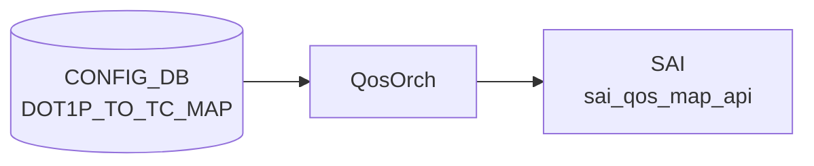

# DOT1P_TO_TC_MAP テーブル

## 概要

`DOT1P_TO_TC_MAP` テーブルは IEEE 802.1p Priority Code Point (PCP, 0-7) を SONiC の Traffic Class へマップするテーブル[^1]。[QoS](../../reference/glossary.md#term-qos) 入口分類で使われ、`PORT_QOS_MAP.dot1p_to_tc_map` から参照される。`qosorch` ([sonic-swss](../../reference/glossary.md#term-sonic-swss)) が [CONFIG_DB](../../reference/glossary.md#term-config_db) を読み、[SAI](../../reference/glossary.md#term-sai) の `SAI_QOS_MAP_TYPE_DOT1P_TO_TC` オブジェクトを生成する。

[YANG](../../reference/glossary.md#term-yang) は親 `DOT1P_TO_TC_MAP_LIST`（key: `name`）と、その下の inner list `DOT1P_TO_TC_MAP`（key: `dot1p`）の 2 段構造。

<!-- cdb-mermaid -->
### データフロー (自動生成)



!!! note "凡例"
    CONFIG_DB から SAI までの典型経路を `docs/reference/config-db-orch-map.md` から機械生成したミニ図。詳細・例外は本ページ本文と対応表を参照。
<!-- /cdb-mermaid -->

## key 構造

```text
DOT1P_TO_TC_MAP|<name>             # マップ全体（hash で dot1p→tc の dict）
```

[CONFIG_DB](../../reference/glossary.md#term-config_db) 上は `DOT1P_TO_TC_MAP|<name>` の単一ハッシュで `dot1p` → `tc` の対応を保持する（一般的な SONiC [QoS](../../reference/glossary.md#term-qos) map と同形式）。

| キー | 型 | 説明 |
|------|----|------|
| `name` | string (1..32) | マップ名。`[a-zA-Z0-9]{1}([-a-zA-Z0-9_]{0,31})` |

## フィールド

inner list で定義される各エントリ:

| フィールド | 型 | 説明 |
|-----------|----|------|
| `dot1p` | string パターン `[0-7]?` | 802.1p PCP 値（0-7） |
| `tc` | `sonic-types:tc_type` (uint8 0..15) | マップ先 Traffic Class。YANG は 0..15 を許容するが多くの ASIC は 0..7 のみサポート |

<!-- value-behavior -->
## 値依存挙動マトリクス

### `dot1p` (string pattern [0-7])

| 値 | 挙動 |
|----|------|
| `0`..`7` | qosorch が SAI_QOS_MAP_TYPE_DOT1P_TO_TC エントリを生成 |
| 範囲外（8 以上等） | YANG pattern 違反で reject |

### `tc` (tc_type: 0..15)

| 値 | 挙動 |
|----|------|
| `0`..`7` | [SAI](../../reference/glossary.md#term-sai) QoS map オブジェクトの Traffic Class 値として設定（全 ASIC で動作） |
| `8`..`15` | YANG 検証は通過（`tc_type` は `uint8 range 0..15`）。qosorch も通過するが ASIC が拒否する場合あり（プラットフォーム依存） |
| `16` 以上 | YANG 検証で reject |

> `stypes:tc_type` の実体は `uint8 range 0..15`。PORT_QOS_MAP.dot1p_to_tc_map から参照されない限り SAI に反映されない。

<!-- /value-behavior -->

## 制約

- `dot1p` は 0-7 の単一文字
- `name` 文字列長 1..32、パターン制約あり

## 購読者

- `qosorch` ([sonic-swss](../../reference/glossary.md#term-sonic-swss)) — [SAI](../../reference/glossary.md#term-sai) [QoS](../../reference/glossary.md#term-qos) Map オブジェクト生成
- `PORT_QOS_MAP` の `dot1p_to_tc_map` leaf から参照

## 関連 CONFIG_DB / YANG / CLI

- 関連 [CONFIG_DB](../../reference/glossary.md#term-config_db): `PORT_QOS_MAP`、`DSCP_TO_TC_MAP`、`TC_TO_QUEUE_MAP`
- 関連 [YANG](../../reference/glossary.md#term-yang): `sonic-dot1p-tc-map`、`sonic-port-qos-map`
- 関連 CLI: `config qos`

<!-- ref-triangle:start -->

## 関連リファレンス

- [YANG](../../reference/glossary.md#term-yang): [`sonic-dot1p-tc-map`](../yang/sonic-dot1p-tc-map.md)
- CLI: [`config qos`](../cli/config-qos.md)

<!-- ref-triangle:end -->

## 引用元

[^1]: YANG 定義: `sonic-dot1p-tc-map.yang`. <https://github.com/sonic-net/sonic-buildimage/blob/9ea932ec2e18f35e58268ec2e4456b1d4afd65cd/src/sonic-yang-models/yang-models/sonic-dot1p-tc-map.yang>

## 関連ページ
- [CONFIG_DB: DSCP_TO_TC_MAP](dscp-to-tc-map.md)

<!-- ops-hint -->
## 運用ヒント

### 典型値

- key 形式: `DOT1P_TO_TC_MAP|<map-name>`。
- `0`-`7` の dot1p 値→ TC 値。COS6/7 を TC3 などコントロールトラフィック用に分離する設計が一般的。

### よくある誤設定

- PORT_QOS_MAP から参照されていないとマップを定義しても有効化されない。

### 確認コマンド

```bash
sonic-db-cli CONFIG_DB keys 'DOT1P_TO_TC_MAP|*'
show qos map dot1p-tc
```
<!-- /ops-hint -->

<!-- cdb-exceptions -->
## 例外条件・特殊挙動

| consumer | 条件 | 挙動 |
|---|---|---|
| [orchagent](../../reference/glossary.md#term-orchagent) | DEL 時に他テーブル (PORT 等) から参照中 | `m_pendingRemove=true` を立てて `task_need_retry` を返す。参照解放後に削除実行（qosorch.cpp:181-186） |
| [orchagent](../../reference/glossary.md#term-orchagent) | pending remove 中に SET が到着 | `"Entry is pending remove, need retry"` を LOG_NOTICE して `task_need_retry` を返す（qosorch.cpp:136-139） |
| [orchagent](../../reference/glossary.md#term-orchagent) | SAI オブジェクト生成 (`addQosItem`) 失敗 | `"Failed to create [DOT1P_TO_TC_MAP:...]"` を LOG_ERROR して `task_failed` を返す（qosorch.cpp:162-166） |
| orchagent | SAI オブジェクト変更 (`modifyQosItem`) 失敗 | `"Failed to set [DOT1P_TO_TC_MAP:...]"` を LOG_ERROR して `task_failed` を返す（qosorch.cpp:151-155） |
| orchagent | DEL 対象が type map に存在しない | `"Object with name:%s not found."` を LOG_ERROR して `task_invalid_entry` を返す（qosorch.cpp:176-179） |

> **Evidence**: [sonic-swss](../../reference/glossary.md#term-sonic-swss) `orchagent/qosorch.cpp:124-201`
<!-- /cdb-exceptions -->


<!-- runtime-trace -->
## 実コンテナ動作トレース

### 段階 1 — Consumer 登録

`QosOrch` (orchagent 直接 CFG 購読) が CONFIG_DB の `DOT1P_TO_TC_MAP` テーブルを購読する。

`DOT1P_TO_TC_MAP` の key はマップ名 (例: `AZURE`)。`<dot1p_value>` → `<tc_value>` のマッピング。

### 段階 2 — CFG→APPL 翻訳

なし (orchagent が直接 CONFIG_DB を購読)

### 段階 3 — APPL→SAI

`sai_qos_map_api` — `sai_create_qos_map` で DOT1P→TC マッピングテーブルを作成

### 段階 4 — タイミングと副作用

**適用タイミング**: orchagent が CONFIG_DB 変化を検知後即座に SAI QoS map を作成/更新。ポートへのマップ割り当ては `PORT_QOS_MAP` テーブルで行う。

**副作用**: マップ内容の変更は即座にマップを参照するすべてのポートの QoS 分類に影響。traffic の優先度処理が変化する。
<!-- /runtime-trace -->

<!-- entry-points -->
## 書き込み入り口 (Direction A)

対象テーブル: `DOT1P_TO_TC_MAP`

### CLI
- `config qos map dot1p-tc add/del <map-name> <dot1p> <tc>`
  - ソース: `sonic-utilities/config/main.py (qos グループ)`

### minigraph / sonic-cfggen
- なし

### REST / gNMI (sonic-mgmt-common)
- なし (対応 OpenConfig/SONiC YANG transformer なし)

### db_migrator
- なし

### ビルド時デフォルト (init_cfg / j2 テンプレート)
- `qos_config.j2` から platform 別 QoS マップが生成される場合あり

### ハードコードデフォルト
- なし

### ランタイム注入 (デーモン自動書き込み)
- なし
<!-- /entry-points -->

<!-- defaults -->
## 暗黙デフォルト・コード由来挙動

### `name` (マップ名キー)

| 検出種 | 内容 |
|--------|------|
| プラットフォーム依存 | `qos_config.j2` は `type in backend_device_types AND storage_device == 'true'` のストレージバックエンドプラットフォームでのみ `DOT1P_TO_TC_MAP\|AZURE` を注入する。それ以外のプラットフォームにはビルド時デフォルトなし |
| ハードコード固定値 | ストレージバックエンド時のデフォルト: `{"0":"1","1":"0","2":"2","3":"3","4":"4","5":"5","6":"6","7":"7"}` |
| 大文字小文字制約 | YANG pattern は混在大文字小文字を許容するが、Redis キーは大文字小文字区別あり。`AZURE` と `Azure` は別エントリ |

### `dot1p` (エントリキー)

| 検出種 | 内容 |
|--------|------|
| YANG-実装 discrepancy | YANG pattern `[0-7]?` は空文字列 `""` を許容する（`?` で文字省略可）。qosorch は `stoi(fvField(fv))` で処理するため `""` は `std::invalid_argument` を投げる |
| silent drop | `convertFieldValuesToAttributes()` (qosorch.cpp 375-384) は `invalid_argument` / `out_of_range` をキャッチして `continue` — 該当エントリを **サイレントに脱落** させ、残りエントリで SAI マップを生成。`return true` は維持されるため呼び出し元にエラーが伝播しない |
| 書込み後との乖離 | 無効エントリが混在した SET を送ると CONFIG_DB には全エントリが記録されるが SAI には有効エントリのみ反映される（書き込み vs 実行時乖離） |

### `tc` (トラフィッククラス値)

| 検出種 | 内容 |
|--------|------|
| YANG-ドキュメント discrepancy | `stypes:tc_type` の実体は `uint8 range 0..15`（sonic-types.yang.j2:338-346）。本ページ従来記述の 0..7 は誤り。YANG テスト (`qosmaps.json`) でも `"tc":"8"` が有効・`"tc":"16"` が無効として検証済み |
| プラットフォーム依存 | YANG は 0..15 を許容するが、多くの ASIC は TC 0..7 のみサポート。TC 8..15 は YANG 検証を通過しても SAI が拒否する場合がある（ASIC 依存） |
| silent drop | `stoi` 失敗（非数値・範囲外）時は dot1p と同様にエントリがサイレント脱落する |

### 共通挙動

| 検出種 | 内容 |
|--------|------|
| dead consumer | `PORT_QOS_MAP.dot1p_to_tc_map` から参照されない限りマップは SAI オブジェクトとして生成されるが **トラフィック分類に影響しない** |
| 書込み順依存 | DEL pending 中に SET が到着すると `task_need_retry` を返して SET を遅延させる（qosorch.cpp:136-139） |
| partial failure | SET 時は全エントリを一括で SAI に送信（per-entry パッチなし）。1 エントリの不正でも他の有効エントリが反映される（SAI 側は全エントリを受け取る） |
| 暗黙 reset+restore | エントリを削除する唯一の方法は有効エントリを除いたマップ全体を再 SET すること（DEL は名前単位でマップ全体を削除） |
| CONFIG_DB 直接購読 | APPL_DB 中継なし。`QosOrch` が CONFIG_DB を直接購読し即座に SAI へ反映 |

> **Evidence**: `sonic-swss/orchagent/qosorch.cpp:360-397`, `sonic-buildimage/files/build_templates/qos_config.j2:240-253`, `sonic-buildimage/src/sonic-yang-models/yang-templates/sonic-types.yang.j2:338-346`, `sonic-buildimage/src/sonic-yang-models/tests/yang_model_tests/tests_config/qosmaps.json`
<!-- /defaults -->

<!-- glossary-links-injected: b1003b21c66f -->
