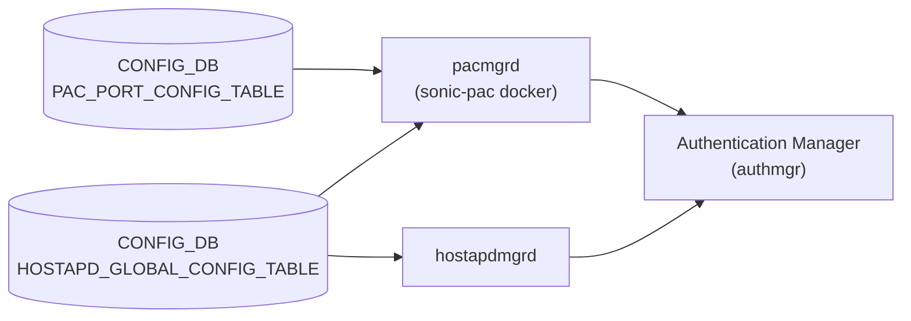

# DOT1X / PAC テーブル

## 概要

Port Access Control (PAC) は [802.1x](../../reference/glossary.md#term-dot1x) と MAC Authentication Bypass (MAB) を使い、ポートに接続するクライアントの認証・認可を行う機能。設定は以下の 2 テーブルに分かれる[^1]。

- **`PAC_PORT_CONFIG_TABLE`**: ポートごとの認証モード・ホストモード・再認証設定
- **`HOSTAPD_GLOBAL_CONFIG_TABLE`**: 802.1x グローバル有効/無効スイッチ

認証方式: 802.1x (EAPoL / hostapd) と MAB (デバイス MAC アドレス認証)。認証サーバは外部 [RADIUS](../../reference/glossary.md#term-radius) サーバ (RFC 2865)。

<!-- cdb-mermaid -->
### データフロー (自動生成)



!!! note "凡例"
    CONFIG_DB から authmgr までの典型経路。SAI 呼び出しは FDB / VLAN Manager 経由で行われる。
<!-- /cdb-mermaid -->

## key 構造

### PAC_PORT_CONFIG_TABLE

```text
PAC_PORT_CONFIG_TABLE|<port>
```

例: `PAC_PORT_CONFIG_TABLE|Ethernet0`

物理ポート単位のエントリ。

### HOSTAPD_GLOBAL_CONFIG_TABLE

```text
HOSTAPD_GLOBAL_CONFIG_TABLE|global
```

固定キー `global` のシングルトン。

## PAC_PORT_CONFIG_TABLE のフィールド

| フィールド | 型 | デフォルト | 説明 |
|-----------|----|-----------|------|
| `port_control_mode` | enum `auto`/`force-authorized`/`force-unauthorized` | `force-authorized` | 認証モード。`auto` でクライアント認証を強制 |
| `host_control_mode` | enum `multi-host`/`multi-auth`/`single-host` | `multi-host` | ホストモード。複数クライアント許可方式の選択 |
| `port_pae_role` | enum `authenticator`/`none` | `none` | `authenticator` で当該ポートに PAC を有効化 |
| `reauth_enable` | boolean | `false` | 定期再認証の有効化 |
| `reauth_period` | uint32 (1..65535 秒) | サーバ値 (≈60) | 再認証間隔。`reauth_period_from_server=false` 時に有効 |
| `reauth_period_from_server` | boolean | `true` | `true` で RADIUS Session-Timeout から再認証周期を取得 |
| `max_users_per_port` | uint8 (1..16) | `16` | `multi-auth` モード時の最大同時認証クライアント数 |
| `max_reauth_attempts` | uint8 | `3` | 認証失敗時の最大再試行回数 |
| `method_list` | list (`dot1x`,`mab`) | `dot1x,mab` | 認証実行順序 |
| `priority_list` | list (`dot1x`,`mab`) | `dot1x,mab` | 認証方式の優先度 |

## HOSTAPD_GLOBAL_CONFIG_TABLE のフィールド

| フィールド | 型 | デフォルト | 説明 |
|-----------|----|-----------|------|
| `dot1x_system_auth_control` | boolean (`true`/`false`) | `false` | スイッチ全体で 802.1x 認証を有効化 |

## ホストモード詳細

| モード | 認証クライアント数 | 認証後の挙動 |
|--------|------------------|-------------|
| `multi-host` | 1 (最初の 1 クライアント) | 認証後、ポートに接続するすべてのクライアントにアクセス許可 |
| `single-host` | 1 | 1 クライアントのみアクセス可 |
| `multi-auth` | 最大 `max_users_per_port` (デフォルト 16) | 各クライアントが個別に認証 |

## 購読者

- `pacmgrd` (`sonic-pac` docker): `PAC_PORT_CONFIG_TABLE` と `HOSTAPD_GLOBAL_CONFIG_TABLE` を `SubscriberStateTable` で購読し、`authmgrPortControlModeSet()` 等の API を介して `authmgr` ライブラリへ反映
- `hostapdmgrd`: `HOSTAPD_GLOBAL_CONFIG_TABLE` を読み `hostapd.conf` を生成し hostapd へ通知
- `mabd`: MAB 固有設定は `MAB_PORT_CONFIG` テーブルを別途参照

## 関連 CONFIG_DB / YANG / CLI

- 関連 CONFIG_DB: `MAB_PORT_CONFIG` (MAB 有効化・認証タイプ)、`RADIUS`、`RADIUS_SERVER`
- 関連 CLI:
  - `config interface authentication port-control <intf> <auto|force-authorized|force-unauthorized>`
  - `config interface dot1x pae <intf> <authenticator|none>`
  - `config interface authentication host-mode <intf> <multi-auth|multi-host|single-host>`
  - `config dot1x system-auth-control <enable|disable>`
  - `config interface authentication periodic <intf> <enable|disable>`
  - `config interface authentication reauth-period <intf> <seconds|server>`
  - `config interface authentication max-users <intf> <count>`
  - `config interface authentication order <intf> <dot1x [mab] | mab [dot1x]>`
  - `config interface authentication priority <intf> <dot1x [mab] | mab [dot1x]>`

## 引用元

[^1]: PAC HLD: `SONiC/doc/pac/Port Access Control.md`, PAC manager: `sonic-pac/pacmgr/pacmgr.cpp` / `pacmgr.h`. <https://github.com/sonic-net/sonic-buildimage/blob/master/src/sonic-pac/>

<!-- ops-hint -->
## 運用ヒント

### 典型的な設定フロー

1. `config dot1x system-auth-control enable` で 802.1x をグローバル有効化
2. VLAN と RADIUS サーバを設定
3. 各ポートに `config interface dot1x pae <intf> authenticator` で PAC を有効化
4. `config interface authentication port-control <intf> auto` で認証強制モードに

### よくある誤設定

- `dot1x_system_auth_control` を `false` のまま (`port_pae_role=authenticator` でも認証が動かない)
- `host_control_mode=multi-host` なのに `max_users_per_port` を変更しても効果なし (`multi-auth` のみ有効)
- `reauth_enable=false` のまま長時間セッション維持 → 802.1x 証明書期限切れ後も認証済みのまま残留

### 確認コマンド

```bash
show authentication interface
show dot1x
show mab interface
sonic-db-cli CONFIG_DB hgetall 'PAC_PORT_CONFIG_TABLE|Ethernet0'
sonic-db-cli CONFIG_DB hgetall 'HOSTAPD_GLOBAL_CONFIG_TABLE|global'
```
<!-- /ops-hint -->

<!-- cdb-exceptions -->
## 例外条件・特殊挙動

| 条件 | 挙動 |
|------|------|
| `port_control_mode` に `auto`/`force-authorized`/`force-unauthorized` 以外 | SWSS_LOG_WARN 後 `continue` でスキップ（DB 値無視） |
| `host_control_mode` に有効値以外 | 同上 |
| ポートキーに `E` プレフィックスが無い | SWSS_LOG_NOTICE 後スキップ |
| `fpGetIntIfNumFromHostIfName()` 失敗 | 内部インタフェース番号取得不可 → 設定反映されない |
| `HOSTAPD_GLOBAL_CONFIG_TABLE` の DEL 操作 | SWSS_LOG_WARN で無視（DEL は非サポート） |
| authmgr API (例: `authmgrPortControlModeSet`) が SUCCESS 以外 | SWSS_LOG_ERROR 後 `return false`（該当パラメータを DEF 値に戻す） |

<!-- /cdb-exceptions -->

<!-- value-behavior -->
## 値依存挙動マトリクス

### `port_control_mode`

| 値 | 挙動 |
|----|------|
| `force-authorized` (既定) | すべてのトラフィックを許可。認証不要 |
| `auto` | 認証を強制。未認証クライアントのトラフィックをブロック |
| `force-unauthorized` | すべてのトラフィックをブロック |

### `port_pae_role`

| 値 | 挙動 |
|----|------|
| `none` (既定) | PAC 無効。`port_control_mode` 設定があっても 802.1x 処理を行わない |
| `authenticator` | PAC 有効。EAPoL 受信・RADIUS 認証処理を実行 |

### `dot1x_system_auth_control`

| 値 | 挙動 |
|----|------|
| `false` (既定) | 802.1x 全体が無効。`port_pae_role=authenticator` でも EAPoL 認証セッションを開始しない |
| `true` | 802.1x 有効。既存セッションがあれば `authmgrPortClientAuthStatusUpdate(ALL_INTERFACES, AUTHMGR_METHOD_8021X, AUTHMGR_METHOD_CHANGE, ...)` が呼ばれ全ポートの 802.1x セッションを終了 |

<!-- /value-behavior -->

<!-- entry-points -->
## 書き込み入り口 (Direction A)

### CLI

- `config interface authentication *` — sonic-utilities の PAC CLI 群
- `config dot1x system-auth-control` — `HOSTAPD_GLOBAL_CONFIG_TABLE|global` の `dot1x_system_auth_control` を書き込む

### minigraph / sonic-cfggen

なし（PAC は minigraph に含まれない）

### REST / gNMI

なし（SONiC YANG モデルが未定義のため）

### db_migrator

なし

### ビルド時デフォルト

なし（PAC テーブルはデフォルトでは CONFIG_DB に存在しない; CLI 設定時に初めて生成される）

### ランタイム注入

なし
<!-- /entry-points -->

<!-- derivation -->
## 派生・条件付き登録 (Phase 6/7)

### Phase 6: 自動派生

`doPacPortTableSetTask()` が呼ばれるたびに、未設定フィールドに `AUTHMGR_*_DEF` マクロ値を初期値として設定した後、DB 値で上書きする。これにより DB にフィールドが存在しない場合は暗黙デフォルトが適用される。

### Phase 7: 条件付き登録

- `pacmgrd` は `PAC_PORT_CONFIG_TABLE` を無条件購読。
- ただし `dot1x_system_auth_control=false` の場合、802.1x 認証セッション (hostapd) は開始されない。
- MAB は `MAB_PORT_CONFIG` テーブルで個別に有効化が必要。

<!-- /derivation -->

<!-- defaults -->
## コード由来の暗黙デフォルト (Phase A)

> `AUTHMGR_*_DEF` マクロ (`pacmgr.h`) が C++ レベルの fallback を定義する。
> `doPacPortTableSetTask()` は毎回これらで cache を初期化してから DB 値を上書きするため、
> DB に当該フィールドが存在しない場合は DEF 値が authmgr へ渡される。

### `port_control_mode`

| 種別 | 値 | ソース |
|------|----|--------|
| C++ マクロデフォルト | `AUTHMGR_PORT_FORCE_AUTHORIZED` = `"force-authorized"` | `pacmgr.h:41` |
| 初期化コード | `pacPortConfigCache.port_control_mode = AUTHMGR_PORT_CONTROL_MODE_DEF` | `pacmgr.cpp:200` |
| DEL 後リセット | `iter->second.port_control_mode = AUTHMGR_PORT_CONTROL_MODE_DEF` | `pacmgr.cpp:623` |
| HLD CLI 記述 | "Default is force-authorized." | `Port Access Control.md:712` |

**乖離**: なし。CLI 記述とコードが一致。

---

### `host_control_mode`

| 種別 | 値 | ソース |
|------|----|--------|
| C++ マクロデフォルト | `AUTHMGR_MULTI_HOST_MODE` = `"multi-host"` | `pacmgr.h:42` |
| 初期化コード | `pacPortConfigCache.host_control_mode = AUTHMGR_HOST_CONTROL_MODE_DEF` | `pacmgr.cpp:201` |
| DEL 後リセット | `iter->second.host_control_mode = AUTHMGR_HOST_CONTROL_MODE_DEF` | `pacmgr.cpp:624` |
| HLD CLI 記述 | "Default is multi-host." | `Port Access Control.md:714` |

**乖離**: なし。

---

### `port_pae_role`

| 種別 | 値 | ソース |
|------|----|--------|
| C++ マクロデフォルト | `DOT1X_PAE_PORT_NONE_CAPABLE` = `0x00` = `"none"` | `pacmgr.h:49`、`auth_mgr_common.h:318` |
| 初期化コード | `pacPortConfigCache.port_pae_role = AUTHMGR_PORT_PAE_ROLE_DEF` | `pacmgr.cpp:207` |
| DEL 後リセット | `iter->second.port_pae_role = AUTHMGR_PORT_PAE_ROLE_DEF` | `pacmgr.cpp:630` |
| HLD CLI 記述 | "Default is none." | `Port Access Control.md:713` |

**乖離**: なし。`"none"` は PAC 機能がポートで無効であることを意味する (`authmgrDot1xCapabilitiesUpdate` 非呼び出し)。

---

### `reauth_enable`

| 種別 | 値 | ソース |
|------|----|--------|
| C++ マクロデフォルト | `FD_AUTHMGR_PORT_REAUTH_ENABLED` (= `false` 相当) | `pacmgr.h:43` |
| 初期化コード | `pacPortConfigCache.reauth_enable = AUTHMGR_REAUTH_ENABLE_DEF` | `pacmgr.cpp:202` |
| DEL 後リセット | `iter->second.reauth_enable = AUTHMGR_REAUTH_ENABLE_DEF` | `pacmgr.cpp:625` |
| HLD CLI 記述 | "Default is disabled." | `Port Access Control.md:719` |

**注**: `FD_AUTHMGR_PORT_REAUTH_ENABLED` は `defaultconfig.h` (ビルド時生成、shallow clone 未収録) で定義。HLD と C++ 動作から `false` (無効) と確認。

---

### `reauth_period` / `reauth_period_from_server`

| 種別 | 値 | ソース |
|------|----|--------|
| `reauth_period_from_server` デフォルト | `FD_AUTHMGR_PORT_REAUTH_PERIOD_FROM_SERVER` = `true` 相当 | `pacmgr.h:45` |
| `reauth_period` デフォルト | `FD_AUTHMGR_PORT_REAUTH_PERIOD` (≈60 秒) | `pacmgr.h:44` |
| `reauth_period_from_server=true` 時の処理 | `authmgrPortReAuthPeriodSet(intIfNum, AUTHMGR_PORT_REAUTH_PERIOD_DEF, ...)` | `pacmgr.cpp:387-393` |
| HLD CLI 記述 | "Default is 'server'." | `Port Access Control.md:719` |

**乖離**: HLD が "server" (= `reauth_period_from_server=true`) をデフォルトと明記。コードも `AUTHMGR_REAUTH_PERIOD_FROM_SERVER_DEF` を `true` 相当で初期化。一致。

---

### `max_users_per_port`

| 種別 | 値 | ソース |
|------|----|--------|
| C++ マクロデフォルト | `FD_AUTHMGR_PORT_MAX_USERS` = `16` | `pacmgr.h:46`、HLD Scalability |
| 初期化コード | `pacPortConfigCache.max_users_per_port = AUTHMGR_MAX_USERS_PER_PORT_DEF` | `pacmgr.cpp:204` |
| DEL 後リセット | `iter->second.max_users_per_port = AUTHMGR_MAX_USERS_PER_PORT_DEF` | `pacmgr.cpp:627` |
| HLD CLI 記述 | "Default is 16." | `Port Access Control.md:716` |

**乖離**: なし。

---

### `max_reauth_attempts`

| 種別 | 値 | ソース |
|------|----|--------|
| C++ マクロデフォルト | `3` (リテラル) | `pacmgr.h:47` |
| 初期化コード | `pacPortConfigCache.max_reauth_attempts = AUTHMGR_MAX_REAUTH_ATTEMPTS_DEF` | `pacmgr.cpp:205` |
| DEL 後リセット | `iter->second.max_reauth_attempts = AUTHMGR_MAX_REAUTH_ATTEMPTS_DEF` | `pacmgr.cpp:629` |
| HLD CLI 記述 | 記述なし（リテラル値のみ） | — |

**注**: `3` はコードリテラルで定義。HLD の CLI テーブルには記述なし。`FD_*` 参照なし（直接数値）。

---

### `method_list` / `priority_list`

| 種別 | 値 | ソース |
|------|----|--------|
| C++ マクロデフォルト [0] | `AUTHMGR_METHOD_8021X` = `"dot1x"` | `pacmgr.h:50,52` |
| C++ マクロデフォルト [1] | `AUTHMGR_METHOD_MAB` = `"mab"` | `pacmgr.h:51,53` |
| 初期化コード | `priority_list[0]=8021X; priority_list[1]=MAB; method_list[0]=8021X; method_list[1]=MAB` | `pacmgr.cpp:208-211` |
| DEL 後リセット | 同値に戻す | `pacmgr.cpp:631-634` |
| HLD CLI 記述 | "Default order is 802.1x,mab." / "Default priority is 802.1x,mab." | `Port Access Control.md:720-721` |

**乖離**: なし。

---

### `dot1x_system_auth_control`

| 種別 | 値 | ソース |
|------|----|--------|
| C++ 構造体 memset | `0` = `false` | `pacmgr.cpp:74` (`memset(&m_glbl_info, 0, sizeof(m_glbl_info))`) |
| SET handler | `m_glbl_info.enable_auth = 1` で有効、`= 0` で無効 | `pacmgr.cpp:1162-1174` |
| HLD CLI 記述 | "Default is disabled." | `Port Access Control.md:715` |

**乖離**: なし。`false` (= `0`) がデフォルト。`true` 設定時、既存セッション終了処理が発火することに注意。

---

### 全フィールドサマリー

| フィールド | テーブル | コード由来デフォルト | 乖離 |
|-----------|---------|-------------------|------|
| `port_control_mode` | PAC_PORT_CONFIG_TABLE | `"force-authorized"` | なし |
| `host_control_mode` | PAC_PORT_CONFIG_TABLE | `"multi-host"` | なし |
| `port_pae_role` | PAC_PORT_CONFIG_TABLE | `"none"` | なし |
| `reauth_enable` | PAC_PORT_CONFIG_TABLE | `false` | なし |
| `reauth_period_from_server` | PAC_PORT_CONFIG_TABLE | `true` | なし |
| `reauth_period` | PAC_PORT_CONFIG_TABLE | `FD_AUTHMGR_PORT_REAUTH_PERIOD` (≈60s) | shallow clone で実値未確認 |
| `max_users_per_port` | PAC_PORT_CONFIG_TABLE | `16` | なし |
| `max_reauth_attempts` | PAC_PORT_CONFIG_TABLE | `3` (リテラル) | HLD に記述なし |
| `method_list` | PAC_PORT_CONFIG_TABLE | `["dot1x","mab"]` | なし |
| `priority_list` | PAC_PORT_CONFIG_TABLE | `["dot1x","mab"]` | なし |
| `dot1x_system_auth_control` | HOSTAPD_GLOBAL_CONFIG_TABLE | `false` | なし |

<!-- evidence: sonic-pac/pacmgr/pacmgr.h:41-53, pacmgr.cpp:74,200-211,623-634,1162-1174; auth_mgr_common.h:318-319; SONiC/doc/pac/Port Access Control.md:712-721 -->
<!-- /defaults -->

<!-- glossary-links-injected: dot1x-pac -->
