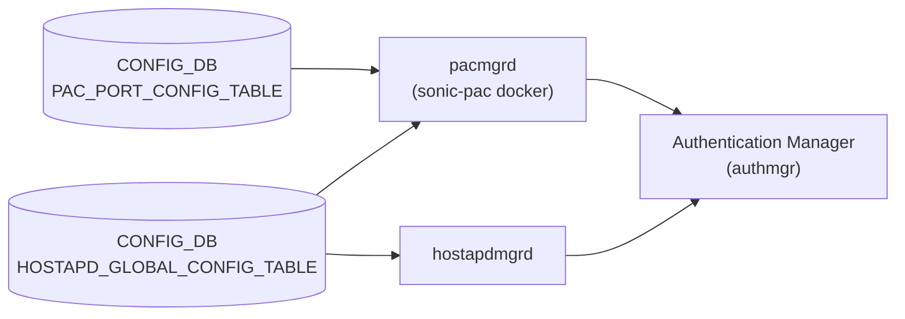

# DOT1X / PAC テーブル

## 概要

Port Access Control (PAC) は [802.1x](../../reference/glossary.md#term-dot1x) と MAC Authentication Bypass (MAB) を使い、ポートに接続するクライアントの認証・認可を行う機能。設定は以下の 2 テーブルに分かれる[^1]。

- **`PAC_PORT_CONFIG_TABLE`**: ポートごとの認証モード・ホストモード・再認証設定
- **`HOSTAPD_GLOBAL_CONFIG_TABLE`**: 802.1x グローバル有効/無効スイッチ

認証方式: 802.1x (EAPoL / hostapd) と MAB (デバイス MAC アドレス認証)。認証サーバは外部 [RADIUS](../../reference/glossary.md#term-radius) サーバ (RFC 2865)。

<!-- cdb-mermaid -->
### データフロー (自動生成)



!!! note "凡例"
    CONFIG_DB から authmgr までの典型経路。SAI 呼び出しは FDB / VLAN Manager 経由で行われる。
<!-- /cdb-mermaid -->

## key 構造

### PAC_PORT_CONFIG_TABLE

```text
PAC_PORT_CONFIG_TABLE|<port>
```

例: `PAC_PORT_CONFIG_TABLE|Ethernet0`

物理ポート単位のエントリ。

### HOSTAPD_GLOBAL_CONFIG_TABLE

```text
HOSTAPD_GLOBAL_CONFIG_TABLE|global
```

固定キー `global` のシングルトン。

## PAC_PORT_CONFIG_TABLE のフィールド

| フィールド | 型 | デフォルト | 説明 |
|-----------|----|-----------|------|
| `port_control_mode` | enum `auto`/`force-authorized`/`force-unauthorized` | `force-authorized` | 認証モード。`auto` でクライアント認証を強制 |
| `host_control_mode` | enum `multi-host`/`multi-auth`/`single-host` | `multi-host` | ホストモード。複数クライアント許可方式の選択 |
| `port_pae_role` | enum `authenticator`/`none` | `none` | `authenticator` で当該ポートに PAC を有効化 |
| `reauth_enable` | boolean | `false` | 定期再認証の有効化 |
| `reauth_period` | uint32 (1..65535 秒) | サーバ値 (≈60) | 再認証間隔。`reauth_period_from_server=false` 時に有効 |
| `reauth_period_from_server` | boolean | `true` | `true` で RADIUS Session-Timeout から再認証周期を取得 |
| `max_users_per_port` | uint8 (1..16) | `16` | `multi-auth` モード時の最大同時認証クライアント数 |
| `max_reauth_attempts` | uint8 | `3` | 認証失敗時の最大再試行回数 |
| `method_list` | list (`dot1x`,`mab`) | `dot1x,mab` | 認証実行順序 |
| `priority_list` | list (`dot1x`,`mab`) | `dot1x,mab` | 認証方式の優先度 |

## HOSTAPD_GLOBAL_CONFIG_TABLE のフィールド

| フィールド | 型 | デフォルト | 説明 |
|-----------|----|-----------|------|
| `dot1x_system_auth_control` | boolean (`true`/`false`) | `false` | スイッチ全体で 802.1x 認証を有効化 |

## ホストモード詳細

| モード | 認証クライアント数 | 認証後の挙動 |
|--------|------------------|-------------|
| `multi-host` | 1 (最初の 1 クライアント) | 認証後、ポートに接続するすべてのクライアントにアクセス許可 |
| `single-host` | 1 | 1 クライアントのみアクセス可 |
| `multi-auth` | 最大 `max_users_per_port` (デフォルト 16) | 各クライアントが個別に認証 |

## 購読者

- `pacmgrd` (`sonic-pac` docker): `PAC_PORT_CONFIG_TABLE` と `HOSTAPD_GLOBAL_CONFIG_TABLE` を `SubscriberStateTable` で購読し、`authmgrPortControlModeSet()` 等の API を介して `authmgr` ライブラリへ反映
- `hostapdmgrd`: `HOSTAPD_GLOBAL_CONFIG_TABLE` を読み `hostapd.conf` を生成し hostapd へ通知
- `mabd`: MAB 固有設定は `MAB_PORT_CONFIG` テーブルを別途参照

## 関連 CONFIG_DB / YANG / CLI

- 関連 CONFIG_DB: `MAB_PORT_CONFIG` (MAB 有効化・認証タイプ)、`RADIUS`、`RADIUS_SERVER`
- 関連 CLI:
  - `config interface authentication port-control <intf> <auto|force-authorized|force-unauthorized>`
  - `config interface dot1x pae <intf> <authenticator|none>`
  - `config interface authentication host-mode <intf> <multi-auth|multi-host|single-host>`
  - `config dot1x system-auth-control <enable|disable>`
  - `config interface authentication periodic <intf> <enable|disable>`
  - `config interface authentication reauth-period <intf> <seconds|server>`
  - `config interface authentication max-users <intf> <count>`
  - `config interface authentication order <intf> <dot1x [mab] | mab [dot1x]>`
  - `config interface authentication priority <intf> <dot1x [mab] | mab [dot1x]>`

## 引用元

[^1]: PAC HLD: `SONiC/doc/pac/Port Access Control.md`, PAC manager: `sonic-pac/pacmgr/pacmgr.cpp` / `pacmgr.h`. <https://github.com/sonic-net/sonic-buildimage/blob/master/src/sonic-pac/>

<!-- ops-hint -->
## 運用ヒント

### 典型的な設定フロー

1. `config dot1x system-auth-control enable` で 802.1x をグローバル有効化
2. VLAN と RADIUS サーバを設定
3. 各ポートに `config interface dot1x pae <intf> authenticator` で PAC を有効化
4. `config interface authentication port-control <intf> auto` で認証強制モードに

### よくある誤設定

- `dot1x_system_auth_control` を `false` のまま (`port_pae_role=authenticator` でも認証が動かない)
- `host_control_mode=multi-host` なのに `max_users_per_port` を変更しても効果なし (`multi-auth` のみ有効)
- `reauth_enable=false` のまま長時間セッション維持 → 802.1x 証明書期限切れ後も認証済みのまま残留

### 確認コマンド

```bash
show authentication interface
show dot1x
show mab interface
sonic-db-cli CONFIG_DB hgetall 'PAC_PORT_CONFIG_TABLE|Ethernet0'
sonic-db-cli CONFIG_DB hgetall 'HOSTAPD_GLOBAL_CONFIG_TABLE|global'
```
<!-- /ops-hint -->

<!-- cdb-exceptions -->
## 例外条件・特殊挙動

| 条件 | 挙動 |
|------|------|
| `port_control_mode` に `auto`/`force-authorized`/`force-unauthorized` 以外 | SWSS_LOG_WARN 後 `continue` でスキップ（DB 値無視） |
| `host_control_mode` に有効値以外 | 同上 |
| ポートキーに `E` プレフィックスが無い | SWSS_LOG_NOTICE 後スキップ |
| `fpGetIntIfNumFromHostIfName()` 失敗 | 内部インタフェース番号取得不可 → 設定反映されない |
| `HOSTAPD_GLOBAL_CONFIG_TABLE` の DEL 操作 | SWSS_LOG_WARN で無視（DEL は非サポート） |
| authmgr API (例: `authmgrPortControlModeSet`) が SUCCESS 以外 | SWSS_LOG_ERROR 後 `return false`（該当パラメータを DEF 値に戻す） |

<!-- /cdb-exceptions -->

<!-- value-behavior -->
## 値依存挙動マトリクス

### `port_control_mode`

| 値 | 挙動 |
|----|------|
| `force-authorized` (既定) | すべてのトラフィックを許可。認証不要 |
| `auto` | 認証を強制。未認証クライアントのトラフィックをブロック |
| `force-unauthorized` | すべてのトラフィックをブロック |

### `port_pae_role`

| 値 | 挙動 |
|----|------|
| `none` (既定) | PAC 無効。`port_control_mode` 設定があっても 802.1x 処理を行わない |
| `authenticator` | PAC 有効。EAPoL 受信・RADIUS 認証処理を実行 |

### `dot1x_system_auth_control`

| 値 | 挙動 |
|----|------|
| `false` (既定) | 802.1x 全体が無効。`port_pae_role=authenticator` でも EAPoL 認証セッションを開始しない |
| `true` | 802.1x 有効。既存セッションがあれば `authmgrPortClientAuthStatusUpdate(ALL_INTERFACES, AUTHMGR_METHOD_8021X, AUTHMGR_METHOD_CHANGE, ...)` が呼ばれ全ポートの 802.1x セッションを終了 |

<!-- /value-behavior -->

<!-- entry-points -->
## 書き込み入り口 (Direction A)

### CLI

- `config interface authentication *` — sonic-utilities の PAC CLI 群
- `config dot1x system-auth-control` — `HOSTAPD_GLOBAL_CONFIG_TABLE|global` の `dot1x_system_auth_control` を書き込む

### minigraph / sonic-cfggen

なし（PAC は minigraph に含まれない）

### REST / gNMI

なし（SONiC YANG モデルが未定義のため）

### db_migrator

なし

### ビルド時デフォルト

なし（PAC テーブルはデフォルトでは CONFIG_DB に存在しない; CLI 設定時に初めて生成される）

### ランタイム注入

なし
<!-- /entry-points -->

<!-- derivation -->
## 派生・条件付き登録 (Phase 6/7)

### Phase 6: 自動派生

`doPacPortTableSetTask()` が呼ばれるたびに、未設定フィールドに `AUTHMGR_*_DEF` マクロ値を初期値として設定した後、DB 値で上書きする。これにより DB にフィールドが存在しない場合は暗黙デフォルトが適用される。

### Phase 7: 条件付き登録

- `pacmgrd` は `PAC_PORT_CONFIG_TABLE` を無条件購読。
- ただし `dot1x_system_auth_control=false` の場合、802.1x 認証セッション (hostapd) は開始されない。
- MAB は `MAB_PORT_CONFIG` テーブルで個別に有効化が必要。

<!-- /derivation -->

<!-- ordering -->
## 書込み順依存 (Phase B)

`pacmgrd` / `hostapdmgrd` は CONFIG_DB を購読するが、内部の初期化完了と外部依存 (RADIUS・VLAN) の到着順が反映タイミングに影響する。

### pacmgrd 起動シーケンス

`pacmgr_main.cpp` の `main()` は以下の順で初期化する:

1. `fpinfraInit()` — プラットフォームインタフェース基盤の初期化
2. `authmgrInit()` — 認証マネージャの初期化。失敗時は即 `return -1`
3. `osapiWaitForTaskInit(AUTHMGR_DB_TASK_SYNC, WAIT_FOREVER)` — authmgr 内部 DB タスクの完了を**無限待機**
4. `s.addSelectables(pacmgr.getSelectables())` — CONFIG_DB / STATE_DB 購読登録
5. メインループ開始 → `pacmgr.processDbEvent()` でイベント処理

CONFIG_DB の購読は step 4 以降にのみ有効となるため、`PAC_PORT_CONFIG_TABLE` や `HOSTAPD_GLOBAL_CONFIG_TABLE` の変更は authmgr 初期化完了後に初めて処理される。

### 検出された順序依存

| # | 依存関係 | 方向 | 緩和策 |
|---|----------|------|--------|
| 1 | `authmgrInit()` 完了 → CONFIG_DB 購読開始 | **強制先行** | authmgr 初期化失敗時は pacmgrd 自体が終了する |
| 2 | `port_pae_role=authenticator` + `control_mode=auto` 設定 → `dot1x_system_auth_control=true` 設定 | 推奨先行 | 逆順も動作するが、global enable 時に既存ポートを走査して conf 生成するためポート設定先行が安全 |
| 3 | `RADIUS_SERVER` 設定 → hostapd 起動 | **強制先行** | RADIUS 未設定の場合 `m_radiusServerInUse == ""` チェックで `createConfFile()` が呼ばれず hostapd が起動しない |
| 4 | STATE_DB `VLAN_TABLE` エントリ存在 → authmgr へ `VLAN_ADD_NOTIFY` | 到着順依存 | VLAN が STATE_DB に登録される前に PAC ポートが `authenticator` になると、VLAN 通知が遅延する |

### 主要な制約詳細

**authmgr 初期化待機 (依存 #1)**: `osapiWaitForTaskInit(AUTHMGR_DB_TASK_SYNC, WAIT_FOREVER)` は authmgr 内部タスクの DB 同期完了まで無限待機する（`pacmgr_main.cpp:52-56`）。この待機が終わらない限り CONFIG_DB の購読が開始されないため、SONiC 起動直後に `PAC_PORT_CONFIG_TABLE` を書き込んでも pacmgrd が受け取るのは authmgr 準備完了後となる。

**RADIUS サーバ必須条件 (依存 #3)**: `hostapdmgr.cpp` の `dot1x_system_auth_control=true` 受信時、`m_radiusServerInUse` が空文字列の場合は `createConfFile()` が呼ばれず `active_intf_cnt` が増加しないため hostapd が起動しない（`hostapdmgr.cpp:288-300`）。

**global enable タイミング (依存 #2)**: `dot1x_system_auth_control=true` 受信時、`hostapdmgrd` は `m_intf_info` をイテレートして `capabilities=authenticator` かつ `control_mode=auto` かつ `link_status=true` なインタフェースの conf を一括生成する（`hostapdmgr.cpp:285-302`）。ポート設定を先に完了させてから global enable を行う方が conf 生成漏れのリスクが低い。ただし `pacmgrd` 側の `doPacPortTableSetTask()` は global auth 状態を参照しないため、設定順が逆でも pacmgrd の処理自体は完了する。

<!-- evidence: sonic-buildimage/src/sonic-pac/pacmgr/pacmgr_main.cpp:44-65; pacmgr.cpp:63-89,142-190,684-752; hostapdmgr/hostapdmgr_main.cpp:25-99; hostapdmgr/hostapdmgr.cpp:260-310,1136-1190 -->
<!-- /ordering -->

<!-- cross-refs -->
## 暗黙参照マップ (Phase C)

`pacmgrd` / `hostapdmgrd` / `mabmgrd` が `PAC_PORT_CONFIG_TABLE` および `HOSTAPD_GLOBAL_CONFIG_TABLE` を処理する際に、暗黙的に参照・依存する CONFIG_DB / STATE_DB テーブルを示す。

| 参照方向 | このテーブル | 相手テーブル / ページ | 条件 |
|---------|------------|---------------------|------|
| pacmgrd → | `PAC_PORT_CONFIG_TABLE` | `VLAN_TABLE` (CONFIG_DB) | VLAN 設定変化時に `authmgrVlanConfChangeCallback()` で authmgr へ通知 (`pacmgr.cpp:67,111`) |
| pacmgrd → | `PAC_PORT_CONFIG_TABLE` | `VLAN_MEMBER_TABLE` (CONFIG_DB) | VLAN メンバー変化時に authmgr へポート add/remove を通知 (`pacmgr.cpp:68,115`) |
| pacmgrd → | `PAC_PORT_CONFIG_TABLE` | `VLAN_TABLE` (STATE_DB) | STATE_DB VLAN 作成/削除イベントを `authmgrVlanChangeCallback()` で authmgr へ転送 (`pacmgr.cpp:69,103`) |
| pacmgrd → | `PAC_PORT_CONFIG_TABLE` | `VLAN_MEMBER_TABLE` (STATE_DB) | STATE_DB VLAN メンバー add/remove を authmgr へ通知 (`pacmgr.cpp:70,107`) |
| hostapdmgrd → | `HOSTAPD_GLOBAL_CONFIG_TABLE` | [`RADIUS_SERVER`](./radius-server.md) | `m_radiusServerInUse != ""` 確認後でないと hostapd が起動しない。RADIUS_SERVER 空なら `createConfFile()` は呼ばれない (`hostapdmgr.cpp:293`) |
| hostapdmgrd → | `HOSTAPD_GLOBAL_CONFIG_TABLE` | [`RADIUS`](./radius.md) | global key / NAS 設定を hostapd.conf に統合 (`hostapdmgr.cpp:46`) |
| hostapdmgrd → | `PAC_PORT_CONFIG_TABLE` | (自テーブル) | global enable 時に全ポートの `capabilities`/`control_mode`/`link_status` を参照して conf 生成可否を判断 (`hostapdmgr.cpp:169,199,293`) |
| mabmgrd → | — | `MAB_PORT_CONFIG_TABLE` | MAB 有効化・認証タイプは mabmgrd が独立管理。PAC_PORT_CONFIG_TABLE とは別プロセス (`mabmgr.cpp:35`) |
| fpinfra 依存 | `PAC_PORT_CONFIG_TABLE` | (プラットフォームインタフェース) | `fpGetIntIfNumFromHostIfName()` が失敗すると設定エントリがスキップされる。インタフェース存在がハードな前提条件 (`pacmgr.cpp:172`) |
| YANG | — | — | SONiC YANG モデル未定義のため REST/gNMI 経路なし |

> **Evidence**: `sonic-pac/pacmgr/pacmgr.cpp:63-89,103-127,172,684-754`; `sonic-pac/hostapdmgr/hostapdmgr.cpp:43-70,145-170,285-300`; `sonic-pac/mabmgr/mabmgr.cpp:35`; 詳細分析 `meta/_intermediate/cdb-flow/dot1x-cross-refs.md`
<!-- /cross-refs -->

<!-- failure -->
## 失敗挙動 (Phase D)

`pacmgrd` (`sonic-pac docker`) が `PAC_PORT_CONFIG_TABLE` / `HOSTAPD_GLOBAL_CONFIG_TABLE` のイベントを処理する際に発生しうる失敗パスを示す。

### 失敗パス一覧 — PAC_PORT_CONFIG_TABLE (pacmgrd)

| # | 失敗条件 | 検出箇所 | 結果 | ログ出力 |
|---|---------|---------|------|---------|
| 1 | ポートキーに `E` プレフィックスなし | `processPacPortConfTblEvent()` L166 | `continue` でスキップ（DB エントリ無視） | `SWSS_LOG_NOTICE "Invalid key format..."` |
| 2 | `fpGetIntIfNumFromHostIfName()` 失敗（インタフェース未存在等） | `processPacPortConfTblEvent()` L172 | `continue` でスキップ（設定未反映） | `SWSS_LOG_NOTICE "Unable to get the internal interface number..."` |
| 3 | `port_control_mode` に無効値 | `doPacPortTableSetTask()` L227 | `WARN` ログのみ → DEF 値 (`force-authorized`) で処理継続 | `SWSS_LOG_WARN "Invalid port control mode received: ..."` |
| 4 | `host_control_mode` に無効値 | `doPacPortTableSetTask()` L240 | `WARN` ログのみ → DEF 値 (`multi-host`) で処理継続 | `SWSS_LOG_WARN "Invalid host control mode received: ..."` |
| 5 | `reauth_enable` に `true`/`false` 以外 | `doPacPortTableSetTask()` L251 | `WARN` ログのみ → DEF 値 (`false`) で処理継続 | `SWSS_LOG_WARN "Invalid value received for reauth enable: ..."` |
| 6 | `port_pae_role` に無効値 | `doPacPortTableSetTask()` L291 | `WARN` ログのみ → DEF 値 (`none`) で処理継続 | `SWSS_LOG_WARN "Invalid option received for port pae role: ..."` |
| 7 | `priority_list` / `method_list` に無効値 | `doPacPortTableSetTask()` L314,340 | `WARN` ログのみ → DEF 値で処理継続 | `SWSS_LOG_WARN "Invalid option received for priority list/method list: ..."` |
| 8 | `authmgrPortControlModeSet()` が FAIL（新規エントリ時） | `doPacPortTableSetTask()` L358 | 内部キャッシュを DEF に戻して `return false` | `SWSS_LOG_ERROR "Unable to set the authentication port control mode."` |
| 9 | `authmgrHostControlModeSet()` が FAIL（新規エントリ時） | `doPacPortTableSetTask()` L365 | DEF に戻して `return false` | `SWSS_LOG_ERROR "Unable to set the authentication host control mode."` |
| 10 | `authmgrPortReAuthEnabledSet()` が FAIL（新規エントリ時） | `doPacPortTableSetTask()` L372 | DEF に戻して `return false` | `SWSS_LOG_ERROR "Unable to set the authentication reauth enable."` |
| 11 | 各 `authmgr*Set()` が FAIL（既存エントリ更新時） | `doPacPortTableSetTask()` L458,474,490,514,530,546,562 | `return false` | 対応する `SWSS_LOG_ERROR` |

### 失敗パス一覧 — HOSTAPD_GLOBAL_CONFIG_TABLE (pacmgrd)

| # | 失敗条件 | 検出箇所 | 結果 | ログ出力 |
|---|---------|---------|------|---------|
| 12 | DEL 操作 | `processPacHostapdConfGlobalTblEvent()` L1182 | `continue` で無視（DEL は非サポート） | `SWSS_LOG_WARN "Unexpected DEL operation on HOSTAPD_GLOBAL_CONFIG_TABLE, ignoring"` |
| 13 | `authmgrPortInfoReset()` が FAIL（DEL 時） | `doPacPortTableDeleteTask()` L616 | キャッシュがリセットされない（ポート設定が残存）。`return true` のままなのでエラー非伝播 | なし |

### `return false` 後の連鎖挙動

`doPacPortTableSetTask()` が `false` を返すと `processPacPortConfTblEvent()` が即 `return false` し、同一バッチ内の後続エントリ処理が中断される。`pacmgr_main.cpp` の main ループは戻り値を評価しないため **pacmgrd プロセス自体は継続** する。ただし失敗エントリ以降の SET は処理されず、次のイベント到着まで保留状態になる。

### 無効値の silent fallback 挙動

フィールド値が無効な場合（上記 #3–#7）、pacmgrd は `WARN` ログを出力するが処理を継続し、当該フィールドは `AUTHMGR_*_DEF` マクロのデフォルト値を authmgr へ渡す。CONFIG_DB 上のエントリは残存するが、実際に適用される設定はデフォルトとなる（書き込み vs 実行時乖離）。

### STATE_DB / ERROR_TABLE への記録

失敗情報の STATE_DB への書き込みはなし。障害情報は syslog のみに出力される。

```bash
# pac コンテナ内のログ確認
docker logs pac 2>&1 | grep -E "ERROR|WARN" | grep -i authmgr
```

> **Evidence**: `sonic-buildimage/src/sonic-pac/pacmgr/pacmgr.cpp:140-200,218-345,355-415,444-565,613-665`; 詳細分析 `meta/_intermediate/cdb-flow/dot1x-failure.md`
<!-- /failure -->

<!-- constants -->
## ハードコード定数 (Phase E)

> 調査証跡: `meta/_intermediate/cdb-flow/dot1x-constants.md`

### インタフェース名プレフィックス定数

`pacmgrd` / `hostapdmgrd` は `PAC_PORT_CONFIG_TABLE` のキー（ポート名）が `"E"` で始まるかを文字列比較でチェックする。

| 定数 | 値 | ソース | 用途 |
|------|----|--------|------|
| `INTFS_PREFIX` | `"E"` | `pacmgr.cpp:59`, `hostapdmgr.cpp:37` | ポートキー先頭チェック。非 Ethernet ポートをスキップ |
| `VLAN_PREFIX` | `"Vlan"` (swss 定義) | `pacmgr.cpp:705,775,884,955` | STATE_VLAN テーブルキーの先頭 4 文字を `strncmp` で検証 |

`"E"` で始まらないキーは `SWSS_LOG_NOTICE("Invalid key format. No 'E' prefix: ...")` を出力して `continue` でスキップされる（`pacmgr.cpp:166-170`）。

### method_list / priority_list の最大要素数

```cpp
#define PRIORITY_METHOD_MAX 2   // pacmgr.h:40
#define INDEX_0             0   // pacmgr.h:38
#define INDEX_1             1   // pacmgr.h:39
```

`method_list` / `priority_list` は要素 [0] と [1] の **2 要素固定**。CONFIG_DB に 3 要素以上を書き込んでも [2] 以降は参照されない（`pacmgr.cpp:431-442`）。

### バッファ・名前長定数

| 定数 | 値 | ソース | 用途 |
|------|----|--------|------|
| `MAX_PACKET_SIZE` | `8192` | `pacmgr.h:36` | 内部パケットバッファ上限 |
| `PACMGR_IFNAME_SIZE` | `60` | `pacmgr.h:55` (= `NIM_IFNAME_SIZE`) | インタフェース名の最大文字長。`fpGetIntIfNumFromHostIfName()` 内部バッファに影響 |
| `STATEDB_KEY_SEPARATOR` | `"\|"` | `pacmgr.h:35` | STATE_DB キーセパレータ（SONiC 共通 `"\|"` と同一） |

### hostapdmgr — hostapd 起動待機定数

```cpp
// waitForHostapdInit() — hostapdmgr.cpp:1261,1267
int count = 10;
usleep(100 * 1000);  // 100ms 間隔
```

hostapd 起動後の PID ファイル (`/etc/hostapd/hostapdPid`) 存在確認を **10 回 × 100ms = 最大 1 秒** 待機する。超過時は `return -1`（起動失敗判定）となり、`waitForHostapdInit()` 呼び出し元の `hostapdmgr.cpp:935` で `SWSS_LOG_NOTICE("hostapd could not be initialized ...")` が記録される。

### hostapdmgr — JSON ファイルパスと削除待機定数

| 定数 / リテラル | 値 | ソース | 用途 |
|---------------|----|--------|------|
| `HOSTAPD_PID_FILE` | `"/etc/hostapd/hostapdPid"` | `hostapdmgr.cpp:38` | hostapd PID ファイルパス。ハードコードで変更不可 |
| hostapd_config.json パス | `"/etc/hostapd/hostapd_config.json"` | `hostapdmgr.cpp:977` | hostapd 再起動時に渡す設定 JSON のパス |
| JSON 削除待機 | `cnt=10`, `sleep(1)` | `hostapdmgr.cpp:975,985` | 旧 JSON ファイルが消えるまで最大 **10 秒** 待機。タイムアウト時はシグナル送信をスキップ |

> **Evidence**: `sonic-buildimage/src/sonic-pac/pacmgr/pacmgr.h:35-55`; `pacmgr.cpp:59,166-170,431-442,705,775,884,955`; `hostapdmgr/hostapdmgr.cpp:37-38,935,975-985,1261-1274`; 詳細分析 `meta/_intermediate/cdb-flow/dot1x-constants.md`
<!-- /constants -->

<!-- side-effects -->
## 副次 DB 書込 (Phase F)

> 調査証跡: `meta/_intermediate/cdb-flow/dot1x-side-effects.md`

`pacmgrd` および `hostapdmgrd` は CONFIG_DB `PAC_PORT_CONFIG_TABLE` / `HOSTAPD_GLOBAL_CONFIG_TABLE` の変更を受け取り、**APPL_DB / STATE_DB / COUNTERS_DB への書き込みは行わない**。副作用は authmgr ライブラリ API 呼び出しおよびファイルシステム操作（hostapd conf 生成/削除）に閉じる。

| 副次 DB | 書込有無 | 根拠 |
|---|---|---|
| APPL_DB | なし | `pacmgr.cpp` に `ProducerStateTable`/`ProducerTable` のインスタンス化なし |
| STATE_DB | なし | `m_stateDb` は constructor で受け取るが `processPacPortConfTblEvent` 内では read-only 参照なし |
| COUNTERS_DB | なし | `pacmgr.cpp` / `hostapdmgr.cpp` に COUNTERS_DB 接続コードなし |
| ASIC_DB | なし | SAI 非経由。authmgr ライブラリが FDB / VLAN 操作を別経路で行う |

### 設定変更時の実行時副作用（非 DB）

| トリガー | Consumer | 副作用 |
|---------|---------|--------|
| `dot1x_system_auth_control=true` | hostapdmgrd | `capabilities=authenticator` かつ `control_mode=auto` かつ `link_status=true` かつ RADIUS 設定済みなポート全件の hostapd conf ファイルを即時生成し `informHostapd("new", ...)` で hostapd へ通知 (`hostapdmgr.cpp:285-307`) |
| `dot1x_system_auth_control=false` | pacmgrd | `authmgrPortClientAuthStatusUpdate(ALL_INTERFACES, AUTHMGR_METHOD_8021X, AUTHMGR_METHOD_CHANGE, {enableStatus=FALSE})` により**全ポートの 802.1x セッションを即時終了** (`pacmgr.cpp:1172-1176`) |
| `dot1x_system_auth_control=false` | hostapdmgrd | `config_created=true` なポートの hostapd conf を全削除し `informHostapd("deleted", ...)` で hostapd へ通知 (`hostapdmgr.cpp:312-335`) |
| `port_control_mode` 変更 | pacmgrd | `authmgrPortControlModeSet()` でポートの認証状態マシンを即時更新。`force-unauthorized` への変更は認証済みクライアントのトラフィックをブロック (`pacmgr.cpp:452-460`) |
| `port_pae_role=none` に変更 | pacmgrd | `authmgrDot1xCapabilitiesUpdate()` で EAPoL 送受信を無効化。実行中の EAPoL セッションが中断される (`pacmgr.cpp:551-563`) |

!!! warning "`dot1x_system_auth_control=false` は全セッション即時切断"
    `HOSTAPD_GLOBAL_CONFIG_TABLE|global` の `dot1x_system_auth_control` を `false` に設定すると、
    `pacmgrd` が `authmgrPortClientAuthStatusUpdate(ALL_INTERFACES, ...)` を呼び出し、
    スイッチ上のすべての 802.1x 認証セッションが即座に終了する。
    メンテナンス作業中に誤って設定変更を行うと全クライアントの通信が瞬断するため注意が必要。

> **Evidence**: `sonic-buildimage/src/sonic-pac/pacmgr/pacmgr.cpp:63-89,1160-1177`; `sonic-pac/hostapdmgr/hostapdmgr.cpp:260-346`; 詳細分析 `meta/_intermediate/cdb-flow/dot1x-side-effects.md`
<!-- /side-effects -->

<!-- pubsub -->
## 通信メカニズム (Phase G)

> 調査証跡: `meta/_intermediate/cdb-flow/dot1x-pubsub.md`

### Redis 購読方式

`PAC_PORT_CONFIG_TABLE` および `HOSTAPD_GLOBAL_CONFIG_TABLE` への変更通知は **`SubscriberStateTable` (keyspace PSUBSCRIBE)** で配信される。`ConsumerStateTable`（channel ベース PUBLISH/SUBSCRIBE）は使用しない。

| 購読者 | 購読 API | 購読テーブル | 用途 |
|--------|---------|-------------|------|
| `pacmgrd` | `SubscriberStateTable` | `PAC_PORT_CONFIG_TABLE` | ポートごとの認証モード・ホストモード・再認証設定を authmgr へ反映 |
| `pacmgrd` | `SubscriberStateTable` | `HOSTAPD_GLOBAL_CONFIG_TABLE` | グローバル 802.1x 有効/無効を authmgr へ反映 |
| `pacmgrd` | `SubscriberStateTable` | `VLAN` / `VLAN_MEMBER` (CONFIG_DB) | VLAN 設定変化を authmgr へ通知 |
| `pacmgrd` | `SubscriberStateTable` | `VLAN_TABLE` / `VLAN_MEMBER_TABLE` (STATE_DB) | VLAN 状態変化を authmgr へ通知 |
| `hostapdmgrd` | `SubscriberStateTable` | `PAC_PORT_CONFIG_TABLE` | ポート認証設定変化から hostapd conf を生成/削除 |
| `hostapdmgrd` | `SubscriberStateTable` | `HOSTAPD_GLOBAL_CONFIG_TABLE` | 802.1x グローバル有効/無効で hostapd を起動/停止 |
| `hostapdmgrd` | `SubscriberStateTable` | `RADIUS_SERVER` | RADIUS サーバ変化を hostapd conf に反映 |
| `hostapdmgrd` | `SubscriberStateTable` | `RADIUS` | RADIUS グローバル設定変化を hostapd conf に反映 |

### イベントフロー (pacmgrd)

```
CONFIG_DB HSET "PAC_PORT_CONFIG_TABLE|Ethernet0" port_control_mode auto
  ↓ keyspace PUBLISH "__keyspace@<dbId>__:PAC_PORT_CONFIG_TABLE|Ethernet0" "hset"
pacmgrd SubscriberStateTable.pops()
  ↓ HGETALL "PAC_PORT_CONFIG_TABLE|Ethernet0"
processPacPortConfTblEvent()
  ↓ fpGetIntIfNumFromHostIfName("Ethernet0", &intIfNum)
  ↓ authmgrPortControlModeSet(intIfNum, AUTHMGR_PORT_AUTO)
```

### イベントフロー (hostapdmgrd)

```
CONFIG_DB HSET "HOSTAPD_GLOBAL_CONFIG_TABLE|global" dot1x_system_auth_control true
  ↓ keyspace PUBLISH "__keyspace@<dbId>__:HOSTAPD_GLOBAL_CONFIG_TABLE|global" "hset"
hostapdmgrd SubscriberStateTable.pops()
  ↓ HGETALL "HOSTAPD_GLOBAL_CONFIG_TABLE|global"
processHostapdConfigGlobalTblEvent()
  ↓ enable_auth=true → m_radiusServerInUse が設定済みなポートの hostapd conf を生成
  ↓ informHostapd("new", ...) で hostapd プロセスへ通知
```

- `pacmgrd` は pac ソケットからの非同期メッセージ (`pacqueue`) も同一 `swss::Select` で多重化する (`pacmgr_main.cpp:65`)。
- keyspace 通知のペイロードは操作名 (`hset`/`del`) のみ。フィールド値は HGETALL で別途取得する。
- ポーリング間隔: swss::Select のデフォルトタイムアウト (通常 1000 ms)。

> **Evidence**: `sonic-buildimage/src/sonic-pac/pacmgr/pacmgr.h:137-147`; `sonic-buildimage/src/sonic-pac/pacmgr/pacmgr.cpp:80-133`; `sonic-buildimage/src/sonic-pac/pacmgr/pacmgr_main.cpp:65`; `sonic-buildimage/src/sonic-pac/hostapdmgr/hostapdmgr.h:81-84`; `sonic-buildimage/src/sonic-pac/hostapdmgr/hostapdmgr.cpp:69-100`; 詳細分析 `meta/_intermediate/cdb-flow/dot1x-pubsub.md`
<!-- /pubsub -->

<!-- defaults -->
## コード由来の暗黙デフォルト (Phase A)

> `AUTHMGR_*_DEF` マクロ (`pacmgr.h`) が C++ レベルの fallback を定義する。
> `doPacPortTableSetTask()` は毎回これらで cache を初期化してから DB 値を上書きするため、
> DB に当該フィールドが存在しない場合は DEF 値が authmgr へ渡される。

### `port_control_mode`

| 種別 | 値 | ソース |
|------|----|--------|
| C++ マクロデフォルト | `AUTHMGR_PORT_FORCE_AUTHORIZED` = `"force-authorized"` | `pacmgr.h:41` |
| 初期化コード | `pacPortConfigCache.port_control_mode = AUTHMGR_PORT_CONTROL_MODE_DEF` | `pacmgr.cpp:200` |
| DEL 後リセット | `iter->second.port_control_mode = AUTHMGR_PORT_CONTROL_MODE_DEF` | `pacmgr.cpp:623` |
| HLD CLI 記述 | "Default is force-authorized." | `Port Access Control.md:712` |

**乖離**: なし。CLI 記述とコードが一致。

---

### `host_control_mode`

| 種別 | 値 | ソース |
|------|----|--------|
| C++ マクロデフォルト | `AUTHMGR_MULTI_HOST_MODE` = `"multi-host"` | `pacmgr.h:42` |
| 初期化コード | `pacPortConfigCache.host_control_mode = AUTHMGR_HOST_CONTROL_MODE_DEF` | `pacmgr.cpp:201` |
| DEL 後リセット | `iter->second.host_control_mode = AUTHMGR_HOST_CONTROL_MODE_DEF` | `pacmgr.cpp:624` |
| HLD CLI 記述 | "Default is multi-host." | `Port Access Control.md:714` |

**乖離**: なし。

---

### `port_pae_role`

| 種別 | 値 | ソース |
|------|----|--------|
| C++ マクロデフォルト | `DOT1X_PAE_PORT_NONE_CAPABLE` = `0x00` = `"none"` | `pacmgr.h:49`、`auth_mgr_common.h:318` |
| 初期化コード | `pacPortConfigCache.port_pae_role = AUTHMGR_PORT_PAE_ROLE_DEF` | `pacmgr.cpp:207` |
| DEL 後リセット | `iter->second.port_pae_role = AUTHMGR_PORT_PAE_ROLE_DEF` | `pacmgr.cpp:630` |
| HLD CLI 記述 | "Default is none." | `Port Access Control.md:713` |

**乖離**: なし。`"none"` は PAC 機能がポートで無効であることを意味する (`authmgrDot1xCapabilitiesUpdate` 非呼び出し)。

---

### `reauth_enable`

| 種別 | 値 | ソース |
|------|----|--------|
| C++ マクロデフォルト | `FD_AUTHMGR_PORT_REAUTH_ENABLED` (= `false` 相当) | `pacmgr.h:43` |
| 初期化コード | `pacPortConfigCache.reauth_enable = AUTHMGR_REAUTH_ENABLE_DEF` | `pacmgr.cpp:202` |
| DEL 後リセット | `iter->second.reauth_enable = AUTHMGR_REAUTH_ENABLE_DEF` | `pacmgr.cpp:625` |
| HLD CLI 記述 | "Default is disabled." | `Port Access Control.md:719` |

**注**: `FD_AUTHMGR_PORT_REAUTH_ENABLED` は `defaultconfig.h` (ビルド時生成、shallow clone 未収録) で定義。HLD と C++ 動作から `false` (無効) と確認。

---

### `reauth_period` / `reauth_period_from_server`

| 種別 | 値 | ソース |
|------|----|--------|
| `reauth_period_from_server` デフォルト | `FD_AUTHMGR_PORT_REAUTH_PERIOD_FROM_SERVER` = `true` 相当 | `pacmgr.h:45` |
| `reauth_period` デフォルト | `FD_AUTHMGR_PORT_REAUTH_PERIOD` (≈60 秒) | `pacmgr.h:44` |
| `reauth_period_from_server=true` 時の処理 | `authmgrPortReAuthPeriodSet(intIfNum, AUTHMGR_PORT_REAUTH_PERIOD_DEF, ...)` | `pacmgr.cpp:387-393` |
| HLD CLI 記述 | "Default is 'server'." | `Port Access Control.md:719` |

**乖離**: HLD が "server" (= `reauth_period_from_server=true`) をデフォルトと明記。コードも `AUTHMGR_REAUTH_PERIOD_FROM_SERVER_DEF` を `true` 相当で初期化。一致。

---

### `max_users_per_port`

| 種別 | 値 | ソース |
|------|----|--------|
| C++ マクロデフォルト | `FD_AUTHMGR_PORT_MAX_USERS` = `16` | `pacmgr.h:46`、HLD Scalability |
| 初期化コード | `pacPortConfigCache.max_users_per_port = AUTHMGR_MAX_USERS_PER_PORT_DEF` | `pacmgr.cpp:204` |
| DEL 後リセット | `iter->second.max_users_per_port = AUTHMGR_MAX_USERS_PER_PORT_DEF` | `pacmgr.cpp:627` |
| HLD CLI 記述 | "Default is 16." | `Port Access Control.md:716` |

**乖離**: なし。

---

### `max_reauth_attempts`

| 種別 | 値 | ソース |
|------|----|--------|
| C++ マクロデフォルト | `3` (リテラル) | `pacmgr.h:47` |
| 初期化コード | `pacPortConfigCache.max_reauth_attempts = AUTHMGR_MAX_REAUTH_ATTEMPTS_DEF` | `pacmgr.cpp:205` |
| DEL 後リセット | `iter->second.max_reauth_attempts = AUTHMGR_MAX_REAUTH_ATTEMPTS_DEF` | `pacmgr.cpp:629` |
| HLD CLI 記述 | 記述なし（リテラル値のみ） | — |

**注**: `3` はコードリテラルで定義。HLD の CLI テーブルには記述なし。`FD_*` 参照なし（直接数値）。

---

### `method_list` / `priority_list`

| 種別 | 値 | ソース |
|------|----|--------|
| C++ マクロデフォルト [0] | `AUTHMGR_METHOD_8021X` = `"dot1x"` | `pacmgr.h:50,52` |
| C++ マクロデフォルト [1] | `AUTHMGR_METHOD_MAB` = `"mab"` | `pacmgr.h:51,53` |
| 初期化コード | `priority_list[0]=8021X; priority_list[1]=MAB; method_list[0]=8021X; method_list[1]=MAB` | `pacmgr.cpp:208-211` |
| DEL 後リセット | 同値に戻す | `pacmgr.cpp:631-634` |
| HLD CLI 記述 | "Default order is 802.1x,mab." / "Default priority is 802.1x,mab." | `Port Access Control.md:720-721` |

**乖離**: なし。

---

### `dot1x_system_auth_control`

| 種別 | 値 | ソース |
|------|----|--------|
| C++ 構造体 memset | `0` = `false` | `pacmgr.cpp:74` (`memset(&m_glbl_info, 0, sizeof(m_glbl_info))`) |
| SET handler | `m_glbl_info.enable_auth = 1` で有効、`= 0` で無効 | `pacmgr.cpp:1162-1174` |
| HLD CLI 記述 | "Default is disabled." | `Port Access Control.md:715` |

**乖離**: なし。`false` (= `0`) がデフォルト。`true` 設定時、既存セッション終了処理が発火することに注意。

---

### 全フィールドサマリー

| フィールド | テーブル | コード由来デフォルト | 乖離 |
|-----------|---------|-------------------|------|
| `port_control_mode` | PAC_PORT_CONFIG_TABLE | `"force-authorized"` | なし |
| `host_control_mode` | PAC_PORT_CONFIG_TABLE | `"multi-host"` | なし |
| `port_pae_role` | PAC_PORT_CONFIG_TABLE | `"none"` | なし |
| `reauth_enable` | PAC_PORT_CONFIG_TABLE | `false` | なし |
| `reauth_period_from_server` | PAC_PORT_CONFIG_TABLE | `true` | なし |
| `reauth_period` | PAC_PORT_CONFIG_TABLE | `FD_AUTHMGR_PORT_REAUTH_PERIOD` (≈60s) | shallow clone で実値未確認 |
| `max_users_per_port` | PAC_PORT_CONFIG_TABLE | `16` | なし |
| `max_reauth_attempts` | PAC_PORT_CONFIG_TABLE | `3` (リテラル) | HLD に記述なし |
| `method_list` | PAC_PORT_CONFIG_TABLE | `["dot1x","mab"]` | なし |
| `priority_list` | PAC_PORT_CONFIG_TABLE | `["dot1x","mab"]` | なし |
| `dot1x_system_auth_control` | HOSTAPD_GLOBAL_CONFIG_TABLE | `false` | なし |

<!-- evidence: sonic-pac/pacmgr/pacmgr.h:41-53, pacmgr.cpp:74,200-211,623-634,1162-1174; auth_mgr_common.h:318-319; SONiC/doc/pac/Port Access Control.md:712-721 -->
<!-- /defaults -->

<!-- glossary-links-injected: dot1x-pac -->
