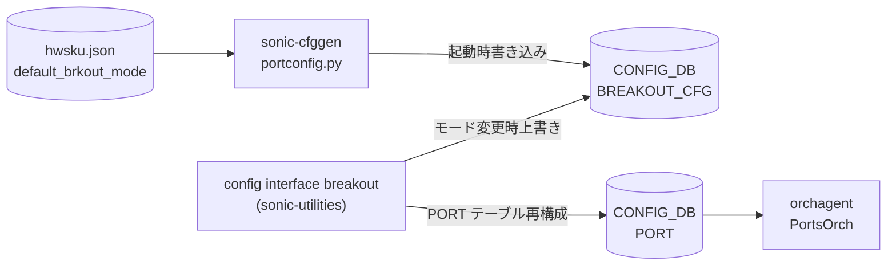

# BREAKOUT_CFG テーブル (DPB)

## 概要

`BREAKOUT_CFG` テーブルは Dynamic Port Breakout ([DPB](../../reference/glossary.md#term-dpb)) 機能で導入された [CONFIG_DB](../../reference/glossary.md#term-config_db) テーブル[^1]。
各親ポート（parent port）の **現在の breakout モード**（`brkout_mode`）を 1 エントリで保持する。

起動時は `sonic-cfggen` が `hwsku.json` の `default_brkout_mode` フィールドをもとに全親ポートのエントリを書き込む。
`config interface breakout <port> <mode>` コマンドが breakout を変更するたびに当該エントリの `brkout_mode` を上書きする。

orchagent は `BREAKOUT_CFG` を直接購読しない。CLI（`portconfig` ライブラリ）が `PORT` テーブルを再構成し、orchagent は `PORT` テーブルの変更を受け取る間接フロー。`BREAKOUT_CFG` はモード履歴の管理テーブルとして機能する。

<!-- cdb-mermaid -->
### データフロー



!!! note "凡例"
    `BREAKOUT_CFG` は orchagent への間接経路。orchagent は `PORT` テーブルの変更を受け取る。
<!-- /cdb-mermaid -->

## key 構造

```text
BREAKOUT_CFG|<port-name>
```

`<port-name>` は親ポート名（例: `Ethernet0`）。YANG では `PORT` テーブルへの leafref でなく自由文字列として定義されており、DPB 操作中に `PORT` テーブルに存在しない場合でも有効なエントリとなる[^2]。

## フィールド

| フィールド | 型 | デフォルト | 説明 |
|-----------|----|-----------|------|
| `brkout_mode` | string (1..64) | `hwsku.json` の `default_brkout_mode` | 現在の breakout モード文字列（例: `4x25G[10G]`, `2x50G`, `1x100G[40G]`） |

## mode 文字列フォーマット

`brkout_mode` の値は `portconfig.py:42` で定義されたパターンに従う:

```
<num>x<speed>[<alt_speed,...>](<lanes>)  [+ ...]
```

代表例:

| モード文字列 | 意味 |
|------------|------|
| `1x100G[40G]` | 全レーンを 1 ポートに集約、デフォルト 100G (40G 切り替え可) |
| `2x50G` | 全レーンを 2 ポートに均等分割、各 50G |
| `4x25G[10G]` | 全レーンを 4 ポートに均等分割、各 25G (10G 切り替え可) |
| `2x25G(2)+1x50G(2)` | 2 レーン × 2 ポート (25G) + 2 レーン × 1 ポート (50G) の混在 |
| `1x400G` | 400G 世代向け全レーン集約 |
| `8x50G` | 800G 世代向け 8 分割 |

利用可能なモード一覧は **`platform.json`** の各親ポートの `breakout_modes` フィールドで定義され、`hwsku.json` の `default_brkout_mode` がそのうちの 1 つでなければならない。

## 設定フロー

1. **起動時**: `sonic-cfggen` → `get_breakout_mode()` → `parse_breakout_mode()` が `hwsku.json` から読み取った `default_brkout_mode` を `BREAKOUT_CFG|<port>.brkout_mode` に書き込む
2. **breakout 変更**: `config interface breakout <port> <mode>` が `platform.json` でモードを検証後、`PORT` テーブルを再構成し、最後に `config_db.set_entry("BREAKOUT_CFG", port, {'brkout_mode': mode})` で更新

## 制約

- `BREAKOUT_CFG` テーブルが存在しない場合、CLI は `[ERROR] BREAKOUT_CFG table is NOT present in CONFIG DB` を返す（`main.py:5481`）
- 指定ポートが `BREAKOUT_CFG` に存在しない場合、CLI はエラーを返す（`main.py:5485`）
- 指定 mode が `platform.json` の `breakout_modes` に存在しない場合、CLI はエラーを返す（`main.py:5208-5209`）
- `.json` 形式の port config（`platform.json` + `hwsku.json`）が必要。`port_config.ini` 形式の場合、DPB は無効（`portconfig.py:464`: `return None`）

<!-- defaults -->
## フィールド暗黙デフォルト (Phase A — コード由来)

<!-- evidence: meta/_intermediate/cdb-flow/dpb-defaults.md -->

YANG (`sonic-breakout_cfg.yang`) は `brkout_mode` に `default` 文を持たない。

### `brkout_mode` — 起動時初期値は `hwsku.json` の `default_brkout_mode`

`brkout_mode` のデフォルト値はコード定数ではなく **プラットフォーム定義** に完全依存する。

**ソース**: `portconfig.py:37-38, 475-478`
```python
BRKOUT_MODE = "default_brkout_mode"   # hwsku.json のキー名
CUR_BRKOUT_MODE = "brkout_mode"       # CONFIG_DB への書き込みキー名

# parse_breakout_mode() の本体:
for intf in hwsku_dict[INTF_KEY]:
    brkout_table[intf] = {}
    brkout_table[intf][CUR_BRKOUT_MODE] = hwsku_dict[INTF_KEY][intf][BRKOUT_MODE]
```

**ソース**: `sonic-cfggen:402-404`
```python
brkout_table = get_breakout_mode(hwsku, platform, args.port_config)
if brkout_table:
    deep_update(data, {'BREAKOUT_CFG': brkout_table})
```

| フィールド | YANG default | コード由来デフォルト | fallback 源 |
|-----------|-------------|-------------------|------------|
| `brkout_mode` | なし | `hwsku.json` の `default_brkout_mode`（プラットフォーム定義） | `portconfig.py:parse_breakout_mode()` — 起動時に `sonic-cfggen` が書き込み |

YANG レイヤーは補完しない。CONFIG_DB に一度も書かれていない（`platform.json` / `hwsku.json` なし環境）場合、CLI は `BREAKOUT_CFG table is NOT present in CONFIG DB` エラーを返す。

<!-- /defaults -->

<!-- ordering -->
## 書込み順依存 (Phase B)

<!-- evidence: meta/_intermediate/cdb-flow/dpb-ordering.md -->

`BREAKOUT_CFG` テーブルは `config interface breakout` CLI → `ConfigMgmtDPB.breakOutPort()` の多段シーケンスによって書き込まれる。各ステップに厳密な先行条件が存在する。

### 検出された順序依存

| # | 依存関係 | 方向 | 緩和策 |
|---|----------|------|--------|
| 1 | `BREAKOUT_CFG` エントリ存在 → breakout コマンド実行 | **先行必須** | 起動時 `sonic-cfggen` が自動生成。手動投入時は `BREAKOUT_CFG` を先に書く |
| 2 | 依存テーブル（VLAN_MEMBER / ACL / BUFFER 等）DEL → ポート shutdown → CONFIG_DB 削除 | **強制順序** (`ConfigMgmtDPB`) | `--force-remove-dependencies` で自動処理。手動時は依存テーブルを先に DEL |
| 3 | ASIC_DB ポート削除確認 → 新ポート CONFIG_DB 追加 | **強制先行**（最大 60 秒待機） | タイムアウト時は処理中断。syncd / orchagent の応答性に依存 |
| 4 | `CABLE_LENGTH` / `BUFFER_PG` / `BUFFER_QUEUE` DEL → `PORT` DEL | 推奨先行（YANG 依存チェック） | `--force` で自動削除。なければ YANG バリデーションエラー |
| 5 | PORT 再構成 + ASIC_DB 確認 → `BREAKOUT_CFG.brkout_mode` 更新 | **強制後続**（成功時のみ更新） | 失敗時は旧モード保持のまま。再実行可能 |

### 主要制約詳細

**BREAKOUT_CFG 先行必須（依存 #1）**: `breakout()` (main.py:5479) は実行直後に `config_db.get_table('BREAKOUT_CFG')` を呼んでテーブルの存在を確認する。空の場合は即 Abort（`[ERROR] BREAKOUT_CFG table is NOT present in CONFIG DB`）。`BREAKOUT_CFG` エントリは通常 `sonic-cfggen` が起動時に `hwsku.json` の `default_brkout_mode` から自動生成するため、通常運用では問題にならないが、手動 DB 操作や環境初期化直後は注意が必要（evidence: `main.py:5479-5486`）。

**ConfigMgmtDPB 内部シーケンス（依存 #2, #3）**: `breakOutPort()` (config_mgmt.py:450-460) は以下の厳密なシーケンスで実行される:

```
1. _deletePorts()    — Yang ツリーで依存テーブル検出・削除（メモリ操作のみ）
2. _shutdownIntf()   — PORT を admin_status=down に設定（CONFIG_DB 書込み）
3. writeConfigDB()   — 依存+ポートを CONFIG_DB から一括削除
4. _verifyAsicDB()   — ASIC_DB でポート消滅を確認（最大 60 秒ポーリング）
5. writeConfigDB()   — 新ポートを CONFIG_DB に追加
```

ステップ 4 は syncd/orchagent が SAI 経由でポートを ASIC から削除し ASIC_DB を更新するまでブロックする。タイムアウト（60 秒）すると例外を投げて新ポート追加は行われない（evidence: `config_mgmt.py:377-412,450-460`）。

**BREAKOUT_CFG 更新は最後（依存 #5）**: `breakout()` (main.py:5548-5554) は `breakout_Ports()` が成功した後にのみ `BREAKOUT_CFG.brkout_mode` を新モードに更新する。途中失敗時は旧モードが残り、次回コマンド実行の起点となる。

<!-- /ordering -->

## 引用元

[^1]: YANG 定義: `sonic-breakout_cfg.yang`. <https://github.com/sonic-net/sonic-buildimage/blob/9ea932ec2e18f35e58268ec2e4456b1d4afd65cd/src/sonic-yang-models/yang-models/sonic-breakout_cfg.yang>

[^2]: HLD 記載: `port` を `PORT` テーブルへの leafref でなく string とした理由 — DPB 操作中は親ポートが `PORT` テーブルに存在しない場合があるため。 <https://github.com/sonic-net/SONiC/blob/49bab5b5ff0e924f1ea52b3d9db0dfa4191a7c06/doc/dynamic-port-breakout/sonic-dynamic-port-breakout-HLD.md>
