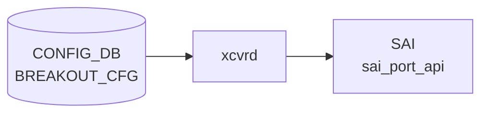

# BREAKOUT_CFG テーブル (DPB)

## 概要

`BREAKOUT_CFG` テーブルは Dynamic Port Breakout ([DPB](../../reference/glossary.md#term-dpb)) 機能で導入された [CONFIG_DB](../../reference/glossary.md#term-config_db) テーブル[^1]。
各親ポート（parent port）の **現在の breakout モード**（`brkout_mode`）を 1 エントリで保持する。

起動時は `sonic-cfggen` が `hwsku.json` の `default_brkout_mode` フィールドをもとに全親ポートのエントリを書き込む。
`config interface breakout <port> <mode>` コマンドが breakout を変更するたびに当該エントリの `brkout_mode` を上書きする。

orchagent は `BREAKOUT_CFG` を直接購読しない。CLI（`portconfig` ライブラリ）が `PORT` テーブルを再構成し、orchagent は `PORT` テーブルの変更を受け取る間接フロー。`BREAKOUT_CFG` はモード履歴の管理テーブルとして機能する。

<!-- cdb-mermaid -->
### データフロー (自動生成)



!!! note "凡例"
    CONFIG_DB から SAI までの典型経路を `docs/reference/config-db-orch-map.md` から機械生成したミニ図。詳細・例外は本ページ本文と対応表を参照。
<!-- /cdb-mermaid -->

## key 構造

```text
BREAKOUT_CFG|<port-name>
```

`<port-name>` は親ポート名（例: `Ethernet0`）。YANG では `PORT` テーブルへの leafref でなく自由文字列として定義されており、DPB 操作中に `PORT` テーブルに存在しない場合でも有効なエントリとなる[^2]。

## フィールド

| フィールド | 型 | デフォルト | 説明 |
|-----------|----|-----------|------|
| `brkout_mode` | string (1..64) | `hwsku.json` の `default_brkout_mode` | 現在の breakout モード文字列（例: `4x25G[10G]`, `2x50G`, `1x100G[40G]`） |

## mode 文字列フォーマット

`brkout_mode` の値は `portconfig.py:42` で定義されたパターンに従う:

```
<num>x<speed>[<alt_speed,...>](<lanes>)  [+ ...]
```

代表例:

| モード文字列 | 意味 |
|------------|------|
| `1x100G[40G]` | 全レーンを 1 ポートに集約、デフォルト 100G (40G 切り替え可) |
| `2x50G` | 全レーンを 2 ポートに均等分割、各 50G |
| `4x25G[10G]` | 全レーンを 4 ポートに均等分割、各 25G (10G 切り替え可) |
| `2x25G(2)+1x50G(2)` | 2 レーン × 2 ポート (25G) + 2 レーン × 1 ポート (50G) の混在 |
| `1x400G` | 400G 世代向け全レーン集約 |
| `8x50G` | 800G 世代向け 8 分割 |

利用可能なモード一覧は **`platform.json`** の各親ポートの `breakout_modes` フィールドで定義され、`hwsku.json` の `default_brkout_mode` がそのうちの 1 つでなければならない。

## 設定フロー

1. **起動時**: `sonic-cfggen` → `get_breakout_mode()` → `parse_breakout_mode()` が `hwsku.json` から読み取った `default_brkout_mode` を `BREAKOUT_CFG|<port>.brkout_mode` に書き込む
2. **breakout 変更**: `config interface breakout <port> <mode>` が `platform.json` でモードを検証後、`PORT` テーブルを再構成し、最後に `config_db.set_entry("BREAKOUT_CFG", port, {'brkout_mode': mode})` で更新

## 制約

- `BREAKOUT_CFG` テーブルが存在しない場合、CLI は `[ERROR] BREAKOUT_CFG table is NOT present in CONFIG DB` を返す（`main.py:5481`）
- 指定ポートが `BREAKOUT_CFG` に存在しない場合、CLI はエラーを返す（`main.py:5485`）
- 指定 mode が `platform.json` の `breakout_modes` に存在しない場合、CLI はエラーを返す（`main.py:5208-5209`）
- `.json` 形式の port config（`platform.json` + `hwsku.json`）が必要。`port_config.ini` 形式の場合、DPB は無効（`portconfig.py:464`: `return None`）

<!-- defaults -->
## フィールド暗黙デフォルト (Phase A — コード由来)

<!-- evidence: meta/_intermediate/cdb-flow/dpb-defaults.md -->

YANG (`sonic-breakout_cfg.yang`) は `brkout_mode` に `default` 文を持たない。

### `brkout_mode` — 起動時初期値は `hwsku.json` の `default_brkout_mode`

`brkout_mode` のデフォルト値はコード定数ではなく **プラットフォーム定義** に完全依存する。

**ソース**: `portconfig.py:37-38, 475-478`
```python
BRKOUT_MODE = "default_brkout_mode"   # hwsku.json のキー名
CUR_BRKOUT_MODE = "brkout_mode"       # CONFIG_DB への書き込みキー名

# parse_breakout_mode() の本体:
for intf in hwsku_dict[INTF_KEY]:
    brkout_table[intf] = {}
    brkout_table[intf][CUR_BRKOUT_MODE] = hwsku_dict[INTF_KEY][intf][BRKOUT_MODE]
```

**ソース**: `sonic-cfggen:402-404`
```python
brkout_table = get_breakout_mode(hwsku, platform, args.port_config)
if brkout_table:
    deep_update(data, {'BREAKOUT_CFG': brkout_table})
```

| フィールド | YANG default | コード由来デフォルト | fallback 源 |
|-----------|-------------|-------------------|------------|
| `brkout_mode` | なし | `hwsku.json` の `default_brkout_mode`（プラットフォーム定義） | `portconfig.py:parse_breakout_mode()` — 起動時に `sonic-cfggen` が書き込み |

YANG レイヤーは補完しない。CONFIG_DB に一度も書かれていない（`platform.json` / `hwsku.json` なし環境）場合、CLI は `BREAKOUT_CFG table is NOT present in CONFIG DB` エラーを返す。

<!-- /defaults -->

<!-- ordering -->
## 書込み順依存 (Phase B)

<!-- evidence: meta/_intermediate/cdb-flow/dpb-ordering.md -->

`BREAKOUT_CFG` テーブルは `config interface breakout` CLI → `ConfigMgmtDPB.breakOutPort()` の多段シーケンスによって書き込まれる。各ステップに厳密な先行条件が存在する。

### 検出された順序依存

| # | 依存関係 | 方向 | 緩和策 |
|---|----------|------|--------|
| 1 | `BREAKOUT_CFG` エントリ存在 → breakout コマンド実行 | **先行必須** | 起動時 `sonic-cfggen` が自動生成。手動投入時は `BREAKOUT_CFG` を先に書く |
| 2 | 依存テーブル（VLAN_MEMBER / ACL / BUFFER 等）DEL → ポート shutdown → CONFIG_DB 削除 | **強制順序** (`ConfigMgmtDPB`) | `--force-remove-dependencies` で自動処理。手動時は依存テーブルを先に DEL |
| 3 | ASIC_DB ポート削除確認 → 新ポート CONFIG_DB 追加 | **強制先行**（最大 60 秒待機） | タイムアウト時は処理中断。syncd / orchagent の応答性に依存 |
| 4 | `CABLE_LENGTH` / `BUFFER_PG` / `BUFFER_QUEUE` DEL → `PORT` DEL | 推奨先行（YANG 依存チェック） | `--force` で自動削除。なければ YANG バリデーションエラー |
| 5 | PORT 再構成 + ASIC_DB 確認 → `BREAKOUT_CFG.brkout_mode` 更新 | **強制後続**（成功時のみ更新） | 失敗時は旧モード保持のまま。再実行可能 |

### 主要制約詳細

**BREAKOUT_CFG 先行必須（依存 #1）**: `breakout()` (main.py:5479) は実行直後に `config_db.get_table('BREAKOUT_CFG')` を呼んでテーブルの存在を確認する。空の場合は即 Abort（`[ERROR] BREAKOUT_CFG table is NOT present in CONFIG DB`）。`BREAKOUT_CFG` エントリは通常 `sonic-cfggen` が起動時に `hwsku.json` の `default_brkout_mode` から自動生成するため、通常運用では問題にならないが、手動 DB 操作や環境初期化直後は注意が必要（evidence: `main.py:5479-5486`）。

**ConfigMgmtDPB 内部シーケンス（依存 #2, #3）**: `breakOutPort()` (config_mgmt.py:450-460) は以下の厳密なシーケンスで実行される:

```
1. _deletePorts()    — Yang ツリーで依存テーブル検出・削除（メモリ操作のみ）
2. _shutdownIntf()   — PORT を admin_status=down に設定（CONFIG_DB 書込み）
3. writeConfigDB()   — 依存+ポートを CONFIG_DB から一括削除
4. _verifyAsicDB()   — ASIC_DB でポート消滅を確認（最大 60 秒ポーリング）
5. writeConfigDB()   — 新ポートを CONFIG_DB に追加
```

ステップ 4 は syncd/orchagent が SAI 経由でポートを ASIC から削除し ASIC_DB を更新するまでブロックする。タイムアウト（60 秒）すると例外を投げて新ポート追加は行われない（evidence: `config_mgmt.py:377-412,450-460`）。

**BREAKOUT_CFG 更新は最後（依存 #5）**: `breakout()` (main.py:5548-5554) は `breakout_Ports()` が成功した後にのみ `BREAKOUT_CFG.brkout_mode` を新モードに更新する。途中失敗時は旧モードが残り、次回コマンド実行の起点となる。

<!-- /ordering -->

<!-- cross-refs -->
## 暗黙参照テーブル (Phase C)

<!-- evidence: meta/_intermediate/cdb-flow/dpb-cross-refs.md -->

`BREAKOUT_CFG` テーブルは単独で機能せず、`config interface breakout` CLI および `show interfaces breakout` コマンドがプラットフォームファイルと複数の CONFIG_DB テーブルを暗黙的に参照する。

| 参照先テーブル / リソース | 参照方向 | 条件 | evidence |
|--------------------------|---------|------|----------|
| `platform.json`（ファイルシステム） | 読込（モード検証・子ポート計算） | 常時必須。ファイル不在時は即 Abort | `config/main.py:5467-5471`, `main.py:5496,5507` |
| `hwsku.json`（ファイルシステム） | 読込（`default_brkout_mode` 初期値の源泉） | 起動時 `sonic-cfggen` が参照 | `portconfig.py:37-38,475-478` |
| `PORT`（CONFIG_DB） | 読込（子ポート名バリデーション・速度取得） | breakout 変更時。`interface_name_is_valid()` で各削除ポートを確認 | `main.py:5517-5519` |
| `VLAN_MEMBER` / `ACL_TABLE` / `BUFFER_PG` / `BUFFER_QUEUE` / `INTERFACE` / `CABLE_LENGTH` 等（CONFIG_DB） | 読込（依存テーブル列挙）→ DEL（`--force` 時） | `_deletePorts()` 内で YANG ツリーから動的解決。`--force-remove-dependencies` 時は自動削除 | `config_mgmt.py:488-514` |
| YANG モデル群（`/usr/local/yang-models/`） | 読込（依存テーブル解析） | `ConfigMgmtDPB` 初期化時に全 YANG ロード | `config_mgmt.py:70-72` |
| `ASIC_STATE:SAI_OBJECT_TYPE_PORT:*`（ASIC_DB） | 読込（ポート削除完了確認） | PORT 削除後、最大 60 秒ポーリング。新ポート追加の先行条件 | `config_mgmt.py:318,377-412,458-459` |

!!! note "platform.json / hwsku.json は CONFIG_DB ではなくファイルシステム上のプラットフォームファイル"
    これら 2 ファイルが存在しない（または `.json` 形式でない）場合、`config interface breakout` は実行不能となり `BREAKOUT_CFG` テーブルへの書き込みは一切行われない（`main.py:5467-5471`）。

!!! note "YANG モデルが解決する依存テーブルはプラットフォーム設定に依存"
    `_deletePorts()` が YANG ツリーをトラバースして列挙する依存テーブルは、対象ポートに付随する設定（VLAN メンバーシップ・バッファ設定・ACL バインド等）の存在状況によって変動する。固定の「必須前提テーブル」は存在しないが、YANG バリデーション上の依存は `--force-remove-dependencies` なしでは DEL 操作をブロックする。

<!-- /cross-refs -->

<!-- failure -->
## 失敗時の挙動 (Phase D)

<!-- evidence: meta/_intermediate/cdb-flow/dpb-failure.md -->

`config interface breakout` が途中で失敗した場合、CONFIG_DB / `BREAKOUT_CFG` への影響はシーケンスのどの段階で失敗したかによって大きく異なる。

### 失敗シナリオ一覧

| # | 失敗箇所 | CONFIG_DB への影響 | BREAKOUT_CFG | リカバリ |
|---|---------|------------------|--------------|---------|
| 1 | `BREAKOUT_CFG` テーブル不在 | 変更なし | 変更なし | `sonic-cfggen` 再実行 or 手動作成 |
| 2 | 対象ポートが `BREAKOUT_CFG` に不在 | 変更なし | 変更なし | `config_db.set_entry("BREAKOUT_CFG", port, ...)` で手動追加 |
| 3 | 依存テーブルが存在（`--force` なし） | 変更なし | 変更なし | 依存テーブルを手動削除後に再実行、または `--force-remove-dependencies` オプション使用 |
| 4 | `_deletePorts()` / YANG ツリー例外 | 変更なし（書込み前） | 変更なし | コマンド再実行 |
| 5 | `_verifyAsicDB()` タイムアウト（60 秒） | **部分不整合**: 旧ポート削除済み・新ポート未追加 | 旧モードのまま | 手動リカバリ必須 (`config reload` 等) |
| 6 | `_addPorts()` 失敗（`_shutdownIntf` 前） | 変更なし | 変更なし | コマンド再実行 |
| 7 | `BREAKOUT_CFG.set_entry()` で `ValueError` | PORT 再構成完了済み | 旧モード保持（不整合） | `config_db.set_entry("BREAKOUT_CFG", port, {'brkout_mode': new_mode})` で手動修正 |

### 重大シナリオの詳細

**シナリオ 5 — `_verifyAsicDB` タイムアウト（最大の危険）**: `breakOutPort()` (config_mgmt.py:450-460) は以下の順で CONFIG_DB を変更する:

```
①  _shutdownIntf(delPorts)    → PORT.admin_status=down を書込み
②  writeConfigDB(delConfigToLoad) → 旧ポート + 依存テーブルを削除
③  _verifyAsicDB(...)          → ASIC_DB でポート消滅を 60 秒待機 ← ここでタイムアウト
④  writeConfigDB(addConfigtoLoad) → ← 未実行
```

タイムアウト後は `Exception("Ports are present in ASIC DB after 60 secs")` を raise し `breakOutPort()` は `return None, False` する。①②は完了済みのため **旧ポートが CONFIG_DB から消えた状態で新ポートが存在しない半断絶状態**が残る。`BREAKOUT_CFG.brkout_mode` は旧モードを指したままとなり、実際の CONFIG_DB 状態と乖離する（evidence: `config_mgmt.py:377-412,450-460`）。

**シナリオ 7 — `set_entry` ValueError**: `breakout_Ports()` 成功後（PORT 再構成完了）に `config_db.set_entry("BREAKOUT_CFG", interface_name, {'brkout_mode': target_brkout_mode})` で `ValueError` が発生した場合、PORT テーブルは新モードになっているが `BREAKOUT_CFG` は旧モードを表示し続ける。次回の `config interface breakout` は `BREAKOUT_CFG` の旧モードを起点に `del_ports` を計算するため、想定外のポート削除が発生しうる（evidence: `main.py:5548-5556`）。

<!-- /failure -->

<!-- constants -->
## ハードコード定数 (Phase E)

<!-- evidence: meta/_intermediate/cdb-flow/dpb-constants.md -->

`BREAKOUT_CFG` テーブルおよびその書込みシーケンスに存在する、CONFIG_DB / YANG で管理されないハードコード定数の一覧。出典は `config/config_mgmt.py` および `src/sonic-config-engine/portconfig.py`。

### ASIC DB ポーリングタイムアウト

| 定数 | 値 | 用途 | ソース |
|------|----|------|--------|
| `MAX_WAIT` | `60` 秒 | `_verifyAsicDB()` のポーリングタイムアウト。1 秒 sleep × 60 回でポート消滅を確認し、超過時は `Exception` を raise して新ポート追加をブロック | `config_mgmt.py:429` |

`MAX_WAIT` は `breakOutPort()` のローカル定数であり、CLI オプションや設定ファイルで変更する手段は存在しない。syncd / orchagent の応答が遅延する環境（高負荷・デバッグビルド等）ではタイムアウトに達しやすい。

### portconfig.py 文字列定数

| 定数 | 値 | 用途 | ソース |
|------|----|------|--------|
| `PORT_STR` | `"Ethernet"` | 子ポート名生成のプレフィックス。ポート名が `Ethernet<N>` 形式であることをハードコードで仮定 | `portconfig.py:36` |
| `BRKOUT_MODE` | `"default_brkout_mode"` | `hwsku.json` から `default_brkout_mode` フィールドを取り出すキー名 | `portconfig.py:37` |
| `CUR_BRKOUT_MODE` | `"brkout_mode"` | `BREAKOUT_CFG` に書き込むフィールド名 | `portconfig.py:38` |
| `INTF_KEY` | `"interfaces"` | `hwsku.json` のインタフェースエントリを参照するキー名 | `portconfig.py:39` |
| `BRKOUT_PATTERN` | `r'(\d{1,6})x(\d{1,6}G?)(\[(\d{1,6}G?,?)*\])?(\((\d{1,6})\))?'` | breakout mode 文字列のパース正規表現。各数値フィールドは最大 6 桁 | `portconfig.py:42` |
| `BRKOUT_PATTERN_GROUPS` | `6` | 正規表現マッチグループ数の整合性検証用定数 | `portconfig.py:43` |

### YANG 制約値（設定可能範囲の上限）

| フィールド | YANG 制約 | 用途 | ソース |
|-----------|----------|------|--------|
| `port-name`（key） | `length 1..255` | 親ポート名の最大長 | `sonic-breakout_cfg.yang:34` |
| `brkout_mode` | `length 1..64` | breakout mode 文字列の最大長 | `sonic-breakout_cfg.yang:41` |

<!-- /constants -->

<!-- side-effects -->
## 副次 DB 書込 (Phase F)

<!-- evidence: meta/_intermediate/cdb-flow/dpb-side-effects.md -->

`config interface breakout` コマンドが `BREAKOUT_CFG` を更新する際、CONFIG_DB の複数テーブルおよび APPL_DB / ASIC_DB に以下の副次書込みが発生する。

### CONFIG_DB 副次書込みシーケンス

`breakOutPort()` (`config_mgmt.py:414`) は `BREAKOUT_CFG` を直接書き込む前に以下を順次実行する:

| # | 操作 | 対象テーブル / キー | タイミング | ソース |
|---|------|-------------------|-----------|--------|
| 1 | 削除予定ポートを `admin_status=down` でシャットダウン | `PORT\|<port>` (`admin_status`) | `_deletePorts()` 前 | `config_mgmt.py:602–608` (`_shutdownIntf`) |
| 2 | YANG 依存エントリを一括削除（force 時） | `VLAN_MEMBER`, `PORTCHANNEL_MEMBER`, `INTERFACE`, `BUFFER_PG`, `BUFFER_QUEUE`, `PORT_QOS_MAP`, `QUEUE` 等 | ポート削除前 | `config_mgmt.py:480–500` (`_deletePorts`) |
| 3 | 旧ポートエントリを CONFIG_DB から削除 | `PORT\|<Ethernet*>` | `_verifyAsicDB()` 前 | `config_mgmt.py:456` |
| 4 | 新ポートエントリと デフォルト設定を CONFIG_DB へ追加 | `PORT\|<Ethernet*>`、`BUFFER_PG`, `BUFFER_QUEUE`, `PORT_QOS_MAP`, `QUEUE`（`loadDefConfig=True` 時） | ASIC_DB 確認後 | `config_mgmt.py:460` |
| 5 | `BREAKOUT_CFG` の `brkout_mode` を最終更新 | `BREAKOUT_CFG\|<port>` | ポート追加完了後 | `main.py:5547` |

ステップ 2 の依存テーブルは YANG モデルで PORT へ leafref / must 参照を持つもの全て。`--force-remove-dependencies / -f` オプション不使用の場合、依存が存在すれば `breakOutPort()` は `deps` を返して中断する（`config_mgmt.py:434–436`）。

### APPL_DB への伝播（portmgrd 経由）

`PORT` テーブルへの CONFIG_DB 変更を `portmgrd` が購読し、`APPL_DB PORT_TABLE` に伝播する:

| CONFIG_DB 操作 | portmgrd の動作 | APPL_DB 結果 |
|--------------|----------------|-------------|
| `PORT\|<port>` DEL | `m_appPortTable.del(alias)` | `PORT_TABLE\|<port>` 削除 |
| `PORT\|<port>` SET | `writeConfigToAppDb(alias, field_values)` → `m_appPortTable.set(alias, fvs)` | `PORT_TABLE\|<port>` 更新 |

証跡: `portmgr.cpp:244`（DEL 分岐）、`portmgr.cpp:257,264`（SET 分岐）

### ASIC_DB ポーリング

`_verifyAsicDB()` (`config_mgmt.py:377`) は削除ポートの SAI OID (`ASIC_STATE:SAI_OBJECT_TYPE_PORT:oid:0x<oid>`) が ASIC_DB から消えるまで 1 秒間隔で最大 `MAX_WAIT=60` 秒ポーリングする。タイムアウト時は `Exception` を raise して新ポート追加をブロックする。

### 確認コマンド

```bash
# CONFIG_DB — ポート削除後の依存エントリ残存確認
sonic-db-cli CONFIG_DB keys 'VLAN_MEMBER|*' | grep Ethernet0
sonic-db-cli CONFIG_DB hgetall 'BREAKOUT_CFG|Ethernet0'

# APPL_DB — portmgrd 経由の PORT_TABLE 伝播確認
sonic-db-cli APPL_DB keys 'PORT_TABLE|*'

# ASIC_DB — ポート OID 消滅確認
sonic-db-cli ASIC_DB keys 'ASIC_STATE:SAI_OBJECT_TYPE_PORT:*'
```

<!-- /side-effects -->

<!-- pubsub -->
## Redis 通知メカニズム (Phase G)

<!-- evidence: meta/_intermediate/cdb-flow/dpb-pubsub.md -->

`BREAKOUT_CFG` テーブル自体を Redis keyspace notification で購読するデーモンは **存在しない**。DPB フローにおける通知の核心は `PORT` テーブルへの書込みであり、`portmgrd` がそれを受け取って `APPL_DB` へ伝播する。

### BREAKOUT_CFG の購読状況

`BREAKOUT_CFG` を `SubscriberStateTable` / PSUBSCRIBE で購読するサービスは sonic-swss・sonic-buildimage・sonic-utilities 全域で確認されなかった。

CLI（`config/main.py`・`show/interfaces/__init__.py`）は `ConfigDBConnector.get_table('BREAKOUT_CFG')` による **点時間ポーリング** のみを使用する。これは Redis `HGETALL` の一括取得であり、継続的な pub/sub ではない。

### CONFIG_DB → portmgrd の通知フロー

`portmgrd` は以下のテーブルを `Orch` フレームワーク経由の `ConsumerStateTable`（内部的には `__keyspace@4__:*` の PSUBSCRIBE）で購読する:

| 購読テーブル | DB | メカニズム | 購読箇所 |
|------------|-----|----------|---------|
| `PORT`（CFG_PORT_TABLE_NAME） | CONFIG_DB (DB 4) | `ConsumerStateTable` (PSUBSCRIBE) | `portmgrd.cpp:27-29` |
| `SEND_TO_INGRESS_PORT_TABLE` | CONFIG_DB | 同上 | `portmgrd.cpp:29` |

`portmgrd` の select タイムアウトは `SELECT_TIMEOUT = 1000` ms（`portmgrd.cpp:16`）。タイムアウト時は `portmgr.doTask()` で保留タスクを再試行する。

### portmgrd → APPL_DB 伝播

DPB シーケンスで `PORT` テーブルが変更されると、`portmgrd` が受け取って `APPL_DB PORT_TABLE` に伝播する:

| CONFIG_DB 操作 | portmgrd の処理 | APPL_DB 結果 | ソース |
|---------------|----------------|-------------|--------|
| `PORT\|<port>` SET | `writeConfigToAppDb()` → `m_appPortTable.set()` | `PORT_TABLE\|<port>` 更新 | `portmgr.cpp:213` |
| `PORT\|<port>` DEL | `m_appPortTable.del(alias)` | `PORT_TABLE\|<port>` 削除 | `portmgr.cpp:244` |

### BREAKOUT_CFG 更新後の通知不在

`main.py:5554` の `config_db.set_entry("BREAKOUT_CFG", ...)` は Redis `HSET` を発行し keyspace notification を生成するが、**これを購読するデーモンは存在しない**。`BREAKOUT_CFG.brkout_mode` の変更は他サービスに自動通知されず、次回 CLI 実行時に `get_table('BREAKOUT_CFG')` で読み直されることで参照される。

<!-- /pubsub -->

<!-- platform -->
## プラットフォーム差 (Phase H)

<!-- evidence: meta/_intermediate/cdb-flow/dpb-platform.md -->

`BREAKOUT_CFG` / DPB フローにはプラットフォーム依存の制約が 3 件存在する。

| 観点 | 結果 | 根拠 |
|------|------|------|
| `platform.json` 非対応環境（`port_config.ini` 形式） | **DPB 完全無効** — CLI が冒頭で即 Abort。`BREAKOUT_CFG` テーブル自体が `sonic-cfggen` によって生成されない | `portconfig.py:464` (`return None`), `main.py:5468–5471` |
| Broadcom ハードウェアプロファイル | SAI `create_port` / `remove_port` が動作するために `portmap_N=<lane>:<speed>[:<speed>:i]` 形式のハードウェアプロファイル事前設定が必要。未設定の場合 `_verifyAsicDB()` がタイムアウトする | HLD L1090 |
| multi-asic / VOQ chassis 環境 | `breakout` コマンドは **namespace iteration を行わない**。`ctx.obj['config_db']`（デフォルト namespace 単一 CONFIG_DB）のみを対象とする。他の CLI コマンド（`config mirror`・`config cbf reload` 等）が全 namespace を iterate するのと対照的 | `main.py:5460–5560`（`namespace` / `multi_asic` ヒット 0） |
| 非対称 breakout モードの ASIC 制限 | 利用可能モードは `platform.json` の `breakout_modes` に列挙されたもののみ。ASIC 固有の制限は `platform.json` で表現され、未定義モードは `_validate_interface_mode()` が即拒否 | HLD L206, `main.py:5208–5209` |
| YANG モデルのプラットフォーム分岐 | **なし** — `sonic-breakout_cfg.yang` はプラットフォーム条件を含まない | `sonic-breakout_cfg.yang` |

### `platform.json` 非対応プラットフォームの詳細

`port_config.ini` 形式しか提供しないプラットフォームでは DPB 機能が利用できない。これは `sonic-cfggen` が起動時に `BREAKOUT_CFG` テーブルを生成しないことに加え、CLI 実行時にも `[ERROR] Breakout feature is not available without platform.json file` を返して即終了するためである。HLD は *"To support the breakout feature, the json files will be required"* と明記している[^2]。

### multi-asic 環境での運用注意

multi-asic 構成では、対象ポートが属する ASIC の namespace に対して `config interface breakout` を手動で namespace 指定する必要がある可能性がある（community master には自動 iteration が存在しないため）。breakout 操作後は当該 ASIC の CONFIG_DB の `PORT` テーブルと `BREAKOUT_CFG` テーブルのみが更新され、他の ASIC namespace には影響しない。

<!-- /platform -->

## 引用元

[^1]: YANG 定義: `sonic-breakout_cfg.yang`. <https://github.com/sonic-net/sonic-buildimage/blob/9ea932ec2e18f35e58268ec2e4456b1d4afd65cd/src/sonic-yang-models/yang-models/sonic-breakout_cfg.yang>

[^2]: HLD 記載: `port` を `PORT` テーブルへの leafref でなく string とした理由 — DPB 操作中は親ポートが `PORT` テーブルに存在しない場合があるため。 <https://github.com/sonic-net/SONiC/blob/49bab5b5ff0e924f1ea52b3d9db0dfa4191a7c06/doc/dynamic-port-breakout/sonic-dynamic-port-breakout-HLD.md>
