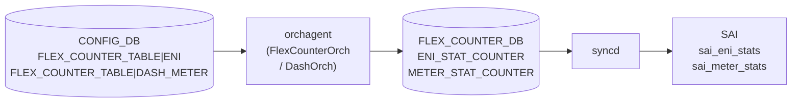

# DPU カウンタ (ENI / DASH_METER) テーブル

## 概要

`FLEX_COUNTER_TABLE|ENI` および `FLEX_COUNTER_TABLE|DASH_METER` は、[DASH](../../reference/glossary.md#term-dash) (Disaggregated API for SONiC Hosts) の [ENI](../../reference/glossary.md#term-eni) (Elastic Network Interface) カウンタと DASH メータカウンタのポーリング設定を [CONFIG_DB](../../reference/glossary.md#term-config_db) に保持するエントリ[^1]。これらは DPU (Data Processing Unit) ノード専用であり、`switch_type == 'dpu'` の場合のみ `enable_counters.py` が自動的に有効化する[^2]。通常の ToR / Spine では `init_cfg.json.j2` に記載がなく、デフォルトで無効状態となる。

<!-- cdb-mermaid -->
### データフロー (自動生成)



!!! note "凡例"
    CONFIG_DB から SAI までの典型経路。詳細・例外は本ページ本文と対応表を参照。
<!-- /cdb-mermaid -->

## key 構造

```text
FLEX_COUNTER_TABLE|ENI
FLEX_COUNTER_TABLE|DASH_METER
```

どちらも `FLEX_COUNTER_TABLE` の固定サブキー。`FLEX_COUNTER_TABLE` の共通フィールド (下表) のうち一部を持つ。

## フィールド

| フィールド | 型 | 範囲 | デフォルト | 説明 |
|-----------|----|------|-----------|------|
| `FLEX_COUNTER_STATUS` | enum | `enable` / `disable` | `disable`[^3] | ポーリング有効化フラグ。DPU では `enable_counters.py` が起動後に `enable` を書き込む |
| `POLL_INTERVAL` | uint32 | 100..4294967295 [ms] | `10000`[^4] | カウンタポーリング間隔 (ミリ秒) |
| `FLEX_COUNTER_DELAY_STATUS` | boolean_type | `true` / `false` | 未設定 (遅延なし) | fast-reboot 時に system-ready まで polling を遅らせるフラグ |

<!-- defaults -->
### コード由来デフォルト詳細

**`FLEX_COUNTER_STATUS` デフォルト = `disable`**

`DashOrch` コンストラクタで `EniCounter` / `MeterCounter` を `enabled=false` で初期化する:

```cpp
// sonic-swss/orchagent/dash/dashorch.cpp:62-63
EniCounter(ENI_STAT_COUNTER_FLEX_COUNTER_GROUP, StatsMode::READ,
           ENI_STAT_FLEX_COUNTER_POLLING_INTERVAL_MS, false),   // enabled=false
MeterCounter(METER_STAT_COUNTER_FLEX_COUNTER_GROUP, StatsMode::READ,
             METER_STAT_FLEX_COUNTER_POLLING_INTERVAL_MS, false) // enabled=false
```

`DashCounter` テンプレートのメンバ変数 `fc_status = false` (dashcounter.h:15) が初期状態。CONFIG_DB にエントリが存在しない限り polling は開始されない。

**`POLL_INTERVAL` デフォルト = 10000 ms**

```cpp
// sonic-swss/orchagent/dash/dashorch.h:30,33
#define ENI_STAT_FLEX_COUNTER_POLLING_INTERVAL_MS   10000
#define METER_STAT_FLEX_COUNTER_POLLING_INTERVAL_MS 10000
```

orchagent 起動時の内部デフォルト値。CONFIG_DB に `POLL_INTERVAL` を明示しない場合でも 10000 ms が適用される。

**DPU ノードでの自動有効化** (`enable_counters.py`):

```python
# sonic-buildimage/dockers/docker-orchagent/enable_counters.py:40-44
dpu_counters = ["ENI","DASH_METER"]
if platform_info.get('switch_type') == 'dpu':
    for key in dpu_counters:
        enable_counter_group(db, key)
```

- uptime < 300 秒: 180 秒待機後に `FLEX_COUNTER_STATUS: enable` を CONFIG_DB に書き込む
- uptime >= 300 秒: 60 秒待機後に書き込む
- `POLL_INTERVAL` は書き込まない → ハードコード値 10000 ms のまま継続

**init_cfg.json.j2 への記載なし**: ENI / DASH_METER は `init_cfg.json.j2` に含まれず、`switch_type == 'dpu'` ノード以外では自動有効化されない。
<!-- /defaults -->

## グループ名マッピング

| CONFIG_DB キー | FlexCounter グループ名 | カウンタ ID フィールド |
|---------------|----------------------|---------------------|
| `ENI` | `ENI_STAT_COUNTER` | `ENI_COUNTER_ID_LIST` |
| `DASH_METER` | `METER_STAT_COUNTER` | `DASH_METER_COUNTER_ID_LIST` |

```cpp
// sonic-swss/orchagent/flexcounterorch.cpp:92-93
{"ENI",        ENI_STAT_COUNTER_FLEX_COUNTER_GROUP},
{"DASH_METER", METER_STAT_COUNTER_FLEX_COUNTER_GROUP},
```

<!-- value-behavior -->
## 値依存挙動マトリクス

### `FLEX_COUNTER_STATUS` (ENI)

| 値 | 挙動 |
|----|------|
| `enable` | `DashOrch::handleFCStatusUpdate(true, eni_entries_)` が呼ばれ、全 ENI エントリに `ENI_COUNTER_ID_LIST` を投入 (dashorch.h:128) |
| `disable` (デフォルト) | `handleFCStatusUpdate(false, eni_entries_)` — 全 ENI エントリのカウンタ ID リストをクリア |
| 未設定 | `disable` と等価。ENI カウンタ polling は実行されない |

### `FLEX_COUNTER_STATUS` (DASH_METER)

| 値 | 挙動 |
|----|------|
| `enable` | `DashOrch::handleMeterFCStatusUpdate(true, eni_entries_)` — 全 ENI エントリに `DASH_METER_COUNTER_ID_LIST` を投入 (dashorch.h:129) |
| `disable` (デフォルト) | メータカウンタ ID リストをクリア |
| 未設定 | `disable` と等価 |

### `POLL_INTERVAL` (ENI / DASH_METER 共通)

| 値 | 挙動 |
|----|------|
| `10000` (デフォルト) | 10 秒ごとに SAI ENI / Meter カウンタを読み取り |
| `100`..`9999` | より短い周期でポーリング。CPU 負荷が増加するリスクあり |
| 範囲外 (< 100) | YANG `range 100..4294967295` 違反で reject |
| 未設定 | orchagent ハードコード値 10000 ms |

<!-- /value-behavior -->

<!-- ordering -->
## 書込み順依存 (Phase B)

`FLEX_COUNTER_TABLE|ENI` および `FLEX_COUNTER_TABLE|DASH_METER` の書込みが実際にカウンタポーリングを開始するまでには、複数の先行条件が連鎖する。`FlexCounterOrch::doTask()` の冒頭ガードがそれらを強制する。

### 検出された順序依存

| # | 依存関係 | 方向 | 緩和策 |
|---|----------|------|--------|
| 1 | `FlexCounterOrch` の 60 秒遅延タイマー満了 → CONFIG_DB 読み処理開始 | **強制先行** (warm-start 時のみ) | 通常起動では `m_delayTimerExpired = true` が即時設定されるためブロックなし |
| 2 | `gPortsOrch->allPortsReady()` が `true` → `doTask()` が処理続行 | **強制先行** | `allPortsReady()` が `false` の間、CONFIG_DB の ENI / DASH_METER エントリは `m_toSync` に積まれたまま処理されない |
| 3 | `FLEX_COUNTER_TABLE|ENI` の `FLEX_COUNTER_STATUS=enable` → `DashOrch::handleFCStatusUpdate(true)` 呼び出し | SET 受信後即時 (中間状態なし) | `handleFCStatusUpdate` が `eni_entries_` を走査して全 ENI OID のカウンタ ID リストを投入 |
| 4 | ENI エントリ (`DASH_ENI` テーブル) が `DashOrch` 内部マップ `eni_entries_` に登録済み → カウンタ ID 投入可能 | **強制先行** | `enable` を先に書いても `eni_entries_` が空の場合、`refreshStats()` は全エントリをスキップしカウンタ ID は FLEX_COUNTER_DB に書かれない。後から ENI が追加された時点で `addToFC()` が個別に ID を登録する |
| 5 | `enable_counters.py` の DPU 判定 → orchagent 安定後 60〜180 秒で `FLEX_COUNTER_STATUS=enable` 書込み | 起動時 1 回、遅延あり | uptime < 300 秒: 180 秒 sleep; uptime >= 300 秒: 60 秒 sleep 後に書込み。orchagent が `allPortsReady()` になる前に書かれる場合でも `m_toSync` で保留される |

### 主要な制約詳細

**`allPortsReady()` ガード (依存 #2)**: `FlexCounterOrch::doTask(Consumer&)` は冒頭で `gPortsOrch && !gPortsOrch->allPortsReady()` が真なら即 `return` する (`flexcounterorch.cpp:164-166`)。ENI / DASH_METER の SET メッセージは `m_toSync` に残留し、`allPortsReady()` が真になった最初のイテレーションで一括処理される。

**ENI エントリ先行要件 (依存 #4)**: `DashCounter::handleStatusUpdate(enabled, entries)` は `entries` (= `eni_entries_`) を走査し、`fc_status = enabled` に設定した後 `refreshStats(fc_status, entries)` を呼ぶ (`dashcounter.h:63-69`)。`eni_entries_` が空の場合は `refreshStats()` 内ループが 0 回実行され、FLEX_COUNTER_DB への書込みは発生しない。後から `DashOrch` が ENI を追加するたびに `EniCounter.addToFC(eni_id, eni)` (`dashorch.cpp:751`) が呼ばれ、`fc_status == true` であれば個別に `setCounterIdList` を実行する。したがって「`enable` が先、ENI エントリが後」でも最終的に全 ENI がカウンタ登録される。

**warm-start 時の遅延タイマー (依存 #1)**: `FlexCounterOrch` コンストラクタは warm-start 時のみ 60 秒のタイマーを設定し、満了まで `doTask()` をブロックする (`flexcounterorch.cpp:127-136`)。通常起動では `m_delayTimerExpired = true` が即時設定されるためブロックは発生しない。

<!-- /ordering -->

## 制約

- `POLL_INTERVAL`: 100 以上 (uint32 上限 4294967295)
- `FLEX_COUNTER_STATUS`: `enable` または `disable`
- `FLEX_COUNTER_DELAY_STATUS`: `true` または `false` (YANG `stypes:boolean_type`)
- ENI / DASH_METER は `switch_type == 'dpu'` のノードでのみ実質的に機能する

## 購読者

- `FlexCounterOrch` ([orchagent](../../reference/glossary.md#term-orchagent)): CONFIG_DB の `FLEX_COUNTER_TABLE` を購読し、`DashOrch` の `handleFCStatusUpdate` / `handleMeterFCStatusUpdate` を呼び出す
- `DashOrch` ([orchagent](../../reference/glossary.md#term-orchagent)): ENI エントリの追加/削除時に `EniCounter` / `MeterCounter` を通じて [FLEX_COUNTER_DB](../../reference/glossary.md#term-flex_counter_db) に ID リストを投入

## 関連 CONFIG_DB / YANG / CLI

- 関連 [CONFIG_DB](../../reference/glossary.md#term-config_db): `FLEX_COUNTER_TABLE` (全グループ)、`DEVICE_METADATA` (`switch_type` が DPU 判定に使用)
- 関連 [YANG](../../reference/glossary.md#term-yang): `sonic-flex_counter` (ENI / DASH_METER コンテナ)
- 関連 CLI: `counterpoll eni enable/disable`、`counterpoll dash-meter enable/disable`

<!-- ref-triangle:start -->

## 関連リファレンス

- [YANG](../../reference/glossary.md#term-yang): [`sonic-flex_counter`](../yang/sonic-flex_counter.md)
- 親テーブル: [FLEX_COUNTER_TABLE](./flex-counter-table.md)
- CLI: `counterpoll`

<!-- ref-triangle:end -->

## 引用元

[^1]: YANG 定義: `sonic-flex_counter.yang` ENI / DASH_METER コンテナ. <https://github.com/sonic-net/sonic-buildimage/blob/9ea932ec2e18f35e58268ec2e4456b1d4afd65cd/src/sonic-yang-models/yang-models/sonic-flex_counter.yang#L93-L125>

[^2]: DPU 専用有効化ロジック: `enable_counters.py`. <https://github.com/sonic-net/sonic-buildimage/blob/9ea932ec2e18f35e58268ec2e4456b1d4afd65cd/dockers/docker-orchagent/enable_counters.py#L40-L44>

[^3]: デフォルト `disable`: `dashorch.cpp:62-63` (`enabled=false`). <https://github.com/sonic-net/sonic-swss/blob/4305596156d70e9797e8a881b3d19b46de0bce0d/orchagent/dash/dashorch.cpp#L62-L63>

[^4]: デフォルト polling interval: `dashorch.h:30,33`. <https://github.com/sonic-net/sonic-swss/blob/4305596156d70e9797e8a881b3d19b46de0bce0d/orchagent/dash/dashorch.h#L30-L33>

<!-- ops-hint -->
## 運用ヒント

### 典型値 (DPU ノード)

```bash
# enable_counters.py が自動書き込みするエントリ
FLEX_COUNTER_TABLE|ENI       FLEX_COUNTER_STATUS=enable
FLEX_COUNTER_TABLE|DASH_METER FLEX_COUNTER_STATUS=enable
```

POLL_INTERVAL を明示する場合:

```bash
sonic-db-cli CONFIG_DB hset 'FLEX_COUNTER_TABLE|ENI' POLL_INTERVAL 10000
sonic-db-cli CONFIG_DB hset 'FLEX_COUNTER_TABLE|DASH_METER' POLL_INTERVAL 10000
```

### 注意事項

- `switch_type != 'dpu'` の場合、`enable_counters.py` は ENI / DASH_METER に触れない。手動で `enable` を書き込んでも orchagent が ENI エントリを持たないため実質的な影響はない。
- `enable_counters.py` は orchagent 完全起動後 (60〜180 秒後) に実行されるため、直後の `counterpoll show` では `disable` のまま見える場合がある。

### 確認コマンド

```bash
# カウンタグループの状態確認
sonic-db-cli CONFIG_DB hgetall 'FLEX_COUNTER_TABLE|ENI'
sonic-db-cli CONFIG_DB hgetall 'FLEX_COUNTER_TABLE|DASH_METER'

# ENI カウンタ値の確認 (DPU ノード)
show dash counters eni
```
<!-- /ops-hint -->

<!-- cdb-exceptions -->
## 例外条件・特殊挙動

| consumer | 条件 | 挙動 |
|----------|------|------|
| `enable_counters.py` | `switch_type != 'dpu'` | ENI / DASH_METER への書き込みをスキップ。カウンタは `disable` のまま |
| `enable_counters.py` | uptime < 300 秒 | 180 秒 sleep 後に `FLEX_COUNTER_STATUS: enable` を書き込む (orchagent 起動待ち) |
| `enable_counters.py` | uptime >= 300 秒 | 60 秒 sleep 後に書き込む |
| `FlexCounterOrch` | `FLEX_COUNTER_STATUS` 未設定 | デフォルト `disable`。`DashOrch` の fc_status は `false` のまま |
| `DashOrch` | ENI エントリが 0 件の状態で `enable` | `handleFCStatusUpdate` は呼ばれるが、entries が空のためカウンタ投入なし |
| YANG バリデーション | `POLL_INTERVAL < 100` | YANG range 違反で書き込み reject |

> **Evidence**: `sonic-swss/orchagent/dash/dashorch.cpp:62-63`, `dashorch.h:29-33,128-129`, `dashcounter.h:15`, `enable_counters.py:40-44`
<!-- /cdb-exceptions -->

<!-- runtime-trace -->
## 実コンテナ動作トレース

### 段階 1 — orchagent 起動時の初期化

`DashOrch` コンストラクタが `EniCounter` / `MeterCounter` を `enabled=false` で生成。`FlexCounterManager::applyGroupConfiguration()` が FLEX_COUNTER_DB に `FLEX_COUNTER_STATUS=disable`, `POLL_INTERVAL=10000` を書き込む。

### 段階 2 — enable_counters.py による自動有効化 (DPU のみ)

`docker-orchagent` 内の `enable_counters.py` が起動後 60〜180 秒後に実行。`switch_type == 'dpu'` を確認し、`CONFIG_DB FLEX_COUNTER_TABLE|ENI` と `FLEX_COUNTER_TABLE|DASH_METER` に `FLEX_COUNTER_STATUS: enable` を書き込む。

### 段階 3 — FlexCounterOrch がステータス変化を検知

`FlexCounterOrch::doTask()` が CONFIG_DB 変化を受信。`flexCounterGroupMap["ENI"]` → `ENI_STAT_COUNTER_FLEX_COUNTER_GROUP` を解決し、`DashOrch::handleFCStatusUpdate(true)` を呼び出す。

### 段階 4 — FLEX_COUNTER_DB への ID リスト投入

`DashCounter::handleStatusUpdate(true, eni_entries_)` → `refreshStats(true, entries)` → 各 ENI OID に対して `stat_manager.setCounterIdList(oid, CT, counter_stats)` を実行。FLEX_COUNTER_DB の `ENI_STAT_COUNTER:<oid>` に `ENI_COUNTER_ID_LIST` が書き込まれる。

### 段階 5 — syncd によるポーリング

`syncd` の `FlexCounter` モジュールが FLEX_COUNTER_DB を購読し、10000 ms ごとに SAI の ENI / Meter カウンタ API を呼び出す。結果は `COUNTERS_DB` に格納される。
<!-- /runtime-trace -->

<!-- entry-points -->
## 書き込み入り口 (Direction A)

対象テーブル: `FLEX_COUNTER_TABLE|ENI`, `FLEX_COUNTER_TABLE|DASH_METER`

### CLI

- `counterpoll eni enable/disable`
- `counterpoll eni interval <ms>`
- `counterpoll dash-meter enable/disable`
- `counterpoll dash-meter interval <ms>`

### minigraph / sonic-cfggen

- なし (ENI / DASH_METER は minigraph 対象外)

### REST / gNMI (sonic-mgmt-common)

- なし

### db_migrator

- なし

### ビルド時デフォルト (init_cfg / j2 テンプレート)

- **なし** — `init_cfg.json.j2` に ENI / DASH_METER の記載なし

### ハードコードデフォルト

- `POLL_INTERVAL = 10000` ms (`dashorch.h:30,33`)
- `FLEX_COUNTER_STATUS = disable` (`dashorch.cpp:62-63`)

### ランタイム注入 (デーモン自動書き込み)

- `enable_counters.py`: `switch_type == 'dpu'` の場合のみ、起動後 60〜180 秒後に `FLEX_COUNTER_STATUS: enable` を書き込む
<!-- /entry-points -->

<!-- glossary-links-injected: dpu-counter-a1b2c3 -->
