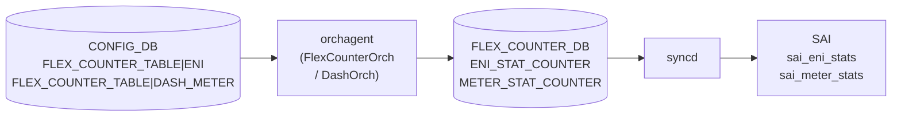

# DPU カウンタ (ENI / DASH_METER) テーブル

## 概要

`FLEX_COUNTER_TABLE|ENI` および `FLEX_COUNTER_TABLE|DASH_METER` は、[DASH](../../reference/glossary.md#term-dash) (Disaggregated API for SONiC Hosts) の [ENI](../../reference/glossary.md#term-eni) (Elastic Network Interface) カウンタと DASH メータカウンタのポーリング設定を [CONFIG_DB](../../reference/glossary.md#term-config_db) に保持するエントリ[^1]。これらは DPU (Data Processing Unit) ノード専用であり、`switch_type == 'dpu'` の場合のみ `enable_counters.py` が自動的に有効化する[^2]。通常の ToR / Spine では `init_cfg.json.j2` に記載がなく、デフォルトで無効状態となる。

<!-- cdb-mermaid -->
### データフロー (自動生成)



!!! note "凡例"
    CONFIG_DB から SAI までの典型経路。詳細・例外は本ページ本文と対応表を参照。
<!-- /cdb-mermaid -->

## key 構造

```text
FLEX_COUNTER_TABLE|ENI
FLEX_COUNTER_TABLE|DASH_METER
```

どちらも `FLEX_COUNTER_TABLE` の固定サブキー。`FLEX_COUNTER_TABLE` の共通フィールド (下表) のうち一部を持つ。

## フィールド

| フィールド | 型 | 範囲 | デフォルト | 説明 |
|-----------|----|------|-----------|------|
| `FLEX_COUNTER_STATUS` | enum | `enable` / `disable` | `disable`[^3] | ポーリング有効化フラグ。DPU では `enable_counters.py` が起動後に `enable` を書き込む |
| `POLL_INTERVAL` | uint32 | 100..4294967295 [ms] | `10000`[^4] | カウンタポーリング間隔 (ミリ秒) |
| `FLEX_COUNTER_DELAY_STATUS` | boolean_type | `true` / `false` | 未設定 (遅延なし) | fast-reboot 時に system-ready まで polling を遅らせるフラグ |

<!-- defaults -->
### コード由来デフォルト詳細

**`FLEX_COUNTER_STATUS` デフォルト = `disable`**

`DashOrch` コンストラクタで `EniCounter` / `MeterCounter` を `enabled=false` で初期化する:

```cpp
// sonic-swss/orchagent/dash/dashorch.cpp:62-63
EniCounter(ENI_STAT_COUNTER_FLEX_COUNTER_GROUP, StatsMode::READ,
           ENI_STAT_FLEX_COUNTER_POLLING_INTERVAL_MS, false),   // enabled=false
MeterCounter(METER_STAT_COUNTER_FLEX_COUNTER_GROUP, StatsMode::READ,
             METER_STAT_FLEX_COUNTER_POLLING_INTERVAL_MS, false) // enabled=false
```

`DashCounter` テンプレートのメンバ変数 `fc_status = false` (dashcounter.h:15) が初期状態。CONFIG_DB にエントリが存在しない限り polling は開始されない。

**`POLL_INTERVAL` デフォルト = 10000 ms**

```cpp
// sonic-swss/orchagent/dash/dashorch.h:30,33
#define ENI_STAT_FLEX_COUNTER_POLLING_INTERVAL_MS   10000
#define METER_STAT_FLEX_COUNTER_POLLING_INTERVAL_MS 10000
```

orchagent 起動時の内部デフォルト値。CONFIG_DB に `POLL_INTERVAL` を明示しない場合でも 10000 ms が適用される。

**DPU ノードでの自動有効化** (`enable_counters.py`):

```python
# sonic-buildimage/dockers/docker-orchagent/enable_counters.py:40-44
dpu_counters = ["ENI","DASH_METER"]
if platform_info.get('switch_type') == 'dpu':
    for key in dpu_counters:
        enable_counter_group(db, key)
```

- uptime < 300 秒: 180 秒待機後に `FLEX_COUNTER_STATUS: enable` を CONFIG_DB に書き込む
- uptime >= 300 秒: 60 秒待機後に書き込む
- `POLL_INTERVAL` は書き込まない → ハードコード値 10000 ms のまま継続

**init_cfg.json.j2 への記載なし**: ENI / DASH_METER は `init_cfg.json.j2` に含まれず、`switch_type == 'dpu'` ノード以外では自動有効化されない。
<!-- /defaults -->

## グループ名マッピング

| CONFIG_DB キー | FlexCounter グループ名 | カウンタ ID フィールド |
|---------------|----------------------|---------------------|
| `ENI` | `ENI_STAT_COUNTER` | `ENI_COUNTER_ID_LIST` |
| `DASH_METER` | `METER_STAT_COUNTER` | `DASH_METER_COUNTER_ID_LIST` |

```cpp
// sonic-swss/orchagent/flexcounterorch.cpp:92-93
{"ENI",        ENI_STAT_COUNTER_FLEX_COUNTER_GROUP},
{"DASH_METER", METER_STAT_COUNTER_FLEX_COUNTER_GROUP},
```

<!-- value-behavior -->
## 値依存挙動マトリクス

### `FLEX_COUNTER_STATUS` (ENI)

| 値 | 挙動 |
|----|------|
| `enable` | `DashOrch::handleFCStatusUpdate(true, eni_entries_)` が呼ばれ、全 ENI エントリに `ENI_COUNTER_ID_LIST` を投入 (dashorch.h:128) |
| `disable` (デフォルト) | `handleFCStatusUpdate(false, eni_entries_)` — 全 ENI エントリのカウンタ ID リストをクリア |
| 未設定 | `disable` と等価。ENI カウンタ polling は実行されない |

### `FLEX_COUNTER_STATUS` (DASH_METER)

| 値 | 挙動 |
|----|------|
| `enable` | `DashOrch::handleMeterFCStatusUpdate(true, eni_entries_)` — 全 ENI エントリに `DASH_METER_COUNTER_ID_LIST` を投入 (dashorch.h:129) |
| `disable` (デフォルト) | メータカウンタ ID リストをクリア |
| 未設定 | `disable` と等価 |

### `POLL_INTERVAL` (ENI / DASH_METER 共通)

| 値 | 挙動 |
|----|------|
| `10000` (デフォルト) | 10 秒ごとに SAI ENI / Meter カウンタを読み取り |
| `100`..`9999` | より短い周期でポーリング。CPU 負荷が増加するリスクあり |
| 範囲外 (< 100) | YANG `range 100..4294967295` 違反で reject |
| 未設定 | orchagent ハードコード値 10000 ms |

<!-- /value-behavior -->

<!-- ordering -->
## 書込み順依存 (Phase B)

`FLEX_COUNTER_TABLE|ENI` および `FLEX_COUNTER_TABLE|DASH_METER` の書込みが実際にカウンタポーリングを開始するまでには、複数の先行条件が連鎖する。`FlexCounterOrch::doTask()` の冒頭ガードがそれらを強制する。

### 検出された順序依存

| # | 依存関係 | 方向 | 緩和策 |
|---|----------|------|--------|
| 1 | `FlexCounterOrch` の 60 秒遅延タイマー満了 → CONFIG_DB 読み処理開始 | **強制先行** (warm-start 時のみ) | 通常起動では `m_delayTimerExpired = true` が即時設定されるためブロックなし |
| 2 | `gPortsOrch->allPortsReady()` が `true` → `doTask()` が処理続行 | **強制先行** | `allPortsReady()` が `false` の間、CONFIG_DB の ENI / DASH_METER エントリは `m_toSync` に積まれたまま処理されない |
| 3 | `FLEX_COUNTER_TABLE|ENI` の `FLEX_COUNTER_STATUS=enable` → `DashOrch::handleFCStatusUpdate(true)` 呼び出し | SET 受信後即時 (中間状態なし) | `handleFCStatusUpdate` が `eni_entries_` を走査して全 ENI OID のカウンタ ID リストを投入 |
| 4 | ENI エントリ (`DASH_ENI` テーブル) が `DashOrch` 内部マップ `eni_entries_` に登録済み → カウンタ ID 投入可能 | **強制先行** | `enable` を先に書いても `eni_entries_` が空の場合、`refreshStats()` は全エントリをスキップしカウンタ ID は FLEX_COUNTER_DB に書かれない。後から ENI が追加された時点で `addToFC()` が個別に ID を登録する |
| 5 | `enable_counters.py` の DPU 判定 → orchagent 安定後 60〜180 秒で `FLEX_COUNTER_STATUS=enable` 書込み | 起動時 1 回、遅延あり | uptime < 300 秒: 180 秒 sleep; uptime >= 300 秒: 60 秒 sleep 後に書込み。orchagent が `allPortsReady()` になる前に書かれる場合でも `m_toSync` で保留される |

### 主要な制約詳細

**`allPortsReady()` ガード (依存 #2)**: `FlexCounterOrch::doTask(Consumer&)` は冒頭で `gPortsOrch && !gPortsOrch->allPortsReady()` が真なら即 `return` する (`flexcounterorch.cpp:164-166`)。ENI / DASH_METER の SET メッセージは `m_toSync` に残留し、`allPortsReady()` が真になった最初のイテレーションで一括処理される。

**ENI エントリ先行要件 (依存 #4)**: `DashCounter::handleStatusUpdate(enabled, entries)` は `entries` (= `eni_entries_`) を走査し、`fc_status = enabled` に設定した後 `refreshStats(fc_status, entries)` を呼ぶ (`dashcounter.h:63-69`)。`eni_entries_` が空の場合は `refreshStats()` 内ループが 0 回実行され、FLEX_COUNTER_DB への書込みは発生しない。後から `DashOrch` が ENI を追加するたびに `EniCounter.addToFC(eni_id, eni)` (`dashorch.cpp:751`) が呼ばれ、`fc_status == true` であれば個別に `setCounterIdList` を実行する。したがって「`enable` が先、ENI エントリが後」でも最終的に全 ENI がカウンタ登録される。

**warm-start 時の遅延タイマー (依存 #1)**: `FlexCounterOrch` コンストラクタは warm-start 時のみ 60 秒のタイマーを設定し、満了まで `doTask()` をブロックする (`flexcounterorch.cpp:127-136`)。通常起動では `m_delayTimerExpired = true` が即時設定されるためブロックは発生しない。

<!-- /ordering -->

<!-- cross-refs -->
## 暗黙参照テーブル (Phase C)

> **調査根拠**: `flexcounterorch.cpp`, `dashorch.cpp`, `dashorch.h`, `dashcounter.h`, `enable_counters.py`, `device_info.py` 全行精読 (2026-05-19)  
> 詳細証跡: `meta/_intermediate/cdb-flow/dpu-counter-cross-refs.md`

`FLEX_COUNTER_TABLE|ENI` / `FLEX_COUNTER_TABLE|DASH_METER` はいずれも YANG leafref を持たないが、
実行時に以下のテーブル・リソースを暗黙参照する。

| # | 参照先 | DB | 参照方向 | YANG leafref | 実装上の必須度 | 証拠 |
|---|--------|-----|---------|-------------|--------------|------|
| 1 | `DEVICE_METADATA\|localhost.switch_type` | CONFIG_DB | 読み取り | なし | DPU 自動有効化に必須 | `enable_counters.py:42-45`, `device_info.py:563-566` |
| 2 | `PORT` (PortsOrch `allPortsReady()`) | — | 状態確認 (起動順序ガード) | なし | `FlexCounterOrch` 処理開始の前提 | `flexcounterorch.cpp:164-166` |
| 3 | `APP_DASH_ENI_TABLE` → `DashOrch::eni_entries_` | APPL_DB | 間接 (DashOrch 内部マップ) | なし | カウンタ ID 投入に実質必須 | `dashorch.cpp:69`, `dashorch.h:128` |
| 4 | `COUNTERS_ENI_NAME_MAP` | COUNTERS_DB | 書き込み (DashOrch が生産) | なし | `counterpoll` / `show dash counters eni` の前提 | `dashorch.cpp:68`, `schema.h:249` |
| 5 | `DEVICE_METADATA\|localhost.create_only_config_db_buffers` | CONFIG_DB | 読み取り (初期化のみ) | なし | ENI/DASH_METER 処理パスに非直接 | `flexcounterorch.cpp:114` |

### DEVICE_METADATA|localhost.switch_type — DPU 自動有効化スイッチ

`enable_counters.py` は起動後 60〜180 秒で `device_info.get_platform_info()` を呼び出し、
`DEVICE_METADATA|localhost` の `switch_type` フィールドを読み取る。

```python
# enable_counters.py:37-45
def enable_counters():
    db = swsscommon.ConfigDBConnector()
    db.connect()
    dpu_counters = ["ENI","DASH_METER"]
    platform_info = device_info.get_platform_info(db)
    if platform_info.get('switch_type') == 'dpu':
        for key in dpu_counters:
            enable_counter_group(db, key)
```

`switch_type` が `'dpu'` でない場合、または `switch_type` キーが欠如している場合、
ENI / DASH_METER への `FLEX_COUNTER_STATUS=enable` 書き込みは行われず、カウンタは無効のままとなる。YANG leafref なし。

### PORT (allPortsReady) — FlexCounterOrch 起動順序ガード

```cpp
// flexcounterorch.cpp:164-166
if (gPortsOrch && !gPortsOrch->allPortsReady())
{
    return;
}
```

`FlexCounterOrch::doTask()` は `gPortsOrch->allPortsReady()` が `false` の間、
`FLEX_COUNTER_TABLE|ENI` / `|DASH_METER` の SET メッセージを処理しない（`m_toSync` に残留）。
DPU ノードでは物理ポートが存在しない場合もあるが、`gPortsOrch` が `nullptr` でない限りこのガードが適用される。

### APP_DASH_ENI_TABLE → DashOrch::eni_entries_ — カウンタ ID 投入の前提

`DashCounter<ENI>::refreshStats()` が走査する `eni_entries_` は、`DashOrch` が APPL_DB の
`APP_DASH_ENI_TABLE` から ENI エントリを受信するたびに `addEniEntry()` で更新される。

- `FLEX_COUNTER_STATUS=enable` が処理された時点で `eni_entries_` が空の場合: FLEX_COUNTER_DB への ENI カウンタ ID 書込みは発生しない
- 後から ENI エントリが追加された時点で `EniCounter.addToFC(eni_id, eni)` (`dashorch.cpp:751`) が個別に `setCounterIdList` を実行し、カウンタ登録が完了する

YANG leafref なし。`APP_DASH_ENI_TABLE` は APPL_DB 側の DPU 専用運用経路。

### COUNTERS_ENI_NAME_MAP — show / counterpoll の前提

`DashOrch` は ENI 追加/削除のたびに `COUNTERS_DB|COUNTERS_ENI_NAME_MAP` に
ENI 名 → OID のマッピングを書き込む (`dashorch.cpp:1382, 1395`)。
`show dash counters eni` や `counterpoll` はこのマップを参照してカウンタ値を表示する。
FLEX_COUNTER_TABLE|ENI の `enable` が実際に機能するためには、
`COUNTERS_ENI_NAME_MAP` に対応エントリが存在することが実用上の前提となる。

!!! note "すべての参照は YANG leafref なし"
    `sonic-flex_counter.yang` の ENI / DASH_METER コンテナには leafref 定義が存在しない。
    ここに記載した暗黙参照はすべて実装コードのロジックのみで成立しており、
    YANG バリデーションによる強制はない。

<!-- /cross-refs -->

<!-- failure -->
## 失敗挙動・retry / recovery (Phase D)

`FLEX_COUNTER_TABLE|ENI` / `FLEX_COUNTER_TABLE|DASH_METER` に対する書き込みが、ENI カウンタポーリング開始に至らない失敗パターンをコードから特定した。

### 失敗パターン一覧

| # | トリガー | ログレベル | FLEX_COUNTER_DB への影響 | 自動回復 |
|---|---------|---------|----------------------|---------|
| 1 | `m_delayTimerExpired = false`（warm-reboot 60 秒タイマー未満了） | なし（silent 保留） | なし（`m_toSync` で全保留） | 自動（60 秒後に `doTask(SelectableTimer&)` が `m_delayTimerExpired = true` に変更） |
| 2 | `gPortsOrch->allPortsReady() = false` | なし（silent 保留） | なし（`m_toSync` で保留） | 自動（PortInitDone 受信後の最初のイベントループで一括処理） |
| 3 | 無効グループキー（`flexCounterGroupMap` 未登録） | `NOTICE` | なし | なし（再書き込み必要） |
| 4 | 未サポートフィールド（`FLEX_COUNTER_STATUS` / `POLL_INTERVAL` 以外） | `NOTICE` | なし（他フィールドは継続処理） | 不要 |
| 5 | ENI OID が `SAI_NULL_OBJECT_ID` の状態で `addToFC()` | `WARN` | なし（`addToFC` 即 return） | 自動（ENI が有効 OID で再登録された時点で解消） |
| 6 | `fc_status` 変化なし（`enable` → `enable` 連続） | なし（silent no-op） | なし（`handleStatusUpdate` が前後同値なら `refreshStats` をスキップ） | 不要（設計上冪等） |

### 失敗パターン詳細

**パターン 1 — warm-reboot 遅延タイマー**

`FlexCounterOrch` コンストラクタは warm-reboot 時のみ 60 秒のタイマーを設定し、満了まで `doTask(Consumer&)` の冒頭で即 `return` する:

```cpp
// flexcounterorch.cpp:156-159
if (!m_delayTimerExpired)
{
    return;
}
```

cold-start では `m_delayTimerExpired = true` が即時設定されるためブロックは発生しない。

**パターン 2 — `allPortsReady()` ガード**

`gPortsOrch` が初期化完了していない間、ENI / DASH_METER エントリは `m_toSync` に積まれたまま処理されない:

```cpp
// flexcounterorch.cpp:164-167
if (gPortsOrch && !gPortsOrch->allPortsReady())
{
    return;
}
```

DPU ノードでは `gPortsOrch` が nullptr になる場合があり、この場合ガードはスキップされる（DPU は物理ポートを持たない）。

**パターン 3 — 無効グループキー**

`FLEX_COUNTER_TABLE` に `ENI` / `DASH_METER` 以外のキー（例: `INVALID_KEY`）が書かれた場合、`flexCounterGroupMap.count(key) == 0` で即削除・retry なし:

```cpp
// flexcounterorch.cpp:183-187
if (!flexCounterGroupMap.count(key))
{
    SWSS_LOG_NOTICE("Invalid flex counter group input, %s", key.c_str());
    consumer.m_toSync.erase(it++);
    continue;
}
```

**パターン 4 — 未サポートフィールド**

`FLEX_COUNTER_STATUS` / `POLL_INTERVAL` / `BULK_CHUNK_SIZE` 以外のフィールドは `NOTICE` ログのみで silent skip:

```cpp
// flexcounterorch.cpp:395-398
else
{
    SWSS_LOG_NOTICE("Unsupported field %s", field.c_str());
}
```

**パターン 5 — NULL OID ガード**

`DashCounter::addToFC()` は ENI OID が `SAI_NULL_OBJECT_ID` の場合 WARN を出力して即 return し、`setCounterIdList` は呼ばれない:

```cpp
// dashcounter.h:30-34
if (oid == SAI_NULL_OBJECT_ID)
{
    SWSS_LOG_WARN("Cannot add counter on NULL OID for %s", name.c_str());
    return;
}
```

**パターン 6 — `handleStatusUpdate` の冪等ガード**

`DashCounter::handleStatusUpdate(enabled, entries)` は `fc_status` に変化がない場合 `refreshStats` をスキップする:

```cpp
// dashcounter.h:65-70
bool prev_enabled = fc_status;
fc_status = enabled;
if (fc_status != prev_enabled)
{
    refreshStats(fc_status, entries);
}
```

`enable` → `enable` の連続書き込みは no-op。これにより `enable_counters.py` の再実行（サービス再起動時）でも重複投入は発生しない。

### 回復不能な失敗

- **無効グループキー (パターン 3)**: `m_toSync.erase()` 後は自動リトライなし。正しいキーで再書き込みが必要
- **ENI が一度も追加されない状態の `enable`**: `eni_entries_` が空のため `refreshStats()` が 0 件処理。ただし後続 ENI 追加時に `addToFC()` が個別に補填するため最終的には解消される

> **Evidence**: `sonic-swss/orchagent/flexcounterorch.cpp:156-187,395-398` (warm-reboot タイマー・allPortsReady ガード・無効キー・未サポートフィールド), `sonic-swss/orchagent/dash/dashcounter.h:23-70` (NULL OID ガード・冪等ガード)
<!-- /failure -->

<!-- hardcoded-constants -->
## ハードコード定数 (Phase E)

> **調査根拠**: `dashorch.h:29-33`, `flexcounterorch.cpp:44`, `enable_counters.py:50-63`, `schema.h:293-295`, `flex_counter_manager.cpp:54-55` 全行精読 (2026-05-19)
> 詳細証跡: `meta/_intermediate/cdb-flow/dpu-counter-constants.md`

`FLEX_COUNTER_TABLE|ENI` / `FLEX_COUNTER_TABLE|DASH_METER` に関連する、CONFIG_DB / YANG で管理されないハードコード定数の一覧。

### FlexCounter グループ名文字列

| 定数名 | 値 | 用途 | ソース |
|--------|-----|------|--------|
| `ENI_STAT_COUNTER_FLEX_COUNTER_GROUP` | `"ENI_STAT_COUNTER"` | FLEX_COUNTER_DB のグループキー。CONFIG_DB キー `ENI` と FLEX_COUNTER_DB グループ名のマッピング | `dashorch.h:29` |
| `METER_STAT_COUNTER_FLEX_COUNTER_GROUP` | `"METER_STAT_COUNTER"` | FLEX_COUNTER_DB のグループキー。CONFIG_DB キー `DASH_METER` と FLEX_COUNTER_DB グループ名のマッピング | `dashorch.h:32` |

ユーザーが CONFIG_DB で指定する `ENI` / `DASH_METER` キーとは異なる内部文字列であり、YANG / CONFIG_DB でオーバーライド不可。

### ポーリングインターバルデフォルト値

| 定数名 | 値 | 単位 | 用途 | ソース |
|--------|-----|------|------|--------|
| `ENI_STAT_FLEX_COUNTER_POLLING_INTERVAL_MS` | `10000` | ms | ENI カウンタグループの orchagent 内部デフォルトポーリング間隔 | `dashorch.h:30` |
| `METER_STAT_FLEX_COUNTER_POLLING_INTERVAL_MS` | `10000` | ms | DASH_METER カウンタグループの orchagent 内部デフォルトポーリング間隔 | `dashorch.h:33` |

```cpp
// dashorch.h:29-33
#define ENI_STAT_COUNTER_FLEX_COUNTER_GROUP         "ENI_STAT_COUNTER"
#define ENI_STAT_FLEX_COUNTER_POLLING_INTERVAL_MS   10000
#define METER_STAT_COUNTER_FLEX_COUNTER_GROUP       "METER_STAT_COUNTER"
#define METER_STAT_FLEX_COUNTER_POLLING_INTERVAL_MS 10000
```

CONFIG_DB に `POLL_INTERVAL` が書き込まれない場合はこの値が継続有効となる。

### warm-reboot 遅延タイマー

| 定数名 | 値 | 単位 | 用途 | ソース |
|--------|-----|------|------|--------|
| `FLEX_COUNTER_DELAY_SEC` | `60` | 秒 | warm-reboot 時に `FlexCounterOrch::doTask()` をブロックする遅延時間 | `flexcounterorch.cpp:44` |

```cpp
// flexcounterorch.cpp:44
#define FLEX_COUNTER_DELAY_SEC 60
```

ENI / DASH_METER への `FLEX_COUNTER_STATUS=enable` は warm-reboot 後 60 秒間処理されない。CONFIG_DB / YANG でオーバーライド不可。

### enable_counters.py 起動待機タイマー

| 値 | 単位 | 条件 | 用途 | ソース |
|----|------|------|------|--------|
| `300` | 秒 | uptime 判定しきい値 | uptime < 300 秒であれば「起動直後」と判定し、長めの待機を行う | `enable_counters.py:60` |
| `180` | 秒 | uptime < 300 秒の場合の sleep | orchagent が完全起動するまでの待機時間 (起動直後の場合) | `enable_counters.py:61` |
| `60` | 秒 | uptime >= 300 秒の場合の sleep | サービス再起動等で既に起動済みの場合の短い待機時間 | `enable_counters.py:63` |

```python
# enable_counters.py:56-63
# If the switch was just started (uptime less than 5 minutes),
# wait for 3 minutes and enable counters
# otherwise wait for 60 seconds and enable counters
uptime = get_uptime()
if uptime < 300:
    time.sleep(180)
else:
    time.sleep(60)
```

これらはハードコードされており、CONFIG_DB / YANG でオーバーライド不可。

### FLEX_COUNTER_DB フィールド名文字列

| 定数名 | 値 | 用途 | ソース |
|--------|-----|------|--------|
| `ENI_COUNTER_ID_LIST` | `"ENI_COUNTER_ID_LIST"` | FLEX_COUNTER_DB に書き込まれる ENI カウンタ ID リストのフィールド名 | `schema.h:293` |
| `DASH_METER_COUNTER_ID_LIST` | `"DASH_METER_COUNTER_ID_LIST"` | FLEX_COUNTER_DB に書き込まれる DASH_METER カウンタ ID リストのフィールド名 | `schema.h:295` |

`DashCounter<CounterType::ENI>` と `DashCounter<CounterType::DASH_METER>` がそれぞれ `flex_counter_manager.cpp:54-55` の `counter_id_field_lookup` マップを通じてこれらのフィールド名を解決する。

<!-- /hardcoded-constants -->

<!-- side-effects -->
## 副次 DB 書込 (Phase F)

<!-- evidence:
     sonic-swss/orchagent/flexcounterorch.cpp:202-214,380-392,
     sonic-swss/orchagent/flex_counter/flex_counter_manager.cpp:124-254,
     sonic-swss/orchagent/saihelper.cpp:877-1080,
     sonic-swss/orchagent/dash/dashcounter.h:23-71,
     sonic-swss/orchagent/dash/dashorch.cpp:67-68,751-752,1378-1397,
     sonic-swss-common/common/schema.h:249,293-295 -->

`FLEX_COUNTER_TABLE|ENI` / `FLEX_COUNTER_TABLE|DASH_METER` を変更すると、orchagent (`FlexCounterOrch` / `DashOrch` / `FlexCounterManager`) が CONFIG_DB 自身ではなく **FLEX_COUNTER_DB** および **COUNTERS_DB** に副次的に書き込む。これらは `syncd` の ENI/Meter カウンタポーリングの起点となる。

### FLEX_COUNTER_DB

| テーブル / key | フィールド | 書込タイミング | 書込元 | evidence |
|---|---|---|---|---|
| `FLEX_COUNTER_GROUP_TABLE\|ENI_STAT_COUNTER` | `FLEX_COUNTER_STATUS`, `POLL_INTERVAL`, `STATS_MODE` | `FLEX_COUNTER_TABLE\|ENI` の `FLEX_COUNTER_STATUS` / `POLL_INTERVAL` 変更時、および `DashOrch` コンストラクタ初期化時 | `FlexCounterOrch` → `setFlexCounterGroupOperation()` / `setFlexCounterGroupPollInterval()` (`saihelper.cpp:877-884`) | `flexcounterorch.cpp:202-214,380-386`, `flex_counter_manager.cpp:124,147-153` |
| `FLEX_COUNTER_GROUP_TABLE\|METER_STAT_COUNTER` | 同上 | `FLEX_COUNTER_TABLE\|DASH_METER` の変更時 / `DashOrch` コンストラクタ | 同上 | 同上 |
| `ENI_STAT_COUNTER:<eni_oid>` (per OID) | `ENI_COUNTER_ID_LIST` = ENI SAI 統計 ID リスト, `STATS_MODE` = `STATS_MODE_READ` | ENI 作成時 + `EniCounter.fc_status == true` の場合に `EniCounter.addToFC(eni_id, eni)` が実行された時 | `DashCounter<ENI>::addToFC()` → `FlexCounterManager::setCounterIdList()` → `startFlexCounterPolling()` → `ProducerTable::set()` (`saihelper.cpp:1047`) | `dashcounter.h:35`, `dashorch.cpp:751`, `flex_counter_manager.cpp:225` |
| `METER_STAT_COUNTER:<eni_oid>` (per OID) | `DASH_METER_COUNTER_ID_LIST`, `STATS_MODE` | ENI 作成時 + `MeterCounter.fc_status == true` の場合 | `DashCounter<DASH_METER>::addToFC()` → 同上 | `dashcounter.h:35`, `dashorch.cpp:752` |

ENI 削除時は `EniCounter.removeFromFC()` → `FlexCounterManager::clearCounterIdList()` → `stopFlexCounterPolling()` → `ProducerTable::del(key)` で per-OID エントリが削除される (`saihelper.cpp:1075-1077`)。

### COUNTERS_DB

| テーブル / key | フィールド | 書込タイミング | 書込元 | evidence |
|---|---|---|---|---|
| `COUNTERS_ENI_NAME_MAP` (単一 hash) | field=ENI 名 (例 `eni_01`), value=SAI ENI OID の文字列シリアライズ | ENI 作成成功後 (`dashorch.cpp:750`) に `addEniMapEntry()` が呼ばれた時 | `DashOrch::addEniMapEntry()` → `m_eni_name_table->set()` | `dashorch.cpp:1378-1382`, `schema.h:249` |
| `COUNTERS:<eni_oid>` (per OID、間接書込) | `SAI_ENI_STAT_*` 各統計値 (packets / bytes 等) | `POLL_INTERVAL` (デフォルト 10000 ms) ごとに syncd が SAI ENI カウンタ API を呼び出した後 | `syncd` FlexCounter スレッド (orchagent は直接書かない) | FLEX_COUNTER_DB `ENI_STAT_COUNTER:<oid>` 経由 |

ENI 削除時は `removeEniMapEntry()` → `m_eni_name_table->hdel("", name)` で `COUNTERS_ENI_NAME_MAP` のエントリが削除される (`dashorch.cpp:1395`)。

### 副次書込サマリ

| 副次 DB | テーブル | トリガ | 書込主体 |
|---|---|---|---|
| FLEX_COUNTER_DB | `FLEX_COUNTER_GROUP_TABLE\|ENI_STAT_COUNTER` | `FLEX_COUNTER_STATUS` / `POLL_INTERVAL` 変更 / orch 起動 | FlexCounterOrch / FlexCounterManager |
| FLEX_COUNTER_DB | `FLEX_COUNTER_GROUP_TABLE\|METER_STAT_COUNTER` | 同上 (DASH_METER) | FlexCounterOrch / FlexCounterManager |
| FLEX_COUNTER_DB | `ENI_STAT_COUNTER:<oid>` | ENI 追加 + `fc_status=true` | DashCounter → FlexCounterManager |
| FLEX_COUNTER_DB | `METER_STAT_COUNTER:<oid>` | ENI 追加 + `MeterCounter.fc_status=true` | DashCounter → FlexCounterManager |
| COUNTERS_DB | `COUNTERS_ENI_NAME_MAP` | ENI 作成 / 削除 | DashOrch (`addEniMapEntry` / `removeEniMapEntry`) |
| COUNTERS_DB | `COUNTERS:<oid>` | POLL_INTERVAL ごと (間接) | syncd FlexCounter スレッド |

!!! warning "残置・リーク経路"
    - `FLEX_COUNTER_DB ENI_STAT_COUNTER:<oid>` は `FLEX_COUNTER_STATUS=disable` 操作のみでは削除されない。`disableFlexCounterGroup()` はグループの `FLEX_COUNTER_STATUS` を `disable` にするだけで per-OID エントリは残る。ENI 削除時の `clearCounterIdList()` で削除される
    - ENI OID が `SAI_NULL_OBJECT_ID` の場合 `addToFC()` が即 return するため FLEX_COUNTER_DB per-OID 書込なし (ただし `COUNTERS_ENI_NAME_MAP` は `addEniMapEntry()` で書かれる可能性がある)
    - orchagent 再起動後、`DashOrch` コンストラクタが `applyGroupConfiguration()` を呼び FLEX_COUNTER_GROUP_TABLE に初期状態 (`disable`, `POLL_INTERVAL=10000`) を再書込する。per-OID エントリは ENI エントリ再処理後に再投入される

詳細根拠は `meta/_intermediate/cdb-flow/dpu-counter-side.md` を参照。
<!-- /side-effects -->

<!-- pubsub -->
## 通信メカニズム (Phase G)

<!-- evidence: meta/_intermediate/cdb-flow/dpu-counter-pubsub.md -->
<!-- source: sonic-swss/orchagent/flexcounterorch.cpp:60-93,127-167,299-305,
     sonic-swss/orchagent/orchdaemon.cpp:620-628,1350-1352,
     sonic-swss/orchagent/orch.cpp:1186-1196,
     sonic-swss-common/common/subscriberstatetable.cpp:17-44,95-165,
     sonic-swss/orchagent/saihelper.cpp:918-962 -->

`FLEX_COUNTER_TABLE|ENI` / `FLEX_COUNTER_TABLE|DASH_METER` は CONFIG_DB (db 4) に保持され、
`FlexCounterOrch` が **SubscriberStateTable** (Redis keyspace PSUBSCRIBE) を通じて変更通知を受け取る。

### orchagent による CONFIG_DB 購読

`FlexCounterOrch` は `orchdaemon.cpp:620-628` で生成され、`Orch::addConsumer()` (orch.cpp:1186-1196) が
CONFIG_DB (dbId=4) に対して **SubscriberStateTable** を選択する。PSUBSCRIBE パターンは以下の通り:

| テーブル | PSUBSCRIBE パターン |
|---|---|
| `FLEX_COUNTER_TABLE` | `__keyspace@4__:FLEX_COUNTER_TABLE\|*` |
| `DEVICE_METADATA` | `__keyspace@4__:DEVICE_METADATA\|*` |

`ENI` / `DASH_METER` サブキーへの書き込みはこのパターンで捕捉される。

### 起動時スナップショット

`SubscriberStateTable` ctor は PSUBSCRIBE 直後に `getKeys()` + HGETALL で既存全エントリを読み込み、
`SET_COMMAND` として内部バッファに積む (subscriberstatetable.cpp:26-44)。
orchagent 起動時に CONFIG_DB に ENI / DASH_METER エントリが既に存在すれば、**イベント待ちなしで即時 `doTask` に流れる**。
ただし warm-start タイマー (60 秒) または `!allPortsReady()` ガードが先行するため、実処理は条件満了後になる。

### DashOrch への委譲 (flexcounterorch.cpp:299-305)

```cpp
DashOrch* dash_orch = gDirectory.get<DashOrch*>();

if (dash_orch && (key == ENI_KEY))
{
    dash_orch->handleFCStatusUpdate((value == "enable"));
}
if (dash_orch && (key == DASH_METER_KEY))
{
    dash_orch->handleMeterFCStatusUpdate((value == "enable"));
}
```

`FLEX_COUNTER_STATUS` の変化は `DashOrch` へ関数呼び出しで委譲される。`dash_orch == nullptr` の場合は
サイレントスキップ (DASH 機能なしビルド時)。`POLL_INTERVAL` は `setFlexCounterGroupPollInterval()` 経路で処理される。

### orchagent → FLEX_COUNTER_DB 書き込み方式

| モード | 書き込み API | 通知方式 |
|--------|------------|---------|
| Traditional (`--traditional-flexcounter`) | `ProducerTable::set()` (`saihelper.cpp:1047`) | `FLEX_COUNTER_TABLE_CHANNEL` で syncd が起床 |
| 非 Traditional (デフォルト) | `SAI_REDIS_SWITCH_ATTR_FLEX_COUNTER` 属性経由 (`saihelper.cpp:1055-1063`) | ASIC チャンネル経由。FLEX_COUNTER_DB への直接 PUBLISH は行わない |

### Producer / Consumer ペアサマリ

| 区間 | 方式 | チャンネル |
|------|------|-----------|
| CLI / `enable_counters.py` → CONFIG_DB | `ConfigDBConnector.mod_entry()` (直接 HSET) | keyspace `__keyspace@4__:FLEX_COUNTER_TABLE\|*` |
| CONFIG_DB → `FlexCounterOrch` | `SubscriberStateTable` (PSUBSCRIBE) | keyspace notification |
| `FlexCounterOrch` → `DashOrch` | 関数呼び出し (`handleFCStatusUpdate` / `handleMeterFCStatusUpdate`) | — (同プロセス内) |
| `FlexCounterOrch` → FLEX_COUNTER_DB (traditional) | `ProducerTable` | `FLEX_COUNTER_TABLE_CHANNEL` (syncd が消費) |
| `FlexCounterOrch` → syncd (非 traditional) | SAI Redis Attribute / ASIC channel | — |
| syncd FlexCounter → COUNTERS_DB | `swss::Table::set()` (plain HSET) | **なし (PUBLISH 非発行)** |

!!! warning "COUNTERS_DB は push 通知なし"
    COUNTERS_DB へのカウンタ書き込みは plain HSET のため通知が発行されない。`counterpoll show` で STATUS が `enable` に見えても、ポーリング間隔 (デフォルト 10 秒) が経過するまで COUNTERS_DB の値は更新されない。`show dash counters eni` は実行時点の snapshot を表示する。

<!-- /pubsub -->

<!-- platform -->
## プラットフォーム差 (Phase H)

<!-- evidence: meta/_intermediate/cdb-flow/dpu-counter-platform.md
     sonic-swss/orchagent/main.cpp:990-994,
     sonic-swss/orchagent/orchdaemon.cpp:1313-1419,
     sonic-swss/orchagent/flexcounterorch.cpp:42,546,
     sonic-swss/orchagent/dash/dashcounter.cpp:12-40,
     sonic-swss/orchagent/saihelper.cpp:1099-1123,
     sonic-buildimage/dockers/docker-orchagent/enable_counters.py:43-44 -->

### switch_type による動作の全面的な差異

`FLEX_COUNTER_TABLE|ENI` / `FLEX_COUNTER_TABLE|DASH_METER` の実効動作は `switch_type` 値に強く依存する。

| switch_type | enable_counters.py | DashOrch の存在 | ENI/DASH_METER カウンタ |
|-------------|-------------------|----------------|------------------------|
| `dpu` | ENI/DASH_METER に `enable` 書き込み | `DpuOrchDaemon` が `DashOrch` を登録 | **機能する** |
| `switch` (標準 NPU) | スキップ | なし (`OrchDaemon` は `DashOrch` を登録しない) | 無効 (手動 enable も no-op) |
| `voq` (VOQ chassis) | スキップ | なし | 無効 |
| `fabric` | スキップ | なし | 無効 |
| `chassis-packet` | スキップ | なし | 無効 |

手動で `FLEX_COUNTER_STATUS=enable` を書き込んでも、`DashOrch` が存在しない
(`gDirectory.get<DashOrch*>()` が `nullptr`) 場合は `FlexCounterOrch` が
`handleFCStatusUpdate` / `handleMeterFCStatusUpdate` を委譲せず実質 no-op となる
(`flexcounterorch.cpp:299-305`)。

### FlexCounterOrch / DashOrch の登録経路

`main.cpp:990-994` で `gMySwitchType == "dpu"` の場合のみ `DpuOrchDaemon` が選択される。
`DpuOrchDaemon::init()` は `OrchDaemon::init()` を先行呼び出し (`orchdaemon.cpp:1325`) して
`FlexCounterOrch` を登録した後、`DashOrch` 等 DASH 系オーケストレータを追加する。
他の `switch_type` では `OrchDaemon` (`switch`) / `FabricOrchDaemon` (`fabric`) が使われ、
`DashOrch` は登録されない。

### ASIC 種別 (vendor) による差 — SAI 統計 ID のみ

`DashCounter::fetchStats()` (`dashcounter.cpp:12-16`) は `queryAvailableCounterStats()`
を通じて SAI メタデータから ENI / DASH_METER の統計 ID リストを動的に取得する。
orchagent 側にベンダー別のハードコード分岐はなく、**実際にポーリングされる統計 ID の種類は
ベンダー SAI ライブラリが提供する `SAI_OBJECT_TYPE_ENI` / `SAI_OBJECT_TYPE_METER_BUCKET_ENTRY`
のメタデータ定義に依存**する。

```cpp
// dashcounter.cpp:12-16
auto stat_enum_list = queryAvailableCounterStats((sai_object_type_t)SAI_OBJECT_TYPE_ENI);
// saihelper.cpp:1099-1123: sai_metadata_get_object_type_info から statenum を取得
```

| ASIC 観点 | 結果 |
|-----------|------|
| orchagent コード側の ASIC 種別分岐 | なし |
| ENI 統計 ID の種類 | ベンダー SAI メタデータ定義に依存 |
| Broadcom / Mellanox / Marvell 固有フラグ | ENI/DASH_METER 処理パスに影響しない |

### VOQ chassis / multi-asic

`flexcounterorch.cpp:546` の `gMySwitchType == "voq"` 分岐はキューカウンタ (VOQ キュー) の
追加処理専用であり、ENI / DASH_METER カウンタグループには影響しない。
ENI / DASH_METER は DPU の単一 ASIC DASH パイプライン専用であり、
multi-asic / VOQ chassis 構成では運用されない。

### SmartSwitch NPU 側 (subtype=SmartSwitch)

SmartSwitch の NPU 側は `switch_type=switch`, `subtype=SmartSwitch` で動作する。
`enable_counters.py` は `switch_type != 'dpu'` のため ENI / DASH_METER をスキップし、
`OrchDaemon::init()` の SmartSwitch 分岐 (`orchdaemon.cpp:613`) も
`DashEniFwdOrch` を追加するのみで `DashOrch` は登録しない。
NPU 側で ENI カウンタポーリングは発生しない。

### VS (Virtual Switch)

`platform/vs/docker-sonic-vs/platform-dpu-2p.json` が提供されており、
VS 上で `switch_type=dpu` を設定した場合も `DpuOrchDaemon` → `DashOrch` → `DashCounter` の
経路が成立する。VS の SAI 実装 (`libsaivs`) が ENI SAI オブジェクトをサポートしている範囲で
カウンタが動作し、CI テストに使用される。

### プラットフォーム差まとめ

| 観点 | 結果 |
|------|------|
| `switch_type=dpu` 以外での機能有無 | 無効 (enable_counters.py スキップ + DashOrch 非存在) |
| ASIC ベンダー種別差 | orchagent コード側なし。SAI 統計 ID 種類のみベンダー依存 |
| VOQ chassis / multi-asic | ENI/DASH_METER は非適用 |
| SmartSwitch NPU 側 | ENI カウンタ非動作 |
| VS (switch_type=dpu) | 動作確認環境として機能 |

<!-- /platform -->

## 制約

- `POLL_INTERVAL`: 100 以上 (uint32 上限 4294967295)
- `FLEX_COUNTER_STATUS`: `enable` または `disable`
- `FLEX_COUNTER_DELAY_STATUS`: `true` または `false` (YANG `stypes:boolean_type`)
- ENI / DASH_METER は `switch_type == 'dpu'` のノードでのみ実質的に機能する

## 購読者

- `FlexCounterOrch` ([orchagent](../../reference/glossary.md#term-orchagent)): CONFIG_DB の `FLEX_COUNTER_TABLE` を購読し、`DashOrch` の `handleFCStatusUpdate` / `handleMeterFCStatusUpdate` を呼び出す
- `DashOrch` ([orchagent](../../reference/glossary.md#term-orchagent)): ENI エントリの追加/削除時に `EniCounter` / `MeterCounter` を通じて [FLEX_COUNTER_DB](../../reference/glossary.md#term-flex_counter_db) に ID リストを投入

## 関連 CONFIG_DB / YANG / CLI

- 関連 [CONFIG_DB](../../reference/glossary.md#term-config_db): `FLEX_COUNTER_TABLE` (全グループ)、`DEVICE_METADATA` (`switch_type` が DPU 判定に使用)
- 関連 [YANG](../../reference/glossary.md#term-yang): `sonic-flex_counter` (ENI / DASH_METER コンテナ)
- 関連 CLI: `counterpoll eni enable/disable`、`counterpoll dash-meter enable/disable`

<!-- ref-triangle:start -->

## 関連リファレンス

- [YANG](../../reference/glossary.md#term-yang): [`sonic-flex_counter`](../yang/sonic-flex_counter.md)
- 親テーブル: [FLEX_COUNTER_TABLE](./flex-counter-table.md)
- CLI: `counterpoll`

<!-- ref-triangle:end -->

## 引用元

[^1]: YANG 定義: `sonic-flex_counter.yang` ENI / DASH_METER コンテナ. <https://github.com/sonic-net/sonic-buildimage/blob/9ea932ec2e18f35e58268ec2e4456b1d4afd65cd/src/sonic-yang-models/yang-models/sonic-flex_counter.yang#L93-L125>

[^2]: DPU 専用有効化ロジック: `enable_counters.py`. <https://github.com/sonic-net/sonic-buildimage/blob/9ea932ec2e18f35e58268ec2e4456b1d4afd65cd/dockers/docker-orchagent/enable_counters.py#L40-L44>

[^3]: デフォルト `disable`: `dashorch.cpp:62-63` (`enabled=false`). <https://github.com/sonic-net/sonic-swss/blob/4305596156d70e9797e8a881b3d19b46de0bce0d/orchagent/dash/dashorch.cpp#L62-L63>

[^4]: デフォルト polling interval: `dashorch.h:30,33`. <https://github.com/sonic-net/sonic-swss/blob/4305596156d70e9797e8a881b3d19b46de0bce0d/orchagent/dash/dashorch.h#L30-L33>

<!-- ops-hint -->
## 運用ヒント

### 典型値 (DPU ノード)

```bash
# enable_counters.py が自動書き込みするエントリ
FLEX_COUNTER_TABLE|ENI       FLEX_COUNTER_STATUS=enable
FLEX_COUNTER_TABLE|DASH_METER FLEX_COUNTER_STATUS=enable
```

POLL_INTERVAL を明示する場合:

```bash
sonic-db-cli CONFIG_DB hset 'FLEX_COUNTER_TABLE|ENI' POLL_INTERVAL 10000
sonic-db-cli CONFIG_DB hset 'FLEX_COUNTER_TABLE|DASH_METER' POLL_INTERVAL 10000
```

### 注意事項

- `switch_type != 'dpu'` の場合、`enable_counters.py` は ENI / DASH_METER に触れない。手動で `enable` を書き込んでも orchagent が ENI エントリを持たないため実質的な影響はない。
- `enable_counters.py` は orchagent 完全起動後 (60〜180 秒後) に実行されるため、直後の `counterpoll show` では `disable` のまま見える場合がある。

### 確認コマンド

```bash
# カウンタグループの状態確認
sonic-db-cli CONFIG_DB hgetall 'FLEX_COUNTER_TABLE|ENI'
sonic-db-cli CONFIG_DB hgetall 'FLEX_COUNTER_TABLE|DASH_METER'

# ENI カウンタ値の確認 (DPU ノード)
show dash counters eni
```
<!-- /ops-hint -->

<!-- cdb-exceptions -->
## 例外条件・特殊挙動

| consumer | 条件 | 挙動 |
|----------|------|------|
| `enable_counters.py` | `switch_type != 'dpu'` | ENI / DASH_METER への書き込みをスキップ。カウンタは `disable` のまま |
| `enable_counters.py` | uptime < 300 秒 | 180 秒 sleep 後に `FLEX_COUNTER_STATUS: enable` を書き込む (orchagent 起動待ち) |
| `enable_counters.py` | uptime >= 300 秒 | 60 秒 sleep 後に書き込む |
| `FlexCounterOrch` | `FLEX_COUNTER_STATUS` 未設定 | デフォルト `disable`。`DashOrch` の fc_status は `false` のまま |
| `DashOrch` | ENI エントリが 0 件の状態で `enable` | `handleFCStatusUpdate` は呼ばれるが、entries が空のためカウンタ投入なし |
| YANG バリデーション | `POLL_INTERVAL < 100` | YANG range 違反で書き込み reject |

> **Evidence**: `sonic-swss/orchagent/dash/dashorch.cpp:62-63`, `dashorch.h:29-33,128-129`, `dashcounter.h:15`, `enable_counters.py:40-44`
<!-- /cdb-exceptions -->

<!-- runtime-trace -->
## 実コンテナ動作トレース

### 段階 1 — orchagent 起動時の初期化

`DashOrch` コンストラクタが `EniCounter` / `MeterCounter` を `enabled=false` で生成。`FlexCounterManager::applyGroupConfiguration()` が FLEX_COUNTER_DB に `FLEX_COUNTER_STATUS=disable`, `POLL_INTERVAL=10000` を書き込む。

### 段階 2 — enable_counters.py による自動有効化 (DPU のみ)

`docker-orchagent` 内の `enable_counters.py` が起動後 60〜180 秒後に実行。`switch_type == 'dpu'` を確認し、`CONFIG_DB FLEX_COUNTER_TABLE|ENI` と `FLEX_COUNTER_TABLE|DASH_METER` に `FLEX_COUNTER_STATUS: enable` を書き込む。

### 段階 3 — FlexCounterOrch がステータス変化を検知

`FlexCounterOrch::doTask()` が CONFIG_DB 変化を受信。`flexCounterGroupMap["ENI"]` → `ENI_STAT_COUNTER_FLEX_COUNTER_GROUP` を解決し、`DashOrch::handleFCStatusUpdate(true)` を呼び出す。

### 段階 4 — FLEX_COUNTER_DB への ID リスト投入

`DashCounter::handleStatusUpdate(true, eni_entries_)` → `refreshStats(true, entries)` → 各 ENI OID に対して `stat_manager.setCounterIdList(oid, CT, counter_stats)` を実行。FLEX_COUNTER_DB の `ENI_STAT_COUNTER:<oid>` に `ENI_COUNTER_ID_LIST` が書き込まれる。

### 段階 5 — syncd によるポーリング

`syncd` の `FlexCounter` モジュールが FLEX_COUNTER_DB を購読し、10000 ms ごとに SAI の ENI / Meter カウンタ API を呼び出す。結果は `COUNTERS_DB` に格納される。
<!-- /runtime-trace -->

<!-- entry-points -->
## 書き込み入り口 (Direction A)

対象テーブル: `FLEX_COUNTER_TABLE|ENI`, `FLEX_COUNTER_TABLE|DASH_METER`

### CLI

- `counterpoll eni enable/disable`
- `counterpoll eni interval <ms>`
- `counterpoll dash-meter enable/disable`
- `counterpoll dash-meter interval <ms>`

### minigraph / sonic-cfggen

- なし (ENI / DASH_METER は minigraph 対象外)

### REST / gNMI (sonic-mgmt-common)

- なし

### db_migrator

- なし

### ビルド時デフォルト (init_cfg / j2 テンプレート)

- **なし** — `init_cfg.json.j2` に ENI / DASH_METER の記載なし

### ハードコードデフォルト

- `POLL_INTERVAL = 10000` ms (`dashorch.h:30,33`)
- `FLEX_COUNTER_STATUS = disable` (`dashorch.cpp:62-63`)

### ランタイム注入 (デーモン自動書き込み)

- `enable_counters.py`: `switch_type == 'dpu'` の場合のみ、起動後 60〜180 秒後に `FLEX_COUNTER_STATUS: enable` を書き込む
<!-- /entry-points -->

<!-- glossary-links-injected: dpu-counter-a1b2c3 -->
