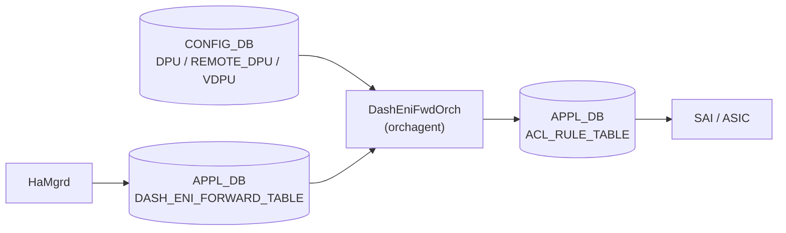

# DPU / ENI / VDPU / REMOTE_DPU テーブル

## 概要

SmartSwitch において NPU から DPU (Data Processing Unit) へのパケット転送を実現する 5 テーブル群。ENI (Elastic Network Interface) Based Forwarding アーキテクチャの構成情報を保持し、`DashEniFwdOrch` が読み出して ACL ルール (`ENI:*`) へ変換する。

- **`DPU`**: ローカル DPU (同一 SmartSwitch 内) のエンドポイント情報
- **`REMOTE_DPU`**: リモート DPU (クラスタ内他 SmartSwitch) のエンドポイント情報
- **`VDPU`**: 仮想 DPU。複数の DPU/REMOTE_DPU をグループ化する抽象レイヤ
- **`ENI`**: DASH_ENI_FORWARD_TABLE 経由で HaMgrd が書き込む ENI-VDPU マッピング (APPL_DB)
- **`DPUS`**: SmartSwitch プラットフォーム定義 (platform.json から config-engine が投入)

!!! warning "YANG 未定義"
    これらのテーブルはすべて YANG モジュールで未定義。スキーマの正本は `sonic-swss/orchagent/dash/dashenifwdorch.h` (フィールド定数定義) と `dashenifwdorch.cpp` (parse ロジック)。

<!-- cdb-mermaid -->
### データフロー (自動生成)



!!! note "凡例"
    `DPU` / `REMOTE_DPU` / `VDPU` はシステム起動時に一度読み出され `DpuRegistry` に格納される。`DASH_ENI_FORWARD_TABLE` は HaMgrd がリアルタイムに更新し、DashEniFwdOrch が ACL ルールへ変換する。
<!-- /cdb-mermaid -->

## テーブル構造

### DPU テーブル

ローカル DPU (同一 SmartSwitch カード内の DPU) のエンドポイント情報。

```text
DPU|<dpu_name>
```

`<dpu_name>`: 任意の DPU 識別名 (例: `dpu0`, `local_dpu`)

| フィールド | 型 | 必須 | 説明 |
|----------|----|------|------|
| `pa_ipv4` | IPv4 アドレス (string) | **必須** | DPU の Physical Address (PA)。ローカル NextHop として使用 |
| `pa_ipv6` | IPv6 アドレス (string) | 省略可 | DPU の PA IPv6 アドレス |
| `state` | enum string | 省略可 | `"up"` または `"down"`。`"down"` の場合は DpuRegistry へ登録されない |

`state` フィールドが `"down"` の DPU は `processDpuTable()` でスキップされる。それ以外 (未指定・`"up"`) は `dpu_type_t::LOCAL` として登録される。

### REMOTE_DPU テーブル

リモート DPU (クラスタ内他 SmartSwitch の DPU) のエンドポイント情報。

```text
REMOTE_DPU|<dpu_name>
```

| フィールド | 型 | 必須 | 説明 |
|----------|----|------|------|
| `pa_ipv4` | IPv4 アドレス (string) | **必須** | リモート DPU の PA。VxLAN トンネルの内部 NH として使用 |
| `pa_ipv6` | IPv6 アドレス (string) | 省略可 | リモート DPU の PA IPv6 アドレス |
| `npu_ipv4` | IPv4 アドレス (string) | **必須** | リモート SmartSwitch の NPU IP。VxLAN トンネルの宛先 (outer IP) |
| `npu_ipv6` | IPv6 アドレス (string) | 省略可 | リモート SmartSwitch の NPU IPv6 アドレス |

REMOTE_DPU は `dpu_type_t::CLUSTER` として登録される。必須フィールド (`pa_ipv4`, `npu_ipv4`) が欠けると `Request::parse()` が例外を投げてスキップされる。

### VDPU テーブル

Virtual DPU。DPU または REMOTE_DPU をグループ化し、ENI に対して VDPU ID 単位で primary/secondary を指定できる抽象レイヤ。

```text
VDPU|<vdpu_name>
```

| フィールド | 型 | 必須 | 説明 |
|----------|----|------|------|
| `main_dpu_ids` | コンマ区切り string | **必須** | この VDPU が束ねる DPU 名のリスト (例: `"dpu0,dpu1"`) |

VDPU は `DPU` / `REMOTE_DPU` テーブルを populate した後に処理される。`main_dpu_ids` に含まれる名前が `dpus_name_map_` に存在しない場合は警告ログを出力してスキップ。

### ENI (DASH_ENI_FORWARD_TABLE)

ENI-to-VDPU マッピング。CONFIG_DB テーブルではなく APPL_DB の `DASH_ENI_FORWARD_TABLE` として管理される。HaMgrd が書き込み、`DashEniFwdOrch` が購読して ACL ルールへ変換する。

```text
DASH_ENI_FORWARD_TABLE|<vnet_name>:<mac_address>
```

| フィールド | 型 | 必須 | 説明 |
|----------|----|------|------|
| `vdpu_ids` | コンマ区切り string | **必須** | ENI に関連する VDPU 名のリスト (例: `"vdpu0,vdpu1"`) |
| `primary_vdpu` | string | **必須** | プライマリ VDPU 名。ACL ルールの redirect 先となる DPU を決定 |

### DPUS テーブル

SmartSwitch プラットフォーム定義。`platform.json` から `sonic-config-engine/smartswitch_config.py` が CONFIG_DB へ投入する。

```text
DPUS|<dpu_name>
```

| フィールド | 型 | 必須 | 説明 |
|----------|----|------|------|
| `midplane_interface` | string | **必須** | DPU の midplane インタフェース名 (例: `"dpu0"`)。DHCP サーバが DHCP ポート割り当てに使用 |

## 関連動作: DashEniFwdOrch の ACL 変換

`DashEniFwdOrch` は lazy init でシステム起動後に一度だけ `DpuRegistry::populate()` を呼び出し、`DPU` / `REMOTE_DPU` / `VDPU` を読み込む。その後、`DASH_ENI_FORWARD_TABLE` エントリが届くたびに以下の ACL ルールを生成する。

| ケース | ACL ルールキー | Redirect 先 | Tunnel Termination |
|--------|-------------|-------------|-------------------|
| `primary_vdpu` が LOCAL DPU | `ENI:<vnet>_<MAC>` | ローカル PA_V4 (隣接解決後の OID) | あり (`<MAC>_TERM`) |
| `primary_vdpu` が CLUSTER DPU | `ENI:<vnet>_<MAC>` | `<NPU_V4>@<tunnel>,<VNI>` | なし (T1 非ホスト ENI) |

優先度は BASE_PRIORITY = 9996、Tunnel Termination ルールは +1 = 9997。

<!-- ordering -->
## 書込み順依存 (Phase B)

`DashEniFwdOrch` は CONFIG_DB の `DPU` / `REMOTE_DPU` / `VDPU` を起動後最初の `DASH_ENI_FORWARD_TABLE` エントリ到着時に一括読込し (`lazyInit()`)、その後 APPL_DB へ ACL ルールを書き込む。テーブル間の処理順序と Neighbor 解決タイミングに複数の依存関係が存在する。

### 検出された順序依存

| # | 依存関係 | 方向 | 緩和策 |
|---|----------|------|--------|
| 1 | `DPU` / `REMOTE_DPU` 存在 → `DASH_ENI_FORWARD_TABLE` 到着 | **強制先行** | ENI より前に DPU テーブルを投入すること。後から DPU を投入しても動的に反映されない（再起動が必要） |
| 2 | `DPU` / `REMOTE_DPU` 登録 → `VDPU` populate | **強制先行** | `processVdpuTable()` は `dpus_name_map_` を参照するため、DPU が先に読まれていなければ VDPU の `main_dpu_ids` が無効になる |
| 3 | LOCAL DPU の Neighbor Up → ACL ルール確定 | 非同期（イベント駆動） | `NeighOrch` に attach してイベント受信。Neighbor Down 中は ACL ルールなし。Up 通知後に自動再評価 |
| 4 | `ACL_TABLE_TABLE` 先行書込み → `ACL_RULE_TABLE` 書込み | **強制先行** | 最初の ENI ADD 時に `addAclTable()` を自動実行。AclOrch がテーブルを受理するまでルールはキューで待機 |
| 5 | 全 ACL ルール削除 → `ACL_TABLE_TABLE` 削除 | 逆順（最後に自動） | `acl_rule_count_` が 0 になったとき `deleteAclTable()` が自動呼び出し |

### 主要な制約詳細

**DPU / REMOTE_DPU の先行投入 (依存 #1, #2)**: `DashEniFwdOrch::lazyInit()` (`dashenifwdorch.cpp:131-146`) は `ctx_initialized_` フラグで一度だけ実行されるガードがかかっており、最初の `addOperation()` 呼び出し時に `DpuRegistry::populate()` が走る。`populate()` は `processDpuTable()` → `processRemoteDpuTable()` → `processVdpuTable()` の固定順で CONFIG_DB をスナップショット読込する (`dashenifwdorch.cpp:218-220`)。このため `DASH_ENI_FORWARD_TABLE` エントリが到着するより前に `DPU` / `REMOTE_DPU` が CONFIG_DB になければ `DpuRegistry` が空のまま確定し、ACL ルールは生成されない。また `processVdpuTable()` は `dpus_name_map_` を参照して各 DPU ID を検索するため (`dashenifwdorch.cpp:331-339`)、DPU / REMOTE_DPU の処理が必ず VDPU より先行する必要がある。

**Neighbor Up 依存の非同期 ACL 確定 (依存 #3)**: LOCAL DPU (`dpu_type_t::LOCAL`) の場合、ACL ルールの redirect 先 OID は `pa_ipv4` の Neighbor OID から決まる。`initLocalEndpoints()` (`dashenifwdorch.cpp:78-104`) は lazyInit 後に LOCAL DPU の `pa_ipv4` を `neigh_dpu_map_` に登録し `resolveNeighbor()` でリクエストするが、Neighbor が未解決の間は ACL ルールはインストールされない。Neighbor Up イベントが `handleNeighUpdate()` (`dashenifwdorch.cpp:48-76`) 経由で届いたとき、`dpu_eni_map_` から影響 ENI を特定して ACL ルールを再評価する。これにより Neighbor Down 中の ENI ルールは「存在しない」状態のまま維持される。

**ACL TABLE / RULE の自動管理 (依存 #4, #5)**: `EniFwdCtxBase::createAclRule()` (`dashenifwdorch.cpp:574-583`) は `acl_rule_count_ == 0` のとき `addAclTable()` を呼んで `APPL_DB:ACL_TABLE_TYPE_TABLE` → `APPL_DB:ACL_TABLE_TABLE` の順で書いてからルールを追加する。逆に `deleteAclRule()` (`dashenifwdorch.cpp:585-601`) は `acl_rule_count_` が 0 になったとき `deleteAclTable()` を自動呼び出しし TABLE を削除する。AclOrch 側は TABLE の受理後でないと RULE を処理できないため、TABLE 先行という順序制約は orchagent 間連携において必須となる。

<!-- /ordering -->

## 購読者

- `DashEniFwdOrch` (`sonic-swss/orchagent/dash/dashenifwdorch.cpp`): `DASH_ENI_FORWARD_TABLE` を購読。起動時に `DPU` / `REMOTE_DPU` / `VDPU` を読み込み `DpuRegistry` を構築。ACL ルールを `APPL_DB:ACL_RULE_TABLE` へ書き込む
- `dhcpservd` (`sonic-buildimage/src/sonic-dhcp-utilities/dhcp_utilities/dhcpservd/dhcp_cfggen.py`): `DPUS` テーブルの `midplane_interface` を DHCP サーバのポート割り当てに使用

## 関連 CONFIG_DB / CLI

- 関連 CONFIG_DB: [`DASH_ACL_*`](dash-acl.md)

<!-- cdb-exceptions -->
## 例外条件・特殊挙動

| 条件 | 挙動 |
|------|------|
| `DPU.state == "down"` | `processDpuTable()` でスキップ。DpuRegistry に登録されない |
| `DPU.pa_ipv4` 未指定 | `Request::parse()` が例外 → `SWSS_LOG_ERROR("Failed to parse key")` |
| `REMOTE_DPU.pa_ipv4` または `npu_ipv4` 未指定 | 同上 |
| `VDPU.main_dpu_ids` に未知 DPU 名を含む | `SWSS_LOG_WARN("Invalid DPU ID")` でその DPU のみスキップ |
| `VDPU.main_dpu_ids` に `state=down` DPU | down DPU は `dpus_name_map_` に未登録のためスキップ |
| LOCAL NH が未解決 (Neighbor Down) | ACL ルール未インストール。Neighbor Up 通知受信後に再試行 |
| ENI の両 VDPU がリモート | Tunnel Termination ルールなし (T1 非ホスト ENI) |
<!-- /cdb-exceptions -->

<!-- value-behavior -->
## 値依存挙動マトリクス

### `DPU.state` (enum string)

| 値 | DpuRegistry への登録 | dpu_type | evidence |
|----|---------------------|----------|---------|
| 未指定 | 登録される (`LOCAL`) | `LOCAL` | `dashenifwdorch.cpp:241-253` |
| `"up"` | 登録される (`LOCAL`) | `LOCAL` | `dashenifwdorch.cpp:244-253` |
| `"down"` | スキップ (登録なし) | — | `dashenifwdorch.cpp:244-253` |

### `primary_vdpu` 解決ロジック

| primary_vdpu の dpu_type | Redirect 先 | Tunnel Term | evidence |
|--------------------------|------------|------------|---------|
| `LOCAL` | `pa_ipv4` (Neighbor oid) | あり | `dashenifwdorch.h:LocalEniNH` |
| `CLUSTER` | `npu_ipv4@tunnel,vni` | なし (ただし 両端 LOCAL の場合はあり) | `dashenifwdorch.h:RemoteEniNH` |
<!-- /value-behavior -->

<!-- ref-triangle:start -->

## 関連リファレンス

- CONFIG_DB: [`DASH_ACL_*`](dash-acl.md)

<!-- ref-triangle:end -->

## 引用元

[^1]: `sonic-swss/orchagent/dash/dashenifwdorch.h` (L62-89 テーブル名・フィールド名定数、L129-156 request_description). <https://github.com/sonic-net/sonic-swss/blob/master/orchagent/dash/dashenifwdorch.h>

[^2]: `sonic-swss/orchagent/dash/dashenifwdorch.cpp` (L212-347 `DpuRegistry::populate()`, `processDpuTable()`, `processRemoteDpuTable()`, `processVdpuTable()`). <https://github.com/sonic-net/sonic-swss/blob/master/orchagent/dash/dashenifwdorch.cpp>

[^3]: `sonic-net/SONiC/doc/smart-switch/high-availability/eni-based-forwarding.md`. <https://github.com/sonic-net/SONiC/blob/master/doc/smart-switch/high-availability/eni-based-forwarding.md>

<!-- ops-hint -->
## 運用ヒント

### 典型設定例 (SmartSwitch HA 構成)

```json
{
    "DPU": {
        "local_dpu0": {
            "pa_ipv4": "10.0.0.1",
            "state": "up"
        }
    },
    "REMOTE_DPU": {
        "remote_dpu0": {
            "pa_ipv4": "10.0.0.2",
            "npu_ipv4": "20.0.0.2"
        }
    },
    "VDPU": {
        "vdpu0": {
            "main_dpu_ids": "local_dpu0"
        },
        "vdpu1": {
            "main_dpu_ids": "remote_dpu0"
        }
    }
}
```

### 確認コマンド

```bash
sonic-db-cli CONFIG_DB keys 'DPU|*'
sonic-db-cli CONFIG_DB hgetall 'DPU|dpu0'
sonic-db-cli CONFIG_DB keys 'REMOTE_DPU|*'
sonic-db-cli CONFIG_DB keys 'VDPU|*'
sonic-db-cli CONFIG_DB keys 'DPUS|*'
# ENI forward table は APPL_DB
sonic-db-cli APPL_DB keys 'DASH_ENI_FORWARD_TABLE:*'
```
<!-- /ops-hint -->

<!-- defaults -->
## フィールド暗黙デフォルト (Phase A — コード由来)

YANG schema が存在しないため、すべてのデフォルトはコード (`dashenifwdorch.h` / `dashenifwdorch.cpp`) のフィールド定数定義と `request_description_t` の必須指定から由来する。

### DPU テーブル

| フィールド | コード由来デフォルト | 必須区分 | fallback 源 | 備考 |
|-----------|-------------------|---------|------------|------|
| `pa_ipv4` | なし | **必須** | `dpu_table_desc` の mandatory フィールド — `dashenifwdorch.h:136` | 欠如時は parse 例外 |
| `pa_ipv6` | なし | 省略可 | フィールド定数 `PA_V6` — `dashenifwdorch.h:78` | オプション。未指定時は DpuData に格納されない |
| `state` | 未指定 = `"up"` 扱い (省略可) | 省略可 | `processDpuTable()` の state チェック — `dashenifwdorch.cpp:243-253` | `"down"` のみ明示的に除外。それ以外はすべて登録 |

### REMOTE_DPU テーブル

| フィールド | コード由来デフォルト | 必須区分 | fallback 源 | 備考 |
|-----------|-------------------|---------|------------|------|
| `pa_ipv4` | なし | **必須** | `remote_dpu_table_desc` mandatory — `dashenifwdorch.h:147` | 欠如時は parse 例外 |
| `npu_ipv4` | なし | **必須** | `remote_dpu_table_desc` mandatory — `dashenifwdorch.h:147` | 欠如時は parse 例外 |
| `pa_ipv6` | なし | 省略可 | フィールド定数 `PA_V6` — `dashenifwdorch.h:78` | オプション |
| `npu_ipv6` | なし | 省略可 | フィールド定数 `NPU_V6` — `dashenifwdorch.h:79` | オプション |

### VDPU テーブル

| フィールド | コード由来デフォルト | 必須区分 | fallback 源 | 備考 |
|-----------|-------------------|---------|------------|------|
| `main_dpu_ids` | なし | **必須** | `vdpu_table_desc` mandatory — `dashenifwdorch.h:155` | コンマ区切り DPU 名リスト |

### ENI (DASH_ENI_FORWARD_TABLE — APPL_DB)

| フィールド | コード由来デフォルト | 必須区分 | fallback 源 | 備考 |
|-----------|-------------------|---------|------------|------|
| `vdpu_ids` | なし | **必須** | `eni_dash_fwd_desc` optional (ただし空時は ACL 未生成) — `dashenifwdorch.h:86` | コンマ区切り VDPU 名リスト |
| `primary_vdpu` | なし | **必須** | `eni_dash_fwd_desc` mandatory — `dashenifwdorch.h:89` | primary の VDPU が ACL redirect 先を決定 |

### DPUS テーブル

| フィールド | コード由来デフォルト | 必須区分 | fallback 源 | 備考 |
|-----------|-------------------|---------|------------|------|
| `midplane_interface` | なし | **必須** | `config_samples.py:100` で `KeyError` 回避なし | 欠如時 `dhcpservd` が DHCP ポート生成をスキップ |

### 補足

- `DPU` テーブルに対応する YANG schema は現時点 (2026-05) で sonic-buildimage の yang-models に存在しない。すべての制約はコードレベルで実施される。
- `state` フィールドのデフォルト: YANG 定義がないため、コードレベルでは「`"down"` 以外はすべて有効」という形。実質的に未指定 = `"up"` 扱い。
- `DpuRegistry::populate()` はシステム起動時に一度のみ呼ばれる (`lazyInit()`); 実行中の DPU テーブル変更は動的に反映されない。
<!-- /defaults -->

<!-- ordering -->
## 書込み順依存 (Phase B)

`DashEniFwdOrch` は `APPL_DB:DASH_ENI_FORWARD_TABLE` の最初のエントリ受信時に `lazyInit()` を呼び出し、CONFIG_DB の `DPU` / `REMOTE_DPU` / `VDPU` テーブルをまとめて読み込む。この **遅延初期化 (lazy init)** 設計により、テーブル群は ENI エントリ到着前にすべて確定している必要がある。

### 検出された順序依存

| # | 依存関係 | 方向 | 緩和策 |
|---|----------|------|--------|
| 1 | `CONFIG_DB:DPU` / `REMOTE_DPU` 投入 → `APPL_DB:DASH_ENI_FORWARD_TABLE` 到着 | **強制先行** | ENI 到着前に DPU 系テーブルが確定していないと `DpuRegistry` に登録されず、ACL ルールが生成されない |
| 2 | `CONFIG_DB:DPU` / `REMOTE_DPU` 処理完了 → `CONFIG_DB:VDPU` 投入 | **強制先行** | `processVdpuTable()` は `dpus_name_map_` を参照するため、DPU/REMOTE_DPU が先に処理されていなければ `SWSS_LOG_WARN("Invalid DPU ID")` でスキップ |
| 3 | `NeighOrch` が LOCAL DPU の Neighbor を解決 → ENI ACL ルールのインストール | **強制先行** (LOCAL の場合) | Neighbor 未解決時は ACL ルール未生成のまま保留。`NeighborUpdate` を受信後に再試行 |
| 4 | `CONFIG_DB:VIP_TABLE` 投入 → ENI ACL テーブル生成 | **強制先行** | `EniFwdCtxBase::getVip()` は `keys()` が空の場合 `SWSS_LOG_THROW` → orchagent クラッシュ |
| 5 | `VNetOrch` への VNET 登録 → CLUSTER ENI ACL ルール生成 | **強制先行** (CLUSTER の場合) | `findVnetVni()` / `findVnetTunnel()` が失敗すると CLUSTER ENI の redirect 先 (tunnel+VNI) が決定できない |
| 6 | `gMySwitchSubType == "SmartSwitch"` 設定 → `DashEniFwdOrch` 生成 | **前提条件** | `orchdaemon.cpp:613` の条件分岐。SmartSwitch サブタイプでなければ Orch 自体が起動しない |

### 主要な制約詳細

**DPU → VDPU の強制先行順序 (依存 #2)**: `DpuRegistry::populate()` は内部で `processDpuTable()` → `processRemoteDpuTable()` → `processVdpuTable()` の固定順で実行される (`dashenifwdorch.cpp:218-221`)。`processVdpuTable()` が `dpus_name_map_` (DPU/REMOTE_DPU 処理時に構築) を参照するため、`populate()` 呼び出し時点で DPU/REMOTE_DPU が CONFIG_DB に存在しなければ VDPU は空の状態で確定する。`populate()` は `lazyInit()` 内で 1 回のみ呼ばれ再読み込みは行われない (`dashenifwdorch.cpp:131-146`)。

**VIP_TABLE の先行必須 (依存 #4)**: `EniFwdCtxBase::addAclTable()` は `getVip()` を呼び出し、`VIP_TABLE` のキーを先頭要素として `IpPrefix` へ変換する。`VIP_TABLE` が空の場合 `SWSS_LOG_THROW("Invalid Config: VIP info not populated")` が発生し orchagent プロセスが終了する (`dashenifwdorch.cpp:502-505`)。

**Neighbor 解決待ちの保留 (依存 #3)**: LOCAL DPU の場合、`initLocalEndpoints()` が `NeighOrch::resolveNeighbor()` を呼んで Neighbor 解決をトリガーする。Neighbor が未解決のまま ENI が到着した場合は ACL ルールが生成されず、`NeighborUpdate` (Neighbor Up 通知) を受信後に `handleNeighUpdate()` → ENI の再評価で ACL ルールがインストールされる (`dashenifwdorch.cpp:48-76`, `dashenifwdorch.h:227-237`)。

**lazyInit の一回性 (依存 #1)**: `ctx_initialized_` フラグにより `lazyInit()` は初回 ENI 到着時にのみ実行される。それ以降に CONFIG_DB の DPU/REMOTE_DPU/VDPU を変更しても `DpuRegistry` には反映されない。SmartSwitch の DPU 構成変更は orchagent の再起動が必要。
<!-- /ordering -->

<!-- ordering -->
## 書込み順依存 (Phase B)

`DashEniFwdOrch` は CONFIG_DB の `DPU` / `REMOTE_DPU` / `VDPU` と APPL_DB の `DASH_ENI_FORWARD_TABLE` を組み合わせて ACL ルールを生成する。テーブル間の処理順序と Neighbor 解決状態が ACL 生成タイミングを支配する。

### 検出された順序依存

| # | 依存関係 | 方向 | 緩和策 |
|---|----------|------|--------|
| 1 | `DPU` / `REMOTE_DPU` 登録 → `VDPU` 解決 | **強制先行** | `processVdpuTable()` は `dpus_name_map_` を参照するため DPU/REMOTE_DPU が先に populate されていなければ VDPU の `main_dpu_ids` が未解決となり警告スキップ |
| 2 | `lazyInit()` 完了 (DpuRegistry 構築) → `DASH_ENI_FORWARD_TABLE` の addOperation 処理 | **強制先行** | `addOperation()` 冒頭で `lazyInit()` を呼ぶが、DPU テーブルが空の状態で ENI が届くと ENI 側の VDPU が解決されず ACL ルールが生成されない |
| 3 | Local DPU Neighbor 解決 → LOCAL ENI の ACL ルール書込み | **強制先行** | `LocalEniNH::resolve()` が `ctx->isNeighborResolved(nh)` を確認し未解決なら ACL rule を書かない。Neighbor Up 通知受信後に `handleNeighUpdate()` 経由で再評価 |
| 4 | `VIP_TABLE` 投入 → CLUSTER ENI の ACL ルール生成 | **強制先行** | `EniFwdCtxBase::getVip()` は `VIP_TABLE` が空の場合 `SWSS_LOG_THROW` で abort。ENI 処理前に VIP が CONFIG_DB に存在していなければならない |
| 5 | ACL table type 作成 → ACL table 作成 → ACL rule 作成 | **強制先行** (`addAclTable()` 内部順序) | 最初の `createAclRule()` 呼び出し時に `acl_rule_count_ == 0` を検知して `addAclTable()` を先行実行。`acl_table_type_->set()` → `acl_table_->set()` → `rule_table_->set()` の順が保証される |
| 6 | ACL rule 全削除 → ACL table / table type 削除 | **逆順強制** | `deleteAclRule()` で `acl_rule_count_` が 0 になった時点で `deleteAclTable()` を後続実行。rule より先に table を消すことはない |

### 主要な制約詳細

**DPU/REMOTE_DPU → VDPU 親子順序 (依存 #1)**: `DpuRegistry::populate()` は `processDpuTable()` → `processRemoteDpuTable()` → `processVdpuTable()` の固定順で呼ばれる (`dashenifwdorch.cpp:218-221`)。`processVdpuTable()` 内で `dpus_name_map_.find(dpu_id) == dpus_name_map_.end()` であれば `SWSS_LOG_WARN("Invalid DPU ID")` を出力してその DPU をスキップする。CONFIG_DB にデータを投入する際は DPU/REMOTE_DPU が VDPU より先に存在していなければ、VDPU の参照が欠落する (`dashenifwdorch.cpp:330-339`)。

**Neighbor 未解決による ACL 生成保留 (依存 #3)**: `LocalEniNH::resolve()` (`dashenifwdinfo.cpp:18-38`) は `ctx->isNeighborResolved(nh)` が偽の場合、`EniAclRule` の state を `PENDING` のまま維持し `ctx->createAclRule()` を呼ばない。その後 `NeighOrch` から Neighbor Up 通知 (`SUBJECT_TYPE_NEIGH_CHANGE`) が届くと `DashEniFwdOrch::handleNeighUpdate()` → `EniInfo::update(NeighborUpdate)` → `fireAllRules()` の経路で再評価される。このため、DPU の PA への Neighbor が解決されるまで LOCAL ENI の ACL ルールは APPL_DB に書き込まれない。

**VIP_TABLE の先行要件 (依存 #4)**: `RemoteEniNH::resolve()` (`dashenifwdinfo.cpp:40-62`) は ENI の vnet_name から VNI とトンネル名を取得した後、`ctx->getVip()` を呼び出す。`getVip()` は `VIP_TABLE` が空なら `SWSS_LOG_THROW` で orchagent プロセスを abort させる。SmartSwitch 起動シーケンスでは `VIP_TABLE` が ENI forwarding テーブルより先に CONFIG_DB に設定されていなければならない。

**acl_rule_count_ による ACL table 参照カウント (依存 #5, #6)**: `EniFwdCtxBase` は `acl_rule_count_` で ACL table の存在を管理する。最初の `createAclRule()` で table と table_type を APPL_DB に書き込み (`addAclTable()`)、最後の `deleteAclRule()` で両方を削除する (`deleteAclTable()`)。rule より table が先に書かれ、table より rule が先に消えることが内部カウンタで保証される (`dashenifwdorch.cpp:576-601`, `dashenifwdorch.cpp:603-650`)。

<!-- /ordering -->

<!-- cross-refs -->
## 暗黙参照テーブル (Phase C)

`DashEniFwdOrch` は CONFIG_DB の複数テーブルと他 orchagent を横断して参照する。以下はコード (`dashenifwdorch.h` / `dashenifwdorch.cpp` / `dashenifwdinfo.cpp`) から抽出した暗黙参照の一覧。

| 参照先テーブル / リソース | 参照方向 | 条件 | 参照元 evidence |
|--------------------------|---------|------|----------------|
| `CONFIG_DB:DPU\|<name>` | 読み取り（スナップショット） | 起動後最初の ENI ADD 時。`lazyInit()` → `DpuRegistry::populate()` | `dashenifwdorch.cpp:212-266` `processDpuTable()` |
| `CONFIG_DB:REMOTE_DPU\|<name>` | 読み取り（スナップショット） | 起動後最初の ENI ADD 時。`lazyInit()` → `DpuRegistry::populate()` | `dashenifwdorch.cpp:269-306` `processRemoteDpuTable()` |
| `CONFIG_DB:VDPU\|<name>` | 読み取り（スナップショット）+ `dpus_name_map_` 参照 | DPU / REMOTE_DPU populate 後に処理。未登録 DPU ID はスキップ | `dashenifwdorch.cpp:308-347` `processVdpuTable()` |
| `CONFIG_DB:VIP_TABLE\|<prefix>` | 読み取り（lazy、1回限り） | CLUSTER 型 ENI の ACL ルール生成時に `getVip()` が呼ばれる。テーブルが空の場合 `SWSS_LOG_THROW` で orchagent abort | `dashenifwdorch.cpp:492-517` `EniFwdCtxBase::getVip()` |
| `CONFIG_DB:PORT\|<name>` (`port_tbl_`) | 読み取り（PORT_ROLE フィールド） | ACL テーブル作成時の `getBindPoints()` で `role=DPC` のポートを internal として除外 | `dashenifwdorch.cpp:414-431` `findInternalPorts()` |
| `NeighOrch` (Neighbor テーブル) | OID 解決 + Observer subscribe | LOCAL DPU の `pa_ipv4` に対して Neighbor 解決。未解決時は ACL ルール未インストール。`NeighOrch::attach(this)` で Up/Down 通知を受信 | `dashenifwdorch.cpp:17-21`, `dashenifwdorch.cpp:78-103` |
| `IntfsOrch` (INTERFACE テーブル) | エイリアス参照 | LOCAL DPU の `pa_ipv4` に対応するルーターインタフェースのエイリアスを取得 (`getRouterIntfsAlias()`) | `dashenifwdorch.cpp:544-547` |
| `VNetOrch` (VNET テーブル) | VNI + トンネル名参照 | CLUSTER 型 ENI の vnet_name から VNI とトンネル名を取得 (`findVnetVni()`, `findVnetTunnel()`)。VNET 未登録時は resolve 失敗 | `dashenifwdorch.cpp:549-567` |
| `VxlanTunnelOrch` (VXLAN_TUNNEL テーブル) | トンネル OID 参照 | CLUSTER 型 ENI の ACL ルール redirect 先となる `<npu_ipv4>@<tunnel>,<vni>` を構築するためにトンネルを解決 | `dashenifwdorch.h:393` `vxlanorch_` |
| `PortsOrch` (PORT テーブル) | PHY / LAG ポート一覧取得 | ACL テーブル作成時の bind points 列挙 (`getAllPorts()`)。LAG member ポートは除外 | `dashenifwdorch.cpp:433-473` `getBindPoints()` |
| `APPL_DB:ACL_TABLE_TYPE_TABLE\|ENI_REDIRECT` | 書き込み（自動管理） | 最初の ENI ACL ルール作成時に `addAclTable()` が自動生成。最後のルール削除時に自動削除 | `dashenifwdorch.cpp:603-644` `addAclTable()` |
| `APPL_DB:ACL_TABLE_TABLE\|ENI` | 書き込み（自動管理） | `addAclTable()` / `deleteAclTable()` で生成・削除。bind points は PHY / LAG ポート（DPC ロール除く）を列挙 | `dashenifwdorch.cpp:636-643` |
| `APPL_DB:ACL_RULE_TABLE\|ENI:*` | 書き込み | ENI ADD/UPDATE/DEL に応じてルールを生成。`acl_rule_count_` で参照カウント | `dashenifwdorch.cpp:574-601` `createAclRule()`, `deleteAclRule()` |

!!! note "VNET テーブルの暗黙依存"
    CLUSTER 型 ENI の ACL ルールを生成するには、`DASH_ENI_FORWARD_TABLE` に含まれる `vnet_name` キーに対応する `VNET` エントリが VNetOrch に登録済みである必要がある。`findVnetVni()` / `findVnetTunnel()` が false を返すと ACL ルールは生成されず、ENI は PENDING 状態のまま残る。

!!! note "VIP_TABLE は唯一の THROW 発生源"
    `VIP_TABLE` が空の場合のみ `SWSS_LOG_THROW` が実行される。他の参照（VNET 未登録・Neighbor 未解決など）はいずれも処理を PENDING 状態で保留し、後続イベントで自動再評価される仕組みになっている。
<!-- /cross-refs -->

<!-- failure -->
## 失敗挙動 (Phase D)

`DashEniFwdOrch` / `DpuRegistry` / `EniInfo` の各レイヤで発生する失敗を、影響範囲と回復手段とともに整理する。

### DpuRegistry::populate() — 起動時スナップショット読込失敗

| 失敗ケース | 発生箇所 | 挙動 | 回復手段 |
|---|---|---|---|
| `DPU.pa_ipv4` / `REMOTE_DPU.pa_ipv4` / `npu_ipv4` 欠落 | `Request::parse()` — `dashenifwdorch.cpp:240`, `dashenifwdorch.cpp:286` | `catch(exception& e)` → `SWSS_LOG_ERROR("Failed to parse key")` でそのエントリをスキップ。他エントリは継続処理 | CONFIG_DB を修正して orchagent を再起動（populate は lazyInit で 1 回限り）|
| `VDPU.main_dpu_ids` に未登録 DPU 名 | `processVdpuTable()` L330-339 | `SWSS_LOG_WARN("Invalid DPU ID")` でその DPU ID をスキップ。VDPU 内の他 DPU ID は継続処理 | orchagent 再起動前に DPU エントリを先に追加 |
| CONFIG_DB に `DPU` / `VDPU` テーブルが存在しない | `Table::getKeys()` が空を返す | 空の DpuRegistry が確定。以降 ENI の ACL ルールが生成されない | CONFIG_DB にエントリ追加後 orchagent 再起動 |

### EniInfo::create() — DASH_ENI_FORWARD_TABLE ADD 失敗

| 失敗ケース | 発生箇所 | 挙動 | retry |
|---|---|---|---|
| `vdpu_ids` または `primary_vdpu` フィールド欠落 | `EniInfo::create()` L285-288 (`dashenifwdinfo.cpp`) | `SWSS_LOG_ERROR("Invalid DASH_ENI_FORWARD_TABLE request")` → `false` 返却。`eni_container_` に登録されず ACL ルールなし | 正しいフィールドで再 SET |
| `primary_vdpu` が DpuRegistry に未登録 | `EniAclRule::processUpdate()` L104-108 | `SWSS_LOG_ERROR("No primary id in DPU Table")` → `update_type_t::INVALID` → `rule_state_t::FAILED` | orchagent 再起動（DpuRegistry は動的更新不可）|
| LOCAL DPU の Neighbor 未解決 | `LocalEniNH::resolve()` L28-31 (`dashenifwdinfo.cpp`) | `endpoint_status_t::UNRESOLVED` → `rule_state_t::PENDING`。`ctx->createAclRule()` 非呼び出し | `NeighOrch` の Neighbor Up 通知受信で自動再評価 (`handleNeighUpdate()`) |
| CLUSTER DPU の VNET トンネル名が未登録 | `RemoteEniNH::resolve()` L45-49 (`dashenifwdinfo.cpp`) | `SWSS_LOG_ERROR("Couldn't find tunnel name for Vnet")` → `endpoint_status_t::UNRESOLVED` → `rule_state_t::PENDING` | VNetOrch に VNET エントリ登録後、ENI の再 SET で再評価 |
| CLUSTER DPU の VNET VNI が未登録 | `RemoteEniNH::resolve()` L52-57 (`dashenifwdinfo.cpp`) | `SWSS_LOG_ERROR("Couldn't find VNI for Vnet")` → `endpoint_status_t::UNRESOLVED` → `rule_state_t::PENDING` | 上記と同様 |
| `VIP_TABLE` が空 (CLUSTER 型 ENI の ACL ルール生成時) | `EniFwdCtxBase::getVip()` L499-503 (`dashenifwdorch.cpp`) | `SWSS_LOG_THROW("Invalid Config: VIP info not populated")` → **orchagent プロセス abort** | orchagent 再起動前に `VIP_TABLE` を CONFIG_DB に設定 |
| `TUNNEL_TERM` ルール用のローカルエンドポイントなし | `EniAclRule::processUpdate()` L93-97 (`dashenifwdinfo.cpp`) | `SWSS_LOG_ERROR("No Local endpoint was found for Rule")` → `update_type_t::INVALID` → `rule_state_t::FAILED` | ENI の `vdpu_ids` に LOCAL DPU を含む VDPU を指定 |

### EniInfo::update() — DASH_ENI_FORWARD_TABLE SET (更新) 失敗

| 失敗ケース | 発生箇所 | 挙動 | retry |
|---|---|---|---|
| `primary_vdpu` フィールドが更新リクエストに含まれない | `EniInfo::update()` L339-341 (`dashenifwdinfo.cpp`) | `throw logic_error("Invalid DASH_ENI_FORWARD_TABLE update: No primary idx")` → orchagent プロセス abort | 正しいフィールドで再 SET |
| `primary_vdpu` 変更なし | 同 L344-347 | `return true`（idempotent）。ACL ルール変更なし | — |

### EniInfo::destroy() — DASH_ENI_FORWARD_TABLE DEL 失敗

| 失敗ケース | 発生箇所 | 挙動 | retry |
|---|---|---|---|
| DEL で `eni_container_` に対象 ENI が存在しない | `DashEniFwdOrch::delOperation()` L192-196 (`dashenifwdorch.cpp`) | `SWSS_LOG_ERROR("Invalid del request")` → `return true`（エントリ不在を容認）。ACL ルールへの影響なし | — |

### rule_state_t 遷移サマリ

```
DASH_ENI_FORWARD_TABLE SET
  ├─ primary_id が DpuRegistry 未登録       → FAILED     (no retry, orchagent 再起動要)
  ├─ Neighbor / VNET / VNI 未解決           → PENDING    (Up/登録通知で自動再評価)
  ├─ VIP_TABLE 空 (CLUSTER 時)              → orchagent ABORT
  └─ resolve 成功                            → INSTALLED

DASH_ENI_FORWARD_TABLE DEL
  ├─ state == INSTALLED                     → deleteAclRule() → UNINSTALLED
  └─ state != INSTALLED                     → 削除のみ (APPL_DB への影響なし)
```

**エラーはすべて syslog (`SWSS_LOG_ERROR` / `SWSS_LOG_WARN`) に出力される。`ERROR_TABLE` への書き込みはなし。**  
APPL_DB の `ACL_RULE_TABLE` に未インストール状態のルールは存在しない。`rule_state_t::FAILED` / `PENDING` は orchagent メモリ内の状態のみであり、STATE_DB や APPL_DB には露出しない。

> **証跡**: `dashenifwdorch.cpp` L131-146 (`lazyInit`), L212-347 (`DpuRegistry::populate`), L574-601 (`createAclRule`/`deleteAclRule`), L492-517 (`getVip`); `dashenifwdinfo.cpp` L18-32 (`LocalEniNH::resolve`), L40-64 (`RemoteEniNH::resolve`), L81-151 (`EniAclRule::processUpdate`), L153-207 (`EniAclRule::fire`), L266-312 (`EniInfo::create`/`destroy`), L314-355 (`EniInfo::update`).
<!-- /failure -->

<!-- constants -->
## ハードコード定数 (Phase E)

`DashEniFwdOrch` / `DpuRegistry` / `EniAclRule` が CONFIG_DB フィールド名・ACL テーブル名・優先度・MAC フォーマットをコード内定数で管理する。YANG 定義が存在しないため、これらの定数がスキーマの正本となる。出典は `sonic-swss/orchagent/dash/dashenifwdorch.h` と `sonic-swss/orchagent/dash/dashenifwdinfo.cpp`。

### テーブル名定数 (`dashenifwdorch.h:63-66`)

| 定数名 | 値 (CONFIG_DB テーブル名) | 備考 |
|--------|--------------------------|------|
| `DashEniFwd::DPU_TABLE` | `"DPU"` | ローカル DPU 登録テーブル |
| `DashEniFwd::REMOTE_DPU_TABLE` | `"REMOTE_DPU"` | リモート DPU 登録テーブル |
| `DashEniFwd::VDPU_TABLE` | `"VDPU"` | 仮想 DPU グループテーブル |
| `DashEniFwd::VIP_TABLE` | `"VIP_TABLE"` | SmartSwitch VIP プレフィックステーブル |

### ACL テーブル・タイプ名定数 (`dashenifwdorch.h:69-70`)

| 定数名 | 値 | 用途 |
|--------|----|------|
| `DashEniFwd::TABLE_TYPE` | `"ENI_REDIRECT"` | APPL_DB `ACL_TABLE_TYPE_TABLE` のキー。最初の ENI 追加時に `addAclTable()` が自動生成 |
| `DashEniFwd::TABLE` | `"ENI"` | APPL_DB `ACL_TABLE_TABLE` のキー。ENI ACL ルールの親テーブル名 |

### フィールド名定数 (`dashenifwdorch.h:71-80`)

| 定数名 | 値 (フィールド名) | 対応テーブル | 備考 |
|--------|-----------------|------------|------|
| `DashEniFwd::VDPU_IDS` | `"vdpu_ids"` | `DASH_ENI_FORWARD_TABLE` | ENI に関連する VDPU 名のコンマ区切りリスト |
| `DashEniFwd::PRIMARY` | `"primary_vdpu"` | `DASH_ENI_FORWARD_TABLE` | 必須。プライマリ VDPU 名。ACL redirect 先を決定 |
| `DashEniFwd::STATE` | `"state"` | `DPU` | `"down"` の場合のみ DpuRegistry 登録をスキップ |
| `DashEniFwd::PA_V4` | `"pa_ipv4"` | `DPU` / `REMOTE_DPU` | Physical Address IPv4。必須フィールド |
| `DashEniFwd::PA_V6` | `"pa_ipv6"` | `DPU` / `REMOTE_DPU` | Physical Address IPv6。省略可 |
| `DashEniFwd::NPU_V4` | `"npu_ipv4"` | `REMOTE_DPU` | リモート SmartSwitch の NPU IP。必須フィールド |
| `DashEniFwd::NPU_V6` | `"npu_ipv6"` | `REMOTE_DPU` | リモート SmartSwitch の NPU IPv6。省略可 |
| `DashEniFwd::DPU_IDS` | `"main_dpu_ids"` | `VDPU` | VDPU が束ねる DPU 名のコンマ区切りリスト。必須 |

### ACL ルール優先度定数 (`dashenifwdinfo.cpp:6`)

| 定数名 | 値 | 用途 |
|--------|----|------|
| `EniAclRule::BASE_PRIORITY` | `9996` | ENI ACL ルールの基底優先度。実際の優先度は `BASE_PRIORITY + static_cast<int>(rule_type_t)` で計算 |

`rule_type_t` の値と実際の ACL ルール優先度:

| `rule_type_t` | enum 値 | ACL ルール優先度 |
|--------------|---------|----------------|
| `NO_TUNNEL_TERM` | `0` | `9996` |
| `TUNNEL_TERM` | `1` | `9997` |

Tunnel Termination ルールが常に NO_TUNNEL_TERM ルールより高優先度となるよう設計されている (`dashenifwdorch.h:46-48`)。

### ACL マッチ・アクション定数 (`dashenifwdorch.cpp:605-643`)

`addAclTable()` が APPL_DB に書き込む `ACL_TABLE_TYPE_TABLE` / `ACL_TABLE_TABLE` の内容:

**ACL_TABLE_TYPE_TABLE (`ENI_REDIRECT`)**:

| フィールド | 値 | 説明 |
|-----------|----|------|
| `matches` | `"DST_IP,INNER_DST_MAC,TUNNEL_TERM"` | ENI 転送ルールが使用する 3 マッチフィールド (ハードコード) |
| `actions` | `"REDIRECT_ACTION"` | 転送先変更アクションのみをサポート |
| `bind_point_types` | `"PORT,PORTCHANNEL"` | PHY ポートと LAG に対してテーブルをバインド |

**ACL_TABLE_TABLE (`ENI`)**:

| フィールド | 値 | 説明 |
|-----------|----|------|
| `policy_desc` | `"Contains Rule for DASH ENI Based Forwarding"` | テーブル説明文 (ハードコード) |
| `type` | `"ENI_REDIRECT"` | `DashEniFwd::TABLE_TYPE` 定数と一致 |
| `stage` | `"INGRESS"` | `STAGE_INGRESS` 定数。変更不可 |
| `ports` | PHY / LAG ポートのコンマ区切り | `getBindPoints()` が `PORT_ROLE != "Dpc"` のポートを動的に列挙 |

### MAC キーフォーマット規則 (`dashenifwdinfo.cpp:381-391`)

ENI の MAC アドレス（例: `f4:93:9f:ef:c4:7e`）は `EniInfo::formatMac()` によってコロン除去・全大文字に変換され (`F4939FEFC47E`)、ACL ルールキー `ENI:<vnet>_<MAC>` の `<MAC>` 部分として使用される。この変換ルールはコードにのみ存在し、YANG や CONFIG_DB スキーマには記載されない。

### `PORT_ROLE_DPC` による内部ポート除外

`findInternalPorts()` (`dashenifwdorch.cpp:414-431`) は `CONFIG_DB:PORT` テーブルを走査し、`role == "Dpc"` (Data-plane Connection) のポートを「DPU 専用内部ポート」として ACL テーブルのバインドポイントから除外する。SmartSwitch では NPU-DPU 間の内部リンクが `PORT_ROLE_DPC` として登録されており、ENI ACL テーブルのバインド対象から自動的に除かれる。
<!-- /constants -->

<!-- side-effects -->
## 副次 DB 書込 (Phase F)

> 詳細証跡: `meta/_intermediate/cdb-flow/dpu-eni-side-effects.md`

`DashEniFwdOrch` は CONFIG_DB / APPL_DB の DPU / ENI テーブルを読み込み、処理結果を APPL_DB の ACL 関連テーブルへ書き出す。STATE_DB / COUNTERS_DB / FLEX_COUNTER_DB への直接書込はない。

### APPL_DB への書込 (ProducerStateTable)

`EniFwdCtxBase` のコンストラクタで 3 本の `ProducerStateTable` を生成する (`dashenifwdorch.cpp:403-405`)。

| 書込テーブル | 操作 | トリガ | 証跡 |
|------------|------|--------|------|
| `APPL_DB:ACL_TABLE_TYPE_TABLE` | SET `ENI_REDIRECT` | ENI ACL ルール 1 件目の作成時 (`addAclTable()`) | `dashenifwdorch.cpp:603-630` |
| `APPL_DB:ACL_TABLE_TABLE` | SET `ENI` | 同上 | `dashenifwdorch.cpp:631-642` |
| `APPL_DB:ACL_RULE_TABLE` | SET `ENI:<vnet>_<MAC>[_TERM]` | `EniAclRule::fire()` で Neighbor RESOLVED 時 | `dashenifwdinfo.cpp:205` |
| `APPL_DB:ACL_RULE_TABLE` | DEL `ENI:<vnet>_<MAC>[_TERM]` | ENI 削除 / primary endpoint 変更時 | `dashenifwdinfo.cpp:182, 220` |
| `APPL_DB:ACL_TABLE_TYPE_TABLE` | DEL `ENI_REDIRECT` | ENI ACL ルール件数が 0 になったとき (`deleteAclTable()`) | `dashenifwdorch.cpp:592-595` |
| `APPL_DB:ACL_TABLE_TABLE` | DEL `ENI` | 同上 | `dashenifwdorch.cpp:592-595` |

### DB 別書込有無サマリ

| 副次 DB / リソース | 書込有無 | 根拠 |
|---|---|---|
| APPL_DB: ACL_TABLE_TYPE_TABLE / ACL_TABLE_TABLE | SET / DEL あり | `addAclTable()` / `deleteAclTable()` — `dashenifwdorch.cpp:603-648` |
| APPL_DB: ACL_RULE_TABLE | SET / DEL あり | `createAclRule()` / `deleteAclRule()` — `dashenifwdorch.cpp:574-601` |
| STATE_DB | なし | `state_db` / `StateDBConnector` 参照なし |
| ASIC_DB | SAI 経由で間接更新 (AclOrch が担当) | AclOrch が `ACL_RULE_TABLE` を購読して SAI 操作 |
| COUNTERS_DB | なし | CRM 連携なし |
| FLEX_COUNTER_DB | なし | Flex カウンタ設定なし |

### NeighOrch 副次効果 — ARP/NDP 解決

ローカル DPU (`dpu_type_t::LOCAL`) への ENI ルール作成時、`LocalEniNH::resolve()` が `NeighOrch::resolveNeighbor()` を呼び出す (`dashenifwdinfo.cpp:30`)。Neighbor が未解決の場合は ARP/NDP プローブが副次的に送出される。

| ケース | 副次効果 |
|--------|---------|
| LOCAL DPU endpoint が未解決 | `NeighOrch::resolveNeighbor()` → ARP/NDP プローブ送出 |
| CLUSTER DPU endpoint | resolveNeighbor() 呼び出しなし。VxLAN トンネルのみ使用 |

Neighbor が解決されると `NeighOrch` からの Observer 通知 (`DashEniFwdOrch::update()` → `handleNeighUpdate()`) が発火し (`dashenifwdorch.cpp:31-44`)、影響 ENI の `fireAllRules()` が再実行されて APPL_DB `ACL_RULE_TABLE` への SET が副次的に発生する。
<!-- /side-effects -->

<!-- pubsub -->
## Redis 通知メカニズム (Phase G)

> 詳細証跡: `meta/_intermediate/cdb-flow/dpu-eni-pubsub.md`

### 書き込み側 — HaMgrd → APPL_DB:DASH_ENI_FORWARD_TABLE

`DashEniFwdOrch` は APPL_DB の `DASH_ENI_FORWARD_TABLE` を**読み取る** consumer であり、このテーブルへの書き込みは `HaMgrd` が担当する (evidence: `eni-based-forwarding.md:108`)。SmartSwitch HA 構成では HaMgrd が ProducerStateTable / ZMQ 経由で ENI-to-VDPU マッピングを書き込む。

### 読み取り側 — ConsumerStateTable (Orch2)

`DashEniFwdOrch` は `Orch2` を継承する (`dashenifwdorch.h:92`)。`Orch2` コンストラクタが `Orch::addConsumer()` を呼び、`ConsumerStateTable(applDb, "DASH_ENI_FORWARD_TABLE", gBatchSize, pri)` を生成する (`orch.cpp:1186-1194`)。

`APP_DASH_ENI_FORWARD_TABLE = "DASH_ENI_FORWARD_TABLE"` (`sonic-swss-common/common/schema.h:196`)。

```
HaMgrd
  ↓ ProducerStateTable → APPL_DB:DASH_ENI_FORWARD_TABLE
Redis keyspace notification (__keyspace@0__:DASH_ENI_FORWARD_TABLE|*)
  ↓ ConsumerStateTable.pops()
Orch2::doTask(Consumer&) → addOperation() / delOperation()
  ↓
DashEniFwdOrch::addOperation() — lazyInit → DpuRegistry::populate() → ENI ACL 生成
DashEniFwdOrch::delOperation() — ENI ACL 削除
```

### NeighOrch Observer — Neighbor 変化通知

`DashEniFwdOrch` は `Observer` を実装し、コンストラクタで `neighorch_->attach(this)` を呼ぶ (`dashenifwdorch.cpp:15-19`)。`NeighOrch` が Neighbor 解決 / 削除イベントを発行すると `DashEniFwdOrch::update(SUBJECT_TYPE_NEIGH_CHANGE, cntx)` が呼ばれ、`handleNeighUpdate()` → 影響 ENI の `fireAllRules()` が実行される。

| 通知経路 | 方向 | 用途 |
|---------|------|------|
| `neighorch_->attach(this)` | `NeighOrch` → `DashEniFwdOrch` | Neighbor 解決イベント受信 |
| `DashEniFwdOrch::update(SUBJECT_TYPE_NEIGH_CHANGE)` | Observer コールバック | LOCAL DPU の ENI ACL ルール再発火 |
| `neighorch_->detach(this)` (デストラクタ) | 購読解除 | ライフサイクル管理 |

### SmartSwitch 限定登録

`DashEniFwdOrch` は `orchdaemon.cpp:613-617` の `gMySwitchSubType == "SmartSwitch"` 分岐内でのみインスタンス化される。通常の SONiC スイッチでは `DASH_ENI_FORWARD_TABLE` の ConsumerStateTable 購読は発生しない。
<!-- /pubsub -->
