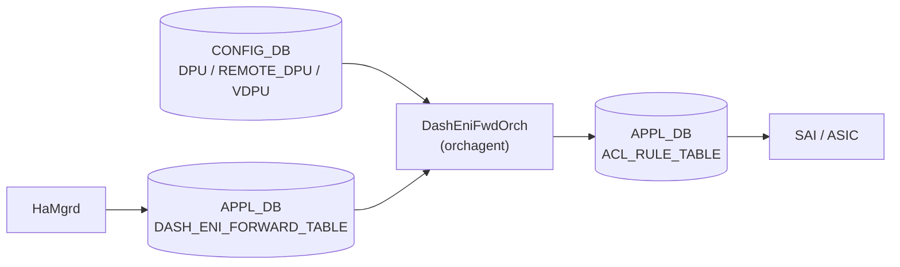

# DPU / ENI / VDPU / REMOTE_DPU テーブル

## 概要

SmartSwitch において NPU から DPU (Data Processing Unit) へのパケット転送を実現する 5 テーブル群。ENI (Elastic Network Interface) Based Forwarding アーキテクチャの構成情報を保持し、`DashEniFwdOrch` が読み出して ACL ルール (`ENI:*`) へ変換する。

- **`DPU`**: ローカル DPU (同一 SmartSwitch 内) のエンドポイント情報
- **`REMOTE_DPU`**: リモート DPU (クラスタ内他 SmartSwitch) のエンドポイント情報
- **`VDPU`**: 仮想 DPU。複数の DPU/REMOTE_DPU をグループ化する抽象レイヤ
- **`ENI`**: DASH_ENI_FORWARD_TABLE 経由で HaMgrd が書き込む ENI-VDPU マッピング (APPL_DB)
- **`DPUS`**: SmartSwitch プラットフォーム定義 (platform.json から config-engine が投入)

!!! warning "YANG 未定義"
    これらのテーブルはすべて YANG モジュールで未定義。スキーマの正本は `sonic-swss/orchagent/dash/dashenifwdorch.h` (フィールド定数定義) と `dashenifwdorch.cpp` (parse ロジック)。

<!-- cdb-mermaid -->
### データフロー (自動生成)



!!! note "凡例"
    `DPU` / `REMOTE_DPU` / `VDPU` はシステム起動時に一度読み出され `DpuRegistry` に格納される。`DASH_ENI_FORWARD_TABLE` は HaMgrd がリアルタイムに更新し、DashEniFwdOrch が ACL ルールへ変換する。
<!-- /cdb-mermaid -->

## テーブル構造

### DPU テーブル

ローカル DPU (同一 SmartSwitch カード内の DPU) のエンドポイント情報。

```text
DPU|<dpu_name>
```

`<dpu_name>`: 任意の DPU 識別名 (例: `dpu0`, `local_dpu`)

| フィールド | 型 | 必須 | 説明 |
|----------|----|------|------|
| `pa_ipv4` | IPv4 アドレス (string) | **必須** | DPU の Physical Address (PA)。ローカル NextHop として使用 |
| `pa_ipv6` | IPv6 アドレス (string) | 省略可 | DPU の PA IPv6 アドレス |
| `state` | enum string | 省略可 | `"up"` または `"down"`。`"down"` の場合は DpuRegistry へ登録されない |

`state` フィールドが `"down"` の DPU は `processDpuTable()` でスキップされる。それ以外 (未指定・`"up"`) は `dpu_type_t::LOCAL` として登録される。

### REMOTE_DPU テーブル

リモート DPU (クラスタ内他 SmartSwitch の DPU) のエンドポイント情報。

```text
REMOTE_DPU|<dpu_name>
```

| フィールド | 型 | 必須 | 説明 |
|----------|----|------|------|
| `pa_ipv4` | IPv4 アドレス (string) | **必須** | リモート DPU の PA。VxLAN トンネルの内部 NH として使用 |
| `pa_ipv6` | IPv6 アドレス (string) | 省略可 | リモート DPU の PA IPv6 アドレス |
| `npu_ipv4` | IPv4 アドレス (string) | **必須** | リモート SmartSwitch の NPU IP。VxLAN トンネルの宛先 (outer IP) |
| `npu_ipv6` | IPv6 アドレス (string) | 省略可 | リモート SmartSwitch の NPU IPv6 アドレス |

REMOTE_DPU は `dpu_type_t::CLUSTER` として登録される。必須フィールド (`pa_ipv4`, `npu_ipv4`) が欠けると `Request::parse()` が例外を投げてスキップされる。

### VDPU テーブル

Virtual DPU。DPU または REMOTE_DPU をグループ化し、ENI に対して VDPU ID 単位で primary/secondary を指定できる抽象レイヤ。

```text
VDPU|<vdpu_name>
```

| フィールド | 型 | 必須 | 説明 |
|----------|----|------|------|
| `main_dpu_ids` | コンマ区切り string | **必須** | この VDPU が束ねる DPU 名のリスト (例: `"dpu0,dpu1"`) |

VDPU は `DPU` / `REMOTE_DPU` テーブルを populate した後に処理される。`main_dpu_ids` に含まれる名前が `dpus_name_map_` に存在しない場合は警告ログを出力してスキップ。

### ENI (DASH_ENI_FORWARD_TABLE)

ENI-to-VDPU マッピング。CONFIG_DB テーブルではなく APPL_DB の `DASH_ENI_FORWARD_TABLE` として管理される。HaMgrd が書き込み、`DashEniFwdOrch` が購読して ACL ルールへ変換する。

```text
DASH_ENI_FORWARD_TABLE|<vnet_name>:<mac_address>
```

| フィールド | 型 | 必須 | 説明 |
|----------|----|------|------|
| `vdpu_ids` | コンマ区切り string | **必須** | ENI に関連する VDPU 名のリスト (例: `"vdpu0,vdpu1"`) |
| `primary_vdpu` | string | **必須** | プライマリ VDPU 名。ACL ルールの redirect 先となる DPU を決定 |

### DPUS テーブル

SmartSwitch プラットフォーム定義。`platform.json` から `sonic-config-engine/smartswitch_config.py` が CONFIG_DB へ投入する。

```text
DPUS|<dpu_name>
```

| フィールド | 型 | 必須 | 説明 |
|----------|----|------|------|
| `midplane_interface` | string | **必須** | DPU の midplane インタフェース名 (例: `"dpu0"`)。DHCP サーバが DHCP ポート割り当てに使用 |

## 関連動作: DashEniFwdOrch の ACL 変換

`DashEniFwdOrch` は lazy init でシステム起動後に一度だけ `DpuRegistry::populate()` を呼び出し、`DPU` / `REMOTE_DPU` / `VDPU` を読み込む。その後、`DASH_ENI_FORWARD_TABLE` エントリが届くたびに以下の ACL ルールを生成する。

| ケース | ACL ルールキー | Redirect 先 | Tunnel Termination |
|--------|-------------|-------------|-------------------|
| `primary_vdpu` が LOCAL DPU | `ENI:<vnet>_<MAC>` | ローカル PA_V4 (隣接解決後の OID) | あり (`<MAC>_TERM`) |
| `primary_vdpu` が CLUSTER DPU | `ENI:<vnet>_<MAC>` | `<NPU_V4>@<tunnel>,<VNI>` | なし (T1 非ホスト ENI) |

優先度は BASE_PRIORITY = 9996、Tunnel Termination ルールは +1 = 9997。

<!-- ordering -->
## 書込み順依存 (Phase B)

`DashEniFwdOrch` は CONFIG_DB の `DPU` / `REMOTE_DPU` / `VDPU` を起動後最初の `DASH_ENI_FORWARD_TABLE` エントリ到着時に一括読込し (`lazyInit()`)、その後 APPL_DB へ ACL ルールを書き込む。テーブル間の処理順序と Neighbor 解決タイミングに複数の依存関係が存在する。

### 検出された順序依存

| # | 依存関係 | 方向 | 緩和策 |
|---|----------|------|--------|
| 1 | `DPU` / `REMOTE_DPU` 存在 → `DASH_ENI_FORWARD_TABLE` 到着 | **強制先行** | ENI より前に DPU テーブルを投入すること。後から DPU を投入しても動的に反映されない（再起動が必要） |
| 2 | `DPU` / `REMOTE_DPU` 登録 → `VDPU` populate | **強制先行** | `processVdpuTable()` は `dpus_name_map_` を参照するため、DPU が先に読まれていなければ VDPU の `main_dpu_ids` が無効になる |
| 3 | LOCAL DPU の Neighbor Up → ACL ルール確定 | 非同期（イベント駆動） | `NeighOrch` に attach してイベント受信。Neighbor Down 中は ACL ルールなし。Up 通知後に自動再評価 |
| 4 | `ACL_TABLE_TABLE` 先行書込み → `ACL_RULE_TABLE` 書込み | **強制先行** | 最初の ENI ADD 時に `addAclTable()` を自動実行。AclOrch がテーブルを受理するまでルールはキューで待機 |
| 5 | 全 ACL ルール削除 → `ACL_TABLE_TABLE` 削除 | 逆順（最後に自動） | `acl_rule_count_` が 0 になったとき `deleteAclTable()` が自動呼び出し |

### 主要な制約詳細

**DPU / REMOTE_DPU の先行投入 (依存 #1, #2)**: `DashEniFwdOrch::lazyInit()` (`dashenifwdorch.cpp:131-146`) は `ctx_initialized_` フラグで一度だけ実行されるガードがかかっており、最初の `addOperation()` 呼び出し時に `DpuRegistry::populate()` が走る。`populate()` は `processDpuTable()` → `processRemoteDpuTable()` → `processVdpuTable()` の固定順で CONFIG_DB をスナップショット読込する (`dashenifwdorch.cpp:218-220`)。このため `DASH_ENI_FORWARD_TABLE` エントリが到着するより前に `DPU` / `REMOTE_DPU` が CONFIG_DB になければ `DpuRegistry` が空のまま確定し、ACL ルールは生成されない。また `processVdpuTable()` は `dpus_name_map_` を参照して各 DPU ID を検索するため (`dashenifwdorch.cpp:331-339`)、DPU / REMOTE_DPU の処理が必ず VDPU より先行する必要がある。

**Neighbor Up 依存の非同期 ACL 確定 (依存 #3)**: LOCAL DPU (`dpu_type_t::LOCAL`) の場合、ACL ルールの redirect 先 OID は `pa_ipv4` の Neighbor OID から決まる。`initLocalEndpoints()` (`dashenifwdorch.cpp:78-104`) は lazyInit 後に LOCAL DPU の `pa_ipv4` を `neigh_dpu_map_` に登録し `resolveNeighbor()` でリクエストするが、Neighbor が未解決の間は ACL ルールはインストールされない。Neighbor Up イベントが `handleNeighUpdate()` (`dashenifwdorch.cpp:48-76`) 経由で届いたとき、`dpu_eni_map_` から影響 ENI を特定して ACL ルールを再評価する。これにより Neighbor Down 中の ENI ルールは「存在しない」状態のまま維持される。

**ACL TABLE / RULE の自動管理 (依存 #4, #5)**: `EniFwdCtxBase::createAclRule()` (`dashenifwdorch.cpp:574-583`) は `acl_rule_count_ == 0` のとき `addAclTable()` を呼んで `APPL_DB:ACL_TABLE_TYPE_TABLE` → `APPL_DB:ACL_TABLE_TABLE` の順で書いてからルールを追加する。逆に `deleteAclRule()` (`dashenifwdorch.cpp:585-601`) は `acl_rule_count_` が 0 になったとき `deleteAclTable()` を自動呼び出しし TABLE を削除する。AclOrch 側は TABLE の受理後でないと RULE を処理できないため、TABLE 先行という順序制約は orchagent 間連携において必須となる。

<!-- /ordering -->

## 購読者

- `DashEniFwdOrch` (`sonic-swss/orchagent/dash/dashenifwdorch.cpp`): `DASH_ENI_FORWARD_TABLE` を購読。起動時に `DPU` / `REMOTE_DPU` / `VDPU` を読み込み `DpuRegistry` を構築。ACL ルールを `APPL_DB:ACL_RULE_TABLE` へ書き込む
- `dhcpservd` (`sonic-buildimage/src/sonic-dhcp-utilities/dhcp_utilities/dhcpservd/dhcp_cfggen.py`): `DPUS` テーブルの `midplane_interface` を DHCP サーバのポート割り当てに使用

## 関連 CONFIG_DB / CLI

- 関連 CONFIG_DB: [`DASH_ACL_*`](dash-acl.md)

<!-- cdb-exceptions -->
## 例外条件・特殊挙動

| 条件 | 挙動 |
|------|------|
| `DPU.state == "down"` | `processDpuTable()` でスキップ。DpuRegistry に登録されない |
| `DPU.pa_ipv4` 未指定 | `Request::parse()` が例外 → `SWSS_LOG_ERROR("Failed to parse key")` |
| `REMOTE_DPU.pa_ipv4` または `npu_ipv4` 未指定 | 同上 |
| `VDPU.main_dpu_ids` に未知 DPU 名を含む | `SWSS_LOG_WARN("Invalid DPU ID")` でその DPU のみスキップ |
| `VDPU.main_dpu_ids` に `state=down` DPU | down DPU は `dpus_name_map_` に未登録のためスキップ |
| LOCAL NH が未解決 (Neighbor Down) | ACL ルール未インストール。Neighbor Up 通知受信後に再試行 |
| ENI の両 VDPU がリモート | Tunnel Termination ルールなし (T1 非ホスト ENI) |
<!-- /cdb-exceptions -->

<!-- value-behavior -->
## 値依存挙動マトリクス

### `DPU.state` (enum string)

| 値 | DpuRegistry への登録 | dpu_type | evidence |
|----|---------------------|----------|---------|
| 未指定 | 登録される (`LOCAL`) | `LOCAL` | `dashenifwdorch.cpp:241-253` |
| `"up"` | 登録される (`LOCAL`) | `LOCAL` | `dashenifwdorch.cpp:244-253` |
| `"down"` | スキップ (登録なし) | — | `dashenifwdorch.cpp:244-253` |

### `primary_vdpu` 解決ロジック

| primary_vdpu の dpu_type | Redirect 先 | Tunnel Term | evidence |
|--------------------------|------------|------------|---------|
| `LOCAL` | `pa_ipv4` (Neighbor oid) | あり | `dashenifwdorch.h:LocalEniNH` |
| `CLUSTER` | `npu_ipv4@tunnel,vni` | なし (ただし 両端 LOCAL の場合はあり) | `dashenifwdorch.h:RemoteEniNH` |
<!-- /value-behavior -->

<!-- ref-triangle:start -->

## 関連リファレンス

- CONFIG_DB: [`DASH_ACL_*`](dash-acl.md)

<!-- ref-triangle:end -->

## 引用元

[^1]: `sonic-swss/orchagent/dash/dashenifwdorch.h` (L62-89 テーブル名・フィールド名定数、L129-156 request_description). <https://github.com/sonic-net/sonic-swss/blob/master/orchagent/dash/dashenifwdorch.h>

[^2]: `sonic-swss/orchagent/dash/dashenifwdorch.cpp` (L212-347 `DpuRegistry::populate()`, `processDpuTable()`, `processRemoteDpuTable()`, `processVdpuTable()`). <https://github.com/sonic-net/sonic-swss/blob/master/orchagent/dash/dashenifwdorch.cpp>

[^3]: `sonic-net/SONiC/doc/smart-switch/high-availability/eni-based-forwarding.md`. <https://github.com/sonic-net/SONiC/blob/master/doc/smart-switch/high-availability/eni-based-forwarding.md>

<!-- ops-hint -->
## 運用ヒント

### 典型設定例 (SmartSwitch HA 構成)

```json
{
    "DPU": {
        "local_dpu0": {
            "pa_ipv4": "10.0.0.1",
            "state": "up"
        }
    },
    "REMOTE_DPU": {
        "remote_dpu0": {
            "pa_ipv4": "10.0.0.2",
            "npu_ipv4": "20.0.0.2"
        }
    },
    "VDPU": {
        "vdpu0": {
            "main_dpu_ids": "local_dpu0"
        },
        "vdpu1": {
            "main_dpu_ids": "remote_dpu0"
        }
    }
}
```

### 確認コマンド

```bash
sonic-db-cli CONFIG_DB keys 'DPU|*'
sonic-db-cli CONFIG_DB hgetall 'DPU|dpu0'
sonic-db-cli CONFIG_DB keys 'REMOTE_DPU|*'
sonic-db-cli CONFIG_DB keys 'VDPU|*'
sonic-db-cli CONFIG_DB keys 'DPUS|*'
# ENI forward table は APPL_DB
sonic-db-cli APPL_DB keys 'DASH_ENI_FORWARD_TABLE:*'
```
<!-- /ops-hint -->

<!-- defaults -->
## フィールド暗黙デフォルト (Phase A — コード由来)

YANG schema が存在しないため、すべてのデフォルトはコード (`dashenifwdorch.h` / `dashenifwdorch.cpp`) のフィールド定数定義と `request_description_t` の必須指定から由来する。

### DPU テーブル

| フィールド | コード由来デフォルト | 必須区分 | fallback 源 | 備考 |
|-----------|-------------------|---------|------------|------|
| `pa_ipv4` | なし | **必須** | `dpu_table_desc` の mandatory フィールド — `dashenifwdorch.h:136` | 欠如時は parse 例外 |
| `pa_ipv6` | なし | 省略可 | フィールド定数 `PA_V6` — `dashenifwdorch.h:78` | オプション。未指定時は DpuData に格納されない |
| `state` | 未指定 = `"up"` 扱い (省略可) | 省略可 | `processDpuTable()` の state チェック — `dashenifwdorch.cpp:243-253` | `"down"` のみ明示的に除外。それ以外はすべて登録 |

### REMOTE_DPU テーブル

| フィールド | コード由来デフォルト | 必須区分 | fallback 源 | 備考 |
|-----------|-------------------|---------|------------|------|
| `pa_ipv4` | なし | **必須** | `remote_dpu_table_desc` mandatory — `dashenifwdorch.h:147` | 欠如時は parse 例外 |
| `npu_ipv4` | なし | **必須** | `remote_dpu_table_desc` mandatory — `dashenifwdorch.h:147` | 欠如時は parse 例外 |
| `pa_ipv6` | なし | 省略可 | フィールド定数 `PA_V6` — `dashenifwdorch.h:78` | オプション |
| `npu_ipv6` | なし | 省略可 | フィールド定数 `NPU_V6` — `dashenifwdorch.h:79` | オプション |

### VDPU テーブル

| フィールド | コード由来デフォルト | 必須区分 | fallback 源 | 備考 |
|-----------|-------------------|---------|------------|------|
| `main_dpu_ids` | なし | **必須** | `vdpu_table_desc` mandatory — `dashenifwdorch.h:155` | コンマ区切り DPU 名リスト |

### ENI (DASH_ENI_FORWARD_TABLE — APPL_DB)

| フィールド | コード由来デフォルト | 必須区分 | fallback 源 | 備考 |
|-----------|-------------------|---------|------------|------|
| `vdpu_ids` | なし | **必須** | `eni_dash_fwd_desc` optional (ただし空時は ACL 未生成) — `dashenifwdorch.h:86` | コンマ区切り VDPU 名リスト |
| `primary_vdpu` | なし | **必須** | `eni_dash_fwd_desc` mandatory — `dashenifwdorch.h:89` | primary の VDPU が ACL redirect 先を決定 |

### DPUS テーブル

| フィールド | コード由来デフォルト | 必須区分 | fallback 源 | 備考 |
|-----------|-------------------|---------|------------|------|
| `midplane_interface` | なし | **必須** | `config_samples.py:100` で `KeyError` 回避なし | 欠如時 `dhcpservd` が DHCP ポート生成をスキップ |

### 補足

- `DPU` テーブルに対応する YANG schema は現時点 (2026-05) で sonic-buildimage の yang-models に存在しない。すべての制約はコードレベルで実施される。
- `state` フィールドのデフォルト: YANG 定義がないため、コードレベルでは「`"down"` 以外はすべて有効」という形。実質的に未指定 = `"up"` 扱い。
- `DpuRegistry::populate()` はシステム起動時に一度のみ呼ばれる (`lazyInit()`); 実行中の DPU テーブル変更は動的に反映されない。
<!-- /defaults -->

<!-- ordering -->
## 書込み順依存 (Phase B)

`DashEniFwdOrch` は CONFIG_DB の `DPU` / `REMOTE_DPU` / `VDPU` と APPL_DB の `DASH_ENI_FORWARD_TABLE` を組み合わせて ACL ルールを生成する。テーブル間の処理順序と Neighbor 解決状態が ACL 生成タイミングを支配する。

### 検出された順序依存

| # | 依存関係 | 方向 | 緩和策 |
|---|----------|------|--------|
| 1 | `DPU` / `REMOTE_DPU` 登録 → `VDPU` 解決 | **強制先行** | `processVdpuTable()` は `dpus_name_map_` を参照するため DPU/REMOTE_DPU が先に populate されていなければ VDPU の `main_dpu_ids` が未解決となり警告スキップ |
| 2 | `lazyInit()` 完了 (DpuRegistry 構築) → `DASH_ENI_FORWARD_TABLE` の addOperation 処理 | **強制先行** | `addOperation()` 冒頭で `lazyInit()` を呼ぶが、DPU テーブルが空の状態で ENI が届くと ENI 側の VDPU が解決されず ACL ルールが生成されない |
| 3 | Local DPU Neighbor 解決 → LOCAL ENI の ACL ルール書込み | **強制先行** | `LocalEniNH::resolve()` が `ctx->isNeighborResolved(nh)` を確認し未解決なら ACL rule を書かない。Neighbor Up 通知受信後に `handleNeighUpdate()` 経由で再評価 |
| 4 | `VIP_TABLE` 投入 → CLUSTER ENI の ACL ルール生成 | **強制先行** | `EniFwdCtxBase::getVip()` は `VIP_TABLE` が空の場合 `SWSS_LOG_THROW` で abort。ENI 処理前に VIP が CONFIG_DB に存在していなければならない |
| 5 | ACL table type 作成 → ACL table 作成 → ACL rule 作成 | **強制先行** (`addAclTable()` 内部順序) | 最初の `createAclRule()` 呼び出し時に `acl_rule_count_ == 0` を検知して `addAclTable()` を先行実行。`acl_table_type_->set()` → `acl_table_->set()` → `rule_table_->set()` の順が保証される |
| 6 | ACL rule 全削除 → ACL table / table type 削除 | **逆順強制** | `deleteAclRule()` で `acl_rule_count_` が 0 になった時点で `deleteAclTable()` を後続実行。rule より先に table を消すことはない |

### 主要な制約詳細

**DPU/REMOTE_DPU → VDPU 親子順序 (依存 #1)**: `DpuRegistry::populate()` は `processDpuTable()` → `processRemoteDpuTable()` → `processVdpuTable()` の固定順で呼ばれる (`dashenifwdorch.cpp:218-221`)。`processVdpuTable()` 内で `dpus_name_map_.find(dpu_id) == dpus_name_map_.end()` であれば `SWSS_LOG_WARN("Invalid DPU ID")` を出力してその DPU をスキップする。CONFIG_DB にデータを投入する際は DPU/REMOTE_DPU が VDPU より先に存在していなければ、VDPU の参照が欠落する (`dashenifwdorch.cpp:330-339`)。

**Neighbor 未解決による ACL 生成保留 (依存 #3)**: `LocalEniNH::resolve()` (`dashenifwdinfo.cpp:18-38`) は `ctx->isNeighborResolved(nh)` が偽の場合、`EniAclRule` の state を `PENDING` のまま維持し `ctx->createAclRule()` を呼ばない。その後 `NeighOrch` から Neighbor Up 通知 (`SUBJECT_TYPE_NEIGH_CHANGE`) が届くと `DashEniFwdOrch::handleNeighUpdate()` → `EniInfo::update(NeighborUpdate)` → `fireAllRules()` の経路で再評価される。このため、DPU の PA への Neighbor が解決されるまで LOCAL ENI の ACL ルールは APPL_DB に書き込まれない。

**VIP_TABLE の先行要件 (依存 #4)**: `RemoteEniNH::resolve()` (`dashenifwdinfo.cpp:40-62`) は ENI の vnet_name から VNI とトンネル名を取得した後、`ctx->getVip()` を呼び出す。`getVip()` は `VIP_TABLE` が空なら `SWSS_LOG_THROW` で orchagent プロセスを abort させる。SmartSwitch 起動シーケンスでは `VIP_TABLE` が ENI forwarding テーブルより先に CONFIG_DB に設定されていなければならない。

**acl_rule_count_ による ACL table 参照カウント (依存 #5, #6)**: `EniFwdCtxBase` は `acl_rule_count_` で ACL table の存在を管理する。最初の `createAclRule()` で table と table_type を APPL_DB に書き込み (`addAclTable()`)、最後の `deleteAclRule()` で両方を削除する (`deleteAclTable()`)。rule より table が先に書かれ、table より rule が先に消えることが内部カウンタで保証される (`dashenifwdorch.cpp:576-601`, `dashenifwdorch.cpp:603-650`)。

<!-- /ordering -->
