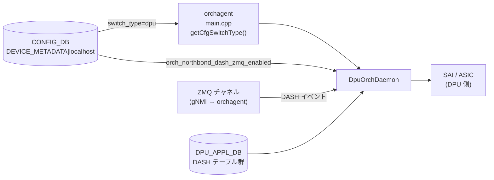

# DPU Orchagent 設定 (DEVICE_METADATA — DPU 固有フィールド)

## 概要

SmartSwitch の DPU (Data Processing Unit) 上で動作する orchagent は `DpuOrchDaemon` として起動する。通常の NPU orchagent (`OrchDaemon`) とは異なり、`DPU_APPL_DB` / `DPU_APPL_STATE_DB` を購読して DASH ワークロードを処理する[^1]。

`DpuOrchDaemon` が選択される唯一の条件は `CONFIG_DB DEVICE_METADATA|localhost.switch_type = "dpu"`。その他の DPU 固有動作は同フィールドの `orch_northbond_dash_zmq_enabled` で制御される。

本ページは DPU orchagent に直接関係する `DEVICE_METADATA|localhost` フィールドに絞ったリファレンスである。`DEVICE_METADATA` 全体のリファレンスは [device-metadata.md](device-metadata.md) を参照。

<!-- cdb-mermaid -->
### データフロー (自動生成)



!!! note "凡例"
    `switch_type` の読み取りは orchagent 起動時に一度のみ。`orch_northbond_dash_zmq_enabled` は DpuOrchDaemon::init() でも一度読み取られ、ZMQ サーバの有無が決定する。
<!-- /cdb-mermaid -->

## フィールド

対象テーブル: `DEVICE_METADATA|localhost`

| フィールド | 型 | YANG default | コード由来デフォルト | 説明 |
|-----------|----|--------------|--------------------|------|
| `switch_type` | enum string | なし | `"switch"` (コード fallback) | orchagent デーモン種別を決定。`"dpu"` を指定すると `DpuOrchDaemon` が選択される |
| `orch_northbond_dash_zmq_enabled` | boolean | `"true"` | `true` (get_feature_status fallback) | gNMI サービスが DASH イベントを ZMQ チャネルで orchagent に送信するか否か |
| `orch_northbond_route_zmq_enabled` | boolean | `"false"` | `false` (get_feature_status fallback) | fpmsyncd が ROUTE イベントを ZMQ チャネルで送信するか否か (DPU 上では通常不使用) |

## フィールド詳細

### `switch_type`

```text
DEVICE_METADATA|localhost
  switch_type = "dpu"
```

`orchagent/main.cpp` の `getCfgSwitchType()` が `CONFIG_DB DEVICE_METADATA|localhost` の `switch_type` を読み取る[^1]。

```cpp
// main.cpp:990-994
if (gMySwitchType == "dpu")
{
    dpu_app_db = make_shared<DBConnector>("DPU_APPL_DB", 0, true);
    dpu_app_state_db = make_shared<DBConnector>("DPU_APPL_STATE_DB", 0, true);
    orchDaemon = make_shared<DpuOrchDaemon>(...);
}
```

`switch_type` が存在しない場合は `"switch"` (= 通常 NPU モード) にフォールバックされ、`DpuOrchDaemon` は選択されない。

`switch_type = "dpu"` のとき `orchagent.sh` が付与する追加引数:

| 引数 | 値 | 効果 |
|------|----|------|
| `-b` (pop batch size) | `65536` | 通常 NPU の `1024` より大幅に増加。DPU の高ボリューム処理に対応 |
| `-z zmq_sync` | 固定 | `synchronous_mode` フィールド値によらず ZMQ sync mode を強制 |
| `-k` (ZMQ max bulk limit) | `65536` | ZMQ バルク送信上限 |

```bash
# orchagent.sh:27-39
elif [[ x"$LOCALHOST_SWITCHTYPE" == x"dpu" ]]; then
    ORCHAGENT_ARGS+="-b 65536 "
fi
if [ "$LOCALHOST_SWITCHTYPE" == "dpu" ]; then
    ORCHAGENT_ARGS+="-z zmq_sync -k 65536 "
fi
```

### `orch_northbond_dash_zmq_enabled`

```text
DEVICE_METADATA|localhost
  orch_northbond_dash_zmq_enabled = "true"   # or "false"
```

`DpuOrchDaemon::init()` が起動時に一度読み取り、ZMQ サーバを DASH orch に渡すかどうかを決定する[^2]:

```cpp
// orchdaemon.cpp:1329-1333
if (get_feature_status(ORCH_NORTHBOND_DASH_ZMQ_ENABLED, true))
{
    dash_zmq_server = m_zmqServer;
}
```

`get_feature_status()` の実装 (`orch_zmq_config.cpp:81-103`):
- `CONFIG_DB.hget("DEVICE_METADATA|localhost", "orch_northbond_dash_zmq_enabled")` を読む
- フィールド欠如時: `default_value = true` を返す
- 値が `"true"` → `true` 返却、それ以外 (`"false"` 等) → `false` 返却

| 値 | ZMQ サーバ割り当て | DASH イベント送信経路 |
|----|-------------------|-------------------|
| `"true"` (YANG default) | あり (`m_zmqServer` を渡す) | gNMI → ZMQ → DashOrch |
| `"false"` | なし (`nullptr`) | APPL_DB ProducerStateTable 経由のみ |
| 欠如 | あり (コード default = `true`) | gNMI → ZMQ → DashOrch |

### `orch_northbond_route_zmq_enabled`

```text
DEVICE_METADATA|localhost
  orch_northbond_route_zmq_enabled = "false"   # YANG default
```

YANG default は `"false"`。DPU 上では RouteOrch が `OrchDaemon::init()` 経由で初期化されるが、通常 DPU では Route イベントを ZMQ 経由で送信しない構成が想定される。

## 購読者

- `orchagent` (`DpuOrchDaemon`): 起動時に `switch_type` を読み取って DpuOrchDaemon として動作; `orch_northbond_dash_zmq_enabled` を読み取って DASH ZMQ を有効化
- `orchagent.sh`: `switch_type` を `sonic-db-cli` で読み取り、`-b 65536 -z zmq_sync -k 65536` を orchagent 起動引数に付与
- `bfdmon.py` (`sonic-buildimage`): `switch_type = "dpu"` のとき BFD モニタリングをスキップ
- `enable_counters.py` (`sonic-buildimage`): `switch_type = "dpu"` のときカウンタ設定を分岐

## 関連 CONFIG_DB / YANG / CLI

- 関連 CONFIG_DB: [`DEVICE_METADATA`](device-metadata.md), [`DPU`/`REMOTE_DPU`/`VDPU`/`ENI`](dpu-eni.md)
- 関連 YANG: `sonic-device_metadata`

<!-- defaults -->
## フィールド暗黙デフォルト (Phase A — コード由来)

DPU orchagent が参照する `DEVICE_METADATA|localhost` フィールドのデフォルト値まとめ。

| フィールド | YANG default | コード由来デフォルト | 必須区分 | fallback 源 |
|-----------|-------------|-------------------|---------|------------|
| `switch_type` | なし | `"switch"` (NPU モード) | 実質必須 | `main.cpp getCfgSwitchType():251` — DB hget 失敗時 `"switch"` を代入 |
| `orch_northbond_dash_zmq_enabled` | `"true"` | `true` | 省略可 | `orch_zmq_config.cpp:81-103` — `get_feature_status(ORCH_NORTHBOND_DASH_ZMQ_ENABLED, true)` の第 2 引数 |
| `orch_northbond_route_zmq_enabled` | `"false"` | `false` | 省略可 | `orch_zmq_config.cpp:81-103` — `get_feature_status(ORCH_NORTHBOND_ROUTE_ZMQ_ENABLED, false)` の第 2 引数 |

### 補足

- **`switch_type`**: YANG に `default` 文はなく、コード (`getCfgSwitchType()`) が DB 不在時に `"switch"` へフォールバックする。DPU として動作させるには `"dpu"` を明示的に設定する必要がある。通常 `platform.json` / `config_samples.py` が `SmartSwitchDPU` 型のサンプル設定生成時に自動投入する。

- **`orch_northbond_dash_zmq_enabled`**: YANG default `"true"` はコードの default_value `true` と一致する。フィールドが存在しない環境でも ZMQ が有効になる。DPU orchagent が ZMQ なしで動作するには明示的に `"false"` を設定する必要がある。

- **ZMQ sync mode**: `switch_type = "dpu"` のとき `orchagent.sh` は `-z zmq_sync` を無条件付与する。これは `synchronous_mode` フィールドの値に関係なく ZMQ sync mode が強制されることを意味する。この挙動はシェルスクリプトレベルで決定されるため CONFIG_DB のフィールドで上書きできない。
<!-- /defaults -->

<!-- ordering -->
## 書込み順依存 (Phase B)

`orchagent` (`DpuOrchDaemon`) が `DEVICE_METADATA|localhost` を読み取るタイミングと、DPU 関連コンポーネントの初期化順序に関する依存関係を示す。

### 検出された順序依存

| # | 依存関係 | 方向 | 緩和策 |
|---|----------|------|--------|
| 1 | `getCfgSwitchType()` による `switch_type` 読み取り → SAI switch 初期化 | **強制先行** | `switch_type` は `sai_api_initialize()` 呼出し前に確定する必要がある。起動後の変更不可 |
| 2 | `switch_type = "dpu"` 確定 → `DPU_APPL_DB` / `DPU_APPL_STATE_DB` 接続 | **強制先行** | `dpu_app_db`・`dpu_app_state_db` は DpuOrchDaemon コンストラクタ呼出し前に生成される (`main.cpp:990-994`) |
| 3 | `OrchDaemon::init()` 完了 → `DpuOrchDaemon::init()` 内 DASH Orch 群初期化 | **強制先行** | `DpuOrchDaemon::init()` の冒頭で `OrchDaemon::init()` を呼ぶ (`orchdaemon.cpp:1324`); 基底ランタイムが確立してから DASH Orch を追加する |
| 4 | `orch_northbond_dash_zmq_enabled` 読み取り → `dash_zmq_server` ポインタ確定 → 各 DASH Orch コンストラクタ | **強制先行** | `get_feature_status()` の結果が `nullptr` か `m_zmqServer` かを決定し、その値が DashVnetOrch・DashOrch・DashAclOrch 等全 DASH Orch コンストラクタに渡される (`orchdaemon.cpp:1327-1406`) |
| 5 | ZMQ サーバ (`zmq_server`) 生成 → `DpuOrchDaemon` コンストラクタ | **強制先行** | ZMQ サーバは `main()` の ZMQ 初期化ブロックで先行生成される; DPU モードでは ZMQ sync mode が `orchagent.sh` により強制されるため、サーバが未初期化だと Daemon が起動できない |

### 主要な制約詳細

**`switch_type` 読み取りの一回性 (依存 #1)**: `getCfgSwitchType()` は `main()` の SAI 初期化前に一度だけ呼ばれ (`main.cpp:658`)、結果はグローバル変数 `gMySwitchType` に保持される。以降 orchagent プロセスが再起動するまで変更されない。CONFIG_DB 上で `switch_type` を変更しても orchagent には反映されず、有効化には orchagent の再起動が必要。

**DpuOrchDaemon::init() 内の DASH Orch 初期化順序 (依存 #3, #4)**: `init()` は以下の順序で DASH Orch を生成・登録する:

```
OrchDaemon::init()          ← 基底クラス初期化（必須先行）
  ↓
orch_northbond_dash_zmq_enabled 読み取り → dash_zmq_server 確定
  ↓
DashVnetOrch → DashOrch → DashHaOrch → DashRouteOrch
  → DashAclOrch → DashTunnelOrch → DashMeterOrch
  → DashPortMapOrch → DashHaFlowOrch
  ↓
addOrchList(各 Orch)  ← イベントループへの登録
```

各 DASH Orch は `dash_zmq_server` ポインタを受け取った時点でその値が確定するため、`orch_northbond_dash_zmq_enabled` の変更は起動後には効果がない。

**`orchagent.sh` による引数付与と CONFIG_DB 読み取り (依存 #5)**: `orchagent.sh` は `sonic-db-cli` で `switch_type` を読み取り (`-b 65536 -z zmq_sync -k 65536`) を orchagent プロセス起動引数として付与する。この読み取りはシェルスクリプト側で起動前に一回のみ実行されるため、orchagent プロセス起動後に CONFIG_DB の `switch_type` を変更しても引数は変わらない。
<!-- /ordering -->

<!-- cross-refs -->
## 暗黙参照 — `DpuOrchDaemon` が読み出す関連 DB テーブル (Phase C)

`DpuOrchDaemon` は CONFIG_DB `DEVICE_METADATA|localhost` の 2 フィールド（Phase A/B 記述済み）以外にも、配下の DASH Orch 群を通じて以下の DB テーブルを暗黙的に参照する。

### DPU_APPL_DB 購読テーブル (DpuOrchDaemon::init() 実行時)

DASH Orch 群はすべて `DPU_APPL_DB`（SmartSwitch 上の DPU 側 APPL DB）から ProducerStateTable / ZMQ 経由でイベントを受信する[^1]。

| DASH Orch | 購読テーブル | evidence |
|-----------|------------|----------|
| `DashVnetOrch` | `DASH_VNET_TABLE`, `DASH_VNET_MAPPING_TABLE` | orchdaemon.cpp:1336-1339 |
| `DashOrch` | `DASH_APPLIANCE_TABLE`, `DASH_ROUTING_TYPE_TABLE`, `DASH_ENI_TABLE`, `DASH_ENI_ROUTE_TABLE`, `DASH_QOS_TABLE` | orchdaemon.cpp:1343-1350 |
| `DashHaOrch` | `DASH_HA_SET_TABLE`, `DASH_HA_SCOPE_TABLE`, `BFD_SESSION_TABLE` | orchdaemon.cpp:1354-1359 |
| `DashRouteOrch` | `DASH_ROUTE_TABLE`, `DASH_ROUTE_RULE_TABLE`, `DASH_ROUTE_GROUP_TABLE` | orchdaemon.cpp:1363-1368 |
| `DashAclOrch` | `DASH_PREFIX_TAG_TABLE`, `DASH_ACL_IN_TABLE`, `DASH_ACL_OUT_TABLE`, `DASH_ACL_GROUP_TABLE`, `DASH_ACL_RULE_TABLE` | orchdaemon.cpp:1372-1378 |
| `DashTunnelOrch` | `DASH_TUNNEL_TABLE` | orchdaemon.cpp:1382-1384 |
| `DashMeterOrch` | `DASH_METER_POLICY_TABLE`, `DASH_METER_RULE_TABLE` | orchdaemon.cpp:1388-1392 |
| `DashPortMapOrch` | `DASH_OUTBOUND_PORT_MAP_TABLE`, `DASH_OUTBOUND_PORT_MAP_RANGE_TABLE` | orchdaemon.cpp:1396-1399 |
| `DashHaFlowOrch` | `DASH_FLOW_SYNC_SESSION_TABLE`, `DASH_FLOW_DUMP_FILTER_TABLE` | orchdaemon.cpp:1403-1406 |

> `DPU_APPL_DB` は通常の `APPL_DB` とは独立した Redis DB インスタンスであり、SmartSwitch NPU 側からは `DPU_APPL_DB` という名前で接続する。DPU 側デーモン（`dashd` など）が書き込み側となり、`DpuOrchDaemon` が読み取り側となる。

### DPU_APPL_STATE_DB 書込み (実行時)

全 DASH Orch コンストラクタに `m_dpu_appstateDb` が渡される。各 DASH Orch は SAI API 呼出し完了後に `DPU_APPL_STATE_DB` へ結果ステータスを書き込む。`DPU_APPL_STATE_DB` への書込みは DASH Orch 群の責務であり、DpuOrchDaemon 自体は直接書き込まない。

### APPL_DB|BFD_SESSION の間接参照 (DashHaOrch)

`DashHaOrch` は `APP_BFD_SESSION_TABLE_NAME` を購読テーブルに含めるとともに、`OrchDaemon::init()` が生成した `gBfdOrch`（`BfdOrch` のグローバルインスタンス）へのポインタを受け取る[^1]。

<!-- evidence:
source: sonic-net/sonic-swss/orchagent/orchdaemon.cpp#L1354-L1359
excerpt: |
  vector<string> dash_ha_tables = {
      APP_DASH_HA_SET_TABLE_NAME,
      APP_DASH_HA_SCOPE_TABLE_NAME,
      APP_BFD_SESSION_TABLE_NAME
  };
  DashHaOrch *dash_ha_orch = new DashHaOrch(m_dpu_appDb, dash_ha_tables, dash_orch, gBfdOrch, m_dpu_appstateDb, dash_zmq_server);
reasoning: DashHaOrch が gBfdOrch を受け取ることで、BFD セッション状態を HA スコープ制御に利用する。gBfdOrch は OrchDaemon::init() (orchdaemon.cpp:243) で生成される BfdOrch の参照であり、APPL_DB BFD_SESSION テーブルを間接的に読み取る。
-->

`gBfdOrch` は `OrchDaemon::init()`（基底クラス初期化）内で生成されるため (`orchdaemon.cpp:243`)、`DpuOrchDaemon::init()` が先頭で `OrchDaemon::init()` を呼ぶ依存順序（Phase B 依存 #3）と連動している。

### CONFIG_DB を直接読まない DASH Orch 群

`dashorch.cpp` / `dashhaorch.cpp` / `dashvnetorch.cpp` / `dashaclorch.cpp` 等の DASH Orch 実装は、CONFIG_DB を直接 `hget` / `hgetall` しない。CONFIG_DB 参照はすべて上位層（`main.cpp` の `getCfgSwitchType()` と `DpuOrchDaemon::init()` の `get_feature_status()`）で完結している。

### 範囲外（誤解されやすい隣接テーブル）

- `DEVICE_METADATA|localhost.synchronous_mode`: orchagent プロセスの同期モードを制御するが、`switch_type = "dpu"` のとき `orchagent.sh` が `-z zmq_sync` を無条件付与するため、このフィールドの値は DPU モードでは無視される。
- `DPU` / `REMOTE_DPU` / `VDPU` / `ENI` テーブル: SmartSwitch 制御プレーン（`sonic-platform-daemons` 系）が読み取る。`DpuOrchDaemon` は直接参照しない。

詳細スキャン手順と grep 結果は `meta/_intermediate/cdb-flow/dpu-orch-cross-refs.md` を参照。
<!-- /cross-refs -->

<!-- failure -->
## 失敗挙動 (Phase D)

`DpuOrchDaemon` の起動・動作時に発生しうる失敗を 5 系統に分類する。

### A. `get_feature_status()` — CONFIG_DB 接続失敗時のフォールバック

`DpuOrchDaemon::init()` 冒頭の `get_feature_status(ORCH_NORTHBOND_DASH_ZMQ_ENABLED, true)` は CONFIG_DB への hget をラップしており、`runtime_error` 例外をキャッチしてデフォルト値を返す:

| 失敗条件 | 結果 | evidence |
|---------|------|---------|
| CONFIG_DB 接続失敗 (`runtime_error`) | `SWSS_LOG_ERROR` + `default_value` 返却。`init()` は中断しない | `orch_zmq_config.cpp:90-93` |
| フィールド欠如 (`hget` null) | `SWSS_LOG_NOTICE` + `default_value` 返却 | `orch_zmq_config.cpp:97-99` |
| 値が `"true"` 以外 (`"false"` 等) | `false` 返却 → `dash_zmq_server = nullptr` | `orch_zmq_config.cpp:103` |

`orch_northbond_dash_zmq_enabled` の default_value は `true` のため、CONFIG_DB が参照不能でも ZMQ が有効化される方向でフォールバックする。`orch_northbond_route_zmq_enabled` の default_value は `false`。

### B. `DPU_APPL_DB` / `DPU_APPL_STATE_DB` 接続失敗

`switch_type = "dpu"` のとき `main.cpp:992-993` で `DBConnector("DPU_APPL_DB", ...)` / `DBConnector("DPU_APPL_STATE_DB", ...)` を生成する。`DBConnector` コンストラクタは Redis 接続失敗時に例外を送出するため、`main()` がキャッチせずに orchagent が abort し、systemd により再起動される。

### C. `DpuOrchDaemon::init()` 失敗 → `exit(EXIT_FAILURE)`

`orchdaemon.cpp:1322-1419` の `DpuOrchDaemon::init()` は DASH Orch 生成中に例外が発生すると `main.cpp:1017-1020` の次のガードで捕捉される:

```cpp
// main.cpp:1017-1020
if (!orchDaemon->init()) {
    SWSS_LOG_ERROR("Failed to initialize orchestration daemon");
    exit(EXIT_FAILURE);
}
```

`DpuOrchDaemon::init()` のコード上の `return false` パスは現存しない（`return true` のみ）。ただし `OrchDaemon::init()` 内で例外送出・false 返却がある場合も同様に `exit(EXIT_FAILURE)` → systemd 再起動となる。

### D. DASH Orch の SAI 操作失敗 → retry / erase

各 DASH Orch の `doTask*()` メソッドは以下の共通パターンで失敗を処理する:

| 失敗ケース | `doTask()` 挙動 | `DPU_APPL_STATE_DB` 書込み | evidence |
|-----------|----------------|--------------------------|---------|
| `addXxx()` 失敗 (SAI API 戻り `!SAI_STATUS_SUCCESS`) | `result = DASH_RESULT_FAILURE` → `writeResultToDB()` → `it++`（次サイクル retry） | `result=1` (FAILURE) | `dashorch.cpp:416-419` |
| `removeXxx()` 失敗 | `it++`（retry）。`removeResultFromDB()` を呼ばない | （前値保持） | `dashorch.cpp:428-430` |
| protobuf parse 失敗 (`parsePbMessage` false) | `SWSS_LOG_WARN` → `erase(it)`（恒久スキップ） | （書込みなし） | `dashorch.cpp:404-408` |
| 未知 op (`SET`/`DEL` 以外) | `SWSS_LOG_ERROR` → `erase(it)` | （書込みなし） | `dashorch.cpp:433-436` |

`writeResultToDB()` は `DPU_APPL_STATE_DB` の対応テーブル（例: `DashOrch` → `APP_DASH_APPLIANCE_TABLE_NAME`）に `result` フィールドとして `0`（成功）/ `1`（失敗）を書き込む（`orchdaemon.cpp` の `DashOrch` コンストラクタで `app_state_db` が渡される）。

!!! note "retry の上限なし"
    `it++` による retry に上限は設定されていない。SAI API が常に失敗を返す場合（例: ASIC ファームウェア異常）、該当エントリは `DPU_APPL_STATE_DB` に `result=1` を書き続けたまま永続的に retry ループに入る。`orchagent restart` か DASH Orch 側の CONFIG/APPL 再投入が必要。

### E. `switch_type` 不正値 — DpuOrchDaemon 非選択フォールバック

`getCfgSwitchType()` (`main.cpp:260-264`) は `switch_type` の値が既知の enum 外の場合 `"switch"` にフォールバックし `SWSS_LOG_ERROR` を出力する:

| 条件 | 挙動 |
|------|------|
| `switch_type` が `"voq"` / `"fabric"` / `"chassis-packet"` / `"switch"` / `"dpu"` 以外 | `SWSS_LOG_ERROR` + `switch_type = "switch"` フォールバック → `DpuOrchDaemon` 非選択、通常 NPU orchagent として起動 |
| `switch_type` DB 読み取り失敗（hget 例外） | 同上: `"switch"` フォールバック |

SmartSwitch DPU として動作させるためには `switch_type = "dpu"` が正確に設定されていなければならず、typo や欠落は orchagent 起動後にサイレントに NPU モードで動作するため注意が必要。

> **証跡**: `getCfgSwitchType()` `main.cpp:242-265`、`get_feature_status()` `orch_zmq_config.cpp:81-103`、`DpuOrchDaemon::init()` `orchdaemon.cpp:1322-1419`、`doTaskApplianceTable()` `dashorch.cpp:386-438`。詳細グレップ証跡は `meta/_intermediate/cdb-flow/dpu-orch-failure.md` を参照。
<!-- /failure -->

<!-- constants -->
## ハードコード定数 (Phase E)

`DpuOrchDaemon` および関連コンポーネントに存在する、CONFIG_DB / YANG で管理されない固定値の一覧。

### orchagent.sh — DPU 起動引数固定値

`switch_type = "dpu"` のとき `orchagent.sh` が orchagent プロセスに渡す引数はすべてスクリプト内ハードコードであり、CONFIG_DB フィールドで上書きできない。

| 引数 | 固定値 | 意味 | ソース |
|------|--------|------|--------|
| `-b` (pop batch size) | `65536` | SelectableTable から 1 回のループで取り出すエントリ数上限。通常 NPU の `1024`・chassis-packet の `128` より大幅に増加し、DPU の高ボリューム処理に対応する | `orchagent.sh:29` |
| `-z` (redis/zmq mode) | `zmq_sync` | orchagent の通信モードを ZMQ 同期モードに固定。`synchronous_mode` フィールド (`DEVICE_METADATA`) の値に関係なく適用される | `orchagent.sh:39` |
| `-k` (max bulk size) | `65536` | ZMQ バルク送信上限。通常 NPU のデフォルト `1000` の約 65 倍 | `orchagent.sh:39` |

### orch_zmq_config — ZMQ アドレス・ポート固定値

| 定数 | 値 | 定義場所 | 用途 |
|------|----|---------|------|
| `ZMQ_LOCAL_ADDRESS` | `"tcp://localhost"` | `orch_zmq_config.h:16` | `create_local_zmq_client()` が ZMQ クライアントを生成するときに使うベースアドレス |
| `ORCH_ZMQ_PORT` (基底ポート) | `8100` | `sonic-swss-common/common/zmqserver.h:16` | `get_zmq_port()` が計算の起点とするポート番号。`NAMESPACE_ID` が空の場合 `8100` がそのまま使われる。マルチ ASIC 環境では `8100 + namespace_id + 1` に加算される |
| `ZMQ_TABLE_CONFIGFILE` | `"/etc/swss/orch_zmq_tables.conf"` | `orch_zmq_config.cpp:10` | `load_zmq_tables()` が読み込む ZMQ テーブルリストファイルのパス。内容は `orch_zmq_tables.conf.j2` テンプレートから生成される |

### orch_zmq_config — フィーチャーフラグキー名

| 定数 | 値 | 定義場所 | 用途 |
|------|----|---------|------|
| `ORCH_NORTHBOND_DASH_ZMQ_ENABLED` | `"orch_northbond_dash_zmq_enabled"` | `orch_zmq_config.h:21` | `get_feature_status()` が CONFIG_DB `DEVICE_METADATA|localhost` から読み出すフィールドキー名 |
| `ORCH_NORTHBOND_ROUTE_ZMQ_ENABLED` | `"orch_northbond_route_zmq_enabled"` | `orch_zmq_config.h:26` | 同上、ROUTE ZMQ フィーチャーフラグ用キー名 |

### orchdaemon.h — P4Orch ZMQ エンドポイント固定値

| 定数 | 値 | 定義場所 | 用途 |
|------|----|---------|------|
| `m_p4OrchZmqServerEp` | `"ipc:///zmq_swss/p4orch_zmq_swss_ep"` | `orchdaemon.h:121` | `OrchDaemon` が P4Orch 向けに生成する ZMQ サーバの IPC エンドポイント。DPU モードでは P4Orch を使用しないため、`DpuOrchDaemon::init()` では事実上参照されない |

!!! note "上書き不可の定数"
    `-b 65536`・`-z zmq_sync`・`-k 65536` の 3 引数は `orchagent.sh` が `switch_type = "dpu"` のとき無条件に付与し、CONFIG_DB / YANG フィールドで変更する手段は存在しない。これらの値を変更するにはシェルスクリプトの修正と orchagent の再起動が必要。

詳細なソーススキャン証跡は `meta/_intermediate/cdb-flow/dpu-orch-constants.md` を参照。
<!-- /constants -->

<!-- side-effects -->
## 副次 DB 書込 (Phase F)

`DpuOrchDaemon` が起動する DASH Orch 群は、CONFIG_DB `DEVICE_METADATA` を直接の書込先とはしない。各 DASH Orch は `DPU_APPL_DB` から受信した DASH エントリを SAI API で処理した後、**`DPU_APPL_STATE_DB`** へ操作結果 (`result` フィールド) を書き込む。これが DpuOrchDaemon 系の主要な副次 DB 書込である。

### DPU_APPL_STATE_DB への書込テーブル一覧

`writeResultToDB()` (`saihelper.cpp:1125-1155`) は SAI 操作結果 (`uint32_t res`) を `result` フィールドとして `table->set(key, fvs)` で書き込む。`res=0` が成功、`res!=0` が SAI ステータスコード（失敗）を示す。`DashRouteOrch` の `DASH_ROUTE_GROUP_TABLE` のみ、追加で `version` フィールドを付与する。

| DASH Orch | DPU_APPL_STATE_DB テーブル | フィールド | 書込トリガ | evidence |
|-----------|---------------------------|-----------|-----------|---------|
| `DashVnetOrch` | `DASH_VNET_TABLE` | `result` | `addVnet()` / `removeVnet()` 後 | `dashvnetorch.cpp:217,283` |
| `DashVnetOrch` | `DASH_VNET_MAPPING_TABLE` | `result` | `addVnetMapping()` / `removeVnetMapping()` 後 | `dashvnetorch.cpp:788,851` |
| `DashOrch` | `DASH_APPLIANCE_TABLE` | `result` | `addAppliance()` / `removeAppliance()` 後 | `dashorch.cpp:419` |
| `DashOrch` | `DASH_ROUTING_TYPE_TABLE` | `result` | routing type SET/DEL 後 | `dashorch.cpp:517` |
| `DashOrch` | `DASH_ENI_TABLE` | `result` | `addEni()` / `removeEni()` 後 | `dashorch.cpp:1077` |
| `DashOrch` | `DASH_QOS_TABLE` | `result` | QoS SET/DEL 後 | `dashorch.cpp:1159` |
| `DashOrch` | `DASH_ENI_ROUTE_TABLE` | `result` | ENI route SET/DEL 後 | `dashorch.cpp:1312` |
| `DashHaOrch` | `DASH_HA_SET_TABLE` | `result` | HA set SET/DEL 後 | `dashhaorch.cpp:447` |
| `DashHaOrch` | `DASH_HA_SCOPE_TABLE` | `result` | HA scope SET/DEL 後 | `dashhaorch.cpp:985` |
| `DashRouteOrch` | `DASH_ROUTE_TABLE` | `result` | route SET/DEL 後 | `dashrouteorch.cpp:342,403` |
| `DashRouteOrch` | `DASH_ROUTE_RULE_TABLE` | `result` | route rule SET/DEL 後 | `dashrouteorch.cpp:644,705` |
| `DashRouteOrch` | `DASH_ROUTE_GROUP_TABLE` | `result`, `version` | route group SET/DEL 後 | `dashrouteorch.cpp:874` |
| `DashTunnelOrch` | `DASH_TUNNEL_TABLE` | `result` | tunnel SET/DEL 後 | `dashtunnelorch.cpp:142,197,251` |
| `DashPortMapOrch` | `DASH_OUTBOUND_PORT_MAP_TABLE` | `result` | port map SET/DEL 後 | `dashportmaporch.cpp:89,149` |
| `DashPortMapOrch` | `DASH_OUTBOUND_PORT_MAP_RANGE_TABLE` | `result` | port map range SET/DEL 後 | `dashportmaporch.cpp:329,387` |

> テーブル名は `sonic-swss-common/common/schema.h:172-200` で定義。`DPU_APPL_STATE_DB` は `main.cpp:993` で `DBConnector("DPU_APPL_STATE_DB", ...)` として生成され、`DpuOrchDaemon` コンストラクタ経由で全 DASH Orch に渡される。

### DashPortMapOrch のみ removeResultFromDB を使用

`DashPortMapOrch` は DEL 操作成功時に `writeResultToDB` ではなく `removeResultFromDB` (`saihelper.cpp:1157-1177`) を呼び、`DPU_APPL_STATE_DB` の対応エントリを `del(key)` で削除する。他の DASH Orch は DEL 操作後も `result=0`（成功）を書いてエントリを残す方式を取る。

### DashAclOrch / DashMeterOrch — DPU_APPL_STATE_DB 書込なし

`DashAclOrch` (`dashaclorch.cpp:77-85`) と `DashMeterOrch` (`dashmeterorch.cpp:27-32`) はコンストラクタで `app_state_db` を受け取るが result table メンバを持たず、`writeResultToDB` を呼ばない。

### DashHaFlowOrch — DPU_STATE_DB への例外的書込

`DashHaFlowOrch` は `app_state_db`（`DPU_APPL_STATE_DB`）を受け取るが使用しない。代わりに自コンストラクタ内で独立して `DBConnector("DPU_STATE_DB", ...)` を生成し (`dashhafloworch.cpp:766`)、フロー同期セッション状態を `DPU_STATE_DB` の `DASH_FLOW_SYNC_SESSION_STATE_TABLE` へ書き込む (`dashhafloworch.cpp:247,307`)。これは `DPU_APPL_STATE_DB` とは別個の Redis インスタンスへの書込みである。

| DASH Orch | 書込 DB | テーブル | フィールド | 書込トリガ |
|-----------|--------|---------|-----------|-----------|
| `DashHaFlowOrch` | `DPU_STATE_DB` | `DASH_FLOW_SYNC_SESSION_STATE_TABLE` | `state`, `creation_time_in_ms`, `last_state_start_time_in_ms` | フロー同期セッション状態遷移時 (`FlowApiHandler::updateState()`) |

詳細スキャン証跡は `meta/_intermediate/cdb-flow/dpu-orch-side-effects.md` を参照。
<!-- /side-effects -->

<!-- pubsub -->
## ZMQ 購読方式 (Phase G)

`DpuOrchDaemon` が `DPU_APPL_DB` の DASH テーブル群を受信するための通信メカニズムを示す。ZMQ 有効時と無効時の 2 経路が存在し、`orch_northbond_dash_zmq_enabled` フィールドにより切り替わる。

### Producer/Consumer ペア

| 区間 | ZMQ 有効 (`orch_northbond_dash_zmq_enabled = true`) | ZMQ 無効 (`false`) |
|------|---------------------------------------------------|-------------------|
| gNMI サービス → `DPU_APPL_DB` DASH テーブル | `ZmqProducerStateTable` → ZMQ wire → `ZmqServer` | `ProducerStateTable` → Redis PUBLISH |
| `DPU_APPL_DB` → DASH Orch | `ZmqConsumerStateTable` (SelectableEvent 駆動) | `ConsumerStateTable` (Redis SUBSCRIBE 駆動) |
| DASH Orch → `DPU_APPL_STATE_DB` | `swss::Table::set()` / `del()` (HSET/HDEL, PUBLISH 非発行) | 同左 |

### ZmqOrch::addConsumer() — DPU_APPL_DB 判別

全 DASH Orch は `ZmqOrch` を継承する。`ZmqOrch::addConsumer()` は `DPU_APPL_DB` に対して `ZmqConsumerStateTable` / `ConsumerStateTable` を切り替える[^5]:

```cpp
// zmqorch.cpp:59-80
if (db->getDbId() == APPL_DB || db->getDbId() == DPU_APPL_DB)
{
    if (zmqServer != nullptr)
        addExecutor(new ZmqConsumer(
            new ZmqConsumerStateTable(db, tableName, *zmqServer, gBatchSize, pri, dbPersistence),
            this, tableName, orderedQueue));
    else
        addExecutor(new Consumer(
            new ConsumerStateTable(db, tableName, gBatchSize, pri),
            this, tableName));
}
```

`zmqServer` は `DpuOrchDaemon::init()` の `dash_zmq_server` ポインタから各 DASH Orch コンストラクタへ渡される。`orch_northbond_dash_zmq_enabled = false` のとき `nullptr` となり `ConsumerStateTable` にフォールバックする。

### ZmqConsumerStateTable — ZmqServer へのハンドラ登録

`ZmqConsumerStateTable` コンストラクタ（`zmqconsumerstatetable.cpp:47`）:

```cpp
m_zmqServer.registerMessageHandler(m_db->getDbName(), tableName, this);
```

`DPU_APPL_DB` では `getDbName()` が `"DPU_APPL_DB"` を返し、テーブル名（`APP_DASH_ENI_TABLE_NAME` 等）を鍵として `ZmqServer` に登録する。ZMQ wire 上のメッセージが到着すると `ZmqServer` が対応ハンドラの `handleReceivedData()` を呼び出し、`SelectableEvent` 経由で orchdaemon の select ループを起動する。

### 遅延バインド (lazy bind) — メッセージロスト防止

`ZmqServer` はコンストラクタで `lazy=true` を指定し、全ハンドラ登録完了後に `main()` が `zmq_server->bind()` を呼ぶ (`main.cpp:1032-1037`)。これにより、クライアント側 `ZmqProducerStateTable` の接続確立前に bind が完了し、DpuOrchDaemon::init() 中の `ZmqConsumerStateTable` 生成（= ハンドラ登録）との間のメッセージロストを防止する。

### ZMQ サーバアドレスと gBatchSize

| パラメータ | DPU での値 | 決定経路 |
|-----------|-----------|---------|
| ZMQ サーバアドレス | `tcp://127.0.0.1:8100`（通常）または `tcp://eth0-midplane:8100` | `orchagent.sh:105-117` — `LOCALHOST_SUBTYPE` が `SmartSwitch` かつ midplane UP のとき `eth0-midplane`、それ以外 `127.0.0.1`。ポート `8100` は `get_zmq_port()`（NAMESPACE_ID 空のとき `ORCH_ZMQ_PORT=8100`） |
| `gBatchSize` (`ZmqConsumerStateTable` の popBatchSize) | `65536` | `orchagent.sh:29` の `-b 65536` 引数 → `main.cpp` の `gBatchSize`。通常 NPU の `1024` の 64 倍 |
| `dbPersistence` | `false` | `ZmqOrch` が `addConsumer()` に渡すデフォルト値。`AsyncDBUpdater` は未生成 |

### select ループでの受信フロー

```
ZmqServer (ZMQ wire 受信スレッド)
  ↓ handleReceivedData() → m_receivedOperationQueue.push()
  ↓ m_selectableEvent.notify()
orchdaemon select ループ (ZmqConsumerStateTable の fd を epoll)
  ↓ ZmqConsumer::execute()
  ↓   table->pops() → addToSync() → drain()
  ↓ ZmqOrch::doTask(ZmqConsumer&)
  ↓ 各 DASH Orch の doTask()（SAI API 呼出し → DPU_APPL_STATE_DB 書込み）
```

`ZmqConsumer::execute()` は `m_ordered_queue = false`（DASH Orch は ordered queue 非使用）のため、`pops()` で一括取り出しして `addToSync()` に渡す（`zmqorch.cpp:14-18`）。

### DPU_APPL_STATE_DB への書込み — 通知なし

DASH Orch が SAI 完了後に `DPU_APPL_STATE_DB` の結果テーブルへ書き込む際は `swss::Table::set()` / `del()` を使用する（`dashorch.cpp:69-73`）。`ProducerStateTable` ではないため Redis `PUBLISH` は発行されない。結果読み取り側（`dashd` 等）は keyspace 通知を待たずオンデマンド `HGETALL` で参照する。

詳細調査証跡は `meta/_intermediate/cdb-flow/dpu-orch-pubsub.md` を参照。
<!-- /pubsub -->

<!-- platform -->
## プラットフォーム差分 (Phase H)

`DpuOrchDaemon` の動作は `DEVICE_METADATA|localhost` の `switch_type = "dpu"` で固定されるが、ASIC プラットフォーム (`platform` 環境変数 = `asic_type`) および `subtype` フィールドによってさらに細かい分岐が存在する。

### `platform` 分岐: MAC アドレス取得元 (orchagent.sh)

`orchagent.sh` は `swss_vars.j2` 経由で `asic_type` を `export platform=<value>` として取得し、orchagent に渡す MAC アドレスの取得インターフェースを分岐する。DPU 向け主要プラットフォームは以下:

| `platform` 値 | MAC 取得元 | 対象 DPU |
|--------------|-----------|---------|
| `nvidia-bluefield` | `eth0`（swss_vars.j2 経由） | NVIDIA BlueField シリーズ |
| `pensando` | `int_mnic0` → `eth0-midplane` フォールバック | AMD/Pensando Elba |
| それ以外 | `eth0`（汎用フォールバック） | — |

```bash
# orchagent.sh:86-92
elif [ "$platform" == "nvidia-bluefield" ]; then
    ORCHAGENT_ARGS+="-m $MAC_ADDRESS"
elif [ "$platform" == "pensando" ]; then
    MAC_ADDRESS=$(ip link show int_mnic0 | grep ether | awk '{print $2}')
    if [ "$MAC_ADDRESS" == "" ]; then
        MAC_ADDRESS=$(ip link show eth0-midplane | grep ether | awk '{print $2}')
    fi
    ORCHAGENT_ARGS+="-m $MAC_ADDRESS"
```

`switch_type = "dpu"` のときの `-b 65536 -z zmq_sync -k 65536` 付与（Phase A / Phase B 記述済み）とは独立して、この MAC 分岐も適用される。

### `subtype` 分岐: ZMQ アドレス (orchagent.sh)

```bash
# orchagent.sh:107-116
LOCALHOST_SUBTYPE=`sonic-db-cli CONFIG_DB hget "DEVICE_METADATA|localhost" "subtype"`
if [[ x"${LOCALHOST_SUBTYPE}" == x"SmartSwitch" ]]; then
    midplane_mgmt_state=$( ip -json -4 addr show eth0-midplane | jq -r ".[0].operstate" )
    if [[ $midplane_mgmt_state == "UP" ]]; then
        ORCHAGENT_ARGS+=" -q tcp://eth0-midplane"
    else
        ORCHAGENT_ARGS+=" -q tcp://127.0.0.1"
    fi
else
    ORCHAGENT_ARGS+=" -q tcp://127.0.0.1"
fi
```

| 動作環境 | `subtype` | ZMQ `-q` アドレス |
|---------|-----------|-----------------|
| SmartSwitch NPU 側 (`subtype=SmartSwitch`) | `SmartSwitch` | `tcp://eth0-midplane`（midplane UP 時）/ `tcp://127.0.0.1`（DOWN 時） |
| DPU 上 orchagent (`switch_type=dpu`) | 通常未設定 | `tcp://127.0.0.1` |

DPU 上の orchagent は `subtype` を通常持たないため、ZMQ アドレスは常に `tcp://127.0.0.1` (loopback) になる。SmartSwitch NPU 側は `subtype = "SmartSwitch"` を使い midplane 経由で DPU 側と通信する。

### `subtype = "SmartSwitch"` 分岐: DashEniFwdOrch 追加 (OrchDaemon::init)

```cpp
// orchdaemon.cpp:613-618
if (gMySwitchSubType == "SmartSwitch")
{
    DashEniFwdOrch *dash_eni_fwd_orch = new DashEniFwdOrch(m_configDb, m_applDb,
        APP_DASH_ENI_FORWARD_TABLE, gNeighOrch);
    gDirectory.set(dash_eni_fwd_orch);
    m_orchList.push_back(dash_eni_fwd_orch);
}
```

NPU 側の `OrchDaemon::init()` 内で `subtype = "SmartSwitch"` のとき `DashEniFwdOrch` が追加される。`DpuOrchDaemon::init()` は冒頭で `OrchDaemon::init()` を呼ぶ（Phase B 依存 #3）ため、DPU 上でも NPU 上でも `subtype` による分岐が実行される。

### `switch_type = "dpu"` 分岐: switch.json.j2 — SWITCH_TABLE 初期設定スキップ

```jinja
{# switch.json.j2:35 #}

    "ecmp_hash_seed": "...",
    "lag_hash_seed": "...",
    "fdb_aging_time": "600",
    "ecmp_hash_offset": "...",
    "lag_hash_offset": "...",
    "ordered_ecmp": "..."

```

`switch_type = "dpu"` のとき `SWITCH_TABLE:switch` への ECMP hash seed・LAG hash seed・FDB aging time・ordered_ecmp の設定が生成されない。DPU の SAI は標準 NPU の ECMP / FDB エージング機能を持たないためである。

### `switch_type = "dpu"` 分岐: ipinip.json.j2 — IP-in-IP デカプ設定スキップ

```jinja
{# ipinip.json.j2:1-3 #}

[]

...（通常 NPU 用 TUNNEL_DECAP_TABLE / TUNNEL_DECAP_TERM_TABLE 生成）...

```

`switch_type = "dpu"` のとき `ipinip.json.j2` は空配列 `[]` を出力し、`TUNNEL_DECAP_TABLE` / `TUNNEL_DECAP_TERM_TABLE` が一切生成されない。DPU は IP-in-IP デカプセルを DASH パイプラインで処理するため orchagent 側の汎用トンネルデカプ設定は不要である。

### `switch_type = "dpu"` 分岐: enable_counters.py — ENI / DASH_METER カウンタ有効化

```python
# enable_counters.py:42-45
dpu_counters = ["ENI", "DASH_METER"]
if platform_info.get('switch_type') == 'dpu':
    for key in dpu_counters:
        enable_counter_group(db, key)
```

`switch_type = "dpu"` のとき `FLEX_COUNTER_TABLE` の `ENI` および `DASH_METER` エントリが `FLEX_COUNTER_STATUS = enable` で書き込まれる。通常 NPU では有効化されない DPU 固有カウンタグループである。

### まとめ: `switch_type = "dpu"` が影響するプラットフォーム差分

| 分岐軸 | 条件 | 挙動 | evidence |
|--------|------|------|---------|
| `platform` | `nvidia-bluefield` | MAC 取得: `eth0` | `orchagent.sh:86` |
| `platform` | `pensando` | MAC 取得: `int_mnic0` → `eth0-midplane` | `orchagent.sh:88-91` |
| `subtype` | `SmartSwitch` | ZMQ `-q tcp://eth0-midplane`（midplane UP 時） | `orchagent.sh:107-113` |
| `subtype` | `SmartSwitch` | `DashEniFwdOrch` を NPU 側 `OrchDaemon` に追加 | `orchdaemon.cpp:613-618` |
| `switch_type` | `dpu` | ECMP/FDB 設定スキップ (`switch.json.j2`) | `switch.json.j2:35` |
| `switch_type` | `dpu` | IP-in-IP デカプ設定スキップ (`ipinip.json.j2`) | `ipinip.json.j2:1` |
| `switch_type` | `dpu` | ENI / DASH_METER FLEX カウンタ有効化 | `enable_counters.py:43` |

> **参照**: 詳細スキャン証跡は `meta/_intermediate/cdb-flow/dpu-orch-platform.md` を参照。
<!-- /platform -->

## 引用元

[^1]: DpuOrchDaemon クラス定義と起動条件: `sonic-swss/orchagent/orchdaemon.h:150-158`, `sonic-swss/orchagent/orchdaemon.cpp:1313-1419`, `sonic-swss/orchagent/main.cpp:981-994`. <https://github.com/sonic-net/sonic-swss/blob/master/orchagent/orchdaemon.cpp>

[^2]: ZMQ 機能フラグ実装: `sonic-swss/lib/orch_zmq_config.h:21`, `sonic-swss/lib/orch_zmq_config.cpp:81-103`. <https://github.com/sonic-net/sonic-swss/blob/master/lib/orch_zmq_config.cpp>


[^5]: ZmqOrch / ZmqConsumerStateTable 実装: `sonic-swss/orchagent/zmqorch.cpp:59-80`, `sonic-swss-common/common/zmqconsumerstatetable.cpp:20-47`, `sonic-swss/lib/orch_zmq_config.cpp:35-80`, `sonic-swss/orchagent/main.cpp:646-654, 1032-1037`. <https://github.com/sonic-net/sonic-swss/blob/master/orchagent/zmqorch.cpp>
