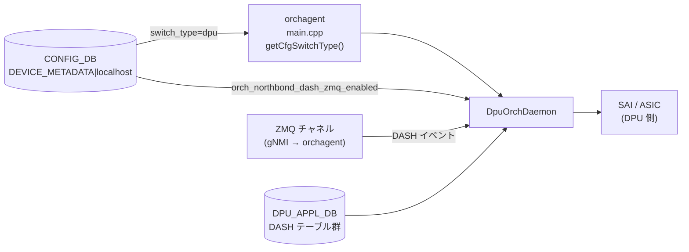

# DPU Orchagent 設定 (DEVICE_METADATA — DPU 固有フィールド)

## 概要

SmartSwitch の DPU (Data Processing Unit) 上で動作する orchagent は `DpuOrchDaemon` として起動する。通常の NPU orchagent (`OrchDaemon`) とは異なり、`DPU_APPL_DB` / `DPU_APPL_STATE_DB` を購読して DASH ワークロードを処理する[^1]。

`DpuOrchDaemon` が選択される唯一の条件は `CONFIG_DB DEVICE_METADATA|localhost.switch_type = "dpu"`。その他の DPU 固有動作は同フィールドの `orch_northbond_dash_zmq_enabled` で制御される。

本ページは DPU orchagent に直接関係する `DEVICE_METADATA|localhost` フィールドに絞ったリファレンスである。`DEVICE_METADATA` 全体のリファレンスは [device-metadata.md](device-metadata.md) を参照。

<!-- cdb-mermaid -->
### データフロー (自動生成)



!!! note "凡例"
    `switch_type` の読み取りは orchagent 起動時に一度のみ。`orch_northbond_dash_zmq_enabled` は DpuOrchDaemon::init() でも一度読み取られ、ZMQ サーバの有無が決定する。
<!-- /cdb-mermaid -->

## フィールド

対象テーブル: `DEVICE_METADATA|localhost`

| フィールド | 型 | YANG default | コード由来デフォルト | 説明 |
|-----------|----|--------------|--------------------|------|
| `switch_type` | enum string | なし | `"switch"` (コード fallback) | orchagent デーモン種別を決定。`"dpu"` を指定すると `DpuOrchDaemon` が選択される |
| `orch_northbond_dash_zmq_enabled` | boolean | `"true"` | `true` (get_feature_status fallback) | gNMI サービスが DASH イベントを ZMQ チャネルで orchagent に送信するか否か |
| `orch_northbond_route_zmq_enabled` | boolean | `"false"` | `false` (get_feature_status fallback) | fpmsyncd が ROUTE イベントを ZMQ チャネルで送信するか否か (DPU 上では通常不使用) |

## フィールド詳細

### `switch_type`

```text
DEVICE_METADATA|localhost
  switch_type = "dpu"
```

`orchagent/main.cpp` の `getCfgSwitchType()` が `CONFIG_DB DEVICE_METADATA|localhost` の `switch_type` を読み取る[^1]。

```cpp
// main.cpp:990-994
if (gMySwitchType == "dpu")
{
    dpu_app_db = make_shared<DBConnector>("DPU_APPL_DB", 0, true);
    dpu_app_state_db = make_shared<DBConnector>("DPU_APPL_STATE_DB", 0, true);
    orchDaemon = make_shared<DpuOrchDaemon>(...);
}
```

`switch_type` が存在しない場合は `"switch"` (= 通常 NPU モード) にフォールバックされ、`DpuOrchDaemon` は選択されない。

`switch_type = "dpu"` のとき `orchagent.sh` が付与する追加引数:

| 引数 | 値 | 効果 |
|------|----|------|
| `-b` (pop batch size) | `65536` | 通常 NPU の `1024` より大幅に増加。DPU の高ボリューム処理に対応 |
| `-z zmq_sync` | 固定 | `synchronous_mode` フィールド値によらず ZMQ sync mode を強制 |
| `-k` (ZMQ max bulk limit) | `65536` | ZMQ バルク送信上限 |

```bash
# orchagent.sh:27-39
elif [[ x"$LOCALHOST_SWITCHTYPE" == x"dpu" ]]; then
    ORCHAGENT_ARGS+="-b 65536 "
fi
if [ "$LOCALHOST_SWITCHTYPE" == "dpu" ]; then
    ORCHAGENT_ARGS+="-z zmq_sync -k 65536 "
fi
```

### `orch_northbond_dash_zmq_enabled`

```text
DEVICE_METADATA|localhost
  orch_northbond_dash_zmq_enabled = "true"   # or "false"
```

`DpuOrchDaemon::init()` が起動時に一度読み取り、ZMQ サーバを DASH orch に渡すかどうかを決定する[^2]:

```cpp
// orchdaemon.cpp:1329-1333
if (get_feature_status(ORCH_NORTHBOND_DASH_ZMQ_ENABLED, true))
{
    dash_zmq_server = m_zmqServer;
}
```

`get_feature_status()` の実装 (`orch_zmq_config.cpp:81-103`):
- `CONFIG_DB.hget("DEVICE_METADATA|localhost", "orch_northbond_dash_zmq_enabled")` を読む
- フィールド欠如時: `default_value = true` を返す
- 値が `"true"` → `true` 返却、それ以外 (`"false"` 等) → `false` 返却

| 値 | ZMQ サーバ割り当て | DASH イベント送信経路 |
|----|-------------------|-------------------|
| `"true"` (YANG default) | あり (`m_zmqServer` を渡す) | gNMI → ZMQ → DashOrch |
| `"false"` | なし (`nullptr`) | APPL_DB ProducerStateTable 経由のみ |
| 欠如 | あり (コード default = `true`) | gNMI → ZMQ → DashOrch |

### `orch_northbond_route_zmq_enabled`

```text
DEVICE_METADATA|localhost
  orch_northbond_route_zmq_enabled = "false"   # YANG default
```

YANG default は `"false"`。DPU 上では RouteOrch が `OrchDaemon::init()` 経由で初期化されるが、通常 DPU では Route イベントを ZMQ 経由で送信しない構成が想定される。

## 購読者

- `orchagent` (`DpuOrchDaemon`): 起動時に `switch_type` を読み取って DpuOrchDaemon として動作; `orch_northbond_dash_zmq_enabled` を読み取って DASH ZMQ を有効化
- `orchagent.sh`: `switch_type` を `sonic-db-cli` で読み取り、`-b 65536 -z zmq_sync -k 65536` を orchagent 起動引数に付与
- `bfdmon.py` (`sonic-buildimage`): `switch_type = "dpu"` のとき BFD モニタリングをスキップ
- `enable_counters.py` (`sonic-buildimage`): `switch_type = "dpu"` のときカウンタ設定を分岐

## 関連 CONFIG_DB / YANG / CLI

- 関連 CONFIG_DB: [`DEVICE_METADATA`](device-metadata.md), [`DPU`/`REMOTE_DPU`/`VDPU`/`ENI`](dpu-eni.md)
- 関連 YANG: `sonic-device_metadata`

<!-- defaults -->
## フィールド暗黙デフォルト (Phase A — コード由来)

DPU orchagent が参照する `DEVICE_METADATA|localhost` フィールドのデフォルト値まとめ。

| フィールド | YANG default | コード由来デフォルト | 必須区分 | fallback 源 |
|-----------|-------------|-------------------|---------|------------|
| `switch_type` | なし | `"switch"` (NPU モード) | 実質必須 | `main.cpp getCfgSwitchType():251` — DB hget 失敗時 `"switch"` を代入 |
| `orch_northbond_dash_zmq_enabled` | `"true"` | `true` | 省略可 | `orch_zmq_config.cpp:81-103` — `get_feature_status(ORCH_NORTHBOND_DASH_ZMQ_ENABLED, true)` の第 2 引数 |
| `orch_northbond_route_zmq_enabled` | `"false"` | `false` | 省略可 | `orch_zmq_config.cpp:81-103` — `get_feature_status(ORCH_NORTHBOND_ROUTE_ZMQ_ENABLED, false)` の第 2 引数 |

### 補足

- **`switch_type`**: YANG に `default` 文はなく、コード (`getCfgSwitchType()`) が DB 不在時に `"switch"` へフォールバックする。DPU として動作させるには `"dpu"` を明示的に設定する必要がある。通常 `platform.json` / `config_samples.py` が `SmartSwitchDPU` 型のサンプル設定生成時に自動投入する。

- **`orch_northbond_dash_zmq_enabled`**: YANG default `"true"` はコードの default_value `true` と一致する。フィールドが存在しない環境でも ZMQ が有効になる。DPU orchagent が ZMQ なしで動作するには明示的に `"false"` を設定する必要がある。

- **ZMQ sync mode**: `switch_type = "dpu"` のとき `orchagent.sh` は `-z zmq_sync` を無条件付与する。これは `synchronous_mode` フィールドの値に関係なく ZMQ sync mode が強制されることを意味する。この挙動はシェルスクリプトレベルで決定されるため CONFIG_DB のフィールドで上書きできない。
<!-- /defaults -->

<!-- ordering -->
## 書込み順依存 (Phase B)

`orchagent` (`DpuOrchDaemon`) が `DEVICE_METADATA|localhost` を読み取るタイミングと、DPU 関連コンポーネントの初期化順序に関する依存関係を示す。

### 検出された順序依存

| # | 依存関係 | 方向 | 緩和策 |
|---|----------|------|--------|
| 1 | `getCfgSwitchType()` による `switch_type` 読み取り → SAI switch 初期化 | **強制先行** | `switch_type` は `sai_api_initialize()` 呼出し前に確定する必要がある。起動後の変更不可 |
| 2 | `switch_type = "dpu"` 確定 → `DPU_APPL_DB` / `DPU_APPL_STATE_DB` 接続 | **強制先行** | `dpu_app_db`・`dpu_app_state_db` は DpuOrchDaemon コンストラクタ呼出し前に生成される (`main.cpp:990-994`) |
| 3 | `OrchDaemon::init()` 完了 → `DpuOrchDaemon::init()` 内 DASH Orch 群初期化 | **強制先行** | `DpuOrchDaemon::init()` の冒頭で `OrchDaemon::init()` を呼ぶ (`orchdaemon.cpp:1324`); 基底ランタイムが確立してから DASH Orch を追加する |
| 4 | `orch_northbond_dash_zmq_enabled` 読み取り → `dash_zmq_server` ポインタ確定 → 各 DASH Orch コンストラクタ | **強制先行** | `get_feature_status()` の結果が `nullptr` か `m_zmqServer` かを決定し、その値が DashVnetOrch・DashOrch・DashAclOrch 等全 DASH Orch コンストラクタに渡される (`orchdaemon.cpp:1327-1406`) |
| 5 | ZMQ サーバ (`zmq_server`) 生成 → `DpuOrchDaemon` コンストラクタ | **強制先行** | ZMQ サーバは `main()` の ZMQ 初期化ブロックで先行生成される; DPU モードでは ZMQ sync mode が `orchagent.sh` により強制されるため、サーバが未初期化だと Daemon が起動できない |

### 主要な制約詳細

**`switch_type` 読み取りの一回性 (依存 #1)**: `getCfgSwitchType()` は `main()` の SAI 初期化前に一度だけ呼ばれ (`main.cpp:658`)、結果はグローバル変数 `gMySwitchType` に保持される。以降 orchagent プロセスが再起動するまで変更されない。CONFIG_DB 上で `switch_type` を変更しても orchagent には反映されず、有効化には orchagent の再起動が必要。

**DpuOrchDaemon::init() 内の DASH Orch 初期化順序 (依存 #3, #4)**: `init()` は以下の順序で DASH Orch を生成・登録する:

```
OrchDaemon::init()          ← 基底クラス初期化（必須先行）
  ↓
orch_northbond_dash_zmq_enabled 読み取り → dash_zmq_server 確定
  ↓
DashVnetOrch → DashOrch → DashHaOrch → DashRouteOrch
  → DashAclOrch → DashTunnelOrch → DashMeterOrch
  → DashPortMapOrch → DashHaFlowOrch
  ↓
addOrchList(各 Orch)  ← イベントループへの登録
```

各 DASH Orch は `dash_zmq_server` ポインタを受け取った時点でその値が確定するため、`orch_northbond_dash_zmq_enabled` の変更は起動後には効果がない。

**`orchagent.sh` による引数付与と CONFIG_DB 読み取り (依存 #5)**: `orchagent.sh` は `sonic-db-cli` で `switch_type` を読み取り (`-b 65536 -z zmq_sync -k 65536`) を orchagent プロセス起動引数として付与する。この読み取りはシェルスクリプト側で起動前に一回のみ実行されるため、orchagent プロセス起動後に CONFIG_DB の `switch_type` を変更しても引数は変わらない。
<!-- /ordering -->

## 引用元

[^1]: DpuOrchDaemon クラス定義と起動条件: `sonic-swss/orchagent/orchdaemon.h:150-158`, `sonic-swss/orchagent/orchdaemon.cpp:1313-1419`, `sonic-swss/orchagent/main.cpp:981-994`. <https://github.com/sonic-net/sonic-swss/blob/master/orchagent/orchdaemon.cpp>

[^2]: ZMQ 機能フラグ実装: `sonic-swss/lib/orch_zmq_config.h:21`, `sonic-swss/lib/orch_zmq_config.cpp:81-103`. <https://github.com/sonic-net/sonic-swss/blob/master/lib/orch_zmq_config.cpp>

[^3]: YANG 定義: `sonic-buildimage/src/sonic-yang-models/yang-models/sonic-device_metadata.yang:217-224, 340-350`. <https://github.com/sonic-net/sonic-buildimage/blob/master/src/sonic-yang-models/yang-models/sonic-device_metadata.yang>

[^4]: orchagent.sh DPU 固有引数: `sonic-buildimage/dockers/docker-orchagent/orchagent.sh:22-42`. <https://github.com/sonic-net/sonic-buildimage/blob/master/dockers/docker-orchagent/orchagent.sh>
