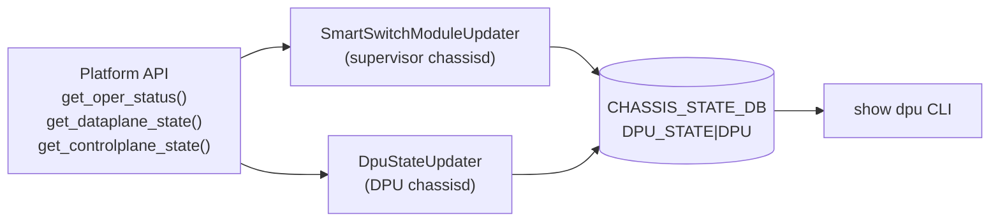

# DPU_STATE テーブル (CHASSIS_STATE_DB)

## 概要

`DPU_STATE` テーブルは `CHASSIS_STATE_DB` (Redis DB ID=13) に格納される **状態専用テーブル**。CONFIG_DB の設定テーブルとは異なり、SmartSwitch 上の `chassisd` デーモンが運用状態を **push 型** で書き込む。

書き込み元は 2 コンポーネント:

| 書き込み元 | 役割 |
|-----------|------|
| `SmartSwitchModuleUpdater` | supervisor 側。midplane リンク状態 (`dpu_midplane_link_*`) を管理 |
| `DpuStateUpdater` | DPU 側 (line card 上の chassisd)。データプレーン / コントロールプレーン状態を管理 |

`show dpu` CLI (`sonic-utilities/show/system_health.py:show_dpu_state()`) がこのテーブルを読み取り、DPU ごとの運用状態 (`Online` / `Partial Online` / `Offline`) を表示する[^1]。

<!-- cdb-mermaid -->
### データフロー (自動生成)



!!! note "凡例"
    CHASSIS_STATE_DB は CONFIG_DB ではなく Redis DB ID=13。`sonic-db-cli CHASSIS_STATE_DB` でアクセスする。
<!-- /cdb-mermaid -->

## key 構造

```text
DPU_STATE|DPU<N>
```

| キー | 型 | 説明 |
|------|----|------|
| `DPU<N>` | string | DPU 識別子 (例: `DPU0`, `DPU1`) |

`N` は `chassis.get_dpu_id()` が返す DPU ID (0 始まり整数)。

## フィールド

| フィールド | 型 | デフォルト / fallback | 書き込み元 | 説明 |
|-----------|----|----------------------|-----------|------|
| `dpu_midplane_link_state` | `up`/`down` | 起動時: oper_status が ONLINE → `'up'`、それ以外 → `'down'` | `SmartSwitchModuleUpdater` | DPU の midplane リンク状態 |
| `dpu_midplane_link_reason` | string | `""` (常に空文字列) | `SmartSwitchModuleUpdater` | midplane down 理由 (実装上は常に空) |
| `dpu_midplane_link_time` | string | `get_formatted_time()` 現在時刻 | `SmartSwitchModuleUpdater` | midplane 状態変化時刻 |
| `dpu_control_plane_state` | `up`/`down` | midplane `'down'` 時: `'down'`; それ以外: platform API / SYSTEM_READY 参照 | `DpuStateUpdater` / `SmartSwitchModuleUpdater` | DPU コントロールプレーン状態 |
| `dpu_control_plane_time` | string | `get_formatted_time()` 現在時刻 (状態変化時のみ) | `DpuStateUpdater` | コントロールプレーン状態変化時刻 |
| `dpu_data_plane_state` | `up`/`down` | midplane `'down'` 時: `'down'`; それ以外: platform API / 全ポート oper_status 参照 | `DpuStateUpdater` / `SmartSwitchModuleUpdater` | DPU データプレーン状態 |
| `dpu_data_plane_time` | string | `get_formatted_time()` 現在時刻 (状態変化時のみ) | `DpuStateUpdater` | データプレーン状態変化時刻 |

## 制約

- このテーブルは CONFIG_DB ではなく `CHASSIS_STATE_DB` (DB ID=13) に存在する
- SmartSwitch 専用テーブル。モジュラーチャシス (VOQ 構成) では存在しない
- YANG モデルは存在しない (STATE_DB は YANG の管轄外)

<!-- defaults -->
## フィールド暗黙デフォルト (Phase A — コード由来)

このテーブルは YANG `default` 文を持たない STATE_DB テーブル。以下はコードから読み取ったデフォルト / fallback の調査結果。

### 起動時初期化 (`set_initial_dpu_admin_state`)

```python
# chassisd:1387-1391
if operational_state == ModuleBase.MODULE_STATUS_ONLINE:
    op_state = 'up'
else:
    op_state = 'down'
self.module_updater.update_dpu_state(dpu_state_key, op_state)
```

- platform API が `NotImplementedError` → `try_get()` が `MODULE_STATUS_OFFLINE` を返すため `op_state = 'down'`
- `update_dpu_state(key, 'down')` は `dpu_midplane_link_state`, `dpu_control_plane_state`, `dpu_data_plane_state` を **同時に `'down'`** に設定 (chassisd:882-884)
- `update_dpu_state(key, 'up')` は `dpu_midplane_link_state` のみ更新し、CP/DP state は `DpuStateUpdater` が後から書き込む

### フィールド別デフォルト詳細

| フィールド | YANG default | コード由来デフォルト | 備考 |
|-----------|-------------|-------------------|------|
| `dpu_midplane_link_state` | なし | 起動時は oper_status 依存; ポーリング時は midplane 到達性依存 | `chassisd:1387-1391`, `1102-1105` |
| `dpu_midplane_link_reason` | なし | `""` (常に空) | `chassisd:878` — platform API 設計上の制約 |
| `dpu_midplane_link_time` | なし | `get_formatted_time()` — `"%a %b %d %I:%M:%S %p UTC %Y"` | 例: `"Wed May 14 10:30:45 AM UTC 2026"` |
| `dpu_control_plane_state` | なし | midplane `'down'` 設定時: `'down'`; DpuStateUpdater: `SYSTEM_READY.Status` 参照 | `chassisd:882-884`, `1277-1284` |
| `dpu_control_plane_time` | なし | `get_formatted_time()` 現在時刻 (CP state 変化時のみ更新) | SmartSwitchModuleUpdater による `'down'` 書き込み時は更新されない |
| `dpu_data_plane_state` | なし | midplane `'down'` 設定時: `'down'`; DpuStateUpdater: 全 PORT oper_status 参照 | `chassisd:882-884`, `1267-1275` |
| `dpu_data_plane_time` | なし | `get_formatted_time()` 現在時刻 (DP state 変化時のみ更新) | SmartSwitchModuleUpdater による `'down'` 書き込み時は更新されない |

### 状態変化条件

`DpuStateUpdater.update_state()` (chassisd:1303-1316) は **前回値と比較して変化した場合のみ** DB に書き込む:

```python
# chassisd:1306-1315
_, dp_prev_state = self.dpu_state_table.hget(self.name, DP_STATE)
if dp_current_state != dp_prev_state:
    self._update_dp_dpu_state(dp_current_state)  # state + time を更新

_, cp_prev_state = self.dpu_state_table.hget(self.name, CP_STATE)
if cp_current_state != cp_prev_state:
    self._update_cp_dpu_state(cp_current_state)  # state + time を更新
```

状態が変化しない場合は `*_time` フィールドも更新されない。

### chassisd 停止時 (`deinit`)

```python
# chassisd:1318-1320
def deinit(self):
    self._update_dp_dpu_state('down')
    self._update_cp_dpu_state('down')
```

`DpuStateUpdater.deinit()` は `dpu_data_plane_state` と `dpu_control_plane_state` を強制的に `'down'` にする。`dpu_midplane_link_state` は変更しない。

### コントロールプレーン / データプレーン状態の fallback

platform API が `NotImplementedError` を返す場合 (プラットフォーム側が未実装):

| 状態 | Fallback ロジック | コード |
|------|----------------|--------|
| `dpu_control_plane_state` | `STATE_DB SYSTEM_READY\|SYSTEM_STATE.Status == 'up'` なら `True` (= `'up'`) | `chassisd:1277-1284` |
| `dpu_data_plane_state` | CONFIG_DB `PORT` テーブルの全ポート `PORT_TABLE.oper_status == 'up'` なら `True` | `chassisd:1267-1275` |

### oper-status 算出 (show dpu)

```python
# system_health.py:190-204
if midplanedown:        oper_status = "Offline"
elif up_cnt == 3:       oper_status = "Online"
else:                   oper_status = "Partial Online"
```

| 条件 | show dpu 表示 |
|------|-------------|
| `dpu_midplane_link_state == 'down'` | `Offline` |
| 3 フィールド全て `'up'` | `Online` |
| midplane `'up'` で CP/DP いずれか `'down'` | `Partial Online` |
<!-- /defaults -->
<!-- ordering -->
## 書込み順依存 (Phase B)

<!-- evidence: sonic-platform-daemons/sonic-chassisd/scripts/chassisd SmartSwitchModuleUpdater.update_dpu_state:864 / DpuStateUpdater.update_state:1303 / DpuStateManagerTask.task_worker:1482 / DpuChassisdDaemon.run:1537 -->

`DPU_STATE` は CHASSIS_STATE_DB への **push 型** 書き込みテーブルであり、CONFIG_DB テーブルとは異なる書込み順制約を持つ。以下の依存関係を守ること。

### 依存関係サマリ

| # | 依存関係 | 方向 | 緩和策 |
|---|----------|------|--------|
| 1 | `set_initial_dpu_admin_state` → ポーリング開始 | **必須先行** (初期化前にポーリングすると競合) | なし |
| 2 | `update_dpu_state('up')` → `DpuStateUpdater.update_state()` | **順序推奨** (midplane up 後に CP/DP 評価) | 違反時は CP/DP が `down` のまま残る |
| 3 | `SmartSwitchModuleUpdater.update_dpu_state('down')` → CP/DP 上書き禁止 | **上書き禁止** (`'down'` SET は CP/DP を同時に `down` にする) | なし |
| 4 | `DpuStateUpdater.deinit()` → `SmartSwitchModuleUpdater.deinit()` | **推奨先行** (CP/DP を `down` にしてから midplane 状態を変更) | 逆順でも実害なしだが論理上 midplane down 後に CP/DP down が正しい |

### 詳細

**依存 1: 起動時初期化が先行 (必須)**

```
set_initial_dpu_admin_state()  ← oper_status → DPU_STATE 初期値設定
  ↓
ポーリングループ: module_updater.check_midplane_reachability()
  ↓
DpuChassisdDaemon: dpu_updater.update_state()  ← 繰り返しポーリング
```

`DpuChassisdDaemon.run()` (`chassisd:1537`) は `set_initial_dpu_admin_state()` (`chassisd:1432`) が完了した後にポーリングループへ入る。ポーリング開始前に DB が未初期化の場合、`hget` が `None` を返すため CP/DP 状態が正しく評価されない。

**違反時**: 初期化前にポーリングが動いた場合、`dpu_midplane_link_state` が未設定のまま `DpuStateUpdater` が `None` との比較を行い、意図しない状態遷移ログが出力される。

**依存 2: midplane up 後に CP/DP を評価 (推奨順序)**

```
SmartSwitchModuleUpdater.update_dpu_state(key, 'up')
  ↓ midplane リンク UP を CHASSIS_STATE_DB に書き込む
DpuStateUpdater.update_state()  ← CP/DP 状態を評価して書き込む
```

`update_dpu_state(key, 'up')` (`chassisd:864-891`) は `dpu_midplane_link_state` のみを更新し、CP/DP フィールドは変更しない。CP/DP の `up` 評価は `DpuStateUpdater.update_state()` (`chassisd:1303-1316`) が platform API または SYSTEM_READY / PORT oper_status を参照して行う。

midplane が `up` になる前に `DpuStateUpdater` が評価を実行すると、platform API が midplane 経由の RPC で `NotImplementedError` を返す可能性があり、fallback ロジック（STATE_DB / CONFIG_DB ポート参照）に切り替わる。

**違反時**: 自動回復する。次の `update_state()` ポーリングまたは `DpuStateManagerTask` の再評価イベントで正しい状態に収束する。

**依存 3: `'down'` 書込みは CP/DP を同時にリセット (上書き禁止)**

```
SmartSwitchModuleUpdater.update_dpu_state(key, 'down')
  ↓ dpu_midplane_link_state, dpu_control_plane_state, dpu_data_plane_state を同時に 'down' に設定
（DpuStateUpdater による後続書き込みは競合する）
```

`update_dpu_state(key, 'down')` (`chassisd:882-884`) は CP/DP フィールドを `'down'` に強制設定する。その直後に `DpuStateUpdater.update_state()` が `up` を書き込むと状態が不整合になる。

`DpuStateManagerTask.task_worker()` (`chassisd:1517-1526`) は `DPU_STATE` 変化を検知して `update_required` フラグを立てるが、CP/DP の前回値と現在値が同一なら DB 書き込みをスキップする（`chassisd:1523-1525`）。

**違反時**: midplane `'down'` 後に CP/DP が誤って `'up'` に上書きされると、`show dpu` が `Partial Online` または `Online` を表示する誤表示が発生する。

**依存 4: 終了時は CP/DP deinit → midplane deinit の順を推奨**

```
DpuStateUpdater.deinit()  ← dpu_data_plane_state, dpu_control_plane_state を 'down' に
  ↓
（SmartSwitchModuleUpdater が midplane 状態を最後にクリア）
```

`DpuStateUpdater.deinit()` (`chassisd:1318-1320`) は CP/DP を `'down'` にするが midplane は変更しない。論理的には「CP/DP が落ちた後に midplane が切れる」の順序が正しいが、`DpuChassisdDaemon.run()` (`chassisd:1558-1559`) では `dpu_state_mng.task_stop()` → `dpu_updater.deinit()` の順で CP/DP deinit が実行される。midplane の `'down'` 設定は `DpuStateManagerTask` の `SubscriberStateTable` 経由でトリガーされる。

**違反時**: 逆順でも機能上の問題は発生しないが、`show dpu` が終了処理中に瞬間的に `Partial Online` を表示する可能性がある。
<!-- /ordering -->

<!-- cross-refs -->
## 暗黙参照テーブル (Phase C)

`DPU_STATE` は CHASSIS_STATE_DB への **書き出し専用** テーブル。`SmartSwitchModuleUpdater` と `DpuStateUpdater` が書き手であり、フィールド値の算出に以下の外部テーブル / リソースを**暗黙に参照**する。

| 参照先テーブル / リソース | 参照方向 | 条件 | 参照元 evidence |
|--------------------------|---------|------|----------------|
| `APPL_DB PORT_TABLE\|<port>.oper_status` | 読み取り (DP state 算出) | platform API `get_dataplane_state()` が `NotImplementedError` を返す場合のみ。全ポートが `'up'` なら DP state = `'up'` | `chassisd:1267-1275` (`_get_data_plane_state_common`) |
| `STATE_DB SYSTEM_READY\|SYSTEM_STATE.Status` | 読み取り (CP state 算出) | platform API `get_controlplane_state()` が `NotImplementedError` を返す場合のみ。値が `'up'` なら CP state = `'up'` | `chassisd:1277-1284` (`_get_control_plane_state_common`) |
| `CONFIG_DB PORT\|<port>` | キー列挙 (DP state 算出) | `_get_data_plane_state_common()` が CONFIG_DB の `PORT` テーブルを走査してポート一覧を取得する | `chassisd:1268` (`self.config_db.get_table('PORT')`) |
| Platform API `chassis.get_dataplane_state()` | platform 呼び出し (DP state) | platform API が実装されている場合に優先。`NotImplementedError` 時は `APPL_DB PORT_TABLE` fallback へ | `chassisd:1249-1253` |
| Platform API `chassis.get_controlplane_state()` | platform 呼び出し (CP state) | platform API が実装されている場合に優先。`NotImplementedError` 時は `STATE_DB SYSTEM_READY` fallback へ | `chassisd:1254-1258` |
| Platform API `chassis.get_module().get_oper_status()` | platform 呼び出し (midplane state) | 起動時 `set_initial_dpu_admin_state()` で DPU_STATE 初期値を決定する | `chassisd:1377` |
| `CHASSIS_STATE_DB DPU_STATE\|DPU<N>` (自己参照) | 前回値読み取り (変化検知) | `DpuStateUpdater.update_state()` が前回 CP/DP state と比較して変化した場合のみ書き込む | `chassisd:1306,1312` |

!!! note "書き手は chassisd のみ"
    `DPU_STATE` テーブルへの書き込みは `SmartSwitchModuleUpdater` / `DpuStateUpdater` / `DpuStateManagerTask` のみが行う。`show dpu` CLI、`DpuStateManagerTask` の `SubscriberStateTable` は読み取り専用。

!!! note "platform API 実装有無でロジックが切り替わる"
    `DpuStateUpdater.__init__()` (`chassisd:1246-1258`) で `get_dataplane_state()` / `get_controlplane_state()` の実装有無を確認し、`NotImplementedError` であれば fallback 関数 (`_get_data_plane_state_common` / `_get_control_plane_state_common`) を使用する。つまり同じ DP/CP state フィールドでも **platform 実装あり** の場合と **fallback (DB 参照)** の場合で参照先テーブルが異なる。

<!-- /cross-refs -->

## 購読者

- `chassisd` (`SmartSwitchModuleUpdater` / `DpuStateUpdater`) — 書き込み元
- `DpuStateManagerTask` — `SubscriberStateTable` で DPU_STATE 変化を検知し、CP/DP 状態の再評価をトリガー (chassisd:1482)
- `show dpu` CLI (`sonic-utilities/show/system_health.py`) — 読み取り専用。oper-status を算出して表示

## 関連 CONFIG_DB / YANG / CLI

- 関連 [CONFIG_DB](../../reference/glossary.md#term-config_db): [`DPU`](dpu.md) — DPU の設定 (admin state, IP, ポート番号)
- 関連 [CONFIG_DB](../../reference/glossary.md#term-config_db): [`CHASSIS_MODULE`](chassis-module.md) — モジュール管理状態
- 関連 STATE_DB: [`CHASSIS_STATE_DB 概要`](chassis-state.md) — CHASSIS_STATE_DB 全テーブルの一覧
- 関連 CLI: `show dpu`

## 引用元

[^1]: `chassisd` ソース: `sonic-platform-daemons/sonic-chassisd/scripts/chassisd` — `SmartSwitchModuleUpdater.update_dpu_state` (line 864-891)、`DpuStateUpdater` クラス (line 1234-1320)、`set_initial_dpu_admin_state` (line 1364-1405)、定数定義 (line 108-111)。`show dpu` CLI: `sonic-utilities/show/system_health.py:show_dpu_state` (line 172-222)。
