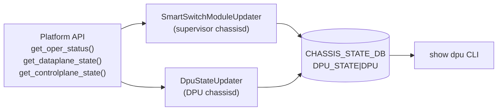

# DPU_STATE テーブル (CHASSIS_STATE_DB)

## 概要

`DPU_STATE` テーブルは `CHASSIS_STATE_DB` (Redis DB ID=13) に格納される **状態専用テーブル**。CONFIG_DB の設定テーブルとは異なり、SmartSwitch 上の `chassisd` デーモンが運用状態を **push 型** で書き込む。

書き込み元は 2 コンポーネント:

| 書き込み元 | 役割 |
|-----------|------|
| `SmartSwitchModuleUpdater` | supervisor 側。midplane リンク状態 (`dpu_midplane_link_*`) を管理 |
| `DpuStateUpdater` | DPU 側 (line card 上の chassisd)。データプレーン / コントロールプレーン状態を管理 |

`show dpu` CLI (`sonic-utilities/show/system_health.py:show_dpu_state()`) がこのテーブルを読み取り、DPU ごとの運用状態 (`Online` / `Partial Online` / `Offline`) を表示する[^1]。

<!-- cdb-mermaid -->
### データフロー (自動生成)



!!! note "凡例"
    CHASSIS_STATE_DB は CONFIG_DB ではなく Redis DB ID=13。`sonic-db-cli CHASSIS_STATE_DB` でアクセスする。
<!-- /cdb-mermaid -->

## key 構造

```text
DPU_STATE|DPU<N>
```

| キー | 型 | 説明 |
|------|----|------|
| `DPU<N>` | string | DPU 識別子 (例: `DPU0`, `DPU1`) |

`N` は `chassis.get_dpu_id()` が返す DPU ID (0 始まり整数)。

## フィールド

| フィールド | 型 | デフォルト / fallback | 書き込み元 | 説明 |
|-----------|----|----------------------|-----------|------|
| `dpu_midplane_link_state` | `up`/`down` | 起動時: oper_status が ONLINE → `'up'`、それ以外 → `'down'` | `SmartSwitchModuleUpdater` | DPU の midplane リンク状態 |
| `dpu_midplane_link_reason` | string | `""` (常に空文字列) | `SmartSwitchModuleUpdater` | midplane down 理由 (実装上は常に空) |
| `dpu_midplane_link_time` | string | `get_formatted_time()` 現在時刻 | `SmartSwitchModuleUpdater` | midplane 状態変化時刻 |
| `dpu_control_plane_state` | `up`/`down` | midplane `'down'` 時: `'down'`; それ以外: platform API / SYSTEM_READY 参照 | `DpuStateUpdater` / `SmartSwitchModuleUpdater` | DPU コントロールプレーン状態 |
| `dpu_control_plane_time` | string | `get_formatted_time()` 現在時刻 (状態変化時のみ) | `DpuStateUpdater` | コントロールプレーン状態変化時刻 |
| `dpu_data_plane_state` | `up`/`down` | midplane `'down'` 時: `'down'`; それ以外: platform API / 全ポート oper_status 参照 | `DpuStateUpdater` / `SmartSwitchModuleUpdater` | DPU データプレーン状態 |
| `dpu_data_plane_time` | string | `get_formatted_time()` 現在時刻 (状態変化時のみ) | `DpuStateUpdater` | データプレーン状態変化時刻 |

## 制約

- このテーブルは CONFIG_DB ではなく `CHASSIS_STATE_DB` (DB ID=13) に存在する
- SmartSwitch 専用テーブル。モジュラーチャシス (VOQ 構成) では存在しない
- YANG モデルは存在しない (STATE_DB は YANG の管轄外)

<!-- defaults -->
## フィールド暗黙デフォルト (Phase A — コード由来)

このテーブルは YANG `default` 文を持たない STATE_DB テーブル。以下はコードから読み取ったデフォルト / fallback の調査結果。

### 起動時初期化 (`set_initial_dpu_admin_state`)

```python
# chassisd:1387-1391
if operational_state == ModuleBase.MODULE_STATUS_ONLINE:
    op_state = 'up'
else:
    op_state = 'down'
self.module_updater.update_dpu_state(dpu_state_key, op_state)
```

- platform API が `NotImplementedError` → `try_get()` が `MODULE_STATUS_OFFLINE` を返すため `op_state = 'down'`
- `update_dpu_state(key, 'down')` は `dpu_midplane_link_state`, `dpu_control_plane_state`, `dpu_data_plane_state` を **同時に `'down'`** に設定 (chassisd:882-884)
- `update_dpu_state(key, 'up')` は `dpu_midplane_link_state` のみ更新し、CP/DP state は `DpuStateUpdater` が後から書き込む

### フィールド別デフォルト詳細

| フィールド | YANG default | コード由来デフォルト | 備考 |
|-----------|-------------|-------------------|------|
| `dpu_midplane_link_state` | なし | 起動時は oper_status 依存; ポーリング時は midplane 到達性依存 | `chassisd:1387-1391`, `1102-1105` |
| `dpu_midplane_link_reason` | なし | `""` (常に空) | `chassisd:878` — platform API 設計上の制約 |
| `dpu_midplane_link_time` | なし | `get_formatted_time()` — `"%a %b %d %I:%M:%S %p UTC %Y"` | 例: `"Wed May 14 10:30:45 AM UTC 2026"` |
| `dpu_control_plane_state` | なし | midplane `'down'` 設定時: `'down'`; DpuStateUpdater: `SYSTEM_READY.Status` 参照 | `chassisd:882-884`, `1277-1284` |
| `dpu_control_plane_time` | なし | `get_formatted_time()` 現在時刻 (CP state 変化時のみ更新) | SmartSwitchModuleUpdater による `'down'` 書き込み時は更新されない |
| `dpu_data_plane_state` | なし | midplane `'down'` 設定時: `'down'`; DpuStateUpdater: 全 PORT oper_status 参照 | `chassisd:882-884`, `1267-1275` |
| `dpu_data_plane_time` | なし | `get_formatted_time()` 現在時刻 (DP state 変化時のみ更新) | SmartSwitchModuleUpdater による `'down'` 書き込み時は更新されない |

### 状態変化条件

`DpuStateUpdater.update_state()` (chassisd:1303-1316) は **前回値と比較して変化した場合のみ** DB に書き込む:

```python
# chassisd:1306-1315
_, dp_prev_state = self.dpu_state_table.hget(self.name, DP_STATE)
if dp_current_state != dp_prev_state:
    self._update_dp_dpu_state(dp_current_state)  # state + time を更新

_, cp_prev_state = self.dpu_state_table.hget(self.name, CP_STATE)
if cp_current_state != cp_prev_state:
    self._update_cp_dpu_state(cp_current_state)  # state + time を更新
```

状態が変化しない場合は `*_time` フィールドも更新されない。

### chassisd 停止時 (`deinit`)

```python
# chassisd:1318-1320
def deinit(self):
    self._update_dp_dpu_state('down')
    self._update_cp_dpu_state('down')
```

`DpuStateUpdater.deinit()` は `dpu_data_plane_state` と `dpu_control_plane_state` を強制的に `'down'` にする。`dpu_midplane_link_state` は変更しない。

### コントロールプレーン / データプレーン状態の fallback

platform API が `NotImplementedError` を返す場合 (プラットフォーム側が未実装):

| 状態 | Fallback ロジック | コード |
|------|----------------|--------|
| `dpu_control_plane_state` | `STATE_DB SYSTEM_READY\|SYSTEM_STATE.Status == 'up'` なら `True` (= `'up'`) | `chassisd:1277-1284` |
| `dpu_data_plane_state` | CONFIG_DB `PORT` テーブルの全ポート `PORT_TABLE.oper_status == 'up'` なら `True` | `chassisd:1267-1275` |

### oper-status 算出 (show dpu)

```python
# system_health.py:190-204
if midplanedown:        oper_status = "Offline"
elif up_cnt == 3:       oper_status = "Online"
else:                   oper_status = "Partial Online"
```

| 条件 | show dpu 表示 |
|------|-------------|
| `dpu_midplane_link_state == 'down'` | `Offline` |
| 3 フィールド全て `'up'` | `Online` |
| midplane `'up'` で CP/DP いずれか `'down'` | `Partial Online` |
<!-- /defaults -->

## 購読者

- `chassisd` (`SmartSwitchModuleUpdater` / `DpuStateUpdater`) — 書き込み元
- `DpuStateManagerTask` — `SubscriberStateTable` で DPU_STATE 変化を検知し、CP/DP 状態の再評価をトリガー (chassisd:1482)
- `show dpu` CLI (`sonic-utilities/show/system_health.py`) — 読み取り専用。oper-status を算出して表示

## 関連 CONFIG_DB / YANG / CLI

- 関連 [CONFIG_DB](../../reference/glossary.md#term-config_db): [`DPU`](dpu.md) — DPU の設定 (admin state, IP, ポート番号)
- 関連 [CONFIG_DB](../../reference/glossary.md#term-config_db): [`CHASSIS_MODULE`](chassis-module.md) — モジュール管理状態
- 関連 STATE_DB: [`CHASSIS_STATE_DB 概要`](chassis-state.md) — CHASSIS_STATE_DB 全テーブルの一覧
- 関連 CLI: `show dpu`

## 引用元

[^1]: `chassisd` ソース: `sonic-platform-daemons/sonic-chassisd/scripts/chassisd` — `SmartSwitchModuleUpdater.update_dpu_state` (line 864-891)、`DpuStateUpdater` クラス (line 1234-1320)、`set_initial_dpu_admin_state` (line 1364-1405)、定数定義 (line 108-111)。`show dpu` CLI: `sonic-utilities/show/system_health.py:show_dpu_state` (line 172-222)。
