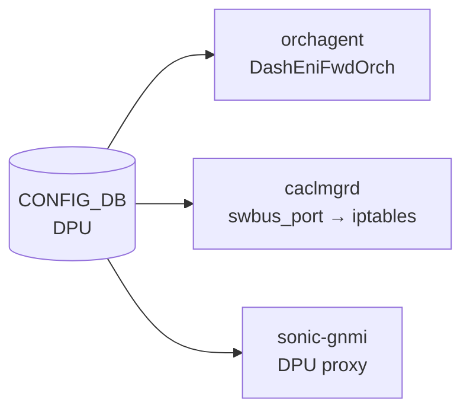

# DPU テーブル

## 概要

`DPU` テーブルは SmartSwitch プラットフォームにおける物理 DPU (Data Processing Unit) の設定情報を [CONFIG_DB](../../reference/glossary.md#term-config_db) に保持する[^1]。
エントリは `platform.json` から `sonic-config-engine/smartswitch_config.py` 経由で書き込まれ、minigraph 由来の IP アドレスとサービスポートを含む。

`orchagent` の `DashEniFwdOrch` が DPU エントリを読み取り ENI フォワーディングを制御する。
`caclmgrd` は `swbus_port` を参照して iptables ルールを生成し、`sonic-gnmi` proxy は `gnmi_port` を用いて DPU への gNMI 接続を確立する。

<!-- cdb-mermaid -->
### データフロー (自動生成)



!!! note "凡例"
    CONFIG_DB から各コンシューマまでの典型経路。詳細・例外は本ページ本文を参照。
<!-- /cdb-mermaid -->

## key 構造

```text
DPU|<dpu_name>
```

| キー | 型 | 説明 |
|------|----|------|
| `dpu_name` | string (1..255, pattern `[a-zA-Z0-9_-]+[0-9]`) | DPU 識別名（例: `str-8102-t1-dpu0`） |

## フィールド

| フィールド | 型 | デフォルト | 説明 |
|-----------|----|-----------|------|
| `state` | enum (`up`/`down`) | — | DPU の admin state |
| `local_port` | string (interface_name) | — | スイッチ上の物理 DPU ポート名 (例: `Ethernet228`) |
| `vip_ipv4` | ipv4-address | — | VIP IPv4 アドレス (minigraph 由来) |
| `vip_ipv6` | ipv6-address | — | VIP IPv6 アドレス (minigraph 由来) |
| `pa_ipv4` | ipv4-address | — | PA (Physical Address) IPv4 (minigraph 由来) |
| `pa_ipv6` | ipv6-address | — | PA IPv6 (minigraph 由来) |
| `midplane_ipv4` | ipv4-address | — | Midplane IPv4 アドレス (minigraph 由来; link-local 帯域が多い) |
| `dpu_id` | string (pattern `[0-7]`) | — | DPU ID (minigraph 由来; 0〜7 の 1 桁) |
| `vdpu_id` | string (1..255) | — | VDPU GUID (minigraph 由来; `VDPU` テーブルへの論理参照) |
| `gnmi_port` | port-number | — (proxy fallback: `50052`) | DPU 上の gNMI サービス TCP ポート |
| `orchagent_zmq_port` | port-number | — (典型値: `5555`) | DPU orchagent の ZMQ サービス TCP ポート |
| `swbus_port` | port-number | — (Convention: `23606 + dpu_id`) | DPU swbus サービス TCP ポート |

## 制約

- `dpu_name` の pattern: `[a-zA-Z0-9_-]+[0-9]` (末尾は数字)
- `dpu_id` の pattern: `[0-7]` (0 から 7 の 1 桁の整数のみ)
- `swbus_port` の Convention: `23606 + dpu_id`（例: dpu_id=0 → 23606, dpu_id=1 → 23607）[^1]
- `orchagent_zmq_port` / `gnmi_port` は `inet:port-number` (1–65535)

## 購読者

- `orchagent` (`DashEniFwdOrch`): `state` / `pa_ipv4` を必須フィールドとして読み取り、ENI フォワーディングルールを生成
- `caclmgrd` (`sonic-host-services`): `swbus_port` を読み取って iptables / ip6tables で DPU-to-DPU swbus 通信を許可; フィールド欠如時はその DPU config を無視
- `sonic-gnmi` DPU proxy (`dpuproxy/resolver.go`): `gnmi_port` を読み取り DPU gNMI 接続先を決定; 欠如時は `50052` にフォールバック
- `reboot_smartswitch_helper` (`sonic-utilities`): `gnmi_port` を参照して DPU リブート前の gNMI 接続確認を実施

## 関連 CONFIG_DB / YANG / CLI

- 関連 [CONFIG_DB](../../reference/glossary.md#term-config_db): `DPUS`, `REMOTE_DPU`, `VDPU`, `DASH_HA_GLOBAL_CONFIG`
- 関連 [YANG](../../reference/glossary.md#term-yang): `sonic-smart-switch`

<!-- defaults -->
## フィールド暗黙デフォルト (Phase A — コード由来)

YANG `default` 文はいずれのフィールドにも存在しない。以下はコード読み取り側の暗黙 fallback をまとめた調査結果。

| フィールド | YANG default | コード由来デフォルト | 必須扱い | fallback 源 |
|-----------|-------------|-------------------|---------|------------|
| `state` | なし | なし | 実質必須 | `dashenifwdorch.h` `dpu_table_desc` required_attributes; 欠如時 request reject |
| `local_port` | なし | なし | 推奨 | プラットフォーム固有値; orchagent では直接参照なし |
| `vip_ipv4` | なし | なし | 任意 | `EniFwdCtxBase::getVip()` が参照; 欠如時は VIP なしとして動作 |
| `vip_ipv6` | なし | なし | 任意 | IPv6 不使用環境では省略可 |
| `pa_ipv4` | なし | なし | 実質必須 | `dpu_table_desc` required_attributes — `dashenifwdorch.h:136` |
| `pa_ipv6` | なし | なし | 任意 | IPv6 不使用時は省略可 |
| `midplane_ipv4` | なし | なし | 任意 | 2025-08-18 revision 追加; `container_checker` は `DPUS.midplane_interface` を参照 |
| `dpu_id` | なし | なし | 推奨 | minigraph 由来; VDPU 照合に使用 |
| `vdpu_id` | なし | なし | 任意 | `VDPU` テーブルへの論理参照 |
| `gnmi_port` | なし | `"50052"` (proxy fallback) | 推奨 | `sonic-gnmi/pkg/interceptors/dpuproxy/resolver.go:99` — 欠如時 `DefaultGNMIPort = "50052"` を使用 |
| `orchagent_zmq_port` | なし | なし (HLD 典型値 `5555`) | 推奨 | フォールバック値なし; ZMQ 接続失敗で orchagent 機能停止の可能性 |
| `swbus_port` | なし | なし (Convention: `23606 + dpu_id`) | 推奨 | `caclmgrd:1100` — 欠如時 `"Received DPU configuration without swbus_port. Ignore it."` を出力して処理スキップ |

### 補足

- **gnmi_port**: `sonic-gnmi` DPU proxy は DB 欠如時に `"50052"` を試み、さらに `["8080", "50052"]` の順で試行する (`resolver.go:103–110`)。HLD (`smart-switch-ha-detailed-design.md:337`) の記載典型値は `50051` であり、sample_config_db.json の実例値 `50052` と一致しない。実際の DPU サービスが listen するポートと一致させることが必要。

- **orchagent_zmq_port**: HLD 典型値 `5555`、sample_config_db.json では `50` (テスト値)。コード側に fallback なし。

- **swbus_port**: `caclmgrd` はフィールド欠如時に当該 DPU の iptables ルール生成を完全スキップする。Convention として `23606 + dpu_id` が使われるが、YANG に強制はない。

<!-- /defaults -->

<!-- ordering -->
## 書込み順依存 (Phase B)

`DPU` テーブルは SmartSwitch 起動シーケンスの基点となる。orchagent / caclmgrd / sonic-gnmi / chassisd が参照するため、書き込みタイミングが各コンポーネントの初期化に影響する。

### 検出された順序依存

| # | 依存関係 | 方向 | 緩和策 |
|---|----------|------|--------|
| 1 | `DPU` テーブル書き込み → chassisd 起動 / `CHASSIS_MODULE` 設定 | **DPU 先行推奨** | 逆順時は chassisd 起動時に DPU 情報が不完全になる可能性 |
| 2 | `DPU.state` + `DPU.pa_ipv4` の同時書き込み → orchagent ENI ルール生成 | **同時書き込み必須** | 欠如フィールドがあると orchagent が request reject |
| 3 | `DPU.swbus_port` 存在 → caclmgrd iptables ルール生成 | **書き込み時に同時に含める必要** | 欠如時は当該 DPU を完全スキップ（iptables ルールなし） |
| 4 | `DPU.gnmi_port` → sonic-gnmi DPU proxy 接続先決定 | 任意（フォールバックあり） | 欠如時は `50052` を試行; ポート不一致で接続失敗 |
| 5 | `DPU` テーブル ↔ CHASSIS_APP_DB | **連携なし** | SmartSwitch と VOQ 構成は独立した DB セット |

### 主要な制約詳細

**orchagent 必須フィールドの同時書き込み (依存 #2)**: `DashEniFwdOrch` の `dpu_table_desc.required_attributes` に `state` と `pa_ipv4` が含まれる。これらのフィールドが欠如した状態で `DPU` エントリが書き込まれると、ENI フォワーディングルールが生成されない。`DPU` エントリは `state`、`pa_ipv4` を含む完全な状態で一度に書き込むこと（evidence: `sonic-swss/orchagent/dash/dashenifwdorch.h:134-137`）。

**caclmgrd の swbus_port チェック (依存 #3)**: `caclmgrd` は `swbus_port` フィールドが存在しない場合、`"Received DPU configuration without swbus_port. Ignore it."` を出力して当該 DPU 設定を**完全スキップ**する。DPU-to-DPU swbus 通信のための iptables ルールが生成されないため、SmartSwitch 環境では `swbus_port` を必ず含めること（evidence: `sonic-host-services/scripts/caclmgrd:~1100`）。

**CHASSIS_APP_DB との非連携 (依存 #5)**: SmartSwitch DPU テーブルは CONFIG_DB にのみ存在する。CHASSIS_APP_DB (`redis_chassis.server:6380`) は VOQ 構成のラインカード間 `SYSTEM_NEIGH` / `SYSTEM_LAG` 共有に使用されるが、SmartSwitch の `SmartSwitchModuleUpdater` はこれを使用しない（evidence: `chassisd:688-862`）。

<!-- /ordering -->

<!-- cross-refs -->
## 暗黙参照テーブル (Phase C)

`DPU` テーブルは SmartSwitch 固有の CONFIG_DB テーブルとして他の複数テーブルと暗黙依存関係を持つ。
YANG `leafref` による明示的な参照は持たないが、orchagent / chassisd / monit の実行時コードが
以下のテーブルを連携して参照する。

| 依存方向 | 参照元フィールド / 参照元 | 参照先テーブル | 参照先キー形式 | 依存内容 | 証跡 |
|---------|------------------------|--------------|--------------|---------|------|
| 制御依存（被制御） | `CHASSIS_MODULE.admin_status` | `CHASSIS_MODULE`（被参照） | `CHASSIS_MODULE\|DPU<n>` | `chassisd` の `SmartSwitchConfigManagerTask` が `CHASSIS_MODULE` テーブルを購読。`admin_status=down` 書き込みで DPU のシャットダウン処理を起動する。YANG の key pattern `DPU[0-9]+` により `DPU0`〜`DPU7` が合法。`DPU.state` フィールドとは独立して動作する | `chassisd:1196-1228,235-256`, `sonic-chassis-module.yang:23` |
| 条件依存（起動ゲート） | `DEVICE_METADATA.localhost.subtype` | `DEVICE_METADATA` | `DEVICE_METADATA\|localhost` | `orchagent/main.cpp:269` が `subtype` フィールドを読み取り `gMySwitchSubType` に格納。`gMySwitchSubType == "SmartSwitch"` のときのみ `DashEniFwdOrch`（`DPU` テーブル購読者）が初期化される。この条件が満たされない環境では `DPU` テーブルへの書き込みが ENI ルール生成に繋がらない | `orchagent/main.cpp:269`, `orchdaemon.cpp:613-618`, `sonic-device_metadata.yang:191` |
| 分業参照（姉妹テーブル） | `container_checker` / `sonic-dpu-mgmt-traffic.sh` | `DPUS` | `DPUS\|<dpu_name>` | コンテナ監視（`container_checker`）は `DPUS` テーブルから DPU 名を取得して `databasedpu<n>` コンテナの必須起動判定を行う。`DPU` テーブルとは役割分担があり、`DPUS` は物理インタフェース（`midplane_interface`）情報を保持する | `container_checker:117-121`, `sonic-dpu-mgmt-traffic.sh:111,145`, `sonic-smart-switch.yang:81-106` |
| 連携参照（ENI 解決チェーン） | `DashEniFwdOrch` 初期化時の一括取得 | `REMOTE_DPU`, `VDPU` | `REMOTE_DPU\|<name>`, `VDPU\|<name>` | `dashenifwdorch.cpp:215-344` が `DPU`・`REMOTE_DPU`・`VDPU` を HA 準備完了時に一括取得。`VDPU.main_dpu_ids` フィールドが DPU 識別子リストを持ち、ENI→VDPU→DPU の名前解決チェーンを形成する。`VDPU` の `main_dpu_ids` に不正な DPU 名があると `WARN` ログが出力される | `dashenifwdorch.cpp:215-344`, `dashenifwdorch.h:63-65,80` |

### 依存解決タイミング

- **CHASSIS_MODULE → DPU 制御**: `chassisd` の `SmartSwitchConfigManagerTask` がリアルタイムに
  `CHASSIS_MODULE` の変化を購読。`admin_status` 変化のたびに DPU の admin state が更新される。
- **DEVICE_METADATA.subtype → DashEniFwdOrch 起動**: `orchagent` 起動時（`main.cpp:269`）に一度だけ読み取る。
  実行時の変化は反映されない（orchagent 再起動が必要）。
- **DPUS 参照**: `container_checker` は monit が定期実行するたびに `DPUS` テーブルを参照する。
  `DPU` テーブルと `DPUS` テーブルは別々に書き込まれるが、SmartSwitch では両方の整合が必要。
- **REMOTE_DPU / VDPU の一括読み込み**: HA セッション確立前に一括読み込みが行われる。
  `DPU`・`REMOTE_DPU`・`VDPU` が揃っていない状態での HA 初期化は `WARN` ログを伴う不完全な状態になる。
<!-- /cross-refs -->

<!-- failure -->
## 失敗挙動マトリクス (Phase D)

ソース: `sonic-net/sonic-swss/orchagent/dash/dashenifwdorch.cpp`, `dashenifwdorch.h`,
`sonic-net/sonic-host-services/scripts/caclmgrd`, `sonic-net/sonic-gnmi/pkg/interceptors/dpuproxy/resolver.go`

### SET / 初期化における失敗経路

| # | 失敗条件 | コンポーネント | 結果 | ログレベル | evidence |
|---|----------|--------------|------|-----------|---------|
| 1 | `state` / `pa_ipv4` のいずれかが欠如した `DPU` エントリ書き込み | `orchagent` (`DashEniFwdOrch`) | request reject、ENI フォワーディングルール未生成 | (Orch2 フレームワーク内部) | `dashenifwdorch.h:129-137` |
| 2 | `DPU.state = "down"` | `orchagent` (`DpuRegistry`) | DpuRegistry に未登録、ENI→DPU 名前解決不可 | INFO (`"Skipping LOCAL DPU %s as its state is down"`) | `dashenifwdorch.cpp:244-251` |
| 3 | 個別エントリ parse 例外 | `orchagent` (`DpuRegistry`) | 当該エントリをスキップ・orchagent 処理は継続 | ERROR (`"Failed to parse key:%s in the %s"`) | `dashenifwdorch.cpp:262-265` |
| 4 | `VDPU.main_dpu_ids` に不正な DPU 名 | `orchagent` (`DpuRegistry`) | ENI→VDPU→DPU 解決失敗、WARN 出力、orchagent 継続 | WARN (`"Invalid DPU ID: %s, not found in DPU/REMOTE_DPU table"`) | `dashenifwdorch.cpp:338` |
| 5 | `VIP_TABLE` エントリ不在（DPU フォワーディング初期化時） | `orchagent` | `SWSS_LOG_THROW` → orchagent クラッシュ + supervisord 再起動 | CRIT (THROW) | `dashenifwdorch.cpp:502` |
| 6 | `swbus_port` フィールド欠如 | `caclmgrd` | iptables ルール未生成、DPU-to-DPU swbus 通信が DROP される可能性 | INFO (`"Received DPU configuration without swbus_port. Ignore it."`) | `caclmgrd:1096-1100` |
| 7 | iptables コマンド実行失敗 | `caclmgrd` | 部分的なルール未適用、処理は継続（再試行なし） | ERROR (`"Error running command"`) | `caclmgrd:221, 226-238` |
| 8 | DPU が `CHASSIS_MIDPLANE_TABLE` (STATE_DB) に不在 | `sonic-gnmi` DPU proxy | gNMI request が `NotFound` エラー | (gRPC ERROR) | `resolver.go:74-76` |
| 9 | STATE_DB に `ip_address` フィールドなし | `sonic-gnmi` DPU proxy | gNMI request が `NotFound` エラー | (gRPC ERROR) | `resolver.go:80-83` |
| 10 | `gnmi_port` フィールド欠如 (CONFIG_DB) | `sonic-gnmi` DPU proxy | `DefaultGNMIPort = "50052"` を使用（非エラー）; ポート不一致時のみ接続失敗 | なし | `resolver.go:97-100` |

### DEL における挙動

| 失敗条件 | 検出箇所 | 結果 | evidence |
|----------|----------|------|---------|
| `DPU` エントリ DEL — `caclmgrd` 側 | `update_dash_ha_rules()` `op == "DEL"` | `dashHaPortMap` にエントリがあれば `remove_dash_ha_rules()` で iptables ルール削除。なければ即 return | `caclmgrd:1083-1090` |
| `DPU` エントリ DEL — orchagent 側 | `DpuRegistry` は起動時一括読み込みのみ | runtime の DEL イベントは orchagent に購読されていない。orchagent は再起動時のみ DPU テーブルを再読込 | `dashenifwdorch.cpp:212-220` |

### 補足

- **required_attributes (依存 #1)**: `dpu_table_desc` の `required_attributes` リスト `{ DashEniFwd::STATE, DashEniFwd::PA_V4 }` (`dashenifwdorch.h:136`) により、これらのフィールドが欠如した SET は Orch2 フレームワークが reject する。reject されたエントリは pending state に留まらず、単純に処理されない。フィールドを補完した後に SET を再送することで解消できる。
- **state=down の影響範囲 (依存 #2)**: `DpuRegistry::processDpuTable()` は起動時の一括処理であるため、runtime 中の `state` フィールド更新は orchagent の内部マップには反映されない。`state = "up"` に修正した場合、orchagent の再起動または HA 再初期化が必要。
- **VIP_TABLE 依存 (依存 #5)**: `VIP_TABLE` は `DPU` テーブルとは独立したテーブルだが、`DashEniFwdOrch` の ENI 処理経路で参照される。SmartSwitch では `platform.json` 経由で VIP が事前設定されることが期待されており、欠如は設定ミスを意味する。
- **iptables 部分失敗 (依存 #7)**: `run_commands()` は失敗したコマンドのエラーをログ出力して次コマンドに進むため、iptables / ip6tables のどちらか片方のみルールが適用される部分的な状態が起こりうる。

詳細調査ノートは `meta/_intermediate/cdb-flow/dpu-failure.md` を参照。
<!-- /failure -->

<!-- constants -->
## ハードコード定数 (Phase E)

> 調査証跡: `meta/_intermediate/cdb-flow/dpu-constants.md`

### テーブル名・フィールド名定数 (`dashenifwdorch.h` — `DashEniFwd` 名前空間)

| 定数名 | 値 | 行 |
|--------|-----|-----|
| `DPU_TABLE` | `"DPU"` | `dashenifwdorch.h:63` |
| `REMOTE_DPU_TABLE` | `"REMOTE_DPU"` | `dashenifwdorch.h:64` |
| `VDPU_TABLE` | `"VDPU"` | `dashenifwdorch.h:65` |
| `VIP_TABLE` | `"VIP_TABLE"` | `dashenifwdorch.h:66` |
| `STATE` | `"state"` | `dashenifwdorch.h:75` |
| `PA_V4` | `"pa_ipv4"` | `dashenifwdorch.h:76` |
| `PA_V6` | `"pa_ipv6"` | `dashenifwdorch.h:77` |
| `NPU_V4` | `"npu_ipv4"` | `dashenifwdorch.h:78` |
| `NPU_V6` | `"npu_ipv6"` | `dashenifwdorch.h:79` |
| `DPU_IDS` | `"main_dpu_ids"` | `dashenifwdorch.h:80` |
| `VDPU_IDS` | `"vdpu_ids"` | `dashenifwdorch.h:71` |
| `PRIMARY` | `"primary_vdpu"` | `dashenifwdorch.h:72` |

`dpu_table_desc.required_attributes = { STATE, PA_V4 }` — この 2 フィールドが欠如した `DPU` SET は Orch2 フレームワークが reject する (`dashenifwdorch.h:129-137`)。

### caclmgrd テーブル名・フィールド定数

| 定数名 | 値 | 行 |
|--------|-----|-----|
| `DPU_TABLE` | `"DPU"` | `caclmgrd:90` |
| swbus_port フィールド文字列 | `"swbus_port"` | `caclmgrd:1096` |

### sonic-gnmi `dpuproxy/resolver.go` 接続定数

| 定数名 | 値 | 説明 | 行 |
|--------|-----|------|-----|
| `StateDB` | `6` | Redis DB インデックス (STATE_DB) | `resolver.go:10` |
| `ConfigDB` | `4` | Redis DB インデックス (CONFIG_DB) | `resolver.go:13` |
| `ChassisMidplaneTablePrefix` | `"CHASSIS_MIDPLANE_TABLE\|DPU"` | STATE_DB の DPU 状態キープレフィックス | `resolver.go:22` |
| `DPUConfigTablePrefix` | `"DPU\|dpu"` | CONFIG_DB の DPU 設定キープレフィックス | `resolver.go:25` |
| `DefaultGNMIPort` | `"50052"` | `gnmi_port` 欠如時の gNMI ポート fallback | `resolver.go:19` |
| `commonGNMIPorts` | `["8080", "50052"]` | 設定ポートに続いて試行するフォールバックポートリスト | `resolver.go:104` |

### YANG 型制約一覧

| フィールド | YANG 型 | パターン / 制約 |
|-----------|---------|----------------|
| `dpu_name` | `string` | pattern `[a-zA-Z0-9_-]+[0-9]`, length 1..255 |
| `state` | `stypes:admin_status` | enum: `up` / `down` (sonic-types.yang) |
| `local_port` | `stypes:interface_name` | interface_name 型 |
| `vip_ipv4` / `pa_ipv4` / `midplane_ipv4` | `inet:ipv4-address` | RFC 準拠 IPv4 アドレス |
| `vip_ipv6` / `pa_ipv6` | `inet:ipv6-address` | RFC 準拠 IPv6 アドレス |
| `dpu_id` | `string` | pattern `[0-7]`（1 文字、0〜7 のみ） |
| `vdpu_id` | `string` | length 1..255 |
| `gnmi_port` / `orchagent_zmq_port` / `swbus_port` | `inet:port-number` | 1–65535 |

### 慣例値（YANG 強制なし）

| フィールド | 慣例値 | 根拠 |
|-----------|--------|------|
| `swbus_port` | `23606 + dpu_id` | YANG コメント・HLD 記載。YANG では強制されない |
| `orchagent_zmq_port` | `5555` | HLD 典型値。コード側に fallback なし |
| `gnmi_port` | `50052` | `resolver.go` `DefaultGNMIPort`。HLD 記載典型値 `50051` とは不一致 |

<!-- /constants -->

<!-- side-effects -->
## 副作用 (Phase F)

> 調査証跡: `meta/_intermediate/cdb-flow/dpu-side-effects.md`

`DPU` テーブルへの SET / DEL が発生したとき、各コンシューマが他テーブル・OS・ハードウェアに
対して行う副作用を示す。

| # | トリガ操作 | コンポーネント | 副作用先 | 副作用内容 | 証跡 |
|---|------------|--------------|---------|-----------|------|
| 1 | 起動時 `DPU` SET (populate) | orchagent `DpuRegistry` | ヒープ (`dpus_name_map_`) | DPU 名 → `{ type=LOCAL, pa_v4 }` を内部マップに登録。runtime 変更は反映されない（orchagent 再起動が必要） | `dashenifwdorch.cpp:255-258` |
| 2 | `ENI` SET（初回）→ DPU 情報解決 | orchagent `EniFwdCtxBase` | APPL_DB `ACL_TABLE_TYPE\|ENI_REDIRECT` | ACL テーブルタイプを作成（matches: `dst_ip`, `inner_dst_mac`, `tunnel_term`） | `dashenifwdorch.cpp:603-625` |
| 3 | `ENI` SET（初回）→ DPU 情報解決 | orchagent `EniFwdCtxBase` | APPL_DB `ACL_TABLE\|ENI` | 外部物理/LAG ポートをバインドポートとして ACL テーブルを作成 | `dashenifwdorch.cpp:635-643` |
| 4 | `ENI` SET（ネクストホップ解決後）| orchagent `EniAclRule` | APPL_DB `ACL_RULE\|ENI:<vnet>:<mac>` | `redirect_action = DPU.pa_ipv4` の ACL ルールを set | `dashenifwdinfo.cpp:193-206` |
| 5 | `ENI` SET（LOCAL DPU 未解決時） | orchagent `LocalEniNH` | `NeighOrch` → ARP / SAI | DPU `pa_ipv4` に対する ARP 解決要求を発行。ARP 解決後コールバックで ACL ルール書き込み | `dashenifwdinfo.cpp:18-31` |
| 6 | `ENI` DEL（最後のルール削除） | orchagent `EniFwdCtxBase` | APPL_DB `ACL_TABLE\|ENI`, `ACL_TABLE_TYPE\|ENI_REDIRECT` | ACL テーブル・テーブルタイプを APPL_DB から削除 | `dashenifwdorch.cpp:646-650` |
| 7 | `DPU` SET（`swbus_port` あり、`dash-ha` feature 有効） | caclmgrd | Linux iptables / ip6tables | `INPUT` チェーン位置 2 に `tcp dport <swbus_port> ACCEPT` を挿入（IPv4 + IPv6） | `caclmgrd:1073-1079` |
| 8 | `DPU` DEL（`swbus_port` 既登録） | caclmgrd | Linux iptables / ip6tables | 対応 `swbus_port` の ACCEPT ルールを削除 | `caclmgrd:1083-1090` |
| 9 | `DPU` SET（`swbus_port` 値変更） | caclmgrd | Linux iptables / ip6tables | 旧ポートルール削除 → 新ポートルール挿入（アトミックではない） | `caclmgrd:1104-1108` |

### ガード条件

- **副作用 #7-#9**: `FEATURE` テーブルに `"dash-ha"` キーが存在する場合のみ実行される (`caclmgrd:1265`)。
  `dash-ha` feature が無効のとき `DPU` テーブルへの変化は iptables に影響しない。
- **副作用 #7**: `swbus_port` フィールドが欠如した SET は iptables 操作なし（INFO ログのみ出力）。
- **副作用 #1-#6**: `DPU.state = "down"` のエントリは DpuRegistry に未登録となり、
  ENI フォワーディングの ACL ルール生成に使用されない。

### runtime 変更の非対称性

orchagent は `DPU` テーブルを起動時に一括読み込み（`DpuRegistry::populate()`）し、
**runtime の DPU SET/DEL イベントは orchagent には届かない**（副作用 #1）。
一方 caclmgrd は `SubscriberStateTable` で常時購読しており runtime 変更を即時反映する（副作用 #7-#9）。

DPU の設定変更（`state` / `pa_ipv4` 等）を orchagent に反映させるには
`swss` コンテナの再起動が必要。`swbus_port` 変更は orchagent 不要、caclmgrd が即時対応する。
<!-- /side-effects -->

<!-- pubsub -->
## 通信メカニズム (Phase G — subscribe 経路)

CONFIG_DB `DPU` テーブルへの runtime subscribe を行うコンシューマは **`caclmgrd` のみ**。他の購読者は起動時の一括読み込みまたは都度参照を行う。

### メカニズム分類

| # | コンシューマ | subscribe API | 購読テーブル | 備考 |
|---|------------|--------------|------------|------|
| 1 | `caclmgrd` | `SubscriberStateTable` (Python swsscommon) | CONFIG_DB `DPU` | runtime 購読; `"dash-ha"` feature 有効時のみ副作用あり |
| 2 | `DashEniFwdOrch` (orchagent) | なし (起動時 `swss::Table` HGETALL のみ) | — | `DPU` テーブルへの subscribe は行わない |
| 3 | sonic-gnmi DPU proxy | なし (gRPC リクエスト都度 `HGetAll`) | — | subscribe 不使用 |

### caclmgrd — `SubscriberStateTable` 詳細

- **API**: `subscribe_dpu_table = swsscommon.SubscriberStateTable(config_db_connector, "DPU")` / `sel.addSelectable(subscribe_dpu_table)` (`caclmgrd:1163-1164`)
- **購読方式**: `swsscommon.Select` に登録し 1 秒タイムアウトのポーリングループで受信。内部は Redis keyspace 通知 (`__keyspace@<db>__:DPU|*` の psubscribe に相当)
- **イベント粒度**: キー単位 (`key` = DPU 名, `op` = `SET`/`DEL`)。フィールド単位の通知は行われない。`fvs` は通知後に内部で HGETALL して取得したフィールドリスト
- **条件付き実行**: `if "dash-ha" in self.feature_present:` (`caclmgrd:1265`) — dash-ha feature が無効の環境では DPU イベントを受け取っても `update_dash_ha_rules()` を呼ばない
- **evidence**: `sonic-host-services/scripts/caclmgrd:1163-1164, 1262-1267, 1082-1110`

### DashEniFwdOrch (orchagent) — 起動時一括読み込み

- `DashEniFwdOrch` は `Orch2` フレームワークを通じて **APPL_DB の `APP_DASH_ENI_FORWARD_TABLE`** を購読し、CONFIG_DB `DPU` テーブルへの subscribe は行わない (`orchdaemon.cpp:615`)
- `DPU` テーブルの参照は `DpuRegistry::populate()` での `swss::Table::hgetall()` 呼び出しのみ（`dashenifwdorch.cpp:225`）。`swss::Table` は subscribe 型 API ではなく点呼型
- **実行時 DPU 変更の反映**: `swss` (orchagent) コンテナの再起動が必要

詳細スキャン手順と grep 結果は `meta/_intermediate/cdb-flow/dpu-pubsub.md` を参照。
<!-- /pubsub -->

## 引用元

[^1]: YANG 定義: `sonic-smart-switch.yang`. <https://github.com/sonic-net/sonic-buildimage/blob/9ea932ec2e18f35e58268ec2e4456b1d4afd65cd/src/sonic-yang-models/yang-models/sonic-smart-switch.yang>
