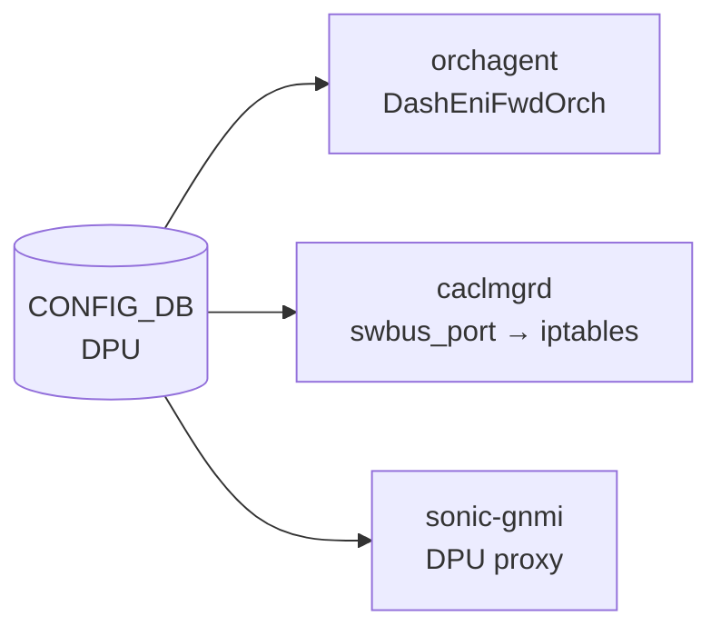

# DPU テーブル

## 概要

`DPU` テーブルは SmartSwitch プラットフォームにおける物理 DPU (Data Processing Unit) の設定情報を [CONFIG_DB](../../reference/glossary.md#term-config_db) に保持する[^1]。
エントリは `platform.json` から `sonic-config-engine/smartswitch_config.py` 経由で書き込まれ、minigraph 由来の IP アドレスとサービスポートを含む。

`orchagent` の `DashEniFwdOrch` が DPU エントリを読み取り ENI フォワーディングを制御する。
`caclmgrd` は `swbus_port` を参照して iptables ルールを生成し、`sonic-gnmi` proxy は `gnmi_port` を用いて DPU への gNMI 接続を確立する。

<!-- cdb-mermaid -->
### データフロー (自動生成)



!!! note "凡例"
    CONFIG_DB から各コンシューマまでの典型経路。詳細・例外は本ページ本文を参照。
<!-- /cdb-mermaid -->

## key 構造

```text
DPU|<dpu_name>
```

| キー | 型 | 説明 |
|------|----|------|
| `dpu_name` | string (1..255, pattern `[a-zA-Z0-9_-]+[0-9]`) | DPU 識別名（例: `str-8102-t1-dpu0`） |

## フィールド

| フィールド | 型 | デフォルト | 説明 |
|-----------|----|-----------|------|
| `state` | enum (`up`/`down`) | — | DPU の admin state |
| `local_port` | string (interface_name) | — | スイッチ上の物理 DPU ポート名 (例: `Ethernet228`) |
| `vip_ipv4` | ipv4-address | — | VIP IPv4 アドレス (minigraph 由来) |
| `vip_ipv6` | ipv6-address | — | VIP IPv6 アドレス (minigraph 由来) |
| `pa_ipv4` | ipv4-address | — | PA (Physical Address) IPv4 (minigraph 由来) |
| `pa_ipv6` | ipv6-address | — | PA IPv6 (minigraph 由来) |
| `midplane_ipv4` | ipv4-address | — | Midplane IPv4 アドレス (minigraph 由来; link-local 帯域が多い) |
| `dpu_id` | string (pattern `[0-7]`) | — | DPU ID (minigraph 由来; 0〜7 の 1 桁) |
| `vdpu_id` | string (1..255) | — | VDPU GUID (minigraph 由来; `VDPU` テーブルへの論理参照) |
| `gnmi_port` | port-number | — (proxy fallback: `50052`) | DPU 上の gNMI サービス TCP ポート |
| `orchagent_zmq_port` | port-number | — (典型値: `5555`) | DPU orchagent の ZMQ サービス TCP ポート |
| `swbus_port` | port-number | — (Convention: `23606 + dpu_id`) | DPU swbus サービス TCP ポート |

## 制約

- `dpu_name` の pattern: `[a-zA-Z0-9_-]+[0-9]` (末尾は数字)
- `dpu_id` の pattern: `[0-7]` (0 から 7 の 1 桁の整数のみ)
- `swbus_port` の Convention: `23606 + dpu_id`（例: dpu_id=0 → 23606, dpu_id=1 → 23607）[^1]
- `orchagent_zmq_port` / `gnmi_port` は `inet:port-number` (1–65535)

## 購読者

- `orchagent` (`DashEniFwdOrch`): `state` / `pa_ipv4` を必須フィールドとして読み取り、ENI フォワーディングルールを生成
- `caclmgrd` (`sonic-host-services`): `swbus_port` を読み取って iptables / ip6tables で DPU-to-DPU swbus 通信を許可; フィールド欠如時はその DPU config を無視
- `sonic-gnmi` DPU proxy (`dpuproxy/resolver.go`): `gnmi_port` を読み取り DPU gNMI 接続先を決定; 欠如時は `50052` にフォールバック
- `reboot_smartswitch_helper` (`sonic-utilities`): `gnmi_port` を参照して DPU リブート前の gNMI 接続確認を実施

## 関連 CONFIG_DB / YANG / CLI

- 関連 [CONFIG_DB](../../reference/glossary.md#term-config_db): `DPUS`, `REMOTE_DPU`, `VDPU`, `DASH_HA_GLOBAL_CONFIG`
- 関連 [YANG](../../reference/glossary.md#term-yang): `sonic-smart-switch`

<!-- defaults -->
## フィールド暗黙デフォルト (Phase A — コード由来)

YANG `default` 文はいずれのフィールドにも存在しない。以下はコード読み取り側の暗黙 fallback をまとめた調査結果。

| フィールド | YANG default | コード由来デフォルト | 必須扱い | fallback 源 |
|-----------|-------------|-------------------|---------|------------|
| `state` | なし | なし | 実質必須 | `dashenifwdorch.h` `dpu_table_desc` required_attributes; 欠如時 request reject |
| `local_port` | なし | なし | 推奨 | プラットフォーム固有値; orchagent では直接参照なし |
| `vip_ipv4` | なし | なし | 任意 | `EniFwdCtxBase::getVip()` が参照; 欠如時は VIP なしとして動作 |
| `vip_ipv6` | なし | なし | 任意 | IPv6 不使用環境では省略可 |
| `pa_ipv4` | なし | なし | 実質必須 | `dpu_table_desc` required_attributes — `dashenifwdorch.h:136` |
| `pa_ipv6` | なし | なし | 任意 | IPv6 不使用時は省略可 |
| `midplane_ipv4` | なし | なし | 任意 | 2025-08-18 revision 追加; `container_checker` は `DPUS.midplane_interface` を参照 |
| `dpu_id` | なし | なし | 推奨 | minigraph 由来; VDPU 照合に使用 |
| `vdpu_id` | なし | なし | 任意 | `VDPU` テーブルへの論理参照 |
| `gnmi_port` | なし | `"50052"` (proxy fallback) | 推奨 | `sonic-gnmi/pkg/interceptors/dpuproxy/resolver.go:99` — 欠如時 `DefaultGNMIPort = "50052"` を使用 |
| `orchagent_zmq_port` | なし | なし (HLD 典型値 `5555`) | 推奨 | フォールバック値なし; ZMQ 接続失敗で orchagent 機能停止の可能性 |
| `swbus_port` | なし | なし (Convention: `23606 + dpu_id`) | 推奨 | `caclmgrd:1100` — 欠如時 `"Received DPU configuration without swbus_port. Ignore it."` を出力して処理スキップ |

### 補足

- **gnmi_port**: `sonic-gnmi` DPU proxy は DB 欠如時に `"50052"` を試み、さらに `["8080", "50052"]` の順で試行する (`resolver.go:103–110`)。HLD (`smart-switch-ha-detailed-design.md:337`) の記載典型値は `50051` であり、sample_config_db.json の実例値 `50052` と一致しない。実際の DPU サービスが listen するポートと一致させることが必要。

- **orchagent_zmq_port**: HLD 典型値 `5555`、sample_config_db.json では `50` (テスト値)。コード側に fallback なし。

- **swbus_port**: `caclmgrd` はフィールド欠如時に当該 DPU の iptables ルール生成を完全スキップする。Convention として `23606 + dpu_id` が使われるが、YANG に強制はない。

<!-- /defaults -->

## 引用元

[^1]: YANG 定義: `sonic-smart-switch.yang`. <https://github.com/sonic-net/sonic-buildimage/blob/9ea932ec2e18f35e58268ec2e4456b1d4afd65cd/src/sonic-yang-models/yang-models/sonic-smart-switch.yang>
