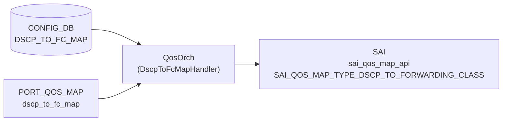

# DSCP_TO_FC_MAP テーブル

## 概要

[DSCP](../../reference/glossary.md#term-dscp) 値 (0..63) を Forwarding Class (FC) へマップする [Class-Based Forwarding (CBF)](../../reference/glossary.md#term-cbf) 用の分類定義[^1]。`qosorch` が [SAI](../../reference/glossary.md#term-sai) QoS map (`SAI_QOS_MAP_TYPE_DSCP_TO_FORWARDING_CLASS`) を生成し、ポートにバインドする (`PORT_QOS_MAP.dscp_to_fc_map`)。通常マップは `config cbf reload` で `cbf.json.j2` テンプレートから注入される。

<!-- cdb-mermaid -->
### データフロー (自動生成)



!!! note "凡例"
    CONFIG_DB から SAI までの典型経路。`PORT_QOS_MAP.dscp_to_fc_map` で参照されない限り SAI へのポートバインドは発生しない。
<!-- /cdb-mermaid -->

## key 構造

```text
DSCP_TO_FC_MAP|<name>|<dscp>
```

`<name>` はマップ名（1..32 文字、`[a-zA-Z0-9][-a-zA-Z0-9_]*`）。`<dscp>` は 0..63。Redis には `DSCP_TO_FC_MAP|<name>` の hash field として `<dscp>: <fc>` ペアが格納される。

## フィールド一覧

| フィールド | 型 | 必須 | 説明 |
|-----------|----|------|------|
| `name` (key L1) | string (1..32) | ✅ | マップ名 |
| `dscp` (key L2) | string `0..63` | ✅ | [DSCP](../../reference/glossary.md#term-dscp) 値 |
| `fc` | string `0..7` (YANG) / `0..max_num_fcs-1` (実装) | - | 転送クラス (Forwarding Class) |

[YANG](../../reference/glossary.md#term-yang) 上は親子 list 構造（`DSCP_TO_FC_MAP_LIST` → `DSCP_TO_FC_MAP`）。

<!-- value-behavior -->
## 値依存挙動マトリクス

### `dscp` (key: string 0..63)

| 値 | 挙動 |
|----|------|
| `0`..`63` | `DscpToFcMapHandler` が `SAI_QOS_MAP_TYPE_DSCP_TO_FORWARDING_CLASS` エントリを生成 |
| 負値 (`-1` 等) | `stoi` 成功後 `value < 0` チェックで reject → `task_invalid_entry` |
| `64` 以上 | `value > 63` チェックで reject → `task_invalid_entry` |
| 非整数文字列 | `std::invalid_argument` を catch → `task_invalid_entry` |

### `fc` (string)

| 値 | 挙動 |
|----|------|
| `0`..`max_num_fcs - 1` | 有効。SAI QoS map エントリに設定 |
| `max_num_fcs` 以上 | reject → `task_invalid_entry` (SWSS_LOG_ERROR) |
| 負値 | reject → `task_invalid_entry` |
| 非整数文字列 | `std::invalid_argument` catch → `task_invalid_entry` |
| FC 非対応スイッチ (`max_num_fcs=0`) | 全 FC 値が reject（0 >= 0 条件が常に真） |

> `max_num_fcs` は `SAI_SWITCH_ATTR_MAX_NUMBER_OF_FORWARDING_CLASSES` を初回呼び出し時のみ取得し静的キャッシュ。FC 非対応スイッチでは `max_num_fcs = 0` となり全エントリが reject される。

<!-- /value-behavior -->

## 購読者

- `qosorch` (`DscpToFcMapHandler`): [SAI](../../reference/glossary.md#term-sai) QoS map 生成・更新・削除

## 関連 CONFIG_DB / YANG / CLI

- 関連 [CONFIG_DB](../../reference/glossary.md#term-config_db): `PORT_QOS_MAP`（`dscp_to_fc_map` フィールドで参照）、`EXP_TO_FC_MAP`
- 関連 CLI: `config cbf reload` / `config cbf clear`
- 関連 [YANG](../../reference/glossary.md#term-yang): `sonic-dscp-fc-map`

<!-- ref-triangle:start -->

## 関連リファレンス

- [YANG](../../reference/glossary.md#term-yang): [`sonic-dscp-fc-map`](../yang/sonic-dscp-fc-map.md)

<!-- ref-triangle:end -->

## 引用元

[^1]: YANG 定義: `sonic-dscp-fc-map.yang`. <https://github.com/sonic-net/sonic-buildimage/blob/9ea932ec2e18f35e58268ec2e4456b1d4afd65cd/src/sonic-yang-models/yang-models/sonic-dscp-fc-map.yang>

<!-- topics-back-ref -->
## 関連 Topics

- [Topics: QoS / Buffer / PFC / Watermark](../../topics/08-qos-buffer/index.md)

<!-- /topics-back-ref -->

<!-- ops-hint -->
## 運用ヒント

### 典型値

- `config cbf reload` で生成される AZURE マップ (`cbf_config.j2`):
  - DSCP 8 → FC 0 (best-effort)
  - DSCP 3,4 → FC 3,4 (lossless)
  - DSCP 5 → FC 2
  - DSCP 46 → FC 5 (EF)
  - DSCP 48 → FC 6 (CS6)
  - その他 → FC 1

### よくある誤設定

- FC 値が `max_num_fcs` 以上 → `task_invalid_entry` で silent に失敗（ログは出るが SAI map は作成されない）
- FC 非対応スイッチで設定 → 全エントリ reject

### 確認コマンド

```bash
sonic-db-cli CONFIG_DB hgetall 'DSCP_TO_FC_MAP|AZURE'
config cbf reload
config cbf clear
```
<!-- /ops-hint -->

<!-- cdb-exceptions -->
## 例外条件・特殊挙動

| consumer | 条件 | 挙動 |
|---|---|---|
| [orchagent](../../reference/glossary.md#term-orchagent) | DEL 時に `PORT_QOS_MAP` 等から参照中 | `m_pendingRemove=true` → `task_need_retry`（qosorch.cpp:185-186） |
| [orchagent](../../reference/glossary.md#term-orchagent) | pending_remove 中に SET | `task_need_retry` を返して実行しない（qosorch.cpp:136-139） |
| [orchagent](../../reference/glossary.md#term-orchagent) | FC 非対応スイッチ (`max_num_fcs=0`) | 全 FC 値が validation で reject → SAI map 未作成 |
| [orchagent](../../reference/glossary.md#term-orchagent) | SAI create/modify 失敗 | `task_failed` を返す（qosorch.cpp:162-166） |

> **Evidence**: `sonic-swss` `orchagent/qosorch.cpp:1039-1130`; `orchagent/cbf/nhgmaporch.cpp:299-325`
<!-- /cdb-exceptions -->


<!-- runtime-trace -->
## 実コンテナ動作トレース

### 段階 1 — Consumer 登録

`QosOrch` が CONFIG_DB の `DSCP_TO_FC_MAP` テーブルを購読（`initTableHandlers` で `handleDscpToFcTable` ハンドラ登録、qosorch.cpp:1337）。

### 段階 2 — CFG→APPL 翻訳

なし（`qosorch` が直接 CONFIG_DB を購読）。

### 段階 3 — APPL→SAI

1. `DscpToFcMapHandler::convertFieldValuesToAttributes()` で dscp/fc 値を `sai_qos_map_t[]` に変換
2. `addQosItem()` が `sai_qos_map_api->create_qos_map()` を呼び出し SAI object 生成
3. `PORT_QOS_MAP.dscp_to_fc_map` 経由で `SAI_PORT_ATTR_QOS_DSCP_TO_FORWARDING_CLASS_MAP` にバインド

### 段階 4 — タイミングと副作用

**適用タイミング**: `qosorch` が CONFIG_DB 変化を検知後即座に SAI QoS map を作成/更新。ポートへのバインドは `PORT_QOS_MAP` で行う。

**副作用**: DSCP→FC マップ変更はそのマップを使用するすべてのポートの CBF 分類に即座に影響。
<!-- /runtime-trace -->

<!-- entry-points -->
## 書き込み入り口 (Direction A)

対象テーブル: `DSCP_TO_FC_MAP`

### CLI
- `config cbf reload`: HWSKU 配下の `cbf.json.j2` テンプレートから sonic-cfggen で生成し CONFIG_DB に書き込む
- `config cbf clear`: `DSCP_TO_FC_MAP` テーブルを全削除

### minigraph / sonic-cfggen
- なし（CBF は minigraph 非対応）

### REST / gNMI (sonic-mgmt-common)
- なし

### db_migrator
- なし

### ビルド時デフォルト (cbf.json.j2)
- `sonic-buildimage/files/build_templates/cbf_config.j2` に AZURE マップ（全 64 エントリ）が定義
- プラットフォーム固有 `cbf.json.j2` で上書き可能

### ハードコードデフォルト
- なし（ランタイム注入もなし）
<!-- /entry-points -->

<!-- ordering -->
## 書込み順依存 (Phase B)

<!-- evidence: meta/_intermediate/cdb-flow/dscp-to-fc-map-ordering.md -->

### 検出された順序依存

| # | 依存関係 | 方向 | 緩和策 |
|---|----------|------|--------|
| 1 | `DSCP_TO_FC_MAP` SET → `PORT_QOS_MAP` の `dscp_to_fc_map` 参照 | **先行必須**（未存在時は `task_need_retry` ループ） | `resolveFieldRefValue` が自動再試行 |
| 2 | `PORT_QOS_MAP` の `dscp_to_fc_map` 参照解除 → `DSCP_TO_FC_MAP` DEL | **先行必須**（参照中は `m_pendingRemove=true`・DEL 保留） | 参照解除後の次サイクルで自動 DEL 実行 |
| 3 | `config cbf reload` 内部順序 | CLI が自動保証（DSCP_TO_FC_MAP → EXP_TO_FC_MAP → PORT_QOS_MAP） | 手動 DB 書き込みでは同順序を維持すること |

### 主要な制約詳細

**PORT_QOS_MAP 先行禁止 (依存 #1)**: `handlePortQosMapTable()` は `dscp_to_fc_map` フィールドを処理する際、`resolveFieldRefValue(m_qos_maps, "dscp_to_fc_map", CFG_DSCP_TO_FC_MAP_TABLE_NAME, ...)` でマップ名を解決する。対応する `DSCP_TO_FC_MAP` エントリが存在しない場合は `task_need_retry` を返し、ポートへの SAI バインドが行われない (qosorch.cpp:2124-2130)。`DSCP_TO_FC_MAP` を事前に作成しておくことで即座に処理される。

**参照中 DEL は自動保留 (依存 #2)**: `processWorkItem()` が `isObjectBeingReferenced()` を確認し、`PORT_QOS_MAP` のいずれかのポートエントリが当該マップを参照していれば `m_pendingRemove = true` を立てて `task_need_retry` を返す (qosorch.cpp:181-186)。DEL を成功させるには `PORT_QOS_MAP` エントリの `dscp_to_fc_map` フィールドを先に削除（または `PORT_QOS_MAP` エントリ自体を DEL）する必要がある。

**config cbf reload の内部順序 (依存 #3)**: `config cbf reload` は `sonic-cfggen` が `cbf.json.j2` テンプレートから DSCP_TO_FC_MAP → EXP_TO_FC_MAP → PORT_QOS_MAP の順で書き込む。この順序はテンプレートにより保証される。`sonic-db-cli` 等で手動書き込みする場合は同じ順序を守ること。

<!-- /ordering -->

<!-- defaults -->
## コード由来の暗黙デフォルト・制約

### `fc` フィールド — YANG-実装 discrepancy

| 観点 | 内容 |
|------|------|
| YANG pattern | `[0-7]?` → 0..7 のみ許可 |
| SAI ランタイム上限 | `NhgMapOrch::getMaxNumFcs() - 1`（`SAI_SWITCH_ATTR_MAX_NUMBER_OF_FORWARDING_CLASSES` を SAI query） |
| テスト設定値 | `max_num_fcs = 63` → FC 0..62 が有効（test_qos_map.py:314） |
| 結論 | **YANG は 0..7 を強制するが、実装は SAI capability まで許可**。YANG バリデーションをバイパスして直接 CONFIG_DB に書き込む場合は 0..62 が通過する可能性がある |

### FC サポートなしスイッチの silent reject

- `getMaxNumFcs()` が 0 を返す場合（SAI が `SAI_SWITCH_ATTR_MAX_NUMBER_OF_FORWARDING_CLASSES` 非対応）:
  - `fc >= max_num_fcs` は `fc >= 0` となり**全 FC 値が reject**
  - SAI map は作成されず、`task_invalid_entry` を返す（ログは `SWSS_LOG_ERROR` に出力）
  - エラーはログのみ、orchagent は継続動作

### `dscp` フィールド — 例外処理あり (DscpToTcMapHandler との差異)

- `DscpToFcMapHandler::convertFieldValuesToAttributes()` は dscp・fc 両フィールドに `try/catch(invalid_argument)` を実装
- 非整数文字列 → catch → `return false` → `task_invalid_entry`（qosorch.cpp:1084-1088）
- 対照: `DscpToTcMapHandler` は try/catch なし（`stoi` 未補足で `std::invalid_argument` が伝播）

### スパース定義時の未定義 DSCP

- 全 64 エントリ定義不要（スパース定義可能）
- 未定義 DSCP の FC は **ASIC/SAI 実装依存**（一般的に FC=0 だが非保証）
- 標準 AZURE マップは全 64 エントリを明示定義

### `max_num_fcs` の静的キャッシュ

- `NhgMapOrch::getMaxNumFcs()` は静的変数で初回取得後はキャッシュ
- orchagent 再起動なしに ASIC capability が変化しても反映されない（実運用上は問題なし）

### pendingRemove ロック

- 参照中 (`PORT_QOS_MAP` / `EXP_TO_FC_MAP` 側から) のマップへ DEL → `m_pendingRemove = true` + `task_need_retry`
- pending_remove 中に SET が来ても**実行せず** `task_need_retry` を返す
- 参照が解除されると次の処理サイクルで DEL が実行される

> **Evidence**: `qosorch.cpp:1039-1130` (DscpToFcMapHandler); `cbf/nhgmaporch.cpp:299-325` (getMaxNumFcs); `cbf_config.j2:1-69` (AZURE default); `test_qos_map.py:300-374` (TestCbf validation)
<!-- /defaults -->

<!-- glossary-links-injected: dscp-to-fc-map-2026-05-14 -->
