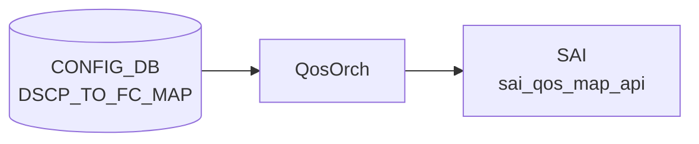

# DSCP_TO_FC_MAP テーブル

## 概要

[DSCP](../../reference/glossary.md#term-dscp) 値 (0..63) を Forwarding Class (FC) へマップする [Class-Based Forwarding (CBF)](../../reference/glossary.md#term-cbf) 用の分類定義[^1]。`qosorch` が [SAI](../../reference/glossary.md#term-sai) [QoS](../../reference/glossary.md#term-qos) map (`SAI_QOS_MAP_TYPE_DSCP_TO_FORWARDING_CLASS`) を生成し、ポートにバインドする (`PORT_QOS_MAP.dscp_to_fc_map`)。通常マップは `config cbf reload` で `cbf.json.j2` テンプレートから注入される。

<!-- cdb-mermaid -->
### データフロー (自動生成)



!!! note "凡例"
    CONFIG_DB から SAI までの典型経路を `docs/reference/config-db-orch-map.md` から機械生成したミニ図。詳細・例外は本ページ本文と対応表を参照。
<!-- /cdb-mermaid -->

## key 構造

```text
DSCP_TO_FC_MAP|<name>|<dscp>
```

`<name>` はマップ名（1..32 文字、`[a-zA-Z0-9][-a-zA-Z0-9_]*`）。`<dscp>` は 0..63。[Redis](../../reference/glossary.md#term-redis) には `DSCP_TO_FC_MAP|<name>` の hash field として `<dscp>: <fc>` ペアが格納される。

## フィールド一覧

| フィールド | 型 | 必須 | 説明 |
|-----------|----|------|------|
| `name` (key L1) | string (1..32) | ✅ | マップ名 |
| `dscp` (key L2) | string `0..63` | ✅ | [DSCP](../../reference/glossary.md#term-dscp) 値 |
| `fc` | string `0..7` (YANG) / `0..max_num_fcs-1` (実装) | - | 転送クラス (Forwarding Class) |

[YANG](../../reference/glossary.md#term-yang) 上は親子 list 構造（`DSCP_TO_FC_MAP_LIST` → `DSCP_TO_FC_MAP`）。

<!-- value-behavior -->
## 値依存挙動マトリクス

### `dscp` (key: string 0..63)

| 値 | 挙動 |
|----|------|
| `0`..`63` | `DscpToFcMapHandler` が `SAI_QOS_MAP_TYPE_DSCP_TO_FORWARDING_CLASS` エントリを生成 |
| 負値 (`-1` 等) | `stoi` 成功後 `value < 0` チェックで reject → `task_invalid_entry` |
| `64` 以上 | `value > 63` チェックで reject → `task_invalid_entry` |
| 非整数文字列 | `std::invalid_argument` を catch → `task_invalid_entry` |

### `fc` (string)

| 値 | 挙動 |
|----|------|
| `0`..`max_num_fcs - 1` | 有効。[SAI](../../reference/glossary.md#term-sai) [QoS](../../reference/glossary.md#term-qos) map エントリに設定 |
| `max_num_fcs` 以上 | reject → `task_invalid_entry` (SWSS_LOG_ERROR) |
| 負値 | reject → `task_invalid_entry` |
| 非整数文字列 | `std::invalid_argument` catch → `task_invalid_entry` |
| FC 非対応スイッチ (`max_num_fcs=0`) | 全 FC 値が reject（0 >= 0 条件が常に真） |

> `max_num_fcs` は `SAI_SWITCH_ATTR_MAX_NUMBER_OF_FORWARDING_CLASSES` を初回呼び出し時のみ取得し静的キャッシュ。FC 非対応スイッチでは `max_num_fcs = 0` となり全エントリが reject される。

<!-- /value-behavior -->

## 購読者

- `qosorch` (`DscpToFcMapHandler`): [SAI](../../reference/glossary.md#term-sai) [QoS](../../reference/glossary.md#term-qos) map 生成・更新・削除

## 関連 CONFIG_DB / YANG / CLI

- 関連 [CONFIG_DB](../../reference/glossary.md#term-config_db): `PORT_QOS_MAP`（`dscp_to_fc_map` フィールドで参照）、`EXP_TO_FC_MAP`
- 関連 CLI: `config cbf reload` / `config cbf clear`
- 関連 [YANG](../../reference/glossary.md#term-yang): `sonic-dscp-fc-map`

<!-- ref-triangle:start -->

## 関連リファレンス

- [YANG](../../reference/glossary.md#term-yang): `sonic-dscp-fc-map`（リファレンスページ未作成）

<!-- ref-triangle:end -->

## 引用元

[^1]: YANG 定義: `sonic-dscp-fc-map.yang`. <https://github.com/sonic-net/sonic-buildimage/blob/9ea932ec2e18f35e58268ec2e4456b1d4afd65cd/src/sonic-yang-models/yang-models/sonic-dscp-fc-map.yang>

<!-- topics-back-ref -->
## 関連 Topics

- [Topics: QoS / Buffer / PFC / Watermark](../../topics/08-qos-buffer/index.md)

<!-- /topics-back-ref -->

<!-- ops-hint -->
## 運用ヒント

### 典型値

- `config cbf reload` で生成される AZURE マップ (`cbf_config.j2`):
  - [DSCP](../../reference/glossary.md#term-dscp) 8 → FC 0 (best-effort)
  - DSCP 3,4 → FC 3,4 (lossless)
  - DSCP 5 → FC 2
  - DSCP 46 → FC 5 (EF)
  - DSCP 48 → FC 6 (CS6)
  - その他 → FC 1

### よくある誤設定

- FC 値が `max_num_fcs` 以上 → `task_invalid_entry` で silent に失敗（ログは出るが SAI map は作成されない）
- FC 非対応スイッチで設定 → 全エントリ reject

### 確認コマンド

```bash
sonic-db-cli CONFIG_DB hgetall 'DSCP_TO_FC_MAP|AZURE'
config cbf reload
config cbf clear
```
<!-- /ops-hint -->

<!-- cdb-exceptions -->
## 例外条件・特殊挙動

| consumer | 条件 | 挙動 |
|---|---|---|
| [orchagent](../../reference/glossary.md#term-orchagent) | DEL 時に `PORT_QOS_MAP` 等から参照中 | `m_pendingRemove=true` → `task_need_retry`（qosorch.cpp:185-186） |
| [orchagent](../../reference/glossary.md#term-orchagent) | pending_remove 中に SET | `task_need_retry` を返して実行しない（qosorch.cpp:136-139） |
| [orchagent](../../reference/glossary.md#term-orchagent) | FC 非対応スイッチ (`max_num_fcs=0`) | 全 FC 値が validation で reject → SAI map 未作成 |
| [orchagent](../../reference/glossary.md#term-orchagent) | SAI create/modify 失敗 | `task_failed` を返す（qosorch.cpp:162-166） |

> **Evidence**: `sonic-swss` `orchagent/qosorch.cpp:1039-1130`; `orchagent/cbf/nhgmaporch.cpp:299-325`
<!-- /cdb-exceptions -->

<!-- runtime-trace -->
## 実コンテナ動作トレース

### 段階 1 — Consumer 登録

`QosOrch` が [CONFIG_DB](../../reference/glossary.md#term-config_db) の `DSCP_TO_FC_MAP` テーブルを購読（`initTableHandlers` で `handleDscpToFcTable` ハンドラ登録、qosorch.cpp:1337）。

### 段階 2 — CFG→APPL 翻訳

なし（`qosorch` が直接 [CONFIG_DB](../../reference/glossary.md#term-config_db) を購読）。

### 段階 3 — APPL→SAI

1. `DscpToFcMapHandler::convertFieldValuesToAttributes()` で dscp/fc 値を `sai_qos_map_t[]` に変換
2. `addQosItem()` が `sai_qos_map_api->create_qos_map()` を呼び出し SAI object 生成
3. `PORT_QOS_MAP.dscp_to_fc_map` 経由で `SAI_PORT_ATTR_QOS_DSCP_TO_FORWARDING_CLASS_MAP` にバインド

### 段階 4 — タイミングと副作用

**適用タイミング**: `qosorch` が CONFIG_DB 変化を検知後即座に SAI QoS map を作成/更新。ポートへのバインドは `PORT_QOS_MAP` で行う。

**副作用**: DSCP→FC マップ変更はそのマップを使用するすべてのポートの CBF 分類に即座に影響。
<!-- /runtime-trace -->

<!-- entry-points -->
## 書き込み入り口 (Direction A)

対象テーブル: `DSCP_TO_FC_MAP`

### CLI
- `config cbf reload`: HWSKU 配下の `cbf.json.j2` テンプレートから [sonic-cfggen](../../reference/glossary.md#term-sonic-cfggen) で生成し CONFIG_DB に書き込む
- `config cbf clear`: `DSCP_TO_FC_MAP` テーブルを全削除

### minigraph / sonic-cfggen
- なし（CBF は minigraph 非対応）

### REST / gNMI (sonic-mgmt-common)
- なし

### db_migrator
- なし

### ビルド時デフォルト (cbf.json.j2)
- `sonic-buildimage/files/build_templates/cbf_config.j2` に AZURE マップ（全 64 エントリ）が定義
- プラットフォーム固有 `cbf.json.j2` で上書き可能

### ハードコードデフォルト
- なし（ランタイム注入もなし）
<!-- /entry-points -->

<!-- ordering -->
## 書込み順依存 (Phase B)

<!-- evidence: meta/_intermediate/cdb-flow/dscp-to-fc-map-ordering.md -->

### 検出された順序依存

| # | 依存関係 | 方向 | 緩和策 |
|---|----------|------|--------|
| 1 | `DSCP_TO_FC_MAP` SET → `PORT_QOS_MAP` の `dscp_to_fc_map` 参照 | **先行必須**（未存在時は `task_need_retry` ループ） | `resolveFieldRefValue` が自動再試行 |
| 2 | `PORT_QOS_MAP` の `dscp_to_fc_map` 参照解除 → `DSCP_TO_FC_MAP` DEL | **先行必須**（参照中は `m_pendingRemove=true`・DEL 保留） | 参照解除後の次サイクルで自動 DEL 実行 |
| 3 | `config cbf reload` 内部順序 | CLI が自動保証（DSCP_TO_FC_MAP → EXP_TO_FC_MAP → PORT_QOS_MAP） | 手動 DB 書き込みでは同順序を維持すること |

### 主要な制約詳細

**PORT_QOS_MAP 先行禁止 (依存 #1)**: `handlePortQosMapTable()` は `dscp_to_fc_map` フィールドを処理する際、`resolveFieldRefValue(m_qos_maps, "dscp_to_fc_map", CFG_DSCP_TO_FC_MAP_TABLE_NAME, ...)` でマップ名を解決する。対応する `DSCP_TO_FC_MAP` エントリが存在しない場合は `task_need_retry` を返し、ポートへの SAI バインドが行われない (qosorch.cpp:2124-2130)。`DSCP_TO_FC_MAP` を事前に作成しておくことで即座に処理される。

**参照中 DEL は自動保留 (依存 #2)**: `processWorkItem()` が `isObjectBeingReferenced()` を確認し、`PORT_QOS_MAP` のいずれかのポートエントリが当該マップを参照していれば `m_pendingRemove = true` を立てて `task_need_retry` を返す (qosorch.cpp:181-186)。DEL を成功させるには `PORT_QOS_MAP` エントリの `dscp_to_fc_map` フィールドを先に削除（または `PORT_QOS_MAP` エントリ自体を DEL）する必要がある。

**config cbf reload の内部順序 (依存 #3)**: `config cbf reload` は `sonic-cfggen` が `cbf.json.j2` テンプレートから DSCP_TO_FC_MAP → EXP_TO_FC_MAP → PORT_QOS_MAP の順で書き込む。この順序はテンプレートにより保証される。`sonic-db-cli` 等で手動書き込みする場合は同じ順序を守ること。

<!-- /ordering -->

<!-- cross-refs -->
## 暗黙参照テーブル (Phase C)

<!-- evidence: meta/_intermediate/cdb-flow/dscp-to-fc-map-cross-refs.md -->

`DSCP_TO_FC_MAP` 自身の YANG leafref は `PORT_QOS_MAP.dscp_to_fc_map` から被参照されるが、実装上の処理経路では以下のリソースを暗黙参照している。

### 1. PORT_QOS_MAP (CONFIG_DB)

- **参照方向**: 被参照（`PORT_QOS_MAP.dscp_to_fc_map` フィールドが本テーブルを leafref）
- **条件**: `PORT_QOS_MAP` の `dscp_to_fc_map` フィールド SET 時
- **参照元**: `qosorch.cpp:111` — `qos_to_ref_table_map` にて `dscp_to_fc_field_name → CFG_DSCP_TO_FC_MAP_TABLE_NAME` のマッピング登録
- **意味**: 参照が存在する間は DEL が保留される（`m_pendingRemove=true`）。`PORT_QOS_MAP` 側の参照を先に解除しなければ `DSCP_TO_FC_MAP` エントリを削除できない

### 2. SAI switch — `SAI_SWITCH_ATTR_MAX_NUMBER_OF_FORWARDING_CLASSES`

- **参照方向**: SAI query（実行時依存）
- **条件**: `DscpToFcMapHandler::convertFieldValuesToAttributes()` が呼ばれるたびに `NhgMapOrch::getMaxNumFcs()` を呼び出し（内部は static キャッシュ — 初回のみ実際の SAI query を発行）
- **参照元**: `qosorch.cpp:1043`; `nhgmaporch.cpp:299-325`
- **意味**: FC 上限値をランタイムで SAI から取得。FC 非対応 [ASIC](../../reference/glossary.md#term-asic) では `max_num_fcs=0` → 全 FC 値が reject され SAI map 未作成となる。初回クエリ後は orchagent 再起動まで固定

### 3. EXP_TO_FC_MAP (CONFIG_DB)

- **参照方向**: 同族テーブル（共通 `m_qos_maps` 参照カウンタマップを共有）
- **条件**: 常時（`QosOrch` 初期化時に `m_qos_maps` に両テーブルを登録）
- **参照元**: `qosorch.cpp:93` — `m_qos_maps[CFG_EXP_TO_FC_MAP_TABLE_NAME]`
- **意味**: DSCP_TO_FC_MAP と EXP_TO_FC_MAP は同じ `processWorkItem()` フレームワークを共有し、`PORT_QOS_MAP` から互いに独立して参照される。参照カウンタは各テーブルで独立管理

### 参照関係サマリ

```
DSCP_TO_FC_MAP
  ├─ [被参照]          PORT_QOS_MAP.dscp_to_fc_map  (参照中は DEL 保留)
  ├─ [SAI runtime]    SAI_SWITCH_ATTR_MAX_NUMBER_OF_FORWARDING_CLASSES  (FC 上限取得・static キャッシュ)
  └─ [同族/独立]       EXP_TO_FC_MAP  (共通フレームワーク共有、参照カウンタは独立)
```

!!! note "CONFIG_DB 直接 → SAI 経路"
    `qosorch` は `DSCP_TO_FC_MAP` を CONFIG_DB から直接購読し SAI へ反映する。APPL_DB / STATE_DB への暗黙参照はない。FLEX_COUNTER_DB への書き込みも発生しない。

> **スキャン証跡**: `qosorch.cpp:80-93, 111, 1039-1094, 1337` 読了 / `nhgmaporch.cpp:299-325` 読了。
<!-- /cross-refs -->

<!-- failure -->
## 失敗挙動 (Phase D)

`DscpToFcMapHandler::processWorkItem()` は SET / DEL 失敗を以下のパターンに分類し、失敗ログをすべて `SWSS_LOG_ERROR` / `SWSS_LOG_NOTICE` で出力する。[STATE_DB](../../reference/glossary.md#term-state_db) へのステータス記録はなく（CONFIG_DB → SAI 直行経路）、`ERROR_TABLE` への書き込みも発生しない。

<!-- evidence: meta/_intermediate/cdb-flow/dscp-to-fc-map-failure.md -->

### SET 時の失敗パターン

| # | 失敗ケース | 発生箇所 | task_status | retry |
|---|---|---|---|---|
| 1 | DSCP 値 < 0 または > 63 | `convertFieldValuesToAttributes()` L1057-1069 | `task_invalid_entry` | なし（erase） |
| 2 | FC 値が範囲外 (`< 0` または `>= max_num_fcs`) | `convertFieldValuesToAttributes()` L1072-1082 | `task_invalid_entry` | なし（erase） |
| 3 | FC 非対応 [ASIC](../../reference/glossary.md#term-asic) (`max_num_fcs=0`) で全 FC reject | `convertFieldValuesToAttributes()` L1072-1082 | `task_invalid_entry` | なし（erase） |
| 4 | 非整数文字列 (`stoi` 例外) | `convertFieldValuesToAttributes()` L1083-1089 | `task_invalid_entry` | なし（erase） |
| 5 | SAI `create_qos_map` 失敗 | `addQosItem()` L1115-1120 → `processWorkItem()` L157-164 | `task_failed` | なし（erase） |
| 6 | SAI `modifyQosItem()` 失敗 | `processWorkItem()` L151-158 | `task_failed` | なし（erase） |
| 7 | `m_pendingRemove` 中に SET | `processWorkItem()` L135-140 | `task_need_retry` | あり（無制限・参照解除まで） |

### DEL 時の失敗パターン

| # | 失敗ケース | 発生箇所 | task_status | retry |
|---|---|---|---|---|
| 8 | 未登録オブジェクトへの DEL | `processWorkItem()` L177-180 | `task_invalid_entry` | なし（erase） |
| 9 | `PORT_QOS_MAP` 参照中の DEL | `processWorkItem()` L181-187 | `task_need_retry` + `m_pendingRemove=true` | あり（参照解除まで） |
| 10 | SAI `removeQosItem()` 失敗 | `processWorkItem()` L188-193 | `task_failed` | なし（erase） |

### 各パターンの詳細

**DSCP / FC バリデーション失敗 (# 1-4)**: `convertFieldValuesToAttributes()` が `false` を返し、`processWorkItem()` は即座に `task_invalid_entry` を返してエントリを `m_toSync` から erase する。SAI への呼び出しは行われない。エラーは `SWSS_LOG_ERROR` でのみ通知される。

**FC 非対応 [ASIC](../../reference/glossary.md#term-asic) の silent reject (# 3)**: `NhgMapOrch::getMaxNumFcs()` が 0 を返すとき（`SAI_SWITCH_ATTR_MAX_NUMBER_OF_FORWARDING_CLASSES` 非対応 ASIC）、条件 `value >= max_num_fcs` が `value >= 0` と等価になり**全 FC 値が reject**される。FC 非対応スイッチで CBF 設定を試みても SAI map は作成されない（evidence: `nhgmaporch.cpp:299-325`）。

**SAI create / modify 失敗 (# 5-6)**: `task_failed` を返すためエントリは erase され自動 retry されない。ASIC 側の一時的エラーでも再投入が必要。ログに `SWSS_LOG_ERROR` が出力される。

**参照中 DEL の自動保留 (# 9)**: `PORT_QOS_MAP` の `dscp_to_fc_map` フィールドから参照されている間は `m_pendingRemove = true` がセットされ `task_need_retry` が返る。`PORT_QOS_MAP` 側の参照を先に削除すると次のサイクルで自動的に DEL が実行される（evidence: `qosorch.cpp:181-187`）。

### 確認コマンド

```bash
# orchagent ログで失敗を確認
grep -i "dscp_to_fc\|dscp.*fc" /var/log/swss/orchagent.log | tail -20

# SAI map が作成されているか確認
sonic-db-cli CONFIG_DB hgetall 'DSCP_TO_FC_MAP|AZURE'
```

> **証跡**: `QosMapHandler::processWorkItem()` qosorch.cpp:124-210 全行精読; `DscpToFcMapHandler::convertFieldValuesToAttributes()` qosorch.cpp:1039-1094; `DscpToFcMapHandler::addQosItem()` qosorch.cpp:1095-1124; `NhgMapOrch::getMaxNumFcs()` nhgmaporch.cpp:299-325。
<!-- /failure -->

<!-- constants -->
## ハードコード定数 (Phase E)

`DSCP_TO_FC_MAP` の処理で使われる、CONFIG_DB / YANG に現れないハードコード定数の一覧。出典は `sonic-swss/orchagent/qosorch.cpp` と `sonic-swss/orchagent/cbf/nhgmaporch.cpp`。

<!-- evidence: meta/_intermediate/cdb-flow/dscp-to-fc-map-constants.md -->

### バリデーション境界値

| 定数 | 値 | 定義箇所 | 用途 |
|------|----|---------|------|
| `DSCP_MAX_VAL` | `63` | `qosorch.cpp:119` (`#define`) | DSCP キー上限。`dscp > 63` で `task_invalid_entry` |
| `max_num_fcs` フォールバック | `0` | `nhgmaporch.cpp:320` (runtime) | FC 非対応 ASIC 時の値。全 FC 値が `value >= 0` で reject |
| `max_num_fcs` テスト mock 値 | `63` | `test_qos_map.py:314` | テスト用固定値。本番は SAI capability から動的取得 |

`DSCP_MAX_VAL = 63` は YANG の `range "0..63"` と一致しており、定数化・YANG 定義の両方で境界が明示されている。

### `max_num_fcs` の取得ロジック

`NhgMapOrch::getMaxNumFcs()` (`nhgmaporch.cpp:299-325`) は `static int max_num_fcs = -1` を静的変数で保持し、**初回呼び出し時のみ** SAI を照会する:

```
SAI_SWITCH_ATTR_MAX_NUMBER_OF_FORWARDING_CLASSES → attr.value.u8
  成功時: そのまま max_num_fcs に代入 (uint8_t; 最大 255)
  失敗時: max_num_fcs = 0 (WARN ログ: "Switch does not support FCs")
```

orchagent 再起動なしにはキャッシュが更新されない。FC 非対応 ASIC では `max_num_fcs = 0` となり、`value >= max_num_fcs` が `value >= 0` と等価になるため全 FC 値が reject される。

### SAI 内部定数（ユーザ非操作）

| 定数 | 値 | 用途 |
|------|----|------|
| `SAI_QOS_MAP_TYPE_DSCP_TO_FORWARDING_CLASS` | SAI enum | `create_qos_map()` 呼び出し時の map タイプ指定 (`qosorch.cpp:1104`) |
| `SAI_PORT_ATTR_QOS_DSCP_TO_FORWARDING_CLASS_MAP` | SAI enum | ポートへの `set_port_attribute()` 呼び出し時の属性指定 (`qosorch.cpp:71`) |

これらは SAI API 内部定数であり、CONFIG_DB / YANG / CLI には露出しない。

> **証跡**: `qosorch.cpp:119` (DSCP_MAX_VAL); `qosorch.cpp:71, 1104` (SAI 定数); `nhgmaporch.cpp:299-325` (getMaxNumFcs); `test_qos_map.py:314` (テスト mock 値)。
<!-- /constants -->

<!-- defaults -->
## フィールド暗黙デフォルト (Phase A — コード由来)

### `fc` フィールド — YANG-実装 discrepancy

| 観点 | 内容 |
|------|------|
| YANG pattern | `[0-7]?` → 0..7 のみ許可 |
| SAI ランタイム上限 | `NhgMapOrch::getMaxNumFcs() - 1`（`SAI_SWITCH_ATTR_MAX_NUMBER_OF_FORWARDING_CLASSES` を SAI query） |
| テスト設定値 | `max_num_fcs = 63` → FC 0..62 が有効（test_qos_map.py:314） |
| 結論 | **YANG は 0..7 を強制するが、実装は SAI capability まで許可**。YANG バリデーションをバイパスして直接 CONFIG_DB に書き込む場合は 0..62 が通過する可能性がある |

### FC サポートなしスイッチの silent reject

- `getMaxNumFcs()` が 0 を返す場合（SAI が `SAI_SWITCH_ATTR_MAX_NUMBER_OF_FORWARDING_CLASSES` 非対応）:
  - `fc >= max_num_fcs` は `fc >= 0` となり**全 FC 値が reject**
  - SAI map は作成されず、`task_invalid_entry` を返す（ログは `SWSS_LOG_ERROR` に出力）
  - エラーはログのみ、orchagent は継続動作

### `dscp` フィールド — 例外処理あり (DscpToTcMapHandler との差異)

- `DscpToFcMapHandler::convertFieldValuesToAttributes()` は dscp・fc 両フィールドに `try/catch(invalid_argument)` を実装
- 非整数文字列 → catch → `return false` → `task_invalid_entry`（qosorch.cpp:1084-1088）
- 対照: `DscpToTcMapHandler` は try/catch なし（`stoi` 未補足で `std::invalid_argument` が伝播）

### スパース定義時の未定義 DSCP

- 全 64 エントリ定義不要（スパース定義可能）
- 未定義 DSCP の FC は **ASIC/SAI 実装依存**（一般的に FC=0 だが非保証）
- 標準 AZURE マップは全 64 エントリを明示定義

### `max_num_fcs` の静的キャッシュ

- `NhgMapOrch::getMaxNumFcs()` は静的変数で初回取得後はキャッシュ
- orchagent 再起動なしに ASIC capability が変化しても反映されない（実運用上は問題なし）

### pendingRemove ロック

- 参照中 (`PORT_QOS_MAP` / `EXP_TO_FC_MAP` 側から) のマップへ DEL → `m_pendingRemove = true` + `task_need_retry`
- pending_remove 中に SET が来ても**実行せず** `task_need_retry` を返す
- 参照が解除されると次の処理サイクルで DEL が実行される

> **Evidence**: `qosorch.cpp:1039-1130` (DscpToFcMapHandler); `cbf/nhgmaporch.cpp:299-325` (getMaxNumFcs); `cbf_config.j2:1-69` (AZURE default); `test_qos_map.py:300-374` (TestCbf validation)
<!-- /defaults -->

<!-- side-effects -->
## 副作用 (Phase F)

<!-- evidence: meta/_intermediate/cdb-flow/dscp-to-fc-map-side-effects.md -->

### MAP SET/DEL の直接副作用

| 副作用 | トリガー | ソース |
|--------|---------|--------|
| SAI QoS map オブジェクト生成 (`SAI_QOS_MAP_TYPE_DSCP_TO_FORWARDING_CLASS`) | SET (新規) | `qosorch.cpp:1112-1115` |
| SAI QoS map 属性更新 (`set_qos_map_attribute`) | SET (既存) | `qosorch.cpp:207` |
| SAI QoS map 削除 (`remove_qos_map`) | DEL かつ参照なし | `qosorch.cpp:212-220` |
| `getTypeMap()` への OID 登録 | SET 新規成功 | `qosorch.cpp:168` |
| 同上エントリの erase | DEL 成功 | `qosorch.cpp:194` |
| `m_pendingRemove = true` — 後続 SET を `task_need_retry` に | DEL 時に参照が残っている | `qosorch.cpp:185` |

- **[STATE_DB](../../reference/glossary.md#term-state_db) への書き込みなし** — `QosOrch` は `DSCP_TO_FC_MAP` 処理で [STATE_DB](../../reference/glossary.md#term-state_db) / [APPL_DB](../../reference/glossary.md#term-appl_db) に書き込まない。CONFIG_DB → SAI 直結。
- **[APPL_DB](../../reference/glossary.md#term-appl_db) への書き込みなし** — master の `orchagent` は `DSCP_TO_FC_MAP` 処理で [APPL_DB](../../reference/glossary.md#term-appl_db) を操作しない。

### PORT_QOS_MAP 経由の間接副作用

MAP OID 解決後、`PORT_QOS_MAP.dscp_to_fc_map` を参照するポートエントリが自動再処理されて以下が生じる:

| 副作用 | API | ソース |
|--------|-----|--------|
| ポートへの `SAI_PORT_ATTR_QOS_DSCP_TO_FORWARDING_CLASS_MAP` 適用 | `sai_port_api->set_port_attribute()` | `qosorch.cpp:2193` |

MAP が未作成の間は `PORT_QOS_MAP` の処理が `task_need_retry` で保留され (`qosorch.cpp:2124-2129`)、MAP 作成完了後の `doTask()` サイクルで自動再処理される。

!!! note "PFC 関連副作用なし"
    `dscp_to_fc_map` は CBF（Class-Based Forwarding）専用であり、PFC enable bitmask (`SAI_PORT_ATTR_PRIORITY_FLOW_CONTROL`) や PFC watchdog の更新は**発生しない**。`pfc_to_pg_map` / `pfc_to_queue_map` 等と異なり、ポートの PFC 状態は変化しない (`qosorch.cpp:2136-2156`)。

### m_pendingRemove 連鎖

DEL 試行時に参照が残っている場合、`m_pendingRemove = true` がセットされ、
その後この MAP 名への SET 操作も即 `task_need_retry` を返す (`qosorch.cpp:136-139`)。
参照側 (`PORT_QOS_MAP.dscp_to_fc_map`) の解除後に DEL が再実行されて連鎖が解消する。

<!-- /side-effects -->

<!-- pubsub -->
## 通信メカニズム (Phase G)

<!-- evidence: meta/_intermediate/cdb-flow/dscp-to-fc-map-pubsub.md -->

### Producer/Consumer ペア

`DSCP_TO_FC_MAP` は CONFIG_DB → SAI の **直接経路**をとる。APPL_DB / STATE_DB への書き込みは行わない。

| 区間 | 方式 | チャンネル / パターン |
|------|------|----------------------|
| CONFIG_DB → QosOrch | `SubscriberStateTable` | `__keyspace@{config_db_id}__:DSCP_TO_FC_MAP\|*` |
| QosOrch → SAI | SAI API 直接呼び出し | `sai_qos_map_api->create_qos_map` / `set_qos_map_attribute` / `remove_qos_map` |

### SubscriberStateTable の動作

`QosOrch` は `Orch(db, tableNames)` 基底クラスの `addConsumer()` を通じて `CFG_DSCP_TO_FC_MAP_TABLE_NAME` に対する `SubscriberStateTable` を生成する (`qosorch.cpp:1337`)。CONFIG_DB の keyspace notification (`PSUBSCRIBE __keyspace@db__:DSCP_TO_FC_MAP|*`) でエントリ変化を検出し `pops()` で現在値を読み出す。orchagent 起動直後は `getKeys()` で既存エントリを先読みし、起動前の設定を取りこぼさない。

### doTask 実行順序

`QosOrch::doTask()` (`qosorch.cpp:2231`) はカスタム実行順序を実装する:

1. `PORT_QOS_MAP` と `QUEUE` 以外の全テーブル（`DSCP_TO_FC_MAP` を含む）を先に drain
2. `PORT_QOS_MAP` を drain
3. 最後に `QUEUE` を drain

これにより `DSCP_TO_FC_MAP` の SAI object が `PORT_QOS_MAP` の参照解決前に確実に作成される。

### retry メカニズム

| 戻り値 | 意味 | エントリの扱い |
|--------|------|----------------|
| `task_success` | 正常完了 | `m_toSync` から erase |
| `task_need_retry` | 一時的失敗（pendingRemove 中など） | `m_toSync` に残留、次サイクルで再試行 |
| `task_failed` | 永続的失敗（SAI エラーなど） | erase + エラーログのみ (silent drop) |
| `task_invalid_entry` | バリデーション失敗 | erase + エラーログのみ (silent drop) |

### データフロー図

```
CONFIG_DB[DSCP_TO_FC_MAP|<name>|<dscp>]
  ↓ SubscriberStateTable (keyspace notification)
  ↓ PSUBSCRIBE __keyspace@config_db_id__:DSCP_TO_FC_MAP|*
orchdaemon select() loop (SELECT_TIMEOUT=1000ms)
  ↓ Consumer::drain() → QosOrch::doTask()
  ↓   [allPortsReady() チェック]
  ↓   [実行順序: マップ系テーブル → PORT_QOS_MAP → QUEUE]
  ↓ handleDscpToFcTable() → DscpToFcMapHandler::processWorkItem()
    ↓ convertFieldValuesToAttributes() — NhgMapOrch::getMaxNumFcs() で FC 上限確認
    ↓ addQosItem() / modifyQosItem() / removeQosItem()
    ↓ sai_qos_map_api->create_qos_map / set_qos_map_attribute / remove_qos_map
ASIC (sairedis → ASIC_DB 経由)

APPL_DB 書き込み: なし
STATE_DB 書き込み: なし
NotificationConsumer / Producer: なし
```

<!-- /pubsub -->

<!-- platform -->
## プラットフォーム差 (Phase H)

<!-- evidence: meta/_intermediate/cdb-flow/dscp-to-fc-map-platform.md -->
<!-- source: sonic-swss/orchagent/qosorch.cpp:1039-1094 / orchagent/cbf/nhgmaporch.cpp:299-324 -->
<!-- date: 2026-05-18 -->

`DscpToFcMapHandler` はプラットフォーム固有の分岐コード（`getenv("platform")` / `MLNX_PLATFORM_SUBSTRING` / `gMySwitchType`）を**一切持たない**。唯一の実装差は SAI capability query 経由で生じる。

### SAI capability — FC 非対応 ASIC での全エントリ reject

`NhgMapOrch::getMaxNumFcs()` (`nhgmaporch.cpp:299-324`) が初回呼び出し時に `SAI_SWITCH_ATTR_MAX_NUMBER_OF_FORWARDING_CLASSES` を SAI に照会する。

| SAI 戻り値 | `max_num_fcs` | `DSCP_TO_FC_MAP` への影響 |
|---|---|---|
| `SAI_STATUS_SUCCESS` | `attr.value.u8`（通常 8〜64） | FC 0..`max_num_fcs-1` が有効 |
| NOT_SUPPORTED / 取得失敗 | **0** | 全 FC 値が `fc >= 0` 条件で reject → `task_invalid_entry` |

FC 非対応 ASIC では DSCP_TO_FC_MAP の全エントリが SAI map を作成できず silent drop となる（ERROR ログは出力）。

### cbf_config.j2 — CBF マップはプラットフォーム共通テンプレート

`sonic-buildimage/files/build_templates/cbf_config.j2` の AZURE マップは全 ASIC 共通で 64 エントリを定義する。プラットフォーム固有 `cbf.json.j2` による上書きは可能だが、community master 公開分では ASIC ベンダー固有の `cbf.json.j2` は存在しない。

!!! note "DSCP_TO_TC_MAP との対比"
    隣接テーブル `DSCP_TO_TC_MAP` では Mellanox 向け `AZURE_UPLINK` マップ / Broadcom 向け db_migrator 自動生成など複数のプラットフォーム差がある（`qosorch.cpp:1955-1975` / `db_migrator.py:700-715`）。`DSCP_TO_FC_MAP` はこれらに相当する分岐を持たず、SAI capability の有無のみが差異となる。

<!-- /platform -->

<!-- glossary-links-injected: dscp-to-fc-map-2026-05-14 -->

<!-- glossary-links-injected: 268e81f518dc -->
